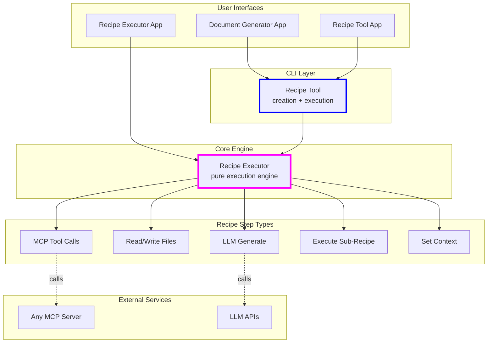
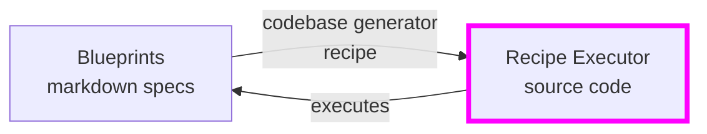

# Recipe Tool

**Turn natural language ideas into reliable, automated workflows** - Recipe Tool transforms your ideas written in plain English into executable "recipes" that orchestrate complex multi-step workflows. Write what you want to accomplish, and Recipe Tool generates the JSON recipe that makes it happen - reproducibly and reliably.

**NOTE** This project is a very early, experimental project that is being explored in the open. There is no support offered and it will include frequent breaking changes. This project may be abandoned at any time. If you find it useful, it is strongly encouraged to create a fork and remain on a commit that works for your needs unless you are willing to make the necessary changes to use the latest version. This project is currently **NOT** accepting contributions and suggestions; please see the [docs/dev_guidance.md](docs/dev_guidance.md) for more details.

[](LICENSE)

## From Ideas to Automated Workflows

Recipe Tool bridges the gap between natural language and automation:

1. **Start with an idea** - Write what you want in plain English/markdown
2. **Generate a recipe** - Recipe Tool creates a JSON workflow from your description
3. **Execute reliably** - The JSON recipe runs deterministically, combining LLM calls with structured logic

Think of recipes as the "compiled" version of your ideas - they capture your intent in a format that executes reliably every time, using "more code than model" for reproducible results.

## What are Recipes?

Under the hood, recipes are JSON files that define automated workflows. Each recipe contains:

- **Steps** that execute in sequence (or in parallel)
- **Context** that flows between steps, accumulating results
- **Templates** using Liquid syntax for dynamic content
- **Rich step types**: LLM generation, file I/O, tool calls, conditionals, loops, sub-recipes

Here's what gets generated when you ask to "read a file and create a summary":

```json
{
  "name": "summarize_file",
  "steps": [
    {
      "step_type": "read_files",
      "paths": ["{{ input }}"]
    },
    {
      "step_type": "llm_generate",
      "prompt": "Summarize this content:\n\n{{ file_contents[0] }}"
    },
    {
      "step_type": "write_files",
      "files": [
        {
          "path": "summary.md",
          "content": "{{ llm_output }}"
        }
      ]
    }
  ]
}
```

Example use cases:

- 📝 Generate complete documents from outlines
- 🔧 Transform natural language ideas into executable recipes
- 💻 Generate code from specifications (this project generates its own code!)
- 🔄 Automate complex multi-step workflows
- 🤖 Create AI-powered automation pipelines

## Quick Start

```bash
# Clone and install
git clone https://github.com/microsoft/recipe-tool.git
cd recipe-tool
make install

# Try an example recipe
recipe-tool --execute recipes/example_simple/code_from_spec_recipe.json \
   spec_file=recipes/example_simple/specs/hello-world-spec.txt
```

See more examples in [recipes](recipes/) directory.

## Architecture

The system is built as a layered architecture where each layer adds capabilities:



### Self-Generating Architecture

The Recipe Executor's code is entirely generated from markdown blueprints using the codebase generator recipe. This "self-hosting" demonstrates the framework's power - it can build itself!



## Core Components

### Execution Layer

- **Recipe Executor** (`recipe-executor/`) - Pure execution engine for JSON recipes. This is the foundation that executes recipe steps including LLM calls, file operations, and flow control.
- **Recipe Tool** (`recipe-tool/`) - Adds recipe creation capabilities on top of Recipe Executor. Can generate new recipes from natural language descriptions.

### User Interfaces

- **Document Generator App** (`apps/document-generator/`) - Specialized UI for document creation workflows with live preview
- **Recipe Executor App** (`apps/recipe-executor/`) - Debug-focused interface for recipe execution with step-by-step visibility
- **Recipe Tool App** (`apps/recipe-tool/`) - Full-featured UI combining recipe creation and execution with MCP server integration

### MCP Servers

These servers expose functionality via the Model Context Protocol:

- **Recipe Tool MCP Server** (`mcp-servers/recipe-tool/`) - Exposes the recipe-tool CLI functionality (execute/create) as MCP tools for AI assistants
- **Python Code Tools MCP** (`mcp-servers/python-code-tools/`) - Provides Python linting capabilities using Ruff for AI assistants to lint code snippets or entire projects

## Installation

### Prerequisites

- **`uv`** - Python dependency management ([install guide](https://github.com/astral-sh/uv))
- **`GitHub CLI`** - For ai-context-files tool ([install guide](https://cli.github.com/))
- **Azure CLI** (optional) - For Azure OpenAI with Managed Identity ([install guide](https://docs.microsoft.com/cli/azure/install-azure-cli))

### Setup Steps

```bash
# 1. Clone the repository
git clone https://github.com/microsoft/recipe-tool.git
cd recipe-tool

# 2. Configure environment (optional)
cp .env.example .env
# Edit .env to add your OPENAI_API_KEY and other API keys

# 3. Install all dependencies
make install

# 4. Activate virtual environment
source .venv/bin/activate    # Linux/Mac
# OR: .venv\Scripts\activate  # Windows

# 5. Verify installation
recipe-tool --help
```

## Usage Guide

### Basic Workflow

1. **Write your idea** in natural language (markdown file):

```markdown
# Analyze Code Quality

Read all Python files in the project and:

1. Count lines of code per file
2. Identify files with no docstrings
3. Create a report with recommendations
```

2. **Generate a recipe** from your idea:

```bash
recipe-tool --create code_quality_idea.md
# Creates: output/analyze_code_quality.json
```

3. **Execute the recipe** (now it's reproducible!):

```bash
recipe-tool --execute output/analyze_code_quality.json project_path=./myproject
```

### Direct Execution

If you already have JSON recipes:

```bash
# Execute with context variables
recipe-tool --execute recipes/example_simple/test_recipe.json model=azure/gpt-4o
```

### Web Interfaces

For a more visual experience:

```bash
recipe-tool-app          # Full UI for creation and execution
recipe-executor-app      # Debug-focused execution UI
document-generator-app   # Document workflow UI
```

### Advanced Workflows

#### Code Generation from Blueprints

The Recipe Executor generates its own code:

```bash
# Generate all Recipe Executor code
recipe-tool --execute recipes/codebase_generator/codebase_generator_recipe.json

# Generate specific component
recipe-tool --execute recipes/codebase_generator/codebase_generator_recipe.json \
   component_id=steps.llm_generate
```

#### Document Generation

Create structured documents from outlines:

```bash
recipe-tool --execute recipes/document_generator/document_generator_recipe.json \
   outline=path/to/outline.json
```

#### MCP Server Integration

For AI assistants (Claude Desktop, etc.):

```bash
# Recipe capabilities via MCP
recipe-tool-mcp-server stdio              # For Claude Desktop
recipe-tool-mcp-server sse --port 3002    # For HTTP clients

# Python linting via MCP
python-code-tools stdio
```

## Recipe Catalog

### 🔨 Code Generation Recipes

- **Codebase Generator** (`recipes/codebase_generator/`) - Transforms markdown blueprints into working code

  - Used to generate the Recipe Executor itself!
  - Sub-recipes for component processing and code generation

- **Blueprint Generators** (`recipes/experimental/blueprint_generator_v*/`) - Creates blueprints from ideas
  - Multiple versions exploring different approaches
  - Generates component specifications and documentation

### 📄 Document Creation Recipes

- **Document Generator** (`recipes/document_generator/`) - Creates documents from structured outlines
  - Handles multi-section documents with resource loading
  - Supports markdown output with live preview in UI

### 🛠️ Utility Recipes

- **Recipe Creator** (`recipes/recipe_creator/`) - Generates recipes from natural language descriptions

  - Core functionality of the recipe-tool CLI
  - Analyzes ideas and creates executable JSON recipes

- **File Generation** (`recipes/utilities/`) - Various file processing utilities
  - Generate content from file collections
  - Template-based file creation

### 📚 Example Recipes

- **Simple Examples** (`recipes/example_simple/`) - Basic recipe patterns
- **Complex Examples** (`recipes/example_complex/`) - Advanced workflows with sub-recipes
- **Template Examples** (`recipes/example_templates/`) - Using Liquid templates
- **MCP Examples** (`recipes/example_mcp_step/`) - MCP server integration
- **Content Writer** (`recipes/example_content_writer/`) - LLM content generation

## Development

### Getting Started

```bash
# Workspace commands
make help              # Show all available commands
make workspace-info    # Show project structure
make doctor           # Check workspace health

# Code quality
make lint             # Run linting
make format           # Format code
make test             # Run tests

# AI development
make ai-context-files # Generate context for AI assistants
```

### VSCode Integration

The project includes a comprehensive VSCode workspace configuration:

- Multi-root workspace organized by project type
- Pre-configured Python paths and testing
- Ruff integration for code quality
- Recommended extensions

```bash
code recipe-tool-workspace.code-workspace
```

### Self-Generating Code

The Recipe Executor generates its own code from blueprints:

1. **Write blueprints** in `blueprints/recipe_executor/components/`
2. **Run generator** `recipe-tool --execute recipes/codebase_generator/codebase_generator_recipe.json`
3. **Code is generated** in `recipe-executor/`

This demonstrates the power of the modular approach - the tool builds itself!

## Philosophy & Design

This project embodies a modular, AI-driven approach to software development:

- **Modular Design**: Small, self-contained components with clear interfaces
- **AI-First Development**: Components are generated from specifications
- **Regeneration over Editing**: Prefer regenerating components to manual edits
- **Human as Architect**: Humans design specifications, AI builds the code

See [ai_context/MODULAR_DESIGN_PHILOSOPHY.md](ai_context/MODULAR_DESIGN_PHILOSOPHY.md) and [ai_context/IMPLEMENTATION_PHILOSOPHY.md](ai_context/IMPLEMENTATION_PHILOSOPHY.md) for detailed philosophy.

## License

This project is licensed under the MIT License - see the [LICENSE](LICENSE) file for details.

## Contributing

This project is currently **NOT** accepting contributions and suggestions; please see the [dev_guidance.md](docs/dev_guidance.md) for more details.

Most contributions require you to agree to a
Contributor License Agreement (CLA) declaring that you have the right to, and actually do, grant us
the rights to use your contribution. For details, visit https://cla.opensource.microsoft.com.

When you submit a pull request, a CLA bot will automatically determine whether you need to provide
a CLA and decorate the PR appropriately (e.g., status check, comment). Simply follow the instructions
provided by the bot. You will only need to do this once across all repos using our CLA.

This project has adopted the [Microsoft Open Source Code of Conduct](https://opensource.microsoft.com/codeofconduct/).
For more information see the [Code of Conduct FAQ](https://opensource.microsoft.com/codeofconduct/faq/) or
contact [opencode@microsoft.com](mailto:opencode@microsoft.com) with any additional questions or comments.

## Trademarks

This project may contain trademarks or logos for projects, products, or services. Authorized use of Microsoft
trademarks or logos is subject to and must follow
[Microsoft's Trademark & Brand Guidelines](https://www.microsoft.com/en-us/legal/intellectualproperty/trademarks/usage/general).
Use of Microsoft trademarks or logos in modified versions of this project must not cause confusion or imply Microsoft sponsorship.
Any use of third-party trademarks or logos are subject to those third-party's policies.
