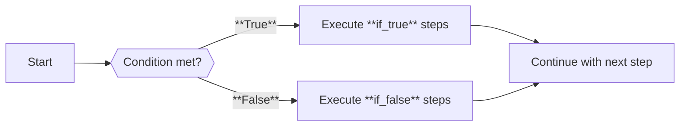
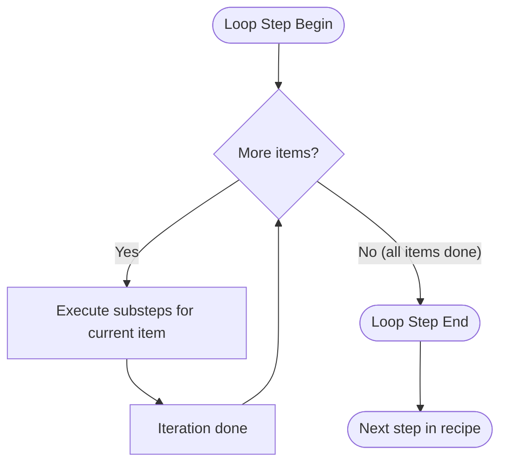
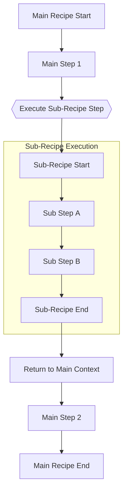

# Creating Effective JSON Recipes for the Recipe Executor

## Introduction

The **Recipe Executor** uses structured JSON files (called _recipes_) to orchestrate complex workflows. Each recipe contains a sequence of steps that the executor will run in order, using a shared _context_ to pass data between steps. Recipes can range from simple linear tasks to complex flows with conditional branches, loops, and even nested sub-recipes. This guide will explain how to craft effective `.json` recipes, covering basic structure, dynamic templating with Liquid, and advanced patterns like conditionals, looping, and composition of sub-recipes. The goal is to help both human developers and AI assistants understand and create recipes that are correct, efficient, and easy to maintain.

## Basic Recipe Structure

A recipe is defined as a JSON object with a top-level `"steps"` array. Each entry in the array is a step object containing at minimum a `"type"` (the kind of operation to perform) and a `"config"` (parameters for that step). Steps execute in sequence by default, sharing a mutable **context** (a dictionary-like state) that persists throughout the recipe execution. Here's a simple example of a minimal recipe with one step:

```json
{
  "steps": [
    {
      "type": "execute_recipe",
      "config": {
        "recipe_path": "subtasks/hello_world.json"
      }
    }
  ]
}
```

In this example, the single step is of type **`execute_recipe`**, which calls another recipe file. Generally, however, a basic step might perform a direct action (like reading a file or calling an LLM). The JSON format enforces a clear separation of _what_ each step does (`"type"`) and _how_ it is configured (`"config"`). This structure makes recipes self-documenting and easier to validate. The executor will load each step, verify the type is known, and then run it with the given config. If an unknown step type is encountered, execution fails fast with an error, so it's important to use valid step types.

**Context and Data Flow:** The context is the mechanism for passing information between steps. Steps can read from and write to the context by using keys (much like variables). For example, a file-reading step might store file content under a key, and a subsequent LLM step can include that content in its prompt via templating. You can also initialize context values when invoking the recipe (e.g. via command-line arguments `recipe-tool --execute recipe.json key=value`). All steps in the recipe share the same context object (except where isolated copies are used, e.g. in parallel or loop iterations as discussed later). This means earlier steps can prepare data for later steps, and later steps can refer back to results from earlier steps.

## Working with Objects Between Recipe Steps

### Context Object Passing

When passing data between recipe steps in the Recipe Executor, objects are passed by reference in their native format. This means:

```json
"context_overrides": {
  "some_object": "{{ variable_name }}"
}
```

The object is passed directly without requiring conversion to a string format.

### Common Mistakes

#### ❌ Incorrect: Using a "json" filter

```json
"context_overrides": {
  "some_object": "{{ variable_name | json }}"  // Error: "json" filter doesn't exist
}
```

#### ✅ Correct: Direct reference

```json
"context_overrides": {
  "some_object": "{{ variable_name }}"  // Passes the object directly
}
```

### When to Use Serialization

For most object passing between steps, no serialization is needed. The Recipe Executor handles complex objects automatically.

If you specifically need a JSON string representation within a template (rare), use the Liquid template features directly to access the object properties:

```json
"prompt": "Data: {{ variable_name.property1 }}, {{ variable_name.property2 }}"
```

### Reading Files as Objects

When reading JSON files, use the `merge_mode: "dict"` option to automatically parse them as objects:

```json
{
  "type": "read_files",
  "config": {
    "path": "path/to/file.json",
    "content_key": "my_data",
    "merge_mode": "dict" // Parses JSON into an object automatically
  }
}
```

## Using Liquid Templating for Dynamic Content

To make recipes dynamic and reusable, the Recipe Executor supports **Liquid templating** in most string fields of step configs. Liquid is a templating language (similar to Jinja or Handlebars) that allows inserting context values and simple logic into strings. Before a step executes, any templated fields are rendered by substituting placeholders with actual values from the context.

**Basic syntax:** Use `{{ ... }}` to insert the value of a context variable, and `` for control logic (conditions and loops) within the template text. For example, if the context has `"name": "World"` and `"count": 42`, a template string:

```liquid
"Hello, {{ name }}! You have {{ count }} messages."
```

will render to `"Hello, World! You have 42 messages."`. Any keys present in the context (including nested objects) can be referenced by name. You can even access nested dictionary fields with dot notation (e.g. `{{ user.profile.email }}` if `context["user"]["profile"]["email"]` exists).

**Filters and defaults:** Liquid filters can transform values. One common filter is `default`, which provides a fallback if a value is empty or not set. For instance:

```json
"filepath": "{{ recipe_root | default: 'recipes/default' }}/setup.json"
```

uses `recipe_root` from context if available; otherwise it falls back to the string `'recipes/default'`. This ensures the path is valid even if a certain context variable isn't provided.

**Conditional logic in templates:** Although the Recipe Executor offers dedicated step types for logic (like the `conditional` step, described later), you can also do minor conditional formatting directly in templates if needed. Liquid supports `` blocks within strings. For example:

```liquid
"{{ user_count }} users online."
```

would pluralize "user" based on the value of `user_count`. You can also loop in templates with ` ... ` if constructing a string from a list. However, for more complex control flow affecting which steps run, it’s better to use the recipe’s `conditional` or `loop` steps instead of large template logic.

**Tip:** All context values are passed into the template renderer, so any key you set in context (from prior steps or initial inputs) is available for templating. If a variable is missing, Liquid will typically render it as an empty string (which can be controlled with filters or by providing defaults). This allows you to write flexible recipes that adapt to different context inputs without errors in string rendering. Just be mindful that templating happens at execution time – the JSON recipe itself should remain a valid template (with quotes around any templated strings as needed).

### **Embedding Additional Files with XML-Like Tags**

When a recipe passes large external documents (markdown specs, design notes, etc.) into an LLM prompt, wrap the content in an ALL-CAPS, XML-style tag so the model can easily locate—and safely ignore—those blocks when not needed.

```liquid
{
  "type": "llm_generate",
  "config": {
    "prompt": "
System instructions …

<ADDITIONAL_FILES>
{{ additional_files_content }}
</ADDITIONAL_FILES>

Now answer the user’s question using the main context above.
",
    "model": "{{ model | default: 'openai/gpt-4o' }}",
    "output_format": "text",
    "output_key": "answer"
  }
}
```

**Guidelines**

| Do                                                                           | Why                                                                                            |
| ---------------------------------------------------------------------------- | ---------------------------------------------------------------------------------------------- |
| **Tag name = purpose** (e.g., `<SPEC>`, `<DOCS>`, `<EXAMPLES>`).             | Makes the prompt self-documenting and lets downstream tools strip or target specific sections. |
| **Use ALL CAPS**.                                                            | Stands out visually and is easy for regex filters (`/<[A-Z_]+>/`).                             |
| **Put each tag on its own line** (no inline embedding).                      | Prevents accidental whitespace trimming and keeps diff-views clean.                            |
| **Treat the block as opaque**—no other Liquid syntax **inside** the wrapper. | Avoids double-templating or partial renders.                                                   |
| **Close every tag** (`</TAG>`).                                              | Prevents malformed prompt errors in some models.                                               |

**When to use**

- Any step that streams _large_ file blobs into a prompt (`read_files → llm_generate` pattern).
- Passing multi-file roll-ups (like `recipe_executor_code_files.md`) into the recipe-creator itself—wrap them once so nested sub-recipes don’t double-wrap.
- Sharing supplementary references that the model may consult but that humans will skip when skimming the prompt.

**Tip:** If you only need file _paths_ or short snippets, skip the wrapper and insert them inline. Reserve the XML-style blocks for content that would otherwise clutter or drown out the main instructions.

## Common Step Types and Configuration

Recipes support a variety of step types to perform different actions. Below, we outline the most common types, from basic operations to advanced flow control. Each step’s configuration is described with its main fields, and small examples illustrate usage. Remember that all string fields in the config support Liquid placeholders, enabling dynamic behavior.

### LLM Generation Step (`llm_generate`)

This step invokes a Large Language Model to generate text or other content. It's one of the powerful features that allow recipes to incorporate AI-generated results. Key config fields for **`llm_generate`** include:

- **`prompt`** – The prompt text to send to the LLM. This will usually be a templated string combining instructions with context data (e.g. content read from files or user input). _Example:_ `"prompt": "Summarize the following:\n{{file_text}}"`
- **`model`** – The identifier of the model to use (including provider if needed). Defaults to a model (for instance, `"openai/gpt-4o"` is a shorthand in this system). This can often be left as default or set via context if you want flexibility. _Example:_ `"model": "openai/gpt-4"` or using a context variable `"model": "{{ preferred_model }}"`
- **`max_tokens`** – _(Optional)_ The maximum number of tokens to generate. Can be an integer or a templated string that evaluates to an integer. If not provided, the model’s default or a safe limit is used.
- **`output_format`** – Specifies the format of the LLM's output. This can be:
  - `"text"` for plain text output (the result will be a string),
  - `"files"` for file-like output (the model is expected to return content for one or more files, and the executor will interpret it as a list of files),
  - A JSON schema (as a Python dict or list) describing the structure of the expected output. Using a schema guides the model to return JSON which the executor will parse into Python objects (via Pydantic). This is advanced usage for structured outputs.
- **`output_key`** – The context key under which to store the LLM's result. The default is `"llm_output"`, but you should choose a descriptive key that other steps can reference. For example, if the LLM produces a summary, you might use `"output_key": "summary_text"`.

When the executor runs an `llm_generate` step, it will render the `prompt` and other fields with the current context, call the specified model, and then store the result in the context key. Subsequent steps can then use this output. For instance, to generate a summary of text and then save it to a file, you might have:

```json
{
  "type": "llm_generate",
  "config": {
    "prompt": "Summarize this:\n{{ file_content }}",
    "model": "openai/gpt-4",
    "output_format": "text",
    "output_key": "summary"
  }
}
```

This will put the summary text into `context["summary"]`. To actually write it out, a following step could reference `{{ summary }}` or use a file-writing step described next.

If `output_format` is `"files"`, the LLM is expected to return JSON describing file(s) (with fields like path and content). The executor will convert that into a list of file specifications (FileSpec objects) and store them. You can then use a `write_files` step with `files_key` pointing to that list to actually create the files on disk. This pattern is useful for multi-file generation. For example, an LLM prompt could ask for code files and return a JSON with file names and contents; the recipe can then write them all in one go.

> **Advanced:** If `output_format` is a JSON schema dict or a single-element list containing a schema, the LLM’s text output will be parsed against that schema. On success, the context will contain a structured Python object (dict/list) instead of raw text. This is helpful for enforcing a certain response shape (like a particular JSON with specified fields). Be cautious with this – if the model’s output cannot be parsed into the schema, the step will error. Always ensure your prompt makes the required format clear to the model.

### File Reading Step (`read_files`)

The **`read_files`** step reads one or multiple files from the filesystem and stores their contents into the context. It's typically used to bring external data (e.g. input documents, configuration files, code, etc.) into the recipe’s context so that subsequent steps (like LLM prompts) can use that data. Key fields in `read_files` config include:

- **`path`** – The path of the file to read. This can be a string (for a single file) or a list of strings for multiple files. It also accepts a comma-separated string of multiple file paths. Since this is templatable, you can use context variables here (for example, `"path": "{{ project_dir }}/README.md"`). All resolved paths should be relative to the working directory or absolute.
- **`content_key`** – The context key name under which the file content will be stored. For a single file, the raw content (as text or parsed data) will be stored. For multiple files, the type of stored content depends on `merge_mode` (see below).
- **`optional`** – A boolean (default `false`) indicating if it's okay for the file to be missing. If `false` and the file is not found, the step errors and stops the recipe. If `true`, a missing file will simply be skipped with a warning, allowing the recipe to continue.
- **`merge_mode`** – How to handle multiple files. Options are:
  - `"concat"` (default): concatenate contents of all files into one text blob, separating them with a header or newline (the implementation prepends each content with the filename).
  - `"dict"`: produce a dictionary mapping each file path to its content.

When reading a single file, you generally don't need to worry about `merge_mode`. The content will be read as text (UTF-8) and the step will also attempt to parse JSON or YAML if the file extension indicates it (e.g. `.json` or `.yml` files will be loaded into Python objects if possible). If parsing fails or the extension is not recognized, the content is kept as plain text.

**Example usage:** Suppose you want to read an input file for analysis. You might have:

```json
{
  "type": "read_files",
  "config": {
    "path": "inputs/data.txt",
    "content_key": "data_text"
  }
}
```

After this step, `context["data_text"]` will contain the text from `inputs/data.txt`. If you had multiple input files, you could specify an array of paths or a comma-separated list, and adjust `merge_mode` if you need separate access to each. For example:

```json
{
  "type": "read_files",
  "config": {
    "path": ["notes/intro.md", "notes/ch1.md"],
    "content_key": "all_notes",
    "merge_mode": "concat"
  }
}
```

This would read both files. With `"concat"`, `context["all_notes"]` would contain a single string with both files' contents (with markers or newlines separating them), whereas with `"dict"` mode, `context["all_notes"]` would be a dictionary like `{ "notes/intro.md": "content...", "notes/ch1.md": "content..." }`.

### File Writing Step (`write_files`)

The **`write_files`** step takes content from the context and writes it to file(s) on disk. This is typically used after generating content (via LLM or by combining context data) to save the results. Its configuration can specify either direct file definitions or a reference to prepared file data. Key fields include:

- **`files`** – A list of file specifications to write, given directly in the recipe. Each entry in this list is an object that defines a file. You can provide:

  - a `"path"` with a literal file path or a `"path_key"` that names a context key containing the path.
  - a `"content"` with the content to write (string, potentially with templates) or a `"content_key"` that names a context key containing the content.

  Using `files` is useful if you know in advance which files to write and their content comes from known context keys or static text. For example, to write a greeting to `hello.txt` you could do:

  ```json
  {
    "type": "write_files",
    "config": {
      "files": [
        {
          "path": "output/hello.txt",
          "content": "Hello {{ user_name }}!"
        }
      ]
    }
  }
  ```

  This would render the content with the current `user_name` and create the file. You could also have `"content_key": "summary"` to write out the summary from the previous example.

- **`files_key`** – Alternatively, instead of specifying `files` inline, you can point to a context key that already contains file info. This context value could be:

  - a single FileSpec object or file dict (`{"path": ..., "content": ...}`),
  - a list of such objects/dicts (for multiple files).

  This is especially useful in combination with an LLM step that produced `files` output. For instance, if an LLM step stored a list of files to `context["generated_files"]`, you can simply do:

  ```json
  {
    "type": "write_files",
    "config": {
      "files_key": "generated_files"
    }
  }
  ```

  The step will retrieve that list and write each file. It supports both our internal FileSpec format and plain dicts with `path` and `content`.

- **`root`** – An optional base directory path under which to write the files. This is useful to avoid repetition of common prefixes. For example, setting `"root": "{{output_dir}}/reports"` and then having file paths be just filenames will cause them to be written under the `reports` directory (which could be a context variable). The `root` is also templated, so you can compute it from context (e.g., based on a project name or timestamp).

During execution, the write step will gather all file specs (from `files` and/or `files_key`), render any templated path or content strings with the current context, then write each file to disk. If directories in the path do not exist, it will attempt to create them. Overwriting existing files is allowed by default (you would need to handle backups or checks via a conditional step if you want to avoid overwriting).

**Example usage:** Continuing the summary example, if `context["summary"]` has the text, you could write it to a file like so:

```json
{
  "type": "write_files",
  "config": {
    "files": [
      {
        "path": "outputs/summary.txt",
        "content_key": "summary"
      }
    ]
  }
}
```

This looks at `context["summary"]` for the content (because we used `content_key`) and writes it to `outputs/summary.txt`. Alternatively, if an LLM step produced multiple files and stored them in `context["summary_files"]`, you can shorten the config to:

```json
{
  "type": "write_files",
  "config": { "files_key": "summary_files" }
}
```

The step will find that list and write each file accordingly.

### Conditional Step (`conditional`)

A **`conditional`** step introduces branching logic into the recipe. It evaluates a boolean condition and executes one set of sub-steps if the condition is true, or an alternate set if the condition is false. This allows recipes to adapt their behavior (e.g., skip certain actions if not needed, or choose between different subprocesses). The config for a conditional step has these fields:

- **`condition`** – A string expression that will be evaluated to determine true/false. This expression is first processed as a Liquid template against the current context (so it can include `{{ }}` placeholders), and then the result is interpreted as a boolean. The expression can be as simple as a single context variable or a literal `"true"`/`"false"`, or a more complex check (see below for examples).
- **`if_true`** – An object containing a `"steps"` array to execute if the condition evaluates to true. If the condition is true, these steps are executed in order, as a mini sub-recipe.
- **`if_false`** – (Optional) An object with a `"steps"` array to execute if the condition is false. If omitted and the condition is false, the conditional step simply does nothing (skips). You can provide this to handle the "else" case when needed.

The condition string can use context variables and a small set of allowed functions/operators. After templating, the executor will attempt to interpret the string as a Python boolean expression in a very restricted environment (no arbitrary code, only specific safe functions). Some **supported patterns** for `condition` include:

- **Context value checks:** You can directly put a context variable that is boolean or truthy, e.g. `"{{ is_ready }}"`, or compare it to a value, e.g. `"{{ count }} > 0"`, `"{{ status }} == 'done'"`. You can also check for null/unset by comparing to `null` (which will be interpreted appropriately).
- **File existence:** Use functions like `file_exists('path')` to check if a certain file exists on disk, `all_files_exist. These are built-in utilities for common file-based conditions.
- **Logical combinations:** The keywords `and(...)`, `or(...)`, `not(...)` let you combine conditions. For example, `"and({{ is_ready }}, {{ count }} > 0)"` yields true only if both subconditions are true. You can also nest file checks inside, e.g. `"or(file_exists('foo.txt'), file_exists('bar.txt'))"` to proceed if either file is present.
- **Templating in conditions:** Because the entire condition is templated first, you can even generate complex logic. For instance, you might set a context key to the string of an expression and then do `"{{ some_expr }}"` as the condition. However, more commonly you'll just insert variable values or paths as shown above. You can also use Liquid tags inside the condition string to choose the output. For example, the recipe might use:
  ```json
  "condition": "true{{ needs_processing }}"
  ```
  This would make the condition true if `mode` is `'force'` (ignoring the normal `needs_processing` flag). This kind of pattern is seen in recipes to override logic when a user forces an action.

**Example:** A conditional step in JSON looks like:

```json
{
  "type": "conditional",
  "config": {
    "condition": "{{ analysis_result.needs_splitting }}",
    "if_true": {
      "steps": [
        {
          "type": "execute_recipe",
          "config": { "recipe_path": "recipes/split_project.json" }
        }
      ]
    },
    "if_false": {
      "steps": [
        {
          "type": "execute_recipe",
          "config": { "recipe_path": "recipes/process_single_component.json" }
        }
      ]
    }
  }
}
```

In this snippet, the condition checks a context object `analysis_result` for a field `needs_splitting`. If true, it executes a sub-recipe to split a project, otherwise it executes a different sub-recipe. Notice the structure: `if_true.steps` and `if_false.steps` each contain an array of step definitions. You can put any number of steps there (even another conditional or loop), not just one.

The Conditional step will evaluate the expression and run the appropriate branch. Only one branch’s steps will run, and the other is skipped entirely. After the branch steps complete (or immediately if none executed), the main recipe continues to the next step after the conditional.

**Flow diagram:** The following flowchart illustrates how a conditional step routes execution:



In a recipe, the "next step" after the conditional will run only after whichever branch (if any) has completed. If a branch itself contains multiple steps, they all run sequentially within that branch.

**Tips for using conditionals:** Keep the condition expressions simple and based on readily available context data. The context could be set by a prior LLM step (e.g., you might run an analysis and set `needs_splitting` in context as a boolean), or by external input flags. Also consider using `conditional` to guard potentially expensive steps (like an LLM call or file writes) – for instance, only run them if certain prerequisites are met or if an output is outdated (using `file_is_newer` logic). This can make recipes more efficient by skipping unnecessary work.

### Loop Step (`loop`)

A **`loop`** step allows you to iterate over a collection of items and run a set of sub-steps for each item. This is essential for batch processing or repeating actions. For example, you might use a loop to process each file in a list, or to apply an LLM prompt to each element of an array of data. The loop step's config includes:

- **`items`** – A string that specifies the context value to iterate over. This should be the key (or a dot-notation path) of a list or dictionary in the context. The loop will retrieve `context[items]` (or a nested field) to get the collection. If the context value is not found or not a list/dict, the loop step will error out. For example, `"items": "user_list"` expects `context["user_list"]` to be a list of items.
- **`item_key`** – The name of the variable under which each item will be placed into the sub-context. Inside the loop’s sub-steps, this key will represent the current item. For instance, if `item_key` is `"user"`, then within each iteration's steps `{{ user }}` will refer to the current item from the list.
- **`substeps`** – An array of step definitions to execute for each item. These are just like the top-level steps, but they will run in an isolated context for each item (to prevent cross-item interference, each iteration gets a clone of the main context). You can have multiple steps here, including nested conditionals or even loops inside loops (if needed).
- **`result_key`** – The context key where the loop’s aggregated results will be stored. After all iterations, the loop collects an output from each iteration and stores them as a list (if the original collection was a list) or a dictionary (if the original was a dict) under this key. By default, the "result" of each iteration is the final state of the `item_key` in that iteration's context (which might be modified by the substeps). If the substeps don't modify the item, the result will just be the original item value. This allows the loop to return a transformed list or a filtered list, etc., depending on what the substeps do.
- **`max_concurrency`** – (Optional) How many iterations to run in parallel at most. Default is `1` (meaning sequential execution). If you set this to a value >1 or 0, the loop can process multiple items concurrently, which can speed up execution for independent tasks. `0` is treated as "no limit" (all items in parallel). Use this carefully: not all tasks are safe to parallelize, but things like multiple LLM calls or file reads might be.
- **`delay`** – (Optional) A delay in seconds between launching iterations. This is only relevant if `max_concurrency` allows parallelism; it can stagger the start of each iteration by the given amount to avoid bursts (e.g., rate limiting API calls).
- **`fail_fast`** – (Optional) A boolean (default `true`) that decides error handling. If `true`, the loop will stop at the first iteration that fails (propagating the error). If `false`, it will continue processing all items and collect any errors. Errors for each item are stored in a separate context key (the loop will put errors in `result_key__errors`). This is useful if you want a loop to try everything and then handle failures gracefully after.

**Example:** Consider we have a context variable `components` which is a list of component objects, each with fields `id`, `name`, and `description`. We want to generate some content for each component (say, a list of questions about that component) and then write each to a file. A loop step could look like:

```json
{
  "type": "loop",
  "config": {
    "items": "components",
    "item_key": "component",
    "substeps": [
      {
        "type": "llm_generate",
        "config": {
          "prompt": "Generate 3 questions about the component:\nName: {{ component.name }}\nDescription: {{ component.description }}",
          "model": "{{ model }}",
          "output_format": "files",
          "output_key": "component_questions"
        }
      },
      {
        "type": "write_files",
        "config": {
          "root": "outputs/components/{{ component.id }}",
          "files_key": "component_questions"
        }
      }
    ],
    "result_key": "processed_components"
  }
}
```

In this loop config, `"items": "components"` means it will iterate over the list at `context["components"]`. Each iteration will set `{{ component }}` to one of the items (each item presumably a dict with `name` and `description`). The substeps do two things for each component: call the LLM to generate questions (storing them under `"component_questions"`) and then write those questions to files under an output folder named after the component’s id. We set `"result_key": "processed_components"` so that after the loop, we might get something like `context["processed_components"]` being a list of results for each component. In this case, because our substeps didn't explicitly set `component` to a new value, the result might just mirror the input list or contain some indicator of success. If we wanted to collect, say, the paths of the generated files, we could modify the substeps to output such info into `component` or another context key.

Within the loop’s substeps, you can use all the normal steps. The context available to those substeps includes:

- `component` (in this example) – the current item.
- `__index` – the index of the item (for list iteration, starting at 0).
- `__key` – the key of the item (if iterating over a dict).
- All the original context values from outside the loop (they are cloned into the iteration’s context). Changes made to context inside the substeps do _not_ affect the outside (except for the aggregated result and errors mentioned).

**Loop execution flow:** For clarity, here's a conceptual diagram of how a loop step works:



Each item is processed in sequence (or in parallel if configured) in an isolated context. After processing all items, the loop step itself finishes, and the recipe continues. The loop step takes care of collecting results and errors before moving on.

**Parallel loops:** If you set `max_concurrency` > 1, the loop will launch up to that many iterations concurrently. This can drastically speed up tasks like multiple independent LLM calls. The code ensures that even in parallel, each iteration works on a cloned context so they don't interfere. However, be cautious with parallelism if substeps perform heavy disk I/O or use a lot of memory, as those effects add up. Also, if order matters (for example, writing to the same file from multiple iterations), parallel could cause race conditions – in such cases keep it sequential.

**Fail-fast vs collect errors:** By default, if any iteration raises an error, the loop will abort immediately (fail fast). This is usually fine if an error means continuing is pointless (e.g., a critical resource missing). But if you want to attempt all iterations regardless and handle partial failures, set `"fail_fast": false`. Then the loop will try every item, and any errors will be stored in `result_key__errors` in context, while successful results still go into `result_key`. You could then examine that after the loop (maybe with a conditional step to decide what to do if there were errors).

### Execute-Recipe Step (`execute_recipe`)

The **`execute_recipe`** step allows one recipe to call another as a subroutine. This is very powerful for composing complex workflows out of smaller, reusable recipes. Instead of writing one giant recipe, you can factor out portions into their own JSON recipes and call them as needed. The `execute_recipe` step’s config includes:

- **`recipe_path`** – The filesystem path to the other recipe (JSON file) to execute. This path can be templated. Often, recipes reside in a known directory, so you might see something like `"recipe_path": "{{ recipe_root }}/my_subrecipe.json"`, where `recipe_root` is a context variable pointing to the recipes directory. The executor will attempt to load this JSON recipe file and run it.
- **`context_overrides`** – An object for injecting or overriding context values when the sub-recipe starts. The key-value pairs you put here will be set in the sub-recipe’s context (after templating their values with the current context). This is akin to passing arguments to a function. For example, if your sub-recipe expects a context key `"user_id"`, you can supply `"context_overrides": { "user_id": "{{ customer_id }}" }` to pass the caller’s `customer_id` value as `user_id` in the sub-recipe.

When executed, this step will synchronously run the entire sub-recipe using (by default) the _same context object_ as the caller. Importantly, because the context is (by default) shared, any changes the sub-recipe makes to context will persist when control returns to the main recipe. This is how sub-recipes can produce outputs for the caller. The `context_overrides` are applied _before_ running the sub-recipe, but after the sub-recipe finishes, the context values remain whatever the sub-recipe set. Think of it as calling a function that operates on a global state, optionally with some parameters overridden.

If the sub-recipe file cannot be found at the given path, the step will error and stop execution, so ensure the path is correct or use templating with defaults to guarantee a valid path.

**Use cases:** Break complex tasks into smaller recipes. For instance, you might have a main recipe that coordinates high-level flow (maybe iterating over projects) and for each item it calls a `generate_report.json` sub-recipe to handle the detailed steps of generating a report for that item. This keeps each JSON recipe focused and manageable. It also allows reusing sub-recipes in different contexts. Another use case is having a setup or teardown recipe that you conditionally call.

**Example:** A step to execute a sub-recipe might look like:

```json
{
  "type": "execute_recipe",
  "config": {
    "recipe_path": "recipes/helpers/cleanup.json",
    "context_overrides": {
      "target_dir": "{{ output_dir }}",
      "dry_run": "false"
    }
  }
}
```

This would load `recipes/helpers/cleanup.json` and run it. Before running, it ensures that in the sub-recipe’s context, `target_dir` is set to the caller’s `output_dir`, and `dry_run` is set to `"false"` (as a string; if the sub-recipe expects a boolean, it would interpret `"false"` accordingly or you could omit quotes to pass as a raw boolean if the context supports that). During the sub-recipe execution, any context changes it makes (like deleting files, or adding a key like `cleanup_status`) will reflect back in the main recipe’s context once this step is done. After the sub-recipe completes, the main recipe continues to the next step.

One thing to note: an `execute_recipe` can be thought of like an included workflow. If a sub-recipe itself has multiple steps (which it usually does), those all run within this one step of the caller. If a sub-recipe fails (throws an error in one of its steps), that error will bubble up and typically cause the main recipe to fail (unless that call was inside a `conditional` or loop that traps it). So design your sub-recipes to either handle their errors or be okay with aborting the parent if something goes wrong.

**Composition and flow:** Using `execute_recipe` enables hierarchical recipe structures. You can have a _master recipe_ that calls various _sub-recipes_, which in turn could call sub-sub-recipes, etc. This kind of composition fosters reuse (write common routines once) and clarity (the master recipe is higher-level). Below is a visual depiction of a main recipe calling a sub-recipe:



In this diagram, when the main recipe reaches the _Execute Sub-Recipe_ step, it transfers control into the sub-recipe. The sub-recipe runs its steps (A, B, etc.) to completion, then returns control to the main recipe, which continues with its next steps. All along, the context has been continuous (with overrides possibly set at sub-recipe start). The main recipe can thus use results produced by the sub-recipe in `step2` or later.

**Tips:** Use meaningful context keys in `context_overrides` to document what the sub-recipe expects. If a sub-recipe is meant to be reusable, treat certain context keys as its "parameters" and clearly note in comments or naming what it needs. Also, avoid extremely large context objects when calling sub-recipes if possible – since context is passed by reference, a very large context (e.g., containing huge texts) is not copied but still, each step working with it might incur overhead. Sometimes it's cleaner to have the sub-recipe read files itself rather than passing large content via context, depending on the scenario.

### Parallel Step (`parallel`) _(Advanced)_

> **Note:** The `parallel` step is an advanced control flow feature. If you're just starting, you might skip this on first read. We include it for completeness in complex recipe patterns.

A **`parallel`** step is similar to a loop in that it executes multiple sub-steps, but instead of iterating over data, it simply runs a defined set of sub-steps concurrently. Think of it as a way to launch a bunch of tasks in parallel and wait for all to finish. Its config fields are straightforward:

- **`substeps`** – A list of step definitions to execute in parallel. These can be any steps (LLM calls, file ops, even nested loops or conditionals).
- **`max_concurrency`** – The maximum number of substeps to run at the same time. If you list 5 substeps and set `max_concurrency: 2`, it will run two at a time, starting a new one each time one finishes, until all are done. If 0 or omitted, it defaults to no limit (all substeps launched together).
- **`delay`** – Delay in seconds between launching substeps (useful to stagger start times as with loop).

When executed, the `parallel` step will spawn each sub-step with its own cloned context (just like loop iterations do) so that they don't interfere with each other. It does not collect results the way a loop does (since there's no single collection of items to map outputs onto), but any changes to context within those substeps will be lost when they finish (because they ran in isolated contexts). Therefore, `parallel` is best used for steps whose effects are external (like writing to files, making API calls, etc.) or where you don't need to combine their outputs within the recipe context. If you do need outputs, one workaround is to have substeps write to files or a database, or use a common resource, which the main context can check afterward. But often, if you need to gather outputs, using a `loop` over data (which inherently collects results) might be more appropriate.

**Example use case:** Suppose you need to generate different sections of a report (introduction, body, conclusion) using the LLM and doing them in parallel would save time. You could prepare three prompts and run three `llm_generate` steps concurrently. A parallel step could look like:

```json
{
  "type": "parallel",
  "config": {
    "substeps": [
      {
        "type": "llm_generate",
        "config": { "prompt": "{{intro_prompt}}", "output_key": "intro" }
      },
      {
        "type": "llm_generate",
        "config": { "prompt": "{{body_prompt}}", "output_key": "body" }
      },
      {
        "type": "llm_generate",
        "config": { "prompt": "{{summary_prompt}}", "output_key": "summary" }
      }
    ],
    "max_concurrency": 3
  }
}
```

This would fire off three LLM calls. However, note that each runs in a cloned context, so each one will get a copy of the context state before execution, and update that copy. That means when they complete, the main context does **not** automatically have `intro`, `body`, `summary` keys set. In fact, in the current implementation, those results would be in their own contexts that are not merged back. To get around this in practice, one of the substeps could be a `write_files` that saves the output, or after the parallel step, you might have a `read_files` if the LLMs wrote to files. Another approach is to use a `loop` with concurrency (if you can structure your tasks as a loop over an array of tasks, the loop will merge results back).

In summary, `parallel` is a lower-level control for concurrency when you just want to fire-and-forget tasks. If you need to integrate outputs, you might need to do a bit of extra work, or simply use a `loop` with `max_concurrency` since that handles result collation.

### MCP Step (`mcp`) _(Advanced)_

Another advanced step type is `mcp`, which stands for making a request to a remote **MCP (Multi-Modal Content Provider or tool server)**. This is beyond typical recipe usage, but briefly: an `mcp` step can connect to an external tool server (via an MCP client) and invoke a tool or function on that server, then store the result in context. Its config includes a `server` specification (how to connect), a `tool_name`, `arguments` for the tool, and a `result_key` to store the response. This allows integration of the Recipe Executor with external systems (for example, if one had a server that can run code or perform specialized queries, the recipe can call it as a step). Using `mcp` requires that an MCP server is running and accessible. Since it’s a specialized usage, typical recipe authors will only use this if their environment includes such tool servers. The pattern would be:

```json
{
  "type": "mcp",
  "config": {
    "server": {
      /* connection info, e.g., host, port, type (stdio/sse) */
    },
    "tool_name": "some_tool",
    "arguments": { "param1": "{{ value1 }}", "param2": "literal" },
    "result_key": "tool_result"
  }
}
```

After execution, `context["tool_result"]` would hold the result (often a dictionary or text) returned by the tool. Error handling and details depend on the tool server. This is an advanced feature and for many scenarios, not needed. But it's good to know the system is extensible to integrate other AI or automation tools beyond the built-in steps.

## Best Practices and Patterns

Crafting effective recipes is not just about using individual steps, but about combining them elegantly. Here are some final tips and patterns for evolving basic recipes into complex ones:

- **Start simple, then expand:** Begin with a minimal recipe that achieves the core task in a straight line. For example, _read input -> generate output -> write output_. Once that works, consider where you might need conditions (e.g., skip generation if output exists), loops (process multiple inputs), or sub-recipes (break the task into logical parts). Adding one feature at a time and testing helps maintain correctness.
- **Use clear context keys:** Treat context like you would variables in code. Use descriptive names for keys (e.g., `user_profile`, `analysis_result`, `summary_text`). This makes the recipe self-explanatory and reduces mistakes when referencing them in templates. Avoid reusing the same key for different purposes within one recipe unless you intentionally want to override a value.
- **Leverage sub-recipes for reuse:** If you find yourself writing the same sequence of steps in multiple recipes, factor them into a sub-recipe and call it via `execute_recipe`. This avoids duplication and makes maintenance easier. For instance, a sequence that reads a config, calls an API, and parses results could be one recipe used by different higher-level workflows.
- **Keep prompts concise and contextual:** When using `llm_generate`, remember that the prompt is constructed from context. If your context already has a large text (say, the content of a file), and you directly include it via `{{ file_content }}` in the prompt, the LLM will see all that text. Ensure your prompt plus the inserted content stays within token limits of the model. If needed, break content into parts or instruct the LLM to handle chunks in a loop.
- **Test conditionals and loops thoroughly:** These control flows can be tricky. Check that your `condition` expressions actually evaluate to "true"/"false" as expected (watch out for strings vs booleans, etc.). For loops, test with empty lists, single-item lists, and multiple items to ensure the behavior (including result collection) is as you want. If a loop’s `result_key` is not needed, you still must provide one (you can use a name and just ignore it). You might use a name like `"tmp_results"` if you don't care to use the aggregated results.
- **Manage context size in long recipes:** Context persists through all steps and is passed into sub-recipes. If you accumulate a lot of data in it (like large texts, or big lists), be mindful of memory and performance. You might deliberately remove keys when no longer needed (there isn’t a special step type just to remove context keys, but an `execute_recipe` could call a tiny sub-recipe that purges keys, or an `llm_generate` could be used to summarize and replace large text with a summary).
- **Document your recipes:** While JSON is not as easily commented, you can include a key like `"description"` at the top level or within configs as a no-op field (the executor will likely ignore unknown fields in configs). Alternatively, if running through version control, accompany each recipe file with a README or comments in a surrounding context. For the benefit of AI assistants reading the recipe, clarity in naming and structure often suffices as documentation.

By following these practices, you can create recipes that are both robust and easy to understand/debug. Recipes empower you to automate multi-step processes that involve dynamic AI reasoning, file manipulation, and conditional decision-making – all through declarative JSON. As you gain familiarity, you'll find yourself composing basic steps into sophisticated workflows. And because the Recipe Executor uses a consistent format, both humans and AI systems can collaborate: humans can write or tweak recipes, and AI can be guided (using documentation like this guide) to generate new recipes given high-level instructions.

## Conclusion

This unified guide covered how to build JSON recipes from the ground up: starting with the basic structure of steps and context, then introducing dynamic content with Liquid templates, and finally exploring advanced patterns like conditional branches, looping over data, parallel execution, and recipe composition. The key to effective recipes is to combine these features in a logical way to solve your task while keeping the recipe readable. Use the examples and patterns here as building blocks. Whether you are a developer writing recipes directly, or an AI assistant tasked with generating a recipe, the principles remain the same. With practice, simple recipes can evolve into powerful automation scripts that save time and ensure consistency across complex tasks. Happy recipe crafting!
