**Creating UML to Mermaid Markdown**

The user needs a markdown document with simple examples of various UML diagrams mapped to mermaid syntax. I'll ensure each diagram type has a heading, a description, and a sample Mermaid syntax in a code block. The listed diagram types include everything from Class and Object Diagrams to Activity, Component, and ER Diagrams. I'll keep the examples simple and focused on teaching AI assistants how to understand this, ensuring the document is beginner-friendly. Ready to start!

**Creating UML to Mermaid Markdown**

The user asked for a concise markdown document that maps UML diagrams to Mermaid syntax. I’ll organize each diagram with a heading, a short description, and a corresponding mermaid code block. I’ll remove the "Support" column and include all types the user requested. Each section will be neatly separated with horizontal rules for clarity. I'll format it in a simple, shareable manner without citations or additional references. The end result will look like a clearly structured cheat sheet for easy understanding.

Thought for 9 seconds

Here’s a ready-to-share Markdown reference your AI assistants can use to map each UML diagram type into Mermaid syntax. Simply copy-and-paste each section into their prompts.

---

## Class Diagram

Use `classDiagram` to show classes, their members, and relationships.

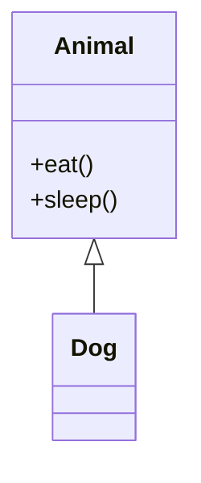

---

## Object Diagram

Also use `classDiagram` with `object` to show object instances and their attribute values.

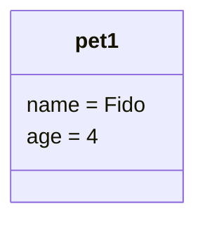

---

## Use Case Diagram

Approximate with a `flowchart` using ellipses for actors and use-cases.

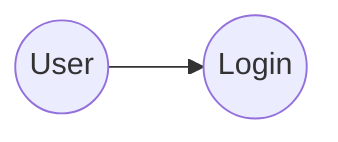

---

## Sequence Diagram

Native support via `sequenceDiagram`.

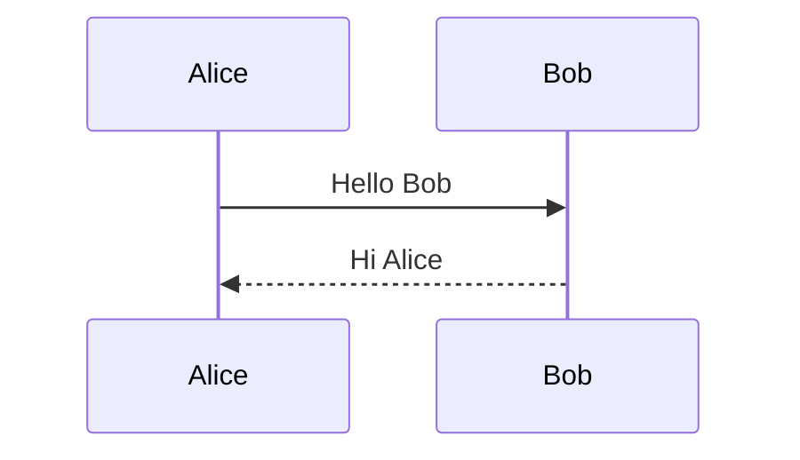

---

## Communication (Collaboration) Diagram

Also via `sequenceDiagram`; emphasize numbered messages.

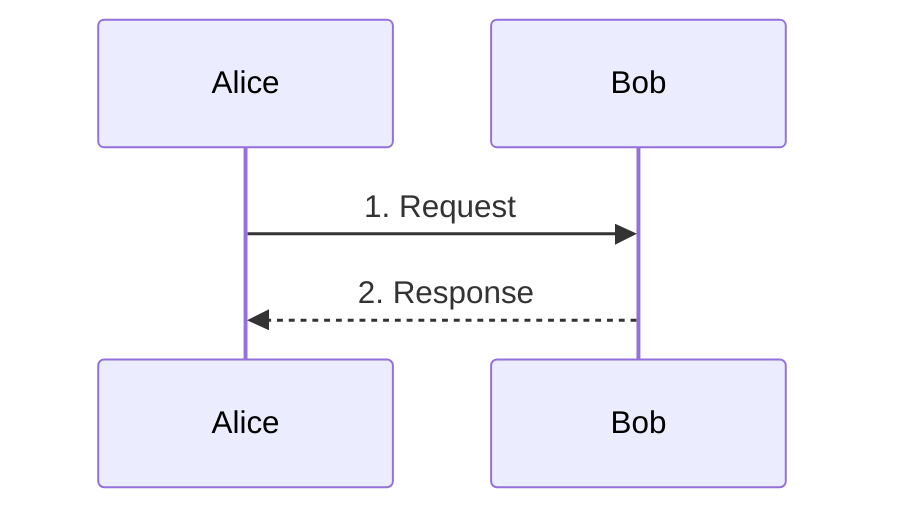

---

## State Machine Diagram

Native support via `stateDiagram`.

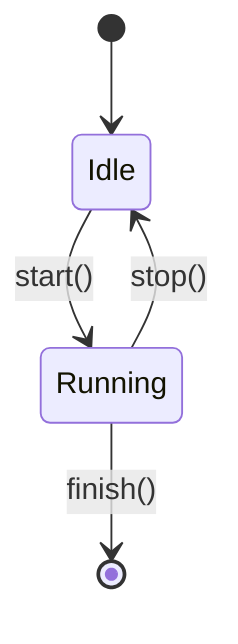

---

## Activity Diagram

Approximate with a `flowchart`, using decision --><|> arrows.

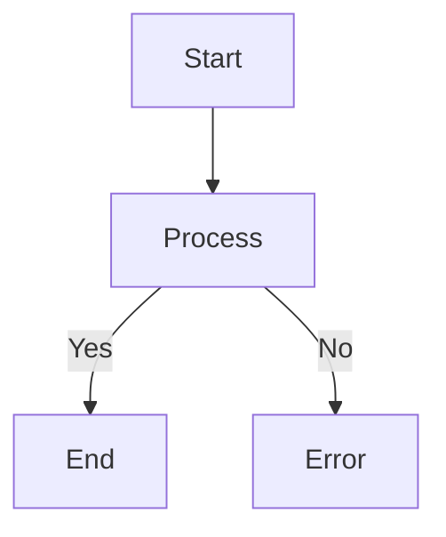

---

## Component Diagram

Use `flowchart` + `subgraph` to group components.

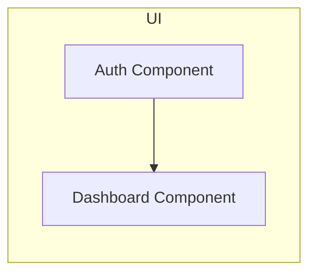

---

## Deployment Diagram

Also `flowchart` + `subgraph` to show nodes and deployment units.

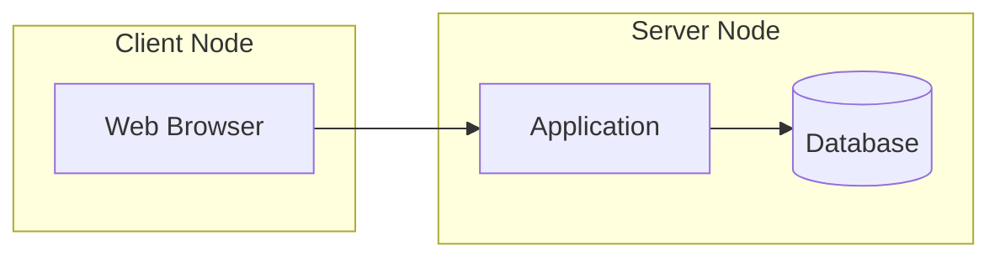

---

## Package Diagram

In `classDiagram`, use `package` blocks to group related classes.

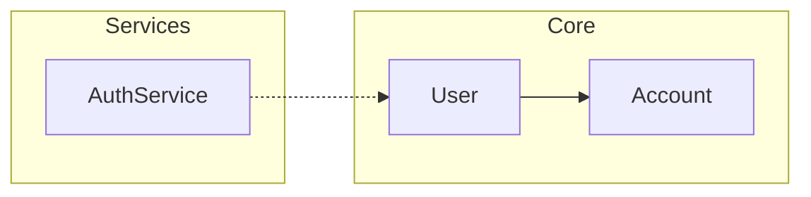

---

## Composite Structure Diagram

Show part-whole with composition arrows in a `classDiagram`.

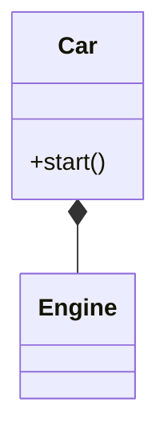

---

## Interaction Overview Diagram

Approximate with `flowchart` nodes that represent sub-sequences or activities.

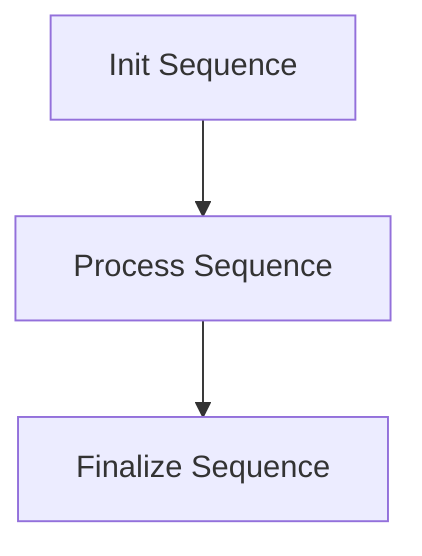

---

## Timing Diagram

Mermaid’s `timingDiagram` is experimental; you can also hack a `gantt` for simple timing charts:

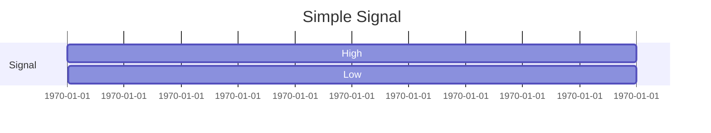

---

## Entity-Relationship (ER) Diagram

Native support via `erDiagram`.

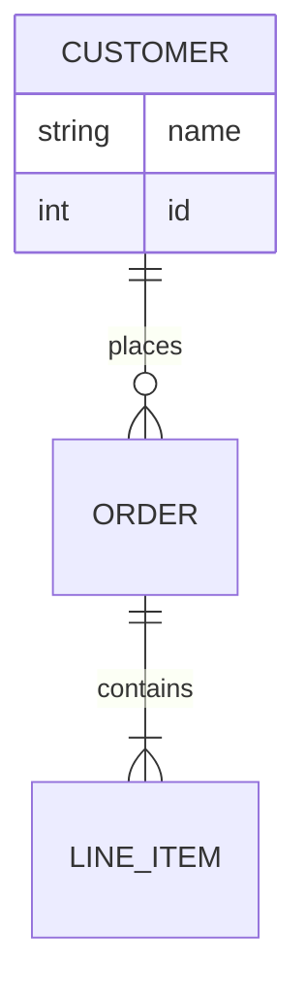

---

> **Tip:** when something isn’t supported natively, pick the closest chart (`flowchart`, `classDiagram`, or `gantt`) and add simple conventions (ellipses, `subgraph`, stereotypes, numbered edges) to approximate the UML look and feel.
