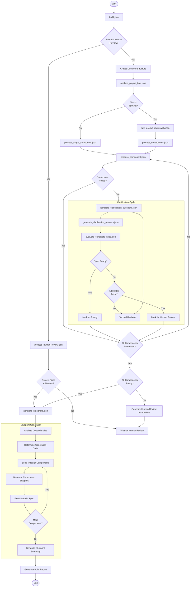

# recipes/experimental/blueprint_generator_v3

[collect-files]

**Search:** ['recipes/experimental/blueprint_generator_v3']
**Exclude:** ['.venv', 'node_modules', '.git', '__pycache__', '*.pyc', '*.ruff_cache']
**Include:** []
**Date:** 5/6/2025, 10:52:16 AM
**Files:** 23

=== File: recipes/experimental/blueprint_generator_v3/README.md ===
# Instructions for Testing the Blueprint Generator v3

This version of the Blueprint Generator is patterned after a prior version that was used to create an MVP for a platform service, but was previously stitched together with a bit of glue code. The goal of this version is to create a pure recipe version that can be used to generate blueprints for various projects.

## Setup Example

The following instructions will guide you through setting up a test project for the Blueprint Generator. This example uses a simplified Task Manager API specification to demonstrate the process. Replace the example with your own project specifications as needed.

1. Create a test directory structure:

   ```bash
   mkdir -p blueprint_test/{input,output}
   ```

2. Place high-level specification files in the `input` directory.

   ```bash
   # Create a sample Task Manager API specification
   nano blueprint_test/input/task_manager_spec.md
   ```

3. Make sure you have the necessary AI context files:
   ```bash
   # Ensure these files exist
   ls ai_context/COMPONENT_DOCS_SPEC_GUIDE.md
   ls ai_context/IMPLEMENTATION_PHILOSOPHY.md
   ls ai_context/MODULAR_DESIGN_PHILOSOPHY.md
   ```

## Run the Blueprint Generator

```bash
# From the repo root, run the blueprint generator with the test project
recipe-tool --execute recipes/experimental/blueprint_generator_v3/build.json \
  project_spec=blueprint_test/input/task_manager_spec.md \
  output_dir=blueprint_test/output/blueprint_generator_v3 \
  model=openai/o4-mini
```

## Expected Process Flow

1. **Initial Analysis**: The system should analyze the Task Manager API spec and determine it needs to be split into multiple components.

2. **Component Splitting**: It should identify approximately 4-5 components (authentication, task management, notifications, reporting).

3. **Clarification Cycle**: Some components will likely need clarification questions.

4. **Human Review**: At least one component might need human review.

5. **Blueprint Generation**: For components that pass evaluation, blueprints should be generated.

## Testing Human Review Process

When a component needs human review:

1. Check the `blueprint_test/output/human_review` directory for instructions.

2. Create a revised specification addressing the issues.

3. Run the process_human_review recipe:
   ```bash
   recipe-tool --execute recipes/experimental/blueprint_generator_v3/build.json \
     project_spec=blueprint_test/input/task_manager_spec.md \
     output_dir=blueprint_test/output \
     process_review=component_id \
     review_path=path/to/your/revised/spec.md \
     model=openai/o4-mini
   ```

## Check Progress

Throughout the process, you can monitor:

- `blueprint_test/output/status/project_status.json` for overall progress
- `blueprint_test/output/status/*_status.json` for individual component status
- `blueprint_test/output/analysis` for project analysis results
- `blueprint_test/output/clarification` for Q&A cycles
- `blueprint_test/output/evaluation` for evaluation results
- `blueprint_test/output/human_review` for human review instructions
- `blueprint_test/output/blueprints` for final blueprints

This test project is designed to exercise all parts of the blueprint generator while remaining small enough to process efficiently.


=== File: recipes/experimental/blueprint_generator_v3/build.json ===
{
  "steps": [
    {
      "type": "read_files",
      "config": {
        "path": "{{ project_spec }}",
        "content_key": "project_spec_content"
      }
    },
    {
      "type": "read_files",
      "config": {
        "path": "ai_context/COMPONENT_DOCS_SPEC_GUIDE.md",
        "content_key": "component_docs_spec_guide"
      }
    },
    {
      "type": "read_files",
      "config": {
        "path": "ai_context/IMPLEMENTATION_PHILOSOPHY.md",
        "content_key": "implementation_philosophy"
      }
    },
    {
      "type": "read_files",
      "config": {
        "path": "ai_context/MODULAR_DESIGN_PHILOSOPHY.md",
        "content_key": "modular_design_philosophy"
      }
    },
    {
      "type": "conditional",
      "config": {
        "condition": "truefalse",
        "if_true": {
          "steps": [
            {
              "type": "execute_recipe",
              "config": {
                "recipe_path": "recipes/experimental/blueprint_generator_v3/recipes/process_human_review.json",
                "context_overrides": {
                  "component_id": "{{ process_review }}",
                  "updated_spec_path": "{{ review_path }}",
                  "original_spec_path": "{{ original_spec_path | default: output_dir + '/components/' + process_review + '_spec.md' }}",
                  "output_dir": "{{ output_dir }}",
                  "model": "{{ model | default: 'openai/o4-mini' }}"
                }
              }
            },
            {
              "type": "read_files",
              "config": {
                "path": "{{ output_dir }}/status/project_status.json",
                "content_key": "project_status",
                "merge_mode": "dict",
                "optional": true
              }
            },
            {
              "type": "conditional",
              "config": {
                "condition": "{{ project_status.needs_human_intervention }}true",
                "if_false": {
                  "steps": [
                    {
                      "type": "execute_recipe",
                      "config": {
                        "recipe_path": "recipes/experimental/blueprint_generator_v3/recipes/generate_blueprints.json",
                        "context_overrides": {
                          "output_dir": "{{ output_dir }}",
                          "model": "{{ model | default: 'openai/o4-mini' }}"
                        }
                      }
                    }
                  ]
                }
              }
            }
          ]
        },
        "if_false": {
          "steps": [
            {
              "type": "llm_generate",
              "config": {
                "prompt": "Create necessary directories for the project in the output directory:\n\n- {{ output_dir }}/analysis - For analysis files\n- {{ output_dir }}/components - For component specifications\n- {{ output_dir }}/clarification - For clarification questions and answers\n- {{ output_dir }}/evaluation - For evaluation results\n- {{ output_dir }}/human_review - For human review files\n- {{ output_dir }}/blueprints - For blueprint files\n- {{ output_dir }}/reports - For report files\n- {{ output_dir }}/status - For status files\n\nConfirm directory structure is ready.",
                "model": "{{ model | default: 'openai/o4-mini' }}",
                "output_format": "text",
                "output_key": "directory_confirmation"
              }
            },
            {
              "type": "execute_recipe",
              "config": {
                "recipe_path": "recipes/experimental/blueprint_generator_v3/recipes/analyze_project_flow.json",
                "context_overrides": {
                  "output_dir": "{{ output_dir }}",
                  "model": "{{ model | default: 'openai/o4-mini' }}"
                }
              }
            },
            {
              "type": "conditional",
              "config": {
                "condition": "{{ analysis_result.needs_splitting }}",
                "if_true": {
                  "steps": [
                    {
                      "type": "execute_recipe",
                      "config": {
                        "recipe_path": "recipes/experimental/blueprint_generator_v3/recipes/split_project_recursively.json",
                        "context_overrides": {
                          "output_dir": "{{ output_dir }}",
                          "model": "{{ model | default: 'openai/o4-mini' }}",
                          "complete_all_splitting": true
                        }
                      }
                    },
                    {
                      "type": "conditional",
                      "config": {
                        "condition": "falsetrue",
                        "if_true": {
                          "steps": [
                            {
                              "type": "read_files",
                              "config": {
                                "path": "{{ output_dir }}/components/flattened_components_manifest.json",
                                "content_key": "components_json",
                                "merge_mode": "dict",
                                "optional": true
                              }
                            },
                            {
                              "type": "conditional",
                              "config": {
                                "condition": "truefalse",
                                "if_true": {
                                  "steps": [
                                    {
                                      "type": "execute_recipe",
                                      "config": {
                                        "recipe_path": "recipes/experimental/blueprint_generator_v3/recipes/process_components.json",
                                        "context_overrides": {
                                          "output_dir": "{{ output_dir }}",
                                          "model": "{{ model | default: 'openai/o4-mini' }}"
                                        }
                                      }
                                    }
                                  ]
                                },
                                "if_false": {
                                  "steps": [
                                    {
                                      "type": "read_files",
                                      "config": {
                                        "path": "{{ output_dir }}/components/components_manifest.json",
                                        "content_key": "components_json",
                                        "merge_mode": "dict"
                                      }
                                    },
                                    {
                                      "type": "execute_recipe",
                                      "config": {
                                        "recipe_path": "recipes/experimental/blueprint_generator_v3/recipes/process_components.json",
                                        "context_overrides": {
                                          "output_dir": "{{ output_dir }}",
                                          "model": "{{ model | default: 'openai/o4-mini' }}"
                                        }
                                      }
                                    }
                                  ]
                                }
                              }
                            }
                          ]
                        }
                      }
                    }
                  ]
                },
                "if_false": {
                  "steps": [
                    {
                      "type": "execute_recipe",
                      "config": {
                        "recipe_path": "recipes/experimental/blueprint_generator_v3/recipes/process_single_component.json",
                        "context_overrides": {
                          "output_dir": "{{ output_dir }}",
                          "model": "{{ model | default: 'openai/o4-mini' }}"
                        }
                      }
                    }
                  ]
                }
              }
            }
          ]
        }
      }
    },
    {
      "type": "llm_generate",
      "config": {
        "prompt": "Generate a build completion report:\n\nProject Specification: {{ project_spec }}\nOutput Directory: {{ output_dir }}\nHuman Review Processed: {{ process_review }}\nAnalysis Result: {{ analysis_result.needs_splitting }}Not available\n\nCreate a detailed report of what was done during this build process, including important paths and next steps.",
        "model": "{{ model | default: 'openai/o4-mini' }}",
        "output_format": "files",
        "output_key": "build_report"
      }
    },
    {
      "type": "write_files",
      "config": {
        "files_key": "build_report",
        "root": "{{ output_dir }}/reports"
      }
    }
  ]
}


=== File: recipes/experimental/blueprint_generator_v3/docs/DIAGRAM.md ===



=== File: recipes/experimental/blueprint_generator_v3/docs/OVERVIEW.md ===
# Blueprint Generation Recipe Overview

The Blueprint Generation Recipe transforms abstract project specifications into concrete implementation plans through a structured, intelligent workflow. This recipe bridges the gap between high-level concepts and actionable development blueprints by methodically analyzing requirements, decomposing complex projects into manageable components, and refining specifications through iterative evaluation. By combining automated processing with targeted human intervention when necessary, the recipe ensures that even complex technical initiatives can be systematically broken down into well-defined, implementable components with clear dependencies and interfaces.

## Diagram

[Blueprint Generation Recipe Flow Diagram](DIAGRAM.md)

## Process Flow

1. **Project Analysis**: The recipe analyzes the project spec, incorporating context files, reference files, and the two philosophy files to determine if the project needs to be split into components. If no splitting is needed, it proceeds to process as a single component.

   - **Project Spec**: This is the main specification file that outlines the project requirements, passed in from the user.
   - **Context Files**: These files provide additional context and guidelines for the project, such as:
     - Vision documents, mission documents, and project charters
     - Architecture documents, API specifications, and technical specifications
     - Design documents such as data flow diagrams, sequence diagrams, and class diagrams
     - User stories, user journeys, and use cases
     - Acceptance criteria, user interface designs, and user experience designs
   - **Reference Files**: These files contain relevant information that aids in understanding how to use the external dependencies for the project, such as:
     - API documentation, SDK documentation, and library documentation
     - Code examples, tutorials, and sample projects
     - Best practices, design patterns, and coding standards
     - Configuration files, environment setup instructions, and deployment guides
     - Test cases, test plans, and test data
   - **Philosophy Files**: These are hard-coded:
     - `ai_context/IMPLEMENTATION_PHILOSOPHY.md`
       - This file outlines the implementation philosophy for the project, including design principles, coding standards, and best practices.
     - `ai_context/MODULAR_DESIGN_PHILOSOPHY.md`
       - This file provides guidelines for modular design principles for success using LLM's to generate code in a modular and scalable way.
   - **Component Docs and Spec Guide**: These files are also hard-coded:
   - `ai_context/COMPONENT_DOCS_SPEC_GUIDE.md`
     - This file contains guidelines for creating the blueprint components - docs and spec files - used for determining what information is missing, evaluating specs, and ultimately generating the blueprint files.
   - Analyze each of the context files and reference files and create a list of their contents to be used in the analysis process. This list should include the file name, the type of file (context or reference), and a brief description of its contents so that they can be selectively paired up with the relevant modular components.

2. **Component Splitting**: For projects requiring splitting, the recipe identifies multiple components based on the analysis results.

   - The splitting process is guided by the context files, reference files, and philosophy files to ensure that each component is well-defined and manageable.
   - The recipe generates a list of components, each with its own specification.
   - After splitting, each component is also analyzed to determine if it needs further splitting. If so, the recipe will recursively split the components until they are small enough to be manageable, using the same context files, reference files, and philosophy files as before.

3. **Candidate Spec Generation**: For each identified component, the recipe generates a "candidate spec" using the result of the split analysis for that component, the original project spec, relevant context and reference files, and the philosophy files.

4. **Clarification Questions Generation**: The candidate spec is reviewed against the component docs and spec guidance documents to generate clarification questions for aspects needing additional information.

   - Since the modular design philosophy dictates that all modules should able to be built in isolation, the other components and even overall project spec are not included in this question generation process.

5. **Updated Spec Creation**: Using the clarification questions along with the candidate spec, project spec, context files, reference files, and philosophy files, the recipe creates an updated specification that addresses these questions.

6. **Specification Evaluation**: The updated candidate spec is evaluated against the component docs and spec guide to determine if it's ready for blueprint generation. As before, this evaluation is done in isolation, meaning that the other components and even the overall project spec are not included in this evaluation process.

   - Create a reubric for this evaluation based upon the component docs and spec guide.
   - The candidate spec is considered read if it passes with an above average score of 4.0 out of 5.0 averaged across all rubric categories, provided no category is below 3.0 out of 5.0.

7. **Revision Process**: If the specification is not ready and this is the first revision attempt, the recipe runs it through another clarification questions generation cycle. If it's already been through one revision, it generates clarification questions again but flags these for human review.

8. **Ready Component Handling**: Components with specifications that pass evaluation are marked as ready while the recipe completes processing all remaining components.

9. **Human Review Integration**: After all components have been processed (with up to two revision attempts each), any components needing human review cause the flow to pause. The user can review outstanding questions, create answer files, and feed these back into the recipe to update the relevant components.

   - Progress will never proceed past this point until the human review process is completed.
   - The human review process is designed to be iterative, allowing for multiple rounds of feedback and refinement until the components are ready for blueprint generation.

10. **Blueprint Generation Preparation**: Once all components have passing specifications, the recipe proceeds to the blueprint generation phase. This involves creating a blueprint for each component based on the passing candidate spec, project spec, relevant context and reference files, philosophy docs, and component docs/spec guide.

    - The recipe generates a list of all components that passed evaluation and are ready for blueprint generation.
    - It also creates a list of all context files and reference files, for each component, that will be included in the final blueprints.

11. **Dependency Analysis**: Each component is analyzed for dependencies, creating a dependency list to be included in the final blueprints.

12. **Individual Blueprint Generation**: The recipe loops through each component, generating individual blueprint files. Each blueprint incorporates the passing candidate spec, project spec, context files, reference files, philosophy docs, and component docs/spec guide to create a complete docs/spec pair for the component per the component docs/spec guide as the ultimate truth for the component.

This workflow ensures systematic decomposition of complex projects into well-specified components with clear implementation blueprints.


=== File: recipes/experimental/blueprint_generator_v3/recipes/analyze_component.json ===
{
  "steps": [
    {
      "type": "read_files",
      "config": {
        "path": "{{ component_spec }}",
        "content_key": "component_spec_content"
      }
    },
    {
      "type": "llm_generate",
      "config": {
        "prompt": "# Component Analysis Task\n\nYou are an expert software architect analyzing a component specification to determine if it should be split further into multiple sub-components according to our modular design guidance philosophy.\n\n## Component Specification\n\n<COMPONENT_SPEC>\n{{ component_spec_content }}\n</COMPONENT_SPEC>\n\nThe component is part of a larger project. The project overview is included only to provide context for what the component is a part of. The component and your analysis, however, does not need to be concerned with its place in the larger project, per our guidance philosophy docs.\n\n## Project Overview\n\n<PROJECT_OVERVIEW>\n{{ project_spec_content }}\n</PROJECT_OVERVIEW>\n\n## Guidance Philosophy (how to make decisions)\n\n<IMPLEMENTATION_PHILOSOPHY>\n{{ implementation_philosophy }}\n</IMPLEMENTATION_PHILOSOPHY>\n\n<MODULAR_DESIGN_PHILOSOPHY>\n{{ modular_design_philosophy }}\n</MODULAR_DESIGN_PHILOSOPHY>\n\n## Context Files\n\n<CONTEXT_FILES>\n{{ context_files_content }}\n</CONTEXT_FILES>\n\n## Reference Docs\n\n<REFERENCE_DOCS>\n{{ reference_docs_content }}\n</REFERENCE_DOCS>\n\n## Your Task\n\nAnalyze the component specification and determine if it represents a component that is appropriately sized for implementation, or if it should be split into smaller sub-components, per our modular design guidance philosophy. ONLY CONSIDER THE COMPONENT SPEC - the project overview is only for understanding the surrounding context.\n\nIf the component needs to be split, briefly outline what the major sub-components should be, with a 1-2 sentence description for each.\n\n## Output Format\n\nProvide your analysis as a JSON object with the following structure:\n\n```json\n{\n  \"needs_splitting\": true/false,\n  \"reasoning\": \"Explanation of your decision\",\n  \"recommended_components\": [\n    {\n      \"component_id\": \"component_identifier\",\n      \"component_name\": \"Human Readable Component Name\",\n      \"description\": \"Brief description of this component\"\n    },\n  ]\n}\n```\n\nIf the component doesn't need splitting, the `recommended_components` array should be empty.\n\nComponent IDs should be in snake_case, lowercase, and descriptive of the component's purpose.\n\nFilename should be `analysis_result.json` with no directories or paths.",
        "model": "{{ model }}",
        "output_format": "files",
        "output_key": "analysis_result"
      }
    },
    {
      "type": "write_files",
      "config": {
        "files_key": "analysis_result",
        "root": "{{ output_root }}"
      }
    },
    {
      "type": "llm_generate",
      "config": {
        "prompt": "# Component Analysis Summary\n\nYou are an expert software architect creating a readable summary of a component analysis. You've analyzed a component specification and determined whether it should be split into multiple sub-components.\n\n## Component Specification\n\n<COMPONENT_SPEC>\n{{ component_spec_content }}\n</COMPONENT_SPEC>\n\n## Analysis Result\n\n<ANALYSIS_RESULT>\n{{ analysis_result }}\n</ANALYSIS_RESULT>\n\n## Your Task\n\nCreate a human-readable markdown document that summarizes your analysis. The document should include:\n\n1. A brief overview of the component\n2. Your assessment of whether the component needs to be split and why\n3. If splitting is recommended, a description of each recommended sub-component\n4. Next steps based on your analysis\n\nMake your summary clear, concise, and actionable for the development team.\n\n## Output Format\n\nProvide your summary as a markdown document. The filename should be `analysis_summary.md` with no directories or paths.",
        "model": "{{ model }}",
        "output_format": "files",
        "output_key": "analysis_summary"
      }
    },
    {
      "type": "write_files",
      "config": {
        "files_key": "analysis_summary",
        "root": "{{ output_root }}"
      }
    }
  ]
}


=== File: recipes/experimental/blueprint_generator_v3/recipes/analyze_project.json ===
{
  "steps": [
    {
      "type": "llm_generate",
      "config": {
        "prompt": "# Project Analysis Task\n\nYou are an expert software architect analyzing a project to determine if it should be split into multiple components according to our modular design guidance philosophy.\n\n## Project Specification (overrides context files or reference docs where discrepancies)\n\n<PROJECT_SPEC>\n{{ project_spec_content }}\n</PROJECT_SPEC>\n\n## Guidance Philosophy (how to make decisions)\n\n<IMPLEMENTATION_PHILOSOPHY>\n{{ implementation_philosophy }}\n</IMPLEMENTATION_PHILOSOPHY>\n\n<MODULAR_DESIGN_PHILOSOPHY>\n{{ modular_design_philosophy }}\n</MODULAR_DESIGN_PHILOSOPHY>\n\n## Context Files\n\n<CONTEXT_FILES>\n{{ context_files_content }}\n</CONTEXT_FILES>\n\n## Reference Docs\n\n<REFERENCE_DOCS>\n{{ reference_docs_content }}\n</REFERENCE_DOCS>\n\n## Your Task\n\nAnalyze the project specification and determine if it represents a component that is appropriately sized for implementation, or if it should be split into smaller components, per our modular design guidance philosophy.\n\nIf the project needs to be split, briefly outline what the major components should be, with a 1-2 sentence description for each.\n\n## Output Format\n\nProvide your analysis as a JSON object with the following structure:\n\n```json\n{\n  \"needs_splitting\": true/false,\n  \"reasoning\": \"Explanation of your decision\",\n  \"recommended_components\": [\n    {\n      \"component_id\": \"component_identifier\",\n      \"component_name\": \"Human Readable Component Name\",\n      \"description\": \"Brief description of this component\"\n    }\n  ]\n}\n```\n\nIf the project doesn't need splitting, the `recommended_components` array should be empty.\n\nComponent IDs should be in snake_case, lowercase, and descriptive of the component's purpose.\n\nFilename should be `analysis_result.json` with no directories or paths.",
        "model": "{{ model }}",
        "output_format": "files",
        "output_key": "analysis_result"
      }
    },
    {
      "type": "write_files",
      "config": {
        "files_key": "analysis_result",
        "root": "{{output_root}}"
      }
    },
    {
      "type": "llm_generate",
      "config": {
        "prompt": "# Project Analysis Summary\n\nYou are an expert software architect creating a readable summary of a project analysis. You've analyzed a project specification and determined whether it should be split into multiple components.\n\n## Project Specification\n\n<PROJECT_SPEC>\n{{ project_spec_content }}\n</PROJECT_SPEC>\n\n## Analysis Result\n\n<ANALYSIS_RESULT>\n{{ analysis_result }}\n</ANALYSIS_RESULT>\n\n## Your Task\n\nCreate a human-readable markdown document that summarizes your analysis. The document should include:\n\n1. A brief overview of the project\n2. Your assessment of whether the project needs to be split and why\n3. If splitting is recommended, a description of each recommended component\n4. Next steps based on your analysis\n\nMake your summary clear, concise, and actionable for the project team.\n\n## Output Format\n\nProvide your summary as a markdown document. The filename should be `analysis_summary.md` with no directories or paths.",
        "model": "{{ model }}",
        "output_format": "files",
        "output_key": "analysis_summary"
      }
    },
    {
      "type": "write_files",
      "config": {
        "files_key": "analysis_summary",
        "root": "{{ output_root }}"
      }
    }
  ]
}


=== File: recipes/experimental/blueprint_generator_v3/recipes/analyze_project_flow.json ===
{
  "steps": [
    {
      "type": "conditional",
      "config": {
        "condition": "file_exists('{{ output_dir }}/analysis/analysis_result.json')",
        "if_true": {
          "steps": [
            {
              "type": "read_files",
              "config": {
                "path": "{{ output_dir }}/analysis/analysis_result.json",
                "content_key": "analysis_result",
                "merge_mode": "dict"
              }
            }
          ]
        },
        "if_false": {
          "steps": [
            {
              "type": "conditional",
              "config": {
                "condition": "truefalse",
                "if_true": {
                  "steps": [
                    {
                      "type": "execute_recipe",
                      "config": {
                        "recipe_path": "recipes/experimental/blueprint_generator_v3/recipes/analyze_component.json",
                        "context_overrides": {
                          "component_spec": "{{ component_spec }}",
                          "output_root": "{{ output_dir }}/analysis",
                          "model": "{{ model | default: 'openai/o4-mini' }}"
                        }
                      }
                    }
                  ]
                },
                "if_false": {
                  "steps": [
                    {
                      "type": "execute_recipe",
                      "config": {
                        "recipe_path": "recipes/experimental/blueprint_generator_v3/recipes/analyze_project.json",
                        "context_overrides": {
                          "output_root": "{{ output_dir }}/analysis",
                          "model": "{{ model | default: 'openai/o4-mini' }}"
                        }
                      }
                    }
                  ]
                }
              }
            },
            {
              "type": "read_files",
              "config": {
                "path": "{{ output_dir }}/analysis/analysis_result.json",
                "content_key": "analysis_result",
                "merge_mode": "dict"
              }
            }
          ]
        }
      }
    }
  ]
}


=== File: recipes/experimental/blueprint_generator_v3/recipes/evaluate_candidate_spec.json ===
{
  "steps": [
    {
      "type": "read_files",
      "config": {
        "path": "{{ candidate_spec_path }}",
        "content_key": "candidate_spec",
        "merge_mode": "dict"
      }
    },
    {
      "type": "llm_generate",
      "config": {
        "prompt": "You are an expert developer evaluating a candidate component specification to determine if it has enough context for effective implementation. You'll analyze the candidate specification and identify any areas that need clarification or additional information.\n\nCandidate Specification:\n{{ candidate_spec }}\n\nComponent ID: {{ component_id }}\n\n\nUse the following guide as your evaluation criteria:\n<COMPONENT_DOCS_SPEC_GUIDE>\n{{ component_docs_spec_guide }}\n</COMPONENT_DOCS_SPEC_GUIDE>\n\n\n\n<IMPLEMENTATION_PHILOSOPHY>\n{{ implementation_philosophy }}\n</IMPLEMENTATION_PHILOSOPHY>\n\n\n\n<MODULAR_DESIGN_PHILOSOPHY>\n{{ modular_design_philosophy }}\n</MODULAR_DESIGN_PHILOSOPHY>\n\n\nPerform a systematic evaluation of the candidate specification with these steps:\n\n1. Identify the component name and type (if possible)\n2. Determine if a clear purpose statement exists\n3. Check if core requirements are well-defined and specific\n4. Assess if implementation considerations are provided\n5. Evaluate whether component dependencies are properly identified\n6. Check if error handling approaches are specified\n7. Look for any information about future considerations\n\nFor each aspect, provide:\n- A score from 1-5 (1=Missing/Insufficient, 5=Excellent)\n- Brief explanation of the score\n- Specific clarification questions if the score is 3 or lower\n\nFormat your response with these sections:\n1. Overall Assessment - Brief overview with readiness determination\n2. Scoring Summary - Table with scores for each aspect\n3. Detailed Analysis - Detailed assessment of each aspect with clarification questions\n4. Improvement Recommendations - List of questions to improve the specification\n\nBe constructive but thorough in your assessment.",
        "model": "{{ model }}",
        "output_format": "files",
        "output_key": "evaluation_result"
      }
    },
    {
      "type": "llm_generate",
      "config": {
        "prompt": "Format the specification evaluation as a proper markdown file with informative title and sections.\n\nEvaluation Result:\n{{ evaluation_result }}\n\nComponent ID: {{ component_id }}\n\nFormat your response as a structured markdown file. \n\nIf the evaluation determined that the specification needs significant clarification (average score below 4.0), name the file '{{ component_id }}_needs_clarification.md'. If the specification was deemed sufficient (average score 4.0 or higher), name the file '{{ component_id }}_evaluation_summary.md'.\n\nDo not include any subdirectories in the path.",
        "model": "{{ model }}",
        "output_format": "files",
        "output_key": "formatted_evaluation"
      }
    },
    {
      "type": "write_files",
      "config": {
        "files_key": "formatted_evaluation",
        "root": "{{ output_root }}"
      }
    }
  ]
}


=== File: recipes/experimental/blueprint_generator_v3/recipes/find_component_spec.json ===
{
  "steps": [
    {
      "type": "conditional",
      "config": {
        "condition": "truefalse",
        "if_true": {
          "steps": [
            {
              "type": "read_files",
              "config": {
                "path": "{{ component_status_obj.current_spec_path }}",
                "content_key": "component_spec_content"
              }
            }
          ]
        },
        "if_false": {
          "steps": [
            {
              "type": "conditional",
              "config": {
                "condition": "file_exists('{{ output_dir }}/clarification/{{ component_info_obj.component_id }}_candidate_spec_revised.md')",
                "if_true": {
                  "steps": [
                    {
                      "type": "read_files",
                      "config": {
                        "path": "{{ output_dir }}/clarification/{{ component_info_obj.component_id }}_candidate_spec_revised.md",
                        "content_key": "component_spec_content"
                      }
                    }
                  ]
                },
                "if_false": {
                  "steps": [
                    {
                      "type": "conditional",
                      "config": {
                        "condition": "file_exists('{{ output_dir }}/components/{{ component_info_obj.spec_file }}')",
                        "if_true": {
                          "steps": [
                            {
                              "type": "read_files",
                              "config": {
                                "path": "{{ output_dir }}/components/{{ component_info_obj.spec_file }}",
                                "content_key": "component_spec_content"
                              }
                            }
                          ]
                        },
                        "if_false": {
                          "steps": [
                            {
                              "type": "conditional",
                              "config": {
                                "condition": "file_exists('{{ output_dir }}/clarification/{{ component_info_obj.component_id }}_candidate_spec_revised.md')",
                                "if_true": {
                                  "steps": [
                                    {
                                      "type": "read_files",
                                      "config": {
                                        "path": "{{ output_dir }}/clarification/{{ component_info_obj.component_id }}_candidate_spec_revised.md",
                                        "content_key": "component_spec_content"
                                      }
                                    }
                                  ]
                                },
                                "if_false": {
                                  "steps": [
                                    {
                                      "type": "read_files",
                                      "config": {
                                        "path": "{{ output_dir }}/components/{{ component_info_obj.spec_file }}",
                                        "content_key": "component_spec_content",
                                        "optional": true
                                      }
                                    }
                                  ]
                                }
                              }
                            }
                          ]
                        }
                      }
                    }
                  ]
                }
              }
            }
          ]
        }
      }
    }
  ]
}


=== File: recipes/experimental/blueprint_generator_v3/recipes/generate_blueprints.json ===
{
  "steps": [
    {
      "type": "read_files",
      "config": {
        "path": "{{ output_dir }}/components/components_manifest.json",
        "content_key": "all_components",
        "merge_mode": "dict"
      }
    },
    {
      "type": "llm_generate",
      "config": {
        "prompt": "Extract components that are ready for blueprint generation.\nFilter only the components with 'ready' status.\n\nComponents:\n\n- ID: {{ component.component_id }}\n  Name: {{ component.component_name }}\n  Status: {{ component.status | default: 'unknown' }}\n  Spec File: {{ component.spec_file | default: component.revised_spec | default: 'unknown' }}\n",
        "model": "{{ model | default: 'openai/o4-mini' }}",
        "output_format": {
          "type": "object",
          "properties": {
            "ready_components": {
              "type": "array",
              "items": {
                "type": "object",
                "properties": {
                  "component_id": { "type": "string" },
                  "component_name": { "type": "string" },
                  "spec_file": { "type": "string" }
                }
              }
            }
          }
        },
        "output_key": "filtered_components"
      }
    },
    {
      "type": "llm_generate",
      "config": {
        "prompt": "Analyze dependencies between components and create a dependency graph.\n\nComponents: {{ filtered_components.ready_components }}\nProject Spec: {{ project_spec_content }}\n\nFor each component, determine which other components it depends on based on their specifications and the overall project architecture.",
        "model": "{{ model | default: 'openai/o4-mini' }}",
        "output_format": {
          "type": "object",
          "properties": {
            "dependency_graph": {
              "type": "object",
              "additionalProperties": {
                "type": "array",
                "items": { "type": "string" }
              }
            }
          }
        },
        "output_key": "dependency_analysis"
      }
    },
    {
      "type": "llm_generate",
      "config": {
        "prompt": "Determine the optimal generation order based on dependencies.\nComponents that are dependencies should come before components that depend on them.\n\nDependency graph: {{ dependency_analysis.dependency_graph }}\nComponents: {{ filtered_components.ready_components }}",
        "model": "{{ model | default: 'openai/o4-mini' }}",
        "output_format": {
          "type": "object",
          "properties": {
            "generation_order": {
              "type": "array",
              "items": { "type": "string" }
            }
          }
        },
        "output_key": "ordered_generation"
      }
    },
    {
      "type": "loop",
      "config": {
        "items": "ordered_generation.generation_order",
        "item_key": "current_component_id",
        "max_concurrency": 1,
        "delay": 0.1,
        "substeps": [
          {
            "type": "llm_generate",
            "config": {
              "prompt": "Find the detailed specification for component '{{ current_component_id }}':\n\nComponents: {{ filtered_components.ready_components }}",
              "model": "{{ model | default: 'openai/o4-mini' }}",
              "output_format": {
                "type": "object",
                "properties": {
                  "component_id": { "type": "string" },
                  "component_name": { "type": "string" },
                  "spec_file": { "type": "string" }
                }
              },
              "output_key": "component_info"
            }
          },
          {
            "type": "read_files",
            "config": {
              "path": "{{ output_dir }}/status/{{ current_component_id }}_status.json",
              "content_key": "component_status",
              "merge_mode": "dict",
              "optional": true
            }
          },
          {
            "type": "execute_recipe",
            "config": {
              "recipe_path": "recipes/experimental/blueprint_generator_v3/recipes/find_component_spec.json",
              "context_overrides": {
                "component_id": "{{ current_component_id }}",
                "component_info": "{{ component_info | json }}",
                "component_status": "{{ component_status | json }}",
                "output_dir": "{{ output_dir }}",
                "model": "{{ model | default: 'openai/o4-mini' }}"
              }
            }
          },
          {
            "type": "llm_generate",
            "config": {
              "prompt": "Generate a detailed blueprint for the component based on its specification, the project context, and our implementation philosophy guidelines:\n\n## Component ID\n{{ current_component_id }}\n\n## Component Specification\n{{ component_spec_content }}\n\n## Project Specification\n<PROJECT_SPEC>\n{{ project_spec_content }}\n</PROJECT_SPEC>\n\n## Implementation Philosophy\n<IMPLEMENTATION_PHILOSOPHY>\n{{ implementation_philosophy }}\n</IMPLEMENTATION_PHILOSOPHY>\n\n## Modular Design Philosophy\n<MODULAR_DESIGN_PHILOSOPHY>\n{{ modular_design_philosophy }}\n</MODULAR_DESIGN_PHILOSOPHY>\n\n## Component Dependencies\n\nThis component depends on:\n\n- {{ dep }}\n\n\nThis component has no dependencies on other components.\n\n\n## Your Task\nCreate a detailed blueprint for implementing this component that includes:\n\n1. Overview and Architecture - High-level description of the component\n2. Implementation Details:\n   - Data structures and models\n   - Public API and interfaces\n   - Internal functionality\n   - Error handling approach\n3. File Structure - List of files with their purpose\n4. Implementation Plan - Step-by-step guide for development\n5. Testing Strategy - How to verify correct implementation\n\nBe specific and concrete in your recommendations. Provide actual code snippets where appropriate to illustrate key implementation aspects.\n\nProvide the blueprint as a markdown file named `{{ current_component_id }}_blueprint.md`.",
              "model": "{{ model | default: 'openai/o4-mini' }}",
              "output_format": "files",
              "output_key": "blueprint"
            }
          },
          {
            "type": "write_files",
            "config": {
              "files_key": "blueprint",
              "root": "{{ output_dir }}/blueprints/{{ current_component_id }}"
            }
          },
          {
            "type": "llm_generate",
            "config": {
              "prompt": "Generate API and component specification documentation:\n\n## Component ID\n{{ current_component_id }}\n\n## Component Specification\n{{ component_spec_content }}\n\n## Blueprint\n{{ blueprint }}\n\n## Dependency Information\n\nThis component depends on:\n\n- {{ dep }}\n\n\nThis component has no dependencies on other components.\n\n\n## Your Task\nCreate formal API documentation that includes:\n\n1. Public interfaces and methods\n2. Data models and structures\n3. Error codes and exception handling\n4. Usage examples\n5. Integration details with dependent components\n\nProvide the documentation as a markdown file named `{{ current_component_id }}_api_spec.md`.",
              "model": "{{ model | default: 'openai/o4-mini' }}",
              "output_format": "files",
              "output_key": "api_spec"
            }
          },
          {
            "type": "write_files",
            "config": {
              "files_key": "api_spec",
              "root": "{{ output_dir }}/blueprints/{{ current_component_id }}"
            }
          }
        ],
        "result_key": "blueprint_results"
      }
    },
    {
      "type": "llm_generate",
      "config": {
        "prompt": "Generate a detailed blueprint summary report:\n\nProject: {{ project_spec_content | truncate: 500 }}\n\nGenerated Blueprints:\n\n- Component: {{ result.component_info.component_id }}\n  Name: {{ result.component_info.component_name }}\n  Files: \n  \n  - {{ file.path }}\n  \n  \n  - {{ file.path }}\n  \n\n\nDependency Graph:\n{{ dependency_analysis.dependency_graph }}\n\nCreate a comprehensive report that:\n1. Summarizes the entire project architecture\n2. Explains how components interact based on the dependency graph\n3. Provides implementation guidance for the complete system\n4. Suggests a development sequence based on dependencies\n5. Describes integration points between components\n\nFormat this as a markdown file called 'blueprint_summary_report.md'.",
        "model": "{{ model | default: 'openai/o4-mini' }}",
        "output_format": "files",
        "output_key": "summary_report"
      }
    },
    {
      "type": "write_files",
      "config": {
        "files_key": "summary_report",
        "root": "{{ output_dir }}/reports"
      }
    }
  ]
}


=== File: recipes/experimental/blueprint_generator_v3/recipes/generate_clarification_answers.json ===
{
  "steps": [
    {
      "type": "read_files",
      "config": {
        "path": "{{ candidate_spec_path }}",
        "content_key": "candidate_spec"
      }
    },
    {
      "type": "read_files",
      "config": {
        "path": "{{ clarification_questions_path }}",
        "content_key": "clarification_questions"
      }
    },
    {
      "type": "llm_generate",
      "config": {
        "prompt": "You are an expert developer helping to improve a candidate component specification by answering clarification questions. Based on the candidate specification, the clarification questions, the provided context files, and understanding of effective component design, create an comprehensive set of answers that would help make the specification complete and implementable.\n\nCandidate Specification:\n{{ candidate_spec }}\n\nClarification Questions:\n<CLARIFICATION_QUESTIONS>\n{{ clarification_questions }}\n</CLARIFICATION_QUESTIONS>\n\n\nContext Files:\n<CONTEXT_FILES>\n{{ context_content }}\n</CONTEXT_FILES>\n\n\nUse the following guides to understand what information is needed in an effective specification:\n<COMPONENT_DOCS_SPEC_GUIDE>\n{{ component_docs_spec_guide }}\n</COMPONENT_DOCS_SPEC_GUIDE>\n\n<IMPLEMENTATION_PHILOSOPHY>\n{{ implementation_philosophy }}\n</IMPLEMENTATION_PHILOSOPHY>\n\n<MODULAR_DESIGN_PHILOSOPHY>\n{{ modular_design_philosophy }}\n</MODULAR_DESIGN_PHILOSOPHY>\n\nEnsure your answers are clear, specific, and directly relevant to the candidate specification. For each question, provide a detailed answer that addresses the question and explains why this information is important for implementation. If a question is not applicable or cannot be answered, explain why.",
        "model": "{{ model }}",
        "output_format": "text",
        "output_key": "clarification_answers"
      }
    },
    {
      "type": "llm_generate",
      "config": {
        "prompt": "You are an expert developer improving a candidate component specification by incorporating answers obtained for some clarifying questions that were asked of the current candidate specification. Based on the candidate specification, the clarification questions and answers, the provided context files, and understanding of effective component design, create an updated version of the specification that is more complete and implementable.\n\nCandidate Specification:\n{{ candidate_spec }}\n\nComponent ID: {{ component_id | default: 'unknown' }}\n\nClarification Questions:\n<CLARIFICATION_QUESTIONS>\n{{ clarification_questions }}\n</CLARIFICATION_QUESTIONS>\n\nClarification Answers:\n<CLARIFICATION_ANSWERS>\n{{ clarification_answers }}\n</CLARIFICATION_ANSWERS>\n\n\nContext Files:\n<CONTEXT_FILES>\n{{ context_content }}\n</CONTEXT_FILES>\n\n\n\nUse the following guide to understand what information is needed in an effective specification:\n<COMPONENT_DOCS_SPEC_GUIDE>\n{{ component_docs_spec_guide }}\n</COMPONENT_DOCS_SPEC_GUIDE>\n\n\n\n<IMPLEMENTATION_PHILOSOPHY>\n{{ implementation_philosophy }}\n</IMPLEMENTATION_PHILOSOPHY>\n\n\n\n<MODULAR_DESIGN_PHILOSOPHY>\n{{ modular_design_philosophy }}\n</MODULAR_DESIGN_PHILOSOPHY>\n\n\nEnsure your updates are clear, specific, and directly relevant to the candidate specification scope of work. While you are aware of the rest of the project beyond this component, this specification is meant to be built in isolation from the rest by someone who will not have context on the other components or surrounding system, so please write it up accordingly.\n\nFormat your response as a structured markdown document named exactly '{{ component_id }}_candidate_spec_revised.md'. Do not include any subdirectories in the path.\n\nThe revised specification should follow this structure:\n\n# {Component Name} Component\n\n## Purpose\n[Clear, concise statement of the component's primary responsibility]\n\n## Core Requirements\n[Bulleted list of essential capabilities this component must provide]\n\n## Implementation Considerations\n[Guidance on implementation approach, constraints, challenges, etc.]\n\n## Component Dependencies\n[List of other components, external libraries, etc. this component depends on]\n\n## Error Handling\n[How this component should handle and report errors]\n\n## Output Files\n[List of files that should be generated for this component]\n\n## Future Considerations\n[Potential future enhancements or extensions]",
        "model": "{{ model }}",
        "output_format": "files",
        "output_key": "revised_candidate_spec"
      }
    },
    {
      "type": "write_files",
      "config": {
        "files_key": "revised_candidate_spec",
        "root": "{{ output_root }}"
      }
    }
  ]
}


=== File: recipes/experimental/blueprint_generator_v3/recipes/generate_clarification_questions.json ===
{
  "steps": [
    {
      "type": "read_files",
      "config": {
        "path": "{{ candidate_spec_path }}",
        "content_key": "candidate_spec"
      }
    },
    {
      "type": "llm_generate",
      "config": {
        "prompt": "You are an expert developer helping to improve a candidate component specification by generating clarification questions. Based on the candidate specification and understanding of effective component design, create a comprehensive set of questions that would help make the specification complete and implementable.\n\nCandidate Specification:\n{{ candidate_spec }}\n\nComponent ID: {{ component_id}}\n\n\nUse the following guide to understand what information is needed in an effective specification:\n<COMPONENT_DOCS_SPEC_GUIDE>\n{{ component_docs_spec_guide }}\n</COMPONENT_DOCS_SPEC_GUIDE>\n\n\n\n<IMPLEMENTATION_PHILOSOPHY>\n{{ implementation_philosophy }}\n</IMPLEMENTATION_PHILOSOPHY>\n\n\n\n<MODULAR_DESIGN_PHILOSOPHY>\n{{ modular_design_philosophy }}\n</MODULAR_DESIGN_PHILOSOPHY>\n\n\nGenerate clarification questions organized into these categories:\n\n1. Purpose and Scope\n- Questions about the component's primary responsibility\n- Questions about boundaries and what's out of scope\n- Questions about the problem being solved\n\n2. Functional Requirements\n- Questions about specific capabilities needed\n- Questions about user/system interactions\n- Questions about expected inputs and outputs\n\n3. Technical Requirements\n- Questions about implementation constraints\n- Questions about performance requirements\n- Questions about security considerations\n\n4. Integration and Dependencies\n- Questions about how it interacts with other components\n- Questions about external dependencies\n- Questions about interface requirements\n\n5. Error Handling and Edge Cases\n- Questions about failure scenarios\n- Questions about edge cases\n- Questions about recovery mechanisms\n\nIn each category, provide 3-5 specific questions that would help improve the specification. Make the questions clear, specific, and directly relevant to the candidate specification. For each question, briefly explain why this information is important for implementation.",
        "model": "{{ model }}",
        "output_format": "text",
        "output_key": "clarification_questions"
      }
    },
    {
      "type": "llm_generate",
      "config": {
        "prompt": "Format the clarification questions as a structured markdown document that can be shared with stakeholders.\n\nClarification Questions:\n{{ clarification_questions }}\n\nCandidate Specification:\n{{ candidate_spec }}\n\nComponent ID: {{ component_id }}\n\nCreate a document with these sections:\n1. Introduction - Brief explanation of the purpose of this document and the component being specified\n2. Current Specification - A summary of the current candidate specification\n3. Key Areas Needing Clarification - Overview of the major gaps identified\n4. Detailed Questions - The clarification questions organized by category\n5. Next Steps - Guidance on how to use these questions to improve the specification\n\nThe file should be named exactly '{{ component_id }}_component_clarification_questions.md'. Do not include any subdirectories in the path.",
        "model": "{{ model }}",
        "output_format": "files",
        "output_key": "formatted_questions"
      }
    },
    {
      "type": "write_files",
      "config": {
        "files_key": "formatted_questions",
        "root": "{{ output_root }}"
      }
    }
  ]
}


=== File: recipes/experimental/blueprint_generator_v3/recipes/initialize_component_status.json ===
{
  "steps": [
    {
      "type": "llm_generate",
      "config": {
        "prompt": "Create a status object for tracking component {{ component_id }} through the processing pipeline.\n\nInitial specs from: {{ spec_path }}\nComponent name: {{ component.component_name | default: component_id }}\nCurrent processing step: 'initial'",
        "model": "{{ model | default: 'openai/o4-mini' }}",
        "output_format": {
          "type": "object",
          "properties": {
            "component_id": { "type": "string" },
            "component_name": { "type": "string" },
            "status": {
              "type": "string",
              "enum": [
                "initial",
                "questions_generated",
                "answers_generated",
                "evaluated",
                "needs_human_review",
                "ready"
              ]
            },
            "revision_count": { "type": "integer" },
            "current_spec_path": { "type": "string" }
          },
          "required": [
            "component_id",
            "status",
            "revision_count",
            "current_spec_path"
          ]
        },
        "output_key": "component_status"
      }
    },
    {
      "type": "write_files",
      "config": {
        "files": [
          {
            "path": "{{ component_id }}_status.json",
            "content_key": "component_status"
          }
        ],
        "root": "{{ output_dir }}/status"
      }
    }
  ]
}


=== File: recipes/experimental/blueprint_generator_v3/recipes/prepare_human_review.json ===
{
  "steps": [
    {
      "type": "read_files",
      "config": {
        "path": "{{ original_spec_path }}",
        "content_key": "original_spec_content"
      }
    },
    {
      "type": "read_files",
      "config": {
        "path": "{{ revised_spec_path }}",
        "content_key": "revised_spec_content"
      }
    },
    {
      "type": "read_files",
      "config": {
        "path": "{{ evaluation_path }}",
        "content_key": "evaluation_content"
      }
    },
    {
      "type": "read_files",
      "config": {
        "path": "{{ questions_path }}",
        "content_key": "questions_content"
      }
    },
    {
      "type": "write_files",
      "config": {
        "files": [
          {
            "path": "{{ output_dir }}/{{ component_id }}_original_spec.md",
            "content_key": "original_spec_content"
          },
          {
            "path": "{{ output_dir }}/{{ component_id }}_revised_spec.md",
            "content_key": "revised_spec_content"
          },
          {
            "path": "{{ output_dir }}/{{ component_id }}_evaluation.md",
            "content_key": "evaluation_content"
          },
          {
            "path": "{{ output_dir }}/{{ component_id }}_questions.md",
            "content_key": "questions_content"
          }
        ]
      }
    },
    {
      "type": "llm_generate",
      "config": {
        "prompt": "Generate a review summary for the component:\n\nComponent ID: {{ component_id }}\n\nOriginal Specification:\n\n<ORIGINAL_SPEC>\n{{ original_spec_content }}\n</ORIGINAL_SPEC>\n\nRevised Specification:\n\n<REVISED_SPEC>\n{{ revised_spec_content }}\n</REVISED_SPEC>\n\nClarification Questions:\n\n<QUESTIONS>\n{{ questions_content }}\n</QUESTIONS>\n\nEvaluation Results:\n\n<EVALUATION>\n{{ evaluation_content }}\n</EVALUATION>\n\nCreate a markdown summary with instructions for review.",
        "model": "{{ model | default: 'openai/o4-mini' }}",
        "output_format": "text",
        "output_key": "review_summary"
      }
    },
    {
      "type": "write_files",
      "config": {
        "files": [
          {
            "path": "{{ output_dir }}/{{ component_id }}_review_summary.md",
            "content_key": "review_summary"
          }
        ]
      }
    }
  ]
}


=== File: recipes/experimental/blueprint_generator_v3/recipes/process_component.json ===
{
  "steps": [
    {
      "type": "conditional",
      "config": {
        "condition": "file_exists('{{ output_dir }}/status/{{ component_id }}_status.json')",
        "if_false": {
          "steps": [
            {
              "type": "execute_recipe",
              "config": {
                "recipe_path": "recipes/experimental/blueprint_generator_v3/recipes/initialize_component_status.json",
                "context_overrides": {
                  "component_id": "{{ component_id }}",
                  "spec_path": "{{ spec_path }}",
                  "output_dir": "{{ output_dir }}",
                  "model": "{{ model | default: 'openai/o4-mini' }}"
                }
              }
            },
            {
              "type": "read_files",
              "config": {
                "path": "{{ output_dir }}/status/{{ component_id }}_status.json",
                "content_key": "component_status",
                "merge_mode": "dict"
              }
            }
          ]
        },
        "if_true": {
          "steps": [
            {
              "type": "read_files",
              "config": {
                "path": "{{ output_dir }}/status/{{ component_id }}_status.json",
                "content_key": "component_status",
                "merge_mode": "dict"
              }
            }
          ]
        }
      }
    },
    {
      "type": "conditional",
      "config": {
        "condition": "truefalse",
        "if_true": {
          "steps": [
            {
              "type": "llm_generate",
              "config": {
                "prompt": "Generate a result object indicating component is already ready for blueprint generation:\n\nComponent ID: {{ component_id }}\nStatus: {{ component_status.status }}\nCurrent spec: {{ component_status.current_spec_path }}",
                "model": "{{ model | default: 'openai/o4-mini' }}",
                "output_format": {
                  "type": "object",
                  "properties": {
                    "component_id": { "type": "string" },
                    "component_name": { "type": "string" },
                    "status": { "type": "string", "enum": ["ready"] },
                    "current_spec_path": { "type": "string" },
                    "revision_count": { "type": "integer" }
                  }
                },
                "output_key": "component_result"
              }
            }
          ]
        },
        "if_false": {
          "steps": [
            {
              "type": "execute_recipe",
              "config": {
                "recipe_path": "recipes/experimental/blueprint_generator_v3/recipes/process_component_clarification.json",
                "context_overrides": {
                  "component_id": "{{ component_id }}",
                  "spec_path": "{{ spec_path }}",
                  "output_dir": "{{ output_dir }}",
                  "model": "{{ model | default: 'openai/o4-mini' }}"
                }
              }
            },
            {
              "type": "read_files",
              "config": {
                "path": "{{ output_dir }}/status/{{ component_id }}_status.json",
                "content_key": "component_result",
                "merge_mode": "dict"
              }
            }
          ]
        }
      }
    }
  ]
}


=== File: recipes/experimental/blueprint_generator_v3/recipes/process_component_clarification.json ===
{
  "steps": [
    {
      "type": "execute_recipe",
      "config": {
        "recipe_path": "recipes/experimental/blueprint_generator_v3/recipes/generate_clarification_questions.json",
        "context_overrides": {
          "candidate_spec_path": "{{ spec_path }}",
          "component_id": "{{ component_id }}",
          "output_root": "{{ output_dir }}/clarification",
          "model": "{{ model | default: 'openai/o4-mini' }}"
        }
      }
    },
    {
      "type": "llm_generate",
      "config": {
        "prompt": "Update component status after generating clarification questions:\n\nPrevious status: {{ component_status }}\nNew status: 'questions_generated'\nQuestions file: {{ output_dir }}/clarification/{{ component_id }}_component_clarification_questions.md",
        "model": "{{ model | default: 'openai/o4-mini' }}",
        "output_format": {
          "type": "object",
          "properties": {
            "component_id": { "type": "string" },
            "component_name": { "type": "string" },
            "status": {
              "type": "string",
              "enum": [
                "initial",
                "questions_generated",
                "answers_generated",
                "evaluated",
                "needs_human_review",
                "ready"
              ]
            },
            "revision_count": { "type": "integer" },
            "current_spec_path": { "type": "string" },
            "questions_path": { "type": "string" }
          },
          "required": [
            "component_id",
            "status",
            "revision_count",
            "current_spec_path",
            "questions_path"
          ]
        },
        "output_key": "updated_status"
      }
    },
    {
      "type": "write_files",
      "config": {
        "files": [
          {
            "path": "{{ output_dir }}/status/{{ component_id }}_status.json",
            "content_key": "updated_status"
          }
        ]
      }
    },
    {
      "type": "execute_recipe",
      "config": {
        "recipe_path": "recipes/experimental/blueprint_generator_v3/recipes/generate_clarification_answers.json",
        "context_overrides": {
          "candidate_spec_path": "{{ spec_path }}",
          "clarification_questions_path": "{{ output_dir }}/clarification/{{ component_id }}_component_clarification_questions.md",
          "component_id": "{{ component_id }}",
          "output_root": "{{ output_dir }}/clarification",
          "model": "{{ model | default: 'openai/o4-mini' }}"
        }
      }
    },
    {
      "type": "llm_generate",
      "config": {
        "prompt": "Update component status after generating clarification answers:\n\nPrevious status: {{ updated_status }}\nNew status: 'answers_generated'\nRevised spec: {{ output_dir }}/clarification/{{ component_id }}_candidate_spec_revised.md\nQuestions path: {{ updated_status.questions_path }}",
        "model": "{{ model | default: 'openai/o4-mini' }}",
        "output_format": {
          "type": "object",
          "properties": {
            "component_id": { "type": "string" },
            "component_name": { "type": "string" },
            "status": {
              "type": "string",
              "enum": [
                "initial",
                "questions_generated",
                "answers_generated",
                "evaluated",
                "needs_human_review",
                "ready"
              ]
            },
            "revision_count": { "type": "integer" },
            "current_spec_path": { "type": "string" },
            "questions_path": { "type": "string" }
          },
          "required": [
            "component_id",
            "status",
            "revision_count",
            "current_spec_path",
            "questions_path"
          ]
        },
        "output_key": "answers_status"
      }
    },
    {
      "type": "write_files",
      "config": {
        "files": [
          {
            "path": "{{ output_dir }}/status/{{ component_id }}_status.json",
            "content_key": "answers_status"
          }
        ]
      }
    },
    {
      "type": "execute_recipe",
      "config": {
        "recipe_path": "recipes/experimental/blueprint_generator_v3/recipes/process_component_evaluation.json",
        "context_overrides": {
          "component_id": "{{ component_id }}",
          "spec_path": "{{ spec_path }}",
          "revised_spec_path": "{{ output_dir }}/clarification/{{ component_id }}_candidate_spec_revised.md",
          "output_dir": "{{ output_dir }}",
          "answers_status_obj": "{{ answers_status }}",
          "model": "{{ model | default: 'openai/o4-mini' }}"
        }
      }
    },
    {
      "type": "read_files",
      "config": {
        "path": "{{ output_dir }}/status/{{ component_id }}_status.json",
        "content_key": "component_result",
        "merge_mode": "dict"
      }
    }
  ]
}


=== File: recipes/experimental/blueprint_generator_v3/recipes/process_component_evaluation.json ===
{
  "steps": [
    {
      "type": "execute_recipe",
      "config": {
        "recipe_path": "recipes/experimental/blueprint_generator_v3/recipes/evaluate_candidate_spec.json",
        "context_overrides": {
          "candidate_spec_path": "{{ revised_spec_path }}",
          "component_id": "{{ component_id }}",
          "output_root": "{{ output_dir }}/evaluation",
          "model": "{{ model | default: 'openai/o4-mini' }}"
        }
      }
    },
    {
      "type": "conditional",
      "config": {
        "condition": "file_exists('{{ output_dir }}/evaluation/{{ component_id }}_needs_clarification.md')",
        "if_true": {
          "steps": [
            {
              "type": "conditional",
              "config": {
                "condition": "truefalse",
                "if_true": {
                  "steps": [
                    {
                      "type": "execute_recipe",
                      "config": {
                        "recipe_path": "recipes/experimental/blueprint_generator_v3/recipes/process_component_revision.json",
                        "context_overrides": {
                          "component_id": "{{ component_id }}",
                          "spec_path": "{{ spec_path }}",
                          "revised_spec_path": "{{ revised_spec_path }}",
                          "answers_status": "{{ answers_status_obj }}",
                          "output_dir": "{{ output_dir }}",
                          "model": "{{ model | default: 'openai/o4-mini' }}"
                        }
                      }
                    }
                  ]
                },
                "if_false": {
                  "steps": [
                    {
                      "type": "execute_recipe",
                      "config": {
                        "recipe_path": "recipes/experimental/blueprint_generator_v3/recipes/prepare_human_review.json",
                        "context_overrides": {
                          "component_id": "{{ component_id }}",
                          "original_spec_path": "{{ spec_path }}",
                          "revised_spec_path": "{{ revised_spec_path }}",
                          "evaluation_path": "{{ output_dir }}/evaluation/{{ component_id }}_needs_clarification.md",
                          "questions_path": "{{ answers_status_obj.questions_path }}",
                          "output_dir": "{{ output_dir }}/human_review",
                          "model": "{{ model | default: 'openai/o4-mini' }}"
                        }
                      }
                    },
                    {
                      "type": "llm_generate",
                      "config": {
                        "prompt": "Generate a status indicating the component needs human review after maximum revision attempts:\n\nComponent ID: {{ component_id }}\nOriginal spec: {{ spec_path }}\nRevised spec: {{ revised_spec_path }}\nEvaluation: {{ output_dir }}/evaluation/{{ component_id }}_needs_clarification.md",
                        "model": "{{ model | default: 'openai/o4-mini' }}",
                        "output_format": {
                          "type": "object",
                          "properties": {
                            "component_id": { "type": "string" },
                            "component_name": { "type": "string" },
                            "status": {
                              "type": "string",
                              "enum": [
                                "initial",
                                "questions_generated",
                                "answers_generated",
                                "evaluated",
                                "needs_human_review",
                                "ready"
                              ]
                            },
                            "revision_count": { "type": "integer" },
                            "current_spec_path": { "type": "string" },
                            "questions_path": { "type": "string" }
                          },
                          "required": [
                            "component_id",
                            "status",
                            "revision_count",
                            "current_spec_path"
                          ]
                        },
                        "output_key": "human_review_status"
                      }
                    },
                    {
                      "type": "write_files",
                      "config": {
                        "files": [
                          {
                            "path": "{{ output_dir }}/status/{{ component_id }}_status.json",
                            "content_key": "human_review_status"
                          }
                        ]
                      }
                    }
                  ]
                }
              }
            }
          ]
        },
        "if_false": {
          "steps": [
            {
              "type": "llm_generate",
              "config": {
                "prompt": "Generate a status indicating the component is ready for blueprint generation:\n\nComponent ID: {{ component_id }}\nOriginal spec: {{ spec_path }}\nRevised spec: {{ revised_spec_path }}\nEvaluation: {{ output_dir }}/evaluation/{{ component_id }}_evaluation_summary.md",
                "model": "{{ model | default: 'openai/o4-mini' }}",
                "output_format": {
                  "type": "object",
                  "properties": {
                    "component_id": { "type": "string" },
                    "component_name": { "type": "string" },
                    "status": {
                      "type": "string",
                      "enum": [
                        "initial",
                        "questions_generated",
                        "answers_generated",
                        "evaluated",
                        "needs_human_review",
                        "ready"
                      ]
                    },
                    "revision_count": { "type": "integer" },
                    "current_spec_path": { "type": "string" }
                  },
                  "required": [
                    "component_id",
                    "status",
                    "revision_count",
                    "current_spec_path"
                  ]
                },
                "output_key": "ready_status"
              }
            },
            {
              "type": "write_files",
              "config": {
                "files": [
                  {
                    "path": "{{ output_dir }}/status/{{ component_id }}_status.json",
                    "content_key": "ready_status"
                  }
                ]
              }
            }
          ]
        }
      }
    }
  ]
}


=== File: recipes/experimental/blueprint_generator_v3/recipes/process_component_revision.json ===
{
  "steps": [
    {
      "type": "execute_recipe",
      "config": {
        "recipe_path": "recipes/experimental/blueprint_generator_v3/recipes/generate_clarification_questions.json",
        "context_overrides": {
          "candidate_spec_path": "{{ revised_spec_path }}",
          "component_id": "{{ component_id }}",
          "output_root": "{{ output_dir }}/clarification/revision_{{ answers_status.revision_count | plus: 1 }}",
          "model": "{{ model | default: 'openai/o4-mini' }}"
        }
      }
    },
    {
      "type": "execute_recipe",
      "config": {
        "recipe_path": "recipes/experimental/blueprint_generator_v3/recipes/generate_clarification_answers.json",
        "context_overrides": {
          "candidate_spec_path": "{{ revised_spec_path }}",
          "clarification_questions_path": "{{ output_dir }}/clarification/revision_{{ answers_status.revision_count | plus: 1 }}/{{ component_id }}_component_clarification_questions.md",
          "component_id": "{{ component_id }}",
          "output_root": "{{ output_dir }}/clarification/revision_{{ answers_status.revision_count | plus: 1 }}",
          "model": "{{ model | default: 'openai/o4-mini' }}"
        }
      }
    },
    {
      "type": "llm_generate",
      "config": {
        "prompt": "Update component status after second revision attempt:\n\nPrevious status: {{ answers_status }}\nNew status: 'answers_generated'\nRevision count: {{ answers_status.revision_count | plus: 1 }}\nRevised spec: {{ output_dir }}/clarification/revision_{{ answers_status.revision_count | plus: 1 }}/{{ component_id }}_candidate_spec_revised.md\nQuestions path: {{ output_dir }}/clarification/revision_{{ answers_status.revision_count | plus: 1 }}/{{ component_id }}_component_clarification_questions.md",
        "model": "{{ model | default: 'openai/o4-mini' }}",
        "output_format": {
          "type": "object",
          "properties": {
            "component_id": { "type": "string" },
            "component_name": { "type": "string" },
            "status": {
              "type": "string",
              "enum": [
                "initial",
                "questions_generated",
                "answers_generated",
                "evaluated",
                "needs_human_review",
                "ready"
              ]
            },
            "revision_count": { "type": "integer" },
            "current_spec_path": { "type": "string" },
            "questions_path": { "type": "string" }
          },
          "required": [
            "component_id",
            "status",
            "revision_count",
            "current_spec_path",
            "questions_path"
          ]
        },
        "output_key": "revision_status"
      }
    },
    {
      "type": "write_files",
      "config": {
        "files": [
          {
            "path": "{{ output_dir }}/status/{{ component_id }}_status.json",
            "content_key": "revision_status"
          }
        ]
      }
    },
    {
      "type": "execute_recipe",
      "config": {
        "recipe_path": "recipes/experimental/blueprint_generator_v3/recipes/evaluate_candidate_spec.json",
        "context_overrides": {
          "candidate_spec_path": "{{ revision_status.current_spec_path }}",
          "component_id": "{{ component_id }}",
          "output_root": "{{ output_dir }}/evaluation/revision_{{ answers_status.revision_count | plus: 1 }}",
          "model": "{{ model | default: 'openai/o4-mini' }}"
        }
      }
    },
    {
      "type": "conditional",
      "config": {
        "condition": "file_exists('{{ output_dir }}/evaluation/revision_{{ answers_status.revision_count | plus: 1 }}/{{ component_id }}_needs_clarification.md')",
        "if_true": {
          "steps": [
            {
              "type": "execute_recipe",
              "config": {
                "recipe_path": "recipes/experimental/blueprint_generator_v3/recipes/prepare_human_review.json",
                "context_overrides": {
                  "component_id": "{{ component_id }}",
                  "original_spec_path": "{{ spec_path }}",
                  "revised_spec_path": "{{ revision_status.current_spec_path }}",
                  "evaluation_path": "{{ output_dir }}/evaluation/revision_{{ answers_status.revision_count | plus: 1 }}/{{ component_id }}_needs_clarification.md",
                  "questions_path": "{{ revision_status.questions_path }}",
                  "output_dir": "{{ output_dir }}/human_review",
                  "model": "{{ model | default: 'openai/o4-mini' }}"
                }
              }
            },
            {
              "type": "llm_generate",
              "config": {
                "prompt": "Generate a status indicating the component needs human review after second revision attempt:\n\nComponent ID: {{ component_id }}\nOriginal spec: {{ spec_path }}\nRevised spec: {{ revision_status.current_spec_path }}\nEvaluation: {{ output_dir }}/evaluation/revision_{{ answers_status.revision_count | plus: 1 }}/{{ component_id }}_needs_clarification.md",
                "model": "{{ model | default: 'openai/o4-mini' }}",
                "output_format": {
                  "type": "object",
                  "properties": {
                    "component_id": { "type": "string" },
                    "component_name": { "type": "string" },
                    "status": {
                      "type": "string",
                      "enum": [
                        "initial",
                        "questions_generated",
                        "answers_generated",
                        "evaluated",
                        "needs_human_review",
                        "ready"
                      ]
                    },
                    "revision_count": { "type": "integer" },
                    "current_spec_path": { "type": "string" },
                    "questions_path": { "type": "string" }
                  },
                  "required": [
                    "component_id",
                    "status",
                    "revision_count",
                    "current_spec_path"
                  ]
                },
                "output_key": "human_review_status"
              }
            },
            {
              "type": "write_files",
              "config": {
                "files": [
                  {
                    "path": "{{ output_dir }}/status/{{ component_id }}_status.json",
                    "content_key": "human_review_status"
                  }
                ]
              }
            }
          ]
        },
        "if_false": {
          "steps": [
            {
              "type": "llm_generate",
              "config": {
                "prompt": "Generate a status indicating the component is ready for blueprint generation after second revision attempt:\n\nComponent ID: {{ component_id }}\nOriginal spec: {{ spec_path }}\nRevised spec: {{ revision_status.current_spec_path }}\nEvaluation: {{ output_dir }}/evaluation/revision_{{ answers_status.revision_count | plus: 1 }}/{{ component_id }}_evaluation_summary.md",
                "model": "{{ model | default: 'openai/o4-mini' }}",
                "output_format": {
                  "type": "object",
                  "properties": {
                    "component_id": { "type": "string" },
                    "component_name": { "type": "string" },
                    "status": {
                      "type": "string",
                      "enum": [
                        "initial",
                        "questions_generated",
                        "answers_generated",
                        "evaluated",
                        "needs_human_review",
                        "ready"
                      ]
                    },
                    "revision_count": { "type": "integer" },
                    "current_spec_path": { "type": "string" }
                  },
                  "required": [
                    "component_id",
                    "status",
                    "revision_count",
                    "current_spec_path"
                  ]
                },
                "output_key": "ready_status"
              }
            },
            {
              "type": "write_files",
              "config": {
                "files": [
                  {
                    "path": "{{ output_dir }}/status/{{ component_id }}_status.json",
                    "content_key": "ready_status"
                  }
                ]
              }
            }
          ]
        }
      }
    }
  ]
}


=== File: recipes/experimental/blueprint_generator_v3/recipes/process_components.json ===
{
  "steps": [
    {
      "type": "read_files",
      "config": {
        "path": "{{ output_dir }}/components/components_manifest.json",
        "content_key": "components",
        "merge_mode": "dict"
      }
    },
    {
      "type": "loop",
      "config": {
        "items": "components",
        "item_key": "component",
        "max_concurrency": 0,
        "delay": 0.1,
        "fail_fast": false,
        "substeps": [
          {
            "type": "execute_recipe",
            "config": {
              "recipe_path": "recipes/experimental/blueprint_generator_v3/recipes/process_component.json",
              "context_overrides": {
                "component_id": "{{ component.component_id }}",
                "spec_path": "{{ output_dir }}/components/{{ component.spec_file }}",
                "output_dir": "{{ output_dir }}"
              }
            }
          }
        ],
        "result_key": "processed_results"
      }
    },
    {
      "type": "llm_generate",
      "config": {
        "prompt": "Analyze processed components to determine overall status:\n\nProcessed Results:\n\n- Component ID: {{ result.component_id | default: 'unknown' }}\n  Status: {{ result.status | default: 'unknown' }}\n\n\nIdentify how many components are in each of these states:\n1. ready - ready for blueprint generation\n2. needs_human_review - requires human review\n3. other - any other status",
        "model": "{{ model | default: 'openai/o4-mini' }}",
        "output_format": {
          "type": "object",
          "properties": {
            "ready_count": { "type": "integer" },
            "needs_review_count": { "type": "integer" },
            "other_count": { "type": "integer" },
            "total_count": { "type": "integer" },
            "all_ready": { "type": "boolean" },
            "needs_human_intervention": { "type": "boolean" }
          }
        },
        "output_key": "status_summary"
      }
    },
    {
      "type": "write_files",
      "config": {
        "files": [
          {
            "path": "{{ output_dir }}/status/project_status.json",
            "content_key": "status_summary"
          }
        ]
      }
    },
    {
      "type": "conditional",
      "config": {
        "condition": "{{ status_summary.needs_human_intervention | default: false }}",
        "if_true": {
          "steps": [
            {
              "type": "llm_generate",
              "config": {
                "prompt": "Generate a human review instructions document.\n\nProject Status Summary:\n{{ status_summary }}\n\nProcessed Results:\n\n- Component ID: {{ result.component_id | default: 'unknown' }}\n  Status: {{ result.status | default: 'unknown' }}\n  Review Path: {{ result.human_review_path }}\n\n\nCreate a document that:\n1. Explains which components need human review\n2. Provides instructions on how to review and update them\n3. Explains how to feed updated specs back into the system\n\nFormat this as a markdown file named 'human_review_instructions.md'",
                "model": "{{ model | default: 'openai/o4-mini' }}",
                "output_format": "files",
                "output_key": "review_instructions"
              }
            },
            {
              "type": "write_files",
              "config": {
                "files_key": "review_instructions",
                "root": "{{ output_dir }}/human_review"
              }
            }
          ]
        },
        "if_false": {
          "steps": [
            {
              "type": "conditional",
              "config": {
                "condition": "truefalse",
                "if_true": {
                  "steps": [
                    {
                      "type": "execute_recipe",
                      "config": {
                        "recipe_path": "recipes/experimental/blueprint_generator_v3/recipes/generate_blueprints.json",
                        "context_overrides": {
                          "output_dir": "{{ output_dir }}",
                          "model": "{{ model | default: 'openai/o4-mini' }}"
                        }
                      }
                    }
                  ]
                },
                "if_false": {
                  "steps": [
                    {
                      "type": "llm_generate",
                      "config": {
                        "prompt": "Generate a status report explaining that no components are ready for blueprint generation.\n\nProject Status Summary:\n{{ status_summary }}\n\nProcessed Results:\n\n- Component ID: {{ result.component_id | default: 'unknown' }}\n  Status: {{ result.status | default: 'unknown' }}\n\n\nCreate a document that explains the current project status and recommends next steps.",
                        "model": "{{ model | default: 'openai/o4-mini' }}",
                        "output_format": "files",
                        "output_key": "status_report"
                      }
                    },
                    {
                      "type": "write_files",
                      "config": {
                        "files_key": "status_report",
                        "root": "{{ output_dir }}/reports"
                      }
                    }
                  ]
                }
              }
            }
          ]
        }
      }
    }
  ]
}


=== File: recipes/experimental/blueprint_generator_v3/recipes/process_human_review.json ===
{
  "steps": [
    {
      "type": "read_files",
      "config": {
        "path": "{{ original_spec_path }}",
        "content_key": "original_spec_content"
      }
    },
    {
      "type": "read_files",
      "config": {
        "path": "{{ updated_spec_path }}",
        "content_key": "updated_spec_content"
      }
    },
    {
      "type": "read_files",
      "config": {
        "path": "{{ output_dir }}/status/{{ component_id }}_status.json",
        "content_key": "component_status",
        "merge_mode": "dict",
        "optional": true
      }
    },
    {
      "type": "conditional",
      "config": {
        "condition": "{{ component_status }}",
        "if_false": {
          "steps": [
            {
              "type": "execute_recipe",
              "config": {
                "recipe_path": "recipes/experimental/blueprint_generator_v3/recipes/initialize_component_status.json",
                "context_overrides": {
                  "component_id": "{{ component_id }}",
                  "spec_path": "{{ original_spec_path }}",
                  "output_dir": "{{ output_dir }}",
                  "model": "{{ model | default: 'openai/o4-mini' }}"
                }
              }
            },
            {
              "type": "read_files",
              "config": {
                "path": "{{ output_dir }}/status/{{ component_id }}_status.json",
                "content_key": "component_status",
                "merge_mode": "dict"
              }
            }
          ]
        }
      }
    },
    {
      "type": "write_files",
      "config": {
        "files": [
          {
            "path": "{{ output_dir }}/clarification/{{ component_id }}_candidate_spec_revised.md",
            "content_key": "updated_spec_content"
          }
        ]
      }
    },
    {
      "type": "execute_recipe",
      "config": {
        "recipe_path": "recipes/experimental/blueprint_generator_v3/recipes/evaluate_candidate_spec.json",
        "context_overrides": {
          "candidate_spec_path": "{{ output_dir }}/clarification/{{ component_id }}_candidate_spec_revised.md",
          "component_id": "{{ component_id }}",
          "output_root": "{{ output_dir }}/evaluation",
          "model": "{{ model | default: 'openai/o4-mini' }}"
        }
      }
    },
    {
      "type": "conditional",
      "config": {
        "condition": "file_exists('{{ output_dir }}/evaluation/{{ component_id }}_needs_clarification.md')",
        "if_true": {
          "steps": [
            {
              "type": "llm_generate",
              "config": {
                "prompt": "Generate a result indicating the component still needs review after processing human feedback:\n\nComponent ID: {{ component_id }}\nUpdated spec: {{ updated_spec_path }}\nEvaluation: {{ output_dir }}/evaluation/{{ component_id }}_needs_clarification.md\nPrevious status: {{ component_status }}",
                "model": "{{ model | default: 'openai/o4-mini' }}",
                "output_format": {
                  "type": "object",
                  "properties": {
                    "component_id": { "type": "string" },
                    "component_name": { "type": "string" },
                    "status": {
                      "type": "string",
                      "enum": ["needs_human_review"]
                    },
                    "revision_count": { "type": "integer" },
                    "current_spec_path": { "type": "string" },
                    "human_review_path": { "type": "string" }
                  }
                },
                "output_key": "updated_status"
              }
            },
            {
              "type": "write_files",
              "config": {
                "files": [
                  {
                    "path": "{{ output_dir }}/status/{{ component_id }}_status.json",
                    "content_key": "updated_status"
                  }
                ]
              }
            },
            {
              "type": "llm_generate",
              "config": {
                "prompt": "Generate a message indicating the component still needs review after processing human feedback:\n\nComponent ID: {{ component_id }}\nUpdated spec: {{ updated_spec_path }}\nEvaluation: {{ output_dir }}/evaluation/{{ component_id }}_needs_clarification.md\n\nCreate a document explaining what issues remain and what further clarification is needed. Include specific questions that still need to be addressed.",
                "model": "{{ model | default: 'openai/o4-mini' }}",
                "output_format": "files",
                "output_key": "feedback_result"
              }
            },
            {
              "type": "write_files",
              "config": {
                "files_key": "feedback_result",
                "root": "{{ output_dir }}/human_review/further_revisions"
              }
            }
          ]
        },
        "if_false": {
          "steps": [
            {
              "type": "llm_generate",
              "config": {
                "prompt": "Generate a result indicating the component is now ready after processing human feedback:\n\nComponent ID: {{ component_id }}\nUpdated spec: {{ updated_spec_path }}\nEvaluation: {{ output_dir }}/evaluation/{{ component_id }}_evaluation_summary.md\nPrevious status: {{ component_status }}",
                "model": "{{ model | default: 'openai/o4-mini' }}",
                "output_format": {
                  "type": "object",
                  "properties": {
                    "component_id": { "type": "string" },
                    "component_name": { "type": "string" },
                    "status": { "type": "string", "enum": ["ready"] },
                    "revision_count": { "type": "integer" },
                    "current_spec_path": { "type": "string" }
                  }
                },
                "output_key": "updated_status"
              }
            },
            {
              "type": "write_files",
              "config": {
                "files": [
                  {
                    "path": "{{ output_dir }}/status/{{ component_id }}_status.json",
                    "content_key": "updated_status"
                  }
                ]
              }
            },
            {
              "type": "llm_generate",
              "config": {
                "prompt": "Generate a confirmation message indicating the component is now ready:\n\nComponent ID: {{ component_id }}\nUpdated spec: {{ updated_spec_path }}\nEvaluation: {{ output_dir }}/evaluation/{{ component_id }}_evaluation_summary.md\n\nCreate a document confirming the component is ready for blueprint generation with a summary of the changes made based on human feedback.",
                "model": "{{ model | default: 'openai/o4-mini' }}",
                "output_format": "files",
                "output_key": "feedback_result"
              }
            },
            {
              "type": "write_files",
              "config": {
                "files_key": "feedback_result",
                "root": "{{ output_dir }}/human_review/completed"
              }
            }
          ]
        }
      }
    },
    {
      "type": "read_files",
      "config": {
        "path": "{{ output_dir }}/status/project_status.json",
        "content_key": "project_status",
        "merge_mode": "dict",
        "optional": true
      }
    },
    {
      "type": "read_files",
      "config": {
        "path": "{{ output_dir }}/components/components_manifest.json",
        "content_key": "components_manifest",
        "merge_mode": "dict"
      }
    },
    {
      "type": "llm_generate",
      "config": {
        "prompt": "Update project status after processing human review for component {{ component_id }}.\n\nUpdate all components' status from the components_manifest with their current status in the status directory.\n\nCurrent project status: {{ project_status }}\nComponents Manifest: {{ components_manifest }}\nUpdated Component: {{ component_id }}\nComponent Status: {{ updated_status }}\n\nDetermine if all components are ready for blueprint generation or if any still need human review.",
        "model": "{{ model | default: 'openai/o4-mini' }}",
        "output_format": {
          "type": "object",
          "properties": {
            "ready_count": { "type": "integer" },
            "needs_review_count": { "type": "integer" },
            "other_count": { "type": "integer" },
            "total_count": { "type": "integer" },
            "all_ready": { "type": "boolean" },
            "needs_human_intervention": { "type": "boolean" }
          }
        },
        "output_key": "updated_project_status"
      }
    },
    {
      "type": "write_files",
      "config": {
        "files": [
          {
            "path": "{{ output_dir }}/status/project_status.json",
            "content_key": "updated_project_status"
          }
        ]
      }
    }
  ]
}


=== File: recipes/experimental/blueprint_generator_v3/recipes/process_single_component.json ===
{
  "steps": [
    {
      "type": "llm_generate",
      "config": {
        "prompt": "Generate a specification for the main component based on the project spec:\n\nProject spec: {{ project_spec_content }}",
        "model": "{{ model | default: 'openai/o4-mini' }}",
        "output_format": "text",
        "output_key": "main_component_spec"
      }
    },
    {
      "type": "write_files",
      "config": {
        "files": [
          {
            "path": "{{ output_dir }}/components/main_component_spec.md",
            "content_key": "main_component_spec"
          }
        ]
      }
    },
    {
      "type": "conditional",
      "config": {
        "condition": "falsetrue",
        "if_true": {
          "steps": [
            {
              "type": "execute_recipe",
              "config": {
                "recipe_path": "recipes/experimental/blueprint_generator_v3/recipes/process_component.json",
                "context_overrides": {
                  "component_id": "main_component",
                  "spec_path": "{{ output_dir }}/components/main_component_spec.md"
                }
              }
            }
          ]
        }
      }
    }
  ]
}


=== File: recipes/experimental/blueprint_generator_v3/recipes/split_project.json ===
{
  "steps": [
    {
      "type": "read_files",
      "config": {
        "path": "{{ output_dir }}/analysis/analysis_result.json",
        "content_key": "analysis_result_json",
        "merge_mode": "dict"
      }
    },
    {
      "type": "llm_generate",
      "config": {
        "prompt": "# Project Splitting Task\n\nYou are an expert software architect tasked with splitting a project or component into multiple sub-components based on a previous analysis.\n\n## Project Specification (overrides context files or reference docs where discrepancies)\n\n<PROJECT_SPEC>\n{{ project_spec_content }}\n</PROJECT_SPEC>\n\n## Component Specification (focus analysis on this sub-component, knowing each other sub-component from the project spec is being analyzed separately - project spec is provided for context)\n\n<COMPONENT_SPEC>\n{{ component_spec_content }}\n</COMPONENT_SPEC>\n\n## Analysis Result\n\n<ANALYSIS_RESULT>\n{{ analysis_result_json }}\n</ANALYSIS_RESULT>\n\n## Guidance Philosophy (how to make decisions)\n\n<IMPLEMENTATION_PHILOSOPHY>\n{{ implementation_philosophy }}\n</IMPLEMENTATION_PHILOSOPHY>\n\n<MODULAR_DESIGN_PHILOSOPHY>\n{{ modular_design_philosophy }}\n</MODULAR_DESIGN_PHILOSOPHY>\n\n## Context Files\n\n<CONTEXT_FILES>\n{{ context_files_content }}\n</CONTEXT_FILES>\n\n## Reference Docs\n\n<REFERENCE_DOCS>\n{{ reference_docs_content }}\n</REFERENCE_DOCS>\n\n## Your Task\n\nCreate detailed component specifications for each component identified in the analysis result. For each component, create a complete specification that includes:\n\n1. Component name and ID (from the analysis)\n2. Purpose and responsibility\n3. Core requirements and functionality\n4. API and interfaces\n5. Dependencies (both internal and external)\n6. Implementation considerations\n7. Error handling approach\n8. Testing strategy\n\nEach component specification should be comprehensive enough that it could be implemented independently by a developer who has only this specification and the identified dependencies.\n\n## Output Format\n\nCreate a separate markdown file for each component with the exact naming pattern `<component_id>_spec.md` (ex: 'service_spec.md').",
        "model": "{{ model }}",
        "output_format": "files",
        "output_key": "component_specs"
      }
    },
    {
      "type": "write_files",
      "config": {
        "files_key": "component_specs",
        "root": "{{ output_root }}"
      }
    },
    {
      "type": "llm_generate",
      "config": {
        "prompt": "# Components Manifest Creation\n\nYou are an expert software architect tasked with creating a manifest file that lists all generated components from the project split. The manifest should include for each component:\n\n<COMPONENT_SPECS>\n{{ component_specs }}\n</COMPONENT_SPECS>\n\n## Output Format\n\nFormat the manifest as a JSON array of objects:\n\n```json\n[\n  {\n    \"component_id\": \"component_identifier\",\n    \"component_name\": \"Human Readable Component Name\",\n    \"spec_file\": \"component_identifier_spec.md\",\n    \"description\": \"Brief description of this component\",\n    \"dependencies\": [\"dependency_1\", \"dependency_2\"]\n  }\n]\n```\n\nThe output file must be named `components_manifest.json` (with no directories or paths).",
        "model": "{{ model }}",
        "output_format": "files",
        "output_key": "components_manifest"
      }
    },
    {
      "type": "write_files",
      "config": {
        "files_key": "components_manifest",
        "root": "{{ output_root }}"
      }
    }
  ]
}


=== File: recipes/experimental/blueprint_generator_v3/recipes/split_project_recursively.json ===
{
  "steps": [
    {
      "type": "conditional",
      "config": {
        "condition": "file_exists('{{ output_dir }}/components/flattened_components_manifest.json')",
        "if_true": {
          "steps": [
            {
              "type": "read_files",
              "config": {
                "path": "{{ output_dir }}/components/flattened_components_manifest.json",
                "content_key": "flattened_components",
                "merge_mode": "dict"
              }
            }
          ]
        },
        "if_false": {
          "steps": [
            {
              "type": "llm_generate",
              "config": {
                "prompt": "Determine current recursion depth for component analysis:\n\nRecursion path: {{ recursion_path | default: '' }}\nMax recursion depth: {{ max_recursion_depth | default: 4 }}\n\nCurrent depth is the number of levels in the recursion path.",
                "model": "{{ model | default: 'openai/o4-mini' }}",
                "output_format": {
                  "type": "object",
                  "properties": {
                    "current_depth": { "type": "integer" },
                    "max_depth": { "type": "integer" },
                    "recursion_path": { "type": "string" },
                    "can_recurse": { "type": "boolean" }
                  }
                },
                "output_key": "recursion_info"
              }
            },
            {
              "type": "conditional",
              "config": {
                "condition": "{{ analysis_result.needs_splitting }}false",
                "if_true": {
                  "steps": [
                    {
                      "type": "conditional",
                      "config": {
                        "condition": "{{ recursion_info.can_recurse }}",
                        "if_true": {
                          "steps": [
                            {
                              "type": "execute_recipe",
                              "config": {
                                "recipe_path": "recipes/experimental/blueprint_generator_v3/recipes/split_project.json",
                                "context_overrides": {
                                  "analysis_result_json": "{{ output_dir }}/analysis/analysis_result.json",
                                  "output_root": "{{ output_dir }}/components",
                                  "model": "{{ model | default: 'openai/o4-mini' }}"
                                }
                              }
                            },
                            {
                              "type": "read_files",
                              "config": {
                                "path": "{{ output_dir }}/components/components_manifest.json",
                                "content_key": "components_manifest",
                                "merge_mode": "dict"
                              }
                            },
                            {
                              "type": "loop",
                              "config": {
                                "items": "components_manifest",
                                "item_key": "component",
                                "max_concurrency": 0,
                                "delay": 0.1,
                                "substeps": [
                                  {
                                    "type": "execute_recipe",
                                    "config": {
                                      "recipe_path": "recipes/experimental/blueprint_generator_v3/recipes/analyze_project_flow.json",
                                      "context_overrides": {
                                        "component_spec": "{{ output_dir }}/components/{{ component.spec_file }}",
                                        "output_dir": "{{ output_dir }}/components/{{ component.component_id }}",
                                        "model": "{{ model | default: 'openai/o4-mini' }}"
                                      }
                                    }
                                  },
                                  {
                                    "type": "read_files",
                                    "config": {
                                      "path": "{{ output_dir }}/components/{{ component.component_id }}/analysis/analysis_result.json",
                                      "content_key": "component_analysis_result",
                                      "merge_mode": "dict"
                                    }
                                  },
                                  {
                                    "type": "conditional",
                                    "config": {
                                      "condition": "{{ component_analysis_result.needs_splitting }}",
                                      "if_true": {
                                        "steps": [
                                          {
                                            "type": "llm_generate",
                                            "config": {
                                              "prompt": "Processing component that needs further splitting: {{ component.component_id }}.\nPreparing for recursive analysis and splitting.",
                                              "model": "{{ model | default: 'openai/o4-mini' }}",
                                              "output_format": "text",
                                              "output_key": "splitting_log"
                                            }
                                          },
                                          {
                                            "type": "execute_recipe",
                                            "config": {
                                              "recipe_path": "recipes/experimental/blueprint_generator_v3/recipes/split_project.json",
                                              "context_overrides": {
                                                "project_spec_content": "{{ project_spec_content }}",
                                                "component_spec_content": "{{ component_spec_content | default: '' }}",
                                                "analysis_result_json": "{{ output_dir }}/components/{{ component.component_id }}/analysis/analysis_result.json",
                                                "output_root": "{{ output_dir }}/components/{{ component.component_id }}/components",
                                                "model": "{{ model | default: 'openai/o4-mini' }}"
                                              }
                                            }
                                          }
                                        ]
                                      }
                                    }
                                  }
                                ],
                                "result_key": "processed_components"
                              }
                            }
                          ]
                        },
                        "if_false": {
                          "steps": [
                            {
                              "type": "llm_generate",
                              "config": {
                                "prompt": "Maximum recursion depth reached.\nCurrent path: {{ recursion_info.recursion_path }}\nMax depth: {{ recursion_info.max_depth }}\n\nGenerate a warning message about the recursion limit and recommend proceeding with the current component as-is.",
                                "model": "{{ model | default: 'openai/o4-mini' }}",
                                "output_format": "text",
                                "output_key": "recursion_warning"
                              }
                            },
                            {
                              "type": "execute_recipe",
                              "config": {
                                "recipe_path": "recipes/experimental/blueprint_generator_v3/recipes/split_project.json",
                                "context_overrides": {
                                  "analysis_result_json": "{{ output_dir }}/analysis/analysis_result.json",
                                  "output_root": "{{ output_dir }}/components",
                                  "model": "{{ model | default: 'openai/o4-mini' }}"
                                }
                              }
                            },
                            {
                              "type": "write_files",
                              "config": {
                                "files": [
                                  {
                                    "path": "{{ output_dir }}/recursion_warning.md",
                                    "content_key": "recursion_warning"
                                  }
                                ]
                              }
                            }
                          ]
                        }
                      }
                    },
                    {
                      "type": "conditional",
                      "config": {
                        "condition": "truefalse",
                        "if_true": {
                          "steps": [
                            {
                              "type": "llm_generate",
                              "config": {
                                "prompt": "Create a flattened component manifest by combining all components.\n\nProject components from the primary manifest:\n{{ components_manifest }}\n\nComponents identified in the subtree analyses:\n\n\n- Subtree components for {{ result.component.component_id }}:\n  \n  - ID: {{ subcomp.component_id }}\n    Name: {{ subcomp.component_name }}\n    Description: {{ subcomp.description }}\n  \n\n\n\nCombine all these components into a single flat list with unique IDs and clear parent-child relationships.",
                                "model": "{{ model | default: 'openai/o4-mini' }}",
                                "output_format": {
                                  "type": "object",
                                  "properties": {
                                    "flattened_components": {
                                      "type": "array",
                                      "items": {
                                        "type": "object",
                                        "properties": {
                                          "component_id": { "type": "string" },
                                          "component_name": {
                                            "type": "string"
                                          },
                                          "spec_file": { "type": "string" },
                                          "description": { "type": "string" },
                                          "parent_component": {
                                            "type": "string"
                                          }
                                        }
                                      }
                                    }
                                  }
                                },
                                "output_key": "flattened_manifest"
                              }
                            },
                            {
                              "type": "write_files",
                              "config": {
                                "files": [
                                  {
                                    "path": "{{ output_dir }}/components/flattened_components_manifest.json",
                                    "content_key": "flattened_manifest"
                                  }
                                ]
                              }
                            }
                          ]
                        }
                      }
                    }
                  ]
                },
                "if_false": {
                  "steps": [
                    {
                      "type": "llm_generate",
                      "config": {
                        "prompt": "Generate a single component specification for a project that doesn't need splitting:\n\nProject spec: {{ project_spec_content }}\n\nFormat this as a JSON object with:\n- component_id: \"main_component\"\n- component_name: \"Main Component\"\n- description: \"Single component implementation\"\n- spec_file: \"main_component_spec.md\"\n- dependencies: [] (empty array)",
                        "model": "{{ model | default: 'openai/o4-mini' }}",
                        "output_format": "files",
                        "output_key": "main_component_spec_json"
                      }
                    },
                    {
                      "type": "llm_generate",
                      "config": {
                        "prompt": "Generate the content for the main component specification file:\n\nProject spec: {{ project_spec_content }}",
                        "model": "{{ model | default: 'openai/o4-mini' }}",
                        "output_format": "text",
                        "output_key": "main_component_spec_content"
                      }
                    },
                    {
                      "type": "write_files",
                      "config": {
                        "files": [
                          {
                            "path": "{{ output_dir }}/components/main_component_spec.md",
                            "content_key": "main_component_spec_content"
                          },
                          {
                            "path": "{{ output_dir }}/components/components_manifest.json",
                            "content": "[{{ main_component_spec_json }}]"
                          }
                        ]
                      }
                    },
                    {
                      "type": "read_files",
                      "config": {
                        "path": "{{ output_dir }}/components/components_manifest.json",
                        "content_key": "flattened_components",
                        "merge_mode": "dict"
                      }
                    }
                  ]
                }
              }
            }
          ]
        }
      }
    }
  ]
}


