# recipes/document_generator

[collect-files]

**Search:** ['recipes/document_generator']
**Exclude:** ['.venv', 'node_modules', '*.lock', '.git', '__pycache__', '*.pyc', '*.ruff_cache', 'logs', 'output', '.DS_Store', '*.DS_Store']
**Include:** []
**Date:** 8/15/2025, 3:42:41 PM
**Files:** 18

=== File: recipes/document_generator/README.md ===
# Document Generator

Recipes for generating comprehensive documents from structured JSON outlines, with support for creating and consuming portable docpack files.

## Recipe Overview

The document generator provides four main workflows:

1. **Direct document generation** - Generate documents from pre-existing JSON outlines
2. **Two-step generation** - Generate outline from resources, then generate document
3. **Docpack creation** - Create portable docpack files from resource files and descriptions  
4. **Docpack consumption** - Extract docpack files and generate documents from their contents

## Recipes

### Core Recipes

#### `document_generator_recipe.json`
Core recipe for generating documents from JSON outlines with embedded resource files.

#### `recipes/generate_outline.json`  
Generates a JSON outline from resource files and a document description. Can be used standalone.

### Docpack Recipes

#### `generate_docpack.json` 
Creates a portable `.docpack` file containing an outline and embedded resource files.

#### `generate_document_from_docpack.json`
Extracts a `.docpack` file and generates the final document from its contents.

## Quick Examples

### Direct Document Generation
```bash
# Basic usage
recipe-tool --execute recipes/document_generator/document_generator_recipe.json \
   outline_file=recipes/document_generator/examples/readme.json

# With custom parameters
recipe-tool --execute recipes/document_generator/document_generator_recipe.json \
   outline_file=custom/outline.json \
   output_root=output/docs
```

### Two-Step Generation (Outline → Document)
```bash
# Step 1: Generate outline from resource files
recipe-tool --execute recipes/document_generator/recipes/generate_outline.json \
  document_description="Comprehensive README analyzing Recipe Executor architecture and implementation" \
  resources=ai_context/generated/RECIPE_EXECUTOR_BLUEPRINT_FILES.md,ai_context/generated/RECIPE_EXECUTOR_CODE_FILES.md \
  output_root=output

# Step 2: Generate document from the created outline
recipe-tool --execute recipes/document_generator/document_generator_recipe.json \
  outline_file=output/outline.json \
  output_root=output
```

### Docpack Workflow (Portable)
```bash
# Step 1: Create docpack from resource files
recipe-tool --execute recipes/document_generator/generate_docpack.json \
  document_description="Generate a comprehensive README analyzing the Recipe Executor architecture and implementation" \
  resources=ai_context/generated/RECIPE_EXECUTOR_BLUEPRINT_FILES.md,ai_context/generated/RECIPE_EXECUTOR_CODE_FILES.md \
  docpack_name="recipe_executor_readme.docpack" \
  output_root=output

# Step 2: Generate final document from docpack
recipe-tool --execute recipes/document_generator/generate_document_from_docpack.json \
  docpack_path=output/recipe_executor_readme.docpack \
  output_root=output
```

## Docpack Format

Docpack files (`.docpack`) are portable ZIP archives containing:
- `outline.json` - Generated document structure and resource references
- `files/` directory - All referenced resource files

This allows documents to be generated on one system and processed on another, with all dependencies included.

## Array Parameter Support

The docpack recipes support CLI array parameters using comma-separated syntax:

```bash
# Multiple resource files
resources=file1.md,file2.csv,file3.txt

# Equivalent to programmatic: ["file1.md", "file2.csv", "file3.txt"]
```

## Examples with Repository Files

Using files from this repository:

```bash
# Create docpack analyzing Recipe Executor 
recipe-tool --execute recipes/document_generator/generate_docpack.json \
  document_description="Technical analysis of Recipe Executor architecture" \
  resources=ai_context/generated/RECIPE_EXECUTOR_BLUEPRINT_FILES.md,ai_context/generated/RECIPE_EXECUTOR_CODE_FILES.md \
  docpack_name="analysis.docpack"

# Create docpack analyzing project structure
recipe-tool --execute recipes/document_generator/generate_docpack.json \
  document_description="Project overview and implementation guide" \
  resources=README.md,CLAUDE.md \
  docpack_name="project_guide.docpack"
```

JSON outline format: `title`, `general_instructions`, `resources` array, and `sections` array. See `examples/readme.json`.


=== File: recipes/document_generator/docs/diagram.md ===

```mermaid
flowchart TD

%% ---------- top level ----------
subgraph DOCUMENT_GENERATOR
    DG0[set_context model] --> DG1[set_context output_root] --> DG2[set_context recipe_root] --> DG3[set_context document_filename]

    DG3 --> LO0
    %% load_outline ----------------------------------------------------------
    subgraph load_outline
        LO0[read_files outline] --> LO1[set_context toc]
    end
    LO1 --> LR0

    %% load_resources --------------------------------------------------------
    subgraph load_resources
        LR0[loop outline.resources] --> LR1[read_files resource] --> LR2[set_context resource]
    end
    LR2 --> DG4[set_context document]

    DG4 --> WD0
    %% write_document --------------------------------------------------------
    subgraph write_document
        WD0[write_files document.md]
    end
    WD0 --> WS0

    %% write_sections (recursive) -------------------------------------------
    subgraph write_sections
        WS0[loop sections] --> WS1{resource_key?}
        WS1 -- yes --> WC0
        WS1 -- no  --> WSSEC0

        %% write_content ----------------------------------------------------
        subgraph write_content
            WC0[execute read_document] --> WC1[set_context merge section.content] --> WC2[execute write_document]
        end

        %% write_section ----------------------------------------------------
        subgraph write_section
            WSSEC0[execute read_document] --> WSSEC1[set_context rendered_prompt] --> WSSEC2[llm_generate section] --> WSSEC3[set_context merge generated.content] --> WSSEC4[execute write_document]
        end

        WC2 --> WS2{has_children?}
        WSSEC4 --> WS2
        WS2 -- yes --> WS0
    end
end
```



=== File: recipes/document_generator/document_generator_recipe.json ===
{
  "name": "Document Generator",
  "description": "Generates a document from an outline, using LLMs to fill in sections and assemble the final document.",
  "inputs": {
    "outline_file": {
      "description": "Path to outline json file.",
      "type": "string"
    },
    "model": {
      "description": "LLM model to use for generation.",
      "type": "string",
      "default": "openai/gpt-4o"
    },
    "output_root": {
      "description": "Directory to save the generated document.",
      "type": "string",
      "default": "output"
    }
  },
  "steps": [
    {
      "type": "set_context",
      "config": {
        "key": "model",
        "value": "{{ model | default: 'openai/gpt-4o' }}"
      }
    },
    {
      "type": "set_context",
      "config": {
        "key": "output_root",
        "value": "{{ output_root | default: 'output' }}"
      }
    },
    {
      "type": "set_context",
      "config": {
        "key": "recipe_root",
        "value": "{{ recipe_root | default: 'recipes/document_generator' }}"
      }
    },
    {
      "type": "set_context",
      "config": {
        "key": "document_filename",
        "value": "{{ outline_file | default: 'document' | replace: '\\', '/' | split: '/' | last | split: '.' | first | snakecase | upcase }}"
      }
    },
    {
      "type": "execute_recipe",
      "config": {
        "recipe_path": "{{ recipe_root }}/recipes/load_outline.json"
      }
    },
    {
      "type": "execute_recipe",
      "config": {
        "recipe_path": "{{ recipe_root }}/recipes/load_resources.json"
      }
    },
    {
      "type": "set_context",
      "config": {
        "key": "document",
        "value": "# {{ outline.title }}\n\n[document-generator]\n\n**Date:** {{ 'now' | date: '%-m/%-d/%Y %I:%M:%S %p' }}"
      }
    },
    {
      "type": "execute_recipe",
      "config": {
        "recipe_path": "{{ recipe_root }}/recipes/write_document.json"
      }
    },
    {
      "type": "execute_recipe",
      "config": {
        "recipe_path": "{{ recipe_root }}/recipes/write_sections.json",
        "context_overrides": {
          "sections": "{{ outline.sections | json: indent: 2 }}"
        }
      }
    }
  ]
}


=== File: recipes/document_generator/examples/launch-documentation.json ===
{
  "title": "Customer Analytics Dashboard - Launch Documentation",
  "general_instruction": "Create comprehensive launch documentation for our new B2B SaaS analytics product. Focus on value propositions, implementation details, and customer benefits. Use clear, professional language suitable for both technical and business stakeholders.",
  "resources": [
    {
      "key": "product_specs",
      "path": "recipes/document_generator/examples/resources/product_specs.md",
      "description": "Technical specifications, features, API details, and system requirements"
    },
    {
      "key": "market_research",
      "path": "recipes/document_generator/examples/resources/market_research.md",
      "description": "Competitive analysis, target customer profiles, and market opportunities"
    },
    {
      "key": "pricing_strategy",
      "path": "recipes/document_generator/examples/resources/pricing_strategy.md",
      "description": "Pricing tiers, packaging, and competitive positioning"
    }
  ],
  "sections": [
    {
      "title": "Executive Summary",
      "prompt": "Create a compelling executive summary that highlights the key benefits and market opportunity, drawing from the market research and product specifications. Include our unique value proposition and why this product matters now.",
      "refs": ["product_specs", "market_research"]
    },
    {
      "title": "Product Overview",
      "prompt": "Provide a comprehensive overview of the Customer Analytics Dashboard, detailing core features and capabilities. Explain how each feature delivers value to our target customers. Structure this for both technical and non-technical readers.",
      "refs": ["product_specs", "market_research"]
    },
    {
      "title": "Technical Architecture",
      "prompt": "Explain the technical architecture in clear prose, focusing on scalability, performance, and reliability. Translate technical specifications into benefits that matter to decision makers.",
      "refs": ["product_specs"]
    },
    {
      "title": "Implementation Guide",
      "prompt": "Create a step-by-step implementation guide that emphasizes our 2-week deployment advantage. Include prerequisites, phases, and what customers can expect during onboarding.",
      "refs": ["product_specs", "pricing_strategy"]
    },
    {
      "title": "Pricing & Packages",
      "prompt": "Present our pricing strategy in a clear, compelling way. Emphasize value and ROI compared to competitors. Include migration incentives and explain how pricing scales with customer growth.",
      "refs": ["pricing_strategy", "market_research"]
    },
    {
      "title": "Go-to-Market Strategy",
      "prompt": "Outline our go-to-market approach based on target customer profiles and competitive positioning. Include key messages, channels, and how we'll win against established competitors.",
      "refs": ["market_research", "pricing_strategy", "product_specs"]
    }
  ]
}


=== File: recipes/document_generator/examples/readme.json ===
{
  "title": "README",
  "general_instruction": "Generate a production-ready README.md for the target codebase. Use only the facts available in the referenced resources (code, docs, configs, tests, etc.). Keep prose short, use bullet lists when helpful, and prefer plain-language explanations over marketing fluff. Assume the audience is a developer seeing the project for the first time.",
  "resources": [
    {
      "key": "codebase_docs",
      "path": "ai_context/generated/RECIPE_EXECUTOR_BLUEPRINT_FILES.md",
      "description": "In-repo design docs, examples, etc."
    },
    {
      "key": "code_files",
      "path": "ai_context/generated/RECIPE_EXECUTOR_CODE_FILES.md",
      "description": "Code files, including scripts and modules."
    }
  ],
  "sections": [
    {
      "title": "Header",
      "prompt": "Produce an H1 title using the repository name. Optionally add shields.io badges for build status, license, or published package version if the information exists.\nWrite a single-sentence summary of what the project does and who it is for, based on the highest-level documentation.",
      "refs": ["codebase_docs", "code_files"]
    },
    {
      "title": "Key Features",
      "prompt": "List the main capabilities or selling points, one bullet per feature, drawing facts from design docs or API specs.",
      "refs": ["codebase_docs", "code_files"]
    },
    {
      "title": "Installation",
      "prompt": "Provide copy-paste installation instructions, including package-manager commands, build steps, and environment variables, using exact data from configuration files.",
      "refs": ["codebase_docs", "code_files"]
    },
    {
      "title": "Usage",
      "prompt": "Show the simplest runnable example pulled from tests, docs, or API specs. If multiple language clients exist, include one example per language.",
      "refs": ["codebase_docs", "code_files"]
    },
    {
      "title": "API Reference",
      "prompt": "If formal API specs exist, generate a short table of endpoints with method, path, and one-line description; otherwise keep the heading with a note indicating N/A.",
      "refs": ["codebase_docs", "code_files"]
    },
    {
      "title": "Architecture Overview",
      "prompt": "Describe the high-level architecture in two or three short paragraphs. If diagrams are available, embed image links and reference major components.",
      "refs": ["codebase_docs", "code_files"]
    }
  ]
}


=== File: recipes/document_generator/examples/resources/market_research.md ===
# Market Research Report - Customer Analytics Dashboard

## Executive Summary

The customer analytics market is experiencing 23% YoY growth, reaching $16.2B in 2024. Our solution addresses critical gaps in real-time processing and predictive capabilities that existing solutions fail to deliver.

## Target Customer Profiles

### Primary Segment: Mid-Market B2B SaaS Companies

- Company size: 200-2000 employees
- Annual revenue: $20M-$500M
- Characteristics:
  - Growing customer base (10K-500K users)
  - Data-driven culture
  - Existing BI tools but need specialized customer analytics
  - 2-5 person analytics team

### Secondary Segment: E-commerce Platforms

- Company size: 100-1000 employees
- Annual revenue: $10M-$200M
- Characteristics:
  - High transaction volumes
  - Need for real-time customer insights
  - Focus on conversion optimization
  - Seasonal traffic patterns

### Tertiary Segment: Digital Media Companies

- Subscription-based services
- Content personalization needs
- User engagement focus
- Churn reduction priorities

## Competitive Landscape

### Direct Competitors

**Amplitude**

- Strengths: Strong brand, product analytics focus
- Weaknesses: Limited predictive capabilities, expensive at scale
- Pricing: $30K-$150K annually
- Market share: 18%

**Mixpanel**

- Strengths: User-friendly interface, good mobile analytics
- Weaknesses: Performance issues with large datasets, basic ML features
- Pricing: $25K-$100K annually
- Market share: 15%

**Heap**

- Strengths: Autocapture technology, retroactive analysis
- Weaknesses: Limited customization, no native predictive analytics
- Pricing: $35K-$120K annually
- Market share: 12%

### Indirect Competitors

- Google Analytics 360 (enterprise web analytics)
- Adobe Analytics (marketing-focused)
- Segment (data collection/routing)

## Market Opportunities

### Unmet Needs

1. **Real-time + Predictive**: No solution combines sub-second queries with advanced ML
2. **Affordable Scale**: Competitors' pricing becomes prohibitive at high volumes
3. **Vertical Integration**: Most tools require multiple vendors for complete solution
4. **Ease of Implementation**: Average deployment time is 3-6 months with competitors

### Growth Drivers

- 67% of companies plan to increase analytics spending in 2025
- GDPR/privacy regulations driving need for first-party analytics
- Shift from descriptive to predictive analytics
- Rising customer acquisition costs requiring better retention tools

## Positioning Strategy

"The only customer analytics platform that combines enterprise-grade real-time processing with accessible predictive intelligence, at half the cost of traditional solutions."

## Key Differentiators

1. 10x faster query performance
2. Built-in predictive models (no data science team required)
3. 50% lower TCO than primary competitors
4. 2-week implementation vs. industry average of 3 months
5. Unified platform (no need for separate ETL, visualization, ML tools)


=== File: recipes/document_generator/examples/resources/pricing_strategy.md ===
# Pricing Strategy - Customer Analytics Dashboard

## Pricing Philosophy

Value-based pricing model that scales with customer success, positioned 40-50% below enterprise competitors while delivering superior capabilities.

## Pricing Tiers

### Starter

**$499/month** (billed annually) or $599/month (monthly)

- Up to 100K monthly tracked users
- 5 team members
- 30-day data retention
- Core analytics features
- Email support
- API access (100K calls/month)

### Growth

**$1,499/month** (billed annually) or $1,799/month (monthly)

- Up to 1M monthly tracked users
- 25 team members
- 90-day data retention
- All Starter features plus:
  - Predictive analytics (churn, LTV)
  - Custom dashboards
  - Slack integration
  - Priority support
  - API access (1M calls/month)

### Enterprise

**Custom pricing** starting at $4,999/month

- Unlimited tracked users
- Unlimited team members
- Custom data retention
- All Growth features plus:
  - Custom ML models
  - Dedicated success manager
  - SLA guarantees (99.9% uptime)
  - Advanced security features
  - White-label options
  - Unlimited API access

## Add-On Services

### Professional Services

- Implementation Package: $5,000 (one-time)
- Custom Integration: $2,500 per connector
- Training Workshop: $1,500 per day
- Analytics Consultation: $250/hour

### Additional Resources

- Extra 1M tracked users: $500/month
- Extended data retention (per 30 days): $200/month
- Additional API calls: $100 per million
- Custom ML model development: $10,000 per model

## Pricing Advantages vs. Competitors

| Feature        | Our Pricing | Amplitude  | Mixpanel      | Heap          |
| -------------- | ----------- | ---------- | ------------- | ------------- |
| Entry Price    | $499/mo     | $2,000/mo  | $1,500/mo     | $3,000/mo     |
| 1M Users       | $1,499/mo   | $5,000/mo  | $4,000/mo     | $6,000/mo     |
| Predictive ML  | Included    | +$2,000/mo | Not available | Not available |
| Implementation | 2 weeks     | 3-6 months | 2-3 months    | 3-4 months    |

## Discount Structure

- Annual commitment: 17% discount
- 2-year commitment: 25% discount
- Non-profit organizations: 30% discount
- Educational institutions: 50% discount
- Startup program (<$5M ARR): 50% discount for year 1

## Migration Incentives

- Competitor switch bonus: 3 months free
- Free data migration (up to 1TB)
- Parallel running period (1 month)
- Success guarantee: Full refund if not satisfied within 90 days

## Revenue Projections

- Average deal size: $2,500/month
- Expected tier distribution: 60% Growth, 25% Enterprise, 15% Starter
- Projected annual contract value: $30,000
- Customer lifetime value: $135,000 (4.5 year average retention)


=== File: recipes/document_generator/examples/resources/product_specs.md ===
# Customer Analytics Dashboard - Technical Specifications

## Product Overview

The Customer Analytics Dashboard is a cloud-native B2B SaaS platform that provides real-time customer behavior analytics, predictive insights, and actionable intelligence for data-driven decision making.

## Core Features

### Real-Time Analytics Engine

- Sub-second query response times for datasets up to 100TB
- Support for 10,000+ concurrent users
- Event streaming with <500ms latency
- Custom metric builder with drag-and-drop interface

### Predictive Intelligence

- Customer churn prediction (85% accuracy)
- Revenue forecasting models
- Behavioral segmentation using ML clustering
- Anomaly detection for fraud prevention

### Data Visualization Suite

- 50+ pre-built visualization templates
- Custom dashboard builder
- Mobile-responsive design
- Export to PDF, PNG, and interactive HTML

### Integration Capabilities

- Native connectors for 30+ data sources
- REST API with comprehensive endpoints
- Webhook support for real-time alerts
- Single Sign-On (SSO) with SAML 2.0

## Technical Architecture

### Infrastructure

- Multi-region deployment on AWS
- Kubernetes orchestration with auto-scaling
- PostgreSQL for metadata storage
- Apache Kafka for event streaming
- Redis for caching layer

### API Specifications

- RESTful API design
- OAuth 2.0 authentication
- Rate limiting: 1000 requests/minute
- Versioned endpoints (current: v2.0)
- 99.9% uptime SLA

### Security & Compliance

- End-to-end encryption (AES-256)
- SOC 2 Type II certified
- GDPR compliant
- Role-based access control (RBAC)
- Audit logging for all data access

## System Requirements

### Browser Support

- Chrome 90+
- Firefox 88+
- Safari 14+
- Edge 90+

### Integration Requirements

- API tokens for authentication
- Minimum 100 Mbps network connection
- Whitelisted IP ranges for enterprise deployments

### Data Limits

- Maximum 50GB per data upload
- 10 million events per day processing
- 1000 custom metrics per account
- 90-day data retention (configurable)


=== File: recipes/document_generator/generate_docpack.json ===
{
  "name": "Document Generator Docpack",
  "description": "Generates a docpack outline to be used by the Document Generator.",
  "inputs": {
    "model": {
      "description": "LLM model to use for generation.",
      "type": "string",
      "default": "openai/gpt-4o"
    },
    "output_root": {
      "description": "Directory to save the generated docpack.",
      "type": "string",
      "default": "output"
    },
    "document_description": {
      "description": "Description of the document to generate.",
      "type": "string",
      "default": "Create a comprehensive document outline"
    },
    "resources": {
      "description": "List of resource file paths to include in the outline.",
      "type": "array",
      "default": []
    },
    "docpack_name": {
      "description": "Name of the docpack to generate.",
      "type": "string",
      "default": ""
    }
  },
  "steps": [
    {
      "type": "set_context",
      "config": {
        "key": "model",
        "value": "{{ model | default: 'openai/gpt-4o' }}"
      }
    },
    {
      "type": "set_context",
      "config": {
        "key": "output_root",
        "value": "{{ output_root | default: 'output' }}"
      }
    },
    {
      "type": "set_context",
      "config": {
        "key": "docpack_name",
        "value": "{{ docpack_name | default: 'document.docpack' }}"
      }
    },
    {
      "type": "set_context",
      "config": {
        "key": "recipe_root",
        "value": "{{ recipe_root | default: 'recipes/document_generator' }}"
      }
    },
    {
      "type": "execute_recipe",
      "config": {
        "recipe_path": "{{ recipe_root }}/recipes/generate_outline.json"
      }
    },
    {
      "type": "docpack_create",
      "config": {
        "outline_path": "{{ output_root }}/outline.json",
        "resource_files": "{{ resources }}",
        "output_path": "{{ output_root }}/{{ docpack_name }}",
        "output_key": "docpack_result"
      }
    }
  ]
}


=== File: recipes/document_generator/generate_document_from_docpack.json ===
{
  "name": "Generate Document from Docpack",
  "description": "Extract a docpack file and use its contents to generate the final document using the document generator.",
  "inputs": {
    "docpack_path": {
      "description": "Path to the .docpack file to extract and process",
      "type": "string",
      "default": "output/example.docpack"
    },
    "output_root": {
      "description": "Directory for final document output",
      "type": "string",
      "default": "output"
    },
    "model": {
      "description": "LLM model to use for document generation",
      "type": "string",
      "default": "openai/gpt-4o"
    }
  },
  "steps": [
    {
      "type": "set_context",
      "config": {
        "key": "output_root",
        "value": "{{ output_root | default: 'output' }}"
      }
    },
    {
      "type": "set_context",
      "config": {
        "key": "extract_dir",
        "value": "{{ output_root }}/docpack_extracted"
      }
    },
    {
      "type": "docpack_extract",
      "config": {
        "docpack_path": "{{ docpack_path }}",
        "extract_dir": "{{ extract_dir }}",
        "output_key": "extraction_result"
      }
    },
    {
      "type": "set_context",
      "config": {
        "key": "outline_file",
        "value": "{{ extract_dir }}/outline.json"
      }
    },
    {
      "type": "set_context",
      "config": {
        "key": "recipe_root",
        "value": "recipes/document_generator"
      }
    },
    {
      "type": "execute_recipe",
      "config": {
        "recipe_path": "recipes/document_generator/document_generator_recipe.json"
      }
    }
  ]
}


=== File: recipes/document_generator/recipes/generate_outline.json ===
{
  "name": "Document Generator Outline",
  "description": "Generates an outline to be used by the Document Generator.",
  "inputs": {
    "model": {
      "description": "LLM model to use for generation.",
      "type": "string",
      "default": "openai/gpt-4o"
    },
    "output_root": {
      "description": "Directory to save the generated outline.",
      "type": "string",
      "default": "output"
    },
    "document_description": {
      "description": "Description of the document to generate.",
      "type": "string",
      "default": "Create a comprehensive document outline"
    },
    "resources": {
      "description": "List of resource file paths to include in the outline.",
      "type": "array", 
      "default": []
    }
  },
  "steps": [
    {
      "type": "set_context",
      "config": {
        "key": "model",
        "value": "{{ model | default: 'openai/gpt-4o' }}"
      }
    },
    {
      "type": "set_context",
      "config": {
        "key": "output_root",
        "value": "{{ output_root | default: 'output' }}"
      }
    },
    {
      "type": "set_context",
      "config": {
        "key": "document_description",
        "value": "{{ document_description | default: 'Create a comprehensive document outline' }}"
      }
    },
    {
      "type": "set_context",
      "config": {
        "key": "has_resources",
        "value": "truefalse"
      }
    },
    {
      "type": "set_context",
      "config": {
        "key": "resource_summaries",
        "value": []
      }
    },
    {
      "type": "conditional",
      "config": {
        "condition": "{{ has_resources }}",
        "if_true": {
          "steps": [
            {
              "type": "loop",
              "config": {
                "items": "resources",
                "item_key": "resource_path",
                "max_concurrency": 3,
                "delay": 0.1,
                "fail_fast": false,
                "substeps": [
                  {
                    "type": "read_files",
                    "config": {
                      "path": "{{ resource_path }}",
                      "content_key": "resource_content",
                      "optional": false
                    }
                  },
                  {
                    "type": "llm_generate",
                    "config": {
                      "prompt": "Summarize the following resource content for use in document outline generation:\n\nFile: {{ resource_path }}\n\nContent:\n{{ resource_content }}\n\nProvide a concise summary that captures the key information from this resource.",
                      "model": "{{ model}}",
                      "output_format": {
                        "type": "object",
                        "properties": {
                          "resource": { "type": "string" },
                          "summary": { "type": "string" }
                        },
                        "required": ["resource", "summary"]
                      },
                      "output_key": "summary"
                    }
                  },
                  {
                    "type": "set_context",
                    "config": {
                      "key": "resource_path",
                      "value": {
                        "resource": "{{ resource_path }}",
                        "summary": "{{ summary.summary }}"
                      }
                    }
                  }
                ],
                "result_key": "resource_summaries"
              }
            }
          ]
        }
      }
    },
    {
      "type": "llm_generate",
      "config": {
        "prompt": "Generate a detailed outline in JSON format based on the user provided document description and resource summaries:\n\nUser provided document description:\n{{ document_description }}\n\nResource summaries:\n{{ resource_summaries | json }}\n\nAvailable resource paths (ONLY use these - do not create any new resources):\n{{ resources | json }}\n\nThe outline must follow this exact JSON structure:\n{\n  \"title\": \"Document Title\",\n  \"general_instruction\": \"Overall instructions for document generation\",\n  \"resources\": [\n    {\n      \"key\": \"resource_1\",\n      \"path\": \"path/to/file\",\n      \"title\": \"filename\",\n      \"description\": \"description of what this resource contains or why it was included. Consider resources summaries for context here.\"\n    }\n  ],\n  \"sections\": [\n    {\n      \"title\": \"Section Title\",\n      \"prompt\": \"Instructions for generating this section's content\",\n      \"sections\": [],  // nested subsections if needed\n      \"refs\": [\"resource_1\", \"resource_2\"]  // array of resource keys\n    }\n  ]\n}\n\nIMPORTANT:\n- Each section must have: title, prompt, sections (can be empty array), and refs\n- The \"prompt\" field contains instructions for generating that section's content\n- The \"refs\" field is an array of resource keys (not full objects)\n- Sections can be nested by placing subsections in the \"sections\" array\n- Resource keys should match between the resources array and the refs arrays.\n- Consider the resources provided for which ones would be the most appropriate to include in the refs for each section. If a resource based on its name and summary do not appear relevant to a section, do not include it as a ref. There can be none, one, or more up to the total resources provided for the refs.\n- CRITICAL: Only include resources from the 'Available resource paths' list above. Do NOT create or reference any resources that were not provided.\n- The 'path' field in each resource MUST exactly match one of the available resource paths\n\nReturn only the JSON object.",
        "model": "{{ model }}",
        "output_format": {
          "type": "object",
          "properties": {
            "title": { "type": "string" },
            "general_instruction": { "type": "string" },
            "resources": { 
              "type": "array", 
              "items": { 
                "type": "object",
                "properties": {
                  "key": { "type": "string" },
                  "path": { "type": "string" },
                  "title": { "type": "string" },
                  "description": { "type": "string" }
                }
              }
            },
            "sections": { 
              "type": "array", 
              "items": {
                "type": "object",
                "properties": {
                  "title": { "type": "string" },
                  "prompt": { "type": "string" },
                  "sections": { "type": "array", "items": { "type": "object" } },
                  "refs": { "type": "array", "items": { "type": "string" } }
                },
                "required": ["title", "prompt", "sections", "refs"]
              }
            }
          },
          "required": ["title", "general_instruction", "resources", "sections"]
        },
        "output_key": "outline"
      }
    },
    {
      "type": "write_files",
      "config": {
        "files": [
          {
            "path": "outline.json",
            "content_key": "outline"
          }
        ],
        "root": "{{ output_root }}"
      }
    }
  ]
}


=== File: recipes/document_generator/recipes/load_outline.json ===
{
  "steps": [
    {
      "type": "read_files",
      "config": {
        "path": "{{ outline_file }}",
        "content_key": "outline"
      }
    },
    {
      "type": "set_context",
      "config": {
        "key": "toc",
        "value": "\n## Table of Contents\n\n\n- {{ sec.title | escape }}\n\n  \n  - {{ child.title | escape }}\n  \n\n\n\n{{ toc }}"
      }
    }
  ]
}


=== File: recipes/document_generator/recipes/load_resources.json ===
{
  "steps": [
    {
      "type": "loop",
      "config": {
        "items": "outline.resources",
        "item_key": "resource",
        "result_key": "resources",
        "substeps": [
          {
            "type": "read_files",
            "config": {
              "path": "{{ resource.path }}",
              "content_key": "content",
              "merge_mode": "{{ resource.merge_mode }}"
            }
          },
          {
            "type": "set_context",
            "config": {
              "key": "resource",
              "value": {
                "content": "{{ content }}"
              },
              "if_exists": "merge"
            }
          }
        ]
      }
    }
  ]
}


=== File: recipes/document_generator/recipes/read_document.json ===
{
  "steps": [
    {
      "type": "read_files",
      "config": {
        "path": "{{ output_root }}/{{ document_filename }}.md",
        "content_key": "document"
      }
    }
  ]
}


=== File: recipes/document_generator/recipes/write_content.json ===
{
  "steps": [
    {
      "type": "execute_recipe",
      "config": {
        "recipe_path": "{{ recipe_root }}/recipes/read_document.json"
      }
    },
    {
      "type": "set_context",
      "config": {
        "key": "document",
        "value": "\n\n{{ section.title }}\n\n{{ resource.content }}",
        "if_exists": "merge"
      }
    },
    {
      "type": "execute_recipe",
      "config": {
        "recipe_path": "{{ recipe_root }}/recipes/write_document.json"
      }
    }
  ]
}


=== File: recipes/document_generator/recipes/write_document.json ===
{
  "steps": [
    {
      "type": "write_files",
      "config": {
        "files": [
          {
            "path": "{{ document_filename }}.md",
            "content_key": "document"
          }
        ],
        "root": "{{ output_root }}"
      }
    }
  ]
}


=== File: recipes/document_generator/recipes/write_section.json ===
{
  "steps": [
    {
      "type": "execute_recipe",
      "config": {
        "recipe_path": "{{ recipe_root }}/recipes/read_document.json"
      }
    },
    {
      "type": "set_context",
      "config": {
        "key": "rendered_prompt",
        "value": "{{ section.prompt }}",
        "nested_render": true
      }
    },
    {
      "type": "llm_generate",
      "config": {
        "model": "{{ model }}",
        "prompt": "Generate a section for the <DOCUMENT> based upon the following prompt:\n<PROMPT>\n{{ rendered_prompt }}\n</PROMPT>\n\nGeneral instruction:\n{{ outline.general_instruction }}\n\nAvailable references:\n<REFERENCE_DOCS>\n<{{ resource.key | upcase }}><DESCRIPTION>{{ resource.description }}</DESCRIPTION><CONTENT>{{ resource.content }}</CONTENT></{{ resource.key | upcase }}>\n</REFERENCE_DOCS>\n\nHere is the content of the <DOCUMENT> so far:\n<DOCUMENT>\n{{ document }}\n</DOCUMENT>\n\nFor awareness, here is the full outline so that you can see what will generally be coming in future sections:\n<OUTLINE>\n{{ outline }}\n</OUTLINE>\n\nThat said, please write ONLY THE NEW `{{ section.title }}` SECTION requested in your PROMPT, in the same style as the rest of the document. Make sure to properly format the section title at the correct level per the provided outline.",
        "output_format": {
          "type": "object",
          "properties": {
            "content": {
              "type": "string",
              "description": "The generated content for the section."
            }
          }
        },
        "output_key": "generated"
      }
    },
    {
      "type": "set_context",
      "config": {
        "key": "document",
        "value": "\n\n{{ generated.content }}",
        "if_exists": "merge"
      }
    },
    {
      "type": "execute_recipe",
      "config": {
        "recipe_path": "{{ recipe_root }}/recipes/write_document.json"
      }
    }
  ]
}


=== File: recipes/document_generator/recipes/write_sections.json ===
{
  "steps": [
    {
      "type": "loop",
      "config": {
        "items": "sections",
        "item_key": "section",
        "result_key": "section.content",
        "substeps": [
          {
            "type": "conditional",
            "config": {
              "condition": "truefalse",
              "if_true": {
                "steps": [
                  {
                    "type": "execute_recipe",
                    "config": {
                      "recipe_path": "{{ recipe_root }}/recipes/write_content.json"
                    }
                  }
                ]
              },
              "if_false": {
                "steps": [
                  {
                    "type": "execute_recipe",
                    "config": {
                      "recipe_path": "{{ recipe_root }}/recipes/write_section.json"
                    }
                  }
                ]
              }
            }
          },
          {
            "type": "conditional",
            "config": {
              "condition": "truefalse",
              "if_true": {
                "steps": [
                  {
                    "type": "execute_recipe",
                    "config": {
                      "recipe_path": "{{ recipe_root }}/recipes/write_sections.json",
                      "context_overrides": {
                        "sections": "{{ section.sections | json: indent: 2 }}"
                      }
                    }
                  }
                ]
              }
            }
          }
        ]
      }
    }
  ]
}


