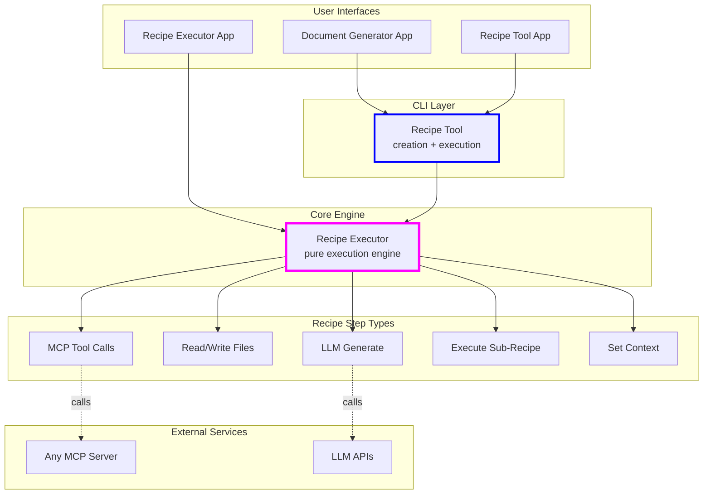
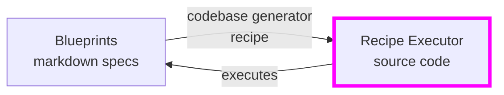

# recipe-executor/recipe_executor

[collect-files]

**Search:** ['recipe-executor/recipe_executor']
**Exclude:** ['.venv', 'node_modules', '*.lock', '.git', '__pycache__', '*.pyc', '*.ruff_cache', 'logs', 'output', '.DS_Store', '*.DS_Store']
**Include:** ['README.md', 'pyproject.toml', '.env.example']
**Date:** 8/15/2025, 3:42:41 PM
**Files:** 31

=== File: .env.example ===
# While all variables have aliases to work without the RECIPE_EXECUTOR_ prefix,
# it is recommended to use the prefix where you may want to avoid conflicts with
# more generic uses of the same variable names.

# Optional for the project
#RECIPE_EXECUTOR_LOG_LEVEL=DEBUG

# Required for the project
RECIPE_EXECUTOR_OPENAI_API_KEY=

# Additional APIs
#RECIPE_EXECUTOR_ANTHROPIC_API_KEY=
#RECIPE_EXECUTOR_GEMINI_API_KEY=

# Azure OpenAI
#RECIPE_EXECUTOR_AZURE_OPENAI_BASE_URL=
RECIPE_EXECUTOR_AZURE_OPENAI_API_VERSION=2025-03-01-preview
RECIPE_EXECUTOR_AZURE_USE_MANAGED_IDENTITY=false
#RECIPE_EXECUTOR_AZURE_OPENAI_API_KEY=

#(Optional) The client ID of the specific managed identity to use.
#  If not provided, DefaultAzureCredential will be used.
#RECIPE_EXECUTOR_AZURE_MANAGED_IDENTITY_CLIENT_ID=


=== File: README.md ===
# Recipe Tool

**Turn natural language ideas into reliable, automated workflows** - Recipe Tool transforms your ideas written in plain English into executable "recipes" that orchestrate complex multi-step workflows. Write what you want to accomplish, and Recipe Tool generates the JSON recipe that makes it happen - reproducibly and reliably.

**NOTE** This project is a very early, experimental project that is being explored in the open. There is no support offered and it will include frequent breaking changes. This project may be abandoned at any time. If you find it useful, it is strongly encouraged to create a fork and remain on a commit that works for your needs unless you are willing to make the necessary changes to use the latest version. This project is currently **NOT** accepting contributions and suggestions; please see the [docs/dev_guidance.md](docs/dev_guidance.md) for more details.

[](LICENSE)

## From Ideas to Automated Workflows

Recipe Tool bridges the gap between natural language and automation:

1. **Start with an idea** - Write what you want in plain English/markdown
2. **Generate a recipe** - Recipe Tool creates a JSON workflow from your description
3. **Execute reliably** - The JSON recipe runs deterministically, combining LLM calls with structured logic

Think of recipes as the "compiled" version of your ideas - they capture your intent in a format that executes reliably every time, using "more code than model" for reproducible results.

## What are Recipes?

Under the hood, recipes are JSON files that define automated workflows. Each recipe contains:

- **Steps** that execute in sequence (or in parallel)
- **Context** that flows between steps, accumulating results
- **Templates** using Liquid syntax for dynamic content
- **Rich step types**: LLM generation, file I/O, tool calls, conditionals, loops, sub-recipes

Here's what gets generated when you ask to "read a file and create a summary":

```json
{
  "name": "summarize_file",
  "steps": [
    {
      "step_type": "read_files",
      "paths": ["{{ input }}"]
    },
    {
      "step_type": "llm_generate",
      "prompt": "Summarize this content:\n\n{{ file_contents[0] }}"
    },
    {
      "step_type": "write_files",
      "files": [
        {
          "path": "summary.md",
          "content": "{{ llm_output }}"
        }
      ]
    }
  ]
}
```

Example use cases:

- 📝 Generate complete documents from outlines
- 🔧 Transform natural language ideas into executable recipes
- 💻 Generate code from specifications (this project generates its own code!)
- 🔄 Automate complex multi-step workflows
- 🤖 Create AI-powered automation pipelines

## Quick Start

```bash
# Clone and install
git clone https://github.com/microsoft/recipe-tool.git
cd recipe-tool
make install

# Try an example recipe
recipe-tool --execute recipes/example_simple/code_from_spec_recipe.json \
   spec_file=recipes/example_simple/specs/hello-world-spec.txt
```

See more examples in [recipes](recipes/) directory.

## Architecture

The system is built as a layered architecture where each layer adds capabilities:



### Self-Generating Architecture

The Recipe Executor's code is entirely generated from markdown blueprints using the codebase generator recipe. This "self-hosting" demonstrates the framework's power - it can build itself!



## Core Components

### Execution Layer

- **Recipe Executor** (`recipe-executor/`) - Pure execution engine for JSON recipes. This is the foundation that executes recipe steps including LLM calls, file operations, and flow control.
- **Recipe Tool** (`recipe-tool/`) - Adds recipe creation capabilities on top of Recipe Executor. Can generate new recipes from natural language descriptions.

### User Interfaces

- **Document Generator App** (`apps/document-generator/`) - Specialized UI for document creation workflows with live preview
- **Recipe Executor App** (`apps/recipe-executor/`) - Debug-focused interface for recipe execution with step-by-step visibility
- **Recipe Tool App** (`apps/recipe-tool/`) - Full-featured UI combining recipe creation and execution with MCP server integration

### MCP Servers

These servers expose functionality via the Model Context Protocol:

- **Recipe Tool MCP Server** (`mcp-servers/recipe-tool/`) - Exposes the recipe-tool CLI functionality (execute/create) as MCP tools for AI assistants
- **Python Code Tools MCP** (`mcp-servers/python-code-tools/`) - Provides Python linting capabilities using Ruff for AI assistants to lint code snippets or entire projects

## Installation

### Prerequisites

- **`make`** - Build automation tool ([install guide](https://www.gnu.org/software/make/))
- **`uv`** - Python dependency management ([install guide](https://github.com/astral-sh/uv))
- **`GitHub CLI`** - For ai-context-files tool ([install guide](https://cli.github.com/))
- **Azure CLI** (optional) - For Azure OpenAI with Managed Identity ([install guide](https://docs.microsoft.com/cli/azure/install-azure-cli))

### Setup Steps

```bash
# 1. Clone the repository
git clone https://github.com/microsoft/recipe-tool.git
cd recipe-tool

# 2. Configure environment (optional)
cp .env.example .env
# Edit .env to add your OPENAI_API_KEY and other API keys

# 3. Install all dependencies
make install

# 4. Activate virtual environment
source .venv/bin/activate    # Linux/Mac
# OR: .venv\Scripts\activate  # Windows

# 5. Verify installation
recipe-tool --help
```

## Usage Guide

### Basic Workflow

1. **Write your idea** in natural language (markdown file):

```markdown
# Analyze Code Quality

Read all Python files in the project and:

1. Count lines of code per file
2. Identify files with no docstrings
3. Create a report with recommendations
```

2. **Generate a recipe** from your idea:

```bash
recipe-tool --create code_quality_idea.md
# Creates: output/analyze_code_quality.json
```

3. **Execute the recipe** (now it's reproducible!):

```bash
recipe-tool --execute output/analyze_code_quality.json project_path=./myproject
```

### Direct Execution

If you already have JSON recipes:

```bash
# Execute with context variables
recipe-tool --execute recipes/example_simple/test_recipe.json model=azure/gpt-4o
```

### Web Interfaces

For a more visual experience:

```bash
recipe-tool-app          # Full UI for creation and execution
recipe-executor-app      # Debug-focused execution UI
document-generator-app   # Document workflow UI
```

### Advanced Workflows

#### Code Generation from Blueprints

The Recipe Executor generates its own code:

```bash
# Generate all Recipe Executor code
recipe-tool --execute recipes/codebase_generator/codebase_generator_recipe.json

# Generate specific component
recipe-tool --execute recipes/codebase_generator/codebase_generator_recipe.json \
   component_id=steps.llm_generate
```

#### Document Generation

Create structured documents from outlines:

```bash
recipe-tool --execute recipes/document_generator/document_generator_recipe.json \
   outline=path/to/outline.json
```

#### MCP Server Integration

For AI assistants (Claude Desktop, etc.):

```bash
# Recipe capabilities via MCP
recipe-tool-mcp-server stdio              # For Claude Desktop
recipe-tool-mcp-server sse --port 3002    # For HTTP clients

# Python linting via MCP
python-code-tools stdio
```

## Recipe Catalog

### 🔨 Code Generation Recipes

- **Codebase Generator** (`recipes/codebase_generator/`) - Transforms markdown blueprints into working code

  - Used to generate the Recipe Executor itself!
  - Sub-recipes for component processing and code generation

- **Blueprint Generators** (`recipes/experimental/blueprint_generator_v*/`) - Creates blueprints from ideas
  - Multiple versions exploring different approaches
  - Generates component specifications and documentation

### 📄 Document Creation Recipes

- **Document Generator** (`recipes/document_generator/`) - Creates documents from structured outlines
  - Handles multi-section documents with resource loading
  - Supports markdown output with live preview in UI

### 🛠️ Utility Recipes

- **Recipe Creator** (`recipes/recipe_creator/`) - Generates recipes from natural language descriptions

  - Core functionality of the recipe-tool CLI
  - Analyzes ideas and creates executable JSON recipes

- **File Generation** (`recipes/utilities/`) - Various file processing utilities
  - Generate content from file collections
  - Template-based file creation

### 📚 Example Recipes

- **Simple Examples** (`recipes/example_simple/`) - Basic recipe patterns
- **Complex Examples** (`recipes/example_complex/`) - Advanced workflows with sub-recipes
- **Template Examples** (`recipes/example_templates/`) - Using Liquid templates
- **MCP Examples** (`recipes/example_mcp_step/`) - MCP server integration
- **Content Writer** (`recipes/example_content_writer/`) - LLM content generation

## Development

### Getting Started

```bash
# Workspace commands
make help              # Show all available commands
make workspace-info    # Show project structure
make doctor           # Check workspace health

# Code quality
make lint             # Run linting
make format           # Format code
make test             # Run tests

# AI development
make ai-context-files # Generate context for AI assistants
```

### VSCode Integration

The project includes a comprehensive VSCode workspace configuration:

- Multi-root workspace organized by project type
- Pre-configured Python paths and testing
- Ruff integration for code quality
- Recommended extensions

```bash
code recipe-tool-workspace.code-workspace
```

### Self-Generating Code

The Recipe Executor generates its own code from blueprints:

1. **Write blueprints** in `blueprints/recipe_executor/components/`
2. **Run generator** `recipe-tool --execute recipes/codebase_generator/codebase_generator_recipe.json`
3. **Code is generated** in `recipe-executor/`

This demonstrates the power of the modular approach - the tool builds itself!

## Philosophy & Design

This project embodies a modular, AI-driven approach to software development:

- **Modular Design**: Small, self-contained components with clear interfaces
- **AI-First Development**: Components are generated from specifications
- **Regeneration over Editing**: Prefer regenerating components to manual edits
- **Human as Architect**: Humans design specifications, AI builds the code

See [ai_context/MODULAR_DESIGN_PHILOSOPHY.md](ai_context/MODULAR_DESIGN_PHILOSOPHY.md) and [ai_context/IMPLEMENTATION_PHILOSOPHY.md](ai_context/IMPLEMENTATION_PHILOSOPHY.md) for detailed philosophy.

## License

This project is licensed under the MIT License - see the [LICENSE](LICENSE) file for details.

## Contributing

This project is currently **NOT** accepting contributions and suggestions; please see the [dev_guidance.md](docs/dev_guidance.md) for more details.

Most contributions require you to agree to a
Contributor License Agreement (CLA) declaring that you have the right to, and actually do, grant us
the rights to use your contribution. For details, visit https://cla.opensource.microsoft.com.

When you submit a pull request, a CLA bot will automatically determine whether you need to provide
a CLA and decorate the PR appropriately (e.g., status check, comment). Simply follow the instructions
provided by the bot. You will only need to do this once across all repos using our CLA.

This project has adopted the [Microsoft Open Source Code of Conduct](https://opensource.microsoft.com/codeofconduct/).
For more information see the [Code of Conduct FAQ](https://opensource.microsoft.com/codeofconduct/faq/) or
contact [opencode@microsoft.com](mailto:opencode@microsoft.com) with any additional questions or comments.

## Trademarks

This project may contain trademarks or logos for projects, products, or services. Authorized use of Microsoft
trademarks or logos is subject to and must follow
[Microsoft's Trademark & Brand Guidelines](https://www.microsoft.com/en-us/legal/intellectualproperty/trademarks/usage/general).
Use of Microsoft trademarks or logos in modified versions of this project must not cause confusion or imply Microsoft sponsorship.
Any use of third-party trademarks or logos are subject to those third-party's policies.


=== File: pyproject.toml ===
[tool.uv.workspace]
members = [
    "recipe-tool",
    "recipe-executor",
    "docpack-file",
    "shared/gradio-components",
    "apps/document-generator",
    "apps/experimental/document-generator-v1",
    "apps/recipe-executor",
    "apps/recipe-tool",
    "mcp-servers/docs-server",
    "mcp-servers/python-code-tools",
    "mcp-servers/recipe-tool",
]

[tool.uv.sources]
# Core libraries
recipe-executor = { workspace = true }
recipe-tool = { workspace = true }
docpack-file = { workspace = true }
gradio-components = { workspace = true }
# Apps
document-generator-app = { workspace = true }
document-generator-v1-app = { workspace = true }
recipe-executor-app = { workspace = true }
recipe-tool-app = { workspace = true }
# MCP servers
docs-server = { workspace = true }
python-code-tools = { workspace = true }
recipe-tool-mcp-server = { workspace = true }

[dependency-groups]
dev = [
    "build>=1.2.2.post1",
    "debugpy>=1.8.14",
    "pyright>=1.1.400",
    "pytest>=8.3.5",
    "pytest-cov>=6.1.1",
    "pytest-mock>=3.14.0",
    "ruff>=0.11.10",
    "twine>=6.1.0",
]


=== File: recipe-executor/recipe_executor/config.py ===
# This file was generated by Codebase-Generator, do not edit directly
"""
Config component for the Recipe Executor.
Provides centralized, type-safe configuration via environment variables.
"""

import os
from typing import Any, Dict, List, Optional

from pydantic import Field
from pydantic_settings import BaseSettings, SettingsConfigDict


class RecipeExecutorConfig(BaseSettings):
    """
    Configuration for recipe executor API keys and credentials.

    This class automatically loads values from environment variables
    and .env files.
    """

    # Standard AI Provider API Keys
    openai_api_key: Optional[str] = Field(
        default=None,
        alias="OPENAI_API_KEY",
        description="API key for OpenAI",
    )
    anthropic_api_key: Optional[str] = Field(
        default=None,
        alias="ANTHROPIC_API_KEY",
        description="API key for Anthropic",
    )

    # Azure OpenAI Credentials
    azure_openai_api_key: Optional[str] = Field(
        default=None,
        alias="AZURE_OPENAI_API_KEY",
        description="API key for Azure OpenAI",
    )
    azure_openai_base_url: Optional[str] = Field(
        default=None,
        alias="AZURE_OPENAI_BASE_URL",
        description="Base URL for Azure OpenAI endpoint",
    )
    azure_openai_api_version: Optional[str] = Field(
        default="2025-03-01-preview",
        alias="AZURE_OPENAI_API_VERSION",
        description="API version for Azure OpenAI",
    )
    azure_openai_deployment_name: Optional[str] = Field(
        default=None,
        alias="AZURE_OPENAI_DEPLOYMENT_NAME",
        description="Deployment name for Azure OpenAI",
    )
    azure_use_managed_identity: bool = Field(
        default=False,
        alias="AZURE_USE_MANAGED_IDENTITY",
        description="Use Azure managed identity for authentication",
    )
    azure_client_id: Optional[str] = Field(
        default=None,
        alias="AZURE_CLIENT_ID",
        description="Client ID for Azure managed identity",
    )

    # Ollama Settings
    ollama_base_url: str = Field(
        default="http://localhost:11434",
        alias="OLLAMA_BASE_URL",
        description="Base URL for Ollama API",
    )

    model_config = SettingsConfigDict(
        env_prefix="RECIPE_EXECUTOR_",
        env_file=".env",
        env_file_encoding="utf-8",
        case_sensitive=False,
        extra="ignore",
    )


def load_configuration(recipe_env_vars: Optional[List[str]] = None) -> Dict[str, Any]:
    """
    Load configuration from environment variables.

    Args:
        recipe_env_vars: Optional list of additional environment variable names
                         that the recipe requires. These will be loaded and added
                         to the configuration with lowercase keys.

    Returns:
        Dictionary containing all configuration values, with None values excluded.
    """
    # Load standard settings
    settings = RecipeExecutorConfig()
    # Convert to dict, excluding None values
    config: Dict[str, Any] = settings.model_dump(exclude_none=True)

    # Load recipe-specific variables
    if recipe_env_vars:
        for var_name in recipe_env_vars:
            value = os.getenv(var_name)
            if value is not None:
                # key names are lowercase for consistency
                key = var_name.lower()
                config[key] = value

    return config


=== File: recipe-executor/recipe_executor/context.py ===
# This file was generated by Codebase-Generator, do not edit directly
from typing import Any, Dict, Iterator, Optional
import copy
import json

from recipe_executor.protocols import ContextProtocol

__all__ = ["Context"]


class Context(ContextProtocol):
    """
    Context is a shared state container for the Recipe Executor system.
    It provides a dictionary-like interface for runtime artifacts and
    holds a separate configuration store.
    """

    def __init__(
        self,
        artifacts: Optional[Dict[str, Any]] = None,
        config: Optional[Dict[str, Any]] = None,
    ) -> None:
        # Deep copy initial data to avoid side effects from external modifications
        self._artifacts: Dict[str, Any] = copy.deepcopy(artifacts) if artifacts is not None else {}
        self._config: Dict[str, Any] = copy.deepcopy(config) if config is not None else {}

    def __getitem__(self, key: str) -> Any:
        """
        Retrieve an artifact by key. Raises KeyError if not found.
        """
        try:
            return self._artifacts[key]
        except KeyError:
            raise KeyError(f"Key '{key}' not found in Context.")

    def __setitem__(self, key: str, value: Any) -> None:
        """
        Store or overwrite an artifact value by key.
        """
        self._artifacts[key] = value

    def __delitem__(self, key: str) -> None:
        """
        Remove an artifact by key. KeyError propagates if key is missing.
        """
        del self._artifacts[key]

    def __contains__(self, key: object) -> bool:
        """
        Return True if the given key exists in artifacts.
        """
        return isinstance(key, str) and key in self._artifacts

    def __iter__(self) -> Iterator[str]:
        """
        Iterate over a snapshot of artifact keys.
        """
        return iter(list(self._artifacts.keys()))

    def __len__(self) -> int:
        """
        Return the number of artifacts stored.
        """
        return len(self._artifacts)

    def keys(self) -> Iterator[str]:
        """
        Return an iterator over artifact keys.
        """
        return self.__iter__()

    def get(self, key: str, default: Any = None) -> Any:
        """
        Get the value for key if present, otherwise return default.
        """
        return self._artifacts.get(key, default)

    def clone(self) -> ContextProtocol:
        """
        Create a deep copy of this Context, including artifacts and config.
        """
        # __init__ deep-copies provided dicts
        return Context(artifacts=self._artifacts, config=self._config)

    def dict(self) -> Dict[str, Any]:  # noqa: A003
        """
        Return a deep copy of the artifacts as a standard dict.
        """
        return copy.deepcopy(self._artifacts)

    def json(self) -> str:
        """
        Return a JSON string representation of the artifacts.
        """
        return json.dumps(self.dict())

    def get_config(self) -> Dict[str, Any]:
        """
        Return a deep copy of the configuration store.
        """
        return copy.deepcopy(self._config)

    def set_config(self, config: Dict[str, Any]) -> None:
        """
        Replace the configuration store with a deep copy of the provided dict.
        """
        self._config = copy.deepcopy(config)


=== File: recipe-executor/recipe_executor/executor.py ===
# This file was generated by Codebase-Generator, do not edit directly
import os
import json
import logging
import inspect
from pathlib import Path
from typing import Union, Dict, Any

from recipe_executor.protocols import ExecutorProtocol, ContextProtocol
from recipe_executor.models import Recipe
from recipe_executor.steps.registry import STEP_REGISTRY


class Executor(ExecutorProtocol):
    """
    Concrete implementation of ExecutorProtocol. Loads, validates, and executes
    recipes step by step using a shared context. Stateless between runs.
    """

    def __init__(self, logger: logging.Logger) -> None:
        self.logger = logger

    async def execute(
        self,
        recipe: Union[str, Path, Dict[str, Any], Recipe],
        context: ContextProtocol,
    ) -> None:
        """
        Load a recipe (from file path, JSON string, dict, or Recipe model),
        validate it, and execute its steps sequentially using the provided context.
        """
        # Load or validate the recipe into a Recipe model
        if isinstance(recipe, Recipe):
            self.logger.debug("Using provided Recipe model instance.")
            recipe_model = recipe
        elif isinstance(recipe, dict):
            self.logger.debug("Loading recipe from dict.")
            try:
                recipe_model = Recipe.model_validate(recipe)
            except Exception as e:
                raise ValueError(f"Invalid recipe structure: {e}") from e
        elif isinstance(recipe, (str, Path)):
            recipe_str = str(recipe)
            if os.path.isfile(recipe_str):
                # File path case
                self.logger.debug(f"Loading recipe from file path: {recipe_str}")
                try:
                    with open(recipe_str, encoding="utf-8") as f:
                        data = json.load(f)
                except Exception as e:
                    raise ValueError(f"Failed to read or parse recipe file '{recipe_str}': {e}") from e
                try:
                    recipe_model = Recipe.model_validate(data)
                except Exception as e:
                    raise ValueError(f"Invalid recipe structure from file '{recipe_str}': {e}") from e
            else:
                # Raw JSON string case
                self.logger.debug("Loading recipe from JSON string.")
                try:
                    recipe_model = Recipe.model_validate_json(recipe_str)
                except Exception as primary_err:
                    # Fallback: parse then validate
                    try:
                        parsed = json.loads(recipe_str)
                        recipe_model = Recipe.model_validate(parsed)
                    except Exception as e:
                        raise ValueError(f"Failed to parse or validate recipe JSON string: {primary_err}") from e
        else:
            raise TypeError(f"Unsupported recipe type: {type(recipe)}")

        # Log recipe summary
        try:
            summary = recipe_model.model_dump()
        except Exception:
            summary = {}
        step_count = len(recipe_model.steps or [])  # type: ignore
        self.logger.debug(f"Recipe loaded: {{'steps': {step_count}}}. Full recipe: {summary}")

        # Execute steps sequentially
        for idx, step in enumerate(recipe_model.steps or []):  # type: ignore
            step_type = step.type
            config: Dict[str, Any] = step.config or {}
            self.logger.debug(f"Executing step {idx} of type '{step_type}' with config: {config}")

            if step_type not in STEP_REGISTRY:
                raise ValueError(f"Unknown step type '{step_type}' at index {idx}")

            step_cls = STEP_REGISTRY[step_type]
            step_instance = step_cls(self.logger, config)

            try:
                result = step_instance.execute(context)
                if inspect.isawaitable(result):  # type: ignore
                    await result
            except Exception as e:
                msg = f"Error executing step {idx} ('{step_type}'): {e}"
                raise ValueError(msg) from e

            self.logger.debug(f"Step {idx} ('{step_type}') completed successfully.")

        self.logger.debug("All recipe steps completed successfully.")


=== File: recipe-executor/recipe_executor/llm_utils/azure_openai.py ===
# This file was generated by Codebase-Generator, do not edit directly
import logging
from typing import Optional

from azure.identity import DefaultAzureCredential, ManagedIdentityCredential, get_bearer_token_provider
from openai import AsyncAzureOpenAI
from pydantic_ai.providers.openai import OpenAIProvider
from pydantic_ai.models.openai import OpenAIModel

from recipe_executor.protocols import ContextProtocol


def _mask_secret(secret: Optional[str]) -> str:
    """
    Mask a secret, showing only the first and last character.
    """
    if not secret:
        return "<None>"
    if len(secret) <= 2:
        return "**"
    return f"{secret[0]}***{secret[-1]}"


def get_azure_openai_model(
    logger: logging.Logger,
    model_name: str,
    deployment_name: Optional[str],
    context: ContextProtocol,
) -> OpenAIModel:
    """
    Create a PydanticAI OpenAIModel instance configured for Azure OpenAI.

    Args:
        logger (logging.Logger): Logger for logging messages.
        model_name (str): The model name (e.g., "gpt-4o").
        deployment_name (Optional[str]): Deployment name; defaults to config or model_name.
        context (ContextProtocol): Context providing configuration values.

    Returns:
        OpenAIModel: Configured PydanticAI OpenAIModel.

    Raises:
        Exception: If required configuration is missing or client/model creation fails.
    """
    config = context.get_config()
    api_key = config.get("azure_openai_api_key")
    base_url = config.get("azure_openai_base_url")
    api_version = config.get("azure_openai_api_version", "2025-03-01-preview")
    use_managed_identity = config.get("azure_use_managed_identity", False)
    client_id = config.get("azure_client_id")

    # Determine deployment name
    deployment = deployment_name or config.get("azure_openai_deployment_name") or model_name

    if not base_url:
        logger.error("Configuration 'azure_openai_base_url' is required for Azure OpenAI")
        raise Exception("Missing azure_openai_base_url in configuration")

    # Log loaded configuration (with masked API key)
    masked_key = _mask_secret(api_key)
    logger.debug(
        "Azure OpenAI config: endpoint=%s, api_version=%s, deployment=%s, "
        "use_managed_identity=%s, client_id=%s, api_key=%s",
        base_url,
        api_version,
        deployment,
        use_managed_identity,
        client_id or "<None>",
        masked_key,
    )

    try:
        # Choose authentication method
        if use_managed_identity:
            logger.info("Using Azure Managed Identity for authentication")
            if client_id:
                credential = ManagedIdentityCredential(client_id=client_id)
            else:
                credential = DefaultAzureCredential()
            scope = "https://cognitiveservices.azure.com/.default"
            token_provider = get_bearer_token_provider(credential, scope)
            azure_client = AsyncAzureOpenAI(
                azure_ad_token_provider=token_provider,
                azure_endpoint=base_url,
                api_version=api_version,
                azure_deployment=deployment,
            )
            auth_method = "Azure Managed Identity"
        else:
            if not api_key:
                logger.error("Configuration 'azure_openai_api_key' is required for API key authentication")
                raise Exception("Missing azure_openai_api_key in configuration")
            logger.info("Using API Key authentication for Azure OpenAI")
            azure_client = AsyncAzureOpenAI(
                api_key=api_key,
                azure_endpoint=base_url,
                api_version=api_version,
                azure_deployment=deployment,
            )
            auth_method = "API Key"
    except Exception as err:
        logger.error(f"Failed to create Azure OpenAI client: {err}")
        raise

    logger.info(f"Creating Azure OpenAI model '{model_name}' with {auth_method}")
    provider = OpenAIProvider(openai_client=azure_client)

    try:
        model = OpenAIModel(model_name=model_name, provider=provider)
    except Exception as err:
        logger.error(f"Failed to create OpenAIModel: {err}")
        raise

    return model


=== File: recipe-executor/recipe_executor/llm_utils/azure_responses.py ===
# This file was generated by Codebase-Generator, do not edit directly
"""
Azure Responses Component
Provides Azure OpenAI Responses API integration for PydanticAI Agents.
"""

import logging
import os
from typing import Optional, Dict

from azure.identity import DefaultAzureCredential, get_bearer_token_provider
from openai import AsyncAzureOpenAI
from pydantic_ai.models.openai import OpenAIResponsesModel
from pydantic_ai.providers.openai import OpenAIProvider

__all__ = ["get_azure_responses_model"]


def _mask_secret(secret: Optional[str]) -> str:
    """Mask all but first and last character of a secret."""
    if not secret or len(secret) < 2:
        return "**"
    return f"{secret[0]}***{secret[-1]}"


def get_azure_responses_model(
    logger: logging.Logger,
    model_name: str,
    deployment_name: Optional[str] = None,
) -> OpenAIResponsesModel:
    """
    Create a PydanticAI OpenAIResponsesModel for Azure OpenAI.

    Args:
        logger: Logger for logging messages.
        model_name: Name of the model (e.g., "gpt-4o").
        deployment_name: Azure deployment name. Defaults to model_name or AZURE_OPENAI_DEPLOYMENT_NAME.

    Returns:
        Configured OpenAIResponsesModel for Azure.

    Raises:
        ValueError: If required environment variables are missing or invalid.
        Exception: On failures initializing the Azure client or model.
    """
    try:
        # Load environment variables
        azure_endpoint = os.getenv("AZURE_OPENAI_BASE_URL")
        azure_api_version = os.getenv("AZURE_OPENAI_API_VERSION", "2025-03-01-preview")
        azure_api_key = os.getenv("AZURE_OPENAI_API_KEY")
        use_managed = os.getenv("AZURE_USE_MANAGED_IDENTITY", "false").lower() == "true"
        client_id = os.getenv("AZURE_CLIENT_ID")
        env_deployment = os.getenv("AZURE_OPENAI_DEPLOYMENT_NAME")

        # Validate endpoint
        if not azure_endpoint:
            raise ValueError("Environment variable AZURE_OPENAI_BASE_URL must be set for Azure OpenAI integration.")

        # Determine deployment name
        deployment = deployment_name or env_deployment or model_name

        # Log configuration with masked secrets
        logger.debug(
            "Azure OpenAI Responses config: use_managed=%s, api_key=%s, client_id=%s, endpoint=%s, api_version=%s, deployment=%s",
            use_managed,
            _mask_secret(azure_api_key),
            client_id,
            azure_endpoint,
            azure_api_version,
            deployment,
        )

        # Initialize Azure OpenAI client
        if use_managed:
            logger.info("Authenticating to Azure OpenAI with Managed Identity.")
            cred_kwargs: Dict[str, str] = {}
            if client_id:
                cred_kwargs["managed_identity_client_id"] = client_id
            credential = DefaultAzureCredential(**cred_kwargs)
            scope = "https://cognitiveservices.azure.com/.default"
            token_provider = get_bearer_token_provider(credential, scope)
            azure_client = AsyncAzureOpenAI(
                azure_endpoint=azure_endpoint,
                api_version=azure_api_version,
                azure_ad_token_provider=token_provider,
            )
            auth_method = "ManagedIdentity"
        else:
            if not azure_api_key:
                raise ValueError(
                    "Environment variable AZURE_OPENAI_API_KEY must be set when not using managed identity."
                )
            logger.info("Authenticating to Azure OpenAI with API Key.")
            azure_client = AsyncAzureOpenAI(
                azure_endpoint=azure_endpoint,
                api_version=azure_api_version,
                api_key=azure_api_key,
            )
            auth_method = "ApiKey"

        # Create the Azure Responses model
        model = OpenAIResponsesModel(
            deployment,
            provider=OpenAIProvider(openai_client=azure_client),
        )
        logger.info(
            "Created Azure Responses model '%s' (deployment='%s') using auth=%s.",
            model_name,
            deployment,
            auth_method,
        )
        return model

    except Exception as exc:
        logger.debug("Failed to create Azure Responses model: %s", exc, exc_info=True)
        raise


=== File: recipe-executor/recipe_executor/llm_utils/llm.py ===
# This file was generated by Codebase-Generator, do not edit directly
import time
import logging
from typing import Optional, List, Type, Union, Dict, Any

from pydantic import BaseModel
from pydantic_ai import Agent
from pydantic_ai.settings import ModelSettings
from pydantic_ai.models.openai import (
    OpenAIModel,
    OpenAIResponsesModel,
    OpenAIResponsesModelSettings,
)
from pydantic_ai.models.anthropic import AnthropicModel
from pydantic_ai.providers.openai import OpenAIProvider
from pydantic_ai.providers.anthropic import AnthropicProvider
from pydantic_ai.mcp import MCPServer

from openai.types.responses import WebSearchToolParam, FileSearchToolParam

from recipe_executor.llm_utils.azure_openai import get_azure_openai_model
from recipe_executor.llm_utils.responses import get_openai_responses_model
from recipe_executor.llm_utils.azure_responses import get_azure_responses_model
from recipe_executor.protocols import ContextProtocol


def get_model(
    model_id: str,
    context: ContextProtocol,
    logger: logging.Logger,
) -> Union[OpenAIModel, AnthropicModel, OpenAIResponsesModel]:
    """
    Initialize an LLM model based on a standardized model_id string.
    Expected format: 'provider/model_name' or 'provider/model_name/deployment_name'.

    Supported providers:
    - openai
    - azure
    - anthropic
    - ollama
    - openai_responses
    - azure_responses

    Args:
        model_id (str): Model identifier in format 'provider/model_name'
            or 'provider/model_name/deployment_name'.
        context (ContextProtocol): Context containing configuration values.
        logger (logging.Logger): Logger for logging messages.

    Returns:
        The model instance for the specified provider and model.

    Raises:
        ValueError: If model_id format is invalid or if the provider is unsupported.
    """
    parts = model_id.split("/")
    if len(parts) < 2:
        raise ValueError(f"Invalid model_id format: '{model_id}'")

    provider = parts[0].lower()
    config = context.get_config()

    # OpenAI provider
    if provider == "openai":
        if len(parts) != 2:
            raise ValueError(f"Invalid OpenAI model_id: '{model_id}'")
        model_name = parts[1]
        api_key = config.get("openai_api_key")
        provider_obj = OpenAIProvider(api_key=api_key)
        return OpenAIModel(model_name=model_name, provider=provider_obj)

    # Azure OpenAI
    if provider == "azure":
        if len(parts) == 2:
            model_name, deployment = parts[1], None
        elif len(parts) == 3:
            model_name, deployment = parts[1], parts[2]
        else:
            raise ValueError(f"Invalid Azure model_id: '{model_id}'")
        return get_azure_openai_model(
            logger=logger,
            model_name=model_name,
            deployment_name=deployment,
            context=context,
        )

    # Anthropic provider
    if provider == "anthropic":
        if len(parts) != 2:
            raise ValueError(f"Invalid Anthropic model_id: '{model_id}'")
        model_name = parts[1]
        api_key = config.get("anthropic_api_key")
        provider_obj = AnthropicProvider(api_key=api_key)
        return AnthropicModel(model_name=model_name, provider=provider_obj)

    # Ollama (OpenAI-compatible) provider
    if provider == "ollama":
        if len(parts) != 2:
            raise ValueError(f"Invalid Ollama model_id: '{model_id}'")
        model_name = parts[1]
        base_url = config.get("ollama_base_url") or "http://localhost:11434"
        provider_obj = OpenAIProvider(base_url=f"{base_url}/v1")
        return OpenAIModel(model_name=model_name, provider=provider_obj)

    # OpenAI Responses API
    if provider == "openai_responses":
        if len(parts) != 2:
            raise ValueError(f"Invalid OpenAI Responses model_id: '{model_id}'")
        model_name = parts[1]
        return get_openai_responses_model(logger, model_name)

    # Azure Responses API
    if provider == "azure_responses":
        if len(parts) == 2:
            model_name, deployment = parts[1], None
        elif len(parts) == 3:
            model_name, deployment = parts[1], parts[2]
        else:
            raise ValueError(f"Invalid Azure Responses model_id: '{model_id}'")
        return get_azure_responses_model(logger, model_name, deployment)

    raise ValueError(f"Unsupported LLM provider: '{provider}' in model_id '{model_id}'")


class LLM:
    """
    Unified interface for interacting with various LLM providers
    and optional MCP servers.
    """

    def __init__(
        self,
        logger: logging.Logger,
        context: ContextProtocol,
        model: str = "openai/gpt-4o",
        max_tokens: Optional[int] = None,
        mcp_servers: Optional[List[MCPServer]] = None,
    ):
        self.logger: logging.Logger = logger
        self.context: ContextProtocol = context
        self.default_model_id: str = model
        self.default_max_tokens: Optional[int] = max_tokens
        self.default_mcp_servers: List[MCPServer] = mcp_servers or []

    async def generate(
        self,
        prompt: str,
        model: Optional[str] = None,
        max_tokens: Optional[int] = None,
        output_type: Type[Union[str, BaseModel]] = str,
        mcp_servers: Optional[List[MCPServer]] = None,
        openai_builtin_tools: Optional[List[Dict[str, Any]]] = None,
    ) -> Union[str, BaseModel]:
        """
        Generate an output from the LLM based on the provided prompt.

        Args:
            prompt: The prompt to send to the model.
            model: Optional model identifier to override default.
            max_tokens: Optional max tokens override.
            output_type: Desired return type (str or BaseModel).
            mcp_servers: Optional MCP servers override.
            openai_builtin_tools: Optional built-in tools for Responses API.

        Returns:
            The model output as plain text or structured data.

        Raises:
            ValueError: Invalid model identifier.
            Exception: On network, API, or MCP errors.
        """
        model_id = model or self.default_model_id
        tokens = max_tokens if max_tokens is not None else self.default_max_tokens
        servers = mcp_servers if mcp_servers is not None else self.default_mcp_servers

        provider_name = model_id.split("/", 1)[0]
        self.logger.info(
            "LLM generate using provider=%s model_id=%s",
            provider_name,
            model_id,
        )

        output_name = getattr(output_type, "__name__", str(output_type))
        self.logger.debug(
            "LLM request prompt=%r model_id=%s max_tokens=%s output_type=%s mcp_servers=%s",
            prompt,
            model_id,
            tokens,
            output_name,
            [type(s).__name__ for s in servers],
        )

        try:
            model_instance = get_model(model_id, self.context, self.logger)
        except ValueError as err:
            self.logger.error("Invalid model_id '%s': %s", model_id, err)
            raise

        agent_kwargs: Dict[str, Any] = {
            "model": model_instance,
            "output_type": output_type,
            "mcp_servers": servers,
        }

        # Configure built-in tools for Responses API
        if provider_name in ("openai_responses", "azure_responses") and openai_builtin_tools:
            typed_tools: List[Union[WebSearchToolParam, FileSearchToolParam]] = []
            for tool in openai_builtin_tools:
                try:
                    typed_tools.append(WebSearchToolParam(**tool))
                except TypeError:
                    typed_tools.append(FileSearchToolParam(**tool))
            settings = OpenAIResponsesModelSettings(openai_builtin_tools=typed_tools)
            agent_kwargs["model_settings"] = settings
        # Configure token limit for non-Responses providers
        elif tokens is not None:
            agent_kwargs["model_settings"] = ModelSettings(max_tokens=tokens)

        agent: Agent = Agent(**agent_kwargs)  # type: ignore

        start = time.time()
        try:
            async with agent.run_mcp_servers():
                result = await agent.run(prompt)
        except Exception as err:
            self.logger.error(
                "LLM call failed model_id=%s error=%s",
                model_id,
                err,
            )
            raise
        end = time.time()

        duration = end - start
        try:
            usage = result.usage()
        except Exception:
            usage = None

        if usage:
            self.logger.info(
                "LLM result time=%.3f sec requests=%d tokens_total=%d (req=%d res=%d)",
                duration,
                usage.requests,
                usage.total_tokens,
                usage.request_tokens,
                usage.response_tokens,
            )
        else:
            self.logger.info(
                "LLM result time=%.3f sec (usage unavailable)",
                duration,
            )

        self.logger.debug("LLM raw result data=%r", result.data)

        return result.output


=== File: recipe-executor/recipe_executor/llm_utils/mcp.py ===
# This file was generated by Codebase-Generator, do not edit directly
"""
Utilities for creating MCP server clients based on configuration.
"""

import os
import logging
from typing import Any, Dict, List, Optional

from pydantic_ai.mcp import MCPServer, MCPServerHTTP, MCPServerStdio

# Optional .env support
try:
    from dotenv import load_dotenv
except ImportError:
    load_dotenv = None  # type: ignore

__all__ = ["get_mcp_server"]


def get_mcp_server(logger: logging.Logger, config: Dict[str, Any]) -> MCPServer:
    """
    Create an MCPServer client based on the provided configuration.

    Args:
        logger: Logger for logging messages.
        config: Configuration for the MCP server.

    Returns:
        A configured PydanticAI MCPServer instance.

    Raises:
        ValueError: If the configuration is invalid.
        RuntimeError: On errors creating the server instance.
    """
    if not isinstance(config, dict):
        raise ValueError("MCP server configuration must be a dict")

    # Mask sensitive values for logging
    sensitive = {"api_key", "apikey", "auth", "authorization", "token", "secret", "password"}
    masked: Dict[str, Any] = {}
    for key, value in config.items():
        lk = key.lower()
        if lk in sensitive:
            masked[key] = "***"
        elif key in ("headers", "env") and isinstance(value, dict):
            masked[key] = {k: "***" for k in value}
        else:
            masked[key] = value
    logger.debug("MCP server configuration: %s", masked)

    # HTTP transport
    if "url" in config:
        url = config.get("url")
        if not isinstance(url, str) or not url.strip():
            raise ValueError("HTTP MCP server requires a non-empty 'url' string")
        headers = config.get("headers")
        if headers is not None and not isinstance(headers, dict):
            raise ValueError("HTTP MCP server 'headers' must be a dict if provided")
        tool_prefix = config.get("tool_prefix")
        if tool_prefix is not None and not isinstance(tool_prefix, str):
            raise ValueError("HTTP MCP server 'tool_prefix' must be a string if provided")

        logger.info("Creating HTTP MCP server for URL: %s", url)
        try:
            params: Dict[str, Any] = {"url": url}
            if headers is not None:
                params["headers"] = headers
            if tool_prefix is not None:
                params["tool_prefix"] = tool_prefix
            return MCPServerHTTP(**params)
        except Exception as exc:
            raise RuntimeError(f"Failed to create HTTP MCP server: {exc}") from exc

    # Stdio transport
    if "command" in config:
        command = config.get("command")
        if not isinstance(command, str) or not command.strip():
            raise ValueError("Stdio MCP server requires a non-empty 'command' string")

        args_cfg = config.get("args")
        if args_cfg is None:
            args: List[str] = []
        elif isinstance(args_cfg, list) and all(isinstance(a, str) for a in args_cfg):
            args = args_cfg  # type: ignore
        else:
            raise ValueError("Stdio MCP server 'args' must be a list of strings if provided")

        # Environment variables
        env_cfg = config.get("env")
        env: Optional[Dict[str, str]] = None
        if env_cfg is not None:
            if not isinstance(env_cfg, dict):
                raise ValueError("Stdio MCP server 'env' must be a dict if provided")
            # load .env if empty values exist
            if load_dotenv and any(v == "" for v in env_cfg.values()):  # type: ignore
                load_dotenv()  # type: ignore
            env = {}
            for k, v in env_cfg.items():
                if not isinstance(v, str):
                    raise ValueError(f"Environment variable '{k}' must be a string")
                if v == "":
                    sys_val = os.getenv(k)
                    if sys_val is not None:
                        env[k] = sys_val
                else:
                    env[k] = v

        # Working directory
        cwd = config.get("cwd") or config.get("working_dir")
        if cwd is not None and not isinstance(cwd, str):
            raise ValueError("Stdio MCP server 'cwd' must be a string if provided")

        tool_prefix = config.get("tool_prefix")
        if tool_prefix is not None and not isinstance(tool_prefix, str):
            raise ValueError("Stdio MCP server 'tool_prefix' must be a string if provided")

        logger.info("Creating stdio MCP server with command: %s %s", command, args)
        try:
            params: Dict[str, Any] = {"command": command, "args": args}
            if cwd:
                params["cwd"] = cwd
            if env is not None:
                params["env"] = env
            if tool_prefix is not None:
                params["tool_prefix"] = tool_prefix
            return MCPServerStdio(**params)
        except Exception as exc:
            raise RuntimeError(f"Failed to create stdio MCP server: {exc}") from exc

    raise ValueError("Invalid MCP server configuration: must contain 'url' for HTTP or 'command' for stdio transport")


=== File: recipe-executor/recipe_executor/llm_utils/responses.py ===
# This file was generated by Codebase-Generator, do not edit directly
"""
Responses component for Recipe Executor.
Provides OpenAI built-in tool integration via PydanticAI Responses API.
"""

import logging
import os
from typing import Optional

from pydantic_ai.models.openai import OpenAIResponsesModel


def get_openai_responses_model(
    logger: logging.Logger,
    model_name: Optional[str] = None,
) -> OpenAIResponsesModel:
    """
    Create and return an OpenAIResponsesModel configured for built-in tool usage.

    Args:
        logger (logging.Logger): Logger for debug and info messages.
        model_name (Optional[str]): Specific model name to use (e.g., "gpt-4o").
            If not provided, DEFAULT_MODEL environment variable will be used.

    Returns:
        OpenAIResponsesModel: Configured PydanticAI OpenAIResponsesModel instance.

    Raises:
        ValueError: If OPENAI_API_KEY or model name is missing.
        Exception: If model instantiation fails.
    """
    # Load environment configuration
    default_model = os.environ.get("DEFAULT_MODEL")
    api_key = os.environ.get("OPENAI_API_KEY")

    def mask_secret(secret: Optional[str]) -> str:
        if not secret:
            return ""
        length = len(secret)
        if length <= 2:
            return "*" * length
        return f"{secret[0]}{'*' * (length - 2)}{secret[-1]}"  # mask all but first/last

    masked_key = mask_secret(api_key)
    logger.debug(
        "Loaded environment variables: DEFAULT_MODEL=%s, OPENAI_API_KEY=%s",
        default_model,
        masked_key,
    )

    # Ensure API key is present
    if not api_key:
        logger.error("OPENAI_API_KEY environment variable is not set")
        raise ValueError("Missing OPENAI_API_KEY environment variable")

    # Determine which model to use
    chosen_model = model_name or default_model
    if not chosen_model:
        logger.error("Model name not provided and DEFAULT_MODEL environment variable is not set")
        raise ValueError("Model name must be provided or set via DEFAULT_MODEL environment variable")

    logger.info("Using OpenAI Responses model: %s", chosen_model)

    # Instantiate the model
    try:
        return OpenAIResponsesModel(chosen_model)
    except Exception as e:
        logger.error(
            "Failed to create OpenAIResponsesModel for model %s: %s",
            chosen_model,
            str(e),
            exc_info=True,
        )
        raise


=== File: recipe-executor/recipe_executor/logger.py ===
# This file was generated by Codebase-Generator, do not edit directly
"""
Logger component for the Recipe Executor tool.
Provides a consistent logging interface that writes to stdout and separate log files for DEBUG, INFO, and ERROR levels.
"""

import os
import sys
import logging
from logging import Logger


def init_logger(log_dir: str = "logs", stdio_log_level: str = "INFO") -> Logger:
    """
    Initializes a logger that writes to stdout and to log files (debug/info/error).
    Clears existing logs on each run.

    Args:
        log_dir (str): Directory to store log files. Default is "logs".
        stdio_log_level (str): Log level for stdout. Default is "INFO".
            Options: "DEBUG", "INFO", "WARN", "ERROR" (case-insensitive).
            If set to "DEBUG", all logs will be printed to stdout.
            If set to "INFO", only INFO and higher level logs will be printed to stdout.

    Returns:
        logging.Logger: Configured logger instance.

    Raises:
        Exception: If log directory cannot be created or log files cannot be opened.
    """
    # Acquire root logger and capture all levels
    logger = logging.getLogger()
    logger.setLevel(logging.DEBUG)

    # Remove existing handlers to reset configuration
    for handler in list(logger.handlers):
        logger.removeHandler(handler)

    # Log initialization start at DEBUG level
    logger.debug("Initializing logger with dir='%s', stdio_level='%s'", log_dir, stdio_log_level)

    # Ensure log directory exists
    try:
        os.makedirs(log_dir, exist_ok=True)
    except Exception as exc:
        raise Exception(f"Failed to create log directory '{log_dir}': {exc}")
    logger.debug("Log directory created: %s", log_dir)

    # Define log formatters
    fmt = "%(asctime)s.%(msecs)03d [%(levelname)s] (%(filename)s:%(lineno)d) %(message)s"
    datefmt = "%Y-%m-%d %H:%M:%S"
    formatter = logging.Formatter(fmt=fmt, datefmt=datefmt)

    # Set up file handlers for DEBUG, INFO, and ERROR levels
    level_map = [
        ("debug", logging.DEBUG),
        ("info", logging.INFO),
        ("error", logging.ERROR),
    ]
    for name, level in level_map:
        file_path = os.path.join(log_dir, f"{name}.log")
        try:
            fh = logging.FileHandler(file_path, mode="w", encoding="utf-8")
            fh.setLevel(level)
            fh.setFormatter(formatter)
            logger.addHandler(fh)
        except Exception as exc:
            raise Exception(f"Failed to set up {name} log file '{file_path}': {exc}")

    # Configure console (stdout) handler
    level_name = stdio_log_level.upper()
    if level_name == "WARN":
        level_name = "WARNING"
    # Fallback to INFO if invalid
    if level_name not in ("DEBUG", "INFO", "WARNING", "ERROR", "CRITICAL"):
        level_name = "INFO"
    console_level = getattr(logging, level_name, logging.INFO)

    ch = logging.StreamHandler(sys.stdout)
    ch.setLevel(console_level)
    ch.setFormatter(formatter)
    logger.addHandler(ch)

    # Log completion
    logger.debug("Logger handlers configured (dir='%s', stdio_level='%s')", log_dir, level_name)
    logger.info("Logger initialized successfully")

    return logger


=== File: recipe-executor/recipe_executor/main.py ===
# This file was generated by Codebase-Generator, do not edit directly
import argparse
import asyncio
import logging
import os
import sys
import time
import traceback
from typing import Any, Dict, List, Optional

from dotenv import load_dotenv
from recipe_executor.config import load_configuration
from recipe_executor.context import Context
from recipe_executor.executor import Executor
from recipe_executor.logger import init_logger
from recipe_executor.models import Recipe


def parse_key_value_pairs(pairs: List[str]) -> Dict[str, str]:
    """
    Parse a list of strings in the form key=value into a dictionary.
    Raises ValueError on malformed entries.
    """
    result: Dict[str, str] = {}
    for pair in pairs:
        if "=" not in pair:
            raise ValueError(f"Invalid key=value format '{pair}'")
        key, value = pair.split("=", 1)
        if not key:
            raise ValueError(f"Invalid key in pair '{pair}'")
        result[key] = value
    return result


async def main_async() -> None:
    # Load environment variables from .env file (if present)
    load_dotenv()

    # Parse command-line arguments
    parser = argparse.ArgumentParser(description="Recipe Executor CLI")
    parser.add_argument("recipe_path", type=str, help="Path to the recipe file to execute")
    parser.add_argument("--log-dir", type=str, default="logs", help="Directory for log files")
    parser.add_argument("--context", action="append", default=[], help="Context artifact values as key=value pairs")
    parser.add_argument("--config", action="append", default=[], help="Static configuration values as key=value pairs")
    args = parser.parse_args()

    # Prepare log directory
    try:
        os.makedirs(args.log_dir, exist_ok=True)
    except Exception as exc:
        sys.stderr.write(f"Logger Initialization Error: cannot create log directory '{args.log_dir}': {exc}\n")
        raise SystemExit(1)

    # Initialize logger
    try:
        logger: logging.Logger = init_logger(args.log_dir)
    except Exception as exc:
        sys.stderr.write(f"Logger Initialization Error: {exc}\n")
        raise SystemExit(1)

    logger.info("Starting Recipe Executor Tool")
    logger.debug("Parsed arguments: %s", args)

    # Parse context artifacts
    try:
        artifacts: Dict[str, str] = parse_key_value_pairs(args.context)
    except ValueError as ve:
        sys.stderr.write(f"Context Error: {ve}\n")
        raise SystemExit(1)
    logger.debug("Initial context artifacts: %s", artifacts)

    # Parse CLI configuration overrides
    try:
        cli_config: Dict[str, str] = parse_key_value_pairs(args.config)
    except ValueError as ve:
        sys.stderr.write(f"Config Error: {ve}\n")
        raise SystemExit(1)

    # Load and validate recipe
    try:
        with open(args.recipe_path, "r", encoding="utf-8") as f:
            content = f.read()
        recipe: Recipe = Recipe.model_validate_json(content)
    except Exception as exc:
        logger.error("Failed to load recipe '%s': %s", args.recipe_path, exc, exc_info=True)
        raise SystemExit(1)

    # Load configuration from environment and recipe-specific variables
    try:
        recipe_env_vars: Optional[List[str]] = getattr(recipe, "env_vars", None)
        env_config: Dict[str, Any] = load_configuration(recipe_env_vars)
    except Exception as exc:
        logger.error("Configuration loading error: %s", exc, exc_info=True)
        raise SystemExit(1)

    # Merge environment config with CLI overrides (CLI takes precedence)
    merged_config: Dict[str, Any] = {**env_config, **cli_config}

    # Create execution context
    context = Context(artifacts=artifacts, config=merged_config)

    # Execute the recipe
    executor = Executor(logger)
    logger.info("Executing recipe: %s", args.recipe_path)
    start_time = time.time()
    try:
        await executor.execute(recipe, context)
    except Exception as exec_err:
        logger.error("An error occurred during recipe execution: %s", exec_err, exc_info=True)
        raise SystemExit(1)
    duration = time.time() - start_time

    logger.info("Recipe execution completed successfully in %.2f seconds", duration)


def main() -> None:
    try:
        asyncio.run(main_async())
    except ValueError as ve:
        # Handle parsing errors
        sys.stderr.write(f"Context Error: {ve}\n")
        sys.exit(1)
    except SystemExit as se:
        sys.exit(se.code)
    except Exception:
        sys.stderr.write(traceback.format_exc())
        sys.exit(1)
    else:
        sys.exit(0)


if __name__ == "__main__":  # pragma: no cover
    main()


=== File: recipe-executor/recipe_executor/models.py ===
# This file was generated by Codebase-Generator, do not edit directly
"""
Models for the Recipe Executor system.

Defines Pydantic models for file specifications, step configurations, and recipe structures.
"""

from typing import Any, Dict, List, Optional, Union

from pydantic import BaseModel, Field


class FileSpec(BaseModel):
    """Represents a single file to be generated.

    Attributes:
        path: Relative path where the file should be written.
        content: The content of the file, which can be:
            - A string for text content.
            - A dict for structured content.
            - A list of dicts for multiple structured outputs.
    """

    path: str = Field(..., description="Relative file path to write to")
    content: Union[str, Dict[str, Any], List[Dict[str, Any]]] = Field(
        ...,
        description=("Content of the file, as raw text, a structured dict, or a list of dicts for multiple files"),
    )


class ReadFilesConfig(BaseModel):
    """Configuration for a 'read_files' recipe step."""

    path: str = Field(..., description="Path of the file to read")
    content_key: str = Field(
        ...,
        description="Key under which the content of the file will be stored in the execution context",
    )


class McpServer(BaseModel):
    """Definition of an MCP server for LLM generation steps."""

    command: str = Field(..., description="Command to invoke the MCP server")
    args: List[str] = Field(..., description="List of arguments for the MCP server command")
    env: Optional[Dict[str, str]] = Field(
        None,
        description="Optional environment variables mapping to set when starting the server",
    )


class LLMGenerateConfig(BaseModel):
    """Configuration for a 'llm_generate' recipe step."""

    prompt: str = Field(..., description="Prompt template for the language model")
    model: Optional[str] = Field(
        None,
        description="Optional language model identifier to use, e.g., 'openai/gpt-4'",
    )
    output_format: Optional[str] = Field(
        None,
        description="Optional format of the output, e.g., 'files', 'text', etc.'",
    )
    output_key: Optional[str] = Field(
        None,
        description="Optional key under which to store the generated output in context",
    )
    mcp_servers: Optional[List[McpServer]] = Field(
        None,
        description="Optional list of MCP server definitions for local or custom LLM invocation",
    )


class WriteFilesConfig(BaseModel):
    """Configuration for a 'write_files' recipe step."""

    files_key: str = Field(
        ...,
        description="Context key containing the list of FileSpec objects to write to disk",
    )
    root: Optional[str] = Field(
        None,
        description="Optional root directory under which to write the files",
    )


class RecipeStep(BaseModel):
    """A single step in a recipe.

    Attributes:
        type: The type of the recipe step (e.g., 'read_files', 'llm_generate', 'write_files').
        config: Step-specific configuration as a dict or Pydantic model.
    """

    type: str = Field(..., description="Type of the recipe step to execute")
    config: Dict[str, Any] = Field(
        ...,
        description=(
            "Configuration for the step. Known step types may be validated against their Pydantic models; "
            "unknown types remain a raw dict."
        ),
    )


class Recipe(BaseModel):
    """A complete recipe composed of multiple steps and optional environment variable declarations.

    Attributes:
        steps: Ordered list of steps to run.
        env_vars: Optional list of environment variable names required by the recipe.
    """

    steps: List[RecipeStep] = Field(..., description="Ordered list of recipe steps")
    env_vars: Optional[List[str]] = Field(
        None,
        description="Optional list of environment variable names required for the recipe",
    )


__all__ = [
    "FileSpec",
    "ReadFilesConfig",
    "McpServer",
    "LLMGenerateConfig",
    "WriteFilesConfig",
    "RecipeStep",
    "Recipe",
]


=== File: recipe-executor/recipe_executor/protocols.py ===
# This file was generated by Codebase-Generator, do not edit directly
"""
Protocols definitions for the Recipe Executor system.

This module provides structural interfaces (Protocols) for core components:
- ContextProtocol
- StepProtocol
- ExecutorProtocol
"""

from typing import Protocol, runtime_checkable, Any, Dict, Iterator, Union
from pathlib import Path
from logging import Logger

from recipe_executor.models import Recipe


@runtime_checkable
class ContextProtocol(Protocol):
    """
    Defines a dict-like context for sharing data across steps and executors.
    Methods mirror built-in dict behaviors plus cloning and serialization.
    """

    def __getitem__(self, key: str) -> Any: ...

    def __setitem__(self, key: str, value: Any) -> None: ...

    def __delitem__(self, key: str) -> None: ...

    def __contains__(self, key: str) -> bool: ...

    def __iter__(self) -> Iterator[str]: ...

    def __len__(self) -> int: ...

    def get(self, key: str, default: Any = None) -> Any: ...

    def clone(self) -> "ContextProtocol": ...

    def dict(self) -> Dict[str, Any]: ...

    def json(self) -> str: ...

    def keys(self) -> Iterator[str]: ...

    def get_config(self) -> Dict[str, Any]: ...

    def set_config(self, config: Dict[str, Any]) -> None: ...


@runtime_checkable
class StepProtocol(Protocol):
    """
    Defines the interface for a recipe step implementation.
    Each step is initialized with a logger and configuration, and
    exposes an asynchronous execute method.
    """

    def __init__(self, logger: Logger, config: Dict[str, Any]) -> None: ...

    async def execute(self, context: ContextProtocol) -> None: ...


@runtime_checkable
class ExecutorProtocol(Protocol):
    """
    Defines the interface for an executor implementation.
    The executor runs a recipe given its definition and a context.
    """

    def __init__(self, logger: Logger) -> None: ...

    async def execute(
        self,
        recipe: Union[str, Path, Recipe],
        context: ContextProtocol,
    ) -> None: ...


=== File: recipe-executor/recipe_executor/steps/__init__.py ===
# This file was generated by Codebase-Generator, do not edit directly

from recipe_executor.steps.registry import STEP_REGISTRY
from recipe_executor.steps.conditional import ConditionalStep
from recipe_executor.steps.docpack_create import DocpackCreateStep
from recipe_executor.steps.docpack_extract import DocpackExtractStep
from recipe_executor.steps.execute_recipe import ExecuteRecipeStep
from recipe_executor.steps.llm_generate import LLMGenerateStep
from recipe_executor.steps.loop import LoopStep
from recipe_executor.steps.mcp import MCPStep
from recipe_executor.steps.parallel import ParallelStep
from recipe_executor.steps.read_files import ReadFilesStep
from recipe_executor.steps.set_context import SetContextStep
from recipe_executor.steps.write_files import WriteFilesStep

__all__ = [
    "STEP_REGISTRY",
    "ConditionalStep",
    "DocpackCreateStep",
    "DocpackExtractStep",
    "ExecuteRecipeStep",
    "LLMGenerateStep",
    "LoopStep",
    "MCPStep",
    "ParallelStep",
    "ReadFilesStep",
    "SetContextStep",
    "WriteFilesStep",
]

# Register steps by updating the registry
STEP_REGISTRY.update({
    "conditional": ConditionalStep,
    "docpack_create": DocpackCreateStep,
    "docpack_extract": DocpackExtractStep,
    "execute_recipe": ExecuteRecipeStep,
    "llm_generate": LLMGenerateStep,
    "loop": LoopStep,
    "mcp": MCPStep,
    "parallel": ParallelStep,
    "read_files": ReadFilesStep,
    "set_context": SetContextStep,
    "write_files": WriteFilesStep,
})


=== File: recipe-executor/recipe_executor/steps/base.py ===
# This file was generated by Codebase-Generator, do not edit directly
"""
Base step component for the Recipe Executor.
Defines a generic BaseStep class and the base Pydantic StepConfig.
"""

from __future__ import annotations

import logging
from typing import Generic, TypeVar

from pydantic import BaseModel

from recipe_executor.protocols import ContextProtocol

__all__ = ["StepConfig", "BaseStep"]


class StepConfig(BaseModel):
    """
    Base configuration model for steps.
    Extend this class to add step-specific fields.
    """

    # No common fields; each step should subclass and define its own
    pass


StepConfigType = TypeVar("StepConfigType", bound=StepConfig)


class BaseStep(Generic[StepConfigType]):
    """
    Base class for all steps in the recipe executor.

    Each step must implement the async execute method.
    Subclasses should call super().__init__ in their constructor,
    passing a logger and an instance of a StepConfig subclass.
    """

    def __init__(
        self,
        logger: logging.Logger,
        config: StepConfigType,
    ) -> None:
        """
        Initialize a step with a logger and validated configuration.

        Args:
            logger: Logger instance for the step.
            config: Pydantic-validated configuration for the step.
        """
        self.logger: logging.Logger = logger
        self.config: StepConfigType = config
        # Log initialization with debug-level detail
        self.logger.debug(f"Initialized {self.__class__.__name__} with config: {self.config!r}")

    async def execute(self, context: ContextProtocol) -> None:
        """
        Execute the step logic. Must be overridden by subclasses.

        Args:
            context: Execution context adhering to ContextProtocol.

        Raises:
            NotImplementedError: If not implemented in a subclass.
        """
        raise NotImplementedError(f"{self.__class__.__name__} must implement the execute method")


=== File: recipe-executor/recipe_executor/steps/conditional.py ===
# This file was generated by Codebase-Generator, do not edit directly
import logging
import os
import re
from typing import Any, Dict, Optional, List

from recipe_executor.protocols import ContextProtocol
from recipe_executor.steps.base import BaseStep, StepConfig
from recipe_executor.steps.registry import STEP_REGISTRY
from recipe_executor.utils.templates import render_template


class ConditionalConfig(StepConfig):
    """
    Configuration for ConditionalStep.

    Fields:
        condition: Expression or boolean to evaluate against the context.
        if_true: Optional branch configuration when condition is true.
        if_false: Optional branch configuration when condition is false.
    """

    condition: Any
    if_true: Optional[Dict[str, Any]] = None
    if_false: Optional[Dict[str, Any]] = None


# Utility functions for condition evaluation


def file_exists(path: Any) -> bool:
    """Check if a given path exists on the filesystem."""
    try:
        return isinstance(path, str) and os.path.exists(path)
    except Exception:
        return False


def all_files_exist(paths: Any) -> bool:
    """Check if all paths in a list or tuple exist."""
    try:
        if not isinstance(paths, (list, tuple)):
            return False
        return all(isinstance(p, str) and os.path.exists(p) for p in paths)
    except Exception:
        return False


def file_is_newer(src: Any, dst: Any) -> bool:
    """Check if src file is newer than dst file."""
    try:
        if not (isinstance(src, str) and isinstance(dst, str)):
            return False
        if not (os.path.exists(src) and os.path.exists(dst)):
            return False
        return os.path.getmtime(src) > os.path.getmtime(dst)
    except Exception:
        return False


def and_(*args: Any) -> bool:
    """Logical AND over all arguments."""
    return all(bool(a) for a in args)


def or_(*args: Any) -> bool:
    """Logical OR over all arguments."""
    return any(bool(a) for a in args)


def not_(val: Any) -> bool:
    """Logical NOT of the value."""
    return not bool(val)


def evaluate_condition(
    expr: Any,
    context: ContextProtocol,
    logger: logging.Logger,
) -> bool:
    """
    Render and evaluate a condition expression against the context.
    Supports boolean literals, file checks, comparisons, and logical operations.
    Raises ValueError on render or evaluation errors.
    """
    # Direct boolean
    if isinstance(expr, bool):
        logger.debug("Using boolean condition: %s", expr)
        return expr

    # Convert non-string to string for template rendering
    expr_str: str = expr if isinstance(expr, str) else str(expr)
    try:
        rendered: str = render_template(expr_str, context)
    except Exception as err:
        raise ValueError(f"Error rendering condition '{expr_str}': {err}")

    logger.debug("Rendered condition '%s' as '%s'", expr_str, rendered)
    text = rendered.strip()
    lowered = text.lower()

    # Boolean literal handling
    if lowered in ("true", "false"):
        result = lowered == "true"
        logger.debug("Interpreted boolean literal '%s' as %s", text, result)
        return result

    # Avoid Python keyword conflicts for logical functions
    transformed = re.sub(r"\band\(", "and_(", text)
    transformed = re.sub(r"\bor\(", "or_(", transformed)
    transformed = re.sub(r"\bnot\(", "not_(", transformed)
    logger.debug("Transformed expression for eval: '%s'", transformed)

    # Safe globals for evaluation
    safe_globals: Dict[str, Any] = {
        "__builtins__": {},
        # file utilities
        "file_exists": file_exists,
        "all_files_exist": all_files_exist,
        "file_is_newer": file_is_newer,
        # logical helpers
        "and_": and_,
        "or_": or_,
        "not_": not_,
        # boolean literals
        "true": True,
        "false": False,
        # null equivalent
        "null": None,
    }

    try:
        result_raw = eval(transformed, safe_globals, {})  # nosec
    except Exception as err:
        raise ValueError(f"Invalid condition expression '{transformed}': {err}")

    outcome = bool(result_raw)
    logger.debug("Condition '%s' evaluated to %s", transformed, outcome)
    return outcome


class ConditionalStep(BaseStep[ConditionalConfig]):
    """
    Step that branches execution based on a boolean condition.
    """

    def __init__(
        self,
        logger: logging.Logger,
        config: Dict[str, Any],
    ) -> None:
        config_model = ConditionalConfig.model_validate(config)
        super().__init__(logger, config_model)

    async def execute(self, context: ContextProtocol) -> None:
        expr = self.config.condition
        self.logger.debug("Evaluating conditional expression: '%s'", expr)
        try:
            result = evaluate_condition(expr, context, self.logger)
        except ValueError as err:
            raise RuntimeError(f"Condition evaluation error: {err}")

        branch_conf = self.config.if_true if result else self.config.if_false
        branch_name = "if_true" if result else "if_false"
        self.logger.debug(
            "Condition '%s' is %s, executing '%s' branch",
            expr,
            result,
            branch_name,
        )

        # Execute branch if defined and has steps
        if branch_conf and isinstance(branch_conf, dict):
            steps: Any = branch_conf.get("steps")
            if isinstance(steps, list) and steps:
                await self._execute_branch(branch_conf, context)
                return

        # Nothing to execute
        self.logger.debug(
            "No '%s' branch to execute for condition result: %s",
            branch_name,
            result,
        )

    async def _execute_branch(
        self,
        branch: Dict[str, Any],
        context: ContextProtocol,
    ) -> None:
        """
        Execute a list of steps defined in a branch config.
        """
        steps: List[Any] = branch.get("steps") or []
        if not isinstance(steps, list):
            self.logger.debug("Branch 'steps' is not a list, skipping execution")
            return

        for step_def in steps:
            if not isinstance(step_def, dict):
                self.logger.debug("Skipping invalid step definition: %s", step_def)
                continue

            step_type = step_def.get("type")
            step_conf = step_def.get("config") or {}
            if not step_type:
                self.logger.debug("Step definition missing 'type', skipping")
                continue

            step_cls = STEP_REGISTRY.get(step_type)
            if step_cls is None:
                raise RuntimeError(f"Unknown step type in conditional branch: {step_type}")

            self.logger.debug("Executing step '%s' in conditional branch", step_type)
            step_instance = step_cls(self.logger, step_conf)
            await step_instance.execute(context)


# Register the conditional step
STEP_REGISTRY["conditional"] = ConditionalStep


=== File: recipe-executor/recipe_executor/steps/docpack_create.py ===
# This file was generated by Codebase-Generator, do not edit directly
from __future__ import annotations

import json
import logging
import shutil
import tempfile
from pathlib import Path
from typing import Any, Dict, List, Optional, Union

from recipe_executor.protocols import ContextProtocol
from recipe_executor.steps.base import BaseStep, StepConfig
from recipe_executor.utils.templates import render_template

from docpack_file import DocpackHandler


class DocpackCreateConfig(StepConfig):
    """
    Configuration for DocpackCreateStep.

    Fields:
        outline_path (str): Path to outline JSON file (may be templated).
        resource_files (Union[str, List[str]]): Comma-separated string or list of resource file paths (may be templated).
        output_path (str): Path for the created .docpack file (may be templated).
        output_key (Optional[str]): Context key to store result info (may be templated).
    """

    outline_path: str
    resource_files: Union[str, List[str]]
    output_path: str
    output_key: Optional[str] = None


class DocpackCreateStep(BaseStep[DocpackCreateConfig]):
    """
    Step that packages an outline JSON and resource files into a .docpack archive.
    """

    def __init__(self, logger: logging.Logger, config: Dict[str, Any]) -> None:
        super().__init__(logger, DocpackCreateConfig.model_validate(config))
        self.logger = logger

    async def execute(self, context: ContextProtocol) -> None:
        # Render outline and output paths
        raw_outline = render_template(self.config.outline_path, context)
        raw_output = render_template(self.config.output_path, context)
        raw_output_key = self.config.output_key
        raw_resources = self.config.resource_files

        self.logger.debug(
            "DocpackCreateStep parameters: outline_path=%s, resource_files=%s, output_path=%s, output_key=%s",
            raw_outline,
            raw_resources,
            raw_output,
            raw_output_key,
        )

        # Validate outline file and load JSON
        outline_path = Path(raw_outline)
        if not outline_path.is_file():
            msg = f"Outline file does not exist or is not a file: '{outline_path}'"
            self.logger.error(msg)
            raise IOError(msg)
        try:
            with outline_path.open("r", encoding="utf-8") as f:
                outline_data = json.load(f)
        except json.JSONDecodeError as e:
            msg = f"Outline JSON parsing failed for '{outline_path}': {e}"
            self.logger.error(msg)
            raise ValueError(msg)
        except Exception as e:
            msg = f"Failed to read outline file '{outline_path}': {e}"
            self.logger.error(msg)
            raise IOError(msg)

        # Prepare resource entries
        entries: List[Any]
        if isinstance(raw_resources, list):
            entries = raw_resources
        else:
            resources_str = raw_resources.strip()
            # Detect a pure template for a list
            if resources_str.startswith("{{") and resources_str.endswith("}}"):
                var = resources_str[2:-2].strip()
                val = context.get(var)
                if isinstance(val, list):  # preserve list structure
                    entries = val
                else:
                    rendered = render_template(raw_resources, context)
                    entries = [rendered]
            else:
                rendered = render_template(raw_resources, context)
                entries = [rendered]

        # Resolve to Path objects, splitting comma-separated values
        paths: List[Path] = []
        for entry in entries:
            if isinstance(entry, list):  # nested list
                for item in entry:
                    item_str = str(item).strip()
                    if item_str:
                        paths.append(Path(item_str))
            else:
                for part in str(entry).split(","):
                    part = part.strip()
                    if part:
                        paths.append(Path(part))
        self.logger.debug("Resolved resource file paths: %s", paths)

        # Validate existence, warn and skip missing
        valid_paths: List[Path] = []
        for p in paths:
            if p.is_file():
                valid_paths.append(p)
            else:
                self.logger.warning("Resource file not found and will be skipped: '%s'", p)
        self.logger.debug("Valid resource files: %s", valid_paths)

        # Ensure output directory exists
        output_path = Path(raw_output)
        try:
            output_path.parent.mkdir(parents=True, exist_ok=True)
        except Exception as e:
            msg = f"Failed to create directory for output path '{output_path.parent}': {e}"
            self.logger.error(msg)
            raise IOError(msg)

        # Handle duplicate filenames
        name_counts: Dict[str, int] = {}
        for p in valid_paths:
            name_counts[p.name] = name_counts.get(p.name, 0) + 1
        has_duplicates = any(count > 1 for count in name_counts.values())

        try:
            if has_duplicates:
                self.logger.debug("Filename conflicts detected, using temporary directory to rename duplicates")
                with tempfile.TemporaryDirectory() as tmpdir_str:
                    tmpdir = Path(tmpdir_str)
                    name_index: Dict[str, int] = {}
                    to_package: List[Path] = []
                    for orig in valid_paths:
                        count = name_counts[orig.name]
                        idx = name_index.get(orig.name, 0)
                        if count > 1:
                            new_name = orig.name if idx == 0 else f"{orig.stem}_{idx}{orig.suffix}"
                            dest = tmpdir / new_name
                            try:
                                shutil.copy2(orig, dest)
                            except Exception as e:
                                msg = f"Failed to copy resource '{orig}' to '{dest}': {e}"
                                self.logger.error(msg)
                                raise IOError(msg)
                            to_package.append(dest)
                            name_index[orig.name] = idx + 1
                        else:
                            to_package.append(orig)
                    DocpackHandler.create_package(
                        outline_data=outline_data,
                        resource_files=to_package,
                        output_path=output_path,
                    )
            else:
                DocpackHandler.create_package(
                    outline_data=outline_data,
                    resource_files=valid_paths,
                    output_path=output_path,
                )
        except Exception as e:
            msg = f"Failed to create .docpack at '{output_path}': {e}"
            self.logger.error(msg)
            raise RuntimeError(msg)

        resource_count = len(valid_paths)
        self.logger.info("Created .docpack at '%s' with %d resource files.", output_path, resource_count)

        # Store result in context
        if raw_output_key:
            key = render_template(raw_output_key, context)
            result: Dict[str, Any] = {
                "output_path": str(output_path),
                "resource_count": resource_count,
                "success": True,
            }
            context[key] = result
            self.logger.debug("Stored docpack result in context under '%s': %s", key, result)


=== File: recipe-executor/recipe_executor/steps/docpack_extract.py ===
# This file was generated by Codebase-Generator, do not edit directly
"""
DocpackExtractStep: Unpack .docpack archives to extract outline JSON and resources.
"""

import logging
from pathlib import Path
from typing import Any, Dict, List

from recipe_executor.protocols import ContextProtocol
from recipe_executor.steps.base import BaseStep, StepConfig
from recipe_executor.utils.templates import render_template

# Attempt to import DocpackHandler from the docpack-file library
try:
    from docpack_file import DocpackHandler
except ImportError:
    from docpack_file.handler import DocpackHandler  # type: ignore


class DocpackExtractConfig(StepConfig):
    """
    Configuration for DocpackExtractStep.

    Fields:
        docpack_path (str): Path to .docpack file to extract (may be templated).
        extract_dir (str): Directory to extract files to (may be templated).
        outline_key (str): Context key to store outline JSON (default "outline_data").
        resources_key (str): Context key to store resource file paths (default "resource_files").
    """

    docpack_path: str
    extract_dir: str
    outline_key: str = "outline_data"
    resources_key: str = "resource_files"


class DocpackExtractStep(BaseStep[DocpackExtractConfig]):
    """
    Step to extract .docpack archives into outline data and resource files.
    """

    def __init__(self, logger: logging.Logger, config: Dict[str, Any]) -> None:
        # Validate and store configuration
        cfg = DocpackExtractConfig.model_validate(config)
        super().__init__(logger, cfg)

    async def execute(self, context: ContextProtocol) -> None:
        """
        Execute the extraction of a .docpack archive.

        Renders templates, validates paths, extracts the package, normalizes paths,
        updates outline resource paths, and stores results in the context.
        """
        # Render templated configuration values
        raw_docpack = render_template(self.config.docpack_path, context)
        raw_extract = render_template(self.config.extract_dir, context)
        outline_key = render_template(self.config.outline_key, context)
        resources_key = render_template(self.config.resources_key, context)

        docpack_path = Path(raw_docpack)
        extract_dir = Path(raw_extract)

        self.logger.debug(
            f"DocpackExtractStep config resolved: docpack_path={docpack_path}, "
            f"extract_dir={extract_dir}, outline_key={outline_key}, "
            f"resources_key={resources_key}"
        )

        # Validate .docpack file exists and is a file
        if not docpack_path.exists() or not docpack_path.is_file():
            msg = f".docpack file not found at path: {docpack_path}"
            self.logger.error(msg)
            raise FileNotFoundError(msg)

        # Validate file extension
        if docpack_path.suffix.lower() != ".docpack":
            msg = f"Invalid file extension for docpack: {docpack_path.suffix}, expected .docpack"
            self.logger.error(msg)
            raise ValueError(msg)

        # Ensure extraction directory exists
        try:
            extract_dir.mkdir(parents=True, exist_ok=True)
        except Exception as e:
            msg = f"Cannot create or access extract directory at {extract_dir}: {e}"
            self.logger.error(msg)
            raise IOError(msg)

        # Perform extraction
        try:
            outline_data, resource_files = DocpackHandler.extract_package(docpack_path, extract_dir)
        except Exception as e:
            msg = f"Failed to extract .docpack archive at {docpack_path}: {e}"
            self.logger.error(msg)
            raise RuntimeError(msg) from e

        # Normalize resource file paths to absolute strings
        abs_resources: List[str] = []
        try:
            for rf in resource_files:
                p = rf if isinstance(rf, Path) else Path(rf)
                abs_resources.append(str(p.resolve()))

            # Update resource paths inside outline JSON
            if isinstance(outline_data, dict) and "resources" in outline_data:
                resources_list = outline_data.get("resources")  # type: ignore
                if isinstance(resources_list, list):
                    for item in resources_list:
                        if isinstance(item, dict) and "path" in item:
                            new_path = Path(item["path"])  # type: ignore
                            item["path"] = str(new_path.resolve())  # type: ignore
        except Exception as e:
            # Non-fatal normalization error
            self.logger.debug(f"Error normalizing resource paths: {e}")

        # Debug log of extracted files
        self.logger.debug(f"Extracted resource files: {abs_resources}")

        # Store results in context for subsequent steps
        context[outline_key] = outline_data
        context[resources_key] = abs_resources

        count = len(abs_resources)
        self.logger.info(f"Successfully extracted {count} resource file(s) from {docpack_path} into {extract_dir}")


=== File: recipe-executor/recipe_executor/steps/execute_recipe.py ===
# This file was generated by Codebase-Generator, do not edit directly
import os
import ast
import logging
from typing import Any, Dict

from recipe_executor.steps.base import BaseStep, StepConfig
from recipe_executor.protocols import ContextProtocol
from recipe_executor.utils.templates import render_template

__all__ = ["ExecuteRecipeConfig", "ExecuteRecipeStep"]


def _render_override(value: Any, context: ContextProtocol) -> Any:
    """
    Recursively render and parse override values:
    - Strings are template-rendered, then if the result is a valid Python literal
      (dict or list), parsed into Python objects using ast.literal_eval.
    - Lists and dicts are processed recursively.
    - Other types are returned unchanged.
    """
    if isinstance(value, str):
        # Render the string template against the context
        rendered = render_template(value, context)
        # Attempt to parse Python literal for dict or list
        try:
            parsed = ast.literal_eval(rendered)
            if isinstance(parsed, (dict, list)):
                return parsed
        except (ValueError, SyntaxError):
            # Not a literal or invalid syntax; fall back to rendered string
            pass
        return rendered

    if isinstance(value, list):  # type: ignore[type-arg]
        return [_render_override(item, context) for item in value]

    if isinstance(value, dict):  # type: ignore[type-arg]
        return {key: _render_override(val, context) for key, val in value.items()}

    # Non-string, non-container types are returned as-is
    return value


class ExecuteRecipeConfig(StepConfig):
    """Config for ExecuteRecipeStep.

    Fields:
        recipe_path: Path to the sub-recipe to execute (templateable).
        context_overrides: Optional values to override in the context.
    """

    recipe_path: str
    context_overrides: Dict[str, Any] = {}


class ExecuteRecipeStep(BaseStep[ExecuteRecipeConfig]):
    """Step to execute a sub-recipe with shared context and optional overrides."""

    def __init__(
        self,
        logger: logging.Logger,
        config: Dict[str, Any],
    ) -> None:
        validated = ExecuteRecipeConfig.model_validate(config)
        super().__init__(logger, validated)

    async def execute(self, context: ContextProtocol) -> None:
        """
        Execute a sub-recipe located at the rendered recipe_path.

        Applies context_overrides before execution, shares the same context,
        and logs progress.
        """
        # Render the recipe path template
        rendered_path = render_template(self.config.recipe_path, context)
        if not isinstance(rendered_path, str) or not os.path.isfile(rendered_path):
            raise FileNotFoundError(f"Sub-recipe file not found: {rendered_path}")

        # Apply context overrides
        for key, override_value in self.config.context_overrides.items():
            new_value = _render_override(override_value, context)
            context[key] = new_value  # type: ignore[index]

        # Execute the sub-recipe using the Executor
        try:
            # Import here to avoid circular dependencies
            from recipe_executor.executor import Executor

            self.logger.info(f"Starting sub-recipe execution: {rendered_path}")
            executor = Executor(self.logger)
            await executor.execute(rendered_path, context)
            self.logger.info(f"Completed sub-recipe execution: {rendered_path}")
        except Exception as exc:
            self.logger.error(f"Error executing sub-recipe '{rendered_path}': {exc}")
            raise RuntimeError(f"Failed to execute sub-recipe '{rendered_path}': {exc}") from exc


=== File: recipe-executor/recipe_executor/steps/llm_generate.py ===
# This file was generated by Codebase-Generator, do not edit directly
import logging
from typing import Any, Dict, List, Optional, Type, Union

from pydantic import BaseModel

from recipe_executor.llm_utils.llm import LLM
from recipe_executor.llm_utils.mcp import get_mcp_server
from recipe_executor.models import FileSpec
from recipe_executor.protocols import ContextProtocol
from recipe_executor.steps.base import BaseStep, StepConfig
from recipe_executor.utils.models import json_object_to_pydantic_model
from recipe_executor.utils.templates import render_template


class LLMGenerateConfig(StepConfig):
    """
    Config for LLMGenerateStep.

    Fields:
        prompt: The prompt to send to the LLM (templated beforehand).
        model: The model identifier to use (provider/model_name format).
        max_tokens: The maximum number of tokens for the LLM response.
        mcp_servers: List of MCP server configurations for access to tools.
        openai_builtin_tools: Built-in OpenAI tools for Responses API models.
        output_format: The format of the LLM output (text, files, or JSON/list schemas).
        output_key: The name under which to store the LLM output in context.
    """

    prompt: str
    model: str = "openai/gpt-4o"
    max_tokens: Optional[Union[str, int]] = None
    mcp_servers: Optional[List[Dict[str, Any]]] = None  # type: ignore
    openai_builtin_tools: Optional[List[Dict[str, Any]]] = None
    output_format: Union[str, Dict[str, Any], List[Any]]
    output_key: str = "llm_output"


class FileSpecCollection(BaseModel):  # used for "files" output
    files: List[FileSpec]


def _render_config(config: Dict[str, Any], context: ContextProtocol) -> Dict[str, Any]:
    """
    Recursively render templated strings in a dict for MCP server configs.
    """
    result: Dict[str, Any] = {}
    for key, value in config.items():
        if isinstance(value, str):
            result[key] = render_template(value, context)
        elif isinstance(value, dict):
            result[key] = _render_config(value, context)
        elif isinstance(value, list):
            lst: List[Any] = []
            for item in value:
                if isinstance(item, dict):
                    lst.append(_render_config(item, context))
                else:
                    lst.append(item)
            result[key] = lst
        else:
            result[key] = value
    return result


class LLMGenerateStep(BaseStep[LLMGenerateConfig]):
    """
    Step to generate content via a large language model (LLM).
    """

    def __init__(self, logger: logging.Logger, config: Dict[str, Any]) -> None:
        super().__init__(logger, LLMGenerateConfig(**config))

    async def execute(self, context: ContextProtocol) -> None:
        # Render templated fields
        prompt: str = render_template(self.config.prompt, context)
        model_id: str = render_template(self.config.model, context)
        output_key: str = render_template(self.config.output_key, context)

        # Parse max_tokens
        raw_max = self.config.max_tokens
        max_tokens: Optional[int] = None
        if raw_max is not None:
            rendered = render_template(str(raw_max), context)
            try:
                max_tokens = int(rendered)
            except ValueError:
                raise ValueError(f"Invalid max_tokens value: {raw_max!r}")

        # Collect MCP server configs: from step config and context config
        mcp_cfgs: List[Dict[str, Any]] = []
        if self.config.mcp_servers:
            mcp_cfgs.extend(self.config.mcp_servers)  # type: ignore
        ctx_mcp = context.get_config().get("mcp_servers") or []
        if isinstance(ctx_mcp, list):
            mcp_cfgs.extend(ctx_mcp)  # type: ignore

        # Instantiate MCP servers
        mcp_servers: List[Any] = []
        for cfg in mcp_cfgs:
            rendered_cfg = _render_config(cfg, context)
            server = get_mcp_server(logger=self.logger, config=rendered_cfg)
            mcp_servers.append(server)
        servers_arg = mcp_servers or None

        # Prepare OpenAI built-in tools
        validated_tools: Optional[List[Dict[str, Any]]] = None
        if self.config.openai_builtin_tools:
            provider = model_id.split("/")[0]
            if provider not in ("openai_responses", "azure_responses"):
                raise ValueError(
                    "Built-in tools only supported with Responses API models (openai_responses/* or azure_responses/*)"
                )
            for tool in self.config.openai_builtin_tools:
                ttype = tool.get("type")
                if ttype != "web_search_preview":
                    raise ValueError(f"Unsupported tool type: {ttype}. Supported: web_search_preview")
            validated_tools = self.config.openai_builtin_tools

        # Initialize LLM client
        llm = LLM(
            logger=self.logger,
            context=context,
            model=model_id,
            mcp_servers=servers_arg,
        )

        output_format = self.config.output_format
        try:
            self.logger.debug(
                "Calling LLM: model=%s, format=%r, max_tokens=%s, mcp_servers=%r, tools=%r",
                model_id,
                output_format,
                max_tokens,
                mcp_servers,
                validated_tools,
            )

            # Dispatch based on output_format
            if output_format == "text":
                result = await llm.generate(
                    prompt,
                    output_type=str,
                    max_tokens=max_tokens,
                    openai_builtin_tools=validated_tools,
                )
                context[output_key] = result

            elif output_format == "files":
                result = await llm.generate(
                    prompt,
                    output_type=FileSpecCollection,
                    max_tokens=max_tokens,
                    openai_builtin_tools=validated_tools,
                )
                # Ensure correct type
                assert isinstance(result, FileSpecCollection), f"Expected FileSpecCollection, got {type(result)}"
                context[output_key] = result.files

            elif isinstance(output_format, dict):  # JSON object schema
                schema_model: Type[BaseModel] = json_object_to_pydantic_model(output_format, model_name="LLMObject")
                result = await llm.generate(
                    prompt,
                    output_type=schema_model,
                    max_tokens=max_tokens,
                    openai_builtin_tools=validated_tools,
                )
                if not isinstance(result, BaseModel):
                    raise ValueError(f"Expected BaseModel for object output, got {type(result)}")
                context[output_key] = result.model_dump()

            elif isinstance(output_format, list):  # List schema
                if len(output_format) != 1 or not isinstance(output_format[0], dict):
                    raise ValueError("When output_format is a list, it must contain a single schema object.")
                item_schema = output_format[0]
                wrapper_schema: Dict[str, Any] = {
                    "type": "object",
                    "properties": {"items": {"type": "array", "items": item_schema}},
                    "required": ["items"],
                }
                schema_model = json_object_to_pydantic_model(wrapper_schema, model_name="LLMListWrapper")
                result = await llm.generate(
                    prompt,
                    output_type=schema_model,
                    max_tokens=max_tokens,
                    openai_builtin_tools=validated_tools,
                )
                if not isinstance(result, BaseModel):
                    raise ValueError(f"Expected BaseModel for list output, got {type(result)}")
                wrapper = result.model_dump()
                context[output_key] = wrapper.get("items", [])

            else:
                raise ValueError(f"Unsupported output_format: {output_format!r}")

        except Exception as exc:
            self.logger.error("LLM generate failed: %r", exc, exc_info=True)
            raise


=== File: recipe-executor/recipe_executor/steps/loop.py ===
# This file was generated by Codebase-Generator, do not edit directly
"""
LoopStep: iterate over a collection of items and execute substeps for each item.
Supports template rendering, context isolation, error handling, and configurable concurrency.
"""

import asyncio
import logging
from typing import Any, Dict, List, Optional, Tuple, Union

from recipe_executor.protocols import ContextProtocol
from recipe_executor.steps.base import BaseStep, StepConfig
from recipe_executor.utils.templates import render_template

__all__ = ["LoopStep", "LoopStepConfig"]


class LoopStepConfig(StepConfig):
    """
    Configuration for LoopStep.

    Fields:
        items: Union[str, List[Any], Dict[Any, Any]]
        item_key: str
        max_concurrency: int = 1
        delay: float = 0.0
        substeps: List[Dict[str, Any]]
        result_key: str
        fail_fast: bool = True
    """

    items: Union[str, List[Any], Dict[Any, Any]]
    item_key: str
    max_concurrency: int = 1
    delay: float = 0.0
    substeps: List[Dict[str, Any]]
    result_key: str
    fail_fast: bool = True


class LoopStep(BaseStep[LoopStepConfig]):
    """
    LoopStep: iterate over a collection and execute configured substeps for each item.
    Supports async parallelism, staggered delays, structured history, and fail-fast behavior.
    """

    def __init__(self, logger: logging.Logger, config: Dict[str, Any]) -> None:
        validated = LoopStepConfig.model_validate(config)
        super().__init__(logger, validated)

    async def execute(self, context: ContextProtocol) -> None:
        """
        Execute the loop step: resolve items, process each item in isolation,
        collect results, errors, and history into the parent context.
        """
        # Deferred import to avoid circular dependency
        from recipe_executor.executor import Executor

        cfg: LoopStepConfig = self.config
        raw_items = cfg.items

        # Resolve items: template rendering if string, then path lookup
        if isinstance(raw_items, str):  # type: ignore
            rendered: str = render_template(raw_items, context)
            items_obj: Any = _resolve_path(rendered, context)
        else:
            items_obj = raw_items  # type: ignore

        # Validate resolved collection
        if items_obj is None:
            raise ValueError(f"LoopStep: Items '{raw_items}' not found in context.")
        if not isinstance(items_obj, (list, dict)):
            raise ValueError(f"LoopStep: Items must be a list or dict, got {type(items_obj).__name__}.")

        # Prepare iterable list of (key, value)
        if isinstance(items_obj, list):
            items_list: List[Tuple[int, Any]] = list(enumerate(items_obj))
        else:
            items_list = list(items_obj.items())  # type: ignore

        total: int = len(items_list)
        max_conc: int = cfg.max_concurrency
        self.logger.info(f"LoopStep: Starting processing of {total} items (max_concurrency={max_conc}).")

        # Handle empty collection
        if total == 0:
            empty_res: Union[List[Any], Dict[Any, Any]] = [] if isinstance(items_obj, list) else {}
            context[cfg.result_key] = empty_res
            context[f"{cfg.result_key}__errors"] = []
            context[f"{cfg.result_key}__history"] = []
            self.logger.info("LoopStep: No items to process.")
            return

        # Containers for results
        results: Union[List[Any], Dict[Any, Any]] = [] if isinstance(items_obj, list) else {}
        errors: List[Dict[str, Any]] = []
        history: List[Dict[str, Any]] = []

        # Concurrency control: semaphore if max_concurrency > 0
        semaphore: Optional[asyncio.Semaphore] = asyncio.Semaphore(max_conc) if max_conc > 0 else None

        executor = Executor(self.logger)
        plan: Dict[str, Any] = {"steps": cfg.substeps}

        fail_fast: bool = cfg.fail_fast
        fail_fast_triggered: bool = False
        completed: int = 0
        tasks: List[asyncio.Task] = []

        async def process_item(key: Any, value: Any) -> Tuple[Any, Any, Optional[str]]:
            # Clone context for isolation
            item_ctx = context.clone()
            item_ctx[cfg.item_key] = value
            # Expose index or key
            if isinstance(items_obj, list):
                item_ctx["__index"] = key  # type: ignore
            else:
                item_ctx["__key"] = key  # type: ignore
            try:
                self.logger.debug(f"LoopStep: Processing item {key}.")
                await executor.execute(plan, item_ctx)
                out_val = item_ctx.get(cfg.item_key)
                self.logger.debug(f"LoopStep: Item {key} completed.")
                return key, out_val, None
            except Exception as exc:
                err_msg = str(exc)
                self.logger.error(f"LoopStep: Error on item {key}: {err_msg}")
                return key, None, err_msg

        async def run_sequential() -> None:
            nonlocal fail_fast_triggered, completed
            for key, val in items_list:
                if fail_fast_triggered:
                    break
                k, out, err = await process_item(key, val)
                history.append({"key": k, "result": out, "error": err})
                if err:
                    errors.append({"key": k, "error": err})
                    if fail_fast:
                        fail_fast_triggered = True
                        break
                else:
                    if isinstance(results, list):
                        results.append(out)
                    else:
                        results[k] = out  # type: ignore
                    completed += 1

        async def run_parallel() -> None:
            nonlocal fail_fast_triggered, completed

            async def schedule(k: Any, v: Any) -> Tuple[Any, Any, Optional[str]]:
                if semaphore:
                    async with semaphore:
                        return await process_item(k, v)
                return await process_item(k, v)

            # Schedule tasks with optional delay
            for idx, (k, v) in enumerate(items_list):
                if fail_fast_triggered:
                    break
                task = asyncio.create_task(schedule(k, v))
                tasks.append(task)
                if cfg.delay and idx < total - 1:
                    await asyncio.sleep(cfg.delay)

            # Collect results as they complete
            for t in asyncio.as_completed(tasks):
                if fail_fast_triggered:
                    break
                try:
                    k, out, err = await t
                except Exception as exc:
                    k, out, err = None, None, str(exc)
                    self.logger.error(f"LoopStep: Unexpected error: {err}")
                history.append({"key": k, "result": out, "error": err})
                if err:
                    errors.append({"key": k, "error": err})
                    if fail_fast:
                        fail_fast_triggered = True
                        break
                else:
                    if isinstance(results, list):
                        results.append(out)
                    else:
                        results[k] = out  # type: ignore
                    completed += 1
            # Cancel remaining tasks if aborting
            if fail_fast_triggered:
                for t in tasks:
                    if not t.done():
                        t.cancel()

        # Choose execution mode
        if max_conc == 1:
            await run_sequential()
        else:
            await run_parallel()

        # Store outputs back to parent context
        context[cfg.result_key] = results
        context[f"{cfg.result_key}__errors"] = errors
        context[f"{cfg.result_key}__history"] = history

        self.logger.info(f"LoopStep: Completed {completed}/{total} items. Errors: {len(errors)}.")


def _resolve_path(path: str, context: ContextProtocol) -> Any:
    """
    Resolve a dot-notated path against the context or nested dicts.
    """
    current: Any = context
    for part in path.split("."):
        if isinstance(current, ContextProtocol):
            current = current.get(part)
        elif isinstance(current, dict):
            current = current.get(part)
        else:
            return None
        if current is None:
            return None
    return current


=== File: recipe-executor/recipe_executor/steps/mcp.py ===
# This file was generated by Codebase-Generator, do not edit directly
"""
MCPStep component for invoking tools on remote MCP servers and storing results in context.
"""

import logging
import os
from typing import Any, Dict, List, Optional

from dotenv import load_dotenv

from mcp import ClientSession, StdioServerParameters
from mcp.client.sse import sse_client
from mcp.client.stdio import stdio_client
from mcp.types import CallToolResult

from recipe_executor.steps.base import BaseStep, ContextProtocol, StepConfig
from recipe_executor.utils.templates import render_template


class MCPConfig(StepConfig):  # type: ignore
    """
    Configuration for MCPStep.

    Fields:
        server: Configuration for the MCP server.
        tool_name: Name of the tool to invoke.
        arguments: Arguments to pass to the tool as a dictionary.
        result_key: Context key under which to store the tool result.
    """

    server: Dict[str, Any]
    tool_name: str
    arguments: Dict[str, Any]
    result_key: str = "tool_result"


class MCPStep(BaseStep[MCPConfig]):  # type: ignore
    """
    Step that connects to an MCP server, invokes a tool, and stores the result in the context.
    """

    def __init__(self, logger: logging.Logger, config: Dict[str, Any]) -> None:
        cfg = MCPConfig.model_validate(config)  # type: ignore
        super().__init__(logger, cfg)

    async def execute(self, context: ContextProtocol) -> None:
        # Render tool name
        tool_name: str = render_template(self.config.tool_name, context)

        # Render arguments
        raw_args: Dict[str, Any] = self.config.arguments or {}
        arguments: Dict[str, Any] = {}
        for key, val in raw_args.items():  # type: ignore
            if isinstance(val, str):
                arguments[key] = render_template(val, context)
            else:
                arguments[key] = val

        # Prepare server configuration
        server_conf: Dict[str, Any] = self.config.server
        service_desc: str
        client_cm: Any

        # Determine transport: stdio if command provided, else SSE
        command_tpl: Optional[str] = server_conf.get("command")  # type: ignore
        if command_tpl is not None:
            # stdio transport
            cmd: str = render_template(command_tpl, context)

            # Render args list
            raw_list: List[Any] = server_conf.get("args") or []  # type: ignore
            args_list: List[str] = []
            for item in raw_list:
                if isinstance(item, str):
                    args_list.append(render_template(item, context))
                else:
                    args_list.append(str(item))

            # Environment variables
            env_conf: Optional[Dict[str, str]] = None
            raw_env: Optional[Dict[str, Any]] = server_conf.get("env")  # type: ignore
            if raw_env is not None:
                env_conf = {}
                for env_key, env_val in raw_env.items():  # type: ignore
                    if isinstance(env_val, str):
                        rendered = render_template(env_val, context)
                        if rendered == "":
                            # Attempt system or .env fallback
                            env_path = os.path.join(os.getcwd(), ".env")
                            if os.path.exists(env_path):
                                load_dotenv(env_path)
                                sys_val = os.getenv(env_key)
                                if sys_val is not None:
                                    rendered = sys_val
                        env_conf[env_key] = rendered
                    else:
                        env_conf[env_key] = str(env_val)

            # Working directory
            cwd: Optional[str] = None
            if server_conf.get("working_dir") is not None:  # type: ignore
                cwd = render_template(server_conf.get("working_dir", ""), context)  # type: ignore

            server_params = StdioServerParameters(
                command=cmd,
                args=args_list,
                env=env_conf,
                cwd=cwd,
            )
            client_cm = stdio_client(server_params)
            service_desc = f"stdio command '{cmd}'"
        else:
            # SSE transport
            url: str = render_template(server_conf.get("url", ""), context)  # type: ignore
            headers_conf: Optional[Dict[str, Any]] = None
            raw_headers: Optional[Dict[str, Any]] = server_conf.get("headers")  # type: ignore
            if raw_headers is not None:
                headers_conf = {}
                for hk, hv in raw_headers.items():  # type: ignore
                    if isinstance(hv, str):
                        headers_conf[hk] = render_template(hv, context)
                    else:
                        headers_conf[hk] = hv

            client_cm = sse_client(url, headers=headers_conf)
            service_desc = f"SSE server '{url}'"

        # Connect and invoke tool
        self.logger.debug(f"Connecting to MCP server: {service_desc}")
        try:
            async with client_cm as (read_stream, write_stream):  # type: ignore
                async with ClientSession(read_stream, write_stream) as session:
                    await session.initialize()
                    self.logger.debug(f"Invoking tool '{tool_name}' with arguments {arguments}")
                    try:
                        result: CallToolResult = await session.call_tool(name=tool_name, arguments=arguments)
                    except Exception as exc:
                        msg = f"Tool invocation failed for '{tool_name}' on {service_desc}: {exc}"
                        raise ValueError(msg) from exc
        except ValueError:
            # Propagate our ValueError
            raise
        except Exception as exc:
            msg = f"Failed to call tool '{tool_name}' on {service_desc}: {exc}"
            raise ValueError(msg) from exc

        # Convert CallToolResult to dict
        try:
            if hasattr(result, "dict"):
                result_dict: Dict[str, Any] = result.dict()  # type: ignore
            else:
                result_dict = result.__dict__  # type: ignore
        except Exception:
            result_dict = {k: getattr(result, k) for k in dir(result) if not k.startswith("_")}

        # Store result in context
        context[self.config.result_key] = result_dict


=== File: recipe-executor/recipe_executor/steps/parallel.py ===
# This file was generated by Codebase-Generator, do not edit directly
"""
ParallelStep allows concurrent execution of multiple sub-steps (execute_recipe steps) with isolation.
"""

import asyncio
import logging
from typing import Any, Dict, List, Optional, Awaitable, Set

from recipe_executor.steps.base import BaseStep, StepConfig
from recipe_executor.steps.registry import STEP_REGISTRY
from recipe_executor.protocols import ContextProtocol, StepProtocol


class ParallelConfig(StepConfig):
    """Config for ParallelStep.

    Fields:
        substeps: List of sub-step definitions, each a dict with 'type' and 'config'.
        max_concurrency: Maximum number of substeps to run concurrently. 0 means unlimited.
        delay: Optional delay (in seconds) between launching each substep.
        timeout: Optional timeout (in seconds) for the entire parallel execution.
    """

    substeps: List[Dict[str, Any]]
    max_concurrency: int = 0
    delay: float = 0.0
    timeout: Optional[float] = None


class ParallelStep(BaseStep[ParallelConfig]):
    """Step to execute multiple sub-steps in parallel."""

    def __init__(self, logger: logging.Logger, config: Dict[str, Any]) -> None:
        validated: ParallelConfig = ParallelConfig.model_validate(config)
        super().__init__(logger, validated)

    async def execute(self, context: ContextProtocol) -> None:
        substeps: List[Dict[str, Any]] = self.config.substeps or []
        total_steps: int = len(substeps)
        max_concurrency: int = self.config.max_concurrency
        delay_between: float = self.config.delay
        timeout_seconds: Optional[float] = self.config.timeout

        self.logger.debug("ParallelStep configuration: %s", self.config)
        self.logger.info(
            "Starting ParallelStep: %d substeps, max_concurrency=%d, delay=%.3f, timeout=%s",
            total_steps,
            max_concurrency,
            delay_between,
            f"{timeout_seconds}s" if timeout_seconds is not None else "none",
        )

        if total_steps == 0:
            self.logger.info("No substeps to execute; skipping ParallelStep.")
            return

        # Determine concurrency limit: 0 or negative => unlimited
        concurrency_limit: int = total_steps if max_concurrency <= 0 else min(max_concurrency, total_steps)
        semaphore: asyncio.Semaphore = asyncio.Semaphore(concurrency_limit)

        # Track failure
        failure_exception: Optional[Exception] = None
        failure_index: Optional[int] = None
        tasks: List[asyncio.Task] = []

        async def run_substep(index: int, spec: Dict[str, Any]) -> None:
            nonlocal failure_exception, failure_index
            sub_logger: logging.Logger = self.logger.getChild(f"substep_{index}")
            try:
                sub_logger.debug(
                    "Preparing substep %d: cloning context; spec=%s",
                    index,
                    spec,
                )
                sub_context: ContextProtocol = context.clone()

                step_type: Optional[str] = spec.get("type")
                if not step_type or step_type not in STEP_REGISTRY:
                    raise RuntimeError(f"Unknown step type '{step_type}' for substep {index}")

                step_config_dict: Dict[str, Any] = spec.get("config", {}) or {}
                StepClass: type[StepProtocol] = STEP_REGISTRY[step_type]
                step_instance: StepProtocol = StepClass(sub_logger, step_config_dict)

                sub_logger.info("Launching substep %d of type '%s'", index, step_type)
                result = step_instance.execute(sub_context)
                if isinstance(result, Awaitable):  # type: ignore
                    await result  # type: ignore
                sub_logger.info("Substep %d completed successfully", index)

            except Exception as exc:
                if failure_exception is None:
                    failure_exception = exc
                    failure_index = index
                sub_logger.error("Substep %d failed: %s", index, exc, exc_info=True)
                raise

            finally:
                semaphore.release()

        # Launch substeps with concurrency control and optional delay
        for idx, spec in enumerate(substeps):
            if failure_exception:
                self.logger.debug("Fail-fast: abort launching remaining substeps at index %d", idx)
                break

            await semaphore.acquire()
            if delay_between > 0:
                await asyncio.sleep(delay_between)

            task = asyncio.create_task(run_substep(idx, spec))
            tasks.append(task)

        if not tasks:
            self.logger.info("No substeps launched; nothing to wait for.")
            return

        done: Set[asyncio.Task]
        pending: Set[asyncio.Task]

        # Wait for substeps with first-exception or timeout handling
        try:
            if timeout_seconds is not None:
                done, pending = await asyncio.wait(
                    tasks,
                    timeout=timeout_seconds,
                    return_when=asyncio.FIRST_EXCEPTION,
                )
            else:
                done, pending = await asyncio.wait(
                    tasks,
                    return_when=asyncio.FIRST_EXCEPTION,
                )
        except Exception:
            done, pending = set(tasks), set()

        # Handle failure
        if failure_exception is not None:
            pending_count = len(pending)
            self.logger.error(
                "Substep %s failed; cancelling %d pending tasks",
                failure_index,
                pending_count,
            )
            for t in pending:
                t.cancel()
            await asyncio.gather(*pending, return_exceptions=True)
            raise RuntimeError(f"ParallelStep aborted due to failure in substep {failure_index}") from failure_exception

        # Handle timeout without failure
        if pending:
            pending_count = len(pending)
            self.logger.error(
                "ParallelStep timed out after %.3f seconds; cancelling %d pending tasks",
                timeout_seconds,
                pending_count,
            )
            for t in pending:
                t.cancel()
            await asyncio.gather(*pending, return_exceptions=True)
            raise asyncio.TimeoutError(f"ParallelStep timed out after {timeout_seconds} seconds")

        # All successful: gather to propagate exceptions
        await asyncio.gather(*done)
        self.logger.info(
            "Completed ParallelStep: %d/%d substeps succeeded",
            len(done),
            total_steps,
        )


=== File: recipe-executor/recipe_executor/steps/read_files.py ===
# This file was generated by Codebase-Generator, do not edit directly
import os
import glob
import json
import logging
from typing import Any, Dict, List, Union

import yaml

from recipe_executor.protocols import ContextProtocol
from recipe_executor.steps.base import BaseStep, StepConfig
from recipe_executor.utils.templates import render_template


class ReadFilesConfig(StepConfig):
    """
    Configuration for ReadFilesStep.

    Fields:
        path: Path, comma-separated string, or list of paths to read (may be templated).
        content_key: Template for the context key under which content will be stored.
        optional: If True, missing files are skipped instead of raising.
        merge_mode: Mode to merge multiple files: "concat" or "dict".
    """

    path: Union[str, List[str]]
    content_key: str
    optional: bool = False
    merge_mode: str = "concat"


class ReadFilesStep(BaseStep[ReadFilesConfig]):
    """
    Step to read one or more files, optionally parse JSON/YAML, and store content in context.
    """

    def __init__(self, logger: logging.Logger, config: Dict[str, Any]) -> None:
        validated: ReadFilesConfig = ReadFilesConfig.model_validate(config)
        super().__init__(logger, validated)

    async def execute(self, context: ContextProtocol) -> None:
        cfg = self.config
        # Render storage key
        rendered_key: str = render_template(cfg.content_key, context)

        # Resolve and normalize input paths
        raw_path = cfg.path
        paths: List[str] = []

        def expand_pattern(pattern: str) -> List[str]:
            matches = glob.glob(pattern)
            return sorted(matches) if matches else [pattern]

        # Handle string path (with comma split) or list of paths
        if isinstance(raw_path, str):
            rendered = render_template(raw_path, context)
            candidates = [p.strip() for p in rendered.split(",") if p.strip()]
            for candidate in candidates:
                paths.extend(expand_pattern(candidate))
        elif isinstance(raw_path, list):  # type: ignore
            for entry in raw_path:
                if not isinstance(entry, str):
                    raise ValueError(f"Invalid path entry type: {entry!r}")
                rendered = render_template(entry, context)
                if not rendered:
                    continue
                paths.extend(expand_pattern(rendered))
        else:
            raise ValueError(f"Invalid type for path: {type(raw_path)}")

        results: List[Any] = []
        result_map: Dict[str, Any] = {}

        for path in paths:
            self.logger.debug(f"Reading file at path: {path}")
            if not os.path.exists(path):
                msg = f"File not found: {path}"
                if cfg.optional:
                    self.logger.warning(f"Optional file missing, skipping: {path}")
                    continue
                raise FileNotFoundError(msg)

            try:
                with open(path, mode="r", encoding="utf-8") as f:
                    raw_text = f.read()
            except Exception as exc:
                raise IOError(f"Error reading file {path}: {exc}")

            # Attempt to parse based on extension
            content: Any = raw_text
            ext = os.path.splitext(path)[1].lower()
            if ext == ".json":
                try:
                    content = json.loads(raw_text)
                except Exception as exc:
                    self.logger.warning(f"Failed to parse JSON from {path}: {exc}")
            elif ext in (".yaml", ".yml"):
                try:
                    content = yaml.safe_load(raw_text)
                except Exception as exc:
                    self.logger.warning(f"Failed to parse YAML from {path}: {exc}")

            self.logger.info(f"Successfully read file: {path}")
            results.append(content)
            result_map[path] = content

        # Merge results according to mode
        if not results:
            if len(paths) <= 1:
                final_content: Any = ""
            elif cfg.merge_mode == "dict":
                final_content = {}
            else:
                final_content = ""
        elif len(results) == 1:
            final_content = results[0]
        else:
            if cfg.merge_mode == "dict":
                final_content = result_map
            else:
                segments: List[str] = []
                for p in paths:
                    if p in result_map:
                        part = result_map[p]
                        segment = part if isinstance(part, str) else json.dumps(part)
                        segments.append(f"{p}\n{segment}")
                final_content = "\n".join(segments)

        # Store in context
        context[rendered_key] = final_content
        self.logger.info(f"Stored file content under key '{rendered_key}'")


=== File: recipe-executor/recipe_executor/steps/registry.py ===
# This file was generated by Codebase-Generator, do not edit directly
"""
Registry for mapping step type names to their implementation classes.

This registry is a simple global dictionary. Steps register themselves by
updating this mapping, allowing dynamic lookup based on the step type name.
"""

from typing import Dict, Type

from recipe_executor.steps.base import BaseStep

# Global registry mapping step type names to their implementation classes.
STEP_REGISTRY: Dict[str, Type[BaseStep]] = {}


=== File: recipe-executor/recipe_executor/steps/set_context.py ===
# This file was generated by Codebase-Generator, do not edit directly
import logging
import re
from typing import Any, Dict, List, Union, Literal

from recipe_executor.steps.base import BaseStep, StepConfig
from recipe_executor.protocols import ContextProtocol
from recipe_executor.utils.templates import render_template

# Regex to strip out raw blocks for nested rendering detection
_RAW_BLOCK_RE = re.compile(r".*?", flags=re.DOTALL)


def _has_unrendered_tags(s: str) -> bool:
    """
    Detect if the string still contains Liquid tags that need rendering,
    ignoring content inside ... blocks.
    """
    cleaned: str = _RAW_BLOCK_RE.sub("", s)
    return ("{{" in cleaned) or ("{%" in cleaned)


class SetContextConfig(StepConfig):
    """
    Configuration for SetContextStep.

    Fields:
        key: Identifier for the artifact in the context.
        value: JSON-serializable literal, list, dict, or Liquid template string.
        nested_render: If True, render templates recursively until no tags remain.
        if_exists: Strategy when the key already exists: "overwrite" or "merge".
    """

    key: str
    value: Union[str, List[Any], Dict[str, Any]]
    nested_render: bool = False
    if_exists: Literal["overwrite", "merge"] = "overwrite"


class SetContextStep(BaseStep[SetContextConfig]):
    """
    Step to set or update an artifact in the shared execution context.
    """

    def __init__(self, logger: logging.Logger, config: Dict[str, Any]) -> None:
        super().__init__(logger, SetContextConfig.model_validate(config))

    async def execute(self, context: ContextProtocol) -> None:
        key: str = self.config.key
        raw_value: Any = self.config.value
        nested: bool = self.config.nested_render
        strategy: str = self.config.if_exists
        existed: bool = key in context

        # Render the provided value, with optional nested rendering
        value: Any = self._render_value(raw_value, context, nested)

        # Apply the chosen strategy for existing keys
        if strategy == "overwrite":
            context[key] = value
        elif strategy == "merge":
            if existed:
                old_value: Any = context[key]
                merged: Any = self._merge(old_value, value)
                context[key] = merged
            else:
                context[key] = value
        else:
            raise ValueError(f"Unknown if_exists strategy: '{strategy}'")

        self.logger.info(f"SetContextStep: key='{key}', strategy='{strategy}', existed={existed}")

    def _render_value(self, raw: Any, context: ContextProtocol, nested: bool) -> Any:
        """
        Recursively render Liquid templates in the given value.

        - Strings are rendered via the template engine.
        - Lists and dicts are walked recursively.
        - If nested is True, strings are re-rendered until stable or no tags remain.
        """
        # Render string values
        if isinstance(raw, str):
            rendered: str = render_template(raw, context)
            if not nested:
                return rendered

            result: str = rendered
            # Continue rendering until no unrendered tags remain or no change
            while _has_unrendered_tags(result):  # type: ignore
                previous: str = result
                result = render_template(result, context)
                if result == previous:
                    break
            return result

        # Render list elements
        if isinstance(raw, list):  # type: ignore
            return [self._render_value(item, context, nested) for item in raw]

        # Render dict values
        if isinstance(raw, dict):  # type: ignore
            return {k: self._render_value(v, context, nested) for k, v in raw.items()}

        # Other types are passed through unchanged
        return raw

    def _merge(self, old: Any, new: Any) -> Any:
        """
        Shallow merge helper:
          - str + str => concatenation
          - list + list or item => append/extend
          - dict + dict => shallow merge (new keys overwrite)
          - mismatched types => [old, new]
        """
        # String concatenation
        if isinstance(old, str) and isinstance(new, str):  # type: ignore
            return old + new  # type: ignore

        # List merge or append
        if isinstance(old, list):  # type: ignore
            if isinstance(new, list):  # type: ignore
                return old + new  # type: ignore
            return old + [new]  # type: ignore

        # Dict shallow merge
        if isinstance(old, dict) and isinstance(new, dict):  # type: ignore
            merged: Dict[Any, Any] = old.copy()  # type: ignore
            merged.update(new)  # type: ignore
            return merged  # type: ignore

        # Fallback: wrap in a list
        return [old, new]  # type: ignore


=== File: recipe-executor/recipe_executor/steps/write_files.py ===
# This file was generated by Codebase-Generator, do not edit directly
import os
import json
import logging
from typing import Any, Dict, List, Optional, Union

from recipe_executor.models import FileSpec
from recipe_executor.protocols import ContextProtocol
from recipe_executor.steps.base import BaseStep, StepConfig
from recipe_executor.utils.templates import render_template


class WriteFilesConfig(StepConfig):
    """
    Configuration for WriteFilesStep.

    Attributes:
        files_key: Optional context key containing FileSpec or list/dict specs.
        files: Optional direct list of dicts with 'path'/'content' or key references.
        root: Base directory for output files.
    """

    files_key: Optional[str] = None
    files: Optional[List[Dict[str, Any]]] = None
    root: str = "."


class WriteFilesStep(BaseStep[WriteFilesConfig]):
    """
    Step that writes one or more files to disk based on FileSpec or dict inputs.
    """

    def __init__(self, logger: logging.Logger, config: Dict[str, Any]) -> None:
        validated = WriteFilesConfig.model_validate(config)
        super().__init__(logger, validated)

    async def execute(self, context: ContextProtocol) -> None:
        # Render the base output directory
        raw_root: str = self.config.root or ""
        try:
            root: str = render_template(raw_root, context)
        except Exception as err:
            raise ValueError(f"Failed to render root path '{raw_root}': {err}")

        files_to_write: List[Dict[str, Any]] = []

        # 1. Direct files in config take precedence
        if self.config.files is not None:
            for entry in self.config.files:
                # Determine raw path
                if "path" in entry:
                    raw_path = entry["path"]
                elif "path_key" in entry:
                    key = entry["path_key"]
                    if key not in context:
                        raise KeyError(f"Path key '{key}' not found in context.")
                    raw_path = context[key]
                else:
                    raise ValueError("Each file entry must have 'path' or 'path_key'.")

                path_str = str(raw_path)
                try:
                    path = render_template(path_str, context)
                except Exception as err:
                    raise ValueError(f"Failed to render file path '{path_str}': {err}")

                # Determine raw content
                if "content" in entry:
                    raw_content = entry["content"]
                elif "content_key" in entry:
                    key = entry["content_key"]
                    if key not in context:
                        raise KeyError(f"Content key '{key}' not found in context.")
                    raw_content = context[key]
                else:
                    raise ValueError("Each file entry must have 'content' or 'content_key'.")

                files_to_write.append({"path": path, "content": raw_content})

        # 2. files_key in context
        elif self.config.files_key:
            key = self.config.files_key
            if key not in context:
                raise KeyError(f"Files key '{key}' not found in context.")
            raw = context[key]

            # Normalize single or list
            if isinstance(raw, FileSpec):
                items: List[Union[FileSpec, Dict[str, Any]]] = [raw]
            elif isinstance(raw, dict):
                if "path" in raw and "content" in raw:
                    items = [raw]
                else:
                    raise ValueError(f"Malformed file dict under key '{key}': {raw}")
            elif isinstance(raw, list):
                items = raw  # type: ignore
            else:
                raise ValueError(f"Unsupported type for files_key '{key}': {type(raw)}")

            for item in items:
                if isinstance(item, FileSpec):
                    raw_path = item.path
                    raw_content = item.content
                elif isinstance(item, dict):
                    if "path" not in item or "content" not in item:
                        raise ValueError(f"Invalid file entry under '{key}': {item}")
                    raw_path = item["path"]
                    raw_content = item["content"]
                else:
                    raise ValueError(
                        f"Each file entry must be FileSpec or dict with 'path' and 'content', got {type(item)}"
                    )

                path_str = str(raw_path)
                try:
                    path = render_template(path_str, context)
                except Exception as err:
                    raise ValueError(f"Failed to render file path '{path_str}': {err}")

                files_to_write.append({"path": path, "content": raw_content})

        else:
            raise ValueError("Either 'files' or 'files_key' must be provided in WriteFilesConfig.")

        # Write files to disk
        for entry in files_to_write:
            rel_path: str = entry.get("path", "")
            content = entry.get("content")

            # Resolve final path
            combined = os.path.join(root, rel_path) if root else rel_path
            final_path = os.path.normpath(combined)

            # Ensure directory exists
            parent = os.path.dirname(final_path)
            if parent and not os.path.exists(parent):
                try:
                    os.makedirs(parent, exist_ok=True)
                except Exception as err:
                    raise IOError(f"Failed to create directory '{parent}': {err}")

            # Serialize content
            if isinstance(content, (dict, list)):
                try:
                    text = json.dumps(content, ensure_ascii=False, indent=2)
                except Exception as err:
                    raise ValueError(f"Failed to serialize JSON for '{final_path}': {err}")
            else:
                if content is None:
                    text = ""
                elif not isinstance(content, str):
                    text = str(content)
                else:
                    text = content

            # Debug log
            self.logger.debug(f"[WriteFilesStep] Writing file: {final_path}\nContent:\n{text}")

            # Write to disk
            try:
                with open(final_path, "w", encoding="utf-8") as f:
                    f.write(text)
            except Exception as err:
                self.logger.error(f"[WriteFilesStep] Error writing file '{rel_path}': {err}")
                raise IOError(f"Error writing file '{final_path}': {err}")

            # Info log
            size = len(text.encode("utf-8"))
            self.logger.info(f"[WriteFilesStep] Wrote file: {final_path} ({size} bytes)")


=== File: recipe-executor/recipe_executor/utils/models.py ===
# This file was generated by Codebase-Generator, do not edit directly
"""
Utility functions for generating Pydantic models from JSON-Schema object definitions.
"""

from typing import Any, Dict, List, Optional, Type, Tuple
import itertools

from pydantic import BaseModel, create_model

__all__ = ["json_object_to_pydantic_model"]


def json_object_to_pydantic_model(object_schema: Dict[str, Any], model_name: str = "SchemaModel") -> Type[BaseModel]:
    """
    Convert a JSON-Schema object fragment into a Pydantic BaseModel subclass.

    Args:
        object_schema: A JSON-Schema fragment describing a root-level object.
        model_name: Name for the generated Pydantic model class.

    Returns:
        A subclass of pydantic.BaseModel corresponding to the schema.

    Raises:
        ValueError: If the schema is invalid or unsupported.
    """
    # Basic validation of the root schema
    if not isinstance(object_schema, dict):
        raise ValueError("Schema must be a dictionary.")

    root_type = object_schema.get("type")
    if root_type is None:
        raise ValueError('Schema missing required "type" property.')
    if root_type != "object":
        raise ValueError(f"Root schema type must be 'object', got '{root_type}'.")

    properties = object_schema.get("properties", {})
    required_fields = object_schema.get("required", [])

    if not isinstance(properties, dict):
        raise ValueError('Schema "properties" must be a dictionary if present.')
    if not isinstance(required_fields, list):
        raise ValueError('Schema "required" must be a list if present.')
    for field in required_fields:
        if not isinstance(field, str):
            raise ValueError(f"Required field names must be strings, got {field!r}.")
        if field not in properties:
            raise ValueError(f"Required field '{field}' not found in properties.")

    # Counter for naming nested models deterministically
    counter = itertools.count(1)

    def _parse_field(
        field_schema: Dict[str, Any], field_name: str, parent_name: str, is_required: bool
    ) -> Tuple[Any, Any]:
        if not isinstance(field_schema, dict):
            raise ValueError(f"Schema for field '{field_name}' must be a dictionary.")

        f_type = field_schema.get("type")
        if f_type is None:
            raise ValueError(f"Schema for field '{field_name}' missing required 'type'.")

        # Determine the Python type hint
        if f_type == "string":
            hint: Any = str
        elif f_type == "integer":
            hint = int
        elif f_type == "number":
            hint = float
        elif f_type == "boolean":
            hint = bool
        elif f_type == "object":
            # Nested object: create a sub-model
            nested_props = field_schema.get("properties", {})
            if not isinstance(nested_props, dict):
                raise ValueError(f"Properties for nested object '{field_name}' must be a dictionary.")
            nested_id = next(counter)
            suffix = field_name[0].upper() + field_name[1:] if field_name else "Object"
            nested_name = f"{parent_name}_{suffix}Model{nested_id}"
            nested_model = _build_model(field_schema, nested_name)
            hint = nested_model
        elif f_type in ("array", "list"):
            items_schema = field_schema.get("items")
            if items_schema is None:
                raise ValueError(f"Array field '{field_name}' must have an 'items' schema.")
            item_hint, _ = _parse_field(items_schema, f"{field_name}_item", parent_name, True)
            hint = List[item_hint]  # type: ignore
        else:
            # Fallback for unsupported types
            hint = Any

        # Manage required vs optional
        if is_required:
            default: Any = ...  # required
        else:
            hint = Optional[hint]  # type: ignore
            default = None

        return hint, default

    def _build_model(schema: Dict[str, Any], name: str) -> Type[BaseModel]:
        # Expect an object schema
        props = schema.get("properties", {})
        req = schema.get("required", [])

        if not isinstance(props, dict):
            raise ValueError(f"Properties for model '{name}' must be a dictionary.")
        if not isinstance(req, list):
            raise ValueError(f"Required list for model '{name}' must be a list.")

        fields: Dict[str, Tuple[Any, Any]] = {}
        for prop_name, prop_schema in props.items():
            if not isinstance(prop_name, str):
                raise ValueError(f"Property names must be strings in model '{name}'.")
            is_req = prop_name in req
            hint, default = _parse_field(prop_schema, prop_name, name, is_req)
            fields[prop_name] = (hint, default)

        return create_model(name, **fields)  # type: ignore

    # Build and return the root model
    return _build_model(
        {"type": "object", "properties": properties, "required": required_fields},
        model_name,
    )


=== File: recipe-executor/recipe_executor/utils/templates.py ===
# This file was generated by Codebase-Generator, do not edit directly
"""
Utility functions for rendering Liquid templates using context data.

Provides a `render_template` function that renders strings with variables sourced from
an object implementing ContextProtocol. Includes a custom `snakecase` filter and enables
extra filters via the environment.
"""

import re
from typing import Any

from liquid import Environment
from liquid.exceptions import LiquidError

# Import ContextProtocol inside the module to avoid circular dependencies
from recipe_executor.protocols import ContextProtocol

__all__ = ["render_template"]

# Create a module-level Liquid environment with extra filters enabled
_env = Environment(autoescape=False, extra=True)


def _snakecase(value: Any) -> str:
    """
    Convert a string to snake_case.

    Non-alphanumeric characters are replaced with underscores, camelCase
    boundaries separated, and result lowercased.
    """
    s = str(value)
    # Replace spaces and dashes with underscores
    s = re.sub(r"[\s\-]+", "_", s)
    # Insert underscore before capital letters preceded by lowercase/digits
    s = re.sub(r"(?<=[a-z0-9])([A-Z])", r"_\1", s)
    # Lowercase the string
    s = s.lower()
    # Remove invalid characters
    s = re.sub(r"[^a-z0-9_]", "", s)
    # Collapse multiple underscores
    s = re.sub(r"__+", "_", s)
    # Strip leading/trailing underscores
    return s.strip("_")


# Register custom filter
_env.filters["snakecase"] = _snakecase


def render_template(text: str, context: ContextProtocol) -> str:
    """
    Render the given text as a Liquid template using values from the context.

    Args:
        text (str): The template text to render.
        context (ContextProtocol): A ContextProtocol providing values for rendering.

    Returns:
        str: The rendered text.

    Raises:
        ValueError: If there is an error during template parsing or rendering.
    """
    data = context.dict()
    try:
        template = _env.from_string(text)
        result = template.render(**data)
        return result
    except LiquidError as e:
        message = f"Liquid template rendering error: {e}. Template: {text!r}. Context: {data!r}"
        raise ValueError(message) from e
    except Exception as e:
        message = f"Error rendering template: {e}. Template: {text!r}. Context: {data!r}"
        raise ValueError(message) from e


