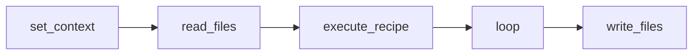
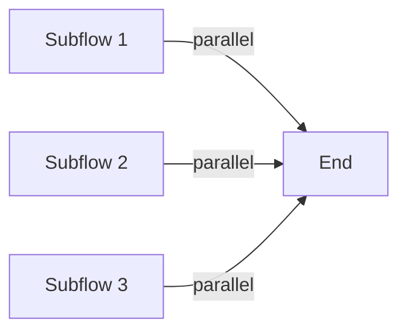
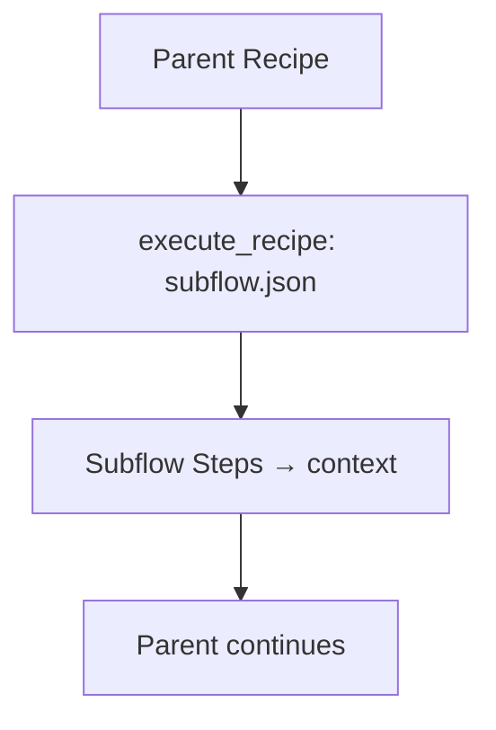

# Recipe JSON Authoring Guide

[document-generator]

**Date:** 7/1/2025 04:22:21 PM

## Introduction

The Recipe Executor framework turns natural-language ideas into reliable, automated workflows. At its core, a **recipe JSON file** is a strict, comment-free JSON document that defines an ordered list of steps—ranging from file I/O and conditionals to LLM calls and sub-recipes. When you run a recipe, the **Recipe Executor** loads and validates the JSON, applies Liquid templating to inject dynamic values, then executes each step in sequence against a shared context object. The result is a deterministic, reproducible pipeline that faithfully captures your intent.

This guide serves two audiences:

- **Human developers** writing or reviewing recipe JSON files by hand.
- **LLM-powered assistants** generating valid recipe JSON from plain-language prompts.

Throughout this document, we will cover the following main topics:

- **Basic Recipe Structure** → required fields, optional metadata, and runnable examples.
- **Working with Context** → how steps share data, common patterns, and pitfalls.
- **Built-in Step Types** → overview of all standard steps and when to use them.
- **Using Liquid Templating** → dynamic variables, filters, loops, and conditionals.
- **Best Practices & Patterns** → guidelines for maintainable, efficient recipes.
- **Recipe Cookbook** → copy-and-paste snippets for common automation scenarios.

## Basic Recipe Structure

A valid recipe JSON must be a strict, comment-free JSON object with a top-level `steps` array. The executor:

- **Requires** a `"steps"` array of objects, each with a `"type"` (step name) and a `"config"` object.
  ```json
  {
    "steps": [
      /*  … */
    ]
  }
  ```
- **Errors** if any step’s `type` is not registered in the executor’s `STEP_REGISTRY`.

Optional top-level blocks—such as `"inputs"`, `"outputs"`, and `"description"`—may be present for metadata. The executor ignores any unknown top-level keys (no error).

### Minimal Runnable Example

A one-step recipe that sets a context key:

```json
{
  "steps": [
    {
      "type": "set_context",
      "config": {
        "key": "greeting",
        "value": "Hello, world!"
      }
    }
  ]
}
```

### Skeleton with Common Steps



```json
{
  "inputs": {
    "input_path": { "description": "File to read", "type": "string" }
  },
  "description": "Skeleton showing core steps",
  "steps": [
    {
      "type": "set_context",
      "config": { "key": "root", "value": "./data" }
    },
    {
      "type": "read_files",
      "config": {
        "path": "{{ input_path }}",
        "content_key": "raw"
      }
    },
    {
      "type": "execute_recipe",
      "config": { "recipe_path": "sub_recipe.json" }
    },
    {
      "type": "loop",
      "config": {
        "items": "raw.items",
        "item_key": "item",
        "substeps": [
          /* … */
        ],
        "result_key": "processed"
      }
    },
    {
      "type": "write_files",
      "config": {
        "files_key": "processed",
        "root": "./out"
      }
    }
  ]
}
```

## Working with Objects Between Recipe Steps

The **Context** object in Recipe Executor is a shared, dictionary-like container that flows through all steps. It stores artifacts (results, data objects) and configuration values without requiring manual serialization. Steps directly read or write context keys, passing complex data structures by reference. Under the hood, no JSON dumps or loads are needed— the executor handles objects natively.

### Reading and Writing Context Keys

- **Read**: Steps use Liquid templating (`{{ key }}`) to inject context values.
- **Write**: Use `set_context` or the built-in step implementations to assign new keys.
- **Shared by reference**: When you set a list or dict, downstream steps see the same object (deep-copied at context creation).

### Common Patterns

1. **Simple value injection with `set_context`**:
   ```json
   {
     "type": "set_context",
     "config": {
       "key": "username",
       "value": "alice"
     }
   }
   ```
2. **Passing complex objects via `context_overrides` in `execute_recipe`**:
   ```json
   {
     "type": "execute_recipe",
     "config": {
       "recipe_path": "sub_recipe.json",
       "context_overrides": {
         "settings": {
           "retries": "{{ settings.retries }}",
           "timeout": "{{ settings.timeout }}"
         }
       }
     }
   }
   ```
   The sub-recipe sees `settings` as a dict without manual JSON parsing.
3. **Collecting per-item results in a loop**:
   ```json
   {
     "steps": [
       {
         "type": "loop",
         "config": {
           "items": "user_ids",
           "item_key": "user_id",
           "substeps": [
             {
               "type": "llm_generate",
               "config": {
                 "prompt": "Process user {{ user_id }}",
                 "output_format": "text",
                 "output_key": "result"
               }
             }
           ],
           "result_key": "user_results"
         }
       }
     ]
   }
   ```
   After execution, `context.user_results` is a list of each step’s `result`.

### Common Mistakes to Avoid

- **Unnecessary JSON filters**: You rarely need `| json` to pass objects. Liquid will render objects transparently when using direct dict literals or nested `set_context` values.
- **Forgetting `result_key` in loops**: Omitting `result_key` means your loop’s outputs are not saved, and you lose all per-item results.
- **Overwriting context unintentionally**: Using `set_context` without `if_exists: "merge"` will replace existing lists or dicts instead of appending or merging.

By following these patterns and avoiding the pitfalls, you can leverage the Context object to coordinate data flow cleanly across simple steps, sub-recipes, and loops.

## Built-in Step Types and Configuration

The Recipe Executor provides a set of built-in step types that cover the most common automation needs—from reading and writing files to branching logic, loops, sub-recipes, LLM calls, and external tool integration. By relying on these well-defined building blocks, you can assemble complex workflows without custom code. Each step type encapsulates a specific concern, ensuring consistency, reliability, and clear error handling across recipes.

Below you will find reference entries for each built-in step. Each entry explains the step’s purpose, configuration schema (including defaults), usage examples, and common pitfalls. Consult these reference sections whenever you need to understand a step’s options, discover how to format its JSON config, or decide which step best fits a particular task.

| Step Type      |
| -------------- |
| conditional    |
| execute_recipe |
| llm_generate   |
| loop           |
| mcp            |
| parallel       |
| read_files     |
| set_context    |
| write_files    |

### `read_files`

**Purpose**
Load one or more files from disk into the shared context so subsequent steps can consume their contents.

**When to use**
• You need to read external data (specs, templates, JSON/YAML files, text documents) into your recipe.
• Pre‐load resources before generating text with an LLM, or before looping over file contents.

**Key Configuration** (defaults shown)

```json
{
  "type": "read_files",
  "config": {
    "path": <string | [List<string>]>,   // no default, required
    "content_key": <string>,            // no default, required
    "optional": false,                  // default: false
    "merge_mode": "concat"            // default: "concat", other option: "dict"
  }
}
```

- **path**: Single path, comma-separated paths, glob pattern, or list of paths. Supports Liquid templating.
- **content_key**: Context key under which to store the file content.
- **optional**: If `true`, missing files are skipped (empty string for single files, omitted entries for merges) instead of raising an error.
- **merge_mode**:
  - `"concat"`: Join multiple file contents into one string, separated by filename headers and newlines.
  - `"dict"`: Return a JSON/dict mapping each filepath to its contents.

**Notable Pitfalls**

- Forgetting `optional:true` when files may not exist will cause a `FileNotFoundError`.
- Default `merge_mode:"concat"` can make it hard to split content by source file; use `"dict"` if you need per‐file access.
- When reading JSON/YAML, the step will parse it automatically—ensure `merge_mode` still matches your desired output structure.
- Globs and comma-lists are expanded before optional logic; an empty glob may still error unless `optional:true`.

**Examples**

1. Read a single Markdown spec:

```json
{
  "type": "read_files",
  "config": {
    "path": "specs/component_spec.md",
    "content_key": "component_spec"
  }
}
```

2. Read multiple docs and concatenate:

```json
{
  "type": "read_files",
  "config": {
    "path": ["docs/intro.md", "docs/usage.md"],
    "content_key": "combined_docs",
    "merge_mode": "concat"
  }
}
```

3. Read multiple specs into a dictionary:

```json
{
  "type": "read_files",
  "config": {
    "path": "configs/*.json",
    "content_key": "config_map",
    "merge_mode": "dict",
    "optional": true
  }
}
```

4. Templated path and key:

```json
{
  "type": "read_files",
  "config": {
    "path": "templates/{{template_name}}.txt",
    "content_key": "{{template_name | snakecase}}_template"
  }
}
```

### `write_files`

Purpose

Write one or more files to the local file system using content held in the execution context. This step handles directory creation, path templating, and optional JSON serialization for structured content.

When to use

• At the end of a recipe to persist generated artifacts (code, documentation, data) to disk.
• When you have collected a list of `FileSpec` objects or file-dictionary entries in context.

Key Configuration (defaults shown)

```json
{
  "type": "write_files",
  "config": {
    "files_key": <string?>,    // default: null (use `files` instead)
    "files": <list<dict>?>,    // default: null
    "root": "."             // default: current working directory
  }
}
```

• **files_key**: Context key that holds a `FileSpec` or a list of `FileSpec` objects (preferred).  
• **files**: Direct list of `{ path: string, content: string|object }` entries. If both `files_key` and `files` are provided, `files` takes precedence.  
• **root**: Base directory to prefix to each file’s path. Subdirectories are created automatically.

Notable Pitfalls

• Failing to set either `files_key` or `files` yields a validation error.  
• Templated file paths must resolve to valid, safe file names; illegal characters or empty templates can cause failures.  
• When writing Python dictionaries or lists, the step automatically serializes to JSON. If the object isn’t JSON-serializable, a serialization error is thrown.  
• Existing files are overwritten without prompt—ensure you don’t accidentally zap important files.

Examples

1. Using `files_key` populated by an LLM step:

```json
{
  "steps": [
    {
      "type": "llm_generate",
      "config": {
        "prompt": "Generate a README.md content.",
        "output_format": "text",
        "output_key": "readme_content"
      }
    },
    {
      "type": "write_files",
      "config": {
        "files_key": "readme_content",
        "root": "output/docs"
      }
    }
  ]
}
```

2. Writing multiple files with inline definitions and automatic JSON formatting:

```json
{
  "steps": [
    {
      "type": "write_files",
      "config": {
        "files": [
          {
            "path": "config.json",
            "content": { "version": "1.0", "features": ["A", "B", "C"] }
          },
          {
            "path": "logs/{{date}}.log",
            "content_key": "run_logs"
          }
        ],
        "root": "output"
      }
    }
  ]
}
```

3. Using `path_key` and `content_key` to dynamically drive both path and content:

```json
{
  "steps": [
    {
      "type": "write_files",
      "config": {
        "files": [
          {
            "path_key": "artifact_path",
            "content_key": "artifact_data"
          }
        ],
        "root": "build"
      }
    }
  ]
}
```

In all cases, `write_files` will ensure parent directories exist and write each file using UTF-8 encoding.

### `set_context`

**Purpose**
Provide a declarative way to create or update artifacts in the shared execution context by assigning literal values or rendered templates to a context key. Supports simple assignments, shallow merges, and recursive rendering when needed.

**When to use**

- To introduce static values or templates into context before other steps run.
- To accumulate or update context data (e.g., appending to a log, building up a document).
- When you need to merge new information into an existing list or dictionary without writing custom code.

**Key Configuration** (defaults shown)

```json
{
  "type": "set_context",
  "config": {
    "key": <string>,               // required: context key
    "value": <string|list|dict>,  // required: literal or template string, list, or dict
    "nested_render": false,       // default: false
    "if_exists": "overwrite"    // default: overwrite; other option: "merge"
  }
}
```

- **nested_render**: When `true`, repeatedly applies Liquid templating to strings or nested structures until no tags remain (useful for multi-stage templates).
- **if_exists**:
  - `"overwrite"`: Replace any existing value at `key` (default).
  - `"merge"`: Shallow-merge by type:
    - `str + str` → concatenation
    - `list + list` or `list + item` → append
    - `dict + dict` → shallow dict merge (new keys overwrite)
    - mismatched types → `[old, new]`

**Notable Pitfalls**

- Forgetting to set `if_exists: "merge"` when you expect to append or combine values—by default, you’ll overwrite previous data.
- Deep-nested structures are only shallow-merged; nested keys are not recursively merged.
- Using `nested_render` can lead to infinite loops if templates reintroduce tags—use with care and wrap unchanged sections in `` blocks.
- Invalid template expressions in `value` will raise a `ValueError` at render time.

**Examples**

1. **Simple assignment**

```json
{
  "type": "set_context",
  "config": {
    "key": "username",
    "value": "alice"
  }
}
```

2. **Merging a list**

```json
{
  "type": "set_context",
  "config": {
    "key": "tasks",
    "value": ["build", "test"],
    "if_exists": "merge"
  }
}
```

If `context.tasks` was `["lint"]`, after this it becomes `["lint","build","test"]`.

3. **Shallow merging a dict**

```json
{
  "type": "set_context",
  "config": {
    "key": "settings",
    "value": { "timeout": 30 },
    "if_exists": "merge"
  }
}
```

Existing keys in `settings` are preserved unless overwritten by the new dict.

4. **Nested rendering**

```json
{
  "type": "set_context",
  "config": {
    "key": "prompt",
    "value": "Generate code for: {{ spec }}",
    "nested_render": true
  }
}
```

If `spec` itself contains Liquid tags, they will be fully resolved in successive passes.

### `conditional`

**Purpose**

The Conditional step enables branching execution paths based on a boolean expression evaluated against the current context. It lets you guard or skip sets of steps without external scripts, making recipes more dynamic and efficient.

**When to use**

- Guard sub-recipes or expensive LLM calls only when needed (e.g., only generate docs if input data changed).
- Check context values or filesystem state before proceeding (feature flags, presence of files).
- Implement fallback or alternative workflows within the same recipe.

**Key Configuration** (defaults shown)

```json
{
  "type": "conditional",
  "config": {
    "condition": <string|boolean>,   // required: a Liquid-rendered boolean or expression
    "if_true": {                     // optional: block to run when condition is true
      "steps": [ /* array of step objects */ ]
    },
    "if_false": {                    // optional: block to run when condition is false
      "steps": [ /* array of step objects */ ]
    }
  }
}
```

- **condition**: A literal `true`/`false` or a templated expression (e.g. `"{{ count }} > 0"`, `file_exists('out.txt')`, `and({{a}}, {{b}})`).
- **if_true** / **if_false**: Each contains its own `steps` array. Omit a branch to skip it silently.

**Notable Pitfalls**

- Invalid or unrendered Liquid tags in `condition` raise an error; verify your templates resolve to plain booleans or boolean-coercible strings.
- Omitting both `if_true` and `if_false` results in a no-op—make sure at least one branch exists if you expect action.
- Boolean functions (`and`, `or`, `not`) must be called as functions, not Python keywords: `and(x, y)`, `not(x)`.
- Relying on string values like `"true"`/`"false"` works (they’re coerced), but other types may not behave as expected.

**Examples**

1. Simple context check:

```json
{
  "type": "conditional",
  "config": {
    "condition": "{{ user.is_active }}",
    "if_true": {
      "steps": [
        {
          "type": "set_context",
          "config": { "key": "welcome", "value": "Welcome back!" }
        }
      ]
    }
  }
}
```

2. File-existence branching:

```json
{
  "type": "conditional",
  "config": {
    "condition": "file_exists('{{ output_dir }}/report.json')",
    "if_true": {
      "steps": [
        {
          "type": "read_files",
          "config": {
            "path": "{{ output_dir }}/report.json",
            "content_key": "report",
            "merge_mode": "dict"
          }
        }
      ]
    },
    "if_false": {
      "steps": [
        {
          "type": "llm_generate",
          "config": {
            "prompt": "Generate report from {{ data }}",
            "output_format": "text",
            "output_key": "report"
          }
        }
      ]
    }
  }
}
```

3. Combined logical expression:

```json
{
  "type": "conditional",
  "config": {
    "condition": "and({{ has_config }}, file_exists('settings.yaml'))",
    "if_true": {
      /* steps when both conditions are true */
    },
    "if_false": {
      /* steps otherwise */
    }
  }
}
```

### `loop`

Purpose

The **Loop** step enables you to iterate over a collection of items in the context, running a defined set of sub‐steps for each element. It isolates each item’s work in a cloned context so you can process batches of data without writing custom scripts.

When to use

• **Batch processing**: apply the same operations (LLM calls, file writes, sub-recipes) to a list or map of inputs.
• **Data transformation**: transform arrays or dicts into new artifacts.
• **Concurrent tasks**: speed up independent work by processing items in parallel.

Key Configuration (defaults shown)

```json
{
  "type": "loop",
  "config": {
    "items": <string | list | dict>,   // required: path or literal collection
    "item_key": "<string>",         // required: context key for current item
    "substeps": [ <step objects> ],   // required: steps to run per item
    "result_key": "<string>",       // required: where to store results array

    // Optional fields:
    "max_concurrency": 1,            // default: 1 = sequential; 0 = unlimited parallel
    "delay": 0.0,                    // default: 0.0s between starting parallel tasks
    "fail_fast": true                // default: true = stop on first error
  }
}
```

Notable Pitfalls

- **Missing `result_key`**: If you omit `result_key`, your loop’s results are discarded.
- **Forgetting `item_key`**: Without `item_key`, sub-steps cannot reference the current item.
- **Sequential by default**: `max_concurrency:1` can be slow for many items. Increase to >1 or 0 for parallelism.
- **Shared context isolation**: Each iteration uses a cloned context. Do **not** rely on sub-step side-effects carrying over between items.
- **Error handling**: With `fail_fast:true` (default), one failure aborts the entire loop. Set `fail_fast:false` to collect successes and log errors.

Examples

1. Basic sequential loop:

```json
{
  "steps": [
    {
      "type": "loop",
      "config": {
        "items": "user_ids",
        "item_key": "user_id",
        "substeps": [
          {
            "type": "llm_generate",
            "config": {
              "prompt": "Analyze user {{user_id}} record.",
              "output_format": "text",
              "output_key": "analysis"
            }
          }
        ],
        "result_key": "user_analyses"
      }
    }
  ]
}
```

After execution, `context.user_analyses` is an array of each iteration’s `analysis` output.

2. Parallel loop with concurrency and delay:

```json
{
  "steps": [
    {
      "type": "loop",
      "config": {
        "items": "files_to_process",
        "item_key": "file_path",
        "substeps": [
          {
            "type": "read_files",
            "config": { "path": "{{file_path}}", "content_key": "content" }
          },
          {
            "type": "llm_generate",
            "config": {
              "prompt": "Summarize:\n{{content}}",
              "output_format": "text",
              "output_key": "summary"
            }
          }
        ],
        "result_key": "summaries",
        "max_concurrency": 5,
        "delay": 0.2,
        "fail_fast": false
      }
    }
  ]
}
```

This runs up to 5 files at once, waits 0.2 s between task launches, and continues on individual failures (collecting only successful summaries).

### `parallel`

**Purpose**

Run multiple sub-steps concurrently within a single recipe step, improving performance for independent tasks by parallelizing them while isolating each sub-step’s context.

**When to use**

- You have independent operations (e.g., data transforms, sub-recipes) that can run at the same time without affecting each other.
- You want to speed up workflows that involve many similar, non-dependent tasks (for example, generating or writing files for multiple components).
- You need to control concurrency to balance resource usage (CPU, I/O) across parallel work.

**Key Configuration** (defaults shown)

```json
{
  "type": "parallel",
  "config": {
    "substeps": [
      /* required: list of step objects */
    ],
    "max_concurrency": 0, // default: 0 = no limit (all run at once)
    "delay": 0.0 // default: 0.0 seconds between starts
  }
}
```

- **substeps**: Array of step definitions (each typically an `execute_recipe` or other step config) to run in parallel.
- **max_concurrency**: Maximum number of substeps to launch simultaneously. `0` (default) = unlimited; `1` = sequential; `n>1` = up to `n` at a time.
- **delay**: Seconds to wait between starting each substep, helping to stagger load.

**Notable Pitfalls**

- If any substep fails, the default behavior is **fail-fast**: all remaining substeps are cancelled and the step errors.
- Because each substep receives a **clone** of the parent context, side-effects (writes) do **not** merge back automatically; use shared external storage or collect results explicitly if you need aggregated output.
- Overwhelming resources: unlimited concurrency (`0`) can exhaust CPU or I/O — set `max_concurrency` to a safe level for your environment.
- Delay too short or zero can still flood resource pools; tune `delay` for your runner.

**Examples**

1. Run two sub-recipes concurrently:

```json
{
  "type": "parallel",
  "config": {
    "substeps": [
      {
        "type": "execute_recipe",
        "config": { "recipe_path": "recipe_a.json" }
      },
      { "type": "execute_recipe", "config": { "recipe_path": "recipe_b.json" } }
    ],
    "max_concurrency": 2,
    "delay": 0.5
  }
}
```

This launches both sub-recipes at once (up to 2) and waits 0.5 s between them.

2. Process a large list of items with limited parallelism:

```json
{
  "type": "parallel",
  "config": {
    "substeps": [
      {
        "type": "execute_recipe",
        "config": {
          "recipe_path": "process_item.json",
          "context_overrides": { "item": "{{current_item}}" }
        }
      }
    ],
    "max_concurrency": 5,
    "delay": 0.1
  }
}
```

Use `max_concurrency: 5` and a short delay to process up to five items at once.

3. Simple parallel tasks (no concurrency limit):

```json
{
  "type": "parallel",
  "config": {
    "substeps": [
      {
        "type": "write_files",
        "config": {
          /* … */
        }
      },
      {
        "type": "set_context",
        "config": {
          /* … */
        }
      },
      {
        "type": "llm_generate",
        "config": {
          /* … */
        }
      }
    ]
  }
}
```

All three substeps will run concurrently, each in its own context clone.

### `execute_recipe`

**Purpose**

The `execute_recipe` step runs another recipe file (a “sub-recipe”) as part of your current workflow. It uses the same `Context` object (shared state) by default, but allows you to override or inject specific context values for the sub-execution. This enables you to break a large workflow into reusable modules or to conditionally delegate work to specialized recipes.

**When to use**

- **Composing workflows**: Chain multiple recipes (e.g., load data, analyze, generate code) in a single top-level recipe.
- **Modularity & reuse**: Extract common tasks (e.g., build component, generate docs) into their own recipes and call them where needed.
- **Context scoping**: You can pass only the values a sub-recipe needs via `context_overrides`, avoiding global namespace clutter.

**Key Configuration** (defaults shown)

```json
{
  "type": "execute_recipe",
  "config": {
    "recipe_path": "recipes/sub_recipe.json", // required: path to the recipe file
    "context_overrides": {} // optional: dict of key→value to set before sub-execution
  }
}
```

- **recipe_path** (string, required): Local filesystem path (or templated path) to a JSON recipe file.
- **context_overrides** (dict, default `{}`): Additional or replacement context artifacts for the sub-recipe. Keys and values support Liquid templating; non-string values (lists, dicts) are passed through as-is.

**Notable Pitfalls**

- **Path templating errors**: If your `recipe_path` template doesn’t resolve to a valid file, you’ll get a `FileNotFoundError`.
- **Unparsed JSON strings**: When you pass JSON objects or lists as strings in `context_overrides`, be sure they are valid JSON and, if necessary, use `| json` in templates or `ast.literal_eval` in custom steps to convert them.
- **Context collisions**: Overrides apply **before** the sub-recipe runs and persist back into the parent context. Use unique keys or scoped names to avoid overwriting parent data.
- **Circular recipes**: Avoid recipes that call each other in a loop—this will cause infinite recursion and eventual failure.

**Examples**

1. **Minimal sub-recipe execution**

```json
{
  "type": "execute_recipe",
  "config": {
    "recipe_path": "recipes/cleanup.json"
  }
}
```

2. **Passing overrides**

```json
{
  "type": "execute_recipe",
  "config": {
    "recipe_path": "recipes/generate_component.json",
    "context_overrides": {
      "component_id": "utils",
      "output_dir": "./out/components/utils",
      "retry_count": 0
    }
  }
}
```

3. **Templated recipe path & nested values**

```json
{
  "type": "execute_recipe",
  "config": {
    "recipe_path": "recipes/{{ module_name }}/build_{{ env | default: 'dev' }}.json",
    "context_overrides": {
      "settings": {
        "timeout": "{{ timeout | default: '30' }}",
        "flags": {{ flags | json }}
      }
    }
  }
}
```

In these examples, the specified sub-recipe is loaded, its own steps are executed in sequence, and any new artifacts it writes to context become available to downstream steps in the parent recipe.

### `llm_generate`

**Purpose**
Enable content generation via Large Language Models (LLMs), handling prompt templating, model selection, optional tool integration (MCP servers or built-in tools), and structured output. Results are stored back into the recipe context for downstream steps.

**When to use**

- You need to call an LLM (OpenAI, Anthropic, Azure, Ollama, Responses API) to generate text, code, JSON, or file specifications.
- You want to enforce a schema on LLM output (object or list) and validate results automatically.
- You require external tool access via MCP servers (e.g., web search) during generation.

**Key Configuration** (defaults shown)

```json
{
  "type": "llm_generate",
  "config": {
    "prompt": "<string>", // required: the rendered prompt
    "model": "openai/gpt-4o", // default model identifier
    "max_tokens": null, // optional integer cap on tokens
    "mcp_servers": null, // optional array of MCP server configs
    "openai_builtin_tools": null, // optional list of built-in tools for Responses API
    "output_format": "text", // one of:
    //   "text" (string),
    //   "files" (list of FileSpec),
    //   { … } (JSON schema for object),
    //   [ { … } ] (JSON schema array)
    "output_key": "llm_output" // context key for storing results
  }
}
```

- **prompt**: supports Liquid templating against current context.
- **model**: provider/model_name or provider/model_name/deployment_name.
- **mcp_servers**: each entry must be a valid MCP server config dict (HTTP or stdio).
- **openai_builtin_tools**: only for `openai_responses/*` or `azure_responses/*`; validated tool types.
- **output_format**:
  - **"text"** → plain string.
  - **"files"** → returns List<FileSpec> (path/content pairs).
  - **object** or **list** schemas → validated via JSON‐schema, returned as Python dict/list.
- **output_key**: where to place the result in context.

**Notable Pitfalls**

- Forgetting to set a proper `output_format` schema leads to unparsed raw strings or runtime errors.
- Omitting `output_key` or reusing a key unintentionally overwrites existing context data.
- Using `openai_builtin_tools` with non-Responses models raises a validation error.
- Passing MCP server configs without `get_mcp_server` formatting can cause connection failures.
- Liquid templates in `prompt` must render to valid text—missing context keys produce empty prompts.

**Examples**

1. **Text generation** (default):

```json
{
  "type": "llm_generate",
  "config": {
    "prompt": "What is the capital of France?",
    "output_format": "text",
    "output_key": "capital_answer"
  }
}
```

After execution:

```json
{ "capital_answer": "The capital of France is Paris." }
```

2. **FileSpec output** (generate multiple files):

```json
{
  "type": "llm_generate",
  "config": {
    "prompt": "Generate Python utility files for data cleaning.",
    "output_format": "files",
    "output_key": "utils_files"
  }
}
```

Context result:

```json
{
  "utils_files": [
    { "path": "clean.py", "content": "def clean(data): ..." },
    { "path": "validate.py", "content": "def validate(data): ..." }
  ]
}
```

3. **Structured JSON output** (object schema):

```json
{
  "type": "llm_generate",
  "config": {
    "prompt": "Extract user info from text: {{input_text}}",
    "output_format": {
      "type": "object",
      "properties": {
        "name": { "type": "string" },
        "age": { "type": "integer" }
      },
      "required": ["name", "age"]
    },
    "output_key": "user_profile"
  }
}
```

After execution:

```json
{ "user_profile": { "name": "Alice", "age": 30 } }
```

4. **Responses API with built-in web search tool**:

```json
{
  "type": "llm_generate",
  "config": {
    "prompt": "Find current stock price of {{ticker}}.",
    "model": "openai_responses/gpt-4o",
    "openai_builtin_tools": [{ "type": "web_search_preview" }],
    "output_format": "text",
    "output_key": "stock_price"
  }
}
```

The step validates tool usage, invokes the Responses API with search, and stores the answer in `stock_price`.

### `mcp`

Purpose

The `mcp` step connects to a remote MCP (Model-Context-Protocol) server to invoke a named tool and store its result in the shared context. It provides a lightweight, declarative way to call external services (e.g., search engines, code runners, data fetchers) without embedding custom client code in your recipe.

When to use

• When your workflow needs to call a tool exposed by an MCP server (HTTP or STDIO) to perform operations like web search, data lookup, code execution, or any custom tool.
• To keep recipes declarative: let the `mcp` step handle connection details, argument passing, error wrapping, and result conversion.

Key Configuration (with defaults)

```json
{
  "type": "mcp",
  "config": {
    "server": {
      /* required: see formats below */
    },
    "tool_name": "<string>", // required: name of the MCP tool to call
    "arguments": {
      /* object */
    }, // required: dict of tool arguments
    "result_key": "tool_result" // default: "tool_result"
  }
}
```

Server config formats:

- **HTTP MCP server**
  ```json
  "server": {
    "url": "http://localhost:3001/sse",
    "headers": { "Authorization": "{{token}}" }
  }
  ```
- **STDIO MCP server**
  ```json
  "server": {
    "command": "python",
    "args": ["-m", "my_mcp_server"],
    "env": { "API_KEY": "{{api_key}}" },
    "working_dir": "/path/to/server"
  }
  ```

Notable Pitfalls

- **Invalid server config**: Missing `url`/`command` or mis-typed keys will raise a `ValueError` before calling the tool.
- **Empty or malformed arguments**: Ensure `arguments` is a JSON object; passing a string or list will trigger a validation error.
- **Result key collisions**: The default `tool_result` may overwrite existing context values—set `result_key` explicitly for clarity.
- **Environment-variable interpolation**: If you leave an env var blank (`""`), the step attempts to load it from the system environment or `.env` file; missing values may still result in runtime errors.

Examples

1. HTTP MCP server call (stock lookup)

```json
{
  "type": "mcp",
  "config": {
    "server": {
      "url": "http://localhost:5000/sse",
      "headers": { "api_key": "{{BRAVE_API_KEY}}" }
    },
    "tool_name": "get_stock",
    "arguments": {
      "item_id": 123
    },
    "result_key": "stock_info"
  }
}
```

After execution:

```json
{
  "stock_info": {
    "item_id": 123,
    "name": "Widget",
    "price": 19.99
  }
}
```

2. STDIO MCP server call (custom tool)

```json
{
  "type": "mcp",
  "config": {
    "server": {
      "command": "./my_tool_server",
      "args": ["--mode", "fast"],
      "env": { "TOOL_TOKEN": "{{tool_token}}" },
      "working_dir": "./tools"
    },
    "tool_name": "process_data",
    "arguments": { "input": "{{raw_data}}" },
    "result_key": "processed"
  }
}
```

This step will launch the local `my_tool_server` process, pass arguments, call `process_data`, and place the returned JSON in `context.processed`.

## Using Liquid Templating for Dynamic Content

Liquid templating lets you inject context variables, transform values, loop over sequences, and conditionally render blocks—all without leaving your JSON. The executor’s Liquid environment (with `extra=True`) supports:

- **Variable substitution**: `{{ user.name }}`, `{{ files[0] }}`
- **Filters**: e.g. `default`, `json`, `snakecase`, `upcase`, `downcase`, `replace`, etc.
- **Loops**: `` to repeat or build new structures
- **Conditionals**: `` blocks or inline expressions: `{{ x if cond else y }}`
- **Ternary & tail filters**: inline `if…else` plus post‐filter chaining (e.g. `{{ a if b else c || upcase }}`)

Below are four diverse examples:

1. Dynamic path construction in a `read_files` step

```json
{
  "type": "read_files",
  "config": {
    "path": "logs/{{ date | replace: '-', '/' }}/events.json",
    "content_key": "daily_events"
  }
}
```

2. Fallback to a default value when a variable is empty or undefined

```liquid
{{ user.email | default: "not_available@example.com" }}
```

3. Building a list of emails with a `` loop and splitting into an array

```json
{
  "type": "set_context",
  "config": {
    "key": "email_list",
    "value": "{{ user.email }}, {{ emails | split: ', ' }}"
  }
}
```

4. Inline conditional (ternary) to choose between two strings

```json
{
  "type": "set_context",
  "config": {
    "key": "plan",
    "value": "{{ \"Premium\" if order.total > 100 else \"Standard\" }}"
  }
}
```

### Embedding Large Content in Prompts

### Embedding Large Content in Prompts

Why this helps LLMs focus or ignore sections  
Wrap large blocks of text or markdown in unique, ALL-CAPS XML-like tags so that:

- The model sees clear boundaries for pasted content.
- You can refer to the entire block by its tag name (e.g. “in <SPEC> … </SPEC>”).
- The LLM can be instructed to treat the content as opaque or to selectively parse it.
- It reduces prompt-injection risk by isolating user data.

Dos & Don’ts

| Do                                                                               | Don’t                                                                                    |
| -------------------------------------------------------------------------------- | ---------------------------------------------------------------------------------------- |
| Use a single, unique tag name in ALL-CAPS, e.g. `<SPEC>` / `</SPEC>`             | Mix tag names (case-sensitive) or use common words as tag names                          |
| Place each opening and closing tag on its own line to improve visibility         | Embed tags inline within a paragraph                                                     |
| Always close every tag in matching order                                         | Leave unclosed tags or overlap tags (nested the same name)                               |
| Treat the content between tags as opaque—do not intersperse instructions or code | Inject additional prompts or logic inside the tagged block                               |
| If you need to template the wrapper, render the tags outside of the opaque block | Put Liquid tags inside an opaque block unless you want that block itself to be templated |

Prompt Snippet Example

```json
{
  "type": "llm_generate",
  "config": {
    "prompt": "You are a documentation assistant.\n\nPlease analyze the following specification and produce a summary:\n\n<SPEC>\n{{ long_markdown_spec }}\n</SPEC>\n\nFocus only on the content within <SPEC> and ignore any text outside the tags.\nProvide a concise bullet-list summary.",
    "output_format": "text",
    "output_key": "spec_summary"
  }
}
```

In this snippet:

- `{{ long_markdown_spec }}` holds the big doc.
- `<SPEC>` and `</SPEC>` clearly bracket the spec.
- The LLM is prompted to “focus only on the content within <SPEC>…</SPEC>,” so it won’t mix new instructions with the spec text.

## Best Practices and Patterns

- Break workflows into small, focused recipes that do one thing well; extract shared logic into sub-recipes and invoke them with `execute_recipe` for reuse and clarity.
- Choose clear, consistent context keys (e.g., `user_list`, `config_map`) and avoid “magic” strings—group related values in a dict instead of sprinkling ad-hoc keys.
- Guard expensive or optional I/O with `conditional` and `read_files(optional:true)` to skip missing files or prevent unnecessary LLM or disk operations.
- Tune `loop` and `parallel` steps deliberately: set `max_concurrency` and `delay` to balance throughput vs. resource load, and choose `fail_fast:true|false` based on whether you need early aborts or full batch results.
- Always supply a `result_key` in every `loop`—even if you ignore the output—to capture per-item results (or errors) and avoid silent data loss.
- Watch your token budget and prompt length: summarize or truncate large inputs where possible, and wrap big blocks in ALL-CAPS XML-like tags (e.g., `<SPEC>…</SPEC>`) so the LLM treats them as opaque units.
- Leverage `set_context(if_exists:"merge")` to combine values: strings concatenate, lists append, and dicts shallow-merge—avoiding full overwrites of existing data.
- Favor sub-recipes and context overrides over duplicating config: pass only what a sub-recipe needs via `context_overrides` to reduce cognitive load and simplify testing.
- Periodically review recipe size and complexity: if a single JSON file grows beyond a few dozen steps, consider breaking it into orchestrating recipes plus focused modules.

## Recipe Cookbook

Below are four ready-to-paste JSON snippets illustrating common automation patterns. Each snippet includes:

- Purpose
- Typical use cases
- Natural-language flow summary
- Mermaid diagram (when helpful)
- Valid JSON recipe snippet

---

### 1. Conditional File Check & Fallback

Purpose
• Check whether a file exists and take one of two paths: read it if present or provide a default otherwise.

Typical Use Cases
• Optional configuration files
• Caching: reuse existing results or regenerate
• Guard expensive operations behind a file check

Flow Summary

1. Evaluate `file_exists(input_path)`
2. If **true**, read the file into context
3. If **false**, assign a default (empty string, default data, or trigger a fallback step)

Mermaid Diagram

```mermaid
flowchart TD
  A[Start] --> B{file_exists('{{ input_file }}')}
  B -- yes --> C[read_files → data]
  B -- no  --> D[set_context: data=""]
  C --> E[Next Steps]
  D --> E
```

JSON Snippet

```json
{
  "steps": [
    {
      "type": "conditional",
      "config": {
        "condition": "file_exists('{{ input_file }}')",
        "if_true": {
          "steps": [
            {
              "type": "read_files",
              "config": {
                "path": "{{ input_file }}",
                "content_key": "data",
                "merge_mode": "dict"
              }
            }
          ]
        },
        "if_false": {
          "steps": [
            {
              "type": "set_context",
              "config": {
                "key": "data",
                "value": ""
              }
            }
          ]
        }
      }
    }
  ]
}
```

---

### 2. Batch Loop Over Items (with Concurrency)

Purpose
• Iterate over a list or map of items, running the same sub-steps for each, optionally in parallel.

Typical Use Cases
• Process a batch of files or records
• Generate per-item outputs via LLM calls or sub-recipes
• Collect results and errors in a single pass

Flow Summary

1. Resolve `items` from context (list or dict)
2. For each item, clone context and set `item_key`
3. Execute sub-steps (e.g., an LLM call or a sub-recipe)
4. Collect each iteration’s output under `result_key`
5. (Optional) run up to N tasks in parallel, with an inter-task delay

Mermaid Diagram

```mermaid
flowchart TD
  subgraph Loop
    direction TB
    A[items list] -->|parallel| B[process_item {{__index}}]
    B --> C[result collection]
  end
```

JSON Snippet

```json
{
  "steps": [
    {
      "type": "loop",
      "config": {
        "items": "records",
        "item_key": "record",
        "substeps": [
          {
            "type": "llm_generate",
            "config": {
              "prompt": "Summarize record {{ record.id }}: {{ record.content }}",
              "output_format": "text",
              "output_key": "summary"
            }
          }
        ],
        "result_key": "summaries",
        "max_concurrency": 4,
        "delay": 0.2,
        "fail_fast": false
      }
    }
  ]
}
```

---

### 3. Parallel Independent Tasks

Purpose
• Launch multiple sub-steps (or sub-recipes) at the same time, each in its own context clone, to speed up independent work.

Typical Use Cases
• Generating multiple reports or documents concurrently
• Invoking different sub-workflows for distinct components
• Parallelizing CPU- or I/O-bound tasks (e.g., file writes, API calls)

Flow Summary

1. Define a list of independent step specs
2. Acquire up to `max_concurrency` slots
3. Launch each sub-step in its own context clone, with optional `delay`
4. Wait for all to complete or abort on first failure

Mermaid Diagram



JSON Snippet

```json
{
  "steps": [
    {
      "type": "parallel",
      "config": {
        "substeps": [
          {
            "type": "execute_recipe",
            "config": {
              "recipe_path": "recipes/build_docs.json"
            }
          },
          {
            "type": "execute_recipe",
            "config": {
              "recipe_path": "recipes/run_tests.json"
            }
          },
          {
            "type": "execute_recipe",
            "config": {
              "recipe_path": "recipes/deploy.json"
            }
          }
        ],
        "max_concurrency": 3,
        "delay": 0.1
      }
    }
  ]
}
```

---

### 4. Reusing Logic via `execute_recipe` (Sub-Recipe Composition)

Purpose
• Break complex workflows into reusable modules by invoking other recipes as steps, sharing and overriding context as needed.

Typical Use Cases
• Common utility flows (e.g., authentication, validation)
• Orchestrating multi-stage pipelines (e.g., extract → transform → load recipes)
• Parameterizing sub-recipes via `context_overrides`

Flow Summary

1. Apply any `context_overrides` to inject or override artifacts
2. Render and load the sub-recipe JSON
3. Execute its steps sequentially using the same shared context
4. Persist sub-recipe side-effects back into the parent context

Mermaid Diagram



JSON Snippet

```json
{
  "steps": [
    {
      "type": "execute_recipe",
      "config": {
        "recipe_path": "recipes/common/validate_input.json",
        "context_overrides": {
          "input": "{{ raw_input }}"
        }
      }
    },
    {
      "type": "execute_recipe",
      "config": {
        "recipe_path": "recipes/common/format_output.json"
      }
    }
  ]
}
```

---

Copy these snippets directly into your recipes to accelerate common automation patterns and maintain clean, modular workflows.

## Conclusion

In this guide, we’ve walked through everything you need to design reliable, maintainable recipe JSON files:

- **Recipe Structure**: How to assemble a valid JSON document with a required `steps` array, optional metadata blocks, and clear, consistent schemas for each step type.
- **Context Management**: Using the shared Context object to pass data between steps by reference, leveraging `set_context`, `context_overrides`, and avoiding common pitfalls like unintentional overwrites or missing `result_key` entries.
- **Liquid Templating**: Dynamically rendering variables, filters, loops, and conditionals to build prompts, file paths, and complex objects—all without leaving JSON.
- **Best Practices**: Craft small, focused recipes; extract reusable logic into sub-recipes; guard I/O with conditionals; tune concurrency and failure modes; and merge context values intentionally.

By combining these principles—strict structure, robust context handling, powerful templating, and actionable patterns—you can confidently generate recipes that scale from simple automations to complex, data-driven pipelines.

Now it’s your turn. Whether you’re hand-crafting JSON or guiding an LLM, apply these guidelines as your north star. And remember: recipes are living artifacts. Iterate, test, and refine your JSON definitions as requirements and environments evolve to keep your workflows reliable, efficient, and aligned with your goals.
