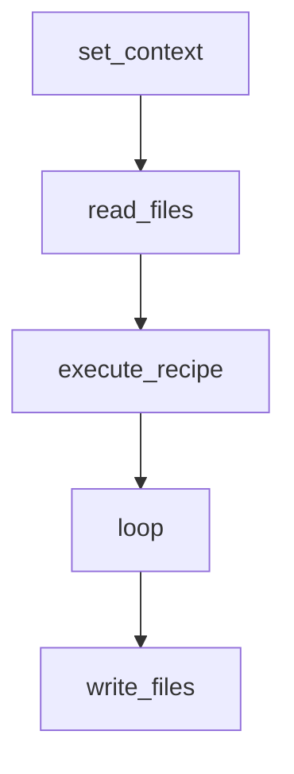
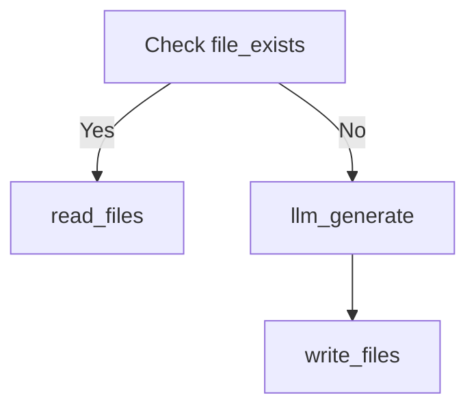
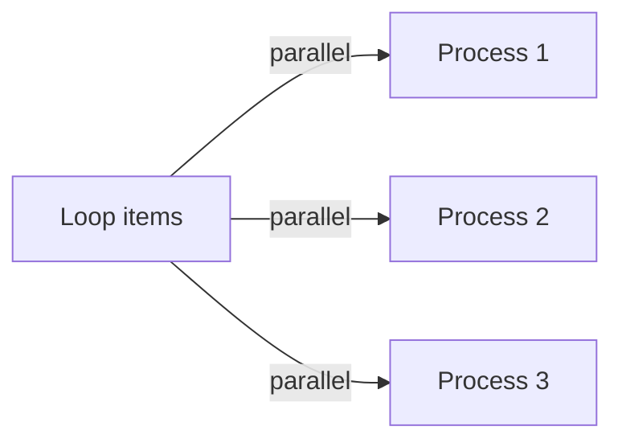
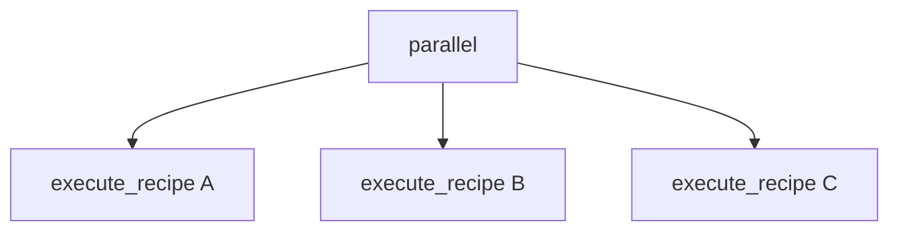
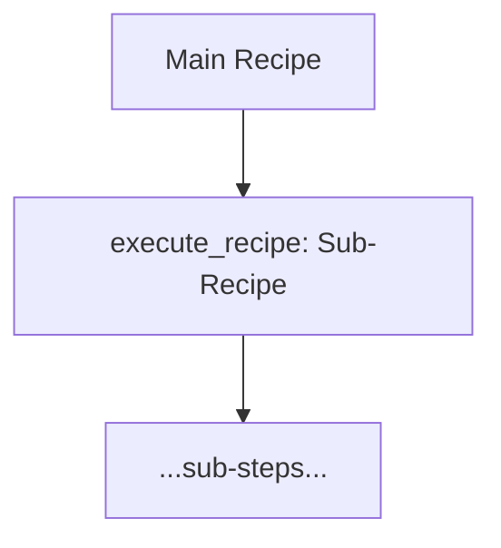

# Recipe JSON Authoring Guide

[document-generator]

**Date:** 8/16/2025 10:42:27 AM

## Introduction

Recipes are a bridge between natural-language intentions and reliable, repeatable automation. In the Recipe Tool framework, a **recipe** is a lightweight JSON file that encodes a sequence of steps, decision logic, and contextual data flow—effectively capturing the "what" and "how" of an automation workflow in a fully machine-readable but human-accessible format. The core of this system is the **Recipe Executor**, a deterministic engine that loads a recipe JSON file, initializes a shared context, and runs each defined step in order—combining logic, data movement, tool calls, and even large language model (LLM) invocations to fulfill complex user intentions.

A **recipe JSON file** details the workflow step-by-step, using strict JSON syntax (no comments or trailing commas) for maximum compatibility and clarity. Steps can range from file I/O and data processing to integrating smart decision branches, parallelism, or dynamic content generation via LLMs. The **Recipe Executor** interprets and executes these steps with high reliability: each step can read from and write to a shared context object, allowing information and results to move from one step to the next. This context-driven approach removes the need for manual data serialization or fragile glue code—making recipes robust and easy to reason about.

This guide is intended for two audiences:

- **Human developers** who want to hand-author, review, or debug recipe JSONs to automate their own workflows or to create libraries of reusable automation logic.
- **LLM assistants** or tools that are called upon to generate valid, fully-formed recipes in response to natural-language instructions—helping others automate, document, or operate complex systems without low-level scripting.

Both audiences will find in-depth explanations, best practices, code snippets, and reference patterns for moving smoothly between user intent, structured automation design, and machine execution.

**In the sections that follow, you'll learn:**

1. **Basic Recipe Structure:** The required and optional blocks of a recipe, strict JSON syntax rules, and minimal examples to get started.
2. **Working with Context:** How data flows between steps via the shared context, common access patterns, and tips for effective artifact management.
3. **Built-in Step Types:** Detailed entries for each standard step type, when to use them, configuration options, and illustrative examples.
4. **Templating with Liquid:** Powerful techniques for dynamic content, variable substitution, and filter usage within recipe configuration.
5. **Best Practices:** Actionable guidelines for composing, organizing, and scaling recipes—from small utilities to complex pipelines.
6. **Common Patterns & Cookbook:** Frequently used snippets, advanced usage tricks, and quick references to boost your recipe authoring skills.

Whether you're hand-crafting recipes or instructing an LLM to generate them, this guide equips you with all the essentials to design clear, maintainable, and effective automation workflows with the Recipe Tool ecosystem.

## Basic Recipe Structure

Every valid Recipe JSON file serves as a precise recipe for the executor. To guarantee consistent, deterministic execution, **recipes must adhere to a clear structure and strict JSON syntax**. This section outlines the essential and optional building blocks of a recipe file, and includes runnable code samples to get you started.

### 1. Required Top-level `"steps"` Array

- **The heart of any recipe is the `"steps"` array.** This array dictates the sequence of actions the executor will perform. Steps are ordered; each step runs after the previous one completes.
- **Strict JSON only:** No comments, no trailing commas, all keys in double quotes, and values that conform to JSON standards.
- Each step is an object with at least a `"type"` (string, specifying the step to run) and a `"config"` (dict, containing step-specific settings).
- **Unknown `type`:** If a step's `type` isn't recognized (i.e., not registered in the executor's step registry), execution will halt with a clear error. Adding custom steps requires updating the registry in code.

#### Example Skeleton (showing minimal structure):

```json
{
  "steps": [
    {"type": "read_files", "config": {"path": "input.txt", "content_key": "file_content"}},
    {"type": "llm_generate", "config": {"prompt": "Summarize: {{ file_content }}", "output_format": "text", "output_key": "summary"}},
    {"type": "write_files", "config": {"files": [{"path": "summary.txt", "content_key": "summary"}]}}
  ]
}
```

### 2. Optional Blocks (`inputs`, `outputs`, `description`)

- **`description`:** Free-form string for documentation. Useful for humans and debugging, ignored by the executor.
- **`inputs` / `outputs`:** Optional dictionaries mapping context keys to descriptions, types, and (for `inputs`) defaults. Used for documentation/UI hints but have no effect on step execution.
- **Ignored keys:** The executor explicitly ignores any top-level keys it does not recognize—provided `steps` is present and correct.

#### Example With Optional Blocks:

```json
{
  "description": "Generate a summary from an input file and save it.",
  "inputs": {
    "input_file": {"description": "Path to the input file.", "type": "string", "default": "input.txt"}
  },
  "outputs": {
    "summary": {"description": "Generated summary.", "type": "string"}
  },
  "steps": [ /* ...steps... */ ]
}
```

> **Note:** Only `steps` affects actual behavior. Document your inputs/outputs, but don't expect them to bind variables or enforce types automatically.

### 3. Minimal and Rich Examples

#### Minimal Runnable Example: One Step Recipe

This is the absolute simplest recipe that is accepted by the executor:

```json
{
  "steps": [
    { "type": "set_context", "config": { "key": "message", "value": "Hello, world!" } }
  ]
}
```

#### Slightly Larger Recipe Skeleton

This illustrates a common recipe pattern with five core step types:

```json
{
  "description": "Load config, process data in batch, and write output files.",
  "steps": [
    {
      "type": "set_context",
      "config": { "key": "config_path", "value": "config.json" }
    },
    {
      "type": "read_files",
      "config": { "path": "{{ config_path }}", "content_key": "config_data" }
    },
    {
      "type": "execute_recipe",
      "config": { "recipe_path": "recipes/data_processing.json", "context_overrides": { "config": "{{ config_data }}" } }
    },
    {
      "type": "loop",
      "config": {
        "items": "files_to_process",
        "item_key": "file",
        "result_key": "processed_files",
        "substeps": [
          {
            "type": "read_files",
            "config": { "path": "{{ file }}", "content_key": "file_content" }
          },
          {
            "type": "llm_generate",
            "config": { "prompt": "Analyze: {{ file_content }}", "output_format": "text", "output_key": "analysis" }
          }
        ]
      }
    },
    {
      "type": "write_files",
      "config": { "files": [ { "path": "results.txt", "content_key": "processed_files" } ] }
    }
  ]
}
```

#### Execution Flow Diagram (Mermaid)



**In summary:**
- Recipes must have a strictly valid JSON top-level object with a `steps` array of objects (each with `type` and `config`).
- All other keys are optional and ignored by the executor (but help with UI/documentation).
- Unknown step types or malformed JSON cause hard errors, not silent skips.
- Refer to provided samples and always validate with a JSON linter before use.


## Working with Objects Between Recipe Steps

A defining feature of the Recipe Executor is how every step in a recipe communicates using a shared **context object**. This section covers:
- How context facilitates data movement between steps (no manual serialization needed)
- The most common read/write patterns (`set_context`, `context_overrides` in `execute_recipe`)
- Gotchas and mistakes to avoid
- Practical, real-world code snippets for passing values, objects, and loop results

### Understanding the Shared Context

The context object acts as a live dictionary of key-value pairs, accessible (by reference) to every step in the recipe:
- **Write:** A step stores its result with `context[my_key] = value` (as seen in most step implementations like `llm_generate`, `read_files`, etc.).
- **Read:** Any later step simply accesses `context[my_key]` or uses interpolation with Liquid: `"{{ my_key }}"`.
- **Object support:** The context can store any JSON-serializable type—simple strings, arrays, or nested objects—directly, without extra conversion or encoding. There’s never a need to manually marshal objects to JSON and then de-serialize later steps.
- **Reference semantics:** Since the context is shared and passed by reference throughout the recipe, updates in one step are immediately visible to subsequent steps.

> **Tip:** You do *not* need to use filters like `| json` just to pass structured data between steps. Use Liquid only for templating strings or path lookups as needed.

### Common Context Patterns

#### 1. Setting and Retrieving Values with `set_context`

Use the `set_context` step to inject or compute values: this is often used at the start of a recipe, or to transform results for later steps.

**Example: Setting a model and a config object**
```json
{ "type": "set_context", "config": { "key": "model", "value": "openai/gpt-4o" } },
{ "type": "set_context", "config": {
   "key": "settings", 
   "value": { "temperature": 0.2, "max_tokens": 512 }
}}
```
Now other steps can reference `model` and the entire `{ "temperature": 0.2, ... }` object using `{{ settings.temperature }}`.

#### 2. Passing Complex Objects Directly

There is no need to serialize objects to strings; just use context keys for objects and lists. For example, storing a batch of parsed configs:

**Example: Passing an array of file configs**
```json
{ "type": "set_context", "config": {
  "key": "file_configs",
  "value": [
     { "path": "data1.csv", "desc": "dataset A" },
     { "path": "data2.csv", "desc": "dataset B" }
  ]
}}
```
You can loop over `file_configs` or access any item by key in later steps.

#### 3. Overriding Values for Sub-Recipes (`context_overrides`)

When calling a sub-recipe via `execute_recipe`, you can override or "inject" context values for that sub-recipe only, with no risk of polluting the outer scope.

**Example: Running a sub-recipe with an override**
```json
{
  "type": "execute_recipe",
  "config": {
    "recipe_path": "recipes/cleanup.json",
    "context_overrides": {
      "mode": "fast",
      "files": "{{ files_to_clean }}"
    }
  }
}
```
Inside the sub-recipe, `mode` and `files` are available in context, even if the parent recipe was using different values.

#### 4. Aggregating Results with Loops (Always Use `result_key`)

For `loop` steps, always provide a `result_key` to collect per-item outputs. The executor aggregates results from all iterations and writes them under this key when the loop completes.

**Example: Batch processing using `loop`**
```json
{
  "type": "loop",
  "config": {
    "items": "input_files",
    "item_key": "file",
    "result_key": "processed_results",
    "substeps": [
       { "type": "read_files", "config": { "path": "{{ file }}", "content_key": "content" } },
       { "type": "llm_generate", "config": { "prompt": "Summarize: {{ content }}", "output_format": "text", "output_key": "summary" } }
    ]
  }
}
```
After the loop, the context key `processed_results` contains all item summaries as an array.

---

### Common Mistakes to Avoid

- **Unnecessary use of `| json` filter:** It's rarely needed when passing native objects; context stores the data as-is, not as a string.
- **Forgetting `result_key` in loops:** If you don’t provide `result_key`, loop outputs will be lost—make it a habit to always specify this field, even if you don’t use the results directly.
- **Expecting each step to run in isolation:** Remember, all steps share the same context, so name your keys purposefully to avoid accidental overwrites (e.g., don’t always use a generic `result` or `output`).
- **Not using `context_overrides` for safely scoping changes:** If you want to test or adapt a sub-recipe, use `context_overrides` to avoid side effects.
- **Manual serialization/de-serialization:** Don’t convert objects to strings for context passing—just assign values directly.

---

### Pattern Reference: Three Common Snippets

#### Simple Value Pass
```json
{ "type": "set_context", "config": { "key": "username", "value": "{{ git_user }}" } },
{ "type": "llm_generate", "config": {
   "prompt": "Welcome {{ username }}!", "output_format": "text", "output_key": "welcome_message"
}}
```

#### Complex Object Pass
```json
{ "type": "set_context", "config": { "key": "app_config", "value": { "retry": 3, "timeout": 120 } } },
{ "type": "execute_recipe", "config": {
   "recipe_path": "recipes/subprocess.json",
   "context_overrides": { "settings": "{{ app_config }}" }
}}
```

#### Loop Iteration Collecting Results
```json
{ "type": "loop", "config": {
  "items": "file_list",
  "item_key": "file",
  "result_key": "file_contents",
  "substeps": [
    { "type": "read_files", "config": { "path": "{{ file }}", "content_key": "content" } }
  ]
}}
```
Now, `file_contents` will be an array of the file's content, in the same order as `file_list`.

---

**In summary:** The context object makes passing and transforming data between recipe steps seamless and natural. Lean into this shared state to build modular, readable, and reliable automations—while being mindful of naming and result aggregation patterns.

## Built-in Step Types and Configuration

The Recipe Executor's strength lies in its modular step system. Each step type represents a building block for automation: a focused, reusable unit of work that knows how to accomplish a specific action, from file operations to branching, looping, or invoking LLMs. By chaining these step types in a recipe's `steps` array, you create workflows that are both expressive and easy to reason about. Step types matter because they formally define what the executor can do out-of-the-box—and, crucially, let you assemble sophisticated logic without any code changes or scripting.

Each built-in step type has a well-defined configuration interface, described in this guide using a reference entry that covers its purpose, typical use cases, required and optional configuration keys (with defaults), common pitfalls, and complete runnable examples. These entries follow a repeatable structure, so you always know where to look for syntax, patterns, or troubleshooting tips. If you are authoring a new recipe or instructing an LLM, refer to these step type docs whenever you are unsure about required fields, allowed values, or the best way to chain functionality. 

Below is a reference table of all step types currently built into the Recipe Executor. The upcoming subsections will discuss each in detail, in this exact order:

| Step Type        | Purpose / Typical Use                                 |
|------------------|------------------------------------------------------|
| `read_files`     | Read one or more files (text, JSON, YAML) from disk   |
| `write_files`    | Write one or more files to disk from context objects  |
| `set_context`    | Add or update a value in the shared context           |
| `conditional`    | Branch execution based on a boolean expression        |
| `loop`           | Iterate over a collection, running substeps per item  |
| `parallel`       | Run multiple (sub-)recipes concurrently               |
| `execute_recipe` | Invoke a separate recipe file (with optional overrides)|
| `llm_generate`   | Generate content using a large language model         |
| `mcp`            | Call a tool provided by a Model Context Protocol (MCP) server |
| `docpack_create` | Package an outline and resources into a docpack archive (document workflows) |
| `docpack_extract`| Extract outline and files from a docpack archive (document workflows) |

When designing or reading a recipe, consult these reference entries for step-specific options, caveats, and usage patterns. Mastery of step types unlocks the full power of the recipe system—each step is a tool in your automation toolbox.

### `read_files`

**Purpose:**

The `read_files` step reads the contents of one or more files from the filesystem and loads those contents into the shared context. It supports reading plain text, JSON, or YAML files, and offers flexible ways to provide input file paths (single string, comma-separated string, list, or glob pattern). This step is a foundational building block—use it to ingest specs, data files, configuration, docs, or any resource needed for subsequent processing.

**When to Use:**
- Any time a later recipe step needs access to the content of a file or a group of files (as text or data structures).
- To load project specs, reference documentation, templates, data, or user-uploaded resources for LLM generation, looping, or branching logic.
- To batch-load multiple files at once for aggregation, enrichment, or downstream transformations.

**Key Configuration** (with defaults):

| Config Key    | Type                     | Default    | Description                                                                                                                                            |
|--------------|--------------------------|------------|--------------------------------------------------------------------------------------------------------------------------------------------------------|
| `path`       | string/list               | (required) | Path to file, comma-separated string of paths, list of paths, or glob pattern. Supports Liquid templating per path.                                    |
| `content_key`| string                    | (required) | Key under which to store the file(s) content in context. Supports templating.                                                                          |
| `optional`   | bool                      | `false`    | If true, missing files won’t cause an error (empty string/dict is stored instead).                                                                     |
| `merge_mode` | string: "concat"/"dict"    | `concat`   | Determines how to merge content from multiple files: "concat" combines files with newlines, "dict" stores as `{path: content}` dictionary.            |

**Notable Pitfalls:**
- **Strict JSON syntax:** File paths and configuration must follow valid JSON (double quotes, arrays for lists, no trailing commas).
- **Misuse of `merge_mode`:**
  - If you want to preserve individual file contents, use `merge_mode: "dict"`; otherwise, multiple files are concatenated.
  - For single files, `merge_mode` has no effect.
- **Optional files:**
  - If you set `optional: true`, remember missing files will not error—be sure downstream logic can tolerate empty results!
- **Template expansion:**
  - Each path can be a template, but must resolve to a string or list at execution; ambiguous nested templates can cause confusion.
  - Glob patterns (e.g. `docs/*.md`) only match existing files—watch for empty matches.
- **Content as JSON/YAML:**
  - If a file is JSON, it is loaded as a Python dict/object; plan for structured content, not just strings.

**Runnable Examples:**

**1. Reading a Single File:**
```json
{
  "type": "read_files",
  "config": {
    "path": "specs/component_spec.md",
    "content_key": "component_spec"
  }
}
```

**2. Reading Multiple Files (comma-separated):**
```json
{
  "type": "read_files",
  "config": {
    "path": "specs/component_spec.md,specs/component_docs.md",
    "content_key": "component_docs"
  }
}
```

**3. Reading Multiple Files by List:**
```json
{
  "type": "read_files",
  "config": {
    "path": ["specs/a.md", "specs/b.md"],
    "content_key": "spec_files",
    "merge_mode": "concat"
  }
}
```

**4. Reading Multiple Files as Dictionary (merge):**
```json
{
  "type": "read_files",
  "config": {
    "path": ["specs/a.md", "specs/b.md"],
    "content_key": "files_dict",
    "merge_mode": "dict"
  }
}
```

**5. Reading Files by Glob Pattern (with optional):**
```json
{
  "type": "read_files",
  "config": {
    "path": "docs/*.md",
    "content_key": "doc_files",
    "merge_mode": "dict",
    "optional": true
  }
}
```

**6. With Template Variables in Paths:**
```json
{
  "type": "read_files",
  "config": {
    "path": "output/{{ project_id | default: 'main' }}_spec.md",
    "content_key": "active_spec"
  }
}
```

**7. Using in a Loop (from a sample recipe):**
```json
{
  "type": "loop",
  "config": {
    "items": "resources",
    "item_key": "res",
    "substeps": [
      {
        "type": "read_files",
        "config": {
          "path": "{{ res.path }}",
          "content_key": "res_content"
        }
      }
    ],
    "result_key": "loaded_resources"
  }
}
```

This will loop over all resource paths, read each, and aggregate the content.

**Summary Table:**
| Usage          | Key fields used                          | Notes                                                       |
|----------------|------------------------------------------|-------------------------------------------------------------|
| Single file    | `path`, `content_key`                    | Reads as string or parsed if JSON/YAML                       |
| Multiple files | `path` (list/CSV/glob), `merge_mode`     | Concatenates or stores as dict                              |
| Optional files | `optional: true`                         | Returns empty/default if missing                            |

**In short:** `read_files` is your primary data-loading step—use it at the front of any recipe to inject external information, batch-load assets, or dynamically process input required for downstream LLM, transformation, or I/O steps.

### `write_files`

**Purpose:**

The `write_files` step outputs one or more files to disk, writing content that is already available in the shared context. It handles directory creation, path resolution (including use of template variables), and ensures any Python dict/list content is written as well-formatted JSON. This step is indispensable for persisting LLM outputs, exported data, processed results, or for finalizing any files created during recipe execution.

**When to Use:**
- To save generated code, documentation, or transformed data from previous steps to disk.
- At the end of a pipeline, after LLM or data-processing steps have produced a file or collection of files that need to exist outside the recipe's in-memory context.
- For workflows that generate multiple files dynamically (e.g., source code generators, multi-part document builds).
- Cases that require consistent JSON serialization of structured data (dicts/lists), or need output directories to be made automatically.

**Key Configuration** (with defaults):

| Config Key       | Type          | Default | Description                                                                                                      |
|-----------------|---------------|---------|------------------------------------------------------------------------------------------------------------------|
| `files_key`     | string        | `null`  | The context key holding a List[FileSpec] (preferred when files are dynamically generated in previous steps).      |
| `files`         | list          | `null`  | Direct list of file definitions: each `{ "path": ..., "content": ... }`. Supports template paths/content_keys. |
| `root`          | string        | `"."`  | Optional base directory to prepend to all output paths. Can contain template variables.                           |

> **Note:** Either `files_key` or `files` is required; if both are present, `files` takes precedence. Content is always written using UTF-8 encoding.

**Important Behaviors & Notable Pitfalls:**
- **Automatic directory creation:** The specified `root` (and any missing parent dirs in individual file paths) are created if they don't exist—but the files themselves will always be overwritten if present (no prompt).
- **Content serialization:** When the file content is a Python `dict` or `list`, it will be serialized as pretty-formatted JSON (`json.dumps(content, ensure_ascii=False, indent=2)`). This ensures readable, valid output and is safe for downstream use.
- **FileSpec vs. dictionary support:** The step prefers `FileSpec` objects (used by LLMs or standard generation), but will also accept any list of dicts with `path/content` keys. Template variables may be used in paths (not content).
- **No template rendering on file content:** File data is taken as-is—templates are only applied to file path and `root`. If you need content rendering, do it with a `set_context` or LLM step before writing.
- **Root path is optional but recommended:** Using `root` helps centralize outputs and avoid clutter. Paths in FileSpecs may themselves use templates, allowing for fully dynamic file trees.
- **Errors/warnings:** If a file can't be written (permissions, invalid path, etc.), the step will fail and list the details. On success, file size and path are logged.

**Runnable Examples:**

**1. Write a single file from a previous step**
```json
{
  "type": "write_files",
  "config": {
    "files": [ { "path": "report.md", "content_key": "markdown_report" } ],
    "root": "output/reports"
  }
}
```
Writes the context value of `markdown_report` to `output/reports/report.md`. If the value is a dict/list, it is written as JSON.

**2. Write a batch of generated files using `files_key`**
```json
{
  "type": "llm_generate",
  "config": {
    "prompt": "Generate Python code for ...",
    "output_format": "files",
    "output_key": "generated_files"
  }
},
{
  "type": "write_files",
  "config": {
    "files_key": "generated_files",
    "root": "output/src"
  }
}
```
After generating a list of FileSpec objects (with `path` and `content`), all files are written under `output/src/`. Paths may include further templating.

**3. Write structured config data as JSON**
```json
{
  "type": "write_files",
  "config": {
    "files": [
      { "path": "config.json", "content_key": "project_config" }
    ],
    "root": "output/configs"
  }
}
```
If `project_config` is a dict/list, it will be serialized as proper JSON to `output/configs/config.json`.

**4. Dynamic file paths with templates (per project)**
```json
{
  "type": "write_files",
  "config": {
    "files_key": "compiled_docs",
    "root": "output/{{ project_id }}"
  }
}
```
Files are written under `output/some_project/`, with each FileSpec path potentially also templated.

**5. Direct file definition with templated keys**
```json
{
  "type": "write_files",
  "config": {
    "files": [
      { "path": "{{ section_id }}.md", "content_key": "section_content" }
    ],
    "root": "output/docs"
  }
}
```
This retrieves the context value at `section_content` and writes to the dynamically generated path (could yield `output/docs/intro.md`, etc.).

**Summary Table:**
| Usage             | Key fields used          | Notes                                              |
|-------------------|-------------------------|----------------------------------------------------|
| Write one file    | `files`, `root`         | Direct content or via context with `content_key`    |
| Write many files  | `files_key`, `root`     | Batch mode from another step (e.g., LLM output)     |
| JSON serialization| Dict/list content       | Always written as readable JSON                    |
| Dynamic path      | Templated path/root     | Use Liquid to target correct output directories     |

**In summary:** `write_files` is the Recipe Executor’s primary output mechanism and closing step—use it whenever you want resulting files for humans, downstream scripts, or follow-up recipes. Structure your workflow to collect all file outputs in context, then flush them to disk in a single, easy-to-debug step at the end of your automation.

### `set_context`

**Purpose:**

The `set_context` step allows you to add, update, or transform values in the shared context used by recipe steps. This is fundamental to dynamic automation: it lets you inject constants, computed values, or deeply structured objects into the context. You can use templating to render values or objects before storing, and you have fine-grained control over how values are merged when a key already exists. `set_context` works well at the start of a recipe (to declare variables), between steps (for intermediate results or transformations), or anywhere you want to influence downstream behavior by updating the context.

**When to Use:**
- Anytime you need to define inputs, configuration parameters, constants, or interim derived values for later steps.
- As a bridge between processing steps: e.g., to reformat data, compose new objects, create accumulators, or inject dynamically rendered prompts for LLMs.
- To ensure context variables are present and correctly shaped before LLM, loop, or branching operations.
- When you need to merge or combine artifacts (e.g., accumulate output through iterations).

**Key Configuration** (with defaults):

| Config Key     | Type                    | Default      | Description                                                                                                    |
|---------------|-------------------------|--------------|----------------------------------------------------------------------------------------------------------------|
| `key`         | string                  | (required)   | Name of the context variable to set or update.                                                                 |
| `value`       | str/list/dict           | (required)   | The value to store. Supports Liquid templating for dynamic computation, can be primitive or structured object. |
| `nested_render`| bool                    | `false`      | If `true`, recursively renders the template until all variables resolve (useful for layered/nested templates).  |
| `if_exists`   | "overwrite"/"merge"     | `overwrite`  | Behavior if the context key exists: overwrite replaces, merge combines (see table below for merge behaviors).  |

**Merge Behavior Table:**

| Existing Type | New Type    | Result                                                            |
|---------------|-------------|-------------------------------------------------------------------|
| string        | string      | Concatenates: `old + new`                                         |
| list          | list/item   | Appends: `old + new`                                              |
| dict          | dict        | Shallow merge: keys in `new` overwrite those in `old`             |
| Other         | any         | Combines into a two-item list: `[old, new]`                       |

**Notable Pitfalls:**
- **Template recursion caveat:** Only use `nested_render: true` when you have templates that expand to more templates that also need resolution. Overuse may result in unwanted repeated rendering or errors if variable recursion is unbounded.
- **Literal vs. templated values:** The `value` field supports both literal objects and template strings. When assigning objects with templates inside, each string interpolates against the context before storage.
- **Merge is shallow for dicts:** If you need deep merging of nested dictionaries, custom logic (e.g., in a sub-recipe or LLM step) is required; `set_context` merges only the top level.
- **Wrap non-templated content:** Use `...` blocks inside templates to prevent rendering of regions you want to remain literal/unchanged.
- **Ambiguous typing:** If you merge primitives of different types, the result will be a list—plan your downstream logic to handle this.
- **Magic strings:** Always provide descriptive and unique context keys to avoid accidental overwrites or confusion in downstream steps.

**Runnable Examples:**

**1. Set a Simple Value (Constant):**
```json
{
  "type": "set_context",
  "config": {
    "key": "username",
    "value": "alice"
  }
}
```

**2. Set a Rendered Template Value:**
```json
{
  "type": "set_context",
  "config": {
    "key": "greeting",
    "value": "Hello, {{ username | upcase }}!"
  }
}
```

**3. Set a Complex Object (with templates):**
```json
{
  "type": "set_context",
  "config": {
    "key": "job_config",
    "value": {
      "job_id": "{{ job_id | default: '001' }}",
      "timeout": 30,
      "params": ["fast", "secure"]
    }
  }
}
```

**4. Recursively Render a Nested Template (with `nested_render`):**
Suppose you want to create a prompt with multiple passes of variable expansion:
```json
{
  "type": "set_context",
  "config": {
    "key": "rendered_prompt",
    "value": "{{ loaded_prompts.report.prompt }}",
    "nested_render": true
  }
}
```
Here, first the `loaded_prompts.report.prompt` field is rendered, but if it contains further `{{ context.data }}` tags, those are also rendered in a second pass.

**5. Merging Values:**
*Appends string content*
```json
{
  "type": "set_context",
  "config": {
    "key": "document",
    "value": "More text\n",
    "if_exists": "merge"
  }
}
```
If `document` already contains "Intro", after the step it will be "IntroMore text\n".

*Shallow-merge dictionaries*
```json
{
  "type": "set_context",
  "config": {
    "key": "settings",
    "value": {"timeout": 60},
    "if_exists": "merge"
  }
}
```
If `settings` is `{ "retries": 3 }`, the result will be `{ "retries": 3, "timeout": 60 }`.

**6. Example from Sample Recipe (Aggregating Resource Summaries):**
```json
{
  "type": "set_context",
  "config": {
    "key": "resource_path",
    "value": {
      "resource": "{{ resource_path }}", 
      "summary": "{{ summary.summary }}"
    }
  }
}
```
Used inside a `loop` to collect resource summaries in a batch.

**Summary Table:**
| Use Case         | Key Fields                | Notes                                            |
|------------------|--------------------------|--------------------------------------------------|
| Set literal      | `key`, `value`           | Assigns value, replaces/prunes any existing      |
| Template render  | `value` with `{{ ... }}` | Interpolates context values before storing       |
| Merging/append   | `if_exists: "merge"`      | See merge rules; good for accumulating values    |
| Nested content   | `nested_render: true`    | Multi-stage rendering, especially for prompts    |

**In summary:** Use `set_context` whenever you need to ensure specific keys/values are set or updated in the recipe context, feed parameters forward, merge/combine intermediate results, or prepare complex artifacts for downstream steps. Its merging and templating capabilities enable robust pattern composition and minimize unnecessary LLM calls or Python glue code.

### `conditional`

**Purpose:**

The `conditional` step introduces logical branching into your recipe, allowing you to execute different actions based on whether a condition is true or false. This is essential for robust automation: it enables recipes to skip unnecessary work, select alternate workflows, make decisions based on file existence or variable values, and minimize redundant LLM calls. With `conditional`, recipes become smarter and more efficient by evaluating real-time state before proceeding.

**When to Use:**
- Any time recipe execution should change based on the presence/absence of files, specific variable values, computation results, or logical expressions.
- To implement fallback logic (e.g., "if a cached file exists, load it; else, regenerate").
- For non-LLM utility branches: skipping costly calls if data is already present, simplifying retry/caching flows, or composing multi-phase workflows.
- To drive multi-step decisions, such as choosing different sub-recipes or step sequences depending on user input, project state, or artifact presence.

**Key Configuration** (with defaults):

| Config Key   | Type            | Default  | Description                                                                          |
|--------------|-----------------|----------|--------------------------------------------------------------------------------------|
| `condition`  | string/boolean  | Required | The boolean/logical expression or value to evaluate. Supports context templating.     |
| `if_true`    | step group dict | null     | Steps/block to run if condition is true (may be omitted to skip work).               |
| `if_false`   | step group dict | null     | Steps/block to run if condition is false (may be omitted to take no action).         |

*Note: Both `if_true` and `if_false` are optional: if omitted, the executor simply skips that branch.*


**Condition Expression Syntax:**
- Any value evaluable to boolean is accepted. If the condition is a template (e.g. `{{ some_var }}`), it is rendered before evaluation.
- Simple value checks: `"{{ variable }}"`, `"{{ count }} > 0"`, `"file_exists('config.json')"`
- File operations: `file_exists(path)`, `all_files_exist([list])`, `file_is_newer(src, tgt)`
- Logical ops: `and(...)`, `or(...)`, `not(...)`

*Condition expressions may reference context keys and use template variables or Liquid expressions. Template variables are resolved before evaluating the expression.*

| Example Conditions                | Meaning                                                      |
|-----------------------------------|--------------------------------------------------------------|
| `{{ has_token }}`                 | True if `has_token` in context evaluates to true             |
| `file_exists('out.md')`           | True if file exists                                          |
| `and({{ is_ready }}, {{ count }})`| True if both variables are truthy                            |
| `{{ retries }} < 3`               | True if `retries` less than 3                                |
| `not({{ skip }})`                 | True if `skip` is not true                                   |


**Notable Pitfalls:**
- **Type coercion:** Strings like "true"/"false" are converted to boolean as needed; but ensure templates resolve to an actual value, not just a string representation.
- **Missing keys:** If referenced context keys are missing, they'll evaluate to `false` in most cases. Guard accordingly.
- **Complex expressions:** File operations, and/or/not, and comparisons are supported, but complex nested logic may require careful template design and parentheses.
- **All branches optional:** If both `if_true` and `if_false` are omitted, the step becomes a no-op. At least one branch is generally useful.
- **No error on missing branch:** If a branch targeted by the result doesn't exist, execution proceeds without complaint.
- **Template expansion timing:** Ensure everything referenced in your condition is set in context by prior steps; otherwise, templates may expand to empty values and create logic bugs.
- **Nested conditionals:** Supported for advanced flows, but can become difficult to debug if overused; prefer simple, clear conditions.

**Runnable Examples:**

**1. Basic Variable Branch**
```json
{
  "type": "conditional",
  "config": {
    "condition": "{{ needs_cleanup }}",
    "if_true": {
      "steps": [
        { "type": "execute_recipe", "config": { "recipe_path": "recipes/cleanup.json" } }
      ]
    },
    "if_false": {
      "steps": [
        { "type": "set_context", "config": { "key": "cleanup_skipped", "value": true } }
      ]
    }
  }
}
```

**2. File Existence Check With Fallback**
```json
{
  "type": "conditional",
  "config": {
    "condition": "file_exists('intermediate.json')",
    "if_true": {
      "steps": [
        { "type": "read_files", "config": { "path": "intermediate.json", "content_key": "cached_data" } }
      ]
    },
    "if_false": {
      "steps": [
        { "type": "llm_generate", "config": { "prompt": "Generate data...", "output_key": "cached_data" } },
        { "type": "write_files", "config": { "files": [{ "path": "intermediate.json", "content_key": "cached_data" }] } }
      ]
    }
  }
}
```

**3. Logical Combination (AND/OR/NOT)**
```json
{
  "type": "conditional",
  "config": {
    "condition": "and({{ has_input }}, not({{ skip_output }}))",
    "if_true": {
      "steps": [
        { "type": "execute_recipe", "config": { "recipe_path": "recipes/run_analysis.json" } }
      ]
    }
  }
}
```

**4. Use in Utility/Loop Recipes**
*Load resources only if all files exist:*
```json
{
  "type": "conditional",
  "config": {
    "condition": "all_files_exist(['file1.txt', 'file2.txt'])",
    "if_true": {
      "steps": [
        { "type": "read_files", "config": { "path": ["file1.txt", "file2.txt"], "content_key": "all_content" } }
      ]
    },
    "if_false": {
      "steps": [ /* alternate loader or error handler */ ]
    }
  }
}
```

**Summary Table:**
| Usage                    | Key Fields          | Notes                                                |
|--------------------------|---------------------|------------------------------------------------------|
| Simple value check       | `condition`, `if_true/if_false` | Execute blocks based on a context variable           |
| File existence/fallback  | Same                | Ideal for caching, avoiding repeated LLM calls        |
| Complex logic            | Condition w/ logic  | Compose multi-input conditions as needed              |
| Nested flow control      | Use in step lists   | Compose larger utility recipes for robust behaviors   |

**In summary:** Use `conditional` any time a branch, early exit, or alternate processing path makes your automation more efficient or easier to maintain. It is the non-LLM branching tool of the Recipe Executor—think of it as the “if/else” in your workflow scripting toolbox.

### `loop`

**Purpose:**

The `loop` step iterates over items in a collection—such as a list or object found in the recipe context—performing a predefined set of substeps for each item. This is the Recipe Executor’s primary tool for batch operations, parallel processing, and any scenario requiring repeated logic across a set of data (e.g., generating files for each component, transforming a list of items, or orchestrating multi-part workflows).

**When to Use:**
- To process every item in a list or each key in an object from the context (e.g., handle multiple files, generate docs for a set of components, apply a transformation to every input).
- When you want to batch-process with concurrency support (e.g., many LLM calls, API requests, or parallelizable sub-workflows).
- Scenarios needing per-item context isolation (each iteration gets a cloned context, so artifacts do not leak between items).
- After an upstream step produces a collection you want to operate on uniformly—use in data import/export flows, source code generators, resource loaders, etc.

**Key Configuration** (with defaults):

| Config Key       | Type              | Default    | Description                                                                                                  |
|------------------|-------------------|------------|--------------------------------------------------------------------------------------------------------------|
| `items`          | string/list/dict   | (required) | Name (context key) of the collection to iterate, or list/dict directly. Supports dot-paths and templating.   |
| `item_key`       | string             | (required) | Context key under which to store the current item in each iteration.                                         |
| `substeps`       | list               | (required) | Array of step definitions to run (in order) for each item.                                                   |
| `result_key`     | string             | (required) | Context key to store the collection of results (aggregated after all iterations complete).                   |
| `max_concurrency`| integer            | 1          | Maximum number of items to process in parallel (0 = no limit, 1 = sequential).                               |
| `delay`          | float              | 0.0        | Seconds to wait before starting each new parallel task (useful for rate limiting).                           |
| `fail_fast`      | boolean            | true       | Whether to abort on the first error (`true`), or continue and collect errors in result when `false`.         |

**Notable Pitfalls:**
- **Always set `result_key`:** If you omit it, your outputs will be lost; best practice is to always supply `result_key`, even if ignored in downstream steps.
- **Cloned vs. shared context:** Each item’s substeps run in a cloned context—side effects are not visible outside that iteration. Use `set_context` or custom keys carefully within substeps.
- **Concurrency and rate limits:** High `max_concurrency` can lead to exceeding rate limits with external APIs (LLMs, tools). Tune `delay` and `max_concurrency` for your resources.
- **No access to other items:** Substeps can only see per-item data and the static parent context. Results cannot be accumulated during iteration except via context (e.g., with the result of each substep stored via `output_key`).
- **Missing or empty items:** If `items` does not resolve to a non-empty collection, the loop silently produces an empty result—you must guard upstream.
- **Artifacts naming:** Each `item_key` should be unique and descriptive to avoid confusion in downstream steps, especially in nested or complex recipes.
- **fail_fast=true:** If any iteration's substeps fail (throwing an error), the whole loop aborts immediately unless `fail_fast` is set to `false` (in which case errors are accumulated).

**Runnable Examples:**

**1. Basic Loop Over List in Context:**
```json
{
  "type": "loop",
  "config": {
    "items": "file_list",
    "item_key": "file",
    "substeps": [
        { "type": "read_files", "config": { "path": "{{ file }}", "content_key": "content" } },
        { "type": "llm_generate", "config": { "prompt": "Summarize: {{ content }}", "output_format": "text", "output_key": "summary" } }
    ],
    "result_key": "summaries"
  }
}
```
After execution, `summaries` contains the outputs (in order) from each file.

**2. Parallelize Iteration for Faster LLM Calls:**
```json
{
  "type": "loop",
  "config": {
    "items": "records",
    "item_key": "record",
    "max_concurrency": 5,
    "delay": 0.2,
    "substeps": [
      { "type": "llm_generate", "config": { "prompt": "Analyze: {{ record.text }}", "output_format": "text", "output_key": "analysis" } }
    ],
    "result_key": "analysis_results"
  }
}
```
This processes up to 5 records at a time, adding a slight delay to keep external service usage manageable.

**3. Loop Over Dictionary/Object:**
```json
{
  "type": "loop",
  "config": {
    "items": "components_by_id",
    "item_key": "component",
    "substeps": [
      { "type": "set_context", "config": { "key": "name_up", "value": "{{ component.name | upcase }}" } }
    ],
    "result_key": "upcased_names"
  }
}
```
Iterates over the keys in a context object, processing each value.

**4. Loop With Fallback on Failure:**
```json
{
  "type": "loop",
  "config": {
    "items": "tasks",
    "item_key": "task",
    "substeps": [
      {
        "type": "conditional",
        "config": {
          "condition": "file_exists('{{ task.result_path }}')",
          "if_true": {
            "steps": [{ "type": "read_files", "config": { "path": "{{ task.result_path }}", "content_key": "existing_result" } }]
          },
          "if_false": {
            "steps": [{ "type": "llm_generate", "config": { "prompt": "Process: {{ task.data }}", "output_format": "text", "output_key": "computed_result" } }]
          }
        }
      }
    ],
    "result_key": "final_results",
    "fail_fast": false
  }
}
```
If any substep fails, the loop keeps going and aggregates successful and failed runs.

**Summary Table:**
| Usage                      | Key fields            | Notes                                          |
|----------------------------|-----------------------|------------------------------------------------|
| Simple list processing     | `items`, `item_key`   | Loop over a context list, store outputs        |
| Parallel batch over items  | `max_concurrency`     | Speed up batch LLM calls, tune for system      |
| Keyed object iteration     | `items` (dict)        | Iterate over object keys/values in context     |
| Resilient bulk processing  | `fail_fast: false`    | Continues on error, errors listed in results   |

**In summary:** The `loop` step is your go-to tool for batch and multi-item operations in the Recipe Executor. Its flexibility and concurrency features make it ideal for simple aggregations, complex data pipelines, and large-scale automation with minimal code and maximum reusability.

### `parallel`

**Purpose:**

The `parallel` step enables you to run multiple independent recipe blocks (substeps) concurrently within a single step of your workflow. Each substep typically launches a separate sub-recipe in its own cloned context, allowing you to accelerate scenarios that would otherwise be bottlenecked by sequential processing—such as making multiple LLM calls, querying several backends, or kicking off distinct processes that don't depend on each other. It is a vital tool for maximizing throughput and lowering end-to-end execution time in automation flows.

**When to Use:**
- When you have multiple tasks or sub-recipes that are **independent** of each other and can safely be executed at the same time (e.g., generating reports for different departments, running unrelated analysis jobs, or retrieving data from several sources).
- To parallelize LLM calls, tool invocations, or file processing when your infrastructure can handle concurrent execution.
- When you want to improve speed without introducing complexity of orchestrating multiple CLI invocations or scripts.

**Key Configuration** (with defaults):

| Config Key        | Type   | Default | Description                                                                                               |
|-------------------|--------|---------|-----------------------------------------------------------------------------------------------------------|
| `substeps`        | list   | (req’d) | List of sub-step definitions (each should generally be an `execute_recipe` step with its own config).      |
| `max_concurrency` | int    |   0     | Maximum number of substeps to launch at once; 0 = no explicit limit, all run simultaneously.              |
| `delay`           | float  | 0.0     | Seconds to wait between launching each parallel substep (rate-limiting).                                  |

**Notable Pitfalls:**
- **Isolation/No shared results:** Each substep runs in its own **context clone**. Changes made by any substep (like context keys set or written files) are **not automatically propagated** to the context outside the `parallel` block. This guarantees isolation but means you can't easily aggregate or merge substep outputs in later steps unless your substep writes files to disk or synchronizes via known output paths.
- **Concurrency risks:** Launching too many substeps (by setting `max_concurrency` too high or leaving it at 0) can overwhelm your system or hit API rate limits, especially when calling cloud LLMs or tools. Tune carefully!
- **Error propagation:** If any substep raises an error (fails), the entire `parallel` block aborts and the error is raised ("fail-fast"). Remaining substeps may still be running briefly, but no further substeps will be launched.
- **Non-interdependence:** Do **not** use `parallel` if your substeps have dependencies on each other, or need to share incremental data. For such use cases, consider using `loop` (with concurrency), or re-structuring your logic for sequential execution.
- **Substep definition:** To maximize modularity, substeps should nearly always be of type `execute_recipe`—so each parallel branch is clearly encapsulated as its own recipe. Inline step logic is possible but discouraged for maintainability.
- **No per-result collection:** There is no `result_key` to aggregate substeps’ outputs. If you need to collect results, have each sub-recipe write to a known output location and use a subsequent `read_files` or similar step to gather them (see the sample below).

**Runnable Example:**

**1. Basic Parallel Execution of Two Subtasks**
```json
{
  "type": "parallel",
  "config": {
    "substeps": [
      {
        "type": "execute_recipe",
        "config": {
          "recipe_path": "recipes/subtask_a.json",
          "context_overrides": { "input_data": "{{shared_input}}" }
        }
      },
      {
        "type": "execute_recipe",
        "config": {
          "recipe_path": "recipes/subtask_b.json",
          "context_overrides": { "input_data": "{{shared_input}}" }
        }
      }
    ],
    "max_concurrency": 2,
    "delay": 0.25
  }
}
```
In this example, both `subtask_a` and `subtask_b` sub-recipes will run at the same time (up to 2 at once), each with its own copy of the context. The `delay` setting staggers the launch by 0.25 seconds to avoid sudden spikes in resource usage.

**2. Parallel LLM Calls Example (with Result Collection):**
Suppose you want to launch three LLM generations in parallel, then collect their results:
```json
{
  "type": "parallel",
  "config": {
    "substeps": [
      { "type": "execute_recipe", "config": { "recipe_path": "recipes/generate_summary_a.json" } },
      { "type": "execute_recipe", "config": { "recipe_path": "recipes/generate_summary_b.json" } },
      { "type": "execute_recipe", "config": { "recipe_path": "recipes/generate_summary_c.json" } }
    ],
    "max_concurrency": 3
  }
},
{
  "type": "read_files",
  "config": {
    "path": ["output/summary_a.txt", "output/summary_b.txt", "output/summary_c.txt"],
    "content_key": "summaries",
    "merge_mode": "dict"
  }
}
```
Here, each parallel branch writes its summary to a different file (ensured by its sub-recipe), then you use a post-parallel `read_files` step to load all summaries back into your context for downstream use.

**Summary Table:**
| Usage            | Key fields               | Notes                                          |
|------------------|-------------------------|------------------------------------------------|
| Parallel LLMs    | `substeps` (each sub-recipe) | Context is cloned for each substep             |
| Max concurrency  | `max_concurrency`        | Tune for API limits/system capacity             |
| Rate limiting    | `delay`                  | Spreads out resource peaks                     |
| No result_key    | N/A                      | Aggregate via files or context in each branch   |

**In summary:** Use `parallel` to accelerate workflows where tasks are naturally independent and can run simultaneously. Properly manage concurrency to safeguard resources, and prefer file or explicit artifact output aggregation if subsequent steps need to combine results. When composed with modular sub-recipes, `parallel` can deliver dramatic time savings in complex automation pipelines.

### `execute_recipe`

**Purpose:**

The `execute_recipe` step allows you to modularize and compose automation workflows by invoking another recipe (a sub-recipe) from within your current recipe. This enables reusability, clean separation of concerns, and incremental build-up of complex processes from smaller, focused sub-recipes. By sharing the context (with optional overrides), you can parameterize sub-recipes for different scenarios while maintaining global state where necessary.

**When to Use:**
- To re-use a common recipe (such as loading resources, generating outlines, or processing a unit of work) across multiple parent workflows.
- When your workflow is too large or complex for a single file—break it into manageable, testable sub-recipes.
- For orchestrating "phases" or conditional branches, each implemented as a standalone recipe.
- To inject per-run customization or override specific context values for the sub-recipe only (scoping changes locally).

**Key Configuration** (with defaults):

| Config Key          | Type           | Default     | Description                                                      |
|---------------------|----------------|-------------|------------------------------------------------------------------|
| `recipe_path`       | string         | (required)  | Path to the sub-recipe JSON file. Supports Liquid templating.    |
| `context_overrides` | dict           | `{}`        | (Optional) Values to set/override in the context before running sub-recipe. Templating is resolved here as well. |

**Notable Pitfalls:**
- *Shared context, not copy:* The sub-recipe runs with **the same context instance** (except for overridden keys) as the parent. Changes made by the sub-recipe to context keys will be visible in the parent recipe after execution.
- *Overrides are pre-applied:* Values in `context_overrides` are resolved (by template) and assigned in context **before** sub-recipe execution begins. Use this to customize per-invocation behavior.
- *Recursive calls:* You can nest `execute_recipe` steps (a sub-recipe calling another sub-recipe), but be careful to avoid infinite recursion.
- *Template confusion:* Both `recipe_path` and any templated values in `context_overrides` are expanded using the current context. If template values are complex (e.g. lists/objects), use `| json` filter to ensure type correctness.
- *Type conversion in overrides:* String values in `context_overrides` that get rendered as serialized JSON objects/lists will be parsed and injected as native objects in the sub-recipe context.
- *Side effects:* Any context modification in the sub-recipe is immediately visible after the step completes; plan key names wisely to avoid unintended collisions.
- *Sub-recipe must exist!* If `recipe_path` is invalid/missing, the executor will raise a clear error (no silent fallback).

**Runnable Examples:**

**1. Simple Sub-Recipe Call:**
```json
{
  "type": "execute_recipe",
  "config": {
    "recipe_path": "recipes/cleanup.json"
  }
}
```
Invokes `recipes/cleanup.json` using the current shared context.

**2. Templated Recipe Path:**
```json
{
  "type": "execute_recipe",
  "config": {
    "recipe_path": "recipes/{{ stage }}/{{ component_id }}.json"
  }
}
```
Here, `stage` and `component_id` are context variables, letting you dynamically select the sub-recipe to run.

**3. Applying Context Overrides:**
```json
{
  "type": "execute_recipe",
  "config": {
    "recipe_path": "recipes/component_task.json",
    "context_overrides": {
      "id": "{{ item.id }}",
      "config": "{{ item.config | json }}",
      "output_dir": "output/components/{{ item.id }}"
    }
  }
}
```
Overrides `id`, `config`, and `output_dir` in the sub-recipe, using values from the current context or templates.

**4. Complex Objects in Overrides (with JSON filter):**
```json
{
  "type": "execute_recipe",
  "config": {
    "recipe_path": "recipes/process_items.json",
    "context_overrides": {
      "items": "{{ selected_items | json: indent: 2 }}"
    }
  }
}
```
Ensures `items` is injected as a native array/object, not a string, within the sub-recipe.

**5. Sub-Recipe as Part of a Larger Workflow:**
```json
{
  "type": "loop",
  "config": {
    "items": "components",
    "item_key": "component",
    "result_key": "build_results",
    "substeps": [
      {
        "type": "execute_recipe",
        "config": {
          "recipe_path": "recipes/generate_component.json",
          "context_overrides": {
            "component": "{{ component | json }}",
            "build_flag": true
          }
        }
      }
    ]
  }
}
```
Here, the `loop` iterates through components, running a build sub-recipe for each, with per-item overrides.

**Summary Table:**
| Use Case                | Key fields                | Notes                                           |
|-------------------------|---------------------------|-------------------------------------------------|
| Simple composition      | `recipe_path`             | Clean modularity and reuse                      |
| Parametric sub-recipe   | `context_overrides`       | Tailor sub-recipe per invocation                |
| Dynamic recipe selection| Templated `recipe_path`   | Switch between sub-recipes on the fly           |
| Complex override object | Use `| json` filter       | Ensure object/array types pass correctly        |
| Multi-level workflows   | Nested in loops/conditionals| Enables large, scalable automation patterns   |

**In summary:** `execute_recipe` is the foundation for scalable, modular, and maintainable automation design in the Recipe Executor. Use it to build libraries of focused recipes, drive phase-based workflows, or enable LLMs (or humans) to mix and match sophisticated capabilities without touching any code.

### `llm_generate`

**Purpose:**

The `llm_generate` step is your recipe's interface to a Large Language Model (LLM). It prompts the model to generate text, files, or structured outputs (objects/lists) based on your supplied prompt (with dynamic context substitutions), using a configurable model and optional tool integrations. This step is used whenever your automation needs to create or synthesize content, interpret data, or perform reasoning that benefits from the capabilities of an LLM.

**When to Use:**
- Anytime you want to generate or transform content: code, documentation, summaries, data extraction, etc.
- For complex decision logic, open-ended synthesis, or wherever classical programming becomes cumbersome or opaque.
- When you want to orchestrate multi-part outputs, validation, or tool calls (including web search or context protocol tools).
- To perform structured data extraction (object or list output) or instruct the LLM to generate files (e.g., codebases, reports).
- In combination with loops for batch LLM operations (e.g., generating multiple files or analyzing large datasets in batches).

**Key Configuration** (with defaults):

| Config Key         | Type                    | Default              | Description                                                                                                                |
|--------------------|------------------------|----------------------|----------------------------------------------------------------------------------------------------------------------------|
| `prompt`           | string                  | (required)           | The prompt template sent to the LLM (supports Liquid templating with context variables).                                    |
| `model`            | string                  | `openai/gpt-4o`      | The model identifier (e.g., `openai/gpt-4o`, `anthropic/claude-3-5-sonnet-latest`, `azure/gpt-4`).                         |
| `max_tokens`       | int/string/None         | None                 | Max token limit for LLM output. Optional; model default if not set.                                                        |
| `mcp_servers`      | list of server configs  | `[]`                 | (Advanced) List of MCP server configs for tool integration (e.g., web search or plugins).                                   |
| `output_format`    | "text"/"files"/json     | (required)           | What format to return: plain text, List[FileSpec], dict as per JSON schema, or List[Object] via schema array.              |
| `output_key`       | string                  | `llm_output`         | Where to store the result in context. Supports dynamic templating.                                                         |
| `openai_builtin_tools` | list/dict/null      | None                 | (Advanced) Built-in tool configs for OpenAI Responses/Azure Responses models; currently supports web search tools only.     |

**Notable Pitfalls:**
- **Strict JSON schema:** When using `output_format` as an object or list, provide a *valid JSON schema object or array definition*. The executor validates/auto-generates a Pydantic model at runtime.
- **Prompt and output_key templating:** Both support dynamic values via Liquid. Double-check for missing or misspelled context variables that could lead to empty or incorrect values.
- **Model identifier format:** Always use `{provider}/{model_name}` or `{provider}/{model_name}/{deployment}`. Unknown providers or malformed model IDs cause clear errors.
- **Tool integration:** MCP server configs must be valid (see formats in examples below); only use `openai_builtin_tools` with Responses API models.
- **Content size/token budget:** LLMs have context and output size limits—summarize, chunk, or stage large documents appropriately in your recipe flow.
- **Type handling:** If you expect list/object output but use the wrong schema or output_format, results may fail validation or be shaped unexpectedly (e.g., a list when you expect dict, or vice versa).
- **No built-in templating of model output:** Liquid variables only apply to prompt/config, not the generated output.
- **Always set `output_key`:** If omitted or duplicated, you risk overwriting data in your context, especially within loops.

**Runnable Examples:**

**1. Generate Simple Text Output:**
```json
{
  "type": "llm_generate",
  "config": {
    "prompt": "What is the capital of France?",
    "model": "openai/gpt-4o",
    "max_tokens": 100,
    "output_format": "text",
    "output_key": "capital_result"
  }
}
```
Result in context:
```json
{
  "capital_result": "The capital of France is Paris."
}
```

**2. Generate Multiple Files from LLM:**
```json
{
  "type": "llm_generate",
  "config": {
    "prompt": "Generate Python files for a simple calculator.",
    "model": "openai/o4-mini",
    "output_format": "files",
    "output_key": "calculator_files"
  }
}
```
Result in context:
```json
{
  "calculator_files": [
    { "path": "calculator.py",      "content": "..." },
    { "path": "test_calculator.py", "content": "..." }
  ]
}
```

**3. Structured Object Output (JSON Schema):**
```json
{
  "type": "llm_generate",
  "config": {
    "prompt": "Generate a JSON object with user details.",
    "output_format": {
      "type": "object",
      "properties": {
        "user": {
          "type": "object",
          "properties": {"name": {"type": "string"}, "age": {"type": "integer"}},
          "required": ["name", "age"]
        }
      },
      "required": ["user"]
    },
    "output_key": "user_details"
  }
}
```
Result in context:
```json
{
  "user_details": { "user": { "name": "Alice", "age": 30 } }
}
```

**4. List of Objects Output (JSON Schema):**
```json
{
  "type": "llm_generate",
  "config": {
    "prompt": "Extract the list of users from this document: {{content}}.",
    "output_format": [
      {
        "type": "object",
        "properties": { "name": {"type": "string"}, "age": {"type": "integer"} },
        "required": ["name", "age"]
      }
    ],
    "output_key": "users"
  }
}
```
Result in context:
```json
{
  "users": [
    { "name": "Alice", "age": 30 },
    { "name": "Bob",   "age": 25 }
  ]
}
```

**5. Using MCP Tool Server for a Web Search (Advanced):**
```json
{
  "type": "llm_generate",
  "config": {
    "prompt": "Search for current weather in Redmond, WA and summarize.",
    "model": "openai/gpt-4o",
    "mcp_servers": [
      { "url": "http://localhost:3001/sse", "headers": { "Authorization": "{{ token }}" } }
    ],
    "output_format": "text",
    "output_key": "weather"
  }
}
```

**6. Use With OpenAI Responses API Built-In Tools (Web Search):**
```json
{
  "type": "llm_generate",
  "config": {
    "prompt": "Find the latest Go programming language release notes using web search.",
    "model": "openai_responses/gpt-4o",
    "output_format": "text",
    "output_key": "release_notes",
    "openai_builtin_tools": [ { "type": "web_search_preview" } ]
  }
}
```

**Summary Table:**
| Use case                     | Critical fields             | Notes                                             |
|------------------------------|-----------------------------|---------------------------------------------------|
| Text output                  | prompt, output_format=text  | Easiest path; single string result                |
| File generation              | output_format=files         | Returns a list of FileSpec objects                |
| Structured JSON object       | output_format={object}      | Schema required; gets parsed/validated            |
| List of objects (array)      | output_format=[object]      | Schema array syntax; returns list                 |
| Plug in tools/MCP            | mcp_servers                 | Advanced; must configure server(s) carefully      |
| OpenAI built-in tools        | openai_builtin_tools, model | Only supported with appropriate Responses models  |

**In summary:** `llm_generate` is the power-tool of Recipe JSONs: use it whenever you need to synthesize content, transform or analyze data, or leverage the intelligence of modern LLMs for automation, insight, or creative output. With composable prompts, templated inputs, and support for both structured and unstructured data generation, it fits naturally into batch, loop, parallel, or conditional flows—unlocking the full capability of automation recipes.


### \`mcp\`

**Purpose:**

The `mcp` step enables your recipe to invoke tools or actions implemented by a Model Context Protocol (MCP) server—whether running locally (stdio or HTTP) or accessed remotely. It is the bridge for recipes to call arbitrary external plugins, web search tools, calculators, or custom code via registered MCP tools—allowing flexible, dynamic expansion of recipe step capabilities without writing new step types.

**When to Use:**
- When you want the recipe to call an external tool that is available via the MCP interface (e.g., data enrichment services, search APIs, code execution plugins).
- For scenarios that require calling into a service or toolchain implemented separately from the main executor—especially experimental, team-developed, or rapidly changing tools.
- To integrate with custom plugins (in Python, Node, etc.) for actions not covered by built-in steps, or to leverage AI agent frameworks supporting MCP.
- When LLMs or recipes need programmatic actions, retrieval, or transformation not expressible as conventional steps.

**Key Configuration** (with defaults):

| Config Key    | Type          | Default       | Description                                                                                                          |
|---------------|---------------|--------------|----------------------------------------------------------------------------------------------------------------------|
| `server`      | dict          | (required)   | MCP server configuration; either HTTP or stdio (see below for structure and variants). Supports templating.           |
| `tool_name`   | string        | (required)   | Name of the tool to be invoked on the MCP server.                                                                    |
| `arguments`   | dict          | (required)   | Arguments to pass to the tool, as a key-value mapping (can use template strings for context variables).               |
| `result_key`  | string        | `tool_result`| Name of the context key to store the tool's result (as a struct/dict).                                               |

**MCP Server Configuration Forms:**
- *HTTP:* `{ "url": "http://localhost:5000", "headers": { "Authorization": "{{ api_key }}" } }`
- *STDIO:* `{ "command": "python", "args": ["-m", "my_mcp_server.py"], "env": { "MY_ENV": "abc" }, "cwd": "/srv/tools" }`

**Notable Pitfalls:**
- **Connection failures:**
  - If the MCP server is unreachable, misconfigured, or the tool doesn't exist, the step raises a clear error. Always check logs for connection details.
- **Template rendering:**
  - All configuration fields and `arguments` support Liquid templating—ensure context variables are available and correctly named.
- **Argument shape:**
  - Arguments must be a dictionary; provide all tool parameters explicitly. Omitting required arguments leads to tool errors.
- **Tool result shape:**
  - Results are stored as a dict under `result_key`; plan for structured data, not just strings.
- **Overwrite risk:**
  - If `result_key` already exists in context, it will be overwritten (unless merged via a follow-up step).
- **No global connection cache:**
  - Every call is independent—setup cost can be high if repeatedly calling expensive stdio servers in a loop. Prefer loops with larger batches where possible.
- **Result serialization:**
  - The step ensures results are always available as Python-native objects—no need for manual decoding.
- **Error handling is strict:**
  - Step workflow halts on failure unless protected by a `conditional` or set `fail_fast: false` in an enclosing loop.

**Runnable Examples:**

**1. Call a HTTP MCP server for inventory lookup**
```json
{
  "type": "mcp",
  "config": {
    "server": {
      "url": "http://localhost:5000",
      "headers": { "api_key": "your_api_key" }
    },
    "tool_name": "get_stock",
    "arguments": { "item_id": "{{ item_id }}" },
    "result_key": "stock_info"
  }
}
```
*If `item_id` is set to 123 in context, after execution `stock_info` might contain:*
```json
{
  "item_id": 123,
  "name": "Widget",
  "price": 19.99,
  "in_stock": true,
  "quantity": 42
}
```

**2. Use a STDIO plugin with context-supplied arguments**
```json
{
  "type": "mcp",
  "config": {
    "server": {
      "command": "npx",
      "args": ["-y", "@modelcontextprotocol/server-brave-search"],
      "env": { "BRAVE_API_KEY": "{{ brave_api_key }}" }
    },
    "tool_name": "brave_search",
    "arguments": { "query": "{{ search_phrase }}" },
    "result_key": "search_result"
  }
}
```
*This example sets an environment variable before launching the MCP stdio process, loads the Brave search plugin, and queries for a search phrase from context. The result is written to `search_result` as a dictionary.*

**3. In a loop for batch enrichment:**
```json
{
  "type": "loop",
  "config": {
    "items": "product_list",
    "item_key": "product",
    "substeps": [
      {
        "type": "mcp",
        "config": {
          "server": { "url": "http://localhost:5000" },
          "tool_name": "get_stock",
          "arguments": { "item_id": "{{ product.id }}" },
          "result_key": "stock_info"
        }
      },
      { "type": "set_context", "config": {
        "key": "product",
        "value": { "id": "{{ product.id }}", "stock": "{{ stock_info.quantity }}" },
        "if_exists": "merge" } }
    ],
    "result_key": "products_with_stock"
  }
}
```

**Summary Table:**
| Use                      | Key fields         | Notes                              |
|--------------------------|--------------------|-------------------------------------|
| Query HTTP MCP API       | `server.url`       | Supply headers via `server.headers` |
| Launch local plugin      | `server.command`   | Set args/env/cwd as needed          |
| Batch enrichment (loop)  | `arguments`, `loop`| Pass per-item args from item_key    |
| Arbitrary tool calls     | `tool_name`, `arguments` | Must exist on MCP server     |

**In summary:** `mcp` unlocks a world of extensibility for your recipes, letting you incorporate any action available as an MCP tool—local or remote, HTTP or stdio—with only a few lines of JSON. Configure server and tool names accurately, supply arguments from context, and use `result_key` to wire up downstream steps. Advanced chaining, plugin composition, or agent-driven automation is all possible through this flexible mechanism.

### `docpack_create`

**Purpose:**

The `docpack_create` step packages an outline JSON file and one or more associated resource files into a single portable **docpack archive** (a ZIP file with a standardized structure). This is a specialized step for document generation workflows that need to create portable bundles—including all source resources—that can easily be transported, shared, or deployed on another system.

**When to Use:**
- When you have generated a document outline and want to bundle it together with all reference/resource files into a single portable unit (a ".docpack" file).
- In scenarios where document generation or analysis will happen on a different system, or you want an archival snapshot of all resources, outline, and supporting files in a portable format.
- As the final packaging step in multi-part workflows where resources are dynamically gathered/created.
- To promote reproducibility and repeatability for document generation pipelines, allowing you to recreate full outputs from a single file.

**Key Configuration** (with defaults):

| Config Key         | Type                | Default   | Description                                                          |
|--------------------|---------------------|-----------|----------------------------------------------------------------------|
| `outline_path`     | string              | (req’d)   | Path to the outline JSON file to include (templated, must exist).    |
| `resource_files`   | string/list         | (req’d)   | Comma-separated string OR list of resource file paths to include.     |
| `output_path`      | string              | (req’d)   | Path for the `.docpack` archive to write (templated).                |
| `output_key`       | string (optional)   | `null`    | Context key to store result info about the created archive.           |

**Notable Pitfalls:**
- **All input files must exist:** If the `outline_path` doesn’t exist or is not valid JSON, the step will fail. Resource files are validated for existence; missing resources will be skipped with a warning (file name conflicts in the archive are auto-resolved).
- **Input types:** `resource_files` accepts either a comma-separated string (e.g. `"a.md,b.csv"`) or a JSON array/list. To reference a dynamic list from context, use `{{ resources }}` (without quotes if it’s a context list).
- **Template rendering:** All paths support Liquid templates, but if passing a list directly from the context, suppress template rendering to preserve list structure.
- **Archive format:** The output `.docpack` file is a standard ZIP archive containing `outline.json` and a `files/` directory with all resource files.
- **Repeated paths:** If including multiple resources with the same filename, the step renames them automatically in the archive to avoid collisions.
- **Cross-platform paths:** The step uses platform-independent handling (`pathlib`) for compatibility; use simple, safe filenames when in doubt.
- **Portability:** For maximum portability, ensure all referenced resource files are accessible at the time of packaging.

**Runnable Examples:**

**1. Basic Docpack Creation**
```json
{
  "type": "docpack_create",
  "config": {
    "outline_path": "output/outline.json",
    "resource_files": "data/file1.txt,data/file2.csv",
    "output_path": "output/docs_bundle.docpack"
  }
}
```
This will create `output/docs_bundle.docpack` containing the outline and both resource files.

**2. With Templated Variables and List of Resource Files**
```json
{
  "type": "docpack_create",
  "config": {
    "outline_path": "{{ output_root }}/outline.json",
    "resource_files": "{{ resources }}",
    "output_path": "{{ output_root }}/{{ docpack_name }}"
  }
}
```
Here, `resources` can be a list in context, and `output_root` or `docpack_name` can be set by previous steps (typically set via `set_context`).

**3. Outputting Creation Metadata to Context**
```json
{
  "type": "docpack_create",
  "config": {
    "outline_path": "session/outline.json",
    "resource_files": ["template1.md", "refdata.json"],
    "output_path": "session/bundle.docpack",
    "output_key": "docpack_result"
  }
}
```
This will store summary data like
```json
{
  "output_path": "/absolute/path/to/bundle.docpack",
  "resource_count": 2,
  "success": true
}
```
in the context as `docpack_result`, for use by downstream steps or reporting.

**4. Composing in a Full Workflow:**
```json
[
  {
    "type": "execute_recipe",
    "config": { "recipe_path": "recipes/generate_outline.json" }
  },
  {
    "type": "docpack_create",
    "config": {
      "outline_path": "output/outline.json",
      "resource_files": "{{ resources }}",
      "output_path": "output/{{ docpack_name }}"
    }
  }
]
```
This pattern can be used for packaging after dynamic resource and outline generation.

**Summary Table:**
| Usage                    | Key fields                    | Notes                                          |
|--------------------------|-------------------------------|------------------------------------------------|
| Simple package           | `outline_path`, `resource_files`, `output_path` | Bundles JSON outline + resources                    |
| Portable archive         | All above + `output_key`      | Permits downstream steps to load result info    |
| Dynamic resource inputs  | `resource_files = {{ ... }}`  | Load a variable list/array of files from context|
| Complex docs workflows   | Use in docgen patterns        | Enables sharing and importing documents cross-system |

**In summary:**
The `docpack_create` step is your standard tool for bundling all documents and resource files—making handoff, transport, and downstream processing robust, portable, and repeatable. Master its use in document workflows, especially when design calls for self-contained, reproducible artifacts.


### `docpack_extract`

**Purpose:**

The `docpack_extract` step is designed to **unpack portable docpack (.docpack) archive files**—restoring both the outline (as JSON) and any associated resource files to a target directory. This is a specialized tool in document generation workflows, enabling recipes to **import self-contained document bundles** (produced by `docpack_create` or elsewhere) for downstream processing, analysis, or re-generation. It ensures cross-system portability by extracting all necessary components in a reproducible format.

**When to Use:**
- Whenever a workflow requires reading from a bundle of documents, resources, and outline (typically created by a prior `docpack_create` step or imported from another user/system).
- At the start of pipelines that need to process, transform, or extend documents received as `.docpack` files—common in collaborative environments, archiving, or when moving document projects between machines.
- Any scenario where downstream recipe steps expect to consume an extracted outline and physical resource files, with reliable, reproducible paths.
- Workflows that need to support portable, repeatable document generation—by decoupling resource location from physical file structure.

**Key Configuration** (with defaults):

| Config Key      | Type      | Default           | Description                                                                                      |
|----------------|-----------|-------------------|---------------------------------------------------------------------------------------------------|
| `docpack_path` | string    | (required)        | Path to the `.docpack` archive file to extract. Supports Liquid templates.                       |
| `extract_dir`  | string    | (required)        | Target directory where all files will be extracted. Templates allowed.                            |
| `outline_key`  | string    | `outline_data`    | Context key to store the extracted outline JSON (may be templated).                              |
| `resources_key`| string    | `resource_files`  | Context key for the array of extracted resource file paths (may be templated).                   |

All path fields can use Liquid templates; ensure referenced context variables are present prior to this step.

**Notable Pitfalls:**
- **Input file must exist and be a valid docpack:** Extraction fails if the archive is missing or corrupt. The step will check and error explicitly.
- **Directory creation is automatic:** If the target `extract_dir` does not exist, the step will create it along with the required subdirectories for resource files.
- **Path updates for portability:** Resource paths in the outline are **rewritten** to point to the extracted files. After extraction, downstream steps should always use the context-provided resource file paths—not the original logical paths in the docpack.
- **File structure:** Extracts all resources to a `files/` subdirectory under `extract_dir`, plus restores the `outline.json` file at the root. Original file structure and filenames are preserved unless conflicts require renaming.
- **Output keys:** Make sure to reference (in downstream steps) the correct keys: `outline_key` (default: `outline_data`) for outline JSON and `resources_key` (`resource_files`) for the list of restored file paths.
- **Error handling:** Missing/corrupted docpack files, invalid archive structure, or permission issues cause the step to fail immediately with a clear error.

**Runnable Examples:**

**1. Basic Docpack Extraction**
```json
{
  "type": "docpack_extract",
  "config": {
    "docpack_path": "output/project.docpack",
    "extract_dir": "scratch/restore"
  }
}
```
After running, the context will hold `outline_data` (parsed JSON from the archive) and `resource_files` (array of extracted file paths in `scratch/restore/files/`).

**2. Custom Context Keys and Dynamic Paths**
```json
{
  "type": "docpack_extract",
  "config": {
    "docpack_path": "uploads/{{ user_uploaded_file }}",
    "extract_dir": "workdir/{{ session_id }}/imported",
    "outline_key": "imported_outline",
    "resources_key": "imported_resources"
  }
}
```
This supports personalized import and isolates keys for later recipe steps.

**3. Recipe Usage Pattern (From Document Generator):**
```json
[
  {
    "type": "docpack_extract",
    "config": {
      "docpack_path": "{{ docpack_path }}",
      "extract_dir": "{{ output_root }}/docpack_extracted",
      "outline_key": "outline_file",
      "resources_key": "extracted_resources"
    }
  },
  {
    "type": "set_context",
    "config": {
      "key": "outline_file",
      "value": "{{ extract_dir }}/outline.json"
    }
  },
  {
    "type": "execute_recipe",
    "config": {
      "recipe_path": "recipes/document_generator/document_generator_recipe.json"
    }
  }
]
```
Here, a docpack is unpacked to a known directory, the outline and resources are referenced using context keys, and processing continues using the standard document generation recipe.

**4. Example Extracted Directory Structure:**
After extraction to `my_docs/session1/`:
```
my_docs/session1/
├── outline.json              # Main outline JSON extracted from the archive
└── files/
    ├── intro.md
    ├── data.csv
    └── diagram.png
```
Downstream steps can now use the outline and any resource by referring to the updated paths.

**Summary Table:**
| Use Case             | Key Inputs                  | Outputs via Context                  |
|----------------------|-----------------------------|--------------------------------------|
| Basic extraction     | `docpack_path`, `extract_dir`| `outline_data`, `resource_files`     |
| Custom output keys   | + `outline_key`, `resources_key` | Custom-named keys for later use  |
| Dynamic workflows    | Template fields for user/session-specific paths | Keeps runs isolated      |

**In summary:** The `docpack_extract` step is the essential import/restore tool for document bundle workflows—guaranteeing that every required file and structure can be reliably recovered, no matter where or when the bundle was produced. Use it to launch any recipe pipeline that must be portable, repeatable, and robust to environmental change.

## Using Liquid Templating for Dynamic Content

Liquid is the dynamic templating engine at the heart of the Recipe Executor’s flexibility. Nearly all string fields in recipe step configurations—especially inside `prompt`, `path`, or context keys—are passed through Liquid before execution. This allows each recipe to substitute variables, compute values, iterate lists, and conditionally include content, all without custom Python logic or risky string concatenations.

**Features Supported in the Executor:**
- **Template substitutions:** `{{ variable }}` replaces with context values
- **Filters:** Chain operations, e.g., `{{ myvar | default: 'untitled' | upcase }}`
- **Loops & collections:** Output lists or repeat blocks: `...`
- **Conditionals:** `` or short inline: `{{ 'foo' if cond else 'bar' }}`
- **Advanced filters:** `json`, `snakecase`, `join`, `split`, `capitalize`, `default`, `replace`, etc.
- **Extra filters:** The environment uses `extra=True`, so additional useful filters are available that are not part of Shopify Liquid (e.g., `money`, `date`, extended `json`/`snakecase`).

The executor uses a Python Liquid environment with `extra=True` and custom logic (see the codebase for filter setup and the extended filter set), so you have access to both standard and extra filters out of the box. Strings in nearly any config field are rendered just-in-time, with the most up-to-date context.

### Four Diverse Examples

#### 1. Dynamic Path Construction
Define an output file based on user or context:
```json
{
  "type": "write_files",
  "config": {
    "files": [
      {
        "path": "results/{{ username | snakecase }}/report_{{ run_id | default: 'latest' }}.md",
        "content_key": "markdown_output"
      }
    ]
  }
}
```
*Explanation:* Variables `username` and `run_id` from context are used with filters. If `run_id` is missing, `'latest'` is used. `snakecase` ensures safe filenames.

#### 2. Default Fallback
Provide a default value for a possibly-missing variable:
```json
{
  "type": "set_context",
  "config": {
    "key": "model_name",
    "value": "{{ provided_model | default: 'openai/gpt-4o' }}"
  }
}
```
*Explanation:* If `provided_model` is unset, context key `model_name` will become `'openai/gpt-4o'`.

#### 3. Building a List with `for`
Iterate over a list and output list items as part of a prompt or document:
```json
{
  "type": "set_context",
  "config": {
    "key": "section_list_md",
    "value": "- {{ s.title | escape }}\n"
  }
}
```
*Explanation:* Builds a Markdown bullet list from `outline.sections` array.

#### 4. Inline Conditional Expression
Use inline logic to customize a string without full block tags:
```json
{
  "type": "set_context",
  "config": {
    "key": "greeting",
    "value": "{{ 'Hello, Admin!' if user.is_admin else 'Hello, User.' }}"
  }
}
```
*Explanation:* If `user.is_admin` is true, outputs an admin greeting; otherwise, a generic one. This uses the Python Liquid extension for ternary expressions.

----

### Embedding Large Content in Prompts

Sometimes your automation requires injecting large files, reference specs, or significant markdown/code blocks into an LLM prompt or context field. Liquid by itself is line-oriented and not optimized for huge block content. In these cases, a best practice (as seen in sample recipes and code) is to wrap embedded content inside **visually distinctive XML-like ALL-CAPS tags** inside your prompt string. Example:

```liquid
Generate documentation based on the following:
<SPEC>
{{ spec_file_content }}
</SPEC>
```

This approach:
- **Makes it easy for LLMs to identify, ignore, or focus on large content blocks**—useful when the prompt includes multiple resource types.
- **Clearly delineates boundaries**: LLM outputs tend to be more robust and predictable, as the engine can ask the model to "refer to the content in `<SPEC>`" or to "treat `<REFERENCE_DOCS>` as background only".
- **Prevents collision with other template tags or formatting.**

**Dos & Don’ts Table:**

| Do                      | Don’t                     |
|-------------------------|---------------------------|
| Use ALL-CAPS tags: `<SPEC>` / `</SPEC>` | Mix tags and {{ ... }} on same line |
| One tag per line, above and below block | Forget to close your tag             |
| Use only for *opaque* blocks | Try to filter/process inside the tag    |
| Treat block as a black box   | Embed tags inside table or inline markup |

**Tip:** You can nest multiple content blocks in the same prompt using unique tag names (e.g., `<OUTLINE>`, `<REFERENCE_DOCS>`), making parsing or LLM comprehension easier.

**Prompt Snippet Example (from recipes):**

```liquid
Summarize this codebase. Here is the spec:
<SPEC>
{{ component_spec }}
</SPEC>

Here is the implementation:
<CODE>
{{ code_file_content }}
</CODE>
```

When using this pattern, always reference or describe these tags in your natural language prompt so the LLM understands what to focus on ("Based only on the content in `<SPEC>`, explain...").


### Embedding Large Content in Prompts

When your automation needs to inject long documents, code, or reference blobs into an LLM prompt—whether to process code, analyze specs, or guide generation—it’s critical to help both people and language models reliably spot, focus on, and (when needed) ignore large pasted content. The most robust technique is to **wrap such blobs in visually distinctive, ALL-CAPS XML-like tags** (e.g., `<SPEC> ... </SPEC>`, `<REFERENCE_DOCS> ... </REFERENCE_DOCS>`).

This approach is widely adopted throughout the provided recipes and codebase because it:

- **Improves LLM comprehension and focus:**  Large language models are much better at differentiating instructions from data when you clearly fence off large blocks of input. This enables your prompt instructions to say, for example, "Only refer to what is inside `<SPEC>...</SPEC>` block for specification information." It helps prevent models from hallucinating details or confusing background context with actionable instructions.
- **Enables selective attention/ignoring:** Wrapping resource files, specs, or context docs in such tags allows prompts to explicitly direct the LLM to "treat `<REFERENCE_DOCS>` as background" or "ignore everything in `<OUTLINE>` for now"—which drives more consistent generations and helps avoid model distractions.
- **Prevents accidental template/rendering errors:** Because these XML-like blocks are distinct from Liquid delimiters (`{{ ... }}`), there is no risk that large markdown/code/text will be partially interpreted or collide with prompt logic.
- **Eases downstream programmatic parsing (optional):** If you wish to post-process or extract sections later, these unambiguous tags make it trivial to locate boundaries in outputs or logs.

#### Dos and Don'ts When Wrapping Large Docs:

| Do                                   | Don’t                                     |
|---------------------------------------|--------------------------------------------|
| Use one ALL-CAPS tag per line, e.g., `<SPEC>` and `</SPEC>`      | Mix tags with `{{ ... }}` on the same line or inline      |
| Always close every tag (no orphan blocks)          | Forget to include the closing tag             |
| Treat tagged region as *opaque*—do not process contents inline | Try to filter, render, or manipulate inside tag context   |
| Use block tags only (not inline or in table cells) | Nest tags inside markdown tables or inline text            |
| Name each block for its semantic role (`<OUTLINE>`, `<CODE>`, `<PROMPT>`) | Reuse ambiguous or unclear tag names        |

#### Example Pattern: Injecting a Markdown or Code Blob for LLM Consumption

Suppose you need to pass a spec and sample code into an LLM prompt. Rather than quoting or triple-backticking (which can get ambiguous or break within markdown), use block tags:

```liquid
Summarize this system. Here is the specification:
<SPEC>
{{ spec_file_content }}
</SPEC>

Refer only to the above spec when answering.

Here is the implementation:
<CODE>
{{ code_blob }}
</CODE>
```

This style appears in numerous sample recipes (see e.g., the code generation, blueprint, or document generator flows in the sample_recipes resource). For extended prompts with many reference docs, nest blocks:

```liquid
<REFERENCE_DOCS>
<DOC_{{ doc.key | upcase }}>
{{ doc.content }}
</DOC_{{ doc.key | upcase }}>

</REFERENCE_DOCS>
```

#### Why This Pattern Works
- **LLMs reliably parse block boundaries, even for huge inputs.**
- **Instructions can refer unambiguously to sections by tag name** ("Only rely on `<OUTLINE>` and `<SPEC>`. Ignore `<REFERENCE_DOCS>` unless needed.").
- **Tags are never confused with templates** (`{{ ... }}`) or markdown.
- **Aids both prompt authors (humans) and downstream toolchains.**

**Summary:**
- Use visually prominent, ALL-CAPS, XML-like tags as the standard for embedding bulky resources in prompts—especially when giving LLMs large code, markdown, or structured info from context.
- Always reference these tag names explicitly in prompt instructions to maximize LLM focus and alignment.
- See sample recipes and prompt snippets throughout this guide for direct application of this technique.


## Best Practices and Patterns

Following best practices when authoring Recipe JSON files ensures your automations remain robust, maintainable, and easy to extend. Whether hand-authoring or generating recipes with an LLM, keep the following guidelines top of mind:

- **1. Design Recipes to Be Small, Focused, and Composable**  
  - Keep individual recipe files tightly scoped to a single unit of work or automation phase.
  - Prefer many small, reusable sub-recipes (`execute_recipe` steps) over one monolithic workflow. This aligns with the modular philosophy and makes debugging, extending, and parallelizing much easier.

- **2. Use Clear, Descriptive Context Keys—Avoid Ambiguous or "Magic" Strings**  
  - Name all context keys with clear, specific, and unique identifiers. For example, use `component_spec` instead of `result` or `temp`.
  - Document keys in `inputs`/`outputs` blocks even if not enforced (aids reviewers and LLMs).
  - Avoid using the same context key in multiple places with different meanings.

- **3. Guard Expensive or Optional Steps With `conditional` and Optional Reads**  
  - Use `conditional` steps to check for file existence or prior results before running LLMs or redundant computation.
  - Make file reads non-fatal where appropriate (set `optional: true` in `read_files`) to gracefully handle missing inputs, cache scenarios, or partial runs.

- **4. Plan Loop and Parallel Concurrency Carefully (and Consider `fail_fast`)**  
  - Use `max_concurrency` in `loop` and `parallel` steps to tune throughput; be mindful of external rate limits (API, LLM, disk).
  - Use a small `delay` between launches if running many concurrent tasks.
  - Set `fail_fast: false` in `loop` steps where partial results are valuable even if some items fail.

- **5. Always Provide `result_key` in Loops—Even If Not Used Downstream**  
  - Omitting `result_key` means results are lost at the loop boundary. Always define one so that partial outputs, errors, or histories can be debugged or reused later.
  - Example: `"result_key": "file_summaries"`

- **6. Budget Token/Payload Size—Summarize or Chunk Large Content for LLMs**  
  - LLMs have strict prompt and context length limits. Use a two-stage approach: summarize large files or datasets first (with a `loop` over resources), then use the compact summary in downstream prompts.
  - When needed, wrap large blobs in fenced tags (e.g. `<SPEC>...</SPEC>`) to aid LLM focus and avoid prompt fragmentation.

- **7. Use `conditional` Steps to Avoid Magic Strings/Overly Rigid Logic**  
  - Instead of writing recipes that depend on hardcoded values (magic strings), use evaluations against dynamic context variables, presence of files, or computed expressions. This increases recipe flexibility and reusability.

- **8. Merge Data Thoughtfully in `set_context`—Know Your Types**  
  - When updating context under an existing key via `set_context`:
    - String-to-string merges concatenate: `old + new`
    - List merges always append (or extend): `old + new`
    - Dict merges are shallow: new keys override old, but nested dicts are not deeply merged.
    - If types differ, both are wrapped in an array: `[old, new]`
  - Use explicit type checks and defensive design when merging to avoid subtle bugs.

- **9. Prefer Context-Passing of Objects Over Manual Serialization/Deserialization**  
  - Store native arrays/dicts directly in context and pass between steps; avoid the anti-pattern of using the `| json` filter unless truly outputting a string to a file or prompt for the LLM to deserialize.
  - This ensures type safety and keeps pipeline state easy to reason about.

- **10. Document Every Input/Output Even if Executor Ignores It**  
  - Use the optional `inputs` and `outputs` top-level blocks to document what the recipe expects and produces—making recipes more discoverable and LLM-friendly.

By consistently applying these patterns, you’ll build recipes that are easy to maintain, debug, and extend—while ensuring smooth collaboration between human authors, LLMs, and automation tools. These practices also naturally support a modular, regenerative architecture, where swapping in improved sub-recipes is painless, and repetitive errors are systematically avoided.


## Common Liquid Patterns & Pitfalls

Liquid templating brings expressive power and flexibility to recipe JSON files, but with that comes some nuance—and a set of challenges that both human authors and LLMs regularly face. This section provides a hands-on guide to the lesser-known extensions of the Liquid environment, how to use filter syntax effectively, debug complex filter chains, understand context issues, and avoid common anti-patterns. A quick-reference filter table is included at the end.

### Extra Filters & Extensions

The Recipe Executor uses a Python Liquid environment instantiated with `extra=True`, making a **richer set of filters** available than what Ruby/Shopify Liquid supports. These extras are essential for dynamic path building, data shaping, or formatting inside recipes.

**Key extra filters include:**

- `snakecase`: Converts strings to snake_case (great for filenames, identifiers)
- `upcase`/`downcase`: Forces all characters upper/lowercase
- `datetime`: Converts datetimes to specific string formats
- `json`: Serializes objects—with parameters controlling indent, separators, etc.
- `money`: Formats numbers as currency (e.g., `$1,234.56`)
- `replace`, `split`, `join`, `default`, `capitalize`, etc. (extended features)

**Examples:**
```liquid
{{ 'Hello there MyDocument' | snakecase }}        # hello_there_mydocument
{{ 'report.md' | upcase }}                        # REPORT.MD
{{ 123456.78 | money }}                           # $123,456.78
{{ some_dict | json: indent: 2 }}                 # Pretty-printed JSON
{{ "2024-08-16T12:30:00Z" | datetime: format: '%b %d, %Y' }}   # Aug 16, 2024
```

### Filter Argument Syntax: Colon vs Equals

Liquid supports two forms for filter arguments:
- **Colon-syntax**: `filter: argument` (standard, always works)
- **Equals-syntax**: `filter: name = value` (enabled with keyword_assignment, which the executor turns on)

**Usage examples:**
```liquid
{{ date_str | datetime: format: '%b %d, %Y' }}   # named argument
{{ obj | json: indent: 2 }}                      # named argument with value
{{ list | join: ', ' }}                          # positional argument (delim)
{{ number | plus: 5 }}                           # positional (numeric)
```

- **Use named arguments** when the filter takes multiple options (e.g., `json: indent: 2`).
- **Positional is fine** for simple filters (e.g., `plus: 5`).

**Common mistakes:**
- Forgetting to put quotes around string arguments with special characters or spaces: `json: indent: '  '` (quotes needed).
- Mixing positional/named incorrectly: `join: sep = ', '` is valid, but better as `join: ', '`. Stick with one style per filter for clarity.
- Unquoted filter arguments that parse as variables, not strings—use `'some value'` if in doubt.

### Complex Filter Chaining

Many real-world recipes use long filter chains for building filenames, keys, or prompt sections. Example from a recipe:
```liquid
{{ file | default: 'doc' | replace: '\\', '/' | split: '/' | last | snakecase | upcase }}
```
**Breakdown, step by step:**
1. `file | default: 'doc'`: Use the `file` variable if set, else `'doc'`
2. `replace: '\\', '/'`: Replace backslashes with forward slashes
3. `split: '/'`: Split path into array of directory/file parts
4. `last`: Take the last item (usually the filename)
5. `snakecase`: Convert to safe snake_case
6. `upcase`: Make it all uppercase (for display or const use)

**Debugging filter chains:**
- Test each filter in isolation by progressively commenting/uncommenting parts.
- Add intermediate `set_context` steps to store and examine partial results.
- Enclose argument strings with tricky characters in quotes.
- Remember: each filter receives the output of the one before—left-to-right logic.

### Nested Rendering & Context Issues

**Nested rendering** is needed if your template includes tags whose *values* themselves reference other template tags. This often comes up when loading a template fragment (from a file or context) that itself contains `{{ ... }}` tags referencing variables in your context.

**When to use `nested_render: true` in `set_context`:**
- The first render outputs a string with more unresolved liquid tags
- You want the executor to keep rendering until *all* template tags are resolved

**Example:**
```json
{
  "type": "set_context",
  "config": {
    "key": "final_prompt",
    "value": "{{ prompt_template }}",
    "nested_render": true
  }
}
```
Here, the `prompt_template` variable holds text that itself contains liquid tags (like `{{ username }}`), which you want to resolve immediately—hence `nested_render:true`.

**Liquid escaping tips:**
- To safely include `{{` or `{%` in a template (as literal text), wrap the section in a raw block:
  ```liquid
  This will not be rendered: {{ myvar }}
  ```
- Always escape braces/tags in contexts where they might parse as templates.

**Context variable availability:**
- Variables set in previous steps are always in context for later steps, unless you're in an isolated subcontext (such as one iteration of a `loop` or a separate sub-recipe with context overrides).
- All top-level steps see the same global context (unless altered by a loop or parallel step, which copy/merge context carefully). If in doubt, use unique keys per step or scope.

### Common Anti-patterns

- **Overuse of the `| json` filter:**
  - **Don’t:** Use `| json` to serialize objects just to pass them between steps. The executor carries typed objects in context; you only need `json` when outputting to a string or file.
  - **Do:** Use `| json` only if the recipient/read expects a serialized string (e.g., in an LLM prompt or when writing to a file for another system).

- **Forgetting quotes around filter arguments:**
  - Always quote arguments with spaces, colons, or special characters: `join: ', '` not `join: , `.

- **Mixing string concatenation and object merging in context:**
  - Merging `set_context` of different types (string + object, object + list) may yield lists or odd results; read the merge semantics or be explicit in type.

- **Using undefined variables without default guards:**
  - If a variable may not exist, always use `| default: ...` to prevent surprises (empty values or errors depending on strictness).

### Quick Reference: Most Commonly Used Extra Filters

| Filter        | Purpose                        | Syntax Example                              | Output Example              |
|---------------|--------------------------------|---------------------------------------------|-----------------------------|
| `snakecase`   | Convert to snake_case          | `{{ 'Hello There' | snakecase }}`           | `hello_there`               |
| `upcase`      | All uppercase                  | `{{ filename | upcase }}`                   | `README.MD`                 |
| `datetime`    | Format dates/times             | `{{ created_at | datetime: format: '%b %d, %Y' }}` | `Aug 16, 2025`    |
| `json`        | Serialize as JSON              | `{{ config_obj | json: indent: 2 }}`        | `{\n  "a": 1 }`           |
| `money`       | Format as currency             | `{{ price | money }}`                       | `$12,999.00`                |
| `replace`     | Replace substring              | `{{ text | replace: 'foo', 'bar' }}`        | replaces 'foo' with 'bar'   |
| `split`       | Split string by delimiter      | `{{ path | split: '/' }}`                   | array of path parts         |
| `join`        | Join list by delimiter         | `{{ items | join: ', ' }}`                  | e.g., `a, b, c`             |
| `default`     | Fallback if undefined/empty    | `{{ value | default: 42 }}`                 | `42`                        |

**Tips:**
- Combine multiple filters as needed using pipes: `{{ name | default: 'untitled' | snakecase | upcase }}`
- Always consult the [Python Liquid filters doc](https://jg-rp.github.io/liquid/docs/filter_reference.html) or check the "filter_reference.md" resource for the full, ground-truth filter set and syntax details.

---

Being aware of these patterns will help you write robust, clean, and flexible recipes—reducing surprises, unlocking the full expressive power of Liquid, and ensuring your automations remain cross-platform and modular.

## Recipe Cookbook

The following cookbook offers four ready-to-paste snippets that capture the most common and reusable automation patterns in Recipe JSON authoring. Each pattern includes its purpose, best-fit use cases, a natural-language flow summary, a Mermaid diagram (where helpful), and the actual structured JSON snippet. All examples use valid syntax and step types compiled from the current executor codebase, so you can drop them directly into your own recipes—or use them as templates to build more complex flows.

---

### 1. Conditional File Check & Fallback

**Purpose:**
Efficiently avoid repeated expensive computation (often LLM or API calls) by checking if a cached file/result already exists. If the file exists—load and reuse it. If not—run the expensive step, then save the result.

**Typical Use Cases:**
- Caching intermediate LLM outputs
- Checkpointing progress across restarts
- Skipping redundant work in multi-phase pipelines

**Flow Summary:**
1. Evaluate `file_exists('target.json')`.
2. If true: load saved result; if false: generate new result and write to file.

**Diagram (Mermaid):**


**JSON Snippet:**
```json
{
  "type": "conditional",
  "config": {
    "condition": "file_exists('output/summary.json')",
    "if_true": {
      "steps": [
        {"type": "read_files", "config": {"path": "output/summary.json", "content_key": "summary_data"}}
      ]
    },
    "if_false": {
      "steps": [
        {"type": "llm_generate", "config": {
          "prompt": "Summarize this document: {{ input_text }}",
          "output_format": "text",
          "output_key": "summary_data"
        }},
        {"type": "write_files", "config": {
          "files": [
            {"path": "output/summary.json", "content_key": "summary_data"}
          ]
        }}
      ]
    }
  }
}
```

---

### 2. Batch Loop Over Items (With Concurrency)

**Purpose:**
Process a collection of items—such as files, records, or objects—applying the same recipe logic to each. Supports concurrent execution with `max_concurrency` for speed.

**Typical Use Cases:**
- Generating outputs for multiple components/resources
- Batch calling LLMs over a list of inputs
- Incremental data enrichment or transformation

**Flow Summary:**
1. Iterate over an array in context (e.g., files, tasks).
2. For each item, clone context, process, and collect result.
3. Run up to N items in parallel (tune `max_concurrency`).

**Diagram (Mermaid):**


**JSON Snippet:**
```json
{
  "type": "loop",
  "config": {
    "items": "input_files",                // list in context
    "item_key": "file",                    // key for each item
    "substeps": [
      {"type": "read_files", "config": {
        "path": "{{ file }}",
        "content_key": "content"
      }},
      {"type": "llm_generate", "config": {
        "prompt": "Extract summary: {{ content }}",
        "output_format": "text",
        "output_key": "summary"
      }}
    ],
    "result_key": "summaries",             // collects all iteration results
    "max_concurrency": 4,                   // Run up to 4 in parallel
    "delay": 0.1,                           // (optional) Rate-limit launches
    "fail_fast": true
  }
}
```

---

### 3. Parallel Independent Tasks

**Purpose:**
Kick off several independent automation sub-recipes (phases/branches) at the same time, each in its own isolated context. Useful when tasks do not depend on each other, and you want to minimize end-to-end latency.

**Typical Use Cases:**
- Generating multiple documents in parallel
- Running unrelated data processing or export jobs
- Multi-stage reporting where outputs are later aggregated

**Flow Summary:**
1. Define a root step with multiple `execute_recipe` substeps.
2. Run all substeps concurrently (limit via `max_concurrency`).
3. Each substep executes with a copy of the main context.

**Diagram (Mermaid):**


**JSON Snippet:**
```json
{
  "type": "parallel",
  "config": {
    "substeps": [
      {"type": "execute_recipe", "config": {"recipe_path": "recipes/gen_report_a.json", "context_overrides": {"param": "A"}}},
      {"type": "execute_recipe", "config": {"recipe_path": "recipes/gen_report_b.json", "context_overrides": {"param": "B"}}},
      {"type": "execute_recipe", "config": {"recipe_path": "recipes/gen_report_c.json", "context_overrides": {"param": "C"}}}
    ],
    "max_concurrency": 3,
    "delay": 0.2
  }
}
```

---

### 4. Reusing Logic via `execute_recipe` (Sub-Recipe Composition)

**Purpose:**
Modularize your automation by breaking up complex workflows into reusable sub-recipes. The `execute_recipe` step invokes one recipe from another, with the ability to inject per-run context overrides.

**Typical Use Cases:**
- Building up end-to-end flows from small, testable recipe modules
- Dynamically parameterizing logic for different objects/tasks
- Sharing common logic (e.g., resource loaders, summarizers) across many workflows

**Flow Summary:**
1. At any point in your recipe, include an `execute_recipe` step.
2. Specify the sub-recipe file and any context overrides for this invocation.
3. Context from the parent plus overrides is used for sub-recipe steps.

**Diagram (Mermaid):**


**JSON Snippet:**
```json
{
  "type": "execute_recipe",
  "config": {
    "recipe_path": "recipes/common/cleanup.json",
    "context_overrides": {
      "resource_files": "{{ cleanup_targets }}",
      "mode": "fast"
    }
  }
}
```

---

**How to Use These Patterns:**
- Directly copy/paste and adapt the JSON blocks into your recipes.
- Use diagrams to clarify flow for LLMs and humans reviewing or composing recipes.
- Tweak concurrency, delay, and context keys as needed for your workload.
- Structure your recipes as modular, composable layers—making iterative development and reuse a breeze.

All snippets above are valid for the current executor; use them as building blocks for robust, scalable automation.

## Conclusion

Writing effective recipe JSON files is both an art and a discipline. Throughout this guide, you've learned how structured recipes—anchored by a strict JSON schema—enable clear, reproducible automation no matter the complexity of the workflow. We've emphasized the importance of understanding the recipe's core structure, leveraging the shared context for seamless data flow, mastering built-in step types, and using dynamic Liquid templating for flexible, future-proof automation.

The best practices outlined here—such as modular recipe design, clear context key naming, guarded branching with `conditional`, intelligent use of loops and parallelism, and defensive merging strategies—form the foundation for robust and maintainable automation pipelines. By studying real-world snippets and avoiding common Liquid pitfalls, both human authors and LLMs can author recipes that are reliable and easy to extend.

As you apply these principles, remember that automation needs rarely remain static. Recipes should be treated as living artifacts: open to iteration, gradual improvement, and adaptation as project requirements evolve. Don't hesitate to refine your recipes—break large ones into reusable pieces, adjust context flows, tune concurrency, or explore new step types as your automation landscapes change.

Whether you are hand-authoring recipes or instructing language models to do so, applying these core concepts will help you craft clear, effective, and future-ready automations. Embrace continual iteration and refinement—each revision is an investment in smoother, smarter workflows.