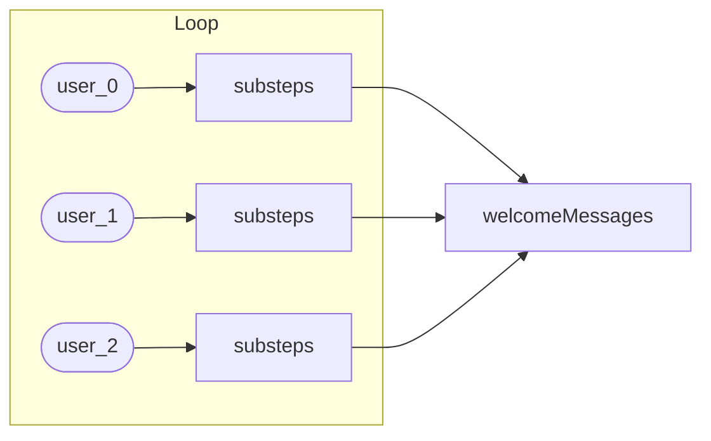

# Recipe JSON Authoring Guide

[document-generator]

**Date:** 5/16/2025 04:01:53 PM

## Introduction

The Recipe JSON Authoring Guide explains how to define and run automation workflows using the Recipe Executor framework. At its core, a **recipe JSON file** is a declarative description of one or more steps—such as reading files, calling an LLM, looping over items, or writing output—to be executed in sequence. The **Recipe Executor** is a tool (CLI or Python API) that loads a recipe, validates its structure, and runs each step against a shared **context** object, passing data and configuration between them.

This guide is written for two audiences:

• **Human developers**: Learn how to author valid recipe JSON files by hand or with code.
• **LLM assistants**: Generate syntactically correct recipes from natural-language prompts.

Following this introduction, you will find detailed sections covering:

• **Basic Structure** – Anatomy of a recipe file and how steps are defined
• **Context Management** – How data flows through a recipe via the context object
• **Step Types** – Available operations (read_files, llm_generate, loop, etc.)
• **Templating and Expressions** – Using Liquid templates and conditional logic
• **Best Practices** – Tips for readability, maintainability, and error handling
• **Example Snippets** – Ready-to-use recipe patterns for common tasks

## Basic Recipe Structure

• The top-level **steps** array is **required** and must be valid, strict JSON. Unknown step types (not in the registry) cause a runtime `ValueError`.

• You may include optional top-level fields:

- `inputs`, `outputs`, `description` (for documentation or tooling).
- **Any** other unknown keys are simply ignored by the executor.

Minimal runnable example (one step):

```json
{
  "steps": [
    {
      "type": "set_context",
      "config": {
        "key": "greeting",
        "value": "Hello, world!"
      }
    }
  ]
}
```

Slightly larger skeleton illustrating common steps:

```json
{
  "inputs": {
    "input_file": { "type": "string" }
  },
  "description": "Sample workflow",
  "steps": [
    {
      "type": "set_context",
      "config": { "key": "mode", "value": "{{mode|default:'prod'}}" }
    },
    {
      "type": "read_files",
      "config": { "path": "{{input_file}}", "content_key": "data" }
    },
    {
      "type": "execute_recipe",
      "config": { "recipe_path": "sub.json" }
    },
    {
      "type": "loop",
      "config": {
        "items": "data.items",
        "item_key": "item",
        "substeps": [
          {
            "type": "write_files",
            "config": { "files_key": "item", "root": "out" }
          }
        ],
        "result_key": "results"
      }
    },
    {
      "type": "write_files",
      "config": { "files_key": "results", "root": "output" }
    }
  ]
}
```

Mermaid diagram of step flow:


## Working with Objects Between Recipe Steps

• The **Context** object is a shared, mutable store of artifacts and configuration. Under the hood it behaves like a Python `dict`, so each step reads with `context["key"]` and writes with `context["key"] = value`. You can pass complex objects (lists, dicts, pydantic models) by reference—no manual JSON serialization or deserialization is required.

• Common patterns:

- **set_context**: seed or update context entries in-place. Use `nested_render: true` when you need multiple Liquid passes.
- **execute_recipe** with **context_overrides**: launch a sub-recipe sharing the same context, but temporarily overriding select keys.

• Common mistakes:

- Over-using the `json` filter in Liquid (e.g., `{{ obj | json }}`) to stringify objects, then reparsing them in steps—unnecessary and error-prone.
- Forgetting to set a **result_key** in a **loop** step. Without it, loop outputs are discarded and you won’t see your collected results.
- Omitting `if_exists` in **set_context**, leading to silent overwrites or missed merges when keys already exist.

**Simple value pass**

```json
{
  "steps": [
    {
      "type": "set_context",
      "config": {
        "key": "userId",
        "value": "12345"
      }
    },
    {
      "type": "llm_generate",
      "config": {
        "prompt": "Welcome back, user {{ userId }}!",
        "output_format": "text",
        "output_key": "greeting"
      }
    }
  ]
}
```

**Complex object pass**

```json
{
  "steps": [
    {
      "type": "set_context",
      "config": {
        "key": "order",
        "value": {
          "id": "{{ orderId }}",
          "items": {{ cartItems | json: indent: 2 }}
        },
        "nested_render": true
      }
    },
    {
      "type": "execute_recipe",
      "config": {
        "recipe_path": "sub-recipes/process_order.json",
        "context_overrides": {
          "order": "{{ order | json }}"
        }
      }
    }
  ]
}
```

**Loop iteration collecting results**

```json
{
  "steps": [
    {
      "type": "loop",
      "config": {
        "items": "input.items",
        "item_key": "item",
        "substeps": [
          {
            "type": "llm_generate",
            "config": {
              "prompt": "Process item {{ item }}",
              "output_format": "text",
              "output_key": "processed"
            }
          }
        ],
        "result_key": "processedItems"
      }
    }
  ]
}
```

## Built-in Step Types and Configuration

The Recipe Executor includes a core set of built-in step types that cover the most common automation patterns—file I/O, branching logic, LLM integration, loops and parallelism, context manipulation, sub-recipe execution, and external tool calls via MCP. These steps matter because they provide reusable, well-tested building blocks you can assemble into everything from simple one-off scripts to complex, multi-component workflows. Each step is self-describing and integrates seamlessly with the shared context, allowing you to focus on what you want to do rather than how to wire up each operation.

Below you’ll find concise reference entries for each step type. Every entry follows the same structure—**Purpose → Key configuration fields (required/optional) → Default values and edge-case behavior → JSON usage example**—so you know exactly where to look when authoring or troubleshooting recipes. Consult these entries whenever you need to understand a step’s options, discover advanced settings (like `max_concurrency` or `merge_mode`), or see a ready-to-copy snippet.

• conditional
• execute_recipe
• llm_generate
• loop
• mcp
• parallel
• read_files
• set_context
• write_files

#### read_files

Purpose:
• Read the contents of one or more files from the filesystem and expose them as artifacts in the shared context.

When to Use:
• Loading specifications, documentation, or other input data for downstream steps.
• Gathering multiple related files (e.g., spec + docs) or optional templates.

Key Configuration (config defaults in **bold**):

- **path** (string or list[str], required): One or more file paths. A single comma-separated string is split on commas. Supports Liquid templating (e.g., `"specs/{{ component_id }}.md"`).
- **content_key** (string, required): Context key under which to store the file content.
- **optional** (bool, **false**): If **true**, missing files do not raise errors. Single missing file → empty string; in **merge_mode: concat** missing files are skipped; in **dict** missing entries omitted.
- **merge_mode** ("concat" | "dict", **"concat"**): Behavior when reading multiple files:
  - **concat**: join contents with newline separators labeled by file path.
  - **dict**: produce a map from filename to content.

Notable Pitfalls:
• Forgetting `optional: true` will cause a `FileNotFoundError` if any file is missing.
• Using the default **concat** mode when you intended to keep files separate—switch to **dict** for structured access.
• Passing a Liquid template that resolves to a list without proper quoting can be interpreted as a single comma-string.

Examples:

1. Reading a single file:

```json
{
  "type": "read_files",
  "config": {
    "path": "specs/component_spec.md",
    "content_key": "component_spec"
  }
}
```

2. Reading multiple files as concatenated text:

```json
{
  "type": "read_files",
  "config": {
    "path": "docs/intro.md,docs/details.md",
    "content_key": "all_docs",
    "merge_mode": "concat"
  }
}
```

3. Reading multiple files into a dictionary (optional):

```json
{
  "type": "read_files",
  "config": {
    "path": ["docs/intro.md", "docs/usage.md"],
    "content_key": "doc_map",
    "merge_mode": "dict",
    "optional": true
  }
}
```

#### write_files

Purpose:
• Write one or more files to disk based on artifacts stored in the shared context. This step handles creating directories, resolving file paths, and serializing content (JSON, text) without manual file-I/O code.

When to Use:
• Persist code or data generated by previous steps (e.g., `llm_generate` with `output_format: "files"`).
• Emit configuration files (JSON/YAML) or reports built in memory.
• Save arbitrary content stored in context under a key.

Key Configuration (defaults in **bold**):

- **files_key** (string, optional): Context key holding a list of `FileSpec` objects or dicts. If provided, `files_key` is used unless `files` is also set.
- **files** (array of objects, optional): Inline list of file definitions. Each item may include:
  - **path** (string) — literal output path (supports Liquid templating).
  - **content** (string or serializable object) — file content. Dicts/lists are auto-serialized to formatted JSON.
  - **path_key** / **content_key** (string) — alternate context keys for path or content values.
- **root** (string, **"."**): Base directory to prepend to every file path. Directories are created recursively.

Notable Pitfalls:
• Omitting both `files_key` and `files` → no files written (step is a no-op).
• Specifying both `files` and `files_key` → `files` takes precedence.
• Forgetting to include template filters on `path` in `files` → literal braces in filenames.
• Assuming content is rendered through Liquid—only paths are templated; content is written verbatim or JSON-serialized.

Examples:

1. Write files produced by an LLM step:

```json
{
  "type": "write_files",
  "config": {
    "files_key": "generated_files",
    "root": "output/src"
  }
}
```

2. Write an inline list of files with mixed content types:

```json
{
  "type": "write_files",
  "config": {
    "files": [
      { "path": "config.json", "content_key": "project_config" },
      { "path_key": "script_path", "content_key": "script_body" },
      {
        "path": "README.md",
        "content": "# Project Title\nGenerated on {{ timestamp }}"
      }
    ],
    "root": "output/docs"
  }
}
```

#### set_context

Purpose:
• Create or update an artifact in the shared execution context without writing custom Python code. It lets you seed data, append to existing values, or merge structured objects as you build up context for downstream steps.

When to Use:
• You need to introduce a new value (string, list, dict) into context before using it in a later step.
• You want to modify or extend an existing context entry (e.g., accumulate logs, build up a document, merge partial results).
• You need to render Liquid templates within a value, optionally multiple times (nested rendering).

Key Configuration (defaults in **bold**):

- **key** (string, required): Context artifact name under which the value will be stored.
- **value** (string | list | dict, required): The literal data or Liquid template string to render and assign. Lists and dicts are traversed so that each string element is rendered.
- **nested_render** (bool, **false**): If true, repeatedly render the value until no unresolved `{{…}}` tags remain (skips content inside raw blocks). Use this when your value includes multi-stage templates.
- **if_exists** ("overwrite" | "merge", **"overwrite"**): Strategy when the key already exists:
  - **overwrite**: replace the old value.
  - **merge**: combine old and new using type-aware rules:
    • string + string → concatenation
    • list + list/item → append
    • dict + dict → shallow merge
    • mismatched types → `[old, new]`

Notable Pitfalls:
• Setting `nested_render: true` on large strings can loop indefinitely if templates re-introduce tags—use with care.
• Forgetting to choose `merge` when you wanted to append or combine values can silently overwrite data.
• Deep-merge is not supported—nested dict keys overwrite at the top level only.

Examples:

1. Basic assignment:

```json
{
  "type": "set_context",
  "config": {
    "key": "greeting",
    "value": "Hello, world!"
  }
}
```

Stores the literal string `Hello, world!` under `context["greeting"]`.

2. Merging dictionaries:

```json
{
  "type": "set_context",
  "config": {
    "key": "metadata",
    "value": {
      "version": "1.0",
      "author": "Alice"
    },
    "if_exists": "merge"
  }
}
```

If `metadata` already exists (a dict), its keys are shallow-merged with the new values; existing keys are overwritten.

3. Nested template rendering:

```json
{
  "type": "set_context",
  "config": {
    "key": "full_prompt",
    "value": "First pass: {{ draft }}",
    "nested_render": true
  }
}
```

If `draft` itself contains `{{ user_input }}`, the step will render `{{ draft }}` to yield text with `{{ user_input }}`, then render again to substitute `user_input` from context.

#### conditional

Purpose:
• Branch execution paths by evaluating a boolean expression against the shared context.

When to Use:
• Skip or invoke blocks of steps based on context values, file‐existence checks, or computed conditions.

Key Configuration (defaults in **bold**):

- **condition** (string | bool, required): Liquid expression or literal boolean. Evaluated to true/false.
- **if_true** (object, **omit to do nothing**): Contains a `steps` array to execute when condition is true.
- **if_false** (object, **omit to skip**): Contains a `steps` array to execute when condition is false.

Notable Pitfalls:
• If you omit both branches, the step has no effect regardless of the condition.
• Template variables must resolve to valid booleans (e.g., `"true"`/`"false"` or expressions like `{{ count > 0 }}`).
• Avoid complex Python code in the condition; use built-in helpers (e.g., `and()`, `or()`, `file_exists()`).

Examples:

1. Simple context flag:

```json
{
  "type": "conditional",
  "config": {
    "condition": "{{ run_migration }}",
    "if_true": {
      "steps": [
        {
          "type": "execute_recipe",
          "config": { "recipe_path": "recipes/migrate.json" }
        }
      ]
    }
  }
}
```

2. File-existence check with fallback:

```json
{
  "type": "conditional",
  "config": {
    "condition": "file_exists('output/report.txt')",
    "if_false": {
      "steps": [
        {
          "type": "llm_generate",
          "config": {
            "prompt": "Generate missing report...",
            "output_format": "text",
            "output_key": "report"
          }
        },
        {
          "type": "write_files",
          "config": { "files_key": "report", "root": "output" }
        }
      ]
    }
  }
}
```

#### loop

Purpose:
• Iterate over a collection of items in the context, cloning the context for each item, running a series of substeps, and collecting their results into a single list.

When to Use:
• Batch-process lists or maps of data (e.g., filenames, JSON objects, records).
• Perform independent operations per item (file I/O, LLM calls, API requests) and gather outcomes.

Key Configuration (defaults in **bold**):

- **items** (string | list | dict, _required_): A context key or literal list/dict. If a string, it’s rendered then split or looked up (supports dot-notation, e.g. `data.users`).
- **item_key** (string, _required_): Name under which the current item is stored in each iteration’s context (e.g. `"user"`).
- **substeps** (array[object], _required_): List of step definitions to run for each item.
- **result_key** (string, _required_): Context key under which to store the array of per-item results.
- **max_concurrency** (int, **1**): Number of items to process in parallel. `0` = unlimited; `1` = sequential.
- **delay** (float, **0.0**): Seconds to wait between launching each parallel task.
- **fail_fast** (bool, **true**): Stop on first error (`true`) or continue and aggregate successes and failures (`false`).

Notable Pitfalls:
• Omitting **result_key** discards substep outputs—always set a result_key to retrieve loop results.
• Using a string that resolves to a comma-list without quoting can split paths incorrectly; prefer arrays or dot-paths.
• Excessive `max_concurrency` can overwhelm CPU, I/O, or LLM rate limits—tune based on resource availability.
• Mutating the parent context in substeps can leak state; the loop clones context per iteration but writes back only the result_key values.

Examples:

1. Simple sequential processing of a user list:

```json
{
  "type": "loop",
  "config": {
    "items": "users",
    "item_key": "user",
    "substeps": [
      {
        "type": "llm_generate",
        "config": {
          "prompt": "Greet {{user.name}}!",
          "output_format": "text",
          "output_key": "greeting"
        }
      }
    ],
    "result_key": "userGreetings"
  }
}
```

2. Parallel file processing with a staggered start:

```json
{
  "type": "loop",
  "config": {
    "items": "filePaths",
    "item_key": "file",
    "max_concurrency": 5,
    "delay": 0.1,
    "substeps": [
      {
        "type": "read_files",
        "config": { "path": "{{file}}", "content_key": "content" }
      },
      {
        "type": "llm_generate",
        "config": {
          "prompt": "Summarize:\n{{content}}",
          "output_format": "text",
          "output_key": "summary"
        }
      }
    ],
    "result_key": "summaries"
  }
}
```

3. Iterating over nested data via a dot-path:

```json
{
  "type": "loop",
  "config": {
    "items": "data.reports",
    "item_key": "report",
    "substeps": [
      {
        "type": "execute_recipe",
        "config": { "recipe_path": "recipes/process_report.json" }
      }
    ],
    "result_key": "processedReports"
  }
}
```

#### parallel

Purpose:
• Execute multiple sub-steps concurrently within a single recipe step, improving throughput for independent tasks.

When to Use:
• Running independent operations (e.g., multiple LLM calls, file reads, or sub-recipes) that do not depend on each other’s results.
• Speeding up workflows that would otherwise wait serially on I/O or network-bound tasks.

Key Configuration (config defaults in **bold**):

- **substeps** (List[object], _required_): Array of step definitions to run in parallel. Each entry follows the same shape as any recipe step (e.g., `{ "type": "llm_generate", "config": { … } }`).
- **max_concurrency** (int, **0**): Maximum number of sub-steps to run at once. `0` = no limit (as many as system resources allow), `1` = sequential execution, `n > 1` = up to `n` concurrent.
- **delay** (float, **0.0**): Seconds to wait between launching each sub-step. Use to stagger start times and reduce resource contention.

Notable Pitfalls:
• **Fail-fast behavior**: If any sub-step raises an exception, the entire `parallel` step aborts immediately and errors propagate—there is no built-in continue-on-error mode.
• **Context isolation**: Each sub-step runs with a clone of the parent context. Mutations inside one sub-step do not merge back into the parent context or other sub-steps.
• **Resource exhaustion**: Unbounded concurrency (`max_concurrency: 0`) can overwhelm LLM rate limits, CPU, or I/O. Tune `max_concurrency` and `delay` based on system capacity.

Examples:

1. Basic parallel execution (all tasks start immediately):

```json
{
  "type": "parallel",
  "config": {
    "substeps": [
      {
        "type": "llm_generate",
        "config": {
          "prompt": "Analyze user data...",
          "output_format": "text",
          "output_key": "analysisA"
        }
      },
      {
        "type": "llm_generate",
        "config": {
          "prompt": "Compare with historical trends...",
          "output_format": "text",
          "output_key": "analysisB"
        }
      }
    ]
  }
}
```

2. Controlled concurrency with a launch delay:

```json
{
  "type": "parallel",
  "config": {
    "substeps": [
      {
        "type": "read_files",
        "config": { "path": "logs/2025-*.txt", "content_key": "log1" }
      },
      {
        "type": "read_files",
        "config": { "path": "metrics/2025-*.json", "content_key": "metrics1" }
      }
    ],
    "max_concurrency": 2,
    "delay": 0.5
  }
}
```

#### execute_recipe

Purpose:
• Invoke another recipe (sub-recipe) as part of the current workflow, allowing modular composition and reuse of common logic.

When to Use:
• You want to break a large recipe into smaller, focused pieces.
• You need to share the same context across multiple recipe files.
• You need to run preparation or cleanup steps defined in separate recipes.

Key Configuration (config defaults in **bold**):

- **recipe_path** (string, required): Path or JSON string of the sub-recipe to execute. Supports Liquid templating (e.g., `"recipes/{{component}}.json"`).
- **context_overrides** (object, **{}**): Map of context keys to override or inject before running the sub-recipe. Values are rendered via Liquid before use.

Notable Pitfalls:
• A missing or invalid `recipe_path` raises a `ValueError` at runtime—ensure the path is correct and accessible.
• Overriding non-string context values without proper JSON filters can lead to type errors in the sub-recipe.
• Changes made by the sub-recipe persist in the shared context—be cautious if you need isolation (use `Context.clone` explicitly).

Examples:

1. Run a simple sub-recipe without overrides:

```json
{
  "type": "execute_recipe",
  "config": {
    "recipe_path": "recipes/cleanup.json"
  }
}
```

2. Pass data into the sub-recipe via context overrides:

```json
{
  "type": "execute_recipe",
  "config": {
    "recipe_path": "recipes/generate_report.json",
    "context_overrides": {
      "report_id": "{{ id }}",
      "user": { "name": "{{ username }}" }
    }
  }
}
```

3. Chain multiple sub-recipes for a component build:

```json
{
  "steps": [
    {
      "type": "execute_recipe",
      "config": {
        "recipe_path": "recipes/read_component.json",
        "context_overrides": { "component_id": "utils" }
      }
    },
    {
      "type": "execute_recipe",
      "config": {
        "recipe_path": "recipes/build_component.json"
      }
    }
  ]
}
```

#### llm_generate

Purpose:
• Invoke a large-language model (LLM) to generate content—plain text, files, or structured data—based on a templated prompt.

When to Use:
• You need free-form text (e.g., summaries, dialogues).
• You want the LLM to emit one or more files (e.g., code, markdown).
• You require structured output validated against a JSON schema.

Key Configuration (defaults in **bold**):

- **prompt** (string, _required_): The Liquid-rendered prompt text sent to the LLM.
- **model** (string, **"openai/gpt-4o"**): Model identifier (e.g., `openai/o4-mini`, `azure/gpt-4o/deployment`).
- **max_tokens** (int or string, **null**): Maximum tokens for the response.
- **mcp_servers** (list[dict], **null**): Optional MCP server configs for tool access.
- **output_format** ("text" | "files" | object | list, **"text"**):
  • "text": returns a string.
  • "files": returns a list of `FileSpec`.
  • object / list: JSON-schema for structured output.
- **output_key** (string, **"llm_output"**): Context key under which to store the result.

Notable Pitfalls:
• Omitting **output_key** or reusing a key overwrites previous artifacts.
• Sending raw objects to `prompt` without nested rendering can leak Liquid tags—use `nested_render` in a preceding `set_context` if needed.
• Mismatching `output_format` and actual model output (e.g., schema vs. plain text) causes validation errors.
• Neglecting to convert `mcp_servers` via `get_mcp_server` will break tool calls.

Examples:

1. Text output (simple prompt):

```json
{
  "type": "llm_generate",
  "config": {
    "prompt": "What is the capital of France?",
    "model": "openai/gpt-4o",
    "output_format": "text",
    "output_key": "capital"
  }
}
```

After execution, `context["capital"]` might be `"Paris"`.

2. File generation (common code use case):

```json
{
  "type": "llm_generate",
  "config": {
    "prompt": "Generate Python test files for a calculator module.",
    "output_format": "files",
    "output_key": "calculator_files"
  }
}
```

Result: `context["calculator_files"]` is a list of `{ "path": ..., "content": ... }` objects ready for `write_files`.

3. Structured JSON output (schema-driven):

```json
{
  "type": "llm_generate",
  "config": {
    "prompt": "Extract user info from text: {{ rawText }}",
    "output_format": {
      "type": "object",
      "properties": {
        "name": { "type": "string" },
        "email": { "type": "string" },
        "age": { "type": "integer" }
      },
      "required": ["name", "email"]
    },
    "output_key": "userProfile"
  }
}
```

LLM output is validated and stored as a JSON object under `context["userProfile"]`.

#### mcp

Purpose:
• Invoke a tool hosted on a remote MCP (Model-Coupled-Plugin) server and store its JSON result in the shared context.

When to Use:
• Call out to external services or tool chains exposed via MCP (HTTP or stdio) without writing custom client code.
• Integrate 3rd-party APIs, data fetchers, or utility services into your recipe workflows.

Key Configuration (defaults in **bold**):

- **server** (object, _required_): Configuration for the MCP server. Must include either:
  • HTTP: `{ "url": "https://api.example.com/sse", "headers": { "Authorization": "Bearer {{token}}" } }`
  • STDIO: `{ "command": "python", "args": ["-m","my_mcp_server"], "env": {"API_KEY":"{{key}}"}, "cwd": "/path/to/server" }`
- **tool_name** (string, _required_): Name of the tool to invoke on the server (e.g., "translate_text").
- **arguments** (object, **{}**): Mapping of argument names to values (may be templated). Passed as the tool payload.
- **result_key** (string, **"tool_result"**): Context key under which to store the tool’s result (a JSON object).

Notable Pitfalls:
• Mis-configuring the `server` object (wrong keys or missing `url`/`command`) causes a `ValueError` at runtime.
• Forgetting to wrap complex arguments in `json` filters can lead to invalid payloads.
• Using the same `result_key` for multiple calls will overwrite previous results—choose unique keys when chaining tools.
• STDIO servers require the MCP process to exist locally; ensure `command` and `cwd` are correct and any env vars are set.

Examples:

1. HTTP-based MCP server call:

```json
{
  "type": "mcp",
  "config": {
    "server": {
      "url": "https://mcp.example.com/sse",
      "headers": { "Authorization": "Bearer {{ api_token }}" }
    },
    "tool_name": "get_user_profile",
    "arguments": { "user_id": "{{ userId }}" },
    "result_key": "profile"
  }
}
```

After execution, `context["profile"]` holds the returned JSON from the `get_user_profile` tool.

2. STDIO-based MCP server call:

```json
{
  "type": "mcp",
  "config": {
    "server": {
      "command": "./mcp_server.py",
      "args": ["--mode", "interactive"],
      "env": { "MCP_TOKEN": "{{ token }}" },
      "cwd": "./mcp-services"
    },
    "tool_name": "analyze_document",
    "arguments": { "text": "{{ docContent }}" },
    "result_key": "analysis"
  }
}
```

## Using Liquid Templating for Dynamic Content

The executor integrates a full Python Liquid environment (with extra filters enabled) to make step configuration dynamic and data-driven. You can use:

- **Variable substitution**: `{{ myVar }}`, nested paths `{{ user.name }}` or bracket notation.
- **Filters**: built-ins like `default`, `json`, `split`, `join`, `upcase`, `downcase`; extra filters like `snakecase` (custom), `date`, etc.
- **Control structures**: block tags ``, ``/``, comment tags, and inline conditionals (`{{ expr if cond else other }}`).
- **Chaining and tail filters**: chain multiple pipes or use `||` to apply a filter to the entire expression.

### Four Diverse Examples

1. Dynamic file paths using `snakecase`:

```json
{
  "type": "read_files",
  "config": {
    "path": "specs/{{ componentId | snakecase }}.md",
    "content_key": "specContent"
  }
}
```

2. Default-value fallback with `default`:

```json
{
  "type": "set_context",
  "config": {
    "key": "env",
    "value": "{{ deployment | default: 'production' }}"
  }
}
```

3. Building a comma-separated list with a `` loop and `capture`:

```json
{
  "type": "set_context",
  "config": {
    "key": "hostsCsv",
    "value": "{{ host }},{{ csv }}"
  }
}
```

4. Inline conditional (ternary) expression:

```json
{
  "type": "set_context",
  "config": {
    "key": "statusTag",
    "value": "{{ 'active' if user.active else 'inactive' }}"
  }
}
```

### Embedding Large Content in Prompts

When you need to pass large documents or markdown blobs into an LLM prompt, wrapping them in distinctive, ALL-CAPS XML-like tags (for example, `<SPEC>…</SPEC>` or `<DOCUMENT>…</DOCUMENT>`) helps:

• Focus: The LLM can easily identify exactly which text to read or process. Anything outside the tags is treated as context or instruction.
• Isolation: The enclosed content is treated as an opaque block, preventing unintended template rendering or tokenization errors.
• Clarity: Tag names convey the type of content (`<SPEC>`, `<DIAGRAM>`, `<LOGS>`), improving prompt readability.

**Dos & Don’ts**

| Do                                                          | Don’t                                                         |
| ----------------------------------------------------------- | ------------------------------------------------------------- |
| Wrap each large block in one matching pair of ALL-CAPS tags | Scatter inline markers within paragraphs                      |
| Place the opening and closing tag on its own lines          | Embed tags mid-sentence or split across lines                 |
| Always include a corresponding closing tag                  | Omit or mismatch tag names (e.g., `<SPEC>` without `</SPEC>`) |
| Treat the inner content as opaque—no additional templating  | Attempt to render or modify text inside the wrapper           |
| Choose clear, unique tag names for different payload types  | Reuse generic tags like `<TAG>` or `<BLOCK>`                  |

**Prompt Snippet Example**

Here’s a typical `llm_generate` step that injects a large Markdown specification using `<SPEC>` wrappers:

```json
{
  "type": "llm_generate",
  "config": {
    "prompt": "System: You are an API expert.\n
<SPEC>
{{ api_spec_markdown }}
</SPEC>\n
Please list each endpoint, its HTTP method, and a brief description.",
    "output_format": "text",
    "output_key": "endpoint_summary"
  }
}
```

## Best Practices and Patterns

• Design small, focused recipes—one clear responsibility per file—and compose complex workflows by reusing sub-recipes via `execute_recipe`.

• Adopt clear, consistent context keys; avoid magic strings or ad-hoc naming. Centralize key definitions with `set_context` at the top of your recipe.

• Guard steps with `conditional` and `read_files(optional:true)` to skip missing inputs or perform safe fallbacks instead of throwing errors.

• Tune loops and parallel blocks thoughtfully: set `max_concurrency` and `delay` to balance throughput against resource limits, and use `fail_fast:false` when you need to collect all results before erroring.

• Always specify a `result_key` in every `loop` configuration—even if you don’t use the output—so results aren’t discarded and errors can be tracked.

• Manage LLM token budgets and prompt length by summarizing or splitting large documents, and wrap big content blocks in ALL-CAPS XML-style tags (e.g., `<SPEC>…</SPEC>`) to isolate payloads and reduce tokens.

• Leverage `set_context(if_exists:merge)` when you want incremental builds: strings are concatenated, lists append new items, and dicts are shallow-merged. Use `overwrite` deliberately when a full reset is intended.

• Limit nested `nested_render` passes to avoid endless loops; prefer simple one-pass templates or precompute complex values in separate `set_context` steps.

• Keep individual steps self-contained: avoid leaking data between substeps, rely on context overrides for isolation, and document any side effects at the recipe top.

• Regularly refactor long recipes into smaller modules and maintain a library of common patterns—this accelerates authoring, testing, and consistency across projects.

## Recipe Cookbook

This section provides four ready-to-paste recipe patterns covering common automation scenarios. Each snippet includes:

• Purpose: why and when to use it
• Typical use cases: real-world examples
• Natural-language flow summary: step-by-step description
• Mermaid diagram: visual flow (where helpful)
• JSON snippet: valid recipe configuration

---

### 1. Conditional File Check & Fallback

Purpose:
• Ensure a required file is present or generate and save a default if missing.

Typical Use Cases:
• Loading a configuration or cache file if it exists, otherwise creating defaults.
• Avoiding redundant LLM calls by reading existing outputs when rerunning.

Flow Summary:

1. Check if `output_dir/config.json` exists.
2. If **true**, read it into `context.config`.
3. If **false**, set a default `config` object and write it to disk.

Mermaid Diagram:


JSON Snippet:

```json
{
  "steps": [
    {
      "type": "conditional",
      "config": {
        "condition": "file_exists('{{ output_dir }}/config.json')",
        "if_true": {
          "steps": [
            {
              "type": "read_files",
              "config": {
                "path": "{{ output_dir }}/config.json",
                "content_key": "config",
                "merge_mode": "dict"
              }
            }
          ]
        },
        "if_false": {
          "steps": [
            {
              "type": "set_context",
              "config": {
                "key": "config",
                "value": { "settingA": "defaultA", "settingB": "defaultB" }
              }
            },
            {
              "type": "write_files",
              "config": {
                "files": [{ "path": "config.json", "content_key": "config" }],
                "root": "{{ output_dir }}"
              }
            }
          ]
        }
      }
    }
  ]
}
```

---

### 2. Batch Loop Over Items (With Concurrency)

Purpose:
• Process a collection of items in parallel or sequentially, collecting results.

Typical Use Cases:
• Generating personalized messages for a list of users.
• Summarizing or analyzing multiple documents concurrently.

Flow Summary:

1. Resolve `users` from context.
2. Clone context for each user and set `user`.
3. Launch up to 3 tasks at once, each calling LLM to create a welcome message.
4. Collect all messages under `welcomeMessages`.

Mermaid Diagram:



JSON Snippet:

```json
{
  "steps": [
    {
      "type": "loop",
      "config": {
        "items": "users",
        "item_key": "user",
        "max_concurrency": 3,
        "delay": 0.2,
        "substeps": [
          {
            "type": "llm_generate",
            "config": {
              "prompt": "Create welcome message for {{ user.name }}",
              "output_format": "text",
              "output_key": "message"
            }
          }
        ],
        "result_key": "welcomeMessages"
      }
    }
  ]
}
```

---

### 3. Parallel Independent Tasks

Purpose:
• Run multiple unrelated steps at once to improve throughput.

Typical Use Cases:
• Summarizing different datasets concurrently.
• Running independent code‐generation recipes in parallel.

Flow Summary:

1. Clone context for each substep.
2. Launch two LLM calls concurrently (max 2 at once, 0.1 s stagger).
3. Wait for both to finish or abort on first error.

Mermaid Diagram:


JSON Snippet:

```json
{
  "steps": [
    {
      "type": "parallel",
      "config": {
        "substeps": [
          {
            "type": "llm_generate",
            "config": {
              "prompt": "Summarize dataset A: {{ dataA }}",
              "output_format": "text",
              "output_key": "summaryA"
            }
          },
          {
            "type": "llm_generate",
            "config": {
              "prompt": "Summarize dataset B: {{ dataB }}",
              "output_format": "text",
              "output_key": "summaryB"
            }
          }
        ],
        "max_concurrency": 2,
        "delay": 0.1
      }
    }
  ]
}
```

---

### 4. Reusing Logic via `execute_recipe` (Sub-Recipe Composition)

Purpose:
• Break complex workflows into modular sub-recipes and chain them in sequence.

Typical Use Cases:
• Data-load → analysis → reporting pipelines.
• Component build steps split into load, generate, write phases.

Flow Summary:

1. Execute `load_data.json` to read and prepare inputs.
2. Execute `analyze_data.json` to process the loaded data.
3. Execute `report.json` with an override for the report title.

Mermaid Diagram:


JSON Snippet:

```json
{
  "steps": [
    {
      "type": "execute_recipe",
      "config": {
        "recipe_path": "recipes/load_data.json"
      }
    },
    {
      "type": "execute_recipe",
      "config": {
        "recipe_path": "recipes/analyze_data.json"
      }
    },
    {
      "type": "execute_recipe",
      "config": {
        "recipe_path": "recipes/report.json",
        "context_overrides": {
          "reportTitle": "Monthly Summary"
        }
      }
    }
  ]
}
```

## Conclusion

Throughout this guide, we’ve covered the essential building blocks for writing robust Recipe JSON files:

• **Structure**: Define clear inputs, outputs, and a well-formed `steps` array so every recipe can be parsed and executed without surprises.
• **Context Management**: Leverage the shared context store to pass data between steps—use `set_context`, `result_key`, and `context_overrides` thoughtfully to control scope and flow.
• **Templating & Expressions**: Harness Liquid variables, filters, and control blocks for dynamic configuration—combine simple substitutions with nested rendering when you need multi-stage templates.
• **Best Practices**: Keep recipes small and focused, guard with `conditional` and `optional` flags, tune concurrency in `loop` and `parallel` steps, and split complex logic into reusable sub-recipes via `execute_recipe`.

By applying these principles—concise recipe structure, intentional context handling, flexible templating, and proven design patterns—you’ll create automation workflows that are easy to read, maintain, and extend. Whether you’re manually authoring recipes or using an LLM assistant to generate them, these guidelines will help ensure consistent results and simpler troubleshooting.

As requirements change, don’t hesitate to revisit and refine your recipes:

• Break long workflows into smaller modules.
• Adjust concurrency and error-handling settings to optimize performance.
• Update templates to reflect new data formats or naming conventions.
• Experiment with conditional logic and sub-recipes to cover edge cases or new features.

Automation is an iterative process—each recipe you author is a living document. Use this guide as your foundation, continuously iterate on your designs, and watch your automation pipelines become more resilient and adaptable over time. Happy authoring!
