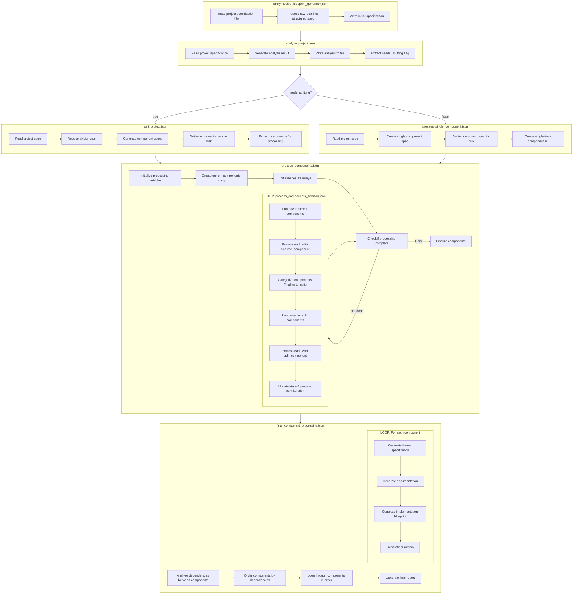

# AI Context Files
Date: 4/26/2025, 9:34:06 AM
Files: 14

=== File: recipes/blueprint_generator/blueprint_generator.json ===
{
  "steps": [
    {
      "type": "read_files",
      "config": {
        "path": "{{raw_idea_path}}",
        "content_key": "raw_idea"
      }
    },
    {
      "type": "read_files",
      "config": {
        "path": "ai_context/IMPLEMENTATION_PHILOSOPHY.md,ai_context/MODULAR_DESIGN_PHILOSOPHY.md",
        "content_key": "guidance_docs",
        "merge_mode": "concat"
      }
    },
    {
      "type": "read_files",
      "config": {
        "path": "{{context_files}}",
        "content_key": "context_files",
        "optional": true,
        "merge_mode": "concat"
      }
    },
    {
      "type": "read_files",
      "config": {
        "path": "{{reference_docs}}",
        "content_key": "reference_docs",
        "optional": true,
        "merge_mode": "concat"
      }
    },
    {
      "type": "conditional",
      "config": {
        "condition": "file_exists('{{output_dir}}/specs/initial_project_spec.md')",
        "if_true": {
          "steps": [
            {
              "type": "read_files",
              "config": {
                "path": "{{output_dir}}/specs/initial_project_spec.md",
                "content_key": "initial_project_spec"
              }
            }
          ]
        },
        "if_false": {
          "steps": [
            {
              "type": "execute_recipe",
              "config": {
                "recipe_path": "recipes/blueprint_generator/stages/stage_1_process_raw_idea.json"
              }
            }
          ]
        }
      }
    },
    {
      "type": "conditional",
      "config": {
        "condition": "file_exists('{{output_dir}}/analysis/analysis_result.json')",
        "if_true": {
          "steps": [
            {
              "type": "read_files",
              "config": {
                "path": "{{output_dir}}/analysis/analysis_result.json",
                "content_key": "analysis_result",
                "merge_mode": "dict"
              }
            }
          ]
        },
        "if_false": {
          "steps": [
            {
              "type": "execute_recipe",
              "config": {
                "recipe_path": "recipes/blueprint_generator/stages/stage_2_analyze_project.json"
              }
            }
          ]
        }
      }
    },
    {
      "type": "conditional",
      "config": {
        "condition": "{{analysis_result.needs_splitting}}",
        "if_true": {
          "steps": [
            {
              "type": "conditional",
              "config": {
                "condition": "all_files_exist('{{output_dir}}/components/*.md')",
                "if_false": {
                  "steps": [
                    {
                      "type": "execute_recipe",
                      "config": {
                        "recipe_path": "recipes/blueprint_generator/stages/stage_3a_split_project.json"
                      }
                    }
                  ]
                }
              }
            }
          ]
        },
        "if_false": {
          "steps": [
            {
              "type": "conditional",
              "config": {
                "condition": "file_exists('{{output_dir}}/components/main_component_spec.md')",
                "if_false": {
                  "steps": [
                    {
                      "type": "execute_recipe",
                      "config": {
                        "recipe_path": "recipes/blueprint_generator/stages/stage_3b_single_component.json"
                      }
                    }
                  ]
                }
              }
            }
          ]
        }
      }
    },
    {
      "type": "conditional",
      "config": {
        "condition": "file_exists('{{output_dir}}/analysis/final_components.json')",
        "if_true": {
          "steps": [
            {
              "type": "read_files",
              "config": {
                "path": "{{output_dir}}/analysis/final_components.json",
                "content_key": "final_component_list",
                "merge_mode": "dict"
              }
            }
          ]
        },
        "if_false": {
          "steps": [
            {
              "type": "execute_recipe",
              "config": {
                "recipe_path": "recipes/blueprint_generator/stages/stage_4_process_components.json"
              }
            }
          ]
        }
      }
    },
    {
      "type": "conditional",
      "config": {
        "condition": "file_exists('{{output_dir}}/analysis/component_dependencies.json')",
        "if_false": {
          "steps": [
            {
              "type": "execute_recipe",
              "config": {
                "recipe_path": "recipes/blueprint_generator/stages/stage_5_analyze_dependencies.json"
              }
            }
          ]
        }
      }
    },
    {
      "type": "conditional",
      "config": {
        "condition": "all_files_exist('{{output_dir}}/blueprints/*/blueprint.md')",
        "if_false": {
          "steps": [
            {
              "type": "execute_recipe",
              "config": {
                "recipe_path": "recipes/blueprint_generator/stages/stage_6_generate_blueprints.json"
              }
            }
          ]
        }
      }
    },
    {
      "type": "conditional",
      "config": {
        "condition": "file_exists('{{output_dir}}/reports/final_report.md')",
        "if_false": {
          "steps": [
            {
              "type": "execute_recipe",
              "config": {
                "recipe_path": "recipes/blueprint_generator/stages/stage_7_generate_report.json"
              }
            }
          ]
        }
      }
    }
  ]
}

=== File: recipes/blueprint_generator/docs/diagrams.md ===
# Blueprint Generator

=== File: recipes/blueprint_generator/prompts/dashboard_idea.md ===
# Data Analytics Dashboard Platform

I want to build a web-based data analytics dashboard platform that lets users connect to various data sources, create visualizations, and share interactive dashboards with their team.

## Key Features

- Data source connectors for databases (MySQL, PostgreSQL, MongoDB), APIs, CSV/Excel files, and cloud storage
- Data transformation capabilities (filtering, aggregation, joining datasets)
- Visualization builder with multiple chart types (bar, line, pie, scatter, maps, tables)
- Dashboard layout editor with drag-and-drop components
- Real-time collaboration on dashboards
- User management with role-based access control
- Alerting system for monitoring metrics and sending notifications
- Scheduled report generation and distribution
- Dashboard sharing and embedding capabilities
- Version history and change tracking
- Mobile-responsive design

## Technical Considerations

- Modern web framework for frontend (React/Vue)
- Backend API service
- Authentication and authorization
- Scalable data processing engine
- Real-time updates using WebSockets
- Caching layer for performance
- Export functionality (PDF, PNG, CSV)

The system should be modular, extensible, and allow for future integration of machine learning capabilities for predictive analytics.

=== File: recipes/blueprint_generator/prompts/recipe_tool_idea.md ===

=== File: recipes/blueprint_generator/stages/stage_1_process_raw_idea.json ===
{
  "steps": [
    {
      "type": "conditional",
      "config": {
        "condition": "file_exists('{{output_dir}}/specs/initial_project_spec.md')",
        "if_true": {
          "steps": [
            {
              "type": "read_files",
              "config": {
                "path": "{{output_dir}}/specs/initial_project_spec.md",
                "content_key": "initial_project_spec"
              }
            }
          ]
        },
        "if_false": {
          "steps": [
            {
              "type": "llm_generate",
              "config": {
                "prompt": "Transform this raw idea into a structured project specification. Consider the guidance docs and reference materials.\n\nRaw Idea:\n{{raw_idea}}\n\nGuidance Documents:\n{{guidance_docs}}\n\nContext Files:\n{{context_files}}\n\nReference Docs:\n{{reference_docs}}\n\nCreate a comprehensive, structured specification that includes project overview, requirements, technical constraints, and implementation guidelines. The specification should be detailed enough to analyze for component splitting.\n\nName the output file 'initial_project_spec.md'.",
                "model": "{{model|default:'openai/o3-mini'}}",
                "output_format": "files",
                "output_key": "initial_project_spec"
              }
            },
            {
              "type": "write_files",
              "config": {
                "files_key": "initial_project_spec",
                "root": "{{output_dir}}/specs"
              }
            }
          ]
        }
      }
    }
  ]
}

=== File: recipes/blueprint_generator/stages/stage_2_analyze_project.json ===
{
  "steps": [
    {
      "type": "conditional",
      "config": {
        "condition": "file_exists('{{output_dir}}/analysis/analysis_result.json')",
        "if_true": {
          "steps": [
            {
              "type": "read_files",
              "config": {
                "path": "{{output_dir}}/analysis/analysis_result.json",
                "content_key": "analysis_result",
                "merge_mode": "dict"
              }
            }
          ]
        },
        "if_false": {
          "steps": [
            {
              "type": "read_files",
              "config": {
                "path": "{{output_dir}}/specs/initial_project_spec.md",
                "content_key": "project_spec"
              }
            },
            {
              "type": "llm_generate",
              "config": {
                "prompt": "Analyze this project specification and determine if it should be split into multiple components.\n\nProject Specification:\n{{project_spec}}\n\nGuidance Documents:\n{{guidance_docs}}\n\nProvide your analysis as a JSON object with the following structure:\n{\n  \"needs_splitting\": true/false,\n  \"reasoning\": \"Explanation of your decision\",\n  \"recommended_components\": [\n    {\n      \"component_id\": \"component_identifier\",\n      \"component_name\": \"Human Readable Component Name\",\n      \"description\": \"Brief description of this component\"\n    }\n  ]\n}\n\nYour response should be ONLY valid JSON with no additional text.",
                "model": "{{model|default:'openai/o3-mini'}}",
                "output_format": {
                  "type": "object",
                  "properties": {
                    "needs_splitting": { "type": "boolean" },
                    "reasoning": { "type": "string" },
                    "recommended_components": {
                      "type": "array",
                      "items": {
                        "type": "object",
                        "properties": {
                          "component_id": { "type": "string" },
                          "component_name": { "type": "string" },
                          "description": { "type": "string" }
                        },
                        "required": [
                          "component_id",
                          "component_name",
                          "description"
                        ]
                      }
                    }
                  },
                  "required": [
                    "needs_splitting",
                    "reasoning",
                    "recommended_components"
                  ]
                },
                "output_key": "analysis_result"
              }
            },
            {
              "type": "write_files",
              "config": {
                "files": [
                  {
                    "path": "analysis/analysis_result.json",
                    "content_key": "analysis_result"
                  }
                ],
                "root": "{{output_dir}}"
              }
            }
          ]
        }
      }
    }
  ]
}

=== File: recipes/blueprint_generator/stages/stage_3a_split_project.json ===
{
  "steps": [
    {
      "type": "read_files",
      "config": {
        "path": "{{output_dir}}/specs/initial_project_spec.md",
        "content_key": "project_spec"
      }
    },
    {
      "type": "read_files",
      "config": {
        "path": "{{output_dir}}/analysis/analysis_result.json",
        "content_key": "analysis_result",
        "merge_mode": "dict"
      }
    },
    {
      "type": "conditional",
      "config": {
        "condition": "{{analysis_result.needs_splitting}}",
        "if_true": {
          "steps": [
            {
              "type": "loop",
              "config": {
                "items": "analysis_result.recommended_components",
                "item_key": "current_component",
                "max_concurrency": 0,
                "substeps": [
                  {
                    "type": "conditional",
                    "config": {
                      "condition": "file_exists('{{output_dir}}/components/{{current_component.component_id}}_spec.md')",
                      "if_false": {
                        "steps": [
                          {
                            "type": "llm_generate",
                            "config": {
                              "prompt": "Create a detailed component specification for this component identified in the project analysis:\n\nProject Specification:\n{{project_spec}}\n\nComponent Name: {{current_component.component_name}}\nComponent ID: {{current_component.component_id}}\nDescription: {{current_component.description}}\n\nGenerate a comprehensive component specification that includes purpose, requirements, implementation considerations, dependencies, and other relevant details. The specification should follow the standard format with all necessary sections.\n\nDO NOT include any file path or filename in your response. Just return the content of the specification.",
                              "model": "{{model|default:'openai/o3-mini'}}",
                              "output_format": "text",
                              "output_key": "component_spec_content"
                            }
                          },
                          {
                            "type": "write_files",
                            "config": {
                              "files": [
                                {
                                  "path": "{{current_component.component_id}}_spec.md",
                                  "content_key": "component_spec_content"
                                }
                              ],
                              "root": "{{output_dir}}/components"
                            }
                          }
                        ]
                      }
                    }
                  }
                ],
                "result_key": "generated_components"
              }
            },
            {
              "type": "llm_generate",
              "config": {
                "prompt": "Based on the component specifications that were generated, create a list of components for further processing.\n\nComponents from Analysis:\n{{analysis_result.recommended_components}}\n\nOutput a JSON array of component objects with structure:\n[\n  {\n    \"component_id\": \"component_identifier\",\n    \"needs_analysis\": true\n  }\n]\n\nEnsure that all components are included, using the exact component_id values from the analysis result.",
                "model": "{{model|default:'openai/o3-mini'}}",
                "output_format": [
                  {
                    "type": "object",
                    "properties": {
                      "component_id": { "type": "string" },
                      "needs_analysis": { "type": "boolean" }
                    },
                    "required": ["component_id", "needs_analysis"]
                  }
                ],
                "output_key": "components_to_process"
              }
            },
            {
              "type": "write_files",
              "config": {
                "files": [
                  {
                    "path": "analysis/components_to_process.json",
                    "content_key": "components_to_process"
                  }
                ],
                "root": "{{output_dir}}"
              }
            }
          ]
        }
      }
    }
  ]
}

=== File: recipes/blueprint_generator/stages/stage_3b_single_component.json ===
{
  "steps": [
    {
      "type": "read_files",
      "config": {
        "path": "{{output_dir}}/specs/initial_project_spec.md",
        "content_key": "project_spec"
      }
    },
    {
      "type": "read_files",
      "config": {
        "path": "{{output_dir}}/analysis/analysis_result.json",
        "content_key": "analysis_result",
        "merge_mode": "dict"
      }
    },
    {
      "type": "conditional",
      "config": {
        "condition": "not({{analysis_result.needs_splitting}})",
        "if_true": {
          "steps": [
            {
              "type": "conditional",
              "config": {
                "condition": "file_exists('{{output_dir}}/components/main_component_spec.md')",
                "if_false": {
                  "steps": [
                    {
                      "type": "llm_generate",
                      "config": {
                        "prompt": "Create a single component specification for this project since it doesn't need splitting.\n\nProject Specification:\n{{project_spec}}\n\nCreate a comprehensive component specification with a component_id of 'main_component'.",
                        "model": "{{model|default:'openai/o3-mini'}}",
                        "output_format": "files",
                        "output_key": "main_component_spec"
                      }
                    },
                    {
                      "type": "write_files",
                      "config": {
                        "files_key": "main_component_spec",
                        "root": "{{output_dir}}/components"
                      }
                    },
                    {
                      "type": "llm_generate",
                      "config": {
                        "prompt": "Create a list with just the main component for processing.\n\nOutput only this JSON array:\n[\n  {\n    \"component_id\": \"main_component\",\n    \"needs_analysis\": false\n  }\n]",
                        "model": "{{model|default:'openai/o3-mini'}}",
                        "output_format": [
                          {
                            "type": "object",
                            "properties": {
                              "component_id": { "type": "string" },
                              "needs_analysis": { "type": "boolean" }
                            },
                            "required": ["component_id", "needs_analysis"]
                          }
                        ],
                        "output_key": "components_to_process"
                      }
                    },
                    {
                      "type": "write_files",
                      "config": {
                        "files": [
                          {
                            "path": "analysis/components_to_process.json",
                            "content_key": "components_to_process"
                          }
                        ],
                        "root": "{{output_dir}}"
                      }
                    }
                  ]
                }
              }
            }
          ]
        }
      }
    }
  ]
}

=== File: recipes/blueprint_generator/stages/stage_4_process_components.json ===
{
  "steps": [
    {
      "type": "conditional",
      "config": {
        "condition": "file_exists('{{output_dir}}/analysis/final_components.json')",
        "if_true": {
          "steps": [
            {
              "type": "read_files",
              "config": {
                "path": "{{output_dir}}/analysis/final_components.json",
                "content_key": "final_component_list",
                "merge_mode": "dict"
              }
            }
          ]
        },
        "if_false": {
          "steps": [
            {
              "type": "read_files",
              "config": {
                "path": "{{output_dir}}/analysis/components_to_process.json",
                "content_key": "components_to_process",
                "merge_mode": "dict"
              }
            },
            {
              "type": "conditional",
              "config": {
                "condition": "file_exists('{{output_dir}}/analysis/process_state.json')",
                "if_true": {
                  "steps": [
                    {
                      "type": "read_files",
                      "config": {
                        "path": "{{output_dir}}/analysis/process_state.json",
                        "content_key": "process_state",
                        "merge_mode": "dict"
                      }
                    }
                  ]
                },
                "if_false": {
                  "steps": [
                    {
                      "type": "llm_generate",
                      "config": {
                        "prompt": "Initialize processing variables.\n\nOutput only this JSON object:\n{\n  \"iteration\": 0,\n  \"max_iterations\": 3,\n  \"done_processing\": false\n}",
                        "model": "{{model|default:'openai/o3-mini'}}",
                        "output_format": {
                          "type": "object",
                          "properties": {
                            "iteration": { "type": "integer" },
                            "max_iterations": { "type": "integer" },
                            "done_processing": { "type": "boolean" }
                          },
                          "required": [
                            "iteration",
                            "max_iterations",
                            "done_processing"
                          ]
                        },
                        "output_key": "process_state"
                      }
                    },
                    {
                      "type": "write_files",
                      "config": {
                        "files": [
                          {
                            "path": "analysis/process_state.json",
                            "content_key": "process_state"
                          }
                        ],
                        "root": "{{output_dir}}"
                      }
                    }
                  ]
                }
              }
            },
            {
              "type": "conditional",
              "config": {
                "condition": "file_exists('{{output_dir}}/analysis/processing_results.json')",
                "if_true": {
                  "steps": [
                    {
                      "type": "read_files",
                      "config": {
                        "path": "{{output_dir}}/analysis/processing_results.json",
                        "content_key": "processing_results",
                        "merge_mode": "dict"
                      }
                    }
                  ]
                },
                "if_false": {
                  "steps": [
                    {
                      "type": "llm_generate",
                      "config": {
                        "prompt": "Initialize empty arrays for results.\n\nOutput only this JSON object:\n{\n  \"final_components\": [],\n  \"components_to_split\": [],\n  \"new_components\": []\n}",
                        "model": "{{model|default:'openai/o3-mini'}}",
                        "output_format": {
                          "type": "object",
                          "properties": {
                            "final_components": {
                              "type": "array",
                              "items": {
                                "type": "object",
                                "properties": {
                                  "component_id": { "type": "string" },
                                  "needs_analysis": { "type": "boolean" }
                                },
                                "required": ["component_id", "needs_analysis"]
                              }
                            },
                            "components_to_split": {
                              "type": "array",
                              "items": {
                                "type": "object",
                                "properties": {
                                  "component_id": { "type": "string" },
                                  "needs_analysis": { "type": "boolean" }
                                },
                                "required": ["component_id", "needs_analysis"]
                              }
                            },
                            "new_components": {
                              "type": "array",
                              "items": {
                                "type": "object",
                                "properties": {
                                  "component_id": { "type": "string" },
                                  "needs_analysis": { "type": "boolean" }
                                },
                                "required": ["component_id", "needs_analysis"]
                              }
                            }
                          },
                          "required": [
                            "final_components",
                            "components_to_split",
                            "new_components"
                          ]
                        },
                        "output_key": "processing_results"
                      }
                    },
                    {
                      "type": "write_files",
                      "config": {
                        "files": [
                          {
                            "path": "analysis/processing_results.json",
                            "content_key": "processing_results"
                          }
                        ],
                        "root": "{{output_dir}}"
                      }
                    }
                  ]
                }
              }
            },
            {
              "type": "conditional",
              "config": {
                "condition": "file_exists('{{output_dir}}/analysis/current_components.json')",
                "if_true": {
                  "steps": [
                    {
                      "type": "read_files",
                      "config": {
                        "path": "{{output_dir}}/analysis/current_components.json",
                        "content_key": "current_components",
                        "merge_mode": "dict"
                      }
                    }
                  ]
                },
                "if_false": {
                  "steps": [
                    {
                      "type": "llm_generate",
                      "config": {
                        "prompt": "Create a copy of the components to process.\n\nComponents:\n{{components_to_process}}\n\nOutput only this identical JSON array without any changes.",
                        "model": "{{model|default:'openai/o3-mini'}}",
                        "output_format": [
                          {
                            "type": "object",
                            "properties": {
                              "component_id": { "type": "string" },
                              "needs_analysis": { "type": "boolean" }
                            },
                            "required": ["component_id", "needs_analysis"]
                          }
                        ],
                        "output_key": "current_components"
                      }
                    },
                    {
                      "type": "write_files",
                      "config": {
                        "files": [
                          {
                            "path": "analysis/current_components.json",
                            "content_key": "current_components"
                          }
                        ],
                        "root": "{{output_dir}}"
                      }
                    }
                  ]
                }
              }
            },
            {
              "type": "conditional",
              "config": {
                "condition": "and({{process_state.iteration}} < {{process_state.max_iterations}}, not({{process_state.done_processing}}))",
                "if_true": {
                  "steps": [
                    {
                      "type": "execute_recipe",
                      "config": {
                        "recipe_path": "recipes/blueprint_generator/utilities/process_components_iteration.json"
                      }
                    }
                  ]
                },
                "if_false": {
                  "steps": [
                    {
                      "type": "execute_recipe",
                      "config": {
                        "recipe_path": "recipes/blueprint_generator/utilities/finalize_components.json"
                      }
                    }
                  ]
                }
              }
            }
          ]
        }
      }
    }
  ]
}

=== File: recipes/blueprint_generator/stages/stage_5_analyze_dependencies.json ===
{
  "steps": [
    {
      "type": "conditional",
      "config": {
        "condition": "file_exists('{{output_dir}}/analysis/component_dependencies.json')",
        "if_true": {
          "steps": [
            {
              "type": "read_files",
              "config": {
                "path": "{{output_dir}}/analysis/component_dependencies.json",
                "content_key": "component_dependencies",
                "merge_mode": "dict"
              }
            }
          ]
        },
        "if_false": {
          "steps": [
            {
              "type": "read_files",
              "config": {
                "path": "{{output_dir}}/analysis/final_components.json",
                "content_key": "final_component_list",
                "merge_mode": "dict"
              }
            },
            {
              "type": "loop",
              "config": {
                "items": "final_component_list",
                "item_key": "component",
                "substeps": [
                  {
                    "type": "read_files",
                    "config": {
                      "path": "{{output_dir}}/components/{{component.component_id}}_spec.md",
                      "content_key": "component_spec"
                    }
                  },
                  {
                    "type": "llm_generate",
                    "config": {
                      "prompt": "Analyze the component specification to identify dependencies.\n\nComponent Specification:\n{{component_spec}}\n\nIdentify all other components this component depends on.\n\nOutput a JSON object with structure:\n{\n  \"component_id\": \"{{component.component_id}}\",\n  \"dependencies\": [\"dependency1\", \"dependency2\", ...]\n}",
                      "model": "{{model|default:'openai/o3-mini'}}",
                      "output_format": {
                        "type": "object",
                        "properties": {
                          "component_id": { "type": "string" },
                          "dependencies": {
                            "type": "array",
                            "items": { "type": "string" }
                          }
                        },
                        "required": ["component_id", "dependencies"]
                      },
                      "output_key": "component_dependencies"
                    }
                  }
                ],
                "result_key": "component_dependency_analysis"
              }
            },
            {
              "type": "llm_generate",
              "config": {
                "prompt": "Determine the order in which components should be generated based on dependencies.\n\nComponent Dependencies:\n{{component_dependency_analysis}}\n\nCreate a dependency graph and perform a topological sort to determine the generation order. The order should ensure that a component is generated only after all its dependencies have been generated.\n\nOutput a JSON array with the component IDs in the order they should be generated.",
                "model": "{{model|default:'openai/o3-mini'}}",
                "output_format": [{ "type": "string" }],
                "output_key": "component_generation_order"
              }
            },
            {
              "type": "llm_generate",
              "config": {
                "prompt": "Organize the components by their generation order.\n\nComponents:\n{{final_component_list}}\n\nGeneration Order:\n{{component_generation_order}}\n\nCreate an array of components in the correct generation order. Each component should have at least a component_id and any other relevant properties from the original final_component_list.\n\nOutput a JSON array of component objects in generation order.",
                "model": "{{model|default:'openai/o3-mini'}}",
                "output_format": [
                  {
                    "type": "object",
                    "properties": {
                      "component_id": { "type": "string" },
                      "needs_analysis": { "type": "boolean" }
                    },
                    "required": ["component_id", "needs_analysis"]
                  }
                ],
                "output_key": "ordered_components"
              }
            },
            {
              "type": "write_files",
              "config": {
                "files": [
                  {
                    "path": "analysis/component_generation_order.json",
                    "content_key": "component_generation_order"
                  },
                  {
                    "path": "analysis/ordered_components.json",
                    "content_key": "ordered_components"
                  },
                  {
                    "path": "analysis/component_dependencies.json",
                    "content_key": "component_dependency_analysis"
                  }
                ],
                "root": "{{output_dir}}"
              }
            }
          ]
        }
      }
    }
  ]
}

=== File: recipes/blueprint_generator/stages/stage_6_generate_blueprints.json ===
{
  "steps": [
    {
      "type": "read_files",
      "config": {
        "path": "{{output_dir}}/analysis/ordered_components.json",
        "content_key": "ordered_components",
        "merge_mode": "dict"
      }
    },
    {
      "type": "loop",
      "config": {
        "items": "ordered_components",
        "item_key": "component",
        "max_concurrency": 0,
        "substeps": [
          {
            "type": "conditional",
            "config": {
              "condition": "file_exists('{{output_dir}}/blueprints/{{component.component_id}}/blueprint.md')",
              "if_false": {
                "steps": [
                  {
                    "type": "read_files",
                    "config": {
                      "path": "{{output_dir}}/components/{{component.component_id}}_spec.md",
                      "content_key": "component_spec"
                    }
                  },
                  {
                    "type": "llm_generate",
                    "config": {
                      "prompt": "Generate clarification questions for this component specification.\n\nComponent ID: {{component.component_id}}\n\nComponent Specification:\n{{component_spec}}\n\nIdentify any ambiguities, missing details, or areas that need further clarification. Generate a list of specific questions that would help refine the specification.\n\nOutput the questions as a Markdown file.",
                      "model": "{{model|default:'openai/o3-mini'}}",
                      "output_format": "files",
                      "output_key": "clarification_questions"
                    }
                  },
                  {
                    "type": "write_files",
                    "config": {
                      "files_key": "clarification_questions",
                      "root": "{{output_dir}}/clarification/{{component.component_id}}"
                    }
                  },
                  {
                    "type": "llm_generate",
                    "config": {
                      "prompt": "Generate answers to the clarification questions and create a revised specification.\n\nComponent ID: {{component.component_id}}\n\nOriginal Specification:\n{{component_spec}}\n\nClarification Questions:\n{{clarification_questions}}\n\nProvide answers to each question and then create a revised, more detailed specification for the component. The revised specification should incorporate the clarifications and provide a comprehensive guide for implementation.",
                      "model": "{{model|default:'openai/o3-mini'}}",
                      "output_format": "files",
                      "output_key": "revised_spec"
                    }
                  },
                  {
                    "type": "write_files",
                    "config": {
                      "files_key": "revised_spec",
                      "root": "{{output_dir}}/clarification/{{component.component_id}}"
                    }
                  },
                  {
                    "type": "llm_generate",
                    "config": {
                      "prompt": "Evaluate the revised specification for completeness and implementability.\n\nComponent ID: {{component.component_id}}\n\nRevised Specification:\n{{revised_spec}}\n\nEvaluate whether the specification is complete, clear, and ready for implementation. Consider aspects such as:\n- Clear purpose and responsibilities\n- Well-defined interfaces\n- Comprehensive requirements\n- Sufficient implementation guidance\n- Identified dependencies\n\nOutput an evaluation report with a final determination of whether the specification is ready for blueprint generation.",
                      "model": "{{model|default:'openai/o3-mini'}}",
                      "output_format": "files",
                      "output_key": "evaluation_result"
                    }
                  },
                  {
                    "type": "write_files",
                    "config": {
                      "files_key": "evaluation_result",
                      "root": "{{output_dir}}/evaluation/{{component.component_id}}"
                    }
                  },
                  {
                    "type": "llm_generate",
                    "config": {
                      "prompt": "Generate a comprehensive blueprint for this component based on its specification.\n\nComponent ID: {{component.component_id}}\n\nRevised Specification:\n{{revised_spec}}\n\nEvaluation:\n{{evaluation_result}}\n\nCreate a complete blueprint including:\n1. Formal specification\n2. Implementation details\n3. Documentation\n4. API definitions\n5. Sample code or pseudocode\n6. Testing strategy\n\nGenerate all content in a comprehensive file structure.",
                      "model": "{{model|default:'openai/o3-mini'}}",
                      "output_format": "files",
                      "output_key": "component_blueprint"
                    }
                  },
                  {
                    "type": "write_files",
                    "config": {
                      "files_key": "component_blueprint",
                      "root": "{{output_dir}}/blueprints/{{component.component_id}}"
                    }
                  },
                  {
                    "type": "llm_generate",
                    "config": {
                      "prompt": "Generate a summary of the blueprint.\n\nComponent ID: {{component.component_id}}\n\nBlueprint:\n{{component_blueprint}}\n\nCreate a concise summary of the blueprint, including key implementation details, interfaces, and integration points with other components.",
                      "model": "{{model|default:'openai/o3-mini'}}",
                      "output_format": "files",
                      "output_key": "blueprint_summary"
                    }
                  },
                  {
                    "type": "write_files",
                    "config": {
                      "files_key": "blueprint_summary",
                      "root": "{{output_dir}}/blueprints/{{component.component_id}}"
                    }
                  }
                ]
              }
            }
          }
        ],
        "result_key": "generated_blueprints"
      }
    }
  ]
}

=== File: recipes/blueprint_generator/stages/stage_7_generate_report.json ===
{
  "steps": [
    {
      "type": "conditional",
      "config": {
        "condition": "file_exists('{{output_dir}}/reports/final_report.md')",
        "if_false": {
          "steps": [
            {
              "type": "read_files",
              "config": {
                "path": "{{output_dir}}/analysis/ordered_components.json",
                "content_key": "ordered_components",
                "merge_mode": "dict"
              }
            },
            {
              "type": "read_files",
              "config": {
                "path": "{{output_dir}}/analysis/component_dependencies.json",
                "content_key": "component_dependencies",
                "merge_mode": "dict"
              }
            },
            {
              "type": "read_files",
              "config": {
                "path": "{{output_dir}}/specs/initial_project_spec.md",
                "content_key": "project_spec"
              }
            },
            {
              "type": "loop",
              "config": {
                "items": "ordered_components",
                "item_key": "component",
                "substeps": [
                  {
                    "type": "conditional",
                    "config": {
                      "condition": "file_exists('{{output_dir}}/blueprints/{{component.component_id}}/blueprint_summary.md')",
                      "if_true": {
                        "steps": [
                          {
                            "type": "read_files",
                            "config": {
                              "path": "{{output_dir}}/blueprints/{{component.component_id}}/blueprint_summary.md",
                              "content_key": "blueprint_summary"
                            }
                          }
                        ]
                      }
                    }
                  }
                ],
                "result_key": "blueprint_summaries"
              }
            },
            {
              "type": "llm_generate",
              "config": {
                "prompt": "Generate a final summary report of all blueprint generation.\n\nProject Specification:\n{{project_spec}}\n\nFinal Components:\n{{ordered_components}}\n\nComponent Dependencies:\n{{component_dependencies}}\n\nBlueprint Summaries:\n{{blueprint_summaries}}\n\nCreate a comprehensive summary of the blueprint generation process, including:\n1. Project overview\n2. Component breakdown\n3. Dependency graph\n4. Implementation recommendations\n5. Next steps\n\nFormat the report as a structured Markdown document with appropriate sections, tables, and diagrams.",
                "model": "{{model|default:'openai/o3-mini'}}",
                "output_format": "files",
                "output_key": "final_report"
              }
            },
            {
              "type": "write_files",
              "config": {
                "files_key": "final_report",
                "root": "{{output_dir}}/reports"
              }
            }
          ]
        }
      }
    }
  ]
}

=== File: recipes/blueprint_generator/utilities/finalize_components.json ===
{
  "steps": [
    {
      "type": "conditional",
      "config": {
        "condition": "file_exists('{{output_dir}}/analysis/final_components.json')",
        "if_false": {
          "steps": [
            {
              "type": "llm_generate",
              "config": {
                "prompt": "Extract the final list of all components that don't need further splitting.\n\nProcessing Results:\n{{processing_results}}\n\nOutput a JSON array containing all components in the final_components list.\n",
                "model": "{{model|default:'openai/o3-mini'}}",
                "output_format": [
                  {
                    "type": "object",
                    "properties": {
                      "component_id": { "type": "string" }
                    },
                    "required": ["component_id"]
                  }
                ],
                "output_key": "final_component_list"
              }
            },
            {
              "type": "write_files",
              "config": {
                "files": [
                  {
                    "path": "analysis/final_components.json",
                    "content_key": "final_component_list"
                  }
                ],
                "root": "{{output_dir}}"
              }
            },
            {
              "type": "llm_generate",
              "config": {
                "prompt": "Generate a summary of the component analysis and splitting process.\n\nFinal Components:\n{{final_component_list}}\n\nProcess State:\n{{process_state}}\n\nCreate a detailed summary of the process, including how many iterations were performed, how many components were split, and the final list of components.",
                "model": "{{model|default:'openai/o3-mini'}}",
                "output_format": "files",
                "output_key": "component_analysis_summary"
              }
            },
            {
              "type": "write_files",
              "config": {
                "files_key": "component_analysis_summary",
                "root": "{{output_dir}}/analysis"
              }
            }
          ]
        }
      }
    }
  ]
}

=== File: recipes/blueprint_generator/utilities/process_components_iteration.json ===
{
  "steps": [
    {
      "type": "loop",
      "config": {
        "items": "current_components",
        "item_key": "component",
        "max_concurrency": 0,
        "substeps": [
          {
            "type": "conditional",
            "config": {
              "condition": "file_exists('{{output_dir}}/analysis/{{component.component_id}}_analysis.json')",
              "if_false": {
                "steps": [
                  {
                    "type": "read_files",
                    "config": {
                      "path": "{{output_dir}}/components/{{component.component_id}}_spec.md",
                      "content_key": "component_spec"
                    }
                  },
                  {
                    "type": "llm_generate",
                    "config": {
                      "prompt": "Analyze this component to determine if it needs to be split further.\n\nComponent ID: {{component.component_id}}\nComponent Specification:\n{{component_spec}}\n\nAnalyze the complexity and coherence of this component. If it's too large or handles multiple distinct responsibilities, it should be split into smaller components.\n\nProvide your analysis as a JSON object with the following structure:\n{\n  \"needs_splitting\": true/false,\n  \"reasoning\": \"Explanation of your decision\",\n  \"recommended_subcomponents\": [\n    {\n      \"component_id\": \"subcomponent_identifier\",\n      \"component_name\": \"Human Readable Subcomponent Name\",\n      \"description\": \"Brief description of this subcomponent\"\n    }\n  ]\n}",
                      "model": "{{model|default:'openai/o3-mini'}}",
                      "output_format": {
                        "type": "object",
                        "properties": {
                          "needs_splitting": { "type": "boolean" },
                          "reasoning": { "type": "string" },
                          "recommended_subcomponents": {
                            "type": "array",
                            "items": {
                              "type": "object",
                              "properties": {
                                "component_id": { "type": "string" },
                                "component_name": { "type": "string" },
                                "description": { "type": "string" }
                              },
                              "required": [
                                "component_id",
                                "component_name",
                                "description"
                              ]
                            }
                          }
                        },
                        "required": [
                          "needs_splitting",
                          "reasoning",
                          "recommended_subcomponents"
                        ]
                      },
                      "output_key": "component_analysis"
                    }
                  },
                  {
                    "type": "write_files",
                    "config": {
                      "files": [
                        {
                          "path": "analysis/{{component.component_id}}_analysis.json",
                          "content_key": "component_analysis"
                        }
                      ],
                      "root": "{{output_dir}}"
                    }
                  }
                ]
              },
              "if_true": {
                "steps": [
                  {
                    "type": "read_files",
                    "config": {
                      "path": "{{output_dir}}/analysis/{{component.component_id}}_analysis.json",
                      "content_key": "component_analysis",
                      "merge_mode": "dict"
                    }
                  }
                ]
              }
            }
          }
        ],
        "result_key": "analysis_results"
      }
    },
    {
      "type": "llm_generate",
      "config": {
        "prompt": "Process analysis results and categorize components.\n\nAnalysis Results:\n{{analysis_results}}\n\nFor each component, determine if it needs splitting. If it does, add it to components_to_split. If not, add it to final_components.\n\nOutput a JSON object with structure:\n{\n  \"final_components\": [...],\n  \"components_to_split\": [...]\n}",
        "model": "{{model|default:'openai/o3-mini'}}",
        "output_format": {
          "type": "object",
          "properties": {
            "final_components": {
              "type": "array",
              "items": {
                "type": "object",
                "properties": {
                  "component_id": { "type": "string" },
                  "needs_analysis": { "type": "boolean" }
                },
                "required": ["component_id", "needs_analysis"]
              }
            },
            "components_to_split": {
              "type": "array",
              "items": {
                "type": "object",
                "properties": {
                  "component_id": { "type": "string" },
                  "needs_analysis": { "type": "boolean" }
                },
                "required": ["component_id", "needs_analysis"]
              }
            }
          },
          "required": ["final_components", "components_to_split"]
        },
        "output_key": "categorized_components"
      }
    },
    {
      "type": "write_files",
      "config": {
        "files": [
          {
            "path": "analysis/categorized_components.json",
            "content_key": "categorized_components"
          }
        ],
        "root": "{{output_dir}}"
      }
    },
    {
      "type": "loop",
      "config": {
        "items": "categorized_components.components_to_split",
        "item_key": "component",
        "max_concurrency": 0,
        "substeps": [
          {
            "type": "conditional",
            "config": {
              "condition": "file_exists('{{output_dir}}/analysis/{{component.component_id}}_subcomponents.json')",
              "if_false": {
                "steps": [
                  {
                    "type": "read_files",
                    "config": {
                      "path": "{{output_dir}}/components/{{component.component_id}}_spec.md",
                      "content_key": "component_spec"
                    }
                  },
                  {
                    "type": "read_files",
                    "config": {
                      "path": "{{output_dir}}/analysis/{{component.component_id}}_analysis.json",
                      "content_key": "component_analysis",
                      "merge_mode": "dict"
                    }
                  },
                  {
                    "type": "conditional",
                    "config": {
                      "condition": "{{component_analysis.needs_splitting}}",
                      "if_true": {
                        "steps": [
                          {
                            "type": "llm_generate",
                            "config": {
                              "prompt": "Create detailed specifications for each sub-component identified in the analysis.\n\nParent Component Specification:\n{{component_spec}}\n\nComponent Analysis:\n{{component_analysis}}\n\nFor each sub-component, create a complete specification that includes purpose, requirements, implementation considerations, and dependencies. Output a list of files, one for each sub-component specification.",
                              "model": "{{model|default:'openai/o3-mini'}}",
                              "output_format": "files",
                              "output_key": "subcomponent_specs"
                            }
                          },
                          {
                            "type": "write_files",
                            "config": {
                              "files_key": "subcomponent_specs",
                              "root": "{{output_dir}}/components"
                            }
                          },
                          {
                            "type": "llm_generate",
                            "config": {
                              "prompt": "Extract the component IDs from these sub-component specifications and create a list of sub-components for further processing.\n\nSub-Component Specs:\n{{subcomponent_specs}}\n\nOutput a JSON array of component objects with structure:\n[\n  {\n    \"component_id\": \"subcomponent_identifier\",\n    \"needs_analysis\": true,\n    \"parent_id\": \"{{component.component_id}}\"\n  }\n]",
                              "model": "{{model|default:'openai/o3-mini'}}",
                              "output_format": [
                                {
                                  "type": "object",
                                  "properties": {
                                    "component_id": { "type": "string" },
                                    "needs_analysis": { "type": "boolean" },
                                    "parent_id": { "type": "string" }
                                  },
                                  "required": [
                                    "component_id",
                                    "needs_analysis",
                                    "parent_id"
                                  ]
                                }
                              ],
                              "output_key": "component_subcomponents"
                            }
                          },
                          {
                            "type": "write_files",
                            "config": {
                              "files": [
                                {
                                  "path": "analysis/{{component.component_id}}_subcomponents.json",
                                  "content_key": "component_subcomponents"
                                }
                              ],
                              "root": "{{output_dir}}"
                            }
                          }
                        ]
                      }
                    }
                  }
                ]
              },
              "if_true": {
                "steps": [
                  {
                    "type": "read_files",
                    "config": {
                      "path": "{{output_dir}}/analysis/{{component.component_id}}_subcomponents.json",
                      "content_key": "component_subcomponents",
                      "merge_mode": "dict"
                    }
                  }
                ]
              }
            }
          }
        ],
        "result_key": "sub_components"
      }
    },
    {
      "type": "llm_generate",
      "config": {
        "prompt": "Update the processing state based on results.\n\nCurrent State:\n{{process_state}}\n\nCategorized Components:\n{{categorized_components}}\n\nSub-Components:\n{{sub_components}}\n\nIncrement the iteration counter. Set done_processing to true if there are no components to split or if iteration >= max_iterations.\n\nOutput an updated JSON object with structure:\n{\n  \"iteration\": {{process_state.iteration | plus: 1}},\n  \"max_iterations\": {{process_state.max_iterations}},\n  \"done_processing\": <true/false>\n}",
        "model": "{{model|default:'openai/o3-mini'}}",
        "output_format": {
          "type": "object",
          "properties": {
            "iteration": { "type": "integer" },
            "max_iterations": { "type": "integer" },
            "done_processing": { "type": "boolean" }
          },
          "required": ["iteration", "max_iterations", "done_processing"]
        },
        "output_key": "updated_process_state"
      }
    },
    {
      "type": "write_files",
      "config": {
        "files": [
          {
            "path": "analysis/process_state.json",
            "content_key": "updated_process_state"
          }
        ],
        "root": "{{output_dir}}"
      }
    },
    {
      "type": "llm_generate",
      "config": {
        "prompt": "Prepare components for next iteration or finalization.\n\nFinal Components from this iteration:\n{{categorized_components.final_components}}\n\nExisting Final Components:\n{{processing_results.final_components}}\n\nSub-Components for next iteration:\n{{sub_components}}\n\nCombine all final components and prepare sub-components for the next iteration.\n\nOutput a JSON object with structure:\n{\n  \"final_components\": [...combined final components...],\n  \"components_to_split\": [...sub-components...],\n  \"new_components\": [...sub-components...]\n}",
        "model": "{{model|default:'openai/o3-mini'}}",
        "output_format": {
          "type": "object",
          "properties": {
            "final_components": {
              "type": "array",
              "items": {
                "type": "object",
                "properties": {
                  "component_id": { "type": "string" },
                  "needs_analysis": { "type": "boolean" }
                },
                "required": ["component_id", "needs_analysis"]
              }
            },
            "components_to_split": {
              "type": "array",
              "items": {
                "type": "object",
                "properties": {
                  "component_id": { "type": "string" },
                  "needs_analysis": { "type": "boolean" }
                },
                "required": ["component_id", "needs_analysis"]
              }
            },
            "new_components": {
              "type": "array",
              "items": {
                "type": "object",
                "properties": {
                  "component_id": { "type": "string" },
                  "needs_analysis": { "type": "boolean" }
                },
                "required": ["component_id", "needs_analysis"]
              }
            }
          },
          "required": [
            "final_components",
            "components_to_split",
            "new_components"
          ]
        },
        "output_key": "updated_processing_results"
      }
    },
    {
      "type": "write_files",
      "config": {
        "files": [
          {
            "path": "analysis/processing_results.json",
            "content_key": "updated_processing_results"
          }
        ],
        "root": "{{output_dir}}"
      }
    },
    {
      "type": "llm_generate",
      "config": {
        "prompt": "Prepare components for the next iteration.\n\nSub-Components:\n{{sub_components}}\n\nIf there are sub-components, output them for the next iteration. Otherwise, output an empty array.\n\nOutput only a JSON array.",
        "model": "{{model|default:'openai/o3-mini'}}",
        "output_format": [
          {
            "type": "object",
            "properties": {
              "component_id": { "type": "string" },
              "needs_analysis": { "type": "boolean" }
            },
            "required": ["component_id", "needs_analysis"]
          }
        ],
        "output_key": "next_iteration_components"
      }
    },
    {
      "type": "write_files",
      "config": {
        "files": [
          {
            "path": "analysis/current_components.json",
            "content_key": "next_iteration_components"
          }
        ],
        "root": "{{output_dir}}"
      }
    },
    {
      "type": "conditional",
      "config": {
        "condition": "and({{updated_process_state.iteration}} < {{updated_process_state.max_iterations}}, not({{updated_process_state.done_processing}}), {{next_iteration_components | size}} > 0)",
        "if_true": {
          "steps": [
            {
              "type": "execute_recipe",
              "config": {
                "recipe_path": "recipes/blueprint_generator/stages/stage_4_process_components.json"
              }
            }
          ]
        },
        "if_false": {
          "steps": [
            {
              "type": "execute_recipe",
              "config": {
                "recipe_path": "recipes/blueprint_generator/utilities/finalize_components.json"
              }
            }
          ]
        }
      }
    }
  ]
}

