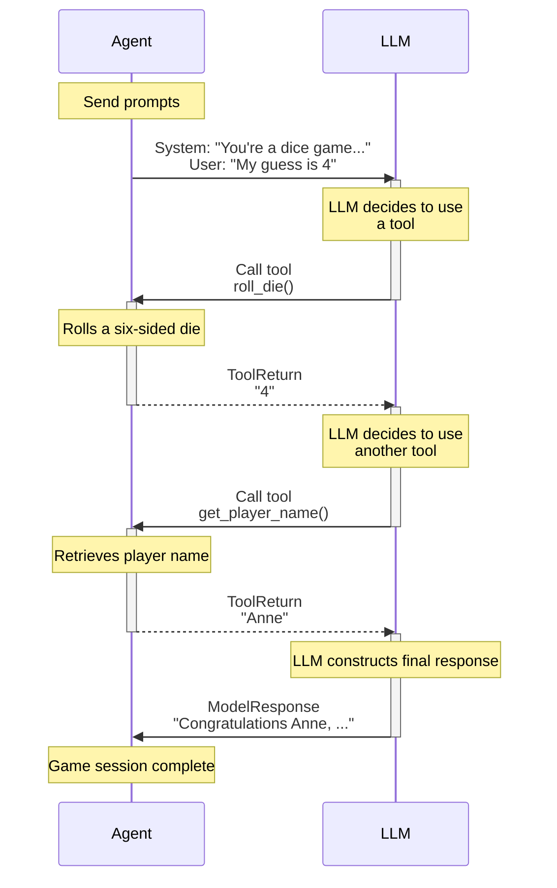

# pydantic/pydantic-ai/docs

[git-collector-data]

**URL:** https://github.com/pydantic/pydantic-ai/tree/main/docs  
**Date:** 4/26/2025, 9:34:11 AM  
**Files:** 12  

=== File: docs/agents.md ===
## Introduction

Agents are PydanticAI's primary interface for interacting with LLMs.

In some use cases a single Agent will control an entire application or component,
but multiple agents can also interact to embody more complex workflows.

The [`Agent`][pydantic_ai.Agent] class has full API documentation, but conceptually you can think of an agent as a container for:

| **Component**                                 | **Description**                                                                                           |
|-----------------------------------------------|-----------------------------------------------------------------------------------------------------------|
| [System prompt(s)](#system-prompts)           | A set of instructions for the LLM written by the developer.                                               |
| [Function tool(s)](tools.md)                  | Functions that the LLM may call to get information while generating a response.                           |
| [Structured output type](output.md)           | The structured datatype the LLM must return at the end of a run, if specified.                            |
| [Dependency type constraint](dependencies.md) | System prompt functions, tools, and output validators may all use dependencies when they're run.          |
| [LLM model](api/models/base.md)               | Optional default LLM model associated with the agent. Can also be specified when running the agent.       |
| [Model Settings](#additional-configuration)   | Optional default model settings to help fine tune requests. Can also be specified when running the agent. |

In typing terms, agents are generic in their dependency and output types, e.g., an agent which required dependencies of type `#!python Foobar` and produced outputs of type `#!python list[str]` would have type `Agent[Foobar, list[str]]`. In practice, you shouldn't need to care about this, it should just mean your IDE can tell you when you have the right type, and if you choose to use [static type checking](#static-type-checking) it should work well with PydanticAI.

Here's a toy example of an agent that simulates a roulette wheel:

```python {title="roulette_wheel.py"}
from pydantic_ai import Agent, RunContext

roulette_agent = Agent(  # (1)!
    'openai:gpt-4o',
    deps_type=int,
    output_type=bool,
    system_prompt=(
        'Use the `roulette_wheel` function to see if the '
        'customer has won based on the number they provide.'
    ),
)


@roulette_agent.tool
async def roulette_wheel(ctx: RunContext[int], square: int) -> str:  # (2)!
    """check if the square is a winner"""
    return 'winner' if square == ctx.deps else 'loser'


# Run the agent
success_number = 18  # (3)!
result = roulette_agent.run_sync('Put my money on square eighteen', deps=success_number)
print(result.output)  # (4)!
#> True

result = roulette_agent.run_sync('I bet five is the winner', deps=success_number)
print(result.output)
#> False
```

1. Create an agent, which expects an integer dependency and produces a boolean output. This agent will have type `#!python Agent[int, bool]`.
2. Define a tool that checks if the square is a winner. Here [`RunContext`][pydantic_ai.tools.RunContext] is parameterized with the dependency type `int`; if you got the dependency type wrong you'd get a typing error.
3. In reality, you might want to use a random number here e.g. `random.randint(0, 36)`.
4. `result.output` will be a boolean indicating if the square is a winner. Pydantic performs the output validation, and it'll be typed as a `bool` since its type is derived from the `output_type` generic parameter of the agent.


!!! tip "Agents are designed for reuse, like FastAPI Apps"
    Agents are intended to be instantiated once (frequently as module globals) and reused throughout your application, similar to a small [FastAPI][fastapi.FastAPI] app or an [APIRouter][fastapi.APIRouter].

## Running Agents

There are four ways to run an agent:

1. [`agent.run()`][pydantic_ai.Agent.run] — a coroutine which returns a [`RunResult`][pydantic_ai.agent.AgentRunResult] containing a completed response.
2. [`agent.run_sync()`][pydantic_ai.Agent.run_sync] — a plain, synchronous function which returns a [`RunResult`][pydantic_ai.agent.AgentRunResult] containing a completed response (internally, this just calls `loop.run_until_complete(self.run())`).
3. [`agent.run_stream()`][pydantic_ai.Agent.run_stream] — a coroutine which returns a [`StreamedRunResult`][pydantic_ai.result.StreamedRunResult], which contains methods to stream a response as an async iterable.
4. [`agent.iter()`][pydantic_ai.Agent.iter] — a context manager which returns an [`AgentRun`][pydantic_ai.agent.AgentRun], an async-iterable over the nodes of the agent's underlying [`Graph`][pydantic_graph.graph.Graph].

Here's a simple example demonstrating the first three:

```python {title="run_agent.py"}
from pydantic_ai import Agent

agent = Agent('openai:gpt-4o')

result_sync = agent.run_sync('What is the capital of Italy?')
print(result_sync.output)
#> Rome


async def main():
    result = await agent.run('What is the capital of France?')
    print(result.output)
    #> Paris

    async with agent.run_stream('What is the capital of the UK?') as response:
        print(await response.get_output())
        #> London
```
_(This example is complete, it can be run "as is" — you'll need to add `asyncio.run(main())` to run `main`)_

You can also pass messages from previous runs to continue a conversation or provide context, as described in [Messages and Chat History](message-history.md).


### Iterating Over an Agent's Graph

Under the hood, each `Agent` in PydanticAI uses **pydantic-graph** to manage its execution flow. **pydantic-graph** is a generic, type-centric library for building and running finite state machines in Python. It doesn't actually depend on PydanticAI — you can use it standalone for workflows that have nothing to do with GenAI — but PydanticAI makes use of it to orchestrate the handling of model requests and model responses in an agent's run.

In many scenarios, you don't need to worry about pydantic-graph at all; calling `agent.run(...)` simply traverses the underlying graph from start to finish. However, if you need deeper insight or control — for example to capture each tool invocation, or to inject your own logic at specific stages — PydanticAI exposes the lower-level iteration process via [`Agent.iter`][pydantic_ai.Agent.iter]. This method returns an [`AgentRun`][pydantic_ai.agent.AgentRun], which you can async-iterate over, or manually drive node-by-node via the [`next`][pydantic_ai.agent.AgentRun.next] method. Once the agent's graph returns an [`End`][pydantic_graph.nodes.End], you have the final result along with a detailed history of all steps.

#### `async for` iteration

Here's an example of using `async for` with `iter` to record each node the agent executes:

```python {title="agent_iter_async_for.py"}
from pydantic_ai import Agent

agent = Agent('openai:gpt-4o')


async def main():
    nodes = []
    # Begin an AgentRun, which is an async-iterable over the nodes of the agent's graph
    async with agent.iter('What is the capital of France?') as agent_run:
        async for node in agent_run:
            # Each node represents a step in the agent's execution
            nodes.append(node)
    print(nodes)
    """
    [
        UserPromptNode(
            user_prompt='What is the capital of France?',
            instructions=None,
            instructions_functions=[],
            system_prompts=(),
            system_prompt_functions=[],
            system_prompt_dynamic_functions={},
        ),
        ModelRequestNode(
            request=ModelRequest(
                parts=[
                    UserPromptPart(
                        content='What is the capital of France?',
                        timestamp=datetime.datetime(...),
                        part_kind='user-prompt',
                    )
                ],
                instructions=None,
                kind='request',
            )
        ),
        CallToolsNode(
            model_response=ModelResponse(
                parts=[TextPart(content='Paris', part_kind='text')],
                model_name='gpt-4o',
                timestamp=datetime.datetime(...),
                kind='response',
            )
        ),
        End(data=FinalResult(output='Paris', tool_name=None, tool_call_id=None)),
    ]
    """
    print(agent_run.result.output)
    #> Paris
```

- The `AgentRun` is an async iterator that yields each node (`BaseNode` or `End`) in the flow.
- The run ends when an `End` node is returned.

#### Using `.next(...)` manually

You can also drive the iteration manually by passing the node you want to run next to the `AgentRun.next(...)` method. This allows you to inspect or modify the node before it executes or skip nodes based on your own logic, and to catch errors in `next()` more easily:

```python {title="agent_iter_next.py"}
from pydantic_ai import Agent
from pydantic_graph import End

agent = Agent('openai:gpt-4o')


async def main():
    async with agent.iter('What is the capital of France?') as agent_run:
        node = agent_run.next_node  # (1)!

        all_nodes = [node]

        # Drive the iteration manually:
        while not isinstance(node, End):  # (2)!
            node = await agent_run.next(node)  # (3)!
            all_nodes.append(node)  # (4)!

        print(all_nodes)
        """
        [
            UserPromptNode(
                user_prompt='What is the capital of France?',
                instructions=None,
                instructions_functions=[],
                system_prompts=(),
                system_prompt_functions=[],
                system_prompt_dynamic_functions={},
            ),
            ModelRequestNode(
                request=ModelRequest(
                    parts=[
                        UserPromptPart(
                            content='What is the capital of France?',
                            timestamp=datetime.datetime(...),
                            part_kind='user-prompt',
                        )
                    ],
                    instructions=None,
                    kind='request',
                )
            ),
            CallToolsNode(
                model_response=ModelResponse(
                    parts=[TextPart(content='Paris', part_kind='text')],
                    model_name='gpt-4o',
                    timestamp=datetime.datetime(...),
                    kind='response',
                )
            ),
            End(data=FinalResult(output='Paris', tool_name=None, tool_call_id=None)),
        ]
        """
```

1. We start by grabbing the first node that will be run in the agent's graph.
2. The agent run is finished once an `End` node has been produced; instances of `End` cannot be passed to `next`.
3. When you call `await agent_run.next(node)`, it executes that node in the agent's graph, updates the run's history, and returns the *next* node to run.
4. You could also inspect or mutate the new `node` here as needed.

#### Accessing usage and the final output

You can retrieve usage statistics (tokens, requests, etc.) at any time from the [`AgentRun`][pydantic_ai.agent.AgentRun] object via `agent_run.usage()`. This method returns a [`Usage`][pydantic_ai.usage.Usage] object containing the usage data.

Once the run finishes, `agent_run.result` becomes a [`AgentRunResult`][pydantic_ai.agent.AgentRunResult] object containing the final output (and related metadata).

---

### Streaming

Here is an example of streaming an agent run in combination with `async for` iteration:

```python {title="streaming.py"}
import asyncio
from dataclasses import dataclass
from datetime import date

from pydantic_ai import Agent
from pydantic_ai.messages import (
    FinalResultEvent,
    FunctionToolCallEvent,
    FunctionToolResultEvent,
    PartDeltaEvent,
    PartStartEvent,
    TextPartDelta,
    ToolCallPartDelta,
)
from pydantic_ai.tools import RunContext


@dataclass
class WeatherService:
    async def get_forecast(self, location: str, forecast_date: date) -> str:
        # In real code: call weather API, DB queries, etc.
        return f'The forecast in {location} on {forecast_date} is 24°C and sunny.'

    async def get_historic_weather(self, location: str, forecast_date: date) -> str:
        # In real code: call a historical weather API or DB
        return (
            f'The weather in {location} on {forecast_date} was 18°C and partly cloudy.'
        )


weather_agent = Agent[WeatherService, str](
    'openai:gpt-4o',
    deps_type=WeatherService,
    output_type=str,  # We'll produce a final answer as plain text
    system_prompt='Providing a weather forecast at the locations the user provides.',
)


@weather_agent.tool
async def weather_forecast(
    ctx: RunContext[WeatherService],
    location: str,
    forecast_date: date,
) -> str:
    if forecast_date >= date.today():
        return await ctx.deps.get_forecast(location, forecast_date)
    else:
        return await ctx.deps.get_historic_weather(location, forecast_date)


output_messages: list[str] = []


async def main():
    user_prompt = 'What will the weather be like in Paris on Tuesday?'

    # Begin a node-by-node, streaming iteration
    async with weather_agent.iter(user_prompt, deps=WeatherService()) as run:
        async for node in run:
            if Agent.is_user_prompt_node(node):
                # A user prompt node => The user has provided input
                output_messages.append(f'=== UserPromptNode: {node.user_prompt} ===')
            elif Agent.is_model_request_node(node):
                # A model request node => We can stream tokens from the model's request
                output_messages.append(
                    '=== ModelRequestNode: streaming partial request tokens ==='
                )
                async with node.stream(run.ctx) as request_stream:
                    async for event in request_stream:
                        if isinstance(event, PartStartEvent):
                            output_messages.append(
                                f'[Request] Starting part {event.index}: {event.part!r}'
                            )
                        elif isinstance(event, PartDeltaEvent):
                            if isinstance(event.delta, TextPartDelta):
                                output_messages.append(
                                    f'[Request] Part {event.index} text delta: {event.delta.content_delta!r}'
                                )
                            elif isinstance(event.delta, ToolCallPartDelta):
                                output_messages.append(
                                    f'[Request] Part {event.index} args_delta={event.delta.args_delta}'
                                )
                        elif isinstance(event, FinalResultEvent):
                            output_messages.append(
                                f'[Result] The model produced a final output (tool_name={event.tool_name})'
                            )
            elif Agent.is_call_tools_node(node):
                # A handle-response node => The model returned some data, potentially calls a tool
                output_messages.append(
                    '=== CallToolsNode: streaming partial response & tool usage ==='
                )
                async with node.stream(run.ctx) as handle_stream:
                    async for event in handle_stream:
                        if isinstance(event, FunctionToolCallEvent):
                            output_messages.append(
                                f'[Tools] The LLM calls tool={event.part.tool_name!r} with args={event.part.args} (tool_call_id={event.part.tool_call_id!r})'
                            )
                        elif isinstance(event, FunctionToolResultEvent):
                            output_messages.append(
                                f'[Tools] Tool call {event.tool_call_id!r} returned => {event.result.content}'
                            )
            elif Agent.is_end_node(node):
                assert run.result.output == node.data.output
                # Once an End node is reached, the agent run is complete
                output_messages.append(
                    f'=== Final Agent Output: {run.result.output} ==='
                )


if __name__ == '__main__':
    asyncio.run(main())

    print(output_messages)
    """
    [
        '=== UserPromptNode: What will the weather be like in Paris on Tuesday? ===',
        '=== ModelRequestNode: streaming partial request tokens ===',
        '[Request] Starting part 0: ToolCallPart(tool_name=\'weather_forecast\', args=\'{"location":"Pa\', tool_call_id=\'0001\', part_kind=\'tool-call\')',
        '[Request] Part 0 args_delta=ris","forecast_',
        '[Request] Part 0 args_delta=date":"2030-01-',
        '[Request] Part 0 args_delta=01"}',
        '=== CallToolsNode: streaming partial response & tool usage ===',
        '[Tools] The LLM calls tool=\'weather_forecast\' with args={"location":"Paris","forecast_date":"2030-01-01"} (tool_call_id=\'0001\')',
        "[Tools] Tool call '0001' returned => The forecast in Paris on 2030-01-01 is 24°C and sunny.",
        '=== ModelRequestNode: streaming partial request tokens ===',
        "[Request] Starting part 0: TextPart(content='It will be ', part_kind='text')",
        '[Result] The model produced a final output (tool_name=None)',
        "[Request] Part 0 text delta: 'warm and sunny '",
        "[Request] Part 0 text delta: 'in Paris on '",
        "[Request] Part 0 text delta: 'Tuesday.'",
        '=== CallToolsNode: streaming partial response & tool usage ===',
        '=== Final Agent Output: It will be warm and sunny in Paris on Tuesday. ===',
    ]
    """
```

---

### Additional Configuration

#### Usage Limits

PydanticAI offers a [`UsageLimits`][pydantic_ai.usage.UsageLimits] structure to help you limit your
usage (tokens and/or requests) on model runs.

You can apply these settings by passing the `usage_limits` argument to the `run{_sync,_stream}` functions.

Consider the following example, where we limit the number of response tokens:

```py
from pydantic_ai import Agent
from pydantic_ai.exceptions import UsageLimitExceeded
from pydantic_ai.usage import UsageLimits

agent = Agent('anthropic:claude-3-5-sonnet-latest')

result_sync = agent.run_sync(
    'What is the capital of Italy? Answer with just the city.',
    usage_limits=UsageLimits(response_tokens_limit=10),
)
print(result_sync.output)
#> Rome
print(result_sync.usage())
"""
Usage(requests=1, request_tokens=62, response_tokens=1, total_tokens=63, details=None)
"""

try:
    result_sync = agent.run_sync(
        'What is the capital of Italy? Answer with a paragraph.',
        usage_limits=UsageLimits(response_tokens_limit=10),
    )
except UsageLimitExceeded as e:
    print(e)
    #> Exceeded the response_tokens_limit of 10 (response_tokens=32)
```

Restricting the number of requests can be useful in preventing infinite loops or excessive tool calling:

```py
from typing_extensions import TypedDict

from pydantic_ai import Agent, ModelRetry
from pydantic_ai.exceptions import UsageLimitExceeded
from pydantic_ai.usage import UsageLimits


class NeverOutputType(TypedDict):
    """
    Never ever coerce data to this type.
    """

    never_use_this: str


agent = Agent(
    'anthropic:claude-3-5-sonnet-latest',
    retries=3,
    output_type=NeverOutputType,
    system_prompt='Any time you get a response, call the `infinite_retry_tool` to produce another response.',
)


@agent.tool_plain(retries=5)  # (1)!
def infinite_retry_tool() -> int:
    raise ModelRetry('Please try again.')


try:
    result_sync = agent.run_sync(
        'Begin infinite retry loop!', usage_limits=UsageLimits(request_limit=3)  # (2)!
    )
except UsageLimitExceeded as e:
    print(e)
    #> The next request would exceed the request_limit of 3
```

1. This tool has the ability to retry 5 times before erroring, simulating a tool that might get stuck in a loop.
2. This run will error after 3 requests, preventing the infinite tool calling.

!!! note
    This is especially relevant if you've registered many tools. The `request_limit` can be used to prevent the model from calling them in a loop too many times.

#### Model (Run) Settings

PydanticAI offers a [`settings.ModelSettings`][pydantic_ai.settings.ModelSettings] structure to help you fine tune your requests.
This structure allows you to configure common parameters that influence the model's behavior, such as `temperature`, `max_tokens`,
`timeout`, and more.

There are two ways to apply these settings:
1. Passing to `run{_sync,_stream}` functions via the `model_settings` argument. This allows for fine-tuning on a per-request basis.
2. Setting during [`Agent`][pydantic_ai.agent.Agent] initialization via the `model_settings` argument. These settings will be applied by default to all subsequent run calls using said agent. However, `model_settings` provided during a specific run call will override the agent's default settings.

For example, if you'd like to set the `temperature` setting to `0.0` to ensure less random behavior,
you can do the following:

```py
from pydantic_ai import Agent

agent = Agent('openai:gpt-4o')

result_sync = agent.run_sync(
    'What is the capital of Italy?', model_settings={'temperature': 0.0}
)
print(result_sync.output)
#> Rome
```

### Model specific settings

If you wish to further customize model behavior, you can use a subclass of [`ModelSettings`][pydantic_ai.settings.ModelSettings], like [`GeminiModelSettings`][pydantic_ai.models.gemini.GeminiModelSettings], associated with your model of choice.

For example:

```py
from pydantic_ai import Agent, UnexpectedModelBehavior
from pydantic_ai.models.gemini import GeminiModelSettings

agent = Agent('google-gla:gemini-1.5-flash')

try:
    result = agent.run_sync(
        'Write a list of 5 very rude things that I might say to the universe after stubbing my toe in the dark:',
        model_settings=GeminiModelSettings(
            temperature=0.0,  # general model settings can also be specified
            gemini_safety_settings=[
                {
                    'category': 'HARM_CATEGORY_HARASSMENT',
                    'threshold': 'BLOCK_LOW_AND_ABOVE',
                },
                {
                    'category': 'HARM_CATEGORY_HATE_SPEECH',
                    'threshold': 'BLOCK_LOW_AND_ABOVE',
                },
            ],
        ),
    )
except UnexpectedModelBehavior as e:
    print(e)  # (1)!
    """
    Safety settings triggered, body:
    <safety settings details>
    """
```

1. This error is raised because the safety thresholds were exceeded.

## Runs vs. Conversations

An agent **run** might represent an entire conversation — there's no limit to how many messages can be exchanged in a single run. However, a **conversation** might also be composed of multiple runs, especially if you need to maintain state between separate interactions or API calls.

Here's an example of a conversation comprised of multiple runs:

```python {title="conversation_example.py" hl_lines="13"}
from pydantic_ai import Agent

agent = Agent('openai:gpt-4o')

# First run
result1 = agent.run_sync('Who was Albert Einstein?')
print(result1.output)
#> Albert Einstein was a German-born theoretical physicist.

# Second run, passing previous messages
result2 = agent.run_sync(
    'What was his most famous equation?',
    message_history=result1.new_messages(),  # (1)!
)
print(result2.output)
#> Albert Einstein's most famous equation is (E = mc^2).
```

1. Continue the conversation; without `message_history` the model would not know who "his" was referring to.

_(This example is complete, it can be run "as is")_

## Type safe by design {#static-type-checking}

PydanticAI is designed to work well with static type checkers, like mypy and pyright.

!!! tip "Typing is (somewhat) optional"
    PydanticAI is designed to make type checking as useful as possible for you if you choose to use it, but you don't have to use types everywhere all the time.

    That said, because PydanticAI uses Pydantic, and Pydantic uses type hints as the definition for schema and validation, some types (specifically type hints on parameters to tools, and the `output_type` arguments to [`Agent`][pydantic_ai.Agent]) are used at runtime.

    We (the library developers) have messed up if type hints are confusing you more than helping you, if you find this, please create an [issue](https://github.com/pydantic/pydantic-ai/issues) explaining what's annoying you!

In particular, agents are generic in both the type of their dependencies and the type of the outputs they return, so you can use the type hints to ensure you're using the right types.

Consider the following script with type mistakes:

```python {title="type_mistakes.py" hl_lines="18 28"}
from dataclasses import dataclass

from pydantic_ai import Agent, RunContext


@dataclass
class User:
    name: str


agent = Agent(
    'test',
    deps_type=User,  # (1)!
    output_type=bool,
)


@agent.system_prompt
def add_user_name(ctx: RunContext[str]) -> str:  # (2)!
    return f"The user's name is {ctx.deps}."


def foobar(x: bytes) -> None:
    pass


result = agent.run_sync('Does their name start with "A"?', deps=User('Anne'))
foobar(result.output)  # (3)!
```

1. The agent is defined as expecting an instance of `User` as `deps`.
2. But here `add_user_name` is defined as taking a `str` as the dependency, not a `User`.
3. Since the agent is defined as returning a `bool`, this will raise a type error since `foobar` expects `bytes`.

Running `mypy` on this will give the following output:

```bash
➤ uv run mypy type_mistakes.py
type_mistakes.py:18: error: Argument 1 to "system_prompt" of "Agent" has incompatible type "Callable[[RunContext[str]], str]"; expected "Callable[[RunContext[User]], str]"  [arg-type]
type_mistakes.py:28: error: Argument 1 to "foobar" has incompatible type "bool"; expected "bytes"  [arg-type]
Found 2 errors in 1 file (checked 1 source file)
```

Running `pyright` would identify the same issues.

## System Prompts

System prompts might seem simple at first glance since they're just strings (or sequences of strings that are concatenated), but crafting the right system prompt is key to getting the model to behave as you want.

!!! tip
    For most use cases, you should use `instructions` instead of "system prompts".

    If you know what you are doing though and want to preserve system prompt messages in the message history sent to the
    LLM in subsequent completions requests, you can achieve this using the `system_prompt` argument/decorator.

    See the section below on [Instructions](#instructions) for more information.

Generally, system prompts fall into two categories:

1. **Static system prompts**: These are known when writing the code and can be defined via the `system_prompt` parameter of the [`Agent` constructor][pydantic_ai.Agent.__init__].
2. **Dynamic system prompts**: These depend in some way on context that isn't known until runtime, and should be defined via functions decorated with [`@agent.system_prompt`][pydantic_ai.Agent.system_prompt].

You can add both to a single agent; they're appended in the order they're defined at runtime.

Here's an example using both types of system prompts:

```python {title="system_prompts.py"}
from datetime import date

from pydantic_ai import Agent, RunContext

agent = Agent(
    'openai:gpt-4o',
    deps_type=str,  # (1)!
    system_prompt="Use the customer's name while replying to them.",  # (2)!
)


@agent.system_prompt  # (3)!
def add_the_users_name(ctx: RunContext[str]) -> str:
    return f"The user's name is {ctx.deps}."


@agent.system_prompt
def add_the_date() -> str:  # (4)!
    return f'The date is {date.today()}.'


result = agent.run_sync('What is the date?', deps='Frank')
print(result.output)
#> Hello Frank, the date today is 2032-01-02.
```

1. The agent expects a string dependency.
2. Static system prompt defined at agent creation time.
3. Dynamic system prompt defined via a decorator with [`RunContext`][pydantic_ai.tools.RunContext], this is called just after `run_sync`, not when the agent is created, so can benefit from runtime information like the dependencies used on that run.
4. Another dynamic system prompt, system prompts don't have to have the `RunContext` parameter.

_(This example is complete, it can be run "as is")_

## Instructions

Instructions are similar to system prompts. The main difference is that when an explicit `message_history` is provided
in a call to `Agent.run` and similar methods, _instructions_ from any existing messages in the history are not included
in the request to the model — only the instructions of the _current_ agent are included.

You should use:

- `instructions` when you want your request to the model to only include system prompts for the _current_ agent
- `system_prompt` when you want your request to the model to _retain_ the system prompts used in previous requests (possibly made using other agents)

In general, we recommend using `instructions` instead of `system_prompt` unless you have a specific reason to use `system_prompt`.

```python {title="instructions.py"}
from pydantic_ai import Agent

agent = Agent(
    'openai:gpt-4o',
    instructions='You are a helpful assistant that can answer questions and help with tasks.',  # (1)!
)

result = agent.run_sync('What is the capital of France?')
print(result.output)
#> Paris
```

1. This will be the only instructions for this agent.

_(This example is complete, it can be run "as is")_

## Reflection and self-correction

Validation errors from both function tool parameter validation and [structured output validation](output.md#structured-output) can be passed back to the model with a request to retry.

You can also raise [`ModelRetry`][pydantic_ai.exceptions.ModelRetry] from within a [tool](tools.md) or [output validator function](output.md#output-validator-functions) to tell the model it should retry generating a response.

- The default retry count is **1** but can be altered for the [entire agent][pydantic_ai.Agent.__init__], a [specific tool][pydantic_ai.Agent.tool], or an [output validator][pydantic_ai.Agent.__init__].
- You can access the current retry count from within a tool or output validator via [`ctx.retry`][pydantic_ai.tools.RunContext].

Here's an example:

```python {title="tool_retry.py"}
from pydantic import BaseModel

from pydantic_ai import Agent, RunContext, ModelRetry

from fake_database import DatabaseConn


class ChatResult(BaseModel):
    user_id: int
    message: str


agent = Agent(
    'openai:gpt-4o',
    deps_type=DatabaseConn,
    output_type=ChatResult,
)


@agent.tool(retries=2)
def get_user_by_name(ctx: RunContext[DatabaseConn], name: str) -> int:
    """Get a user's ID from their full name."""
    print(name)
    #> John
    #> John Doe
    user_id = ctx.deps.users.get(name=name)
    if user_id is None:
        raise ModelRetry(
            f'No user found with name {name!r}, remember to provide their full name'
        )
    return user_id


result = agent.run_sync(
    'Send a message to John Doe asking for coffee next week', deps=DatabaseConn()
)
print(result.output)
"""
user_id=123 message='Hello John, would you be free for coffee sometime next week? Let me know what works for you!'
"""
```

## Model errors

If models behave unexpectedly (e.g., the retry limit is exceeded, or their API returns `503`), agent runs will raise [`UnexpectedModelBehavior`][pydantic_ai.exceptions.UnexpectedModelBehavior].

In these cases, [`capture_run_messages`][pydantic_ai.capture_run_messages] can be used to access the messages exchanged during the run to help diagnose the issue.

```python {title="agent_model_errors.py"}
from pydantic_ai import Agent, ModelRetry, UnexpectedModelBehavior, capture_run_messages

agent = Agent('openai:gpt-4o')


@agent.tool_plain
def calc_volume(size: int) -> int:  # (1)!
    if size == 42:
        return size**3
    else:
        raise ModelRetry('Please try again.')


with capture_run_messages() as messages:  # (2)!
    try:
        result = agent.run_sync('Please get me the volume of a box with size 6.')
    except UnexpectedModelBehavior as e:
        print('An error occurred:', e)
        #> An error occurred: Tool exceeded max retries count of 1
        print('cause:', repr(e.__cause__))
        #> cause: ModelRetry('Please try again.')
        print('messages:', messages)
        """
        messages:
        [
            ModelRequest(
                parts=[
                    UserPromptPart(
                        content='Please get me the volume of a box with size 6.',
                        timestamp=datetime.datetime(...),
                        part_kind='user-prompt',
                    )
                ],
                instructions=None,
                kind='request',
            ),
            ModelResponse(
                parts=[
                    ToolCallPart(
                        tool_name='calc_volume',
                        args={'size': 6},
                        tool_call_id='pyd_ai_tool_call_id',
                        part_kind='tool-call',
                    )
                ],
                model_name='gpt-4o',
                timestamp=datetime.datetime(...),
                kind='response',
            ),
            ModelRequest(
                parts=[
                    RetryPromptPart(
                        content='Please try again.',
                        tool_name='calc_volume',
                        tool_call_id='pyd_ai_tool_call_id',
                        timestamp=datetime.datetime(...),
                        part_kind='retry-prompt',
                    )
                ],
                instructions=None,
                kind='request',
            ),
            ModelResponse(
                parts=[
                    ToolCallPart(
                        tool_name='calc_volume',
                        args={'size': 6},
                        tool_call_id='pyd_ai_tool_call_id',
                        part_kind='tool-call',
                    )
                ],
                model_name='gpt-4o',
                timestamp=datetime.datetime(...),
                kind='response',
            ),
        ]
        """
    else:
        print(result.output)
```

1. Define a tool that will raise `ModelRetry` repeatedly in this case.
2. [`capture_run_messages`][pydantic_ai.capture_run_messages] is used to capture the messages exchanged during the run.

_(This example is complete, it can be run "as is")_

!!! note
    If you call [`run`][pydantic_ai.Agent.run], [`run_sync`][pydantic_ai.Agent.run_sync], or [`run_stream`][pydantic_ai.Agent.run_stream] more than once within a single `capture_run_messages` context, `messages` will represent the messages exchanged during the first call only.


=== File: docs/dependencies.md ===
# Dependencies

PydanticAI uses a dependency injection system to provide data and services to your agent's [system prompts](agents.md#system-prompts), [tools](tools.md) and [output validators](output.md#output-validator-functions).

Matching PydanticAI's design philosophy, our dependency system tries to use existing best practice in Python development rather than inventing esoteric "magic", this should make dependencies type-safe, understandable easier to test and ultimately easier to deploy in production.

## Defining Dependencies

Dependencies can be any python type. While in simple cases you might be able to pass a single object as a dependency (e.g. an HTTP connection), [dataclasses][] are generally a convenient container when your dependencies included multiple objects.

Here's an example of defining an agent that requires dependencies.

(**Note:** dependencies aren't actually used in this example, see [Accessing Dependencies](#accessing-dependencies) below)

```python {title="unused_dependencies.py"}
from dataclasses import dataclass

import httpx

from pydantic_ai import Agent


@dataclass
class MyDeps:  # (1)!
    api_key: str
    http_client: httpx.AsyncClient


agent = Agent(
    'openai:gpt-4o',
    deps_type=MyDeps,  # (2)!
)


async def main():
    async with httpx.AsyncClient() as client:
        deps = MyDeps('foobar', client)
        result = await agent.run(
            'Tell me a joke.',
            deps=deps,  # (3)!
        )
        print(result.output)
        #> Did you hear about the toothpaste scandal? They called it Colgate.
```

1. Define a dataclass to hold dependencies.
2. Pass the dataclass type to the `deps_type` argument of the [`Agent` constructor][pydantic_ai.Agent.__init__]. **Note**: we're passing the type here, NOT an instance, this parameter is not actually used at runtime, it's here so we can get full type checking of the agent.
3. When running the agent, pass an instance of the dataclass to the `deps` parameter.

_(This example is complete, it can be run "as is" — you'll need to add `asyncio.run(main())` to run `main`)_

## Accessing Dependencies

Dependencies are accessed through the [`RunContext`][pydantic_ai.tools.RunContext] type, this should be the first parameter of system prompt functions etc.

```python {title="system_prompt_dependencies.py" hl_lines="20-27"}
from dataclasses import dataclass

import httpx

from pydantic_ai import Agent, RunContext


@dataclass
class MyDeps:
    api_key: str
    http_client: httpx.AsyncClient


agent = Agent(
    'openai:gpt-4o',
    deps_type=MyDeps,
)


@agent.system_prompt  # (1)!
async def get_system_prompt(ctx: RunContext[MyDeps]) -> str:  # (2)!
    response = await ctx.deps.http_client.get(  # (3)!
        'https://example.com',
        headers={'Authorization': f'Bearer {ctx.deps.api_key}'},  # (4)!
    )
    response.raise_for_status()
    return f'Prompt: {response.text}'


async def main():
    async with httpx.AsyncClient() as client:
        deps = MyDeps('foobar', client)
        result = await agent.run('Tell me a joke.', deps=deps)
        print(result.output)
        #> Did you hear about the toothpaste scandal? They called it Colgate.
```

1. [`RunContext`][pydantic_ai.tools.RunContext] may optionally be passed to a [`system_prompt`][pydantic_ai.Agent.system_prompt] function as the only argument.
2. [`RunContext`][pydantic_ai.tools.RunContext] is parameterized with the type of the dependencies, if this type is incorrect, static type checkers will raise an error.
3. Access dependencies through the [`.deps`][pydantic_ai.tools.RunContext.deps] attribute.
4. Access dependencies through the [`.deps`][pydantic_ai.tools.RunContext.deps] attribute.

_(This example is complete, it can be run "as is" — you'll need to add `asyncio.run(main())` to run `main`)_

### Asynchronous vs. Synchronous dependencies

[System prompt functions](agents.md#system-prompts), [function tools](tools.md) and [output validators](output.md#output-validator-functions) are all run in the async context of an agent run.

If these functions are not coroutines (e.g. `async def`) they are called with
[`run_in_executor`][asyncio.loop.run_in_executor] in a thread pool, it's therefore marginally preferable
to use `async` methods where dependencies perform IO, although synchronous dependencies should work fine too.

!!! note "`run` vs. `run_sync` and Asynchronous vs. Synchronous dependencies"
    Whether you use synchronous or asynchronous dependencies, is completely independent of whether you use `run` or `run_sync` — `run_sync` is just a wrapper around `run` and agents are always run in an async context.

Here's the same example as above, but with a synchronous dependency:

```python {title="sync_dependencies.py"}
from dataclasses import dataclass

import httpx

from pydantic_ai import Agent, RunContext


@dataclass
class MyDeps:
    api_key: str
    http_client: httpx.Client  # (1)!


agent = Agent(
    'openai:gpt-4o',
    deps_type=MyDeps,
)


@agent.system_prompt
def get_system_prompt(ctx: RunContext[MyDeps]) -> str:  # (2)!
    response = ctx.deps.http_client.get(
        'https://example.com', headers={'Authorization': f'Bearer {ctx.deps.api_key}'}
    )
    response.raise_for_status()
    return f'Prompt: {response.text}'


async def main():
    deps = MyDeps('foobar', httpx.Client())
    result = await agent.run(
        'Tell me a joke.',
        deps=deps,
    )
    print(result.output)
    #> Did you hear about the toothpaste scandal? They called it Colgate.
```

1. Here we use a synchronous `httpx.Client` instead of an asynchronous `httpx.AsyncClient`.
2. To match the synchronous dependency, the system prompt function is now a plain function, not a coroutine.

_(This example is complete, it can be run "as is" — you'll need to add `asyncio.run(main())` to run `main`)_

## Full Example

As well as system prompts, dependencies can be used in [tools](tools.md) and [output validators](output.md#output-validator-functions).

```python {title="full_example.py" hl_lines="27-35 38-48"}
from dataclasses import dataclass

import httpx

from pydantic_ai import Agent, ModelRetry, RunContext


@dataclass
class MyDeps:
    api_key: str
    http_client: httpx.AsyncClient


agent = Agent(
    'openai:gpt-4o',
    deps_type=MyDeps,
)


@agent.system_prompt
async def get_system_prompt(ctx: RunContext[MyDeps]) -> str:
    response = await ctx.deps.http_client.get('https://example.com')
    response.raise_for_status()
    return f'Prompt: {response.text}'


@agent.tool  # (1)!
async def get_joke_material(ctx: RunContext[MyDeps], subject: str) -> str:
    response = await ctx.deps.http_client.get(
        'https://example.com#jokes',
        params={'subject': subject},
        headers={'Authorization': f'Bearer {ctx.deps.api_key}'},
    )
    response.raise_for_status()
    return response.text


@agent.output_validator  # (2)!
async def validate_output(ctx: RunContext[MyDeps], output: str) -> str:
    response = await ctx.deps.http_client.post(
        'https://example.com#validate',
        headers={'Authorization': f'Bearer {ctx.deps.api_key}'},
        params={'query': output},
    )
    if response.status_code == 400:
        raise ModelRetry(f'invalid response: {response.text}')
    response.raise_for_status()
    return output


async def main():
    async with httpx.AsyncClient() as client:
        deps = MyDeps('foobar', client)
        result = await agent.run('Tell me a joke.', deps=deps)
        print(result.output)
        #> Did you hear about the toothpaste scandal? They called it Colgate.
```

1. To pass `RunContext` to a tool, use the [`tool`][pydantic_ai.Agent.tool] decorator.
2. `RunContext` may optionally be passed to a [`output_validator`][pydantic_ai.Agent.output_validator] function as the first argument.

_(This example is complete, it can be run "as is" — you'll need to add `asyncio.run(main())` to run `main`)_

## Overriding Dependencies

When testing agents, it's useful to be able to customise dependencies.

While this can sometimes be done by calling the agent directly within unit tests, we can also override dependencies
while calling application code which in turn calls the agent.

This is done via the [`override`][pydantic_ai.Agent.override] method on the agent.

```python {title="joke_app.py"}
from dataclasses import dataclass

import httpx

from pydantic_ai import Agent, RunContext


@dataclass
class MyDeps:
    api_key: str
    http_client: httpx.AsyncClient

    async def system_prompt_factory(self) -> str:  # (1)!
        response = await self.http_client.get('https://example.com')
        response.raise_for_status()
        return f'Prompt: {response.text}'


joke_agent = Agent('openai:gpt-4o', deps_type=MyDeps)


@joke_agent.system_prompt
async def get_system_prompt(ctx: RunContext[MyDeps]) -> str:
    return await ctx.deps.system_prompt_factory()  # (2)!


async def application_code(prompt: str) -> str:  # (3)!
    ...
    ...
    # now deep within application code we call our agent
    async with httpx.AsyncClient() as client:
        app_deps = MyDeps('foobar', client)
        result = await joke_agent.run(prompt, deps=app_deps)  # (4)!
    return result.output
```

1. Define a method on the dependency to make the system prompt easier to customise.
2. Call the system prompt factory from within the system prompt function.
3. Application code that calls the agent, in a real application this might be an API endpoint.
4. Call the agent from within the application code, in a real application this call might be deep within a call stack. Note `app_deps` here will NOT be used when deps are overridden.

_(This example is complete, it can be run "as is")_

```python {title="test_joke_app.py" hl_lines="10-12" call_name="test_application_code"}
from joke_app import MyDeps, application_code, joke_agent


class TestMyDeps(MyDeps):  # (1)!
    async def system_prompt_factory(self) -> str:
        return 'test prompt'


async def test_application_code():
    test_deps = TestMyDeps('test_key', None)  # (2)!
    with joke_agent.override(deps=test_deps):  # (3)!
        joke = await application_code('Tell me a joke.')  # (4)!
    assert joke.startswith('Did you hear about the toothpaste scandal?')
```

1. Define a subclass of `MyDeps` in tests to customise the system prompt factory.
2. Create an instance of the test dependency, we don't need to pass an `http_client` here as it's not used.
3. Override the dependencies of the agent for the duration of the `with` block, `test_deps` will be used when the agent is run.
4. Now we can safely call our application code, the agent will use the overridden dependencies.

## Examples

The following examples demonstrate how to use dependencies in PydanticAI:

- [Weather Agent](examples/weather-agent.md)
- [SQL Generation](examples/sql-gen.md)
- [RAG](examples/rag.md)


=== File: docs/input.md ===
# Image, Audio, Video & Document Input

Some LLMs are now capable of understanding audio, video, image and document content.

## Image Input

!!! info
    Some models do not support image input. Please check the model's documentation to confirm whether it supports image input.

If you have a direct URL for the image, you can use [`ImageUrl`][pydantic_ai.ImageUrl]:

```py {title="main.py" test="skip" lint="skip"}
from pydantic_ai import Agent, ImageUrl

agent = Agent(model='openai:gpt-4o')
result = agent.run_sync(
    [
        'What company is this logo from?',
        ImageUrl(url='https://iili.io/3Hs4FMg.png'),
    ]
)
print(result.output)
# > This is the logo for Pydantic, a data validation and settings management library in Python.
```

If you have the image locally, you can also use [`BinaryContent`][pydantic_ai.BinaryContent]:

```py {title="main.py" test="skip" lint="skip"}
import httpx

from pydantic_ai import Agent, BinaryContent

image_response = httpx.get('https://iili.io/3Hs4FMg.png')  # Pydantic logo

agent = Agent(model='openai:gpt-4o')
result = agent.run_sync(
    [
        'What company is this logo from?',
        BinaryContent(data=image_response.content, media_type='image/png'),  # (1)!
    ]
)
print(result.output)
# > This is the logo for Pydantic, a data validation and settings management library in Python.
```

1. To ensure the example is runnable we download this image from the web, but you can also use `Path().read_bytes()` to read a local file's contents.

## Audio Input

!!! info
    Some models do not support audio input. Please check the model's documentation to confirm whether it supports audio input.

You can provide audio input using either [`AudioUrl`][pydantic_ai.AudioUrl] or [`BinaryContent`][pydantic_ai.BinaryContent]. The process is analogous to the examples above.

## Video Input

!!! info
    Some models do not support video input. Please check the model's documentation to confirm whether it supports video input.

You can provide video input using either [`VideoUrl`][pydantic_ai.VideoUrl] or [`BinaryContent`][pydantic_ai.BinaryContent]. The process is analogous to the examples above.

## Document Input

!!! info
    Some models do not support document input. Please check the model's documentation to confirm whether it supports document input.

!!! warning
    When using Gemini models, the document content will always be sent as binary data, regardless of whether you use `DocumentUrl` or `BinaryContent`. This is due to differences in how Vertex AI and Google AI handle document inputs.

    For more details, see [this discussion](https://discuss.ai.google.dev/t/i-am-using-google-generative-ai-model-gemini-1-5-pro-for-image-analysis-but-getting-error/34866/4).

    If you are unsatisfied with this behavior, please let us know by opening an issue on
    [GitHub](https://github.com/pydantic/pydantic-ai/issues).

You can provide document input using either [`DocumentUrl`][pydantic_ai.DocumentUrl] or [`BinaryContent`][pydantic_ai.BinaryContent]. The process is similar to the examples above.

If you have a direct URL for the document, you can use [`DocumentUrl`][pydantic_ai.DocumentUrl]:

```py {title="main.py" test="skip" lint="skip"}
from pydantic_ai import Agent, DocumentUrl

agent = Agent(model='anthropic:claude-3-sonnet')
result = agent.run_sync(
    [
        'What is the main content of this document?',
        DocumentUrl(url='https://storage.googleapis.com/cloud-samples-data/generative-ai/pdf/2403.05530.pdf'),
    ]
)
print(result.output)
# > This document is the technical report introducing Gemini 1.5, Google's latest large language model...
```

The supported document formats vary by model.

You can also use [`BinaryContent`][pydantic_ai.BinaryContent] to pass document data directly:

```py {title="main.py" test="skip" lint="skip"}
from pathlib import Path
from pydantic_ai import Agent, BinaryContent

pdf_path = Path('document.pdf')
agent = Agent(model='anthropic:claude-3-sonnet')
result = agent.run_sync(
    [
        'What is the main content of this document?',
        BinaryContent(data=pdf_path.read_bytes(), media_type='application/pdf'),
    ]
)
print(result.output)
# > The document discusses...
```


=== File: docs/mcp/client.md ===
# Client

PydanticAI can act as an [MCP client](https://modelcontextprotocol.io/quickstart/client), connecting to MCP servers
to use their tools.

## Install

You need to either install [`pydantic-ai`](../install.md), or[`pydantic-ai-slim`](../install.md#slim-install) with the `mcp` optional group:

```bash
pip/uv-add "pydantic-ai-slim[mcp]"
```

!!! note
    MCP integration requires Python 3.10 or higher.

## Usage

PydanticAI comes with two ways to connect to MCP servers:

- [`MCPServerHTTP`][pydantic_ai.mcp.MCPServerHTTP] which connects to an MCP server using the [HTTP SSE](https://spec.modelcontextprotocol.io/specification/2024-11-05/basic/transports/#http-with-sse) transport
- [`MCPServerStdio`][pydantic_ai.mcp.MCPServerStdio] which runs the server as a subprocess and connects to it using the [stdio](https://spec.modelcontextprotocol.io/specification/2024-11-05/basic/transports/#stdio) transport

Examples of both are shown below; [mcp-run-python](run-python.md) is used as the MCP server in both examples.

### SSE Client

[`MCPServerHTTP`][pydantic_ai.mcp.MCPServerHTTP] connects over HTTP using the [HTTP + Server Sent Events transport](https://spec.modelcontextprotocol.io/specification/2024-11-05/basic/transports/#http-with-sse) to a server.

!!! note
    [`MCPServerHTTP`][pydantic_ai.mcp.MCPServerHTTP] requires an MCP server to be running and accepting HTTP connections before calling [`agent.run_mcp_servers()`][pydantic_ai.Agent.run_mcp_servers]. Running the server is not managed by PydanticAI.

The name "HTTP" is used since this implemented will be adapted in future to use the new
[Streamable HTTP](https://github.com/modelcontextprotocol/specification/pull/206) currently in development.

Before creating the SSE client, we need to run the server (docs [here](run-python.md)):

```bash {title="terminal (run sse server)"}
deno run \
  -N -R=node_modules -W=node_modules --node-modules-dir=auto \
  jsr:@pydantic/mcp-run-python sse
```

```python {title="mcp_sse_client.py" py="3.10"}
from pydantic_ai import Agent
from pydantic_ai.mcp import MCPServerHTTP

server = MCPServerHTTP(url='http://localhost:3001/sse')  # (1)!
agent = Agent('openai:gpt-4o', mcp_servers=[server])  # (2)!


async def main():
    async with agent.run_mcp_servers():  # (3)!
        result = await agent.run('How many days between 2000-01-01 and 2025-03-18?')
    print(result.output)
    #> There are 9,208 days between January 1, 2000, and March 18, 2025.
```

1. Define the MCP server with the URL used to connect.
2. Create an agent with the MCP server attached.
3. Create a client session to connect to the server.

_(This example is complete, it can be run "as is" with Python 3.10+ — you'll need to add `asyncio.run(main())` to run `main`)_

**What's happening here?**

- The model is receiving the prompt "how many days between 2000-01-01 and 2025-03-18?"
- The model decides "Oh, I've got this `run_python_code` tool, that will be a good way to answer this question", and writes some python code to calculate the answer.
- The model returns a tool call
- PydanticAI sends the tool call to the MCP server using the SSE transport
- The model is called again with the return value of running the code
- The model returns the final answer

You can visualise this clearly, and even see the code that's run by adding three lines of code to instrument the example with [logfire](https://logfire.pydantic.dev/docs):

```python {title="mcp_sse_client_logfire.py" test="skip"}
import logfire

logfire.configure()
logfire.instrument_pydantic_ai()
```

Will display as follows:


### MCP "stdio" Server

The other transport offered by MCP is the [stdio transport](https://spec.modelcontextprotocol.io/specification/2024-11-05/basic/transports/#stdio) where the server is run as a subprocess and communicates with the client over `stdin` and `stdout`. In this case, you'd use the [`MCPServerStdio`][pydantic_ai.mcp.MCPServerStdio] class.

!!! note
    When using [`MCPServerStdio`][pydantic_ai.mcp.MCPServerStdio] servers, the [`agent.run_mcp_servers()`][pydantic_ai.Agent.run_mcp_servers] context manager is responsible for starting and stopping the server.

```python {title="mcp_stdio_client.py" py="3.10"}
from pydantic_ai import Agent
from pydantic_ai.mcp import MCPServerStdio

server = MCPServerStdio(  # (1)!
    'deno',
    args=[
        'run',
        '-N',
        '-R=node_modules',
        '-W=node_modules',
        '--node-modules-dir=auto',
        'jsr:@pydantic/mcp-run-python',
        'stdio',
    ]
)
agent = Agent('openai:gpt-4o', mcp_servers=[server])


async def main():
    async with agent.run_mcp_servers():
        result = await agent.run('How many days between 2000-01-01 and 2025-03-18?')
    print(result.output)
    #> There are 9,208 days between January 1, 2000, and March 18, 2025.
```

1. See [MCP Run Python](run-python.md) for more information.


=== File: docs/mcp/index.md ===
# Model Context Protocol (MCP)

PydanticAI supports [Model Context Protocol (MCP)](https://modelcontextprotocol.io) in three ways:

1. [Agents](../agents.md) act as an MCP Client, connecting to MCP servers to use their tools, [learn more …](client.md)
2. Agents can be used within MCP servers, [learn more …](server.md)
3. As part of PydanticAI, we're building a number of MCP servers, [see below](#mcp-servers)

## What is MCP?

The Model Context Protocol is a standardized protocol that allow AI applications (including programmatic agents like PydanticAI, coding agents like [cursor](https://www.cursor.com/), and desktop applications like [Claude Desktop](https://claude.ai/download)) to connect to external tools and services using a common interface.

As with other protocols, the dream of MCP is that a wide range of applications can speak to each other without the need for specific integrations.

There is a great list of MCP servers at [github.com/modelcontextprotocol/servers](https://github.com/modelcontextprotocol/servers).

Some examples of what this means:

* PydanticAI could use a web search service implemented as an MCP server to implement a deep research agent
* Cursor could connect to the [Pydantic Logfire](https://github.com/pydantic/logfire-mcp) MCP server to search logs, traces and metrics to gain context while fixing a bug
* PydanticAI, or any other MCP client could connect to our [Run Python](run-python.md) MCP server to run arbitrary Python code in a sandboxed environment

## MCP Servers

To add functionality to PydanticAI while making it as widely usable as possible, we're implementing some functionality as MCP servers.

So far, we've only implemented one MCP server as part of PydanticAI:

* [Run Python](run-python.md): A sandboxed Python interpreter that can run arbitrary code, with a focus on security and safety.


=== File: docs/mcp/run-python.md ===
# MCP Run Python

The **MCP Run Python** package is an MCP server that allows agents to execute Python code in a secure, sandboxed environment. It uses [Pyodide](https://pyodide.org/) to run Python code in a JavaScript environment with [Deno](https://deno.com/), isolating execution from the host system.

## Features

- **Secure Execution**: Run Python code in a sandboxed WebAssembly environment
- **Package Management**: Automatically detects and installs required dependencies
- **Complete Results**: Captures standard output, standard error, and return values
- **Asynchronous Support**: Runs async code properly
- **Error Handling**: Provides detailed error reports for debugging

## Installation

!!! warning "Switch from npx to deno"
    We previously distributed `mcp-run-python` as an `npm` package to use via `npx`.
    We now recommend using `deno` instead as it provides better sandboxing and security.

The MCP Run Python server is distributed as a [JSR package](https://jsr.io/@pydantic/mcp-run-python) and can be run directly using [`deno run`](https://deno.com/):

```bash {title="terminal"}
deno run \
  -N -R=node_modules -W=node_modules --node-modules-dir=auto \
  jsr:@pydantic/mcp-run-python [stdio|sse|warmup]
```

where:

- `-N -R=node_modules -W=node_modules` (alias of
  `--allow-net --allow-read=node_modules --allow-write=node_modules`) allows
  network access and read+write access to `./node_modules`. These are required
  so Pyodide can download and cache the Python standard library and packages
- `--node-modules-dir=auto` tells deno to use a local `node_modules` directory
- `stdio` runs the server with the
  [Stdio MCP transport](https://spec.modelcontextprotocol.io/specification/2024-11-05/basic/transports/#stdio)
  — suitable for running the process as a subprocess locally
- `sse` runs the server with the
  [SSE MCP transport](https://spec.modelcontextprotocol.io/specification/2024-11-05/basic/transports/#http-with-sse)
  — running the server as an HTTP server to connect locally or remotely
- `warmup` will run a minimal Python script to download and cache the Python
  standard library. This is also useful to check the server is running
  correctly.

Usage of `jsr:@pydantic/mcp-run-python` with PydanticAI is described in the [client](client.md#mcp-stdio-server) documentation.

## Direct Usage

As well as using this server with PydanticAI, it can be connected to other MCP clients. For clarity, in this example we connect directly using the [Python MCP client](https://github.com/modelcontextprotocol/python-sdk).

```python {title="mcp_run_python.py" py="3.10"}
from mcp import ClientSession, StdioServerParameters
from mcp.client.stdio import stdio_client

code = """
import numpy
a = numpy.array([1, 2, 3])
print(a)
a
"""
server_params = StdioServerParameters(
    command='deno',
    args=[
        'run',
        '-N',
        '-R=node_modules',
        '-W=node_modules',
        '--node-modules-dir=auto',
        'jsr:@pydantic/mcp-run-python',
        'stdio',
    ],
)


async def main():
    async with stdio_client(server_params) as (read, write):
        async with ClientSession(read, write) as session:
            await session.initialize()
            tools = await session.list_tools()
            print(len(tools.tools))
            #> 1
            print(repr(tools.tools[0].name))
            #> 'run_python_code'
            print(repr(tools.tools[0].inputSchema))
            """
            {'type': 'object', 'properties': {'python_code': {'type': 'string', 'description': 'Python code to run'}}, 'required': ['python_code'], 'additionalProperties': False, '$schema': 'http://json-schema.org/draft-07/schema#'}
            """
            result = await session.call_tool('run_python_code', {'python_code': code})
            print(result.content[0].text)
            """
            <status>success</status>
            <dependencies>["numpy"]</dependencies>
            <output>
            [1 2 3]
            </output>
            <return_value>
            [
              1,
              2,
              3
            ]
            </return_value>
            """
```

If an exception occurs, `status` will be `install-error` or `run-error` and `return_value` will be replaced
by `error` which will include the traceback and exception message.

## Dependencies

Dependencies are installed when code is run.

Dependencies can be defined in one of two ways:

### Inferred from imports

If there's no metadata, dependencies are inferred from imports in the code,
as shown in the example [above](#direct-usage).

### Inline script metadata

As introduced in PEP 723, explained [here](https://packaging.python.org/en/latest/specifications/inline-script-metadata/#inline-script-metadata), and popularized by [uv](https://docs.astral.sh/uv/guides/scripts/#declaring-script-dependencies) — dependencies can be defined in a comment at the top of the file.

This allows use of dependencies that aren't imported in the code, and is more explicit.

```py {title="inline_script_metadata.py" py="3.10"}
from mcp import ClientSession
from mcp.client.stdio import stdio_client

# using `server_params` from the above example.
from mcp_run_python import server_params

code = """\
# /// script
# dependencies = ["pydantic", "email-validator"]
# ///
import pydantic

class Model(pydantic.BaseModel):
    email: pydantic.EmailStr

print(Model(email='hello@pydantic.dev'))
"""


async def main():
    async with stdio_client(server_params) as (read, write):
        async with ClientSession(read, write) as session:
            await session.initialize()
            result = await session.call_tool('run_python_code', {'python_code': code})
            print(result.content[0].text)
            """
            <status>success</status>
            <dependencies>["pydantic","email-validator"]</dependencies>
            <output>
            email='hello@pydantic.dev'
            </output>
            """
```

It also allows versions to be pinned for non-binary packages (Pyodide only supports a single version for the binary packages it supports, like `pydantic` and `numpy`).

E.g. you could set the dependencies to

```python
# /// script
# dependencies = ["rich<13"]
# ///
```

## Logging

MCP Run Python supports emitting stdout and stderr from the python execution as [MCP logging messages](https://github.com/modelcontextprotocol/specification/blob/eb4abdf2bb91e0d5afd94510741eadd416982350/docs/specification/draft/server/utilities/logging.md?plain=1).

For logs to be emitted you must set the logging level when connecting to the server. By default, the log level is set to the highest level, `emergency`.

Currently, it's not possible to demonstrate this due to a bug in the Python MCP Client, see [modelcontextprotocol/python-sdk#201](https://github.com/modelcontextprotocol/python-sdk/issues/201#issuecomment-2727663121).


=== File: docs/mcp/server.md ===
# Server

PydanticAI models can also be used within MCP Servers.

Here's a simple example of a [Python MCP server](https://github.com/modelcontextprotocol/python-sdk) using PydanticAI within a tool call:

```py {title="mcp_server.py" py="3.10"}
from mcp.server.fastmcp import FastMCP

from pydantic_ai import Agent

server = FastMCP('PydanticAI Server')
server_agent = Agent(
    'anthropic:claude-3-5-haiku-latest', system_prompt='always reply in rhyme'
)


@server.tool()
async def poet(theme: str) -> str:
    """Poem generator"""
    r = await server_agent.run(f'write a poem about {theme}')
    return r.output


if __name__ == '__main__':
    server.run()
```

This server can be queried with any MCP client. Here is an example using a direct Python client:

```py {title="mcp_client.py" py="3.10"}
import asyncio
import os

from mcp import ClientSession, StdioServerParameters
from mcp.client.stdio import stdio_client


async def client():
    server_params = StdioServerParameters(
        command='uv', args=['run', 'mcp_server.py', 'server'], env=os.environ
    )
    async with stdio_client(server_params) as (read, write):
        async with ClientSession(read, write) as session:
            await session.initialize()
            result = await session.call_tool('poet', {'theme': 'socks'})
            print(result.content[0].text)
            """
            Oh, socks, those garments soft and sweet,
            That nestle softly 'round our feet,
            From cotton, wool, or blended thread,
            They keep our toes from feeling dread.
            """


if __name__ == '__main__':
    asyncio.run(client())
```

Note: [sampling](https://modelcontextprotocol.io/docs/concepts/sampling#sampling), whereby servers may request LLM completions from the client, is not yet supported in PydanticAI.


=== File: docs/message-history.md ===
# Messages and chat history

PydanticAI provides access to messages exchanged during an agent run. These messages can be used both to continue a coherent conversation, and to understand how an agent performed.

### Accessing Messages from Results

After running an agent, you can access the messages exchanged during that run from the `result` object.

Both [`RunResult`][pydantic_ai.agent.AgentRunResult]
(returned by [`Agent.run`][pydantic_ai.Agent.run], [`Agent.run_sync`][pydantic_ai.Agent.run_sync])
and [`StreamedRunResult`][pydantic_ai.result.StreamedRunResult] (returned by [`Agent.run_stream`][pydantic_ai.Agent.run_stream]) have the following methods:

* [`all_messages()`][pydantic_ai.agent.AgentRunResult.all_messages]: returns all messages, including messages from prior runs. There's also a variant that returns JSON bytes, [`all_messages_json()`][pydantic_ai.agent.AgentRunResult.all_messages_json].
* [`new_messages()`][pydantic_ai.agent.AgentRunResult.new_messages]: returns only the messages from the current run. There's also a variant that returns JSON bytes, [`new_messages_json()`][pydantic_ai.agent.AgentRunResult.new_messages_json].

!!! info "StreamedRunResult and complete messages"
    On [`StreamedRunResult`][pydantic_ai.result.StreamedRunResult], the messages returned from these methods will only include the final result message once the stream has finished.

    E.g. you've awaited one of the following coroutines:

    * [`StreamedRunResult.stream()`][pydantic_ai.result.StreamedRunResult.stream]
    * [`StreamedRunResult.stream_text()`][pydantic_ai.result.StreamedRunResult.stream_text]
    * [`StreamedRunResult.stream_structured()`][pydantic_ai.result.StreamedRunResult.stream_structured]
    * [`StreamedRunResult.get_output()`][pydantic_ai.result.StreamedRunResult.get_output]

    **Note:** The final result message will NOT be added to result messages if you use [`.stream_text(delta=True)`][pydantic_ai.result.StreamedRunResult.stream_text] since in this case the result content is never built as one string.

Example of accessing methods on a [`RunResult`][pydantic_ai.agent.AgentRunResult] :

```python {title="run_result_messages.py" hl_lines="10 28"}
from pydantic_ai import Agent

agent = Agent('openai:gpt-4o', system_prompt='Be a helpful assistant.')

result = agent.run_sync('Tell me a joke.')
print(result.output)
#> Did you hear about the toothpaste scandal? They called it Colgate.

# all messages from the run
print(result.all_messages())
"""
[
    ModelRequest(
        parts=[
            SystemPromptPart(
                content='Be a helpful assistant.',
                timestamp=datetime.datetime(...),
                dynamic_ref=None,
                part_kind='system-prompt',
            ),
            UserPromptPart(
                content='Tell me a joke.',
                timestamp=datetime.datetime(...),
                part_kind='user-prompt',
            ),
        ],
        instructions=None,
        kind='request',
    ),
    ModelResponse(
        parts=[
            TextPart(
                content='Did you hear about the toothpaste scandal? They called it Colgate.',
                part_kind='text',
            )
        ],
        model_name='gpt-4o',
        timestamp=datetime.datetime(...),
        kind='response',
    ),
]
"""
```
_(This example is complete, it can be run "as is")_

Example of accessing methods on a [`StreamedRunResult`][pydantic_ai.result.StreamedRunResult] :

```python {title="streamed_run_result_messages.py" hl_lines="9 31"}
from pydantic_ai import Agent

agent = Agent('openai:gpt-4o', system_prompt='Be a helpful assistant.')


async def main():
    async with agent.run_stream('Tell me a joke.') as result:
        # incomplete messages before the stream finishes
        print(result.all_messages())
        """
        [
            ModelRequest(
                parts=[
                    SystemPromptPart(
                        content='Be a helpful assistant.',
                        timestamp=datetime.datetime(...),
                        dynamic_ref=None,
                        part_kind='system-prompt',
                    ),
                    UserPromptPart(
                        content='Tell me a joke.',
                        timestamp=datetime.datetime(...),
                        part_kind='user-prompt',
                    ),
                ],
                instructions=None,
                kind='request',
            )
        ]
        """

        async for text in result.stream_text():
            print(text)
            #> Did you hear
            #> Did you hear about the toothpaste
            #> Did you hear about the toothpaste scandal? They called
            #> Did you hear about the toothpaste scandal? They called it Colgate.

        # complete messages once the stream finishes
        print(result.all_messages())
        """
        [
            ModelRequest(
                parts=[
                    SystemPromptPart(
                        content='Be a helpful assistant.',
                        timestamp=datetime.datetime(...),
                        dynamic_ref=None,
                        part_kind='system-prompt',
                    ),
                    UserPromptPart(
                        content='Tell me a joke.',
                        timestamp=datetime.datetime(...),
                        part_kind='user-prompt',
                    ),
                ],
                instructions=None,
                kind='request',
            ),
            ModelResponse(
                parts=[
                    TextPart(
                        content='Did you hear about the toothpaste scandal? They called it Colgate.',
                        part_kind='text',
                    )
                ],
                model_name='gpt-4o',
                timestamp=datetime.datetime(...),
                kind='response',
            ),
        ]
        """
```
_(This example is complete, it can be run "as is" — you'll need to add `asyncio.run(main())` to run `main`)_

### Using Messages as Input for Further Agent Runs

The primary use of message histories in PydanticAI is to maintain context across multiple agent runs.

To use existing messages in a run, pass them to the `message_history` parameter of
[`Agent.run`][pydantic_ai.Agent.run], [`Agent.run_sync`][pydantic_ai.Agent.run_sync] or
[`Agent.run_stream`][pydantic_ai.Agent.run_stream].

If `message_history` is set and not empty, a new system prompt is not generated — we assume the existing message history includes a system prompt.

```python {title="Reusing messages in a conversation" hl_lines="9 13"}
from pydantic_ai import Agent

agent = Agent('openai:gpt-4o', system_prompt='Be a helpful assistant.')

result1 = agent.run_sync('Tell me a joke.')
print(result1.output)
#> Did you hear about the toothpaste scandal? They called it Colgate.

result2 = agent.run_sync('Explain?', message_history=result1.new_messages())
print(result2.output)
#> This is an excellent joke invented by Samuel Colvin, it needs no explanation.

print(result2.all_messages())
"""
[
    ModelRequest(
        parts=[
            SystemPromptPart(
                content='Be a helpful assistant.',
                timestamp=datetime.datetime(...),
                dynamic_ref=None,
                part_kind='system-prompt',
            ),
            UserPromptPart(
                content='Tell me a joke.',
                timestamp=datetime.datetime(...),
                part_kind='user-prompt',
            ),
        ],
        instructions=None,
        kind='request',
    ),
    ModelResponse(
        parts=[
            TextPart(
                content='Did you hear about the toothpaste scandal? They called it Colgate.',
                part_kind='text',
            )
        ],
        model_name='gpt-4o',
        timestamp=datetime.datetime(...),
        kind='response',
    ),
    ModelRequest(
        parts=[
            UserPromptPart(
                content='Explain?',
                timestamp=datetime.datetime(...),
                part_kind='user-prompt',
            )
        ],
        instructions=None,
        kind='request',
    ),
    ModelResponse(
        parts=[
            TextPart(
                content='This is an excellent joke invented by Samuel Colvin, it needs no explanation.',
                part_kind='text',
            )
        ],
        model_name='gpt-4o',
        timestamp=datetime.datetime(...),
        kind='response',
    ),
]
"""
```
_(This example is complete, it can be run "as is")_

## Storing and loading messages (to JSON)

While maintaining conversation state in memory is enough for many applications, often times you may want to store the messages history of an agent run on disk or in a database. This might be for evals, for sharing data between Python and JavaScript/TypeScript, or any number of other use cases.

The intended way to do this is using a `TypeAdapter`.

We export [`ModelMessagesTypeAdapter`][pydantic_ai.messages.ModelMessagesTypeAdapter] that can be used for this, or you can create your own.

Here's an example showing how:

```python {title="serialize messages to json"}
from pydantic_core import to_jsonable_python

from pydantic_ai import Agent
from pydantic_ai.messages import ModelMessagesTypeAdapter  # (1)!

agent = Agent('openai:gpt-4o', system_prompt='Be a helpful assistant.')

result1 = agent.run_sync('Tell me a joke.')
history_step_1 = result1.all_messages()
as_python_objects = to_jsonable_python(history_step_1)  # (2)!
same_history_as_step_1 = ModelMessagesTypeAdapter.validate_python(as_python_objects)

result2 = agent.run_sync(  # (3)!
    'Tell me a different joke.', message_history=same_history_as_step_1
)
```

1. Alternatively, you can create a `TypeAdapter` from scratch:
   ```python {lint="skip" format="skip"}
   from pydantic import TypeAdapter
   from pydantic_ai.messages import ModelMessage
   ModelMessagesTypeAdapter = TypeAdapter(list[ModelMessage])
   ```
2. Alternatively you can serialize to/from JSON directly:
   ```python {test="skip" lint="skip" format="skip"}
   from pydantic_core import to_json
   ...
   as_json_objects = to_json(history_step_1)
   same_history_as_step_1 = ModelMessagesTypeAdapter.validate_json(as_json_objects)
   ```
3. You can now continue the conversation with history `same_history_as_step_1` despite creating a new agent run.

_(This example is complete, it can be run "as is")_

## Other ways of using messages

Since messages are defined by simple dataclasses, you can manually create and manipulate, e.g. for testing.

The message format is independent of the model used, so you can use messages in different agents, or the same agent with different models.

In the example below, we reuse the message from the first agent run, which uses the `openai:gpt-4o` model, in a second agent run using the `google-gla:gemini-1.5-pro` model.

```python {title="Reusing messages with a different model" hl_lines="11"}
from pydantic_ai import Agent

agent = Agent('openai:gpt-4o', system_prompt='Be a helpful assistant.')

result1 = agent.run_sync('Tell me a joke.')
print(result1.output)
#> Did you hear about the toothpaste scandal? They called it Colgate.

result2 = agent.run_sync(
    'Explain?',
    model='google-gla:gemini-1.5-pro',
    message_history=result1.new_messages(),
)
print(result2.output)
#> This is an excellent joke invented by Samuel Colvin, it needs no explanation.

print(result2.all_messages())
"""
[
    ModelRequest(
        parts=[
            SystemPromptPart(
                content='Be a helpful assistant.',
                timestamp=datetime.datetime(...),
                dynamic_ref=None,
                part_kind='system-prompt',
            ),
            UserPromptPart(
                content='Tell me a joke.',
                timestamp=datetime.datetime(...),
                part_kind='user-prompt',
            ),
        ],
        instructions=None,
        kind='request',
    ),
    ModelResponse(
        parts=[
            TextPart(
                content='Did you hear about the toothpaste scandal? They called it Colgate.',
                part_kind='text',
            )
        ],
        model_name='gpt-4o',
        timestamp=datetime.datetime(...),
        kind='response',
    ),
    ModelRequest(
        parts=[
            UserPromptPart(
                content='Explain?',
                timestamp=datetime.datetime(...),
                part_kind='user-prompt',
            )
        ],
        instructions=None,
        kind='request',
    ),
    ModelResponse(
        parts=[
            TextPart(
                content='This is an excellent joke invented by Samuel Colvin, it needs no explanation.',
                part_kind='text',
            )
        ],
        model_name='gemini-1.5-pro',
        timestamp=datetime.datetime(...),
        kind='response',
    ),
]
"""
```

## Examples

For a more complete example of using messages in conversations, see the [chat app](examples/chat-app.md) example.


=== File: docs/models/anthropic.md ===
# Anthropic

## Install

To use `AnthropicModel` models, you need to either install `pydantic-ai`, or install `pydantic-ai-slim` with the `anthropic` optional group:

```bash
pip/uv-add "pydantic-ai-slim[anthropic]"
```

## Configuration

To use [Anthropic](https://anthropic.com) through their API, go to [console.anthropic.com/settings/keys](https://console.anthropic.com/settings/keys) to generate an API key.

`AnthropicModelName` contains a list of available Anthropic models.

## Environment variable

Once you have the API key, you can set it as an environment variable:

```bash
export ANTHROPIC_API_KEY='your-api-key'
```

You can then use `AnthropicModel` by name:

```python
from pydantic_ai import Agent

agent = Agent('anthropic:claude-3-5-sonnet-latest')
...
```

Or initialise the model directly with just the model name:

```python
from pydantic_ai import Agent
from pydantic_ai.models.anthropic import AnthropicModel

model = AnthropicModel('claude-3-5-sonnet-latest')
agent = Agent(model)
...
```

## `provider` argument

You can provide a custom `Provider` via the `provider` argument:

```python
from pydantic_ai import Agent
from pydantic_ai.models.anthropic import AnthropicModel
from pydantic_ai.providers.anthropic import AnthropicProvider

model = AnthropicModel(
    'claude-3-5-sonnet-latest', provider=AnthropicProvider(api_key='your-api-key')
)
agent = Agent(model)
...
```

## Custom HTTP Client

You can customize the `AnthropicProvider` with a custom `httpx.AsyncClient`:

```python
from httpx import AsyncClient

from pydantic_ai import Agent
from pydantic_ai.models.anthropic import AnthropicModel
from pydantic_ai.providers.anthropic import AnthropicProvider

custom_http_client = AsyncClient(timeout=30)
model = AnthropicModel(
    'claude-3-5-sonnet-latest',
    provider=AnthropicProvider(api_key='your-api-key', http_client=custom_http_client),
)
agent = Agent(model)
...
```


=== File: docs/models/openai.md ===
# OpenAI

## Install

To use OpenAI models, you need to either install `pydantic-ai`, or install `pydantic-ai-slim` with the `openai` optional group:

```bash
pip/uv-add "pydantic-ai-slim[openai]"
```

## Configuration

To use `OpenAIModel` through their main API, go to [platform.openai.com](https://platform.openai.com/) and follow your nose until you find the place to generate an API key.

## Environment variable

Once you have the API key, you can set it as an environment variable:

```bash
export OPENAI_API_KEY='your-api-key'
```

You can then use `OpenAIModel` by name:

```python
from pydantic_ai import Agent

agent = Agent('openai:gpt-4o')
...
```

Or initialise the model directly with just the model name:

```python
from pydantic_ai import Agent
from pydantic_ai.models.openai import OpenAIModel

model = OpenAIModel('gpt-4o')
agent = Agent(model)
...
```

By default, the `OpenAIModel` uses the `OpenAIProvider` with the `base_url` set to `https://api.openai.com/v1`.

## Configure the provider

If you want to pass parameters in code to the provider, you can programmatically instantiate the
[OpenAIProvider][pydantic_ai.providers.openai.OpenAIProvider] and pass it to the model:

```python
from pydantic_ai import Agent
from pydantic_ai.models.openai import OpenAIModel
from pydantic_ai.providers.openai import OpenAIProvider

model = OpenAIModel('gpt-4o', provider=OpenAIProvider(api_key='your-api-key'))
agent = Agent(model)
...
```

## Custom OpenAI Client

`OpenAIProvider` also accepts a custom `AsyncOpenAI` client via the `openai_client` parameter, so you can customise the `organization`, `project`, `base_url` etc. as defined in the [OpenAI API docs](https://platform.openai.com/docs/api-reference).

You could also use the [`AsyncAzureOpenAI`](https://learn.microsoft.com/en-us/azure/ai-services/openai/how-to/switching-endpoints) client to use the Azure OpenAI API.

```python
from openai import AsyncAzureOpenAI

from pydantic_ai import Agent
from pydantic_ai.models.openai import OpenAIModel
from pydantic_ai.providers.openai import OpenAIProvider

client = AsyncAzureOpenAI(
    azure_endpoint='...',
    api_version='2024-07-01-preview',
    api_key='your-api-key',
)

model = OpenAIModel(
    'gpt-4o',
    provider=OpenAIProvider(openai_client=client),
)
agent = Agent(model)
...
```

## OpenAI Responses API

PydanticAI also supports OpenAI's [Responses API](https://platform.openai.com/docs/api-reference/responses) through the `OpenAIResponsesModel` class.

```python
from pydantic_ai import Agent
from pydantic_ai.models.openai import OpenAIResponsesModel

model = OpenAIResponsesModel('gpt-4o')
agent = Agent(model)
...
```

The Responses API has built-in tools that you can use instead of building your own:

- [Web search](https://platform.openai.com/docs/guides/tools-web-search): allow models to search the web for the latest information before generating a response.
- [File search](https://platform.openai.com/docs/guides/tools-file-search): allow models to search your files for relevant information before generating a response.
- [Computer use](https://platform.openai.com/docs/guides/tools-computer-use): allow models to use a computer to perform tasks on your behalf.

You can use the `OpenAIResponsesModelSettings` class to make use of those built-in tools:

```python
from openai.types.responses import WebSearchToolParam  # (1)!

from pydantic_ai import Agent
from pydantic_ai.models.openai import OpenAIResponsesModel, OpenAIResponsesModelSettings

model_settings = OpenAIResponsesModelSettings(
    openai_builtin_tools=[WebSearchToolParam(type='web_search_preview')],
)
model = OpenAIResponsesModel('gpt-4o')
agent = Agent(model=model, model_settings=model_settings)

result = agent.run_sync('What is the weather in Tokyo?')
print(result.output)
"""
As of 7:48 AM on Wednesday, April 2, 2025, in Tokyo, Japan, the weather is cloudy with a temperature of 53°F (12°C).
"""
```

1. The file search tool and computer use tool can also be imported from `openai.types.responses`.

You can learn more about the differences between the Responses API and Chat Completions API in the [OpenAI API docs](https://platform.openai.com/docs/guides/responses-vs-chat-completions).

## OpenAI-compatible Models

Many models are compatible with the OpenAI API, and can be used with `OpenAIModel` in PydanticAI.
Before getting started, check the [installation and configuration](#install) instructions above.

To use another OpenAI-compatible API, you can make use of the `base_url` and `api_key` arguments from `OpenAIProvider`:

```python
from pydantic_ai import Agent
from pydantic_ai.models.openai import OpenAIModel
from pydantic_ai.providers.openai import OpenAIProvider

model = OpenAIModel(
    'model_name',
    provider=OpenAIProvider(
        base_url='https://<openai-compatible-api-endpoint>.com', api_key='your-api-key'
    ),
)
agent = Agent(model)
...
```

You can also use the `provider` argument with a custom provider class like the `DeepSeekProvider`:

```python
from pydantic_ai import Agent
from pydantic_ai.models.openai import OpenAIModel
from pydantic_ai.providers.deepseek import DeepSeekProvider

model = OpenAIModel(
    'deepseek-chat',
    provider=DeepSeekProvider(api_key='your-deepseek-api-key'),
)
agent = Agent(model)
...
```

You can also customize any provider with a custom `http_client`:

```python
from httpx import AsyncClient

from pydantic_ai import Agent
from pydantic_ai.models.openai import OpenAIModel
from pydantic_ai.providers.deepseek import DeepSeekProvider

custom_http_client = AsyncClient(timeout=30)
model = OpenAIModel(
    'deepseek-chat',
    provider=DeepSeekProvider(
        api_key='your-deepseek-api-key', http_client=custom_http_client
    ),
)
agent = Agent(model)
...
```

### Ollama

To use [Ollama](https://ollama.com/), you must first download the Ollama client, and then download a model using the [Ollama model library](https://ollama.com/library).

You must also ensure the Ollama server is running when trying to make requests to it. For more information, please see the [Ollama documentation](https://github.com/ollama/ollama/tree/main/docs).

#### Example local usage

With `ollama` installed, you can run the server with the model you want to use:

```bash
ollama run llama3.2
```

(this will pull the `llama3.2` model if you don't already have it downloaded)

Then run your code, here's a minimal example:

```python
from pydantic import BaseModel

from pydantic_ai import Agent
from pydantic_ai.models.openai import OpenAIModel
from pydantic_ai.providers.openai import OpenAIProvider


class CityLocation(BaseModel):
    city: str
    country: str


ollama_model = OpenAIModel(
    model_name='llama3.2', provider=OpenAIProvider(base_url='http://localhost:11434/v1')
)
agent = Agent(ollama_model, output_type=CityLocation)

result = agent.run_sync('Where were the olympics held in 2012?')
print(result.output)
#> city='London' country='United Kingdom'
print(result.usage())
"""
Usage(requests=1, request_tokens=57, response_tokens=8, total_tokens=65, details=None)
"""
```

#### Example using a remote server

```python
from pydantic import BaseModel

from pydantic_ai import Agent
from pydantic_ai.models.openai import OpenAIModel
from pydantic_ai.providers.openai import OpenAIProvider

ollama_model = OpenAIModel(
    model_name='qwen2.5-coder:7b',  # (1)!
    provider=OpenAIProvider(base_url='http://192.168.1.74:11434/v1'),  # (2)!
)


class CityLocation(BaseModel):
    city: str
    country: str


agent = Agent(model=ollama_model, output_type=CityLocation)

result = agent.run_sync('Where were the olympics held in 2012?')
print(result.output)
#> city='London' country='United Kingdom'
print(result.usage())
"""
Usage(requests=1, request_tokens=57, response_tokens=8, total_tokens=65, details=None)
"""
```

1. The name of the model running on the remote server
2. The url of the remote server

### Azure AI Foundry

If you want to use [Azure AI Foundry](https://ai.azure.com/) as your provider, you can do so by using the `AzureProvider` class.

```python
from pydantic_ai import Agent
from pydantic_ai.models.openai import OpenAIModel
from pydantic_ai.providers.azure import AzureProvider

model = OpenAIModel(
    'gpt-4o',
    provider=AzureProvider(
        azure_endpoint='your-azure-endpoint',
        api_version='your-api-version',
        api_key='your-api-key',
    ),
)
agent = Agent(model)
...
```

### OpenRouter

To use [OpenRouter](https://openrouter.ai), first create an API key at [openrouter.ai/keys](https://openrouter.ai/keys).

Once you have the API key, you can use it with the `OpenAIProvider`:

```python
from pydantic_ai import Agent
from pydantic_ai.models.openai import OpenAIModel
from pydantic_ai.providers.openai import OpenAIProvider

model = OpenAIModel(
    'anthropic/claude-3.5-sonnet',
    provider=OpenAIProvider(
        base_url='https://openrouter.ai/api/v1',
        api_key='your-openrouter-api-key',
    ),
)
agent = Agent(model)
...
```

### Grok (xAI)

Go to [xAI API Console](https://console.x.ai/) and create an API key.
Once you have the API key, you can use it with the `OpenAIProvider`:

```python
from pydantic_ai import Agent
from pydantic_ai.models.openai import OpenAIModel
from pydantic_ai.providers.openai import OpenAIProvider

model = OpenAIModel(
    'grok-2-1212',
    provider=OpenAIProvider(base_url='https://api.x.ai/v1', api_key='your-xai-api-key'),
)
agent = Agent(model)
...
```

### Perplexity

Follow the Perplexity [getting started](https://docs.perplexity.ai/guides/getting-started)
guide to create an API key. Then, you can query the Perplexity API with the following:

```python
from pydantic_ai import Agent
from pydantic_ai.models.openai import OpenAIModel
from pydantic_ai.providers.openai import OpenAIProvider

model = OpenAIModel(
    'sonar-pro',
    provider=OpenAIProvider(
        base_url='https://api.perplexity.ai',
        api_key='your-perplexity-api-key',
    ),
)
agent = Agent(model)
...
```

### Fireworks AI

Go to [Fireworks.AI](https://fireworks.ai/) and create an API key in your account settings.
Once you have the API key, you can use it with the `OpenAIProvider`:

```python
from pydantic_ai import Agent
from pydantic_ai.models.openai import OpenAIModel
from pydantic_ai.providers.openai import OpenAIProvider

model = OpenAIModel(
    'accounts/fireworks/models/qwq-32b',  # model library available at https://fireworks.ai/models
    provider=OpenAIProvider(
        base_url='https://api.fireworks.ai/inference/v1',
        api_key='your-fireworks-api-key',
    ),
)
agent = Agent(model)
...
```

### Together AI

Go to [Together.ai](https://www.together.ai/) and create an API key in your account settings.
Once you have the API key, you can use it with the `OpenAIProvider`:

```python
from pydantic_ai import Agent
from pydantic_ai.models.openai import OpenAIModel
from pydantic_ai.providers.openai import OpenAIProvider

model = OpenAIModel(
    'meta-llama/Llama-3.3-70B-Instruct-Turbo-Free',  # model library available at https://www.together.ai/models
    provider=OpenAIProvider(
        base_url='https://api.together.xyz/v1',
        api_key='your-together-api-key',
    ),
)
agent = Agent(model)
...
```


=== File: docs/output.md ===
"Output" refers to the final value returned from [running an agent](agents.md#running-agents) these can be either plain text or structured data.

The output is wrapped in [`AgentRunResult`][pydantic_ai.agent.AgentRunResult] or [`StreamedRunResult`][pydantic_ai.result.StreamedRunResult] so you can access other data like [usage][pydantic_ai.usage.Usage] of the run and [message history](message-history.md#accessing-messages-from-results)

Both `AgentRunResult` and `StreamedRunResult` are generic in the data they wrap, so typing information about the data returned by the agent is preserved.

```python {title="olympics.py" line_length="90"}
from pydantic import BaseModel

from pydantic_ai import Agent


class CityLocation(BaseModel):
    city: str
    country: str


agent = Agent('google-gla:gemini-1.5-flash', output_type=CityLocation)
result = agent.run_sync('Where were the olympics held in 2012?')
print(result.output)
#> city='London' country='United Kingdom'
print(result.usage())
#> Usage(requests=1, request_tokens=57, response_tokens=8, total_tokens=65, details=None)
```

_(This example is complete, it can be run "as is")_

Runs end when either a plain text response is received or the model calls a tool associated with one of the structured output types (run can also be cancelled if usage limits are exceeded, see [Usage Limits](agents.md#usage-limits)).

## Output data {#structured-output}

When the output type is `str`, or a union including `str`, plain text responses are enabled on the model, and the raw text response from the model is used as the response data.

If the output type is a union with multiple members (after removing `str` from the members), each member is registered as a separate tool with the model in order to reduce the complexity of the tool schemas and maximise the chances a model will respond correctly.

If the output type schema is not of type `"object"` (e.g. it's `int` or `list[int]`), the output type is wrapped in a single element object, so the schema of all tools registered with the model are object schemas.

Structured outputs (like tools) use Pydantic to build the JSON schema used for the tool, and to validate the data returned by the model.

!!! note "Bring on PEP-747"
    Until [PEP-747](https://peps.python.org/pep-0747/) "Annotating Type Forms" lands, unions are not valid as `type`s in Python.

    When creating the agent we need to `# type: ignore` the `output_type` argument, and add a type hint to tell type checkers about the type of the agent.

Here's an example of returning either text or a structured value

```python {title="box_or_error.py"}
from typing import Union

from pydantic import BaseModel

from pydantic_ai import Agent


class Box(BaseModel):
    width: int
    height: int
    depth: int
    units: str


agent: Agent[None, Union[Box, str]] = Agent(
    'openai:gpt-4o-mini',
    output_type=Union[Box, str],  # type: ignore
    system_prompt=(
        "Extract me the dimensions of a box, "
        "if you can't extract all data, ask the user to try again."
    ),
)

result = agent.run_sync('The box is 10x20x30')
print(result.output)
#> Please provide the units for the dimensions (e.g., cm, in, m).

result = agent.run_sync('The box is 10x20x30 cm')
print(result.output)
#> width=10 height=20 depth=30 units='cm'
```

_(This example is complete, it can be run "as is")_

Here's an example of using a union return type which registers multiple tools, and wraps non-object schemas in an object:

```python {title="colors_or_sizes.py"}
from typing import Union

from pydantic_ai import Agent

agent: Agent[None, Union[list[str], list[int]]] = Agent(
    'openai:gpt-4o-mini',
    output_type=Union[list[str], list[int]],  # type: ignore
    system_prompt='Extract either colors or sizes from the shapes provided.',
)

result = agent.run_sync('red square, blue circle, green triangle')
print(result.output)
#> ['red', 'blue', 'green']

result = agent.run_sync('square size 10, circle size 20, triangle size 30')
print(result.output)
#> [10, 20, 30]
```

_(This example is complete, it can be run "as is")_

### Output validator functions

Some validation is inconvenient or impossible to do in Pydantic validators, in particular when the validation requires IO and is asynchronous. PydanticAI provides a way to add validation functions via the [`agent.output_validator`][pydantic_ai.Agent.output_validator] decorator.

Here's a simplified variant of the [SQL Generation example](examples/sql-gen.md):

```python {title="sql_gen.py"}
from typing import Union

from fake_database import DatabaseConn, QueryError
from pydantic import BaseModel

from pydantic_ai import Agent, RunContext, ModelRetry


class Success(BaseModel):
    sql_query: str


class InvalidRequest(BaseModel):
    error_message: str


Output = Union[Success, InvalidRequest]
agent: Agent[DatabaseConn, Output] = Agent(
    'google-gla:gemini-1.5-flash',
    output_type=Output,  # type: ignore
    deps_type=DatabaseConn,
    system_prompt='Generate PostgreSQL flavored SQL queries based on user input.',
)


@agent.output_validator
async def validate_sql(ctx: RunContext[DatabaseConn], output: Output) -> Output:
    if isinstance(output, InvalidRequest):
        return output
    try:
        await ctx.deps.execute(f'EXPLAIN {output.sql_query}')
    except QueryError as e:
        raise ModelRetry(f'Invalid query: {e}') from e
    else:
        return output


result = agent.run_sync(
    'get me users who were last active yesterday.', deps=DatabaseConn()
)
print(result.output)
#> sql_query='SELECT * FROM users WHERE last_active::date = today() - interval 1 day'
```

_(This example is complete, it can be run "as is")_

## Streamed Results

There two main challenges with streamed results:

1. Validating structured responses before they're complete, this is achieved by "partial validation" which was recently added to Pydantic in [pydantic/pydantic#10748](https://github.com/pydantic/pydantic/pull/10748).
2. When receiving a response, we don't know if it's the final response without starting to stream it and peeking at the content. PydanticAI streams just enough of the response to sniff out if it's a tool call or an output, then streams the whole thing and calls tools, or returns the stream as a [`StreamedRunResult`][pydantic_ai.result.StreamedRunResult].

### Streaming Text

Example of streamed text output:

```python {title="streamed_hello_world.py" line_length="120"}
from pydantic_ai import Agent

agent = Agent('google-gla:gemini-1.5-flash')  # (1)!


async def main():
    async with agent.run_stream('Where does "hello world" come from?') as result:  # (2)!
        async for message in result.stream_text():  # (3)!
            print(message)
            #> The first known
            #> The first known use of "hello,
            #> The first known use of "hello, world" was in
            #> The first known use of "hello, world" was in a 1974 textbook
            #> The first known use of "hello, world" was in a 1974 textbook about the C
            #> The first known use of "hello, world" was in a 1974 textbook about the C programming language.
```

1. Streaming works with the standard [`Agent`][pydantic_ai.Agent] class, and doesn't require any special setup, just a model that supports streaming (currently all models support streaming).
2. The [`Agent.run_stream()`][pydantic_ai.Agent.run_stream] method is used to start a streamed run, this method returns a context manager so the connection can be closed when the stream completes.
3. Each item yield by [`StreamedRunResult.stream_text()`][pydantic_ai.result.StreamedRunResult.stream_text] is the complete text response, extended as new data is received.

_(This example is complete, it can be run "as is" — you'll need to add `asyncio.run(main())` to run `main`)_

We can also stream text as deltas rather than the entire text in each item:

```python {title="streamed_delta_hello_world.py"}
from pydantic_ai import Agent

agent = Agent('google-gla:gemini-1.5-flash')


async def main():
    async with agent.run_stream('Where does "hello world" come from?') as result:
        async for message in result.stream_text(delta=True):  # (1)!
            print(message)
            #> The first known
            #> use of "hello,
            #> world" was in
            #> a 1974 textbook
            #> about the C
            #> programming language.
```

1. [`stream_text`][pydantic_ai.result.StreamedRunResult.stream_text] will error if the response is not text.

_(This example is complete, it can be run "as is" — you'll need to add `asyncio.run(main())` to run `main`)_

!!! warning "Output message not included in `messages`"
    The final output message will **NOT** be added to result messages if you use `.stream_text(delta=True)`,
    see [Messages and chat history](message-history.md) for more information.

### Streaming Structured Output

Not all types are supported with partial validation in Pydantic, see [pydantic/pydantic#10748](https://github.com/pydantic/pydantic/pull/10748), generally for model-like structures it's currently best to use `TypeDict`.

Here's an example of streaming a use profile as it's built:

```python {title="streamed_user_profile.py" line_length="120"}
from datetime import date

from typing_extensions import TypedDict

from pydantic_ai import Agent


class UserProfile(TypedDict, total=False):
    name: str
    dob: date
    bio: str


agent = Agent(
    'openai:gpt-4o',
    output_type=UserProfile,
    system_prompt='Extract a user profile from the input',
)


async def main():
    user_input = 'My name is Ben, I was born on January 28th 1990, I like the chain the dog and the pyramid.'
    async with agent.run_stream(user_input) as result:
        async for profile in result.stream():
            print(profile)
            #> {'name': 'Ben'}
            #> {'name': 'Ben'}
            #> {'name': 'Ben', 'dob': date(1990, 1, 28), 'bio': 'Likes'}
            #> {'name': 'Ben', 'dob': date(1990, 1, 28), 'bio': 'Likes the chain the '}
            #> {'name': 'Ben', 'dob': date(1990, 1, 28), 'bio': 'Likes the chain the dog and the pyr'}
            #> {'name': 'Ben', 'dob': date(1990, 1, 28), 'bio': 'Likes the chain the dog and the pyramid'}
            #> {'name': 'Ben', 'dob': date(1990, 1, 28), 'bio': 'Likes the chain the dog and the pyramid'}
```

_(This example is complete, it can be run "as is" — you'll need to add `asyncio.run(main())` to run `main`)_

If you want fine-grained control of validation, particularly catching validation errors, you can use the following pattern:

```python {title="streamed_user_profile.py" line_length="120"}
from datetime import date

from pydantic import ValidationError
from typing_extensions import TypedDict

from pydantic_ai import Agent


class UserProfile(TypedDict, total=False):
    name: str
    dob: date
    bio: str


agent = Agent('openai:gpt-4o', output_type=UserProfile)


async def main():
    user_input = 'My name is Ben, I was born on January 28th 1990, I like the chain the dog and the pyramid.'
    async with agent.run_stream(user_input) as result:
        async for message, last in result.stream_structured(debounce_by=0.01):  # (1)!
            try:
                profile = await result.validate_structured_output(  # (2)!
                    message,
                    allow_partial=not last,
                )
            except ValidationError:
                continue
            print(profile)
            #> {'name': 'Ben'}
            #> {'name': 'Ben'}
            #> {'name': 'Ben', 'dob': date(1990, 1, 28), 'bio': 'Likes'}
            #> {'name': 'Ben', 'dob': date(1990, 1, 28), 'bio': 'Likes the chain the '}
            #> {'name': 'Ben', 'dob': date(1990, 1, 28), 'bio': 'Likes the chain the dog and the pyr'}
            #> {'name': 'Ben', 'dob': date(1990, 1, 28), 'bio': 'Likes the chain the dog and the pyramid'}
            #> {'name': 'Ben', 'dob': date(1990, 1, 28), 'bio': 'Likes the chain the dog and the pyramid'}
```

1. [`stream_structured`][pydantic_ai.result.StreamedRunResult.stream_structured] streams the data as [`ModelResponse`][pydantic_ai.messages.ModelResponse] objects, thus iteration can't fail with a `ValidationError`.
2. [`validate_structured_output`][pydantic_ai.result.StreamedRunResult.validate_structured_output] validates the data, `allow_partial=True` enables pydantic's [`experimental_allow_partial` flag on `TypeAdapter`][pydantic.type_adapter.TypeAdapter.validate_json].

_(This example is complete, it can be run "as is" — you'll need to add `asyncio.run(main())` to run `main`)_

## Examples

The following examples demonstrate how to use streamed responses in PydanticAI:

- [Stream markdown](examples/stream-markdown.md)
- [Stream Whales](examples/stream-whales.md)


=== File: docs/tools.md ===
# Function Tools

Function tools provide a mechanism for models to retrieve extra information to help them generate a response.

They're useful when it is impractical or impossible to put all the context an agent might need into the system prompt, or when you want to make agents' behavior more deterministic or reliable by deferring some of the logic required to generate a response to another (not necessarily AI-powered) tool.

!!! info "Function tools vs. RAG"
    Function tools are basically the "R" of RAG (Retrieval-Augmented Generation) — they augment what the model can do by letting it request extra information.

    The main semantic difference between PydanticAI Tools and RAG is RAG is synonymous with vector search, while PydanticAI tools are more general-purpose. (Note: we may add support for vector search functionality in the future, particularly an API for generating embeddings. See [#58](https://github.com/pydantic/pydantic-ai/issues/58))

There are a number of ways to register tools with an agent:

* via the [`@agent.tool`][pydantic_ai.Agent.tool] decorator — for tools that need access to the agent [context][pydantic_ai.tools.RunContext]
* via the [`@agent.tool_plain`][pydantic_ai.Agent.tool_plain] decorator — for tools that do not need access to the agent [context][pydantic_ai.tools.RunContext]
* via the [`tools`][pydantic_ai.Agent.__init__] keyword argument to `Agent` which can take either plain functions, or instances of [`Tool`][pydantic_ai.tools.Tool]

`@agent.tool` is considered the default decorator since in the majority of cases tools will need access to the agent context.

Here's an example using both:

```python {title="dice_game.py"}
import random

from pydantic_ai import Agent, RunContext

agent = Agent(
    'google-gla:gemini-1.5-flash',  # (1)!
    deps_type=str,  # (2)!
    system_prompt=(
        "You're a dice game, you should roll the die and see if the number "
        "you get back matches the user's guess. If so, tell them they're a winner. "
        "Use the player's name in the response."
    ),
)


@agent.tool_plain  # (3)!
def roll_die() -> str:
    """Roll a six-sided die and return the result."""
    return str(random.randint(1, 6))


@agent.tool  # (4)!
def get_player_name(ctx: RunContext[str]) -> str:
    """Get the player's name."""
    return ctx.deps


dice_result = agent.run_sync('My guess is 4', deps='Anne')  # (5)!
print(dice_result.output)
#> Congratulations Anne, you guessed correctly! You're a winner!
```

1. This is a pretty simple task, so we can use the fast and cheap Gemini flash model.
2. We pass the user's name as the dependency, to keep things simple we use just the name as a string as the dependency.
3. This tool doesn't need any context, it just returns a random number. You could probably use a dynamic system prompt in this case.
4. This tool needs the player's name, so it uses `RunContext` to access dependencies which are just the player's name in this case.
5. Run the agent, passing the player's name as the dependency.

_(This example is complete, it can be run "as is")_

Let's print the messages from that game to see what happened:

```python {title="dice_game_messages.py"}
from dice_game import dice_result

print(dice_result.all_messages())
"""
[
    ModelRequest(
        parts=[
            SystemPromptPart(
                content="You're a dice game, you should roll the die and see if the number you get back matches the user's guess. If so, tell them they're a winner. Use the player's name in the response.",
                timestamp=datetime.datetime(...),
                dynamic_ref=None,
                part_kind='system-prompt',
            ),
            UserPromptPart(
                content='My guess is 4',
                timestamp=datetime.datetime(...),
                part_kind='user-prompt',
            ),
        ],
        instructions=None,
        kind='request',
    ),
    ModelResponse(
        parts=[
            ToolCallPart(
                tool_name='roll_die',
                args={},
                tool_call_id='pyd_ai_tool_call_id',
                part_kind='tool-call',
            )
        ],
        model_name='gemini-1.5-flash',
        timestamp=datetime.datetime(...),
        kind='response',
    ),
    ModelRequest(
        parts=[
            ToolReturnPart(
                tool_name='roll_die',
                content='4',
                tool_call_id='pyd_ai_tool_call_id',
                timestamp=datetime.datetime(...),
                part_kind='tool-return',
            )
        ],
        instructions=None,
        kind='request',
    ),
    ModelResponse(
        parts=[
            ToolCallPart(
                tool_name='get_player_name',
                args={},
                tool_call_id='pyd_ai_tool_call_id',
                part_kind='tool-call',
            )
        ],
        model_name='gemini-1.5-flash',
        timestamp=datetime.datetime(...),
        kind='response',
    ),
    ModelRequest(
        parts=[
            ToolReturnPart(
                tool_name='get_player_name',
                content='Anne',
                tool_call_id='pyd_ai_tool_call_id',
                timestamp=datetime.datetime(...),
                part_kind='tool-return',
            )
        ],
        instructions=None,
        kind='request',
    ),
    ModelResponse(
        parts=[
            TextPart(
                content="Congratulations Anne, you guessed correctly! You're a winner!",
                part_kind='text',
            )
        ],
        model_name='gemini-1.5-flash',
        timestamp=datetime.datetime(...),
        kind='response',
    ),
]
"""
```

We can represent this with a diagram:



## Registering Function Tools via kwarg

As well as using the decorators, we can register tools via the `tools` argument to the [`Agent` constructor][pydantic_ai.Agent.__init__]. This is useful when you want to reuse tools, and can also give more fine-grained control over the tools.

```python {title="dice_game_tool_kwarg.py"}
import random

from pydantic_ai import Agent, RunContext, Tool

system_prompt = """\
You're a dice game, you should roll the die and see if the number
you get back matches the user's guess. If so, tell them they're a winner.
Use the player's name in the response.
"""


def roll_die() -> str:
    """Roll a six-sided die and return the result."""
    return str(random.randint(1, 6))


def get_player_name(ctx: RunContext[str]) -> str:
    """Get the player's name."""
    return ctx.deps


agent_a = Agent(
    'google-gla:gemini-1.5-flash',
    deps_type=str,
    tools=[roll_die, get_player_name],  # (1)!
    system_prompt=system_prompt,
)
agent_b = Agent(
    'google-gla:gemini-1.5-flash',
    deps_type=str,
    tools=[  # (2)!
        Tool(roll_die, takes_ctx=False),
        Tool(get_player_name, takes_ctx=True),
    ],
    system_prompt=system_prompt,
)

dice_result = {}
dice_result['a'] = agent_a.run_sync('My guess is 6', deps='Yashar')
dice_result['b'] = agent_b.run_sync('My guess is 4', deps='Anne')
print(dice_result['a'].output)
#> Tough luck, Yashar, you rolled a 4. Better luck next time.
print(dice_result['b'].output)
#> Congratulations Anne, you guessed correctly! You're a winner!
```

1. The simplest way to register tools via the `Agent` constructor is to pass a list of functions, the function signature is inspected to determine if the tool takes [`RunContext`][pydantic_ai.tools.RunContext].
2. `agent_a` and `agent_b` are identical — but we can use [`Tool`][pydantic_ai.tools.Tool] to reuse tool definitions and give more fine-grained control over how tools are defined, e.g. setting their name or description, or using a custom [`prepare`](#tool-prepare) method.

_(This example is complete, it can be run "as is")_

## Function Tools vs. Structured Outputs

As the name suggests, function tools use the model's "tools" or "functions" API to let the model know what is available to call. Tools or functions are also used to define the schema(s) for structured responses, thus a model might have access to many tools, some of which call function tools while others end the run and produce a final output.

## Function tools and schema

Function parameters are extracted from the function signature, and all parameters except `RunContext` are used to build the schema for that tool call.

Even better, PydanticAI extracts the docstring from functions and (thanks to [griffe](https://mkdocstrings.github.io/griffe/)) extracts parameter descriptions from the docstring and adds them to the schema.

[Griffe supports](https://mkdocstrings.github.io/griffe/reference/docstrings/#docstrings) extracting parameter descriptions from `google`, `numpy`, and `sphinx` style docstrings. PydanticAI will infer the format to use based on the docstring, but you can explicitly set it using [`docstring_format`][pydantic_ai.tools.DocstringFormat]. You can also enforce parameter requirements by setting `require_parameter_descriptions=True`. This will raise a [`UserError`][pydantic_ai.exceptions.UserError] if a parameter description is missing.

To demonstrate a tool's schema, here we use [`FunctionModel`][pydantic_ai.models.function.FunctionModel] to print the schema a model would receive:

```python {title="tool_schema.py"}
from pydantic_ai import Agent
from pydantic_ai.messages import ModelMessage, ModelResponse, TextPart
from pydantic_ai.models.function import AgentInfo, FunctionModel

agent = Agent()


@agent.tool_plain(docstring_format='google', require_parameter_descriptions=True)
def foobar(a: int, b: str, c: dict[str, list[float]]) -> str:
    """Get me foobar.

    Args:
        a: apple pie
        b: banana cake
        c: carrot smoothie
    """
    return f'{a} {b} {c}'


def print_schema(messages: list[ModelMessage], info: AgentInfo) -> ModelResponse:
    tool = info.function_tools[0]
    print(tool.description)
    #> Get me foobar.
    print(tool.parameters_json_schema)
    """
    {
        'additionalProperties': False,
        'properties': {
            'a': {'description': 'apple pie', 'type': 'integer'},
            'b': {'description': 'banana cake', 'type': 'string'},
            'c': {
                'additionalProperties': {'items': {'type': 'number'}, 'type': 'array'},
                'description': 'carrot smoothie',
                'type': 'object',
            },
        },
        'required': ['a', 'b', 'c'],
        'type': 'object',
    }
    """
    return ModelResponse(parts=[TextPart('foobar')])


agent.run_sync('hello', model=FunctionModel(print_schema))
```

_(This example is complete, it can be run "as is")_

The return type of tool can be anything which Pydantic can serialize to JSON as some models (e.g. Gemini) support semi-structured return values, some expect text (OpenAI) but seem to be just as good at extracting meaning from the data. If a Python object is returned and the model expects a string, the value will be serialized to JSON.

If a tool has a single parameter that can be represented as an object in JSON schema (e.g. dataclass, TypedDict, pydantic model), the schema for the tool is simplified to be just that object.

Here's an example where we use [`TestModel.last_model_request_parameters`][pydantic_ai.models.test.TestModel.last_model_request_parameters] to inspect the tool schema that would be passed to the model.

```python {title="single_parameter_tool.py"}
from pydantic import BaseModel

from pydantic_ai import Agent
from pydantic_ai.models.test import TestModel

agent = Agent()


class Foobar(BaseModel):
    """This is a Foobar"""

    x: int
    y: str
    z: float = 3.14


@agent.tool_plain
def foobar(f: Foobar) -> str:
    return str(f)


test_model = TestModel()
result = agent.run_sync('hello', model=test_model)
print(result.output)
#> {"foobar":"x=0 y='a' z=3.14"}
print(test_model.last_model_request_parameters.function_tools)
"""
[
    ToolDefinition(
        name='foobar',
        description='This is a Foobar',
        parameters_json_schema={
            'properties': {
                'x': {'type': 'integer'},
                'y': {'type': 'string'},
                'z': {'default': 3.14, 'type': 'number'},
            },
            'required': ['x', 'y'],
            'title': 'Foobar',
            'type': 'object',
        },
        outer_typed_dict_key=None,
        strict=None,
    )
]
"""
```

_(This example is complete, it can be run "as is")_

## Dynamic Function tools {#tool-prepare}

Tools can optionally be defined with another function: `prepare`, which is called at each step of a run to
customize the definition of the tool passed to the model, or omit the tool completely from that step.

A `prepare` method can be registered via the `prepare` kwarg to any of the tool registration mechanisms:

* [`@agent.tool`][pydantic_ai.Agent.tool] decorator
* [`@agent.tool_plain`][pydantic_ai.Agent.tool_plain] decorator
* [`Tool`][pydantic_ai.tools.Tool] dataclass

The `prepare` method, should be of type [`ToolPrepareFunc`][pydantic_ai.tools.ToolPrepareFunc], a function which takes [`RunContext`][pydantic_ai.tools.RunContext] and a pre-built [`ToolDefinition`][pydantic_ai.tools.ToolDefinition], and should either return that `ToolDefinition` with or without modifying it, return a new `ToolDefinition`, or return `None` to indicate this tools should not be registered for that step.

Here's a simple `prepare` method that only includes the tool if the value of the dependency is `42`.

As with the previous example, we use [`TestModel`][pydantic_ai.models.test.TestModel] to demonstrate the behavior without calling a real model.

```python {title="tool_only_if_42.py"}
from typing import Union

from pydantic_ai import Agent, RunContext
from pydantic_ai.tools import ToolDefinition

agent = Agent('test')


async def only_if_42(
    ctx: RunContext[int], tool_def: ToolDefinition
) -> Union[ToolDefinition, None]:
    if ctx.deps == 42:
        return tool_def


@agent.tool(prepare=only_if_42)
def hitchhiker(ctx: RunContext[int], answer: str) -> str:
    return f'{ctx.deps} {answer}'


result = agent.run_sync('testing...', deps=41)
print(result.output)
#> success (no tool calls)
result = agent.run_sync('testing...', deps=42)
print(result.output)
#> {"hitchhiker":"42 a"}
```

_(This example is complete, it can be run "as is")_

Here's a more complex example where we change the description of the `name` parameter to based on the value of `deps`

For the sake of variation, we create this tool using the [`Tool`][pydantic_ai.tools.Tool] dataclass.

```python {title="customize_name.py"}
from __future__ import annotations

from typing import Literal

from pydantic_ai import Agent, RunContext
from pydantic_ai.models.test import TestModel
from pydantic_ai.tools import Tool, ToolDefinition


def greet(name: str) -> str:
    return f'hello {name}'


async def prepare_greet(
    ctx: RunContext[Literal['human', 'machine']], tool_def: ToolDefinition
) -> ToolDefinition | None:
    d = f'Name of the {ctx.deps} to greet.'
    tool_def.parameters_json_schema['properties']['name']['description'] = d
    return tool_def


greet_tool = Tool(greet, prepare=prepare_greet)
test_model = TestModel()
agent = Agent(test_model, tools=[greet_tool], deps_type=Literal['human', 'machine'])

result = agent.run_sync('testing...', deps='human')
print(result.output)
#> {"greet":"hello a"}
print(test_model.last_model_request_parameters.function_tools)
"""
[
    ToolDefinition(
        name='greet',
        description='',
        parameters_json_schema={
            'additionalProperties': False,
            'properties': {
                'name': {'type': 'string', 'description': 'Name of the human to greet.'}
            },
            'required': ['name'],
            'type': 'object',
        },
        outer_typed_dict_key=None,
        strict=None,
    )
]
"""
```

_(This example is complete, it can be run "as is")_

