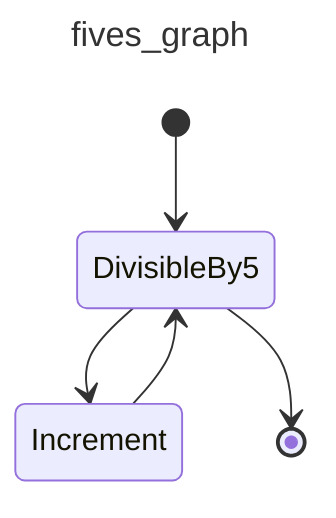
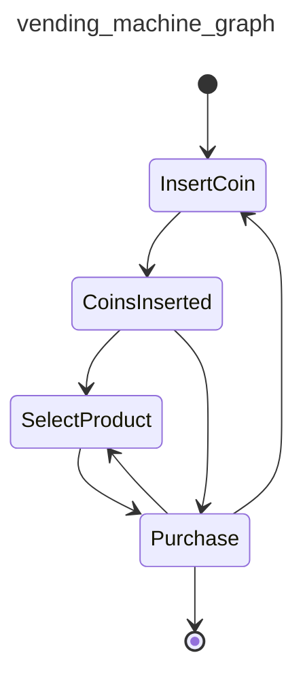
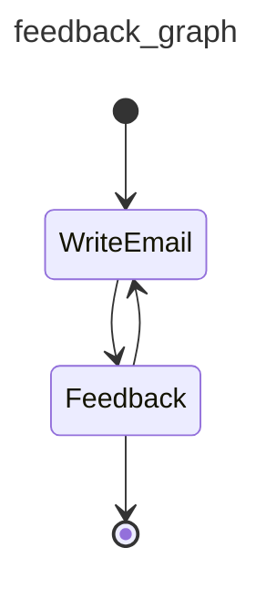
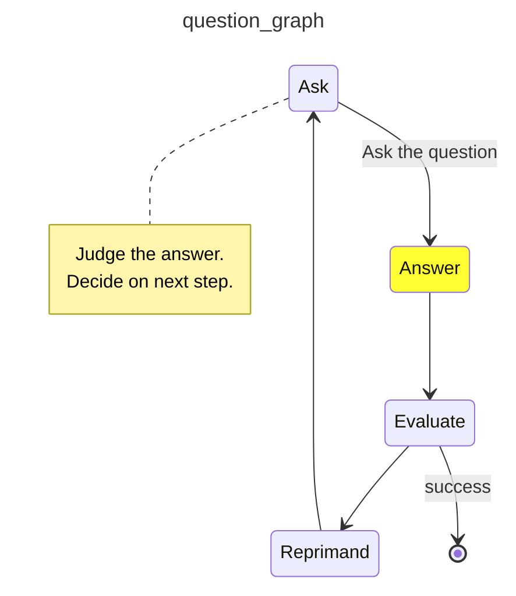
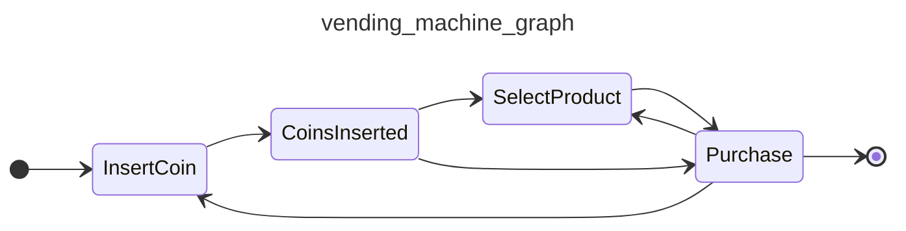
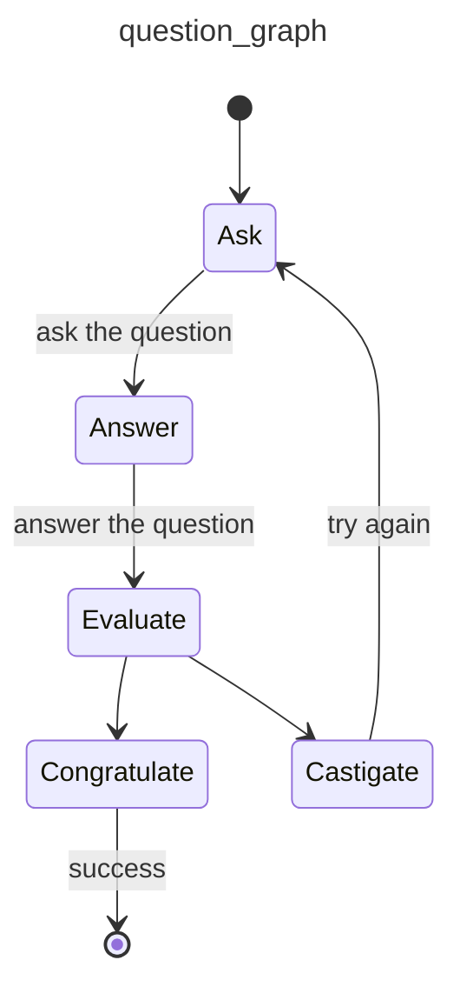
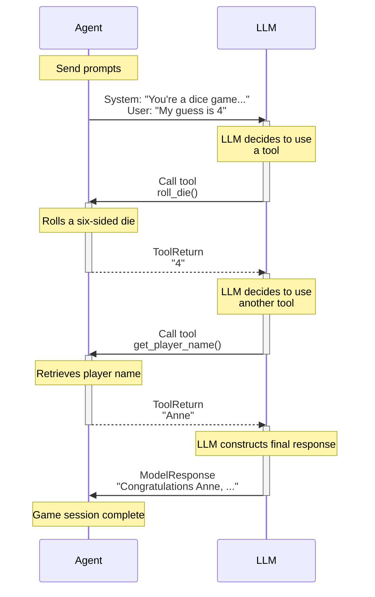

=== File: recipes/recipe_executor/build_component.json ===
{
  "steps": [
    {
      "type": "read_file",
      "path": "recipes/recipe_executor/specs{{component_path}}/{{component_id}}.md",
      "artifact": "spec"
    },
    {
      "type": "read_file",
      "path": "recipes/recipe_executor/docs{{component_path}}/{{component_id}}.md",
      "artifact": "usage_doc",
      "optional": true
    },
    {
      "type": "execute_recipe",
      "recipe_path": "recipes/codebase_generator/generate_code.json",
      "context_overrides": {
        "model": "openai:o3-mini",
        "output_root": "output",
        "output_path": "recipe_executor{{component_path}}",
        "language": "python",
        "spec": "{{spec}}",
        "usage_doc": "{{usage_doc}}",
        "existing_code": "{{existing_code}}",
        "additional_content": "{{additional_content}}"
      }
    }
  ]
}


=== File: recipes/recipe_executor/create.json ===
{
  "steps": [
    {
      "type": "execute_recipe",
      "recipe_path": "recipes/recipe_executor/recipes/context_create.json"
    },
    {
      "type": "execute_recipe",
      "recipe_path": "recipes/recipe_executor/recipes/logger_create.json"
    },
    {
      "type": "execute_recipe",
      "recipe_path": "recipes/recipe_executor/recipes/models_create.json"
    },
    {
      "type": "execute_recipe",
      "recipe_path": "recipes/recipe_executor/recipes/utils_create.json"
    },
    {
      "type": "execute_recipe",
      "recipe_path": "recipes/recipe_executor/recipes/llm_create.json"
    },
    {
      "type": "execute_recipe",
      "recipe_path": "recipes/recipe_executor/recipes/steps/create.json"
    },
    {
      "type": "execute_recipe",
      "recipe_path": "recipes/recipe_executor/recipes/executor_create.json"
    },
    {
      "type": "execute_recipe",
      "recipe_path": "recipes/recipe_executor/recipes/main_create.json"
    }
  ]
}


=== File: recipes/recipe_executor/docs/context.md ===
# Context Component Usage

## Importing

```python
from recipe_executor.context import Context
```

## Initialization

The Context can be initialized with optional artifacts and configuration:

```python
# Method signature
def __init__(self, artifacts: Optional[Dict[str, Any]] = None, config: Optional[Dict[str, Any]] = None) -> None:
    """
    Initialize the Context with optional artifacts and configuration.

    Args:
        artifacts: Initial artifacts to store
        config: Configuration values
    """
```

Examples:

```python
# Empty context
context = Context()

# With initial artifacts
context = Context(artifacts={"spec": "specification content"})

# With configuration
context = Context(config={"output_dir": "./output"})

# With both
context = Context(
    artifacts={"spec": "specification content"},
    config={"output_dir": "./output"}
)
```

## Core API

### Storing Values

```python
def __setitem__(self, key: str, value: Any) -> None:
    """Dictionary-like setting of artifacts."""
    self._artifacts[key] = value

# Usage example
context["key"] = value
```

### Retrieving Values

```python
def __getitem__(self, key: str) -> Any:
    """Dictionary-like access to artifacts."""
    if key not in self._artifacts:
        raise KeyError(f"Artifact with key '{key}' does not exist.")
    return self._artifacts[key]

def get(self, key: str, default: Optional[Any] = None) -> Any:
    """Get an artifact with an optional default value."""
    return self._artifacts.get(key, default)

# Usage examples
value = context["key"]  # Raises KeyError if not found
value = context.get("key", default=None)  # Returns default if not found
```

### Checking Keys

```python
def __contains__(self, key: str) -> bool:
    """Check if a key exists in artifacts."""
    return key in self._artifacts

# Usage example
if "key" in context:
    # Key exists
    pass
```

### Iteration

```python
def __iter__(self) -> Iterator[str]:
    """Iterate over artifact keys."""
    return iter(self._artifacts)

def keys(self) -> Iterator[str]:
    """Return an iterator over the keys of artifacts."""
    return iter(self._artifacts.keys())

def __len__(self) -> int:
    """Return the number of artifacts."""
    return len(self._artifacts)

# Usage examples
for key in context:
    value = context[key]
    print(f"{key}: {value}")

# Get number of artifacts
num_artifacts = len(context)
```

### Getting All Values

```python
def as_dict(self) -> Dict[str, Any]:
    """Return a copy of the artifacts as a dictionary to ensure immutability."""
    return self._artifacts.copy()

# Usage example
all_artifacts = context.as_dict()
```

### Accessing Configuration

```python
# Configuration is accessed via the config attribute
# Type: Dict[str, Any]

# Usage example
output_dir = context.config.get("output_dir", "./default")
```

## Integration with Steps

Steps receive the context in their `execute` method:

```python
def execute(self, context: Context) -> None:
    # Read from context
    input_value = context.get("input", "default")

    # Process...
    result = process(input_value)

    # Store in context
    context["output"] = result
```

## Important Notes

1. Context is mutable and shared between steps
2. Values can be of any type
3. Configuration is read-only in typical usage (but not enforced)
4. Step authors should document keys they read/write
5. Context provides no thread safety - it's designed for sequential execution


=== File: recipes/recipe_executor/docs/executor.md ===
# Executor Component Usage

## Importing

```python
from recipe_executor.executor import RecipeExecutor
```

## Basic Usage

The RecipeExecutor has a single primary method: `execute()`. This method loads and runs a recipe with a given context:

```python
# Method signature
def execute(
    self,
    recipe: Union[str, Dict[str, Any], List[Dict[str, Any]]],
    context: Context,
    logger: Optional[logging.Logger] = None
) -> None:
    """
    Execute a recipe with the given context.

    Args:
        recipe: Recipe to execute, can be a file path, JSON string, or dict
        context: Context instance to use for execution
        logger: Optional logger to use, creates a default one if not provided

    Raises:
        ValueError: If recipe format is invalid or step execution fails
        TypeError: If recipe type is not supported
    """
```

Examples:

```python
# Create context and executor
context = Context()
executor = RecipeExecutor()

# Execute a recipe from a file
executor.execute("path/to/recipe.json", context)

# Or from a JSON string
json_string = '{"steps": [{"type": "read_file", "path": "example.txt", "artifact": "content"}]}'
executor.execute(json_string, context)

# Or from a dictionary
recipe_dict: Dict[str, List[Dict[str, Any]]] = {
    "steps": [
        {"type": "read_file", "path": "example.txt", "artifact": "content"}
    ]
}
executor.execute(recipe_dict, context)
```

## Recipe Formats

The executor supports three recipe input formats:

### 1. File Path

```python
# JSON file
executor.execute("recipes/my_recipe.json", context)

# Markdown file with JSON code block
executor.execute("recipes/my_recipe.md", context)
```

### 2. JSON String

```python
json_string = '''
{
  "steps": [
    {
      "type": "read_file",
      "path": "input.txt",
      "artifact": "input_content"
    },
    {
      "type": "generate",
      "prompt": "Generate based on: {{input_content}}",
      "model": "openai:o3-mini",
      "artifact": "generation_result"
    }
  ]
}
'''
executor.execute(json_string, context)
```

### 3. Dictionary

```python
recipe: Dict[str, List[Dict[str, Any]]] = {
    "steps": [
        {
            "type": "read_file",
            "path": "input.txt",
            "artifact": "input_content"
        }
    ]
}
executor.execute(recipe, context)
```

## Custom Logging

You can provide a custom logger to the executor:

```python
import logging

logger = logging.getLogger("my_custom_logger")
logger.setLevel(logging.DEBUG)

executor.execute(recipe, context, logger=logger)
```

## Error Handling

The executor provides detailed error messages:

```python
try:
    executor.execute(recipe, context)
except ValueError as e:
    print(f"Recipe execution failed: {e}")
except TypeError as e:
    print(f"Unsupported recipe type: {e}")
```

## Integration with Steps

The executor uses the Step Registry to instantiate steps based on their type:

```python
# Each step in a recipe must have a "type" field:
step: Dict[str, Any] = {
    "type": "read_file",  # Must match a key in STEP_REGISTRY
    "path": "input.txt",
    "artifact": "content"
}
```

Steps are looked up in the STEP_REGISTRY by their type name:

```python
# Simplified example of what happens inside the executor
from recipe_executor.steps.registry import STEP_REGISTRY

step_type = step["type"]
step_class = STEP_REGISTRY[step_type]
step_instance = step_class(step, logger)
step_instance.execute(context)
```

## Important Notes

1. Recipes must contain valid steps with "type" fields
2. All step types must be registered in the STEP_REGISTRY before use
3. Each step receives the same context object
4. Execution is sequential by default


=== File: recipes/recipe_executor/docs/llm.md ===
# LLM Component Usage

## Importing

```python
from recipe_executor.llm import get_model, get_agent, call_llm
```

## Basic Usage

The LLM component provides three main functions:

### 1. Getting a Model

```python
def get_model(model_id: str) -> Any:
    """
    Initialize an LLM model based on a standardized model_id string.
    Expected format: 'provider:model_name'.

    Args:
        model_id (str): Model identifier in format 'provider:model_name'.
                        Example: 'openai:o3-mini', 'anthropic:claude-3.7-sonnet-latest'.

    Returns:
        The model instance for the specified provider and model.

    Raises:
        ValueError: If model_id format is invalid or if the provider is unsupported.
    """
```

Usage example:

```python
# Get an OpenAI model
openai_model = get_model("openai:o3-mini")

# Get an Anthropic model
anthropic_model = get_model("anthropic:claude-3.7-sonnet-latest")

# Get a Gemini model
gemini_model = get_model("gemini:gemini-pro")
```

### 2. Creating an Agent

```python
def get_agent(model_id: Optional[str] = None) -> Agent[None, FileGenerationResult]:
    """
    Initialize an LLM agent with the specified model.

    Args:
        model_id (Optional[str]): Model identifier in format 'provider:model_name'.
                                 If None, defaults to 'openai:gpt-4o'.

    Returns:
        Agent[None, FileGenerationResult]: A configured Agent ready to process LLM requests.
    """
```

Usage example:

```python
# Get default agent (openai:gpt-4o)
default_agent = get_agent()

# Get agent with specific model
custom_agent = get_agent(model_id="anthropic:claude-3-sonnet")
```

### 3. Calling an LLM

```python
def call_llm(prompt: str, model: Optional[str] = None) -> FileGenerationResult:
    """
    Call the LLM with the given prompt and return a structured FileGenerationResult.

    Args:
        prompt (str): The prompt string to be sent to the LLM.
        model (Optional[str]): The model identifier in the format 'provider:model_name'.
        If None, defaults to 'openai:gpt-4o'.

    Returns:
        FileGenerationResult: The structured result containing generated files and commentary.

    Raises:
        Exception: If LLM call fails or result validation fails.
    """
```

Usage example:

```python
# Call LLM with default model
result = call_llm("Generate a Python utility module for handling dates.")

# Call with specific model
result = call_llm(
    prompt="Create a React component for a user profile page.",
    model="openai:o3-mini"
)

# Access generated files
for file in result.files:
    print(f"File: {file.path}")
    print(file.content)

# Access commentary
if result.commentary:
    print(f"Commentary: {result.commentary}")
```

## Model ID Format

The component uses a standardized model identifier format:

```
provider:model_name
```

Supported providers:

- `openai`: OpenAI models (e.g., `openai:gpt-4o`, `openai:o3-mini`)
- `anthropic`: Anthropic models (e.g., `anthropic:claude-3.7-sonnet-latest`)
- `gemini`: Google Gemini models (e.g., `gemini:gemini-pro`)

## System Prompt

The agent is configured with a system prompt that instructs the LLM to generate a JSON object with:

1. A `files` array containing file objects with `path` and `content` properties
2. An optional `commentary` field with additional information

This ensures consistent output structure regardless of the model used.

## Error Handling

Example of error handling:

```python
try:
    result = call_llm(prompt, model_id)
    # Process result
except ValueError as e:
    # Handle invalid model ID or format
    print(f"Invalid model configuration: {e}")
except Exception as e:
    # Handle other errors (network, API, etc.)
    print(f"LLM call failed: {e}")
```

## Integration with Steps

The LLM component is primarily used by the GenerateWithLLMStep:

```python
# Example from GenerateWithLLMStep.execute()
def execute(self, context: Context) -> None:
    rendered_prompt = render_template(self.config.prompt, context)
    rendered_model = render_template(self.config.model, context)

    response = call_llm(rendered_prompt, rendered_model)

    artifact_key = render_template(self.config.artifact, context)
    context[artifact_key] = response
```

## Important Notes

1. Calling a model incurs API costs with the respective provider
2. OpenAI is the default provider if none is specified
3. The component logs request details at debug level
4. Responses are validated against the FileGenerationResult model
5. The agent is configured with 3 retries by default


=== File: recipes/recipe_executor/docs/logger.md ===
# Logger Component Usage

## Importing

```python
from recipe_executor.logger import init_logger
```

## Initialization

The Logger component provides a single function to initialize a configured logger:

```python
def init_logger(log_dir: str = "logs") -> logging.Logger:
    """
    Initializes a logger that writes to stdout and to log files (debug/info/error).
    Clears existing logs on each run.

    Args:
        log_dir (str): Directory to store log files. Default is "logs".

    Returns:
        logging.Logger: Configured logger instance.

    Raises:
        Exception: If log directory cannot be created or log files cannot be opened.
    """
```

Examples:

```python
# Default usage
logger = init_logger()

# With custom log directory
logger = init_logger(log_dir="custom/log/path")
```

## Log Levels

The configured logger supports standard Python logging levels:

```python
# Debug level (to debug.log file and higher level logs)
logger.debug("Detailed information for diagnosing problems")

# Info level (to console, info.log, and error.log)
logger.info("Confirmation that things are working as expected")

# Warning level (to console, info.log, and error.log)
logger.warning("An indication that something unexpected happened")

# Error level (to console, info.log, and error.log)
logger.error("Due to a more serious problem, the software could not perform a function")

# Critical level (to all logs)
logger.critical("A serious error indicating the program itself may be unable to continue running")
```

## Log Files

The logger creates three log files:

1. `debug.log` - All messages (DEBUG and above)
2. `info.log` - INFO messages and above
3. `error.log` - ERROR messages and above

Example:

```
2025-03-30 15:42:38,927 [INFO] Starting Recipe Executor Tool
2025-03-30 15:42:38,928 [DEBUG] Initializing executor
2025-03-30 15:42:38,930 [INFO] Executing recipe: recipes/my_recipe.json
2025-03-30 15:42:38,935 [ERROR] Recipe execution failed: Invalid step type
```

## Console Output

The logger also writes INFO level and above messages to stdout:

```python
# This appears in both console and log files
logger.info("Executing step 1 of 5")

# This appears in log files only
logger.debug("Step config: {'path': 'input.txt', 'artifact': 'content'}")
```

## Integration with Other Components

The logger is typically initialized in the main component and passed to the executor:

```python
from recipe_executor.logger import init_logger
from recipe_executor.executor import RecipeExecutor

logger = init_logger(log_dir="logs")
executor = RecipeExecutor()
executor.execute(recipe_path, context, logger=logger)
```

Steps receive the logger in their constructor:

```python
class ReadFileStep(BaseStep):
    def __init__(self, config: dict, logger: Optional[logging.Logger] = None):
        self.logger = logger or logging.getLogger("RecipeExecutor")
        # ...
```

## Important Notes

1. Logs are cleared (truncated) on each run
2. Debug logs can get large with detailed information
3. The log directory is created if it doesn't exist
4. The logger name "RecipeExecutor" is consistent across the system


=== File: recipes/recipe_executor/docs/main.md ===
# Main Component Usage

## Command-Line Interface

The Recipe Executor is used from the command line like this:

```bash
# Basic usage
python -m recipe_executor.main recipes/my_recipe.json

# With custom log directory
python -m recipe_executor.main recipes/my_recipe.json --log-dir custom_logs

# With context values
python -m recipe_executor.main recipes/my_recipe.json --context key1=value1 --context key2=value2
```

## Command-Line Arguments

The Main component supports these arguments:

1. `recipe_path` (required positional): Path to the recipe file to execute
2. `--log-dir` (optional): Directory for log files (default: "logs")
3. `--context` (optional, multiple): Context values as key=value pairs

## Context Parsing

The Main component parses context values from the command line:

```python
def parse_context(context_args: List[str]) -> Dict[str, Any]:
    """
    Parse context key=value pairs from the CLI arguments.

    Args:
        context_args: List of context arguments as key=value strings.

    Returns:
        A dictionary with key-value pairs parsed from the arguments.

    Raises:
        ValueError: If any argument does not follow key=value format.
    """
```

For example:

```bash
# These arguments:
--context name=John --context age=30 --context active=true

# Will create this context:
{
    "name": "John",
    "age": "30",
    "active": "true"
}
```

## Main Execution Flow

The main function serves as the entry point:

```python
def main() -> None:
    """
    CLI entry point for the Recipe Executor Tool.

    Parses command-line arguments, sets up logging, creates the context, and runs the recipe executor.
    """
```

Implementation details:

```python
def main() -> None:
    """
    CLI entry point for the Recipe Executor Tool.

    Parses command-line arguments, sets up logging, creates the context, and runs the recipe executor.
    """
    # Parse command-line arguments
    parser = argparse.ArgumentParser(
        description="Recipe Executor Tool - Executes a recipe with additional context information."
    )
    parser.add_argument("recipe_path", help="Path to the recipe file to execute.")
    parser.add_argument("--log-dir", default="logs", help="Directory for log files (default: logs)")
    parser.add_argument("--context", action="append", default=[], help="Additional context values as key=value pairs")
    args = parser.parse_args()

    # Parse context key=value pairs
    try:
        cli_context = parse_context(args.context) if args.context else {}
    except ValueError as e:
        sys.stderr.write(f"Context Error: {str(e)}\n")
        sys.exit(1)

    # Initialize logging
    logger = init_logger(args.log_dir)
    logger.info("Starting Recipe Executor Tool")

    # Create the Context object with CLI-supplied artifacts
    context = Context(artifacts=cli_context)

    try:
        # Execute the recipe
        executor = RecipeExecutor()
        executor.execute(args.recipe_path, context, logger=logger)
    except Exception as e:
        logger.error(f"An error occurred during recipe execution: {str(e)}", exc_info=True)
        sys.exit(1)
```

## Programmatic Usage

While typically used as a command-line tool, the Main component can be used programmatically:

```python
from recipe_executor.main import parse_context
from recipe_executor.context import Context
from recipe_executor.executor import RecipeExecutor
from recipe_executor.logger import init_logger

# Parse context from strings
context_args = ["name=Project", "version=1.0"]
context_dict = parse_context(context_args)

# Initialize logger
logger = init_logger("logs")

# Create context and execute recipe
context = Context(artifacts=context_dict)
executor = RecipeExecutor()
executor.execute("recipes/my_recipe.json", context, logger=logger)
```

## Exit Codes

The Main component uses these exit codes:

- `0`: Successful execution
- `1`: Error during execution (parsing errors, missing files, execution failures)

## Error Messages

Error messages are written to stderr and the log files:

```python
# Context parsing error
sys.stderr.write(f"Context Error: {str(e)}\n")

# Recipe execution error
logger.error(f"An error occurred during recipe execution: {str(e)}", exc_info=True)
```

## Important Notes

1. The recipe path must point to a valid recipe file
2. Context values from the command line are stored as strings
3. Logs are written to the specified log directory
4. All steps in the recipe share the same context
5. The executable exits with non-zero status on error


=== File: recipes/recipe_executor/docs/models.md ===
# Models Component Usage

## Importing

```python
from recipe_executor.models import (
    FileSpec,
    FileGenerationResult,
    ReadFileConfig,
    GenerateCodeConfig,
    WriteFileConfig,
    RecipeStep,
    Recipe
)
```

## File Generation Models

### FileSpec

Represents a single file to be generated:

```python
class FileSpec(BaseModel):
    """Represents a single file to be generated.

    Attributes:
        path (str): Relative path where the file should be written.
        content (str): The content of the file.
    """

    path: str
    content: str
```

Usage example:

```python
file = FileSpec(
    path="src/utils.py",
    content="def hello_world():\n    print('Hello, world!')"
)

# Access properties
print(file.path)      # src/utils.py
print(file.content)   # def hello_world():...
```

### FileGenerationResult

Contains a collection of generated files and optional commentary:

```python
class FileGenerationResult(BaseModel):
    """Result of an LLM file generation request.

    Attributes:
        files (List[FileSpec]): List of files to generate.
        commentary (Optional[str]): Optional commentary from the LLM.
    """

    files: List[FileSpec]
    commentary: Optional[str] = None
```

Usage example:

```python
result = FileGenerationResult(
    files=[
        FileSpec(path="src/utils.py", content="def util_function():\n    pass"),
        FileSpec(path="src/main.py", content="from utils import util_function")
    ],
    commentary="Generated utility module and main script"
)

# Iterate through files
for file in result.files:
    print(f"Writing to {file.path}")
    # ... write file.content to file.path
```

## Step Configuration Models

### ReadFileConfig

Configuration for a ReadFile step:

```python
class ReadFileConfig(BaseModel):
    """Configuration for a ReadFile step.

    Attributes:
        file_path (str): The path of the file to read.
        store_key (str): Key under which to store the file content. Defaults to "spec".
    """

    file_path: str
    store_key: str = "spec"
```

Usage example:

```python
config = ReadFileConfig(
    file_path="specs/component_spec.md",
    store_key="component_spec"
)

# Use in a step definition
step = {
    "type": "read_file",
    "file_path": config.file_path,
    "store_key": config.store_key
}
```

### GenerateCodeConfig

Configuration for a GenerateCode step:

```python
class GenerateCodeConfig(BaseModel):
    """Configuration for a GenerateCode step.

    Attributes:
        input_key (str): Key in context where the specification is stored. Defaults to "spec".
        output_key (str): Key to store the generated code result. Defaults to "codegen_result".
    """

    input_key: str = "spec"
    output_key: str = "codegen_result"
```

### WriteFileConfig

Configuration for a WriteFile step:

```python
class WriteFileConfig(BaseModel):
    """Configuration for a WriteFile step.

    Attributes:
        input_key (str): Key in context where the codegen result is stored. Defaults to "codegen_result".
        output_root (str): Root directory where files will be written.
    """

    input_key: str = "codegen_result"
    output_root: str
```

## Recipe Models

### RecipeStep

Represents a single step in a recipe:

```python
class RecipeStep(BaseModel):
    """A single step in a recipe.

    Attributes:
        type (str): The type of the recipe step.
        config (Dict): Dictionary containing configuration for the step.
    """

    type: str
    config: Dict
```

### Recipe

Represents a complete recipe with multiple steps:

```python
class Recipe(BaseModel):
    """A complete recipe with multiple steps.

    Attributes:
        steps (List[RecipeStep]): A list containing the steps of the recipe.
    """

    steps: List[RecipeStep]
```

Usage example:

```python
from recipe_executor.models import Recipe, RecipeStep

# Create a recipe with steps
recipe = Recipe(
    steps=[
        RecipeStep(
            type="read_file",
            config={"file_path": "specs/component_spec.md", "store_key": "spec"}
        ),
        RecipeStep(
            type="generate",
            config={
                "prompt": "Generate code for: {{spec}}",
                "model": "openai:o3-mini",
                "artifact": "code_result"
            }
        ),
        RecipeStep(
            type="write_file",
            config={"artifact": "code_result", "root": "./output"}
        )
    ]
)

# Validate recipe structure
recipe_dict = recipe.dict()
```

## Model Validation

All models inherit from Pydantic's BaseModel, providing automatic validation:

```python
# This will raise a validation error because path is required
try:
    FileSpec(content="File content")
except Exception as e:
    print(f"Validation error: {e}")

# This works correctly
valid_file = FileSpec(path="file.txt", content="File content")
```

## Important Notes

1. Models provide runtime validation in addition to static type checking
2. Default values are provided for common configuration options
3. Models can be converted to dictionaries with `.dict()` method
4. Models can be created from dictionaries with `Model(**dict_data)`


=== File: recipes/recipe_executor/docs/steps/base.md ===
# Steps Base Component Usage

## Importing

```python
from recipe_executor.steps.base import BaseStep, StepConfig
```

## Basic Structure

The Steps Base component provides two primary classes:

1. `StepConfig` - Base class for step configuration
2. `BaseStep` - Abstract base class for step implementations

These classes are designed to work together using generics for type safety.

## Step Configuration

All step configurations extend the `StepConfig` base class:

```python
class StepConfig(BaseModel):
    """Base class for all step configs. Extend this in each step."""
    pass

# Type variable for generic configuration types
ConfigType = TypeVar("ConfigType", bound=StepConfig)
```

Example of extending StepConfig:

```python
class ReadFileConfig(StepConfig):
    """Configuration for ReadFileStep"""
    path: str
    artifact: str
    encoding: str = "utf-8"  # With default value
```

## Base Step Class

The BaseStep is an abstract generic class parameterized by the config type:

```python
class BaseStep(Generic[ConfigType]):
    """
    Base class for all steps. Subclasses must implement `execute(context)`.
    Each step receives a config object and a logger.

    Args:
        config (ConfigType): Configuration for the step
        logger (Optional[logging.Logger]): Logger instance, defaults to "RecipeExecutor"
    """

    def __init__(self, config: ConfigType, logger: Optional[logging.Logger] = None) -> None:
        self.config: ConfigType = config
        self.logger = logger or logging.getLogger("RecipeExecutor")

    def execute(self, context: Context) -> None:
        """
        Execute the step with the given context.

        Args:
            context (Context): Context for execution

        Raises:
            NotImplementedError: If subclass doesn't implement this method
        """
        raise NotImplementedError("Each step must implement the `execute()` method.")
```

## Implementing a Step

To implement a concrete step, create a class that:

1. Extends BaseStep with a specific config type
2. Implements the execute method
3. Takes a dictionary of configuration values in the constructor

Example:

```python
class ExampleStep(BaseStep[ExampleConfig]):
    """Example step implementation."""

    def __init__(self, config: dict, logger=None):
        # Convert dict to the appropriate config type
        super().__init__(ExampleConfig(**config), logger)

    def execute(self, context: Context) -> None:
        # Implementation specific to this step
        self.logger.info("Executing example step")

        # Access configuration values
        value = self.config.some_field

        # Do something with the context
        context["result"] = f"Processed {value}"
```

## Step Registration

All step implementations should be registered in the step registry:

```python
from recipe_executor.steps.registry import STEP_REGISTRY

# Register the step type
STEP_REGISTRY["example_step"] = ExampleStep
```

## Handling Configuration

The base step handles configuration conversion automatically:

```python
# Step configuration in a recipe
step_config = {
    "type": "example_step",
    "some_field": "value",
    "another_field": 42
}

# In the executor
step_class = STEP_REGISTRY[step_config["type"]]
step_instance = step_class(step_config, logger)

# Configuration is validated through Pydantic
# Access in the step through self.config
```

## Logging

All steps receive a logger in their constructor:

```python
def __init__(self, config: dict, logger=None):
    # If logger is None, it defaults to logging.getLogger("RecipeExecutor")
    super().__init__(ExampleConfig(**config), logger)

def execute(self, context: Context) -> None:
    # Use the logger for various levels
    self.logger.debug("Detailed debug information")
    self.logger.info("Step execution started")
    self.logger.warning("Potential issue detected")
    self.logger.error("Error occurred during execution")
```

## Important Notes

1. All step implementations must inherit from BaseStep
2. The execute method must be implemented by all subclasses
3. Steps should validate their configuration using Pydantic models
4. Steps receive and modify a shared Context object
5. Steps should use the logger for appropriate messages


=== File: recipes/recipe_executor/docs/steps/execute_recipe.md ===
# ExecuteRecipeStep Component Usage

## Importing

```python
from recipe_executor.steps.execute_recipe import ExecuteRecipeStep, ExecuteRecipeConfig
```

## Configuration

The ExecuteRecipeStep is configured with an ExecuteRecipeConfig:

```python
class ExecuteRecipeConfig(StepConfig):
    """Config for ExecuteRecipeStep.

    Fields:
        recipe_path: Path to the recipe to execute.
        context_overrides: Optional values to override in the context.
    """

    recipe_path: str
    context_overrides: Dict[str, str] = {}
```

## Step Registration

The ExecuteRecipeStep is typically registered in the steps package:

```python
from recipe_executor.steps.registry import STEP_REGISTRY
from recipe_executor.steps.execute_recipe import ExecuteRecipeStep

STEP_REGISTRY["execute_recipe"] = ExecuteRecipeStep
```

## Basic Usage in Recipes

The ExecuteRecipeStep can be used in recipes like this:

```json
{
  "steps": [
    {
      "type": "execute_recipe",
      "recipe_path": "recipes/sub_recipe.json"
    }
  ]
}
```

## Context Overrides

You can override specific context values for the sub-recipe execution:

```json
{
  "steps": [
    {
      "type": "execute_recipe",
      "recipe_path": "recipes/generate_component.json",
      "context_overrides": {
        "component_name": "Utils",
        "output_dir": "output/components/utils"
      }
    }
  ]
}
```

## Template-Based Values

Both the recipe path and context overrides can include template variables:

```json
{
  "steps": [
    {
      "type": "execute_recipe",
      "recipe_path": "recipes/{{recipe_type}}/{{component_id}}.json",
      "context_overrides": {
        "component_name": "{{component_display_name}}",
        "output_dir": "output/components/{{component_id}}"
      }
    }
  ]
}
```

## Recipe Composition

Sub-recipes can be composed to create more complex workflows:

```json
{
  "steps": [
    {
      "type": "read_file",
      "path": "specs/project_spec.md",
      "artifact": "project_spec"
    },
    {
      "type": "execute_recipe",
      "recipe_path": "recipes/parse_project.json",
      "context_overrides": {
        "spec": "{{project_spec}}"
      }
    },
    {
      "type": "execute_recipe",
      "recipe_path": "recipes/generate_components.json"
    },
    {
      "type": "execute_recipe",
      "recipe_path": "recipes/assemble_project.json"
    }
  ]
}
```

## Implementation Details

The ExecuteRecipeStep works by:

1. Rendering the recipe path with the current context
2. Applying context overrides (also rendered with the current context)
3. Creating a RecipeExecutor instance
4. Executing the sub-recipe with the modified context

```python
def execute(self, context: Context) -> None:
    # Merge any context overrides into the current context
    if hasattr(self.config, "context_overrides") and self.config.context_overrides:
        for key, value in self.config.context_overrides.items():
            context[key] = render_template(value, context)

    # Render the recipe path
    recipe_path = render_template(self.config.recipe_path, context)

    # Verify recipe exists
    if not os.path.exists(recipe_path):
        raise FileNotFoundError(f"Sub-recipe file not found: {recipe_path}")

    # Log sub-recipe execution
    self.logger.info(f"Executing sub-recipe: {recipe_path}")

    # Execute the sub-recipe
    executor = RecipeExecutor()
    executor.execute(recipe=recipe_path, context=context, logger=self.logger)

    # Log completion
    self.logger.info(f"Completed sub-recipe: {recipe_path}")
```

## Error Handling

The ExecuteRecipeStep can raise several types of errors:

```python
try:
    execute_recipe_step.execute(context)
except FileNotFoundError as e:
    # Sub-recipe file not found
    print(f"File error: {e}")
except ValueError as e:
    # Recipe format or execution errors
    print(f"Recipe error: {e}")
```

## Common Use Cases

1. **Component Generation**:

   ```json
   {
     "type": "execute_recipe",
     "recipe_path": "recipes/generate_component.json",
     "context_overrides": {
       "component_id": "utils",
       "component_name": "Utils Component"
     }
   }
   ```

2. **Template-Based Recipes**:

   ```json
   {
     "type": "execute_recipe",
     "recipe_path": "recipes/component_template.json",
     "context_overrides": {
       "template_type": "create",
       "component_id": "{{component_id}}"
     }
   }
   ```

3. **Multi-Step Workflows**:
   ```json
   {
     "type": "execute_recipe",
     "recipe_path": "recipes/workflow/{{workflow_name}}.json"
   }
   ```

## Important Notes

1. The sub-recipe receives the same context object as the parent recipe
2. Context overrides are applied before sub-recipe execution
3. Changes made to the context by the sub-recipe persist after it completes
4. Template variables in both recipe_path and context_overrides are resolved before execution
5. Sub-recipes can execute their own sub-recipes (nested execution)


=== File: recipes/recipe_executor/docs/steps/generate_llm.md ===
# GenerateWithLLMStep Component Usage

## Importing

```python
from recipe_executor.steps.generate_llm import GenerateWithLLMStep, GenerateLLMConfig
```

## Configuration

The GenerateWithLLMStep is configured with a GenerateLLMConfig:

```python
class GenerateLLMConfig(StepConfig):
    """
    Config for GenerateWithLLMStep.

    Fields:
        prompt: The prompt to send to the LLM (templated beforehand).
        model: The model identifier to use (provider:model_name format).
        artifact: The name under which to store the LLM response in context.
    """

    prompt: str
    model: str
    artifact: str
```

## Step Registration

The GenerateWithLLMStep is typically registered in the steps package:

```python
from recipe_executor.steps.registry import STEP_REGISTRY
from recipe_executor.steps.generate_llm import GenerateWithLLMStep

STEP_REGISTRY["generate"] = GenerateWithLLMStep
```

## Basic Usage in Recipes

The GenerateWithLLMStep can be used in recipes like this:

```json
{
  "steps": [
    {
      "type": "generate",
      "prompt": "Generate Python code for a utility that: {{requirements}}",
      "model": "openai:o3-mini",
      "artifact": "generation_result"
    }
  ]
}
```

## Template-Based Prompts

The prompt can include template variables from the context:

```json
{
  "steps": [
    {
      "type": "read_file",
      "path": "specs/component_spec.md",
      "artifact": "spec"
    },
    {
      "type": "generate",
      "prompt": "You are an expert Python developer. Based on the following specification, generate code for a component:\n\n{{spec}}",
      "model": "openai:o3-mini",
      "artifact": "codegen_result"
    }
  ]
}
```

## Dynamic Model Selection

The model identifier can also use template variables:

```json
{
  "steps": [
    {
      "type": "generate",
      "prompt": "Generate code based on: {{spec}}",
      "model": "{{model_provider|default:'openai'}}:{{model_name|default:'o3-mini'}}",
      "artifact": "codegen_result"
    }
  ]
}
```

## Dynamic Artifact Keys

The artifact key can be templated to create dynamic storage locations:

```json
{
  "steps": [
    {
      "type": "generate",
      "prompt": "Generate code for: {{component_name}}",
      "model": "openai:o3-mini",
      "artifact": "{{component_name}}_result"
    }
  ]
}
```

## Implementation Details

The GenerateWithLLMStep works by:

1. Rendering the prompt with the current context
2. Rendering the model identifier
3. Rendering the artifact key (if it contains templates)
4. Calling the LLM with the rendered prompt and model
5. Storing the result in the context under the artifact key

```python
def execute(self, context: Context) -> None:
    # Process the artifact key using templating if needed
    artifact_key = self.config.artifact
    if "{{" in artifact_key and "}}" in artifact_key:
        artifact_key = render_template(artifact_key, context)

    # Render the prompt and model with the current context
    rendered_prompt = render_template(self.config.prompt, context)
    rendered_model = render_template(self.config.model, context)

    # Call the LLM
    self.logger.info(f"Calling LLM with prompt for artifact: {artifact_key}")
    response = call_llm(rendered_prompt, rendered_model)

    # Store the LLM response in context
    context[artifact_key] = response
    self.logger.debug(f"LLM response stored in context under '{artifact_key}'")
```

## LLM Response Format

The response from call_llm is a FileGenerationResult object:

```python
# FileGenerationResult structure
result = FileGenerationResult(
    files=[
        FileSpec(path="src/main.py", content="print('Hello, world!')"),
        FileSpec(path="src/utils.py", content="def add(a, b):\n    return a + b")
    ],
    commentary="Generated a simple Python project"
)
```

## Error Handling

The GenerateWithLLMStep can raise several types of errors:

```python
try:
    generate_step.execute(context)
except ValueError as e:
    # Template rendering or model format errors
    print(f"Value error: {e}")
except RuntimeError as e:
    # LLM call failures
    print(f"Runtime error: {e}")
```

## Common Use Cases

1. **Code Generation**:

   ```json
   {
     "type": "generate",
     "prompt": "Generate Python code for: {{specification}}",
     "model": "openai:o3-mini",
     "artifact": "code_result"
   }
   ```

2. **Content Creation**:

   ```json
   {
     "type": "generate",
     "prompt": "Write a blog post about: {{topic}}",
     "model": "anthropic:claude-3-haiku",
     "artifact": "blog_post"
   }
   ```

3. **Analysis and Transformation**:
   ```json
   {
     "type": "generate",
     "prompt": "Analyze this code and suggest improvements:\n\n{{code}}",
     "model": "openai:gpt-4o",
     "artifact": "code_analysis"
   }
   ```

## Important Notes

1. The artifact key can be dynamic using template variables
2. The prompt is rendered using the current context before sending to the LLM
3. The model identifier follows the format "provider:model_name"
4. The LLM response is a FileGenerationResult object with files and commentary
5. LLM calls may incur costs with the respective provider


=== File: recipes/recipe_executor/docs/steps/read_file.md ===
# ReadFileStep Component Usage

## Importing

```python
from recipe_executor.steps.read_file import ReadFileStep, ReadFileConfig
```

## Configuration

The ReadFileStep is configured with a ReadFileConfig:

```python
class ReadFileConfig(StepConfig):
    """
    Configuration for ReadFileStep.

    Fields:
        path (str): Path to the file to read (may be templated).
        artifact (str): Name to store the file contents in context.
        optional (bool): Whether to continue if the file is not found.
    """

    path: str
    artifact: str
    optional: bool = False
```

## Step Registration

The ReadFileStep is typically registered in the steps package:

```python
from recipe_executor.steps.registry import STEP_REGISTRY
from recipe_executor.steps.read_file import ReadFileStep

STEP_REGISTRY["read_file"] = ReadFileStep
```

## Basic Usage in Recipes

The ReadFileStep can be used in recipes like this:

```json
{
  "steps": [
    {
      "type": "read_file",
      "path": "specs/component_spec.md",
      "artifact": "component_spec"
    }
  ]
}
```

## Template-Based Paths

The path can include template variables from the context:

```json
{
  "steps": [
    {
      "type": "read_file",
      "path": "specs/{{component_id}}_spec.md",
      "artifact": "component_spec"
    }
  ]
}
```

## Optional Files

You can specify that a file is optional, and execution will continue even if the file doesn't exist:

```json
{
  "steps": [
    {
      "type": "read_file",
      "path": "specs/optional_file.md",
      "artifact": "optional_content",
      "optional": true
    }
  ]
}
```

If an optional file is not found, an empty string is stored in the context.

## Implementation Details

The ReadFileStep works by:

1. Resolving the path using template rendering
2. Checking if the file exists
3. Reading the file content
4. Storing the content in the context

```python
def execute(self, context: Context) -> None:
    # Render the path using the current context
    path = render_template(self.config.path, context)

    # Check if file exists
    if not os.path.exists(path):
        if self.config.optional:
            self.logger.warning(f"Optional file not found at path: {path}, continuing anyway")
            context[self.config.artifact] = ""  # Set empty string for missing optional file
            return
        else:
            raise FileNotFoundError(f"ReadFileStep: file not found at path: {path}")

    # Read the file
    self.logger.info(f"Reading file from: {path}")
    with open(path, "r", encoding="utf-8") as f:
        content = f.read()

    # Store in context
    context[self.config.artifact] = content
    self.logger.debug(f"Stored file contents in context under key: '{self.config.artifact}'")
```

## Error Handling

If a file doesn't exist and is not marked as optional, the step will raise a FileNotFoundError:

```python
try:
    read_file_step.execute(context)
except FileNotFoundError as e:
    print(f"File error: {e}")
    # Handle the error
```

## Common Use Cases

1. **Loading Specifications**:

   ```json
   {
     "type": "read_file",
     "path": "specs/component_spec.md",
     "artifact": "spec"
   }
   ```

2. **Loading Templates**:

   ```json
   {
     "type": "read_file",
     "path": "templates/email_template.txt",
     "artifact": "email_template"
   }
   ```

3. **Dynamic Path Resolution**:
   ```json
   {
     "type": "read_file",
     "path": "docs/{{project}}/{{component}}.md",
     "artifact": "documentation"
   }
   ```

## Important Notes

1. The step uses UTF-8 encoding by default
2. The file content is stored as a string in the context
3. Template variables in the path are resolved before reading the file
4. When a file is optional and missing, an empty string is stored


=== File: recipes/recipe_executor/docs/steps/registry.md ===
# Step Registry Component Usage

## Importing

```python
from recipe_executor.steps.registry import STEP_REGISTRY
```

## Registry Structure

The registry is a simple dictionary that maps step type names to their implementation classes:

```python
# Type definition
from typing import Dict, Type
from recipe_executor.steps.base import BaseStep

# Structure of STEP_REGISTRY
STEP_REGISTRY: Dict[str, Type[BaseStep]] = {
    "read_file": ReadFileStep,
    "write_file": WriteFileStep,
    "generate": GenerateWithLLMStep,
    "execute_recipe": ExecuteRecipeStep
}
```

## Registering Steps

Steps are typically registered in the steps package `__init__.py`:

```python
# In recipe_executor/steps/__init__.py
from recipe_executor.steps.registry import STEP_REGISTRY
from recipe_executor.steps.read_file import ReadFileStep
from recipe_executor.steps.write_files import WriteFileStep
from recipe_executor.steps.generate_llm import GenerateWithLLMStep
from recipe_executor.steps.execute_recipe import ExecuteRecipeStep

# Register steps by updating the registry
STEP_REGISTRY.update({
    "read_file": ReadFileStep,
    "write_file": WriteFileStep,
    "generate": GenerateWithLLMStep,
    "execute_recipe": ExecuteRecipeStep
})
```

Custom steps can be registered in the same way:

```python
from recipe_executor.steps.registry import STEP_REGISTRY
from recipe_executor.steps.base import BaseStep
from my_custom_steps import CustomStep

# Register a custom step implementation
STEP_REGISTRY["custom_step"] = CustomStep
```

## Looking Up Steps

The executor uses the registry to look up step classes by type:

```python
# Example of registry usage in executor
from typing import Dict, Any
import logging
from recipe_executor.context import Context
from recipe_executor.steps.registry import STEP_REGISTRY

def execute_step(step: Dict[str, Any], context: Context, logger: logging.Logger) -> None:
    step_type = step["type"]
    if step_type not in STEP_REGISTRY:
        raise ValueError(f"Unknown step type '{step_type}'")

    step_class = STEP_REGISTRY[step_type]
    step_instance = step_class(step, logger)
    step_instance.execute(context)
```

## Important Notes

1. Step type names must be unique across the entire system
2. Steps must be registered before the executor tries to use them
3. Standard steps are automatically registered when the package is imported
4. Custom steps need to be explicitly registered by the user


=== File: recipes/recipe_executor/docs/steps/write_files.md ===
# WriteFileStep Component Usage

## Importing

```python
from recipe_executor.steps.write_files import WriteFileStep, WriteFilesConfig
```

## Configuration

The WriteFileStep is configured with a WriteFilesConfig:

```python
class WriteFilesConfig(StepConfig):
    """
    Config for WriteFileStep.

    Fields:
        artifact: Name of the context key holding a FileGenerationResult or List[FileSpec].
        root: Optional base path to prepend to all output file paths.
    """

    artifact: str
    root: str = "."
```

## Step Registration

The WriteFileStep is typically registered in the steps package:

```python
from recipe_executor.steps.registry import STEP_REGISTRY
from recipe_executor.steps.write_files import WriteFileStep

STEP_REGISTRY["write_file"] = WriteFileStep
```

## Basic Usage in Recipes

The WriteFileStep can be used in recipes like this:

```json
{
  "steps": [
    {
      "type": "write_file",
      "artifact": "generated_code",
      "root": "output/project"
    }
  ]
}
```

## Supported Context Values

The WriteFileStep can work with two types of artifacts in the context:

### 1. FileGenerationResult

```python
from recipe_executor.models import FileGenerationResult, FileSpec

# Example of generating a FileGenerationResult
result = FileGenerationResult(
    files=[
        FileSpec(path="src/main.py", content="print('Hello, world!')"),
        FileSpec(path="src/utils.py", content="def add(a, b):\n    return a + b")
    ],
    commentary="Generated a simple Python project"
)

# Store in context
context["generated_code"] = result
```

### 2. List of FileSpec objects

```python
from recipe_executor.models import FileSpec

# Example of generating a list of FileSpec objects
files = [
    FileSpec(path="src/main.py", content="print('Hello, world!')"),
    FileSpec(path="src/utils.py", content="def add(a, b):\n    return a + b")
]

# Store in context
context["generated_files"] = files
```

## Using Template Variables

The root path and individual file paths can include template variables:

```json
{
  "steps": [
    {
      "type": "write_file",
      "artifact": "generated_code",
      "root": "output/{{project_name}}"
    }
  ]
}
```

File paths within the FileSpec objects can also contain templates:

```python
FileSpec(
    path="{{component_name}}/{{filename}}.py",
    content="# Generated code for {{component_name}}"
)
```

## Implementation Details

The WriteFileStep works by:

1. Retrieving the artifact from the context
2. Validating it's a FileGenerationResult or list of FileSpec objects
3. Rendering the root path using template rendering
4. For each file:
   - Rendering the file path
   - Creating the necessary directories
   - Writing the file content

```python
def execute(self, context: Context) -> None:
    # Get data from context
    data = context.get(self.config.artifact)

    if data is None:
        raise ValueError(f"No artifact found at key: {self.config.artifact}")

    # Determine file list
    if isinstance(data, FileGenerationResult):
        files = data.files
    elif isinstance(data, list) and all(isinstance(f, FileSpec) for f in data):
        files = data
    else:
        raise TypeError("Expected FileGenerationResult or list of FileSpec objects")

    # Render output root
    output_root = render_template(self.config.root, context)

    # Write each file
    for file in files:
        rel_path = render_template(file.path, context)
        full_path = os.path.join(output_root, rel_path)

        # Create directories
        os.makedirs(os.path.dirname(full_path), exist_ok=True)

        # Write file
        with open(full_path, "w", encoding="utf-8") as f:
            f.write(file.content)

        self.logger.info(f"Wrote file: {full_path}")
```

## Error Handling

The WriteFileStep can raise several types of errors:

```python
try:
    write_step.execute(context)
except ValueError as e:
    # Missing or invalid artifact
    print(f"Value error: {e}")
except TypeError as e:
    # Unexpected artifact type
    print(f"Type error: {e}")
except IOError as e:
    # File writing errors
    print(f"I/O error: {e}")
```

## Common Use Cases

1. **Writing Generated Code**:

   ```json
   {
     "type": "write_file",
     "artifact": "generated_code",
     "root": "output/src"
   }
   ```

2. **Project-Specific Output**:

   ```json
   {
     "type": "write_file",
     "artifact": "project_files",
     "root": "output/{{project_name}}"
   }
   ```

3. **Component Generation**:
   ```json
   {
     "type": "write_file",
     "artifact": "component_result",
     "root": "output/components"
   }
   ```

## Important Notes

1. Directories are created automatically if they don't exist
2. Files are overwritten without confirmation if they already exist
3. All paths are rendered using template variables from the context
4. File content is written using UTF-8 encoding
5. Both FileGenerationResult and List[FileSpec] formats are supported


=== File: recipes/recipe_executor/docs/utils.md ===
# Utils Component Usage

## Importing

```python
from recipe_executor.utils import render_template
```

## Template Rendering

The Utils component provides a `render_template` function that renders Liquid templates using values from the Context:

```python
def render_template(text: str, context: Context) -> str:
    """
    Render the given text as a Liquid template using the provided context.
    All values in the context are converted to strings before rendering.

    Args:
        text (str): The template text to render.
        context (Context): The context for rendering the template.

    Returns:
        str: The rendered text.

    Raises:
        ValueError: If there is an error during template rendering.
    """
```

Basic usage example:

```python
from recipe_executor.context import Context
from recipe_executor.utils import render_template

# Create a context with values
context = Context(artifacts={"name": "World", "count": 42})

# Render a template
template = "Hello, {{name}}! You have {{count}} messages."
result = render_template(template, context)

print(result)  # Hello, World! You have 42 messages.
```

## Template Syntax

The template rendering uses Liquid syntax:

### Variable Substitution

```python
# Simple variable
template = "User: {{username}}"

# Nested paths (if context contains dictionaries)
template = "Author: {{book.author}}"
```

### Conditionals

```python
template = "Users: {{user_count}}No users"
```

### Loops

```python
template = "Item: {{item}}"
```

## Type Handling

All values from the context are converted to strings before rendering:

```python
# Context with mixed types
context = Context(artifacts={
    "number": 42,
    "boolean": True,
    "list": [1, 2, 3],
    "dict": {"key": "value"}
})

# All values become strings in templates
template = "Number: {{number}}, Boolean: {{boolean}}, List: {{list}}, Dict: {{dict}}"
# Renders as: "Number: 42, Boolean: True, List: [1, 2, 3], Dict: {'key': 'value'}"
```

## Error Handling

Template rendering errors are wrapped in a ValueError:

```python
try:
    result = render_template("", context)
except ValueError as e:
    print(f"Template error: {e}")
    # Handle the error
```

## Common Usage Patterns

### In Step Classes

The primary use of template rendering is in step execution:

```python
# Example from ReadFileStep.execute()
def execute(self, context: Context) -> None:
    # Render the path using the current context
    path = render_template(self.config.path, context)

    # Read the file at the rendered path
    with open(path, "r", encoding="utf-8") as f:
        content = f.read()

    # Store in context (with rendered artifact key if needed)
    artifact_key = render_template(self.config.artifact, context)
    context[artifact_key] = content
```

### In Recipe Steps

Templates are typically used in recipe step configurations:

```json
{
  "steps": [
    {
      "type": "read_file",
      "path": "specs/{{component_id}}_spec.md",
      "artifact": "component_spec"
    },
    {
      "type": "generate",
      "prompt": "Generate code based on: {{component_spec}}",
      "model": "{{model_id|default:'openai:o3-mini'}}",
      "artifact": "generated_code"
    }
  ]
}
```

## Important Notes

1. All context values are converted to strings, which may affect formatting
2. Template rendering is synchronous and blocking
3. The Context's `as_dict()` method is used to access all artifacts
4. Empty or missing variables will be replaced with an empty string


=== File: recipes/recipe_executor/edit.json ===
{
  "steps": [
    {
      "type": "execute_recipe",
      "recipe_path": "recipes/recipe_executor/recipes/context_edit.json"
    },
    {
      "type": "execute_recipe",
      "recipe_path": "recipes/recipe_executor/recipes/logger_edit.json"
    },
    {
      "type": "execute_recipe",
      "recipe_path": "recipes/recipe_executor/recipes/models_edit.json"
    },
    {
      "type": "execute_recipe",
      "recipe_path": "recipes/recipe_executor/recipes/utils_edit.json"
    },
    {
      "type": "execute_recipe",
      "recipe_path": "recipes/recipe_executor/recipes/llm_edit.json"
    },
    {
      "type": "execute_recipe",
      "recipe_path": "recipes/recipe_executor/recipes/steps/edit.json"
    },
    {
      "type": "execute_recipe",
      "recipe_path": "recipes/recipe_executor/recipes/executor_edit.json"
    },
    {
      "type": "execute_recipe",
      "recipe_path": "recipes/recipe_executor/recipes/main_edit.json"
    }
  ]
}


=== File: recipes/recipe_executor/includes/PYDANTIC_AI_DOCS.md ===
=== File: docs/pydantic-ai/agents.md ===

## Introduction

Agents are PydanticAI's primary interface for interacting with LLMs.

In some use cases a single Agent will control an entire application or component,
but multiple agents can also interact to embody more complex workflows.

The [`Agent`][pydantic_ai.Agent] class has full API documentation, but conceptually you can think of an agent as a container for:

| **Component**                                 | **Description**                                                                                           |
| --------------------------------------------- | --------------------------------------------------------------------------------------------------------- |
| [System prompt(s)](#system-prompts)           | A set of instructions for the LLM written by the developer.                                               |
| [Function tool(s)](tools.md)                  | Functions that the LLM may call to get information while generating a response.                           |
| [Structured result type](results.md)          | The structured datatype the LLM must return at the end of a run, if specified.                            |
| [Dependency type constraint](dependencies.md) | System prompt functions, tools, and result validators may all use dependencies when they're run.          |
| [LLM model](api/models/base.md)               | Optional default LLM model associated with the agent. Can also be specified when running the agent.       |
| [Model Settings](#additional-configuration)   | Optional default model settings to help fine tune requests. Can also be specified when running the agent. |

In typing terms, agents are generic in their dependency and result types, e.g., an agent which required dependencies of type `#!python Foobar` and returned results of type `#!python list[str]` would have type `Agent[Foobar, list[str]]`. In practice, you shouldn't need to care about this, it should just mean your IDE can tell you when you have the right type, and if you choose to use [static type checking](#static-type-checking) it should work well with PydanticAI.

Here's a toy example of an agent that simulates a roulette wheel:

```python {title="roulette_wheel.py"}
from pydantic_ai import Agent, RunContext

roulette_agent = Agent(  # (1)!
    'openai:gpt-4o',
    deps_type=int,
    result_type=bool,
    system_prompt=(
        'Use the `roulette_wheel` function to see if the '
        'customer has won based on the number they provide.'
    ),
)


@roulette_agent.tool
async def roulette_wheel(ctx: RunContext[int], square: int) -> str:  # (2)!
    """check if the square is a winner"""
    return 'winner' if square == ctx.deps else 'loser'


# Run the agent
success_number = 18  # (3)!
result = roulette_agent.run_sync('Put my money on square eighteen', deps=success_number)
print(result.data)  # (4)!
#> True

result = roulette_agent.run_sync('I bet five is the winner', deps=success_number)
print(result.data)
#> False
```

1. Create an agent, which expects an integer dependency and returns a boolean result. This agent will have type `#!python Agent[int, bool]`.
2. Define a tool that checks if the square is a winner. Here [`RunContext`][pydantic_ai.tools.RunContext] is parameterized with the dependency type `int`; if you got the dependency type wrong you'd get a typing error.
3. In reality, you might want to use a random number here e.g. `random.randint(0, 36)`.
4. `result.data` will be a boolean indicating if the square is a winner. Pydantic performs the result validation, it'll be typed as a `bool` since its type is derived from the `result_type` generic parameter of the agent.

!!! tip "Agents are designed for reuse, like FastAPI Apps"
Agents are intended to be instantiated once (frequently as module globals) and reused throughout your application, similar to a small [FastAPI][fastapi.FastAPI] app or an [APIRouter][fastapi.APIRouter].

## Running Agents

There are four ways to run an agent:

1. [`agent.run()`][pydantic_ai.Agent.run]  a coroutine which returns a [`RunResult`][pydantic_ai.agent.AgentRunResult] containing a completed response.
2. [`agent.run_sync()`][pydantic_ai.Agent.run_sync]  a plain, synchronous function which returns a [`RunResult`][pydantic_ai.agent.AgentRunResult] containing a completed response (internally, this just calls `loop.run_until_complete(self.run())`).
3. [`agent.run_stream()`][pydantic_ai.Agent.run_stream]  a coroutine which returns a [`StreamedRunResult`][pydantic_ai.result.StreamedRunResult], which contains methods to stream a response as an async iterable.
4. [`agent.iter()`][pydantic_ai.Agent.iter]  a context manager which returns an [`AgentRun`][pydantic_ai.agent.AgentRun], an async-iterable over the nodes of the agent's underlying [`Graph`][pydantic_graph.graph.Graph].

Here's a simple example demonstrating the first three:

```python {title="run_agent.py"}
from pydantic_ai import Agent

agent = Agent('openai:gpt-4o')

result_sync = agent.run_sync('What is the capital of Italy?')
print(result_sync.data)
#> Rome


async def main():
    result = await agent.run('What is the capital of France?')
    print(result.data)
    #> Paris

    async with agent.run_stream('What is the capital of the UK?') as response:
        print(await response.get_data())
        #> London
```

_(This example is complete, it can be run "as is"  you'll need to add `asyncio.run(main())` to run `main`)_

You can also pass messages from previous runs to continue a conversation or provide context, as described in [Messages and Chat History](message-history.md).

### Iterating Over an Agent's Graph

Under the hood, each `Agent` in PydanticAI uses **pydantic-graph** to manage its execution flow. **pydantic-graph** is a generic, type-centric library for building and running finite state machines in Python. It doesn't actually depend on PydanticAI  you can use it standalone for workflows that have nothing to do with GenAI  but PydanticAI makes use of it to orchestrate the handling of model requests and model responses in an agent's run.

In many scenarios, you don't need to worry about pydantic-graph at all; calling `agent.run(...)` simply traverses the underlying graph from start to finish. However, if you need deeper insight or control  for example to capture each tool invocation, or to inject your own logic at specific stages  PydanticAI exposes the lower-level iteration process via [`Agent.iter`][pydantic_ai.Agent.iter]. This method returns an [`AgentRun`][pydantic_ai.agent.AgentRun], which you can async-iterate over, or manually drive node-by-node via the [`next`][pydantic_ai.agent.AgentRun.next] method. Once the agent's graph returns an [`End`][pydantic_graph.nodes.End], you have the final result along with a detailed history of all steps.

#### `async for` iteration

Here's an example of using `async for` with `iter` to record each node the agent executes:

```python {title="agent_iter_async_for.py"}
from pydantic_ai import Agent

agent = Agent('openai:gpt-4o')


async def main():
    nodes = []
    # Begin an AgentRun, which is an async-iterable over the nodes of the agent's graph
    async with agent.iter('What is the capital of France?') as agent_run:
        async for node in agent_run:
            # Each node represents a step in the agent's execution
            nodes.append(node)
    print(nodes)
    """
    [
        ModelRequestNode(
            request=ModelRequest(
                parts=[
                    UserPromptPart(
                        content='What is the capital of France?',
                        timestamp=datetime.datetime(...),
                        part_kind='user-prompt',
                    )
                ],
                kind='request',
            )
        ),
        CallToolsNode(
            model_response=ModelResponse(
                parts=[TextPart(content='Paris', part_kind='text')],
                model_name='gpt-4o',
                timestamp=datetime.datetime(...),
                kind='response',
            )
        ),
        End(data=FinalResult(data='Paris', tool_name=None, tool_call_id=None)),
    ]
    """
    print(agent_run.result.data)
    #> Paris
```

- The `AgentRun` is an async iterator that yields each node (`BaseNode` or `End`) in the flow.
- The run ends when an `End` node is returned.

#### Using `.next(...)` manually

You can also drive the iteration manually by passing the node you want to run next to the `AgentRun.next(...)` method. This allows you to inspect or modify the node before it executes or skip nodes based on your own logic, and to catch errors in `next()` more easily:

```python {title="agent_iter_next.py"}
from pydantic_ai import Agent
from pydantic_graph import End

agent = Agent('openai:gpt-4o')


async def main():
    async with agent.iter('What is the capital of France?') as agent_run:
        node = agent_run.next_node  # (1)!

        all_nodes = [node]

        # Drive the iteration manually:
        while not isinstance(node, End):  # (2)!
            node = await agent_run.next(node)  # (3)!
            all_nodes.append(node)  # (4)!

        print(all_nodes)
        """
        [
            UserPromptNode(
                user_prompt='What is the capital of France?',
                system_prompts=(),
                system_prompt_functions=[],
                system_prompt_dynamic_functions={},
            ),
            ModelRequestNode(
                request=ModelRequest(
                    parts=[
                        UserPromptPart(
                            content='What is the capital of France?',
                            timestamp=datetime.datetime(...),
                            part_kind='user-prompt',
                        )
                    ],
                    kind='request',
                )
            ),
            CallToolsNode(
                model_response=ModelResponse(
                    parts=[TextPart(content='Paris', part_kind='text')],
                    model_name='gpt-4o',
                    timestamp=datetime.datetime(...),
                    kind='response',
                )
            ),
            End(data=FinalResult(data='Paris', tool_name=None, tool_call_id=None)),
        ]
        """
```

1. We start by grabbing the first node that will be run in the agent's graph.
2. The agent run is finished once an `End` node has been produced; instances of `End` cannot be passed to `next`.
3. When you call `await agent_run.next(node)`, it executes that node in the agent's graph, updates the run's history, and returns the _next_ node to run.
4. You could also inspect or mutate the new `node` here as needed.

#### Accessing usage and the final result

You can retrieve usage statistics (tokens, requests, etc.) at any time from the [`AgentRun`][pydantic_ai.agent.AgentRun] object via `agent_run.usage()`. This method returns a [`Usage`][pydantic_ai.usage.Usage] object containing the usage data.

Once the run finishes, `agent_run.final_result` becomes a [`AgentRunResult`][pydantic_ai.agent.AgentRunResult] object containing the final output (and related metadata).

---

### Streaming

Here is an example of streaming an agent run in combination with `async for` iteration:

```python {title="streaming.py"}
import asyncio
from dataclasses import dataclass
from datetime import date

from pydantic_ai import Agent
from pydantic_ai.messages import (
    FinalResultEvent,
    FunctionToolCallEvent,
    FunctionToolResultEvent,
    PartDeltaEvent,
    PartStartEvent,
    TextPartDelta,
    ToolCallPartDelta,
)
from pydantic_ai.tools import RunContext


@dataclass
class WeatherService:
    async def get_forecast(self, location: str, forecast_date: date) -> str:
        # In real code: call weather API, DB queries, etc.
        return f'The forecast in {location} on {forecast_date} is 24C and sunny.'

    async def get_historic_weather(self, location: str, forecast_date: date) -> str:
        # In real code: call a historical weather API or DB
        return (
            f'The weather in {location} on {forecast_date} was 18C and partly cloudy.'
        )


weather_agent = Agent[WeatherService, str](
    'openai:gpt-4o',
    deps_type=WeatherService,
    result_type=str,  # We'll produce a final answer as plain text
    system_prompt='Providing a weather forecast at the locations the user provides.',
)


@weather_agent.tool
async def weather_forecast(
    ctx: RunContext[WeatherService],
    location: str,
    forecast_date: date,
) -> str:
    if forecast_date >= date.today():
        return await ctx.deps.get_forecast(location, forecast_date)
    else:
        return await ctx.deps.get_historic_weather(location, forecast_date)


output_messages: list[str] = []


async def main():
    user_prompt = 'What will the weather be like in Paris on Tuesday?'

    # Begin a node-by-node, streaming iteration
    async with weather_agent.iter(user_prompt, deps=WeatherService()) as run:
        async for node in run:
            if Agent.is_user_prompt_node(node):
                # A user prompt node => The user has provided input
                output_messages.append(f'=== UserPromptNode: {node.user_prompt} ===')
            elif Agent.is_model_request_node(node):
                # A model request node => We can stream tokens from the model's request
                output_messages.append(
                    '=== ModelRequestNode: streaming partial request tokens ==='
                )
                async with node.stream(run.ctx) as request_stream:
                    async for event in request_stream:
                        if isinstance(event, PartStartEvent):
                            output_messages.append(
                                f'[Request] Starting part {event.index}: {event.part!r}'
                            )
                        elif isinstance(event, PartDeltaEvent):
                            if isinstance(event.delta, TextPartDelta):
                                output_messages.append(
                                    f'[Request] Part {event.index} text delta: {event.delta.content_delta!r}'
                                )
                            elif isinstance(event.delta, ToolCallPartDelta):
                                output_messages.append(
                                    f'[Request] Part {event.index} args_delta={event.delta.args_delta}'
                                )
                        elif isinstance(event, FinalResultEvent):
                            output_messages.append(
                                f'[Result] The model produced a final result (tool_name={event.tool_name})'
                            )
            elif Agent.is_call_tools_node(node):
                # A handle-response node => The model returned some data, potentially calls a tool
                output_messages.append(
                    '=== CallToolsNode: streaming partial response & tool usage ==='
                )
                async with node.stream(run.ctx) as handle_stream:
                    async for event in handle_stream:
                        if isinstance(event, FunctionToolCallEvent):
                            output_messages.append(
                                f'[Tools] The LLM calls tool={event.part.tool_name!r} with args={event.part.args} (tool_call_id={event.part.tool_call_id!r})'
                            )
                        elif isinstance(event, FunctionToolResultEvent):
                            output_messages.append(
                                f'[Tools] Tool call {event.tool_call_id!r} returned => {event.result.content}'
                            )
            elif Agent.is_end_node(node):
                assert run.result.data == node.data.data
                # Once an End node is reached, the agent run is complete
                output_messages.append(f'=== Final Agent Output: {run.result.data} ===')


if __name__ == '__main__':
    asyncio.run(main())

    print(output_messages)
    """
    [
        '=== ModelRequestNode: streaming partial request tokens ===',
        '[Request] Starting part 0: ToolCallPart(tool_name=\'weather_forecast\', args=\'{"location":"Pa\', tool_call_id=\'0001\', part_kind=\'tool-call\')',
        '[Request] Part 0 args_delta=ris","forecast_',
        '[Request] Part 0 args_delta=date":"2030-01-',
        '[Request] Part 0 args_delta=01"}',
        '=== CallToolsNode: streaming partial response & tool usage ===',
        '[Tools] The LLM calls tool=\'weather_forecast\' with args={"location":"Paris","forecast_date":"2030-01-01"} (tool_call_id=\'0001\')',
        "[Tools] Tool call '0001' returned => The forecast in Paris on 2030-01-01 is 24C and sunny.",
        '=== ModelRequestNode: streaming partial request tokens ===',
        "[Request] Starting part 0: TextPart(content='It will be ', part_kind='text')",
        '[Result] The model produced a final result (tool_name=None)',
        "[Request] Part 0 text delta: 'warm and sunny '",
        "[Request] Part 0 text delta: 'in Paris on '",
        "[Request] Part 0 text delta: 'Tuesday.'",
        '=== CallToolsNode: streaming partial response & tool usage ===',
        '=== Final Agent Output: It will be warm and sunny in Paris on Tuesday. ===',
    ]
    """
```

---

### Additional Configuration

#### Usage Limits

PydanticAI offers a [`UsageLimits`][pydantic_ai.usage.UsageLimits] structure to help you limit your
usage (tokens and/or requests) on model runs.

You can apply these settings by passing the `usage_limits` argument to the `run{_sync,_stream}` functions.

Consider the following example, where we limit the number of response tokens:

```py
from pydantic_ai import Agent
from pydantic_ai.exceptions import UsageLimitExceeded
from pydantic_ai.usage import UsageLimits

agent = Agent('anthropic:claude-3-5-sonnet-latest')

result_sync = agent.run_sync(
    'What is the capital of Italy? Answer with just the city.',
    usage_limits=UsageLimits(response_tokens_limit=10),
)
print(result_sync.data)
#> Rome
print(result_sync.usage())
"""
Usage(requests=1, request_tokens=62, response_tokens=1, total_tokens=63, details=None)
"""

try:
    result_sync = agent.run_sync(
        'What is the capital of Italy? Answer with a paragraph.',
        usage_limits=UsageLimits(response_tokens_limit=10),
    )
except UsageLimitExceeded as e:
    print(e)
    #> Exceeded the response_tokens_limit of 10 (response_tokens=32)
```

Restricting the number of requests can be useful in preventing infinite loops or excessive tool calling:

```py
from typing_extensions import TypedDict

from pydantic_ai import Agent, ModelRetry
from pydantic_ai.exceptions import UsageLimitExceeded
from pydantic_ai.usage import UsageLimits


class NeverResultType(TypedDict):
    """
    Never ever coerce data to this type.
    """

    never_use_this: str


agent = Agent(
    'anthropic:claude-3-5-sonnet-latest',
    retries=3,
    result_type=NeverResultType,
    system_prompt='Any time you get a response, call the `infinite_retry_tool` to produce another response.',
)


@agent.tool_plain(retries=5)  # (1)!
def infinite_retry_tool() -> int:
    raise ModelRetry('Please try again.')


try:
    result_sync = agent.run_sync(
        'Begin infinite retry loop!', usage_limits=UsageLimits(request_limit=3)  # (2)!
    )
except UsageLimitExceeded as e:
    print(e)
    #> The next request would exceed the request_limit of 3
```

1. This tool has the ability to retry 5 times before erroring, simulating a tool that might get stuck in a loop.
2. This run will error after 3 requests, preventing the infinite tool calling.

!!! note
This is especially relevant if you've registered many tools. The `request_limit` can be used to prevent the model from calling them in a loop too many times.

#### Model (Run) Settings

PydanticAI offers a [`settings.ModelSettings`][pydantic_ai.settings.ModelSettings] structure to help you fine tune your requests.
This structure allows you to configure common parameters that influence the model's behavior, such as `temperature`, `max_tokens`,
`timeout`, and more.

There are two ways to apply these settings:

1. Passing to `run{_sync,_stream}` functions via the `model_settings` argument. This allows for fine-tuning on a per-request basis.
2. Setting during [`Agent`][pydantic_ai.agent.Agent] initialization via the `model_settings` argument. These settings will be applied by default to all subsequent run calls using said agent. However, `model_settings` provided during a specific run call will override the agent's default settings.

For example, if you'd like to set the `temperature` setting to `0.0` to ensure less random behavior,
you can do the following:

```py
from pydantic_ai import Agent

agent = Agent('openai:gpt-4o')

result_sync = agent.run_sync(
    'What is the capital of Italy?', model_settings={'temperature': 0.0}
)
print(result_sync.data)
#> Rome
```

### Model specific settings

If you wish to further customize model behavior, you can use a subclass of [`ModelSettings`][pydantic_ai.settings.ModelSettings], like [`GeminiModelSettings`][pydantic_ai.models.gemini.GeminiModelSettings], associated with your model of choice.

For example:

```py
from pydantic_ai import Agent, UnexpectedModelBehavior
from pydantic_ai.models.gemini import GeminiModelSettings

agent = Agent('google-gla:gemini-1.5-flash')

try:
    result = agent.run_sync(
        'Write a list of 5 very rude things that I might say to the universe after stubbing my toe in the dark:',
        model_settings=GeminiModelSettings(
            temperature=0.0,  # general model settings can also be specified
            gemini_safety_settings=[
                {
                    'category': 'HARM_CATEGORY_HARASSMENT',
                    'threshold': 'BLOCK_LOW_AND_ABOVE',
                },
                {
                    'category': 'HARM_CATEGORY_HATE_SPEECH',
                    'threshold': 'BLOCK_LOW_AND_ABOVE',
                },
            ],
        ),
    )
except UnexpectedModelBehavior as e:
    print(e)  # (1)!
    """
    Safety settings triggered, body:
    <safety settings details>
    """
```

1. This error is raised because the safety thresholds were exceeded.
   Generally, `result` would contain a normal `ModelResponse`.

## Runs vs. Conversations

An agent **run** might represent an entire conversation  there's no limit to how many messages can be exchanged in a single run. However, a **conversation** might also be composed of multiple runs, especially if you need to maintain state between separate interactions or API calls.

Here's an example of a conversation comprised of multiple runs:

```python {title="conversation_example.py" hl_lines="13"}
from pydantic_ai import Agent

agent = Agent('openai:gpt-4o')

# First run
result1 = agent.run_sync('Who was Albert Einstein?')
print(result1.data)
#> Albert Einstein was a German-born theoretical physicist.

# Second run, passing previous messages
result2 = agent.run_sync(
    'What was his most famous equation?',
    message_history=result1.new_messages(),  # (1)!
)
print(result2.data)
#> Albert Einstein's most famous equation is (E = mc^2).
```

1. Continue the conversation; without `message_history` the model would not know who "his" was referring to.

_(This example is complete, it can be run "as is")_

## Type safe by design {#static-type-checking}

PydanticAI is designed to work well with static type checkers, like mypy and pyright.

!!! tip "Typing is (somewhat) optional"
PydanticAI is designed to make type checking as useful as possible for you if you choose to use it, but you don't have to use types everywhere all the time.

    That said, because PydanticAI uses Pydantic, and Pydantic uses type hints as the definition for schema and validation, some types (specifically type hints on parameters to tools, and the `result_type` arguments to [`Agent`][pydantic_ai.Agent]) are used at runtime.

    We (the library developers) have messed up if type hints are confusing you more than helping you, if you find this, please create an [issue](https://github.com/pydantic/pydantic-ai/issues) explaining what's annoying you!

In particular, agents are generic in both the type of their dependencies and the type of results they return, so you can use the type hints to ensure you're using the right types.

Consider the following script with type mistakes:

```python {title="type_mistakes.py" hl_lines="18 28"}
from dataclasses import dataclass

from pydantic_ai import Agent, RunContext


@dataclass
class User:
    name: str


agent = Agent(
    'test',
    deps_type=User,  # (1)!
    result_type=bool,
)


@agent.system_prompt
def add_user_name(ctx: RunContext[str]) -> str:  # (2)!
    return f"The user's name is {ctx.deps}."


def foobar(x: bytes) -> None:
    pass


result = agent.run_sync('Does their name start with "A"?', deps=User('Anne'))
foobar(result.data)  # (3)!
```

1. The agent is defined as expecting an instance of `User` as `deps`.
2. But here `add_user_name` is defined as taking a `str` as the dependency, not a `User`.
3. Since the agent is defined as returning a `bool`, this will raise a type error since `foobar` expects `bytes`.

Running `mypy` on this will give the following output:

```bash
 uv run mypy type_mistakes.py
type_mistakes.py:18: error: Argument 1 to "system_prompt" of "Agent" has incompatible type "Callable[[RunContext[str]], str]"; expected "Callable[[RunContext[User]], str]"  [arg-type]
type_mistakes.py:28: error: Argument 1 to "foobar" has incompatible type "bool"; expected "bytes"  [arg-type]
Found 2 errors in 1 file (checked 1 source file)
```

Running `pyright` would identify the same issues.

## System Prompts

System prompts might seem simple at first glance since they're just strings (or sequences of strings that are concatenated), but crafting the right system prompt is key to getting the model to behave as you want.

Generally, system prompts fall into two categories:

1. **Static system prompts**: These are known when writing the code and can be defined via the `system_prompt` parameter of the [`Agent` constructor][pydantic_ai.Agent.__init__].
2. **Dynamic system prompts**: These depend in some way on context that isn't known until runtime, and should be defined via functions decorated with [`@agent.system_prompt`][pydantic_ai.Agent.system_prompt].

You can add both to a single agent; they're appended in the order they're defined at runtime.

Here's an example using both types of system prompts:

```python {title="system_prompts.py"}
from datetime import date

from pydantic_ai import Agent, RunContext

agent = Agent(
    'openai:gpt-4o',
    deps_type=str,  # (1)!
    system_prompt="Use the customer's name while replying to them.",  # (2)!
)


@agent.system_prompt  # (3)!
def add_the_users_name(ctx: RunContext[str]) -> str:
    return f"The user's name is {ctx.deps}."


@agent.system_prompt
def add_the_date() -> str:  # (4)!
    return f'The date is {date.today()}.'


result = agent.run_sync('What is the date?', deps='Frank')
print(result.data)
#> Hello Frank, the date today is 2032-01-02.
```

1. The agent expects a string dependency.
2. Static system prompt defined at agent creation time.
3. Dynamic system prompt defined via a decorator with [`RunContext`][pydantic_ai.tools.RunContext], this is called just after `run_sync`, not when the agent is created, so can benefit from runtime information like the dependencies used on that run.
4. Another dynamic system prompt, system prompts don't have to have the `RunContext` parameter.

_(This example is complete, it can be run "as is")_

## Reflection and self-correction

Validation errors from both function tool parameter validation and [structured result validation](results.md#structured-result-validation) can be passed back to the model with a request to retry.

You can also raise [`ModelRetry`][pydantic_ai.exceptions.ModelRetry] from within a [tool](tools.md) or [result validator function](results.md#result-validators-functions) to tell the model it should retry generating a response.

- The default retry count is **1** but can be altered for the [entire agent][pydantic_ai.Agent.__init__], a [specific tool][pydantic_ai.Agent.tool], or a [result validator][pydantic_ai.Agent.__init__].
- You can access the current retry count from within a tool or result validator via [`ctx.retry`][pydantic_ai.tools.RunContext].

Here's an example:

```python {title="tool_retry.py"}
from pydantic import BaseModel

from pydantic_ai import Agent, RunContext, ModelRetry

from fake_database import DatabaseConn


class ChatResult(BaseModel):
    user_id: int
    message: str


agent = Agent(
    'openai:gpt-4o',
    deps_type=DatabaseConn,
    result_type=ChatResult,
)


@agent.tool(retries=2)
def get_user_by_name(ctx: RunContext[DatabaseConn], name: str) -> int:
    """Get a user's ID from their full name."""
    print(name)
    #> John
    #> John Doe
    user_id = ctx.deps.users.get(name=name)
    if user_id is None:
        raise ModelRetry(
            f'No user found with name {name!r}, remember to provide their full name'
        )
    return user_id


result = agent.run_sync(
    'Send a message to John Doe asking for coffee next week', deps=DatabaseConn()
)
print(result.data)
"""
user_id=123 message='Hello John, would you be free for coffee sometime next week? Let me know what works for you!'
"""
```

## Model errors

If models behave unexpectedly (e.g., the retry limit is exceeded, or their API returns `503`), agent runs will raise [`UnexpectedModelBehavior`][pydantic_ai.exceptions.UnexpectedModelBehavior].

In these cases, [`capture_run_messages`][pydantic_ai.capture_run_messages] can be used to access the messages exchanged during the run to help diagnose the issue.

```python {title="agent_model_errors.py"}
from pydantic_ai import Agent, ModelRetry, UnexpectedModelBehavior, capture_run_messages

agent = Agent('openai:gpt-4o')


@agent.tool_plain
def calc_volume(size: int) -> int:  # (1)!
    if size == 42:
        return size**3
    else:
        raise ModelRetry('Please try again.')


with capture_run_messages() as messages:  # (2)!
    try:
        result = agent.run_sync('Please get me the volume of a box with size 6.')
    except UnexpectedModelBehavior as e:
        print('An error occurred:', e)
        #> An error occurred: Tool exceeded max retries count of 1
        print('cause:', repr(e.__cause__))
        #> cause: ModelRetry('Please try again.')
        print('messages:', messages)
        """
        messages:
        [
            ModelRequest(
                parts=[
                    UserPromptPart(
                        content='Please get me the volume of a box with size 6.',
                        timestamp=datetime.datetime(...),
                        part_kind='user-prompt',
                    )
                ],
                kind='request',
            ),
            ModelResponse(
                parts=[
                    ToolCallPart(
                        tool_name='calc_volume',
                        args={'size': 6},
                        tool_call_id=None,
                        part_kind='tool-call',
                    )
                ],
                model_name='gpt-4o',
                timestamp=datetime.datetime(...),
                kind='response',
            ),
            ModelRequest(
                parts=[
                    RetryPromptPart(
                        content='Please try again.',
                        tool_name='calc_volume',
                        tool_call_id=None,
                        timestamp=datetime.datetime(...),
                        part_kind='retry-prompt',
                    )
                ],
                kind='request',
            ),
            ModelResponse(
                parts=[
                    ToolCallPart(
                        tool_name='calc_volume',
                        args={'size': 6},
                        tool_call_id=None,
                        part_kind='tool-call',
                    )
                ],
                model_name='gpt-4o',
                timestamp=datetime.datetime(...),
                kind='response',
            ),
        ]
        """
    else:
        print(result.data)
```

1. Define a tool that will raise `ModelRetry` repeatedly in this case.
2. [`capture_run_messages`][pydantic_ai.capture_run_messages] is used to capture the messages exchanged during the run.

_(This example is complete, it can be run "as is")_

!!! note
If you call [`run`][pydantic_ai.Agent.run], [`run_sync`][pydantic_ai.Agent.run_sync], or [`run_stream`][pydantic_ai.Agent.run_stream] more than once within a single `capture_run_messages` context, `messages` will represent the messages exchanged during the first call only.

=== File: docs/pydantic-ai/chat-app.md ===

# Chat App with FastAPI

Simple chat app example build with FastAPI.

Demonstrates:

- [reusing chat history](../message-history.md)
- [serializing messages](../message-history.md#accessing-messages-from-results)
- [streaming responses](../results.md#streamed-results)

This demonstrates storing chat history between requests and using it to give the model context for new responses.

Most of the complex logic here is between `chat_app.py` which streams the response to the browser,
and `chat_app.ts` which renders messages in the browser.

## Running the Example

With [dependencies installed and environment variables set](./index.md#usage), run:

```bash
python/uv-run -m pydantic_ai_examples.chat_app
```

Then open the app at [localhost:8000](http://localhost:8000).


## Example Code

Python code that runs the chat app:

```python {title="chat_app.py"}
#! examples/pydantic_ai_examples/chat_app.py
```

Simple HTML page to render the app:

```html {title="chat_app.html"}
#! examples/pydantic_ai_examples/chat_app.html
```

TypeScript to handle rendering the messages, to keep this simple (and at the risk of offending frontend developers) the typescript code is passed to the browser as plain text and transpiled in the browser.

```ts {title="chat_app.ts"}
#! examples/pydantic_ai_examples/chat_app.ts
```

=== File: docs/pydantic-ai/common_tools.md ===

# Common Tools

PydanticAI ships with native tools that can be used to enhance your agent's capabilities.

## DuckDuckGo Search Tool

The DuckDuckGo search tool allows you to search the web for information. It is built on top of the
[DuckDuckGo API](https://github.com/deedy5/duckduckgo_search).

### Installation

To use [`duckduckgo_search_tool`][pydantic_ai.common_tools.duckduckgo.duckduckgo_search_tool], you need to install
[`pydantic-ai-slim`](install.md#slim-install) with the `duckduckgo` optional group:

```bash
pip/uv-add "pydantic-ai-slim[duckduckgo]"
```

### Usage

Here's an example of how you can use the DuckDuckGo search tool with an agent:

```py {title="main.py" test="skip"}
from pydantic_ai import Agent
from pydantic_ai.common_tools.duckduckgo import duckduckgo_search_tool

agent = Agent(
    'openai:o3-mini',
    tools=[duckduckgo_search_tool()],
    system_prompt='Search DuckDuckGo for the given query and return the results.',
)

result = agent.run_sync(
    'Can you list the top five highest-grossing animated films of 2025?'
)
print(result.data)
"""
I looked into several sources on animated boxoffice performance in 2025, and while detailed
rankings can shift as more money is tallied, multiple independent reports have already
highlighted a couple of recordbreaking shows. For example:

 Ne Zha 2  News outlets (Variety, Wikipedia's "List of animated feature films of 2025", and others)
    have reported that this Chinese title not only became the highestgrossing animated film of 2025
    but also broke records as the highestgrossing nonEnglish animated film ever. One article noted
    its run exceeded US$1.7 billion.
 Inside Out 2  According to data shared on Statista and in industry news, this Pixar sequel has been
    on pace to set new records (with some sources even noting it as the highestgrossing animated film
    ever, as of January 2025).

Beyond those two, some entertainment trade sites (for example, a Just Jared article titled
"Top 10 Highest-Earning Animated Films at the Box Office Revealed") have begun listing a broader
top10. Although full consolidated figures can sometimes differ by source and are updated daily during
a boxoffice run, many of the industry trackers have begun to single out five films as the biggest
earners so far in 2025.

Unfortunately, although multiple articles discuss the "top animated films" of 2025, there isn't yet a
single, universally accepted list with final numbers that names the complete top five. (Boxoffice
rankings, especially midyear, can be fluid as films continue to add to their totals.)

Based on what several sources note so far, the two undisputed leaders are:
1. Ne Zha 2
2. Inside Out 2

The remaining top spots (35) are reported by some outlets in their "Top10 Animated Films"
lists for 2025 but the titles and order can vary depending on the source and the exact cutoff
date of the data. For the most uptodate and detailed ranking (including the 3rd, 4th, and 5th
highestgrossing films), I recommend checking resources like:
 Wikipedia's "List of animated feature films of 2025" page
 Boxoffice tracking sites (such as Box Office Mojo or The Numbers)
 Trade articles like the one on Just Jared

To summarize with what is clear from the current reporting:
1. Ne Zha 2
2. Inside Out 2
35. Other animated films (yet to be definitively finalized across all reporting outlets)

If you're looking for a final, consensus list of the top five, it may be best to wait until
the 2025 yearend boxoffice tallies are in or to consult a regularly updated entertainment industry source.

Would you like help finding a current source or additional details on where to look for the complete updated list?
"""
```

## Tavily Search Tool

!!! info
Tavily is a paid service, but they have free credits to explore their product.

    You need to [sign up for an account](https://app.tavily.com/home) and get an API key to use the Tavily search tool.

The Tavily search tool allows you to search the web for information. It is built on top of the [Tavily API](https://tavily.com/).

### Installation

To use [`tavily_search_tool`][pydantic_ai.common_tools.tavily.tavily_search_tool], you need to install
[`pydantic-ai-slim`](install.md#slim-install) with the `tavily` optional group:

```bash
pip/uv-add "pydantic-ai-slim[tavily]"
```

### Usage

Here's an example of how you can use the Tavily search tool with an agent:

```py {title="main.py" test="skip"}
import os

from pydantic_ai.agent import Agent
from pydantic_ai.common_tools.tavily import tavily_search_tool

api_key = os.getenv('TAVILY_API_KEY')
assert api_key is not None


agent = Agent(
    'openai:o3-mini',
    tools=[tavily_search_tool(api_key)],
    system_prompt='Search Tavily for the given query and return the results.',
)

result = agent.run_sync('Tell me the top news in the GenAI world, give me links.')
print(result.data)
"""
Here are some of the top recent news articles related to GenAI:

1. How CLEAR users can improve risk analysis with GenAI  Thomson Reuters
   Read more: https://legal.thomsonreuters.com/blog/how-clear-users-can-improve-risk-analysis-with-genai/
   (This article discusses how CLEAR's new GenAI-powered tool streamlines risk analysis by quickly summarizing key information from various public data sources.)

2. TELUS Digital Survey Reveals Enterprise Employees Are Entering Sensitive Data Into AI Assistants More Than You Think  FT.com
   Read more: https://markets.ft.com/data/announce/detail?dockey=600-202502260645BIZWIRE_USPRX____20250226_BW490609-1
   (This news piece highlights findings from a TELUS Digital survey showing that many enterprise employees use public GenAI tools and sometimes even enter sensitive data.)

3. The Essential Guide to Generative AI  Virtualization Review
   Read more: https://virtualizationreview.com/Whitepapers/2025/02/SNOWFLAKE-The-Essential-Guide-to-Generative-AI.aspx
   (This guide provides insights into how GenAI is revolutionizing enterprise strategies and productivity, with input from industry leaders.)

Feel free to click on the links to dive deeper into each story!
"""
```

=== File: docs/pydantic-ai/dependencies.md ===

# Dependencies

PydanticAI uses a dependency injection system to provide data and services to your agent's [system prompts](agents.md#system-prompts), [tools](tools.md) and [result validators](results.md#result-validators-functions).

Matching PydanticAI's design philosophy, our dependency system tries to use existing best practice in Python development rather than inventing esoteric "magic", this should make dependencies type-safe, understandable easier to test and ultimately easier to deploy in production.

## Defining Dependencies

Dependencies can be any python type. While in simple cases you might be able to pass a single object as a dependency (e.g. an HTTP connection), [dataclasses][] are generally a convenient container when your dependencies included multiple objects.

Here's an example of defining an agent that requires dependencies.

(**Note:** dependencies aren't actually used in this example, see [Accessing Dependencies](#accessing-dependencies) below)

```python {title="unused_dependencies.py"}
from dataclasses import dataclass

import httpx

from pydantic_ai import Agent


@dataclass
class MyDeps:  # (1)!
    api_key: str
    http_client: httpx.AsyncClient


agent = Agent(
    'openai:gpt-4o',
    deps_type=MyDeps,  # (2)!
)


async def main():
    async with httpx.AsyncClient() as client:
        deps = MyDeps('foobar', client)
        result = await agent.run(
            'Tell me a joke.',
            deps=deps,  # (3)!
        )
        print(result.data)
        #> Did you hear about the toothpaste scandal? They called it Colgate.
```

1. Define a dataclass to hold dependencies.
2. Pass the dataclass type to the `deps_type` argument of the [`Agent` constructor][pydantic_ai.Agent.__init__]. **Note**: we're passing the type here, NOT an instance, this parameter is not actually used at runtime, it's here so we can get full type checking of the agent.
3. When running the agent, pass an instance of the dataclass to the `deps` parameter.

_(This example is complete, it can be run "as is"  you'll need to add `asyncio.run(main())` to run `main`)_

## Accessing Dependencies

Dependencies are accessed through the [`RunContext`][pydantic_ai.tools.RunContext] type, this should be the first parameter of system prompt functions etc.

```python {title="system_prompt_dependencies.py" hl_lines="20-27"}
from dataclasses import dataclass

import httpx

from pydantic_ai import Agent, RunContext


@dataclass
class MyDeps:
    api_key: str
    http_client: httpx.AsyncClient


agent = Agent(
    'openai:gpt-4o',
    deps_type=MyDeps,
)


@agent.system_prompt  # (1)!
async def get_system_prompt(ctx: RunContext[MyDeps]) -> str:  # (2)!
    response = await ctx.deps.http_client.get(  # (3)!
        'https://example.com',
        headers={'Authorization': f'Bearer {ctx.deps.api_key}'},  # (4)!
    )
    response.raise_for_status()
    return f'Prompt: {response.text}'


async def main():
    async with httpx.AsyncClient() as client:
        deps = MyDeps('foobar', client)
        result = await agent.run('Tell me a joke.', deps=deps)
        print(result.data)
        #> Did you hear about the toothpaste scandal? They called it Colgate.
```

1. [`RunContext`][pydantic_ai.tools.RunContext] may optionally be passed to a [`system_prompt`][pydantic_ai.Agent.system_prompt] function as the only argument.
2. [`RunContext`][pydantic_ai.tools.RunContext] is parameterized with the type of the dependencies, if this type is incorrect, static type checkers will raise an error.
3. Access dependencies through the [`.deps`][pydantic_ai.tools.RunContext.deps] attribute.
4. Access dependencies through the [`.deps`][pydantic_ai.tools.RunContext.deps] attribute.

_(This example is complete, it can be run "as is"  you'll need to add `asyncio.run(main())` to run `main`)_

### Asynchronous vs. Synchronous dependencies

[System prompt functions](agents.md#system-prompts), [function tools](tools.md) and [result validators](results.md#result-validators-functions) are all run in the async context of an agent run.

If these functions are not coroutines (e.g. `async def`) they are called with
[`run_in_executor`][asyncio.loop.run_in_executor] in a thread pool, it's therefore marginally preferable
to use `async` methods where dependencies perform IO, although synchronous dependencies should work fine too.

!!! note "`run` vs. `run_sync` and Asynchronous vs. Synchronous dependencies"
Whether you use synchronous or asynchronous dependencies, is completely independent of whether you use `run` or `run_sync`  `run_sync` is just a wrapper around `run` and agents are always run in an async context.

Here's the same example as above, but with a synchronous dependency:

```python {title="sync_dependencies.py"}
from dataclasses import dataclass

import httpx

from pydantic_ai import Agent, RunContext


@dataclass
class MyDeps:
    api_key: str
    http_client: httpx.Client  # (1)!


agent = Agent(
    'openai:gpt-4o',
    deps_type=MyDeps,
)


@agent.system_prompt
def get_system_prompt(ctx: RunContext[MyDeps]) -> str:  # (2)!
    response = ctx.deps.http_client.get(
        'https://example.com', headers={'Authorization': f'Bearer {ctx.deps.api_key}'}
    )
    response.raise_for_status()
    return f'Prompt: {response.text}'


async def main():
    deps = MyDeps('foobar', httpx.Client())
    result = await agent.run(
        'Tell me a joke.',
        deps=deps,
    )
    print(result.data)
    #> Did you hear about the toothpaste scandal? They called it Colgate.
```

1. Here we use a synchronous `httpx.Client` instead of an asynchronous `httpx.AsyncClient`.
2. To match the synchronous dependency, the system prompt function is now a plain function, not a coroutine.

_(This example is complete, it can be run "as is"  you'll need to add `asyncio.run(main())` to run `main`)_

## Full Example

As well as system prompts, dependencies can be used in [tools](tools.md) and [result validators](results.md#result-validators-functions).

```python {title="full_example.py" hl_lines="27-35 38-48"}
from dataclasses import dataclass

import httpx

from pydantic_ai import Agent, ModelRetry, RunContext


@dataclass
class MyDeps:
    api_key: str
    http_client: httpx.AsyncClient


agent = Agent(
    'openai:gpt-4o',
    deps_type=MyDeps,
)


@agent.system_prompt
async def get_system_prompt(ctx: RunContext[MyDeps]) -> str:
    response = await ctx.deps.http_client.get('https://example.com')
    response.raise_for_status()
    return f'Prompt: {response.text}'


@agent.tool  # (1)!
async def get_joke_material(ctx: RunContext[MyDeps], subject: str) -> str:
    response = await ctx.deps.http_client.get(
        'https://example.com#jokes',
        params={'subject': subject},
        headers={'Authorization': f'Bearer {ctx.deps.api_key}'},
    )
    response.raise_for_status()
    return response.text


@agent.result_validator  # (2)!
async def validate_result(ctx: RunContext[MyDeps], final_response: str) -> str:
    response = await ctx.deps.http_client.post(
        'https://example.com#validate',
        headers={'Authorization': f'Bearer {ctx.deps.api_key}'},
        params={'query': final_response},
    )
    if response.status_code == 400:
        raise ModelRetry(f'invalid response: {response.text}')
    response.raise_for_status()
    return final_response


async def main():
    async with httpx.AsyncClient() as client:
        deps = MyDeps('foobar', client)
        result = await agent.run('Tell me a joke.', deps=deps)
        print(result.data)
        #> Did you hear about the toothpaste scandal? They called it Colgate.
```

1. To pass `RunContext` to a tool, use the [`tool`][pydantic_ai.Agent.tool] decorator.
2. `RunContext` may optionally be passed to a [`result_validator`][pydantic_ai.Agent.result_validator] function as the first argument.

_(This example is complete, it can be run "as is"  you'll need to add `asyncio.run(main())` to run `main`)_

## Overriding Dependencies

When testing agents, it's useful to be able to customise dependencies.

While this can sometimes be done by calling the agent directly within unit tests, we can also override dependencies
while calling application code which in turn calls the agent.

This is done via the [`override`][pydantic_ai.Agent.override] method on the agent.

```python {title="joke_app.py"}
from dataclasses import dataclass

import httpx

from pydantic_ai import Agent, RunContext


@dataclass
class MyDeps:
    api_key: str
    http_client: httpx.AsyncClient

    async def system_prompt_factory(self) -> str:  # (1)!
        response = await self.http_client.get('https://example.com')
        response.raise_for_status()
        return f'Prompt: {response.text}'


joke_agent = Agent('openai:gpt-4o', deps_type=MyDeps)


@joke_agent.system_prompt
async def get_system_prompt(ctx: RunContext[MyDeps]) -> str:
    return await ctx.deps.system_prompt_factory()  # (2)!


async def application_code(prompt: str) -> str:  # (3)!
    ...
    ...
    # now deep within application code we call our agent
    async with httpx.AsyncClient() as client:
        app_deps = MyDeps('foobar', client)
        result = await joke_agent.run(prompt, deps=app_deps)  # (4)!
    return result.data
```

1. Define a method on the dependency to make the system prompt easier to customise.
2. Call the system prompt factory from within the system prompt function.
3. Application code that calls the agent, in a real application this might be an API endpoint.
4. Call the agent from within the application code, in a real application this call might be deep within a call stack. Note `app_deps` here will NOT be used when deps are overridden.

_(This example is complete, it can be run "as is")_

```python {title="test_joke_app.py" hl_lines="10-12" call_name="test_application_code"}
from joke_app import MyDeps, application_code, joke_agent


class TestMyDeps(MyDeps):  # (1)!
    async def system_prompt_factory(self) -> str:
        return 'test prompt'


async def test_application_code():
    test_deps = TestMyDeps('test_key', None)  # (2)!
    with joke_agent.override(deps=test_deps):  # (3)!
        joke = await application_code('Tell me a joke.')  # (4)!
    assert joke.startswith('Did you hear about the toothpaste scandal?')
```

1. Define a subclass of `MyDeps` in tests to customise the system prompt factory.
2. Create an instance of the test dependency, we don't need to pass an `http_client` here as it's not used.
3. Override the dependencies of the agent for the duration of the `with` block, `test_deps` will be used when the agent is run.
4. Now we can safely call our application code, the agent will use the overridden dependencies.

## Examples

The following examples demonstrate how to use dependencies in PydanticAI:

- [Weather Agent](examples/weather-agent.md)
- [SQL Generation](examples/sql-gen.md)
- [RAG](examples/rag.md)

=== File: docs/pydantic-ai/graph.md ===

# Graphs

!!! danger "Don't use a nail gun unless you need a nail gun"
If PydanticAI [agents](agents.md) are a hammer, and [multi-agent workflows](multi-agent-applications.md) are a sledgehammer, then graphs are a nail gun:

    * sure, nail guns look cooler than hammers
    * but nail guns take a lot more setup than hammers
    * and nail guns don't make you a better builder, they make you a builder with a nail gun
    * Lastly, (and at the risk of torturing this metaphor), if you're a fan of medieval tools like mallets and untyped Python, you probably won't like nail guns or our approach to graphs. (But then again, if you're not a fan of type hints in Python, you've probably already bounced off PydanticAI to use one of the toy agent frameworks  good luck, and feel free to borrow my sledgehammer when you realize you need it)

    In short, graphs are a powerful tool, but they're not the right tool for every job. Please consider other [multi-agent approaches](multi-agent-applications.md) before proceeding.

    If you're not confident a graph-based approach is a good idea, it might be unnecessary.

Graphs and finite state machines (FSMs) are a powerful abstraction to model, execute, control and visualize complex workflows.

Alongside PydanticAI, we've developed `pydantic-graph`  an async graph and state machine library for Python where nodes and edges are defined using type hints.

While this library is developed as part of PydanticAI; it has no dependency on `pydantic-ai` and can be considered as a pure graph-based state machine library. You may find it useful whether or not you're using PydanticAI or even building with GenAI.

`pydantic-graph` is designed for advanced users and makes heavy use of Python generics and type hints. It is not designed to be as beginner-friendly as PydanticAI.

## Installation

`pydantic-graph` is a required dependency of `pydantic-ai`, and an optional dependency of `pydantic-ai-slim`, see [installation instructions](install.md#slim-install) for more information. You can also install it directly:

```bash
pip/uv-add pydantic-graph
```

## Graph Types

`pydantic-graph` is made up of a few key components:

### GraphRunContext

[`GraphRunContext`][pydantic_graph.nodes.GraphRunContext]  The context for the graph run, similar to PydanticAI's [`RunContext`][pydantic_ai.tools.RunContext]. This holds the state of the graph and dependencies and is passed to nodes when they're run.

`GraphRunContext` is generic in the state type of the graph it's used in, [`StateT`][pydantic_graph.nodes.StateT].

### End

[`End`][pydantic_graph.nodes.End]  return value to indicate the graph run should end.

`End` is generic in the graph return type of the graph it's used in, [`RunEndT`][pydantic_graph.nodes.RunEndT].

### Nodes

Subclasses of [`BaseNode`][pydantic_graph.nodes.BaseNode] define nodes for execution in the graph.

Nodes, which are generally [`dataclass`es][dataclasses.dataclass], generally consist of:

- fields containing any parameters required/optional when calling the node
- the business logic to execute the node, in the [`run`][pydantic_graph.nodes.BaseNode.run] method
- return annotations of the [`run`][pydantic_graph.nodes.BaseNode.run] method, which are read by `pydantic-graph` to determine the outgoing edges of the node

Nodes are generic in:

- **state**, which must have the same type as the state of graphs they're included in, [`StateT`][pydantic_graph.nodes.StateT] has a default of `None`, so if you're not using state you can omit this generic parameter, see [stateful graphs](#stateful-graphs) for more information
- **deps**, which must have the same type as the deps of the graph they're included in, [`DepsT`][pydantic_graph.nodes.DepsT] has a default of `None`, so if you're not using deps you can omit this generic parameter, see [dependency injection](#dependency-injection) for more information
- **graph return type**  this only applies if the node returns [`End`][pydantic_graph.nodes.End]. [`RunEndT`][pydantic_graph.nodes.RunEndT] has a default of [Never][typing.Never] so this generic parameter can be omitted if the node doesn't return `End`, but must be included if it does.

Here's an example of a start or intermediate node in a graph  it can't end the run as it doesn't return [`End`][pydantic_graph.nodes.End]:

```py {title="intermediate_node.py" noqa="F821" test="skip"}
from dataclasses import dataclass

from pydantic_graph import BaseNode, GraphRunContext


@dataclass
class MyNode(BaseNode[MyState]):  # (1)!
    foo: int  # (2)!

    async def run(
        self,
        ctx: GraphRunContext[MyState],  # (3)!
    ) -> AnotherNode:  # (4)!
        ...
        return AnotherNode()
```

1. State in this example is `MyState` (not shown), hence `BaseNode` is parameterized with `MyState`. This node can't end the run, so the `RunEndT` generic parameter is omitted and defaults to `Never`.
2. `MyNode` is a dataclass and has a single field `foo`, an `int`.
3. The `run` method takes a `GraphRunContext` parameter, again parameterized with state `MyState`.
4. The return type of the `run` method is `AnotherNode` (not shown), this is used to determine the outgoing edges of the node.

We could extend `MyNode` to optionally end the run if `foo` is divisible by 5:

```py {title="intermediate_or_end_node.py" hl_lines="7 13 15" noqa="F821" test="skip"}
from dataclasses import dataclass

from pydantic_graph import BaseNode, End, GraphRunContext


@dataclass
class MyNode(BaseNode[MyState, None, int]):  # (1)!
    foo: int

    async def run(
        self,
        ctx: GraphRunContext[MyState],
    ) -> AnotherNode | End[int]:  # (2)!
        if self.foo % 5 == 0:
            return End(self.foo)
        else:
            return AnotherNode()
```

1. We parameterize the node with the return type (`int` in this case) as well as state. Because generic parameters are positional-only, we have to include `None` as the second parameter representing deps.
2. The return type of the `run` method is now a union of `AnotherNode` and `End[int]`, this allows the node to end the run if `foo` is divisible by 5.

### Graph

[`Graph`][pydantic_graph.graph.Graph]  this is the execution graph itself, made up of a set of [node classes](#nodes) (i.e., `BaseNode` subclasses).

`Graph` is generic in:

- **state** the state type of the graph, [`StateT`][pydantic_graph.nodes.StateT]
- **deps** the deps type of the graph, [`DepsT`][pydantic_graph.nodes.DepsT]
- **graph return type** the return type of the graph run, [`RunEndT`][pydantic_graph.nodes.RunEndT]

Here's an example of a simple graph:

```py {title="graph_example.py" py="3.10"}
from __future__ import annotations

from dataclasses import dataclass

from pydantic_graph import BaseNode, End, Graph, GraphRunContext


@dataclass
class DivisibleBy5(BaseNode[None, None, int]):  # (1)!
    foo: int

    async def run(
        self,
        ctx: GraphRunContext,
    ) -> Increment | End[int]:
        if self.foo % 5 == 0:
            return End(self.foo)
        else:
            return Increment(self.foo)


@dataclass
class Increment(BaseNode):  # (2)!
    foo: int

    async def run(self, ctx: GraphRunContext) -> DivisibleBy5:
        return DivisibleBy5(self.foo + 1)


fives_graph = Graph(nodes=[DivisibleBy5, Increment])  # (3)!
result = fives_graph.run_sync(DivisibleBy5(4))  # (4)!
print(result.output)
#> 5
```

1. The `DivisibleBy5` node is parameterized with `None` for the state param and `None` for the deps param as this graph doesn't use state or deps, and `int` as it can end the run.
2. The `Increment` node doesn't return `End`, so the `RunEndT` generic parameter is omitted, state can also be omitted as the graph doesn't use state.
3. The graph is created with a sequence of nodes.
4. The graph is run synchronously with [`run_sync`][pydantic_graph.graph.Graph.run_sync]. The initial node is `DivisibleBy5(4)`. Because the graph doesn't use external state or deps, we don't pass `state` or `deps`.

_(This example is complete, it can be run "as is" with Python 3.10+)_

A [mermaid diagram](#mermaid-diagrams) for this graph can be generated with the following code:

```py {title="graph_example_diagram.py" py="3.10"}
from graph_example import DivisibleBy5, fives_graph

fives_graph.mermaid_code(start_node=DivisibleBy5)
```



In order to visualize a graph within a `jupyter-notebook`, `IPython.display` needs to be used:

```python {title="jupyter_display_mermaid.py"  test="skip"}
from graph_example import DivisibleBy5, fives_graph
from IPython.display import Image, display

display(Image(fives_graph.mermaid_image(start_node=DivisibleBy5)))
```

## Stateful Graphs

The "state" concept in `pydantic-graph` provides an optional way to access and mutate an object (often a `dataclass` or Pydantic model) as nodes run in a graph. If you think of Graphs as a production line, then your state is the engine being passed along the line and built up by each node as the graph is run.

In the future, we intend to extend `pydantic-graph` to provide state persistence with the state recorded after each node is run, see [#695](https://github.com/pydantic/pydantic-ai/issues/695).

Here's an example of a graph which represents a vending machine where the user may insert coins and select a product to purchase.

```python {title="vending_machine.py" py="3.10"}
from __future__ import annotations

from dataclasses import dataclass

from rich.prompt import Prompt

from pydantic_graph import BaseNode, End, Graph, GraphRunContext


@dataclass
class MachineState:  # (1)!
    user_balance: float = 0.0
    product: str | None = None


@dataclass
class InsertCoin(BaseNode[MachineState]):  # (3)!
    async def run(self, ctx: GraphRunContext[MachineState]) -> CoinsInserted:  # (16)!
        return CoinsInserted(float(Prompt.ask('Insert coins')))  # (4)!


@dataclass
class CoinsInserted(BaseNode[MachineState]):
    amount: float  # (5)!

    async def run(
        self, ctx: GraphRunContext[MachineState]
    ) -> SelectProduct | Purchase:  # (17)!
        ctx.state.user_balance += self.amount  # (6)!
        if ctx.state.product is not None:  # (7)!
            return Purchase(ctx.state.product)
        else:
            return SelectProduct()


@dataclass
class SelectProduct(BaseNode[MachineState]):
    async def run(self, ctx: GraphRunContext[MachineState]) -> Purchase:
        return Purchase(Prompt.ask('Select product'))


PRODUCT_PRICES = {  # (2)!
    'water': 1.25,
    'soda': 1.50,
    'crisps': 1.75,
    'chocolate': 2.00,
}


@dataclass
class Purchase(BaseNode[MachineState, None, None]):  # (18)!
    product: str

    async def run(
        self, ctx: GraphRunContext[MachineState]
    ) -> End | InsertCoin | SelectProduct:
        if price := PRODUCT_PRICES.get(self.product):  # (8)!
            ctx.state.product = self.product  # (9)!
            if ctx.state.user_balance >= price:  # (10)!
                ctx.state.user_balance -= price
                return End(None)
            else:
                diff = price - ctx.state.user_balance
                print(f'Not enough money for {self.product}, need {diff:0.2f} more')
                #> Not enough money for crisps, need 0.75 more
                return InsertCoin()  # (11)!
        else:
            print(f'No such product: {self.product}, try again')
            return SelectProduct()  # (12)!


vending_machine_graph = Graph(  # (13)!
    nodes=[InsertCoin, CoinsInserted, SelectProduct, Purchase]
)


async def main():
    state = MachineState()  # (14)!
    await vending_machine_graph.run(InsertCoin(), state=state)  # (15)!
    print(f'purchase successful item={state.product} change={state.user_balance:0.2f}')
    #> purchase successful item=crisps change=0.25
```

1. The state of the vending machine is defined as a dataclass with the user's balance and the product they've selected, if any.
2. A dictionary of products mapped to prices.
3. The `InsertCoin` node, [`BaseNode`][pydantic_graph.nodes.BaseNode] is parameterized with `MachineState` as that's the state used in this graph.
4. The `InsertCoin` node prompts the user to insert coins. We keep things simple by just entering a monetary amount as a float. Before you start thinking this is a toy too since it's using [rich's `Prompt.ask`][rich.prompt.PromptBase.ask] within nodes, see [below](#example-human-in-the-loop) for how control flow can be managed when nodes require external input.
5. The `CoinsInserted` node; again this is a [`dataclass`][dataclasses.dataclass] with one field `amount`.
6. Update the user's balance with the amount inserted.
7. If the user has already selected a product, go to `Purchase`, otherwise go to `SelectProduct`.
8. In the `Purchase` node, look up the price of the product if the user entered a valid product.
9. If the user did enter a valid product, set the product in the state so we don't revisit `SelectProduct`.
10. If the balance is enough to purchase the product, adjust the balance to reflect the purchase and return [`End`][pydantic_graph.nodes.End] to end the graph. We're not using the run return type, so we call `End` with `None`.
11. If the balance is insufficient, go to `InsertCoin` to prompt the user to insert more coins.
12. If the product is invalid, go to `SelectProduct` to prompt the user to select a product again.
13. The graph is created by passing a list of nodes to [`Graph`][pydantic_graph.graph.Graph]. Order of nodes is not important, but it can affect how [diagrams](#mermaid-diagrams) are displayed.
14. Initialize the state. This will be passed to the graph run and mutated as the graph runs.
15. Run the graph with the initial state. Since the graph can be run from any node, we must pass the start node  in this case, `InsertCoin`. [`Graph.run`][pydantic_graph.graph.Graph.run] returns a [`GraphRunResult`][pydantic_graph.graph.GraphRunResult] that provides the final data and a history of the run.
16. The return type of the node's [`run`][pydantic_graph.nodes.BaseNode.run] method is important as it is used to determine the outgoing edges of the node. This information in turn is used to render [mermaid diagrams](#mermaid-diagrams) and is enforced at runtime to detect misbehavior as soon as possible.
17. The return type of `CoinsInserted`'s [`run`][pydantic_graph.nodes.BaseNode.run] method is a union, meaning multiple outgoing edges are possible.
18. Unlike other nodes, `Purchase` can end the run, so the [`RunEndT`][pydantic_graph.nodes.RunEndT] generic parameter must be set. In this case it's `None` since the graph run return type is `None`.

_(This example is complete, it can be run "as is" with Python 3.10+  you'll need to add `asyncio.run(main())` to run `main`)_

A [mermaid diagram](#mermaid-diagrams) for this graph can be generated with the following code:

```py {title="vending_machine_diagram.py" py="3.10"}
from vending_machine import InsertCoin, vending_machine_graph

vending_machine_graph.mermaid_code(start_node=InsertCoin)
```

The diagram generated by the above code is:



See [below](#mermaid-diagrams) for more information on generating diagrams.

## GenAI Example

So far we haven't shown an example of a Graph that actually uses PydanticAI or GenAI at all.

In this example, one agent generates a welcome email to a user and the other agent provides feedback on the email.

This graph has a very simple structure:



```python {title="genai_email_feedback.py" py="3.10"}
from __future__ import annotations as _annotations

from dataclasses import dataclass, field

from pydantic import BaseModel, EmailStr

from pydantic_ai import Agent
from pydantic_ai.format_as_xml import format_as_xml
from pydantic_ai.messages import ModelMessage
from pydantic_graph import BaseNode, End, Graph, GraphRunContext


@dataclass
class User:
    name: str
    email: EmailStr
    interests: list[str]


@dataclass
class Email:
    subject: str
    body: str


@dataclass
class State:
    user: User
    write_agent_messages: list[ModelMessage] = field(default_factory=list)


email_writer_agent = Agent(
    'google-vertex:gemini-1.5-pro',
    result_type=Email,
    system_prompt='Write a welcome email to our tech blog.',
)


@dataclass
class WriteEmail(BaseNode[State]):
    email_feedback: str | None = None

    async def run(self, ctx: GraphRunContext[State]) -> Feedback:
        if self.email_feedback:
            prompt = (
                f'Rewrite the email for the user:\n'
                f'{format_as_xml(ctx.state.user)}\n'
                f'Feedback: {self.email_feedback}'
            )
        else:
            prompt = (
                f'Write a welcome email for the user:\n'
                f'{format_as_xml(ctx.state.user)}'
            )

        result = await email_writer_agent.run(
            prompt,
            message_history=ctx.state.write_agent_messages,
        )
        ctx.state.write_agent_messages += result.all_messages()
        return Feedback(result.data)


class EmailRequiresWrite(BaseModel):
    feedback: str


class EmailOk(BaseModel):
    pass


feedback_agent = Agent[None, EmailRequiresWrite | EmailOk](
    'openai:gpt-4o',
    result_type=EmailRequiresWrite | EmailOk,  # type: ignore
    system_prompt=(
        'Review the email and provide feedback, email must reference the users specific interests.'
    ),
)


@dataclass
class Feedback(BaseNode[State, None, Email]):
    email: Email

    async def run(
        self,
        ctx: GraphRunContext[State],
    ) -> WriteEmail | End[Email]:
        prompt = format_as_xml({'user': ctx.state.user, 'email': self.email})
        result = await feedback_agent.run(prompt)
        if isinstance(result.data, EmailRequiresWrite):
            return WriteEmail(email_feedback=result.data.feedback)
        else:
            return End(self.email)


async def main():
    user = User(
        name='John Doe',
        email='john.joe@example.com',
        interests=['Haskel', 'Lisp', 'Fortran'],
    )
    state = State(user)
    feedback_graph = Graph(nodes=(WriteEmail, Feedback))
    result = await feedback_graph.run(WriteEmail(), state=state)
    print(result.output)
    """
    Email(
        subject='Welcome to our tech blog!',
        body='Hello John, Welcome to our tech blog! ...',
    )
    """
```

_(This example is complete, it can be run "as is" with Python 3.10+  you'll need to add `asyncio.run(main())` to run `main`)_

## Iterating Over a Graph

### Using `Graph.iter` for `async for` iteration

Sometimes you want direct control or insight into each node as the graph executes. The easiest way to do that is with the [`Graph.iter`][pydantic_graph.graph.Graph.iter] method, which returns a **context manager** that yields a [`GraphRun`][pydantic_graph.graph.GraphRun] object. The `GraphRun` is an async-iterable over the nodes of your graph, allowing you to record or modify them as they execute.

Here's an example:

```python {title="count_down.py" noqa="I001" py="3.10"}
from __future__ import annotations as _annotations

from dataclasses import dataclass
from pydantic_graph import Graph, BaseNode, End, GraphRunContext


@dataclass
class CountDownState:
    counter: int


@dataclass
class CountDown(BaseNode[CountDownState, None, int]):
    async def run(self, ctx: GraphRunContext[CountDownState]) -> CountDown | End[int]:
        if ctx.state.counter <= 0:
            return End(ctx.state.counter)
        ctx.state.counter -= 1
        return CountDown()


count_down_graph = Graph(nodes=[CountDown])


async def main():
    state = CountDownState(counter=3)
    async with count_down_graph.iter(CountDown(), state=state) as run:  # (1)!
        async for node in run:  # (2)!
            print('Node:', node)
            #> Node: CountDown()
            #> Node: CountDown()
            #> Node: CountDown()
            #> Node: End(data=0)
    print('Final result:', run.result.output)  # (3)!
    #> Final result: 0
```

1. `Graph.iter(...)` returns a [`GraphRun`][pydantic_graph.graph.GraphRun].
2. Here, we step through each node as it is executed.
3. Once the graph returns an [`End`][pydantic_graph.nodes.End], the loop ends, and `run.final_result` becomes a [`GraphRunResult`][pydantic_graph.graph.GraphRunResult] containing the final outcome (`0` here).

### Using `GraphRun.next(node)` manually

Alternatively, you can drive iteration manually with the [`GraphRun.next`][pydantic_graph.graph.GraphRun.next] method, which allows you to pass in whichever node you want to run next. You can modify or selectively skip nodes this way.

Below is a contrived example that stops whenever the counter is at 2, ignoring any node runs beyond that:

```python {title="count_down_next.py" noqa="I001" py="3.10"}
from pydantic_graph import End, FullStatePersistence
from count_down import CountDown, CountDownState, count_down_graph


async def main():
    state = CountDownState(counter=5)
    persistence = FullStatePersistence()  # (7)!
    async with count_down_graph.iter(
        CountDown(), state=state, persistence=persistence
    ) as run:
        node = run.next_node  # (1)!
        while not isinstance(node, End):  # (2)!
            print('Node:', node)
            #> Node: CountDown()
            #> Node: CountDown()
            #> Node: CountDown()
            #> Node: CountDown()
            if state.counter == 2:
                break  # (3)!
            node = await run.next(node)  # (4)!

        print(run.result)  # (5)!
        #> None

        for step in persistence.history:  # (6)!
            print('History Step:', step.state, step.state)
            #> History Step: CountDownState(counter=5) CountDownState(counter=5)
            #> History Step: CountDownState(counter=4) CountDownState(counter=4)
            #> History Step: CountDownState(counter=3) CountDownState(counter=3)
            #> History Step: CountDownState(counter=2) CountDownState(counter=2)
```

1. We start by grabbing the first node that will be run in the agent's graph.
2. The agent run is finished once an `End` node has been produced; instances of `End` cannot be passed to `next`.
3. If the user decides to stop early, we break out of the loop. The graph run won't have a real final result in that case (`run.final_result` remains `None`).
4. At each step, we call `await run.next(node)` to run it and get the next node (or an `End`).
5. Because we did not continue the run until it finished, the `result` is not set.
6. The run's history is still populated with the steps we executed so far.
7. Use [`FullStatePersistence`][pydantic_graph.FullStatePersistence] so we can show the history of the run, see [State Persistence](#state-persistence) below for more information.

## State Persistence

One of the biggest benefits of finite state machine (FSM) graphs is how they simplify the handling of interrupted execution. This might happen for a variety of reasons:

- the state machine logic might fundamentally need to be paused  e.g. the returns workflow for an e-commerce order needs to wait for the item to be posted to the returns center or because execution of the next node needs input from a user so needs to wait for a new http request,
- the execution takes so long that the entire graph can't reliably be executed in a single continuous run  e.g. a deep research agent that might take hours to run,
- you want to run multiple graph nodes in parallel in different processes / hardware instances (note: parallel node execution is not yet supported in `pydantic-graph`, see [#704](https://github.com/pydantic/pydantic-ai/issues/704)).

Trying to make a conventional control flow (i.e., boolean logic and nested function calls) implementation compatible with these usage scenarios generally results in brittle and over-complicated spaghetti code, with the logic required to interrupt and resume execution dominating the implementation.

To allow graph runs to be interrupted and resumed, `pydantic-graph` provides state persistence  a system for snapshotting the state of a graph run before and after each node is run, allowing a graph run to be resumed from any point in the graph.

`pydantic-graph` includes three state persistence implementations:

- [`SimpleStatePersistence`][pydantic_graph.SimpleStatePersistence]  Simple in memory state persistence that just hold the latest snapshot. If no state persistence implementation is provided when running a graph, this is used by default.
- [`FullStatePersistence`][pydantic_graph.FullStatePersistence]  In memory state persistence that hold a list of snapshots.
- [`FileStatePersistence`][pydantic_graph.persistence.file.FileStatePersistence]  File-based state persistence that saves snapshots to a JSON file.

In production applications, developers should implement their own state persistence by subclassing [`BaseStatePersistence`][pydantic_graph.persistence.BaseStatePersistence] abstract base class, which might persist runs in a relational database like PostgresQL.

At a high level the role of `StatePersistence` implementations is to store and retrieve [`NodeSnapshot`][pydantic_graph.persistence.NodeSnapshot] and [`EndSnapshot`][pydantic_graph.persistence.EndSnapshot] objects.

[`graph.iter_from_persistence()`][pydantic_graph.graph.Graph.iter_from_persistence] may be used to run the graph based on the state stored in persistence.

We can run the `count_down_graph` from [above](#iterating-over-a-graph), using [`graph.iter_from_persistence()`][pydantic_graph.graph.Graph.iter_from_persistence] and [`FileStatePersistence`][pydantic_graph.persistence.file.FileStatePersistence].

As you can see in this code, `run_node` requires no external application state (apart from state persistence) to be run, meaning graphs can easily be executed by distributed execution and queueing systems.

```python {title="count_down_from_persistence.py" noqa="I001" py="3.10"}
from pathlib import Path

from pydantic_graph import End
from pydantic_graph.persistence.file import FileStatePersistence

from count_down import CountDown, CountDownState, count_down_graph


async def main():
    run_id = 'run_abc123'
    persistence = FileStatePersistence(Path(f'count_down_{run_id}.json'))  # (1)!
    state = CountDownState(counter=5)
    await count_down_graph.initialize(  # (2)!
        CountDown(), state=state, persistence=persistence
    )

    done = False
    while not done:
        done = await run_node(run_id)


async def run_node(run_id: str) -> bool:  # (3)!
    persistence = FileStatePersistence(Path(f'count_down_{run_id}.json'))
    async with count_down_graph.iter_from_persistence(persistence) as run:  # (4)!
        node_or_end = await run.next()  # (5)!

    print('Node:', node_or_end)
    #> Node: CountDown()
    #> Node: CountDown()
    #> Node: CountDown()
    #> Node: CountDown()
    #> Node: CountDown()
    #> Node: End(data=0)
    return isinstance(node_or_end, End)  # (6)!
```

1. Create a [`FileStatePersistence`][pydantic_graph.persistence.file.FileStatePersistence] to use to start the graph.
2. Call [`graph.initialize()`][pydantic_graph.graph.Graph.initialize] to set the initial graph state in the persistence object.
3. `run_node` is a pure function that doesn't need access to any other process state to run the next node of the graph, except the ID of the run.
4. Call [`graph.iter_from_persistence()`][pydantic_graph.graph.Graph.iter_from_persistence] create a [`GraphRun`][pydantic_graph.graph.GraphRun] object that will run the next node of the graph from the state stored in persistence. This will return either a node or an `End` object.
5. [`graph.run()`][pydantic_graph.graph.Graph.run] will return either a [node][pydantic_graph.nodes.BaseNode] or an [`End`][pydantic_graph.nodes.End] object.
6. Check if the node is an [`End`][pydantic_graph.nodes.End] object, if it is, the graph run is complete.

_(This example is complete, it can be run "as is" with Python 3.10+  you'll need to add `asyncio.run(main())` to run `main`)_

### Example: Human in the loop.

As noted above, state persistence allows graphs to be interrupted and resumed. One use case of this is to allow user input to continue.

In this example, an AI asks the user a question, the user provides an answer, the AI evaluates the answer and ends if the user got it right or asks another question if they got it wrong.

Instead of running the entire graph in a single process invocation, we run the graph by running the process repeatedly, optionally providing an answer to the question as a command line argument.

??? example "`ai_q_and_a_graph.py`  `question_graph` definition"
```python {title="ai_q_and_a_graph.py" noqa="I001" py="3.10"}
from **future** import annotations as \_annotations

    from dataclasses import dataclass, field

    from groq import BaseModel
    from pydantic_graph import (
        BaseNode,
        End,
        Graph,
        GraphRunContext,
    )

    from pydantic_ai import Agent
    from pydantic_ai.format_as_xml import format_as_xml
    from pydantic_ai.messages import ModelMessage

    ask_agent = Agent('openai:gpt-4o', result_type=str, instrument=True)


    @dataclass
    class QuestionState:
        question: str | None = None
        ask_agent_messages: list[ModelMessage] = field(default_factory=list)
        evaluate_agent_messages: list[ModelMessage] = field(default_factory=list)


    @dataclass
    class Ask(BaseNode[QuestionState]):
        async def run(self, ctx: GraphRunContext[QuestionState]) -> Answer:
            result = await ask_agent.run(
                'Ask a simple question with a single correct answer.',
                message_history=ctx.state.ask_agent_messages,
            )
            ctx.state.ask_agent_messages += result.all_messages()
            ctx.state.question = result.data
            return Answer(result.data)


    @dataclass
    class Answer(BaseNode[QuestionState]):
        question: str

        async def run(self, ctx: GraphRunContext[QuestionState]) -> Evaluate:
            answer = input(f'{self.question}: ')
            return Evaluate(answer)


    class EvaluationResult(BaseModel, use_attribute_docstrings=True):
        correct: bool
        """Whether the answer is correct."""
        comment: str
        """Comment on the answer, reprimand the user if the answer is wrong."""


    evaluate_agent = Agent(
        'openai:gpt-4o',
        result_type=EvaluationResult,
        system_prompt='Given a question and answer, evaluate if the answer is correct.',
    )


    @dataclass
    class Evaluate(BaseNode[QuestionState, None, str]):
        answer: str

        async def run(
            self,
            ctx: GraphRunContext[QuestionState],
        ) -> End[str] | Reprimand:
            assert ctx.state.question is not None
            result = await evaluate_agent.run(
                format_as_xml({'question': ctx.state.question, 'answer': self.answer}),
                message_history=ctx.state.evaluate_agent_messages,
            )
            ctx.state.evaluate_agent_messages += result.all_messages()
            if result.data.correct:
                return End(result.data.comment)
            else:
                return Reprimand(result.data.comment)


    @dataclass
    class Reprimand(BaseNode[QuestionState]):
        comment: str

        async def run(self, ctx: GraphRunContext[QuestionState]) -> Ask:
            print(f'Comment: {self.comment}')
            ctx.state.question = None
            return Ask()


    question_graph = Graph(
        nodes=(Ask, Answer, Evaluate, Reprimand), state_type=QuestionState
    )
    ```

    _(This example is complete, it can be run "as is" with Python 3.10+)_

```python {title="ai_q_and_a_run.py" noqa="I001" py="3.10"}
import sys
from pathlib import Path

from pydantic_graph import End
from pydantic_graph.persistence.file import FileStatePersistence
from pydantic_ai.messages import ModelMessage  # noqa: F401

from ai_q_and_a_graph import Ask, question_graph, Evaluate, QuestionState, Answer


async def main():
    answer: str | None = sys.argv[2] if len(sys.argv) > 2 else None  # (1)!
    persistence = FileStatePersistence(Path('question_graph.json'))  # (2)!
    persistence.set_graph_types(question_graph)  # (3)!

    if snapshot := await persistence.load_next():  # (4)!
        state = snapshot.state
        assert answer is not None
        node = Evaluate(answer)
    else:
        state = QuestionState()
        node = Ask()  # (5)!

    async with question_graph.iter(node, state=state, persistence=persistence) as run:
        while True:
            node = await run.next()  # (6)!
            if isinstance(node, End):  # (7)!
                print('END:', node.data)
                history = await persistence.load_all()  # (8)!
                print([e.node for e in history])
                break
            elif isinstance(node, Answer):  # (9)!
                print(node.question)
                #> What is the capital of France?
                break
            # otherwise just continue
```

1. Get the user's answer from the command line, if provided. See [question graph example](examples/question-graph.md) for a complete example.
2. Create a state persistence instance the `'question_graph.json'` file may or may not already exist.
3. Since we're using the [persistence interface][pydantic_graph.persistence.BaseStatePersistence] outside a graph, we need to call [`set_graph_types`][pydantic_graph.persistence.BaseStatePersistence.set_graph_types] to set the graph generic types `StateT` and `RunEndT` for the persistence instance. This is necessary to allow the persistence instance to know how to serialize and deserialize graph nodes.
4. If we're run the graph before, [`load_next`][pydantic_graph.persistence.BaseStatePersistence.load_next] will return a snapshot of the next node to run, here we use `state` from that snapshot, and create a new `Evaluate` node with the answer provided on the command line.
5. If the graph hasn't been run before, we create a new `QuestionState` and start with the `Ask` node.
6. Call [`GraphRun.next()`][pydantic_graph.graph.GraphRun.next] to run the node. This will return either a node or an `End` object.
7. If the node is an `End` object, the graph run is complete. The `data` field of the `End` object contains the comment returned by the `evaluate_agent` about the correct answer.
8. To demonstrate the state persistence, we call [`load_all`][pydantic_graph.persistence.BaseStatePersistence.load_all] to get all the snapshots from the persistence instance. This will return a list of [`Snapshot`][pydantic_graph.persistence.Snapshot] objects.
9. If the node is an `Answer` object, we print the question and break out of the loop to end the process and wait for user input.

_(This example is complete, it can be run "as is" with Python 3.10+  you'll need to add `asyncio.run(main(answer))` to run `main`)_

For a complete example of this graph, see the [question graph example](examples/question-graph.md).

## Dependency Injection

As with PydanticAI, `pydantic-graph` supports dependency injection via a generic parameter on [`Graph`][pydantic_graph.graph.Graph] and [`BaseNode`][pydantic_graph.nodes.BaseNode], and the [`GraphRunContext.deps`][pydantic_graph.nodes.GraphRunContext.deps] field.

As an example of dependency injection, let's modify the `DivisibleBy5` example [above](#graph) to use a [`ProcessPoolExecutor`][concurrent.futures.ProcessPoolExecutor] to run the compute load in a separate process (this is a contrived example, `ProcessPoolExecutor` wouldn't actually improve performance in this example):

```py {title="deps_example.py" py="3.10" test="skip" hl_lines="4 10-12 35-37 48-49"}
from __future__ import annotations

import asyncio
from concurrent.futures import ProcessPoolExecutor
from dataclasses import dataclass

from pydantic_graph import BaseNode, End, Graph, GraphRunContext


@dataclass
class GraphDeps:
    executor: ProcessPoolExecutor


@dataclass
class DivisibleBy5(BaseNode[None, GraphDeps, int]):
    foo: int

    async def run(
        self,
        ctx: GraphRunContext[None, GraphDeps],
    ) -> Increment | End[int]:
        if self.foo % 5 == 0:
            return End(self.foo)
        else:
            return Increment(self.foo)


@dataclass
class Increment(BaseNode[None, GraphDeps]):
    foo: int

    async def run(self, ctx: GraphRunContext[None, GraphDeps]) -> DivisibleBy5:
        loop = asyncio.get_running_loop()
        compute_result = await loop.run_in_executor(
            ctx.deps.executor,
            self.compute,
        )
        return DivisibleBy5(compute_result)

    def compute(self) -> int:
        return self.foo + 1


fives_graph = Graph(nodes=[DivisibleBy5, Increment])


async def main():
    with ProcessPoolExecutor() as executor:
        deps = GraphDeps(executor)
        result = await fives_graph.run(DivisibleBy5(3), deps=deps)
    print(result.output)
    #> 5
    # the full history is quite verbose (see below), so we'll just print the summary
    print([item.data_snapshot() for item in result.history])
    """
    [
        DivisibleBy5(foo=3),
        Increment(foo=3),
        DivisibleBy5(foo=4),
        Increment(foo=4),
        DivisibleBy5(foo=5),
        End(data=5),
    ]
    """
```

_(This example is complete, it can be run "as is" with Python 3.10+  you'll need to add `asyncio.run(main())` to run `main`)_

## Mermaid Diagrams

Pydantic Graph can generate [mermaid](https://mermaid.js.org/) [`stateDiagram-v2`](https://mermaid.js.org/syntax/stateDiagram.html) diagrams for graphs, as shown above.

These diagrams can be generated with:

- [`Graph.mermaid_code`][pydantic_graph.graph.Graph.mermaid_code] to generate the mermaid code for a graph
- [`Graph.mermaid_image`][pydantic_graph.graph.Graph.mermaid_image] to generate an image of the graph using [mermaid.ink](https://mermaid.ink/)
- [`Graph.mermaid_save`][pydantic_graph.graph.Graph.mermaid_save] to generate an image of the graph using [mermaid.ink](https://mermaid.ink/) and save it to a file

Beyond the diagrams shown above, you can also customize mermaid diagrams with the following options:

- [`Edge`][pydantic_graph.nodes.Edge] allows you to apply a label to an edge
- [`BaseNode.docstring_notes`][pydantic_graph.nodes.BaseNode.docstring_notes] and [`BaseNode.get_note`][pydantic_graph.nodes.BaseNode.get_note] allows you to add notes to nodes
- The [`highlighted_nodes`][pydantic_graph.graph.Graph.mermaid_code] parameter allows you to highlight specific node(s) in the diagram

Putting that together, we can edit the last [`ai_q_and_a_graph.py`](#example-human-in-the-loop) example to:

- add labels to some edges
- add a note to the `Ask` node
- highlight the `Answer` node
- save the diagram as a `PNG` image to file

```python {title="ai_q_and_a_graph_extra.py" test="skip" lint="skip" hl_lines="2 4 10-11 14 26 31"}
...
from typing import Annotated

from pydantic_graph import BaseNode, End, Graph, GraphRunContext, Edge

...

@dataclass
class Ask(BaseNode[QuestionState]):
    """Generate question using GPT-4o."""
    docstring_notes = True
    async def run(
        self, ctx: GraphRunContext[QuestionState]
    ) -> Annotated[Answer, Edge(label='Ask the question')]:
        ...

...

@dataclass
class Evaluate(BaseNode[QuestionState]):
    answer: str

    async def run(
            self,
            ctx: GraphRunContext[QuestionState],
    ) -> Annotated[End[str], Edge(label='success')] | Reprimand:
        ...

...

question_graph.mermaid_save('image.png', highlighted_nodes=[Answer])
```

_(This example is not complete and cannot be run directly)_

This would generate an image that looks like this:



### Setting Direction of the State Diagram

You can specify the direction of the state diagram using one of the following values:

- `'TB'`: Top to bottom, the diagram flows vertically from top to bottom.
- `'LR'`: Left to right, the diagram flows horizontally from left to right.
- `'RL'`: Right to left, the diagram flows horizontally from right to left.
- `'BT'`: Bottom to top, the diagram flows vertically from bottom to top.

Here is an example of how to do this using 'Left to Right' (LR) instead of the default 'Top to Bottom' (TB):

```py {title="vending_machine_diagram.py" py="3.10"}
from vending_machine import InsertCoin, vending_machine_graph

vending_machine_graph.mermaid_code(start_node=InsertCoin, direction='LR')
```



=== File: docs/pydantic-ai/input.md ===

# Image, Audio & Document Input

Some LLMs are now capable of understanding both audio, image and document content.

## Image Input

!!! info
Some models do not support image input. Please check the model's documentation to confirm whether it supports image input.

If you have a direct URL for the image, you can use [`ImageUrl`][pydantic_ai.ImageUrl]:

```py {title="main.py" test="skip" lint="skip"}
from pydantic_ai import Agent, ImageUrl

agent = Agent(model='openai:gpt-4o')
result = agent.run_sync(
    [
        'What company is this logo from?',
        ImageUrl(url='https://iili.io/3Hs4FMg.png'),
    ]
)
print(result.data)
#> This is the logo for Pydantic, a data validation and settings management library in Python.
```

If you have the image locally, you can also use [`BinaryContent`][pydantic_ai.BinaryContent]:

```py {title="main.py" test="skip" lint="skip"}
import httpx

from pydantic_ai import Agent, BinaryContent

image_response = httpx.get('https://iili.io/3Hs4FMg.png')  # Pydantic logo

agent = Agent(model='openai:gpt-4o')
result = agent.run_sync(
    [
        'What company is this logo from?',
        BinaryContent(data=image_response.content, media_type='image/png'),  # (1)!
    ]
)
print(result.data)
#> This is the logo for Pydantic, a data validation and settings management library in Python.
```

1. To ensure the example is runnable we download this image from the web, but you can also use `Path().read_bytes()` to read a local file's contents.

## Audio Input

!!! info
Some models do not support audio input. Please check the model's documentation to confirm whether it supports audio input.

You can provide audio input using either [`AudioUrl`][pydantic_ai.AudioUrl] or [`BinaryContent`][pydantic_ai.BinaryContent]. The process is analogous to the examples above.

## Document Input

!!! info
Some models do not support document input. Please check the model's documentation to confirm whether it supports document input.

!!! warning
When using Gemini models, the document content will always be sent as binary data, regardless of whether you use `DocumentUrl` or `BinaryContent`. This is due to differences in how Vertex AI and Google AI handle document inputs.

    For more details, see [this discussion](https://discuss.ai.google.dev/t/i-am-using-google-generative-ai-model-gemini-1-5-pro-for-image-analysis-but-getting-error/34866/4).

    If you are unsatisfied with this behavior, please let us know by opening an issue on
    [GitHub](https://github.com/pydantic/pydantic-ai/issues).

You can provide document input using either [`DocumentUrl`][pydantic_ai.DocumentUrl] or [`BinaryContent`][pydantic_ai.BinaryContent]. The process is similar to the examples above.

If you have a direct URL for the document, you can use [`DocumentUrl`][pydantic_ai.DocumentUrl]:

```py {title="main.py" test="skip" lint="skip"}
from pydantic_ai import Agent, DocumentUrl

agent = Agent(model='anthropic:claude-3-sonnet')
result = agent.run_sync(
    [
        'What is the main content of this document?',
        DocumentUrl(url='https://storage.googleapis.com/cloud-samples-data/generative-ai/pdf/2403.05530.pdf'),
    ]
)
print(result.data)
#> This document is the technical report introducing Gemini 1.5, Google's latest large language model...
```

The supported document formats vary by model.

You can also use [`BinaryContent`][pydantic_ai.BinaryContent] to pass document data directly:

```py {title="main.py" test="skip" lint="skip"}
from pathlib import Path
from pydantic_ai import Agent, BinaryContent

pdf_path = Path('document.pdf')
agent = Agent(model='anthropic:claude-3-sonnet')
result = agent.run_sync(
    [
        'What is the main content of this document?',
        BinaryContent(data=pdf_path.read_bytes(), media_type='application/pdf'),
    ]
)
print(result.data)
#> The document discusses...
```

=== File: docs/pydantic-ai/install.md ===

# Installation

PydanticAI is available on PyPI as [`pydantic-ai`](https://pypi.org/project/pydantic-ai/) so installation is as simple as:

```bash
pip/uv-add pydantic-ai
```

(Requires Python 3.9+)

This installs the `pydantic_ai` package, core dependencies, and libraries required to use all the models
included in PydanticAI. If you want to use a specific model, you can install the ["slim"](#slim-install) version of PydanticAI.

## Use with Pydantic Logfire

PydanticAI has an excellent (but completely optional) integration with [Pydantic Logfire](https://pydantic.dev/logfire) to help you view and understand agent runs.

To use Logfire with PydanticAI, install `pydantic-ai` or `pydantic-ai-slim` with the `logfire` optional group:

```bash
pip/uv-add "pydantic-ai[logfire]"
```

From there, follow the [Logfire setup docs](logfire.md#using-logfire) to configure Logfire.

## Running Examples

We distribute the [`pydantic_ai_examples`](https://github.com/pydantic/pydantic-ai/tree/main/examples/pydantic_ai_examples) directory as a separate PyPI package ([`pydantic-ai-examples`](https://pypi.org/project/pydantic-ai-examples/)) to make examples extremely easy to customize and run.

To install examples, use the `examples` optional group:

```bash
pip/uv-add "pydantic-ai[examples]"
```

To run the examples, follow instructions in the [examples docs](examples/index.md).

## Slim Install

If you know which model you're going to use and want to avoid installing superfluous packages, you can use the [`pydantic-ai-slim`](https://pypi.org/project/pydantic-ai-slim/) package.
For example, if you're using just [`OpenAIModel`][pydantic_ai.models.openai.OpenAIModel], you would run:

```bash
pip/uv-add "pydantic-ai-slim[openai]"
```

`pydantic-ai-slim` has the following optional groups:

- `logfire`  installs [`logfire`](logfire.md) [PyPI ](https://pypi.org/project/logfire){:target="\_blank"}
- `openai`  installs `openai` [PyPI ](https://pypi.org/project/openai){:target="\_blank"}
- `vertexai`  installs `google-auth` [PyPI ](https://pypi.org/project/google-auth){:target="\_blank"} and `requests` [PyPI ](https://pypi.org/project/requests){:target="\_blank"}
- `anthropic`  installs `anthropic` [PyPI ](https://pypi.org/project/anthropic){:target="\_blank"}
- `groq`  installs `groq` [PyPI ](https://pypi.org/project/groq){:target="\_blank"}
- `mistral`  installs `mistralai` [PyPI ](https://pypi.org/project/mistralai){:target="\_blank"}
- `cohere` - installs `cohere` [PyPI ](https://pypi.org/project/cohere){:target="\_blank"}
- `duckduckgo` - installs `duckduckgo-search` [PyPI ](https://pypi.org/project/duckduckgo-search){:target="\_blank"}
- `tavily` - installs `tavily-python` [PyPI ](https://pypi.org/project/tavily-python){:target="\_blank"}

See the [models](models.md) documentation for information on which optional dependencies are required for each model.

You can also install dependencies for multiple models and use cases, for example:

```bash
pip/uv-add "pydantic-ai-slim[openai,vertexai,logfire]"
```

=== File: docs/pydantic-ai/mcp/client.md ===

# Client

PydanticAI can act as an [MCP client](https://modelcontextprotocol.io/quickstart/client), connecting to MCP servers
to use their tools.

## Install

You need to either install [`pydantic-ai`](../install.md), or[`pydantic-ai-slim`](../install.md#slim-install) with the `mcp` optional group:

```bash
pip/uv-add "pydantic-ai-slim[mcp]"
```

!!! note
MCP integration requires Python 3.10 or higher.

## Usage

PydanticAI comes with two ways to connect to MCP servers:

- [`MCPServerHTTP`][pydantic_ai.mcp.MCPServerHTTP] which connects to an MCP server using the [HTTP SSE](https://spec.modelcontextprotocol.io/specification/2024-11-05/basic/transports/#http-with-sse) transport
- [`MCPServerStdio`][pydantic_ai.mcp.MCPServerStdio] which runs the server as a subprocess and connects to it using the [stdio](https://spec.modelcontextprotocol.io/specification/2024-11-05/basic/transports/#stdio) transport

Examples of both are shown below; [mcp-run-python](run-python.md) is used as the MCP server in both examples.

### SSE Client

[`MCPServerHTTP`][pydantic_ai.mcp.MCPServerHTTP] connects over HTTP using the [HTTP + Server Sent Events transport](https://spec.modelcontextprotocol.io/specification/2024-11-05/basic/transports/#http-with-sse) to a server.

!!! note
[`MCPServerHTTP`][pydantic_ai.mcp.MCPServerHTTP] requires an MCP server to be running and accepting HTTP connections before calling [`agent.run_mcp_servers()`][pydantic_ai.Agent.run_mcp_servers]. Running the server is not managed by PydanticAI.

The name "HTTP" is used since this implemented will be adapted in future to use the new
[Streamable HTTP](https://github.com/modelcontextprotocol/specification/pull/206) currently in development.

Before creating the SSE client, we need to run the server (docs [here](run-python.md)):

```bash {title="terminal (run sse server)"}
npx @pydantic/mcp-run-python sse
```

```python {title="mcp_sse_client.py" py="3.10"}
from pydantic_ai import Agent
from pydantic_ai.mcp import MCPServerHTTP

server = MCPServerHTTP(url='http://localhost:3001/sse')  # (1)!
agent = Agent('openai:gpt-4o', mcp_servers=[server])  # (2)!


async def main():
    async with agent.run_mcp_servers():  # (3)!
        result = await agent.run('How many days between 2000-01-01 and 2025-03-18?')
    print(result.data)
    #> There are 9,208 days between January 1, 2000, and March 18, 2025.
```

1. Define the MCP server with the URL used to connect.
2. Create an agent with the MCP server attached.
3. Create a client session to connect to the server.

_(This example is complete, it can be run "as is" with Python 3.10+  you'll need to add `asyncio.run(main())` to run `main`)_

**What's happening here?**

- The model is receiving the prompt "how many days between 2000-01-01 and 2025-03-18?"
- The model decides "Oh, I've got this `run_python_code` tool, that will be a good way to answer this question", and writes some python code to calculate the answer.
- The model returns a tool call
- PydanticAI sends the tool call to the MCP server using the SSE transport
- The model is called again with the return value of running the code
- The model returns the final answer

You can visualise this clearly, and even see the code that's run by adding three lines of code to instrument the example with [logfire](https://logfire.pydantic.dev/docs):

```python {title="mcp_sse_client_logfire.py" test="skip"}
import logfire

logfire.configure()
logfire.instrument_pydantic_ai()
```

Will display as follows:


### MCP "stdio" Server

The other transport offered by MCP is the [stdio transport](https://spec.modelcontextprotocol.io/specification/2024-11-05/basic/transports/#stdio) where the server is run as a subprocess and communicates with the client over `stdin` and `stdout`. In this case, you'd use the [`MCPServerStdio`][pydantic_ai.mcp.MCPServerStdio] class.

!!! note
When using [`MCPServerStdio`][pydantic_ai.mcp.MCPServerStdio] servers, the [`agent.run_mcp_servers()`][pydantic_ai.Agent.run_mcp_servers] context manager is responsible for starting and stopping the server.

```python {title="mcp_stdio_client.py" py="3.10"}
from pydantic_ai import Agent
from pydantic_ai.mcp import MCPServerStdio

server = MCPServerStdio('npx', ['-y', '@pydantic/mcp-run-python', 'stdio'])
agent = Agent('openai:gpt-4o', mcp_servers=[server])


async def main():
    async with agent.run_mcp_servers():
        result = await agent.run('How many days between 2000-01-01 and 2025-03-18?')
    print(result.data)
    #> There are 9,208 days between January 1, 2000, and March 18, 2025.
```

=== File: docs/pydantic-ai/mcp/server.md ===

# Server

PydanticAI models can also be used within MCP Servers.

Here's a simple example of a [Python MCP server](https://github.com/modelcontextprotocol/python-sdk) using PydanticAI within a tool call:

```py {title="mcp_server.py" py="3.10"}
from mcp.server.fastmcp import FastMCP

from pydantic_ai import Agent

server = FastMCP('PydanticAI Server')
server_agent = Agent(
    'anthropic:claude-3-5-haiku-latest', system_prompt='always reply in rhyme'
)


@server.tool()
async def poet(theme: str) -> str:
    """Poem generator"""
    r = await server_agent.run(f'write a poem about {theme}')
    return r.data


if __name__ == '__main__':
    server.run()
```

This server can be queried with any MCP client. Here is an example using a direct Python client:

```py {title="mcp_client.py" py="3.10"}
import asyncio
import os

from mcp import ClientSession, StdioServerParameters
from mcp.client.stdio import stdio_client


async def client():
    server_params = StdioServerParameters(
        command='uv', args=['run', 'mcp_server.py', 'server'], env=os.environ
    )
    async with stdio_client(server_params) as (read, write):
        async with ClientSession(read, write) as session:
            await session.initialize()
            result = await session.call_tool('poet', {'theme': 'socks'})
            print(result.content[0].text)
            """
            Oh, socks, those garments soft and sweet,
            That nestle softly 'round our feet,
            From cotton, wool, or blended thread,
            They keep our toes from feeling dread.
            """


if __name__ == '__main__':
    asyncio.run(client())
```

Note: [sampling](https://modelcontextprotocol.io/docs/concepts/sampling#sampling), whereby servers may request LLM completions from the client, is not yet supported in PydanticAI.

=== File: docs/pydantic-ai/message-history.md ===

# Messages and chat history

PydanticAI provides access to messages exchanged during an agent run. These messages can be used both to continue a coherent conversation, and to understand how an agent performed.

### Accessing Messages from Results

After running an agent, you can access the messages exchanged during that run from the `result` object.

Both [`RunResult`][pydantic_ai.agent.AgentRunResult]
(returned by [`Agent.run`][pydantic_ai.Agent.run], [`Agent.run_sync`][pydantic_ai.Agent.run_sync])
and [`StreamedRunResult`][pydantic_ai.result.StreamedRunResult] (returned by [`Agent.run_stream`][pydantic_ai.Agent.run_stream]) have the following methods:

- [`all_messages()`][pydantic_ai.agent.AgentRunResult.all_messages]: returns all messages, including messages from prior runs. There's also a variant that returns JSON bytes, [`all_messages_json()`][pydantic_ai.agent.AgentRunResult.all_messages_json].
- [`new_messages()`][pydantic_ai.agent.AgentRunResult.new_messages]: returns only the messages from the current run. There's also a variant that returns JSON bytes, [`new_messages_json()`][pydantic_ai.agent.AgentRunResult.new_messages_json].

!!! info "StreamedRunResult and complete messages"
On [`StreamedRunResult`][pydantic_ai.result.StreamedRunResult], the messages returned from these methods will only include the final result message once the stream has finished.

    E.g. you've awaited one of the following coroutines:

    * [`StreamedRunResult.stream()`][pydantic_ai.result.StreamedRunResult.stream]
    * [`StreamedRunResult.stream_text()`][pydantic_ai.result.StreamedRunResult.stream_text]
    * [`StreamedRunResult.stream_structured()`][pydantic_ai.result.StreamedRunResult.stream_structured]
    * [`StreamedRunResult.get_data()`][pydantic_ai.result.StreamedRunResult.get_data]

    **Note:** The final result message will NOT be added to result messages if you use [`.stream_text(delta=True)`][pydantic_ai.result.StreamedRunResult.stream_text] since in this case the result content is never built as one string.

Example of accessing methods on a [`RunResult`][pydantic_ai.agent.AgentRunResult] :

```python {title="run_result_messages.py" hl_lines="10 28"}
from pydantic_ai import Agent

agent = Agent('openai:gpt-4o', system_prompt='Be a helpful assistant.')

result = agent.run_sync('Tell me a joke.')
print(result.data)
#> Did you hear about the toothpaste scandal? They called it Colgate.

# all messages from the run
print(result.all_messages())
"""
[
    ModelRequest(
        parts=[
            SystemPromptPart(
                content='Be a helpful assistant.',
                timestamp=datetime.datetime(...),
                dynamic_ref=None,
                part_kind='system-prompt',
            ),
            UserPromptPart(
                content='Tell me a joke.',
                timestamp=datetime.datetime(...),
                part_kind='user-prompt',
            ),
        ],
        kind='request',
    ),
    ModelResponse(
        parts=[
            TextPart(
                content='Did you hear about the toothpaste scandal? They called it Colgate.',
                part_kind='text',
            )
        ],
        model_name='gpt-4o',
        timestamp=datetime.datetime(...),
        kind='response',
    ),
]
"""
```

_(This example is complete, it can be run "as is")_

Example of accessing methods on a [`StreamedRunResult`][pydantic_ai.result.StreamedRunResult] :

```python {title="streamed_run_result_messages.py" hl_lines="9 31"}
from pydantic_ai import Agent

agent = Agent('openai:gpt-4o', system_prompt='Be a helpful assistant.')


async def main():
    async with agent.run_stream('Tell me a joke.') as result:
        # incomplete messages before the stream finishes
        print(result.all_messages())
        """
        [
            ModelRequest(
                parts=[
                    SystemPromptPart(
                        content='Be a helpful assistant.',
                        timestamp=datetime.datetime(...),
                        dynamic_ref=None,
                        part_kind='system-prompt',
                    ),
                    UserPromptPart(
                        content='Tell me a joke.',
                        timestamp=datetime.datetime(...),
                        part_kind='user-prompt',
                    ),
                ],
                kind='request',
            )
        ]
        """

        async for text in result.stream_text():
            print(text)
            #> Did you hear
            #> Did you hear about the toothpaste
            #> Did you hear about the toothpaste scandal? They called
            #> Did you hear about the toothpaste scandal? They called it Colgate.

        # complete messages once the stream finishes
        print(result.all_messages())
        """
        [
            ModelRequest(
                parts=[
                    SystemPromptPart(
                        content='Be a helpful assistant.',
                        timestamp=datetime.datetime(...),
                        dynamic_ref=None,
                        part_kind='system-prompt',
                    ),
                    UserPromptPart(
                        content='Tell me a joke.',
                        timestamp=datetime.datetime(...),
                        part_kind='user-prompt',
                    ),
                ],
                kind='request',
            ),
            ModelResponse(
                parts=[
                    TextPart(
                        content='Did you hear about the toothpaste scandal? They called it Colgate.',
                        part_kind='text',
                    )
                ],
                model_name='gpt-4o',
                timestamp=datetime.datetime(...),
                kind='response',
            ),
        ]
        """
```

_(This example is complete, it can be run "as is"  you'll need to add `asyncio.run(main())` to run `main`)_

### Using Messages as Input for Further Agent Runs

The primary use of message histories in PydanticAI is to maintain context across multiple agent runs.

To use existing messages in a run, pass them to the `message_history` parameter of
[`Agent.run`][pydantic_ai.Agent.run], [`Agent.run_sync`][pydantic_ai.Agent.run_sync] or
[`Agent.run_stream`][pydantic_ai.Agent.run_stream].

If `message_history` is set and not empty, a new system prompt is not generated  we assume the existing message history includes a system prompt.

```python {title="Reusing messages in a conversation" hl_lines="9 13"}
from pydantic_ai import Agent

agent = Agent('openai:gpt-4o', system_prompt='Be a helpful assistant.')

result1 = agent.run_sync('Tell me a joke.')
print(result1.data)
#> Did you hear about the toothpaste scandal? They called it Colgate.

result2 = agent.run_sync('Explain?', message_history=result1.new_messages())
print(result2.data)
#> This is an excellent joke invented by Samuel Colvin, it needs no explanation.

print(result2.all_messages())
"""
[
    ModelRequest(
        parts=[
            SystemPromptPart(
                content='Be a helpful assistant.',
                timestamp=datetime.datetime(...),
                dynamic_ref=None,
                part_kind='system-prompt',
            ),
            UserPromptPart(
                content='Tell me a joke.',
                timestamp=datetime.datetime(...),
                part_kind='user-prompt',
            ),
        ],
        kind='request',
    ),
    ModelResponse(
        parts=[
            TextPart(
                content='Did you hear about the toothpaste scandal? They called it Colgate.',
                part_kind='text',
            )
        ],
        model_name='gpt-4o',
        timestamp=datetime.datetime(...),
        kind='response',
    ),
    ModelRequest(
        parts=[
            UserPromptPart(
                content='Explain?',
                timestamp=datetime.datetime(...),
                part_kind='user-prompt',
            )
        ],
        kind='request',
    ),
    ModelResponse(
        parts=[
            TextPart(
                content='This is an excellent joke invented by Samuel Colvin, it needs no explanation.',
                part_kind='text',
            )
        ],
        model_name='gpt-4o',
        timestamp=datetime.datetime(...),
        kind='response',
    ),
]
"""
```

_(This example is complete, it can be run "as is")_

## Storing and loading messages (to JSON)

While maintaining conversation state in memory is enough for many applications, often times you may want to store the messages history of an agent run on disk or in a database. This might be for evals, for sharing data between Python and JavaScript/TypeScript, or any number of other use cases.

The intended way to do this is using a `TypeAdapter`.

We export [`ModelMessagesTypeAdapter`][pydantic_ai.messages.ModelMessagesTypeAdapter] that can be used for this, or you can create your own.

Here's an example showing how:

```python {title="serialize messages to json"}
from pydantic_core import to_jsonable_python

from pydantic_ai import Agent
from pydantic_ai.messages import ModelMessagesTypeAdapter  # (1)!

agent = Agent('openai:gpt-4o', system_prompt='Be a helpful assistant.')

result1 = agent.run_sync('Tell me a joke.')
history_step_1 = result1.all_messages()
as_python_objects = to_jsonable_python(history_step_1)  # (2)!
same_history_as_step_1 = ModelMessagesTypeAdapter.validate_python(as_python_objects)

result2 = agent.run_sync(  # (3)!
    'Tell me a different joke.', message_history=same_history_as_step_1
)
```

1. Alternatively, you can create a `TypeAdapter` from scratch:
   ```python {lint="skip" format="skip"}
   from pydantic import TypeAdapter
   from pydantic_ai.messages import ModelMessage
   ModelMessagesTypeAdapter = TypeAdapter(list[ModelMessage])
   ```
2. Alternatively you can serialize to/from JSON directly:
   ```python {test="skip" lint="skip" format="skip"}
   from pydantic_core import to_json
   ...
   as_json_objects = to_json(history_step_1)
   same_history_as_step_1 = ModelMessagesTypeAdapter.validate_json(as_json_objects)
   ```
3. You can now continue the conversation with history `same_history_as_step_1` despite creating a new agent run.

_(This example is complete, it can be run "as is")_

## Other ways of using messages

Since messages are defined by simple dataclasses, you can manually create and manipulate, e.g. for testing.

The message format is independent of the model used, so you can use messages in different agents, or the same agent with different models.

In the example below, we reuse the message from the first agent run, which uses the `openai:gpt-4o` model, in a second agent run using the `google-gla:gemini-1.5-pro` model.

```python {title="Reusing messages with a different model" hl_lines="11"}
from pydantic_ai import Agent

agent = Agent('openai:gpt-4o', system_prompt='Be a helpful assistant.')

result1 = agent.run_sync('Tell me a joke.')
print(result1.data)
#> Did you hear about the toothpaste scandal? They called it Colgate.

result2 = agent.run_sync(
    'Explain?',
    model='google-gla:gemini-1.5-pro',
    message_history=result1.new_messages(),
)
print(result2.data)
#> This is an excellent joke invented by Samuel Colvin, it needs no explanation.

print(result2.all_messages())
"""
[
    ModelRequest(
        parts=[
            SystemPromptPart(
                content='Be a helpful assistant.',
                timestamp=datetime.datetime(...),
                dynamic_ref=None,
                part_kind='system-prompt',
            ),
            UserPromptPart(
                content='Tell me a joke.',
                timestamp=datetime.datetime(...),
                part_kind='user-prompt',
            ),
        ],
        kind='request',
    ),
    ModelResponse(
        parts=[
            TextPart(
                content='Did you hear about the toothpaste scandal? They called it Colgate.',
                part_kind='text',
            )
        ],
        model_name='gpt-4o',
        timestamp=datetime.datetime(...),
        kind='response',
    ),
    ModelRequest(
        parts=[
            UserPromptPart(
                content='Explain?',
                timestamp=datetime.datetime(...),
                part_kind='user-prompt',
            )
        ],
        kind='request',
    ),
    ModelResponse(
        parts=[
            TextPart(
                content='This is an excellent joke invented by Samuel Colvin, it needs no explanation.',
                part_kind='text',
            )
        ],
        model_name='gemini-1.5-pro',
        timestamp=datetime.datetime(...),
        kind='response',
    ),
]
"""
```

## Examples

For a more complete example of using messages in conversations, see the [chat app](examples/chat-app.md) example.

=== File: docs/pydantic-ai/models.md ===
PydanticAI is Model-agnostic and has built in support for the following model providers:

- [OpenAI](#openai)
- [Anthropic](#anthropic)
- Gemini via two different APIs: [Generative Language API](#gemini) and [VertexAI API](#gemini-via-vertexai)
- [Ollama](#ollama)
- [Groq](#groq)
- [Mistral](#mistral)
- [Cohere](#cohere)
- [Bedrock](#bedrock)

See [OpenAI-compatible models](#openai-compatible-models) for more examples on how to use models such as [OpenRouter](#openrouter), and [Grok (xAI)](#grok-xai) that support the OpenAI SDK.

You can also [add support for other models](#implementing-custom-models).

PydanticAI also comes with [`TestModel`](api/models/test.md) and [`FunctionModel`](api/models/function.md) for testing and development.

To use each model provider, you need to configure your local environment and make sure you have the right packages installed.

## Models, Interfaces, and Providers

PydanticAI uses a few key terms to describe how it interacts with different LLMs:

- **Model**: This refers to the specific LLM model you want to handle your requests (e.g., `gpt-4o`, `claude-3-5-sonnet-latest`,
  `gemini-1.5-flash`). It's the "brain" that processes your prompts and generates responses. You specify the
  _Model_ as a parameter to the _Interface_.
- **Interface**: This refers to a PydanticAI class used to make requests following a specific LLM API
  (generally by wrapping a vendor-provided SDK, like the `openai` python SDK). These classes implement a
  vendor-SDK-agnostic API, ensuring a single PydanticAI agent is portable to different LLM vendors without
  any other code changes just by swapping out the _Interface_ it uses. Currently, interface classes are named
  roughly in the format `<VendorSdk>Model`, for example, we have `OpenAIModel`, `AnthropicModel`, `GeminiModel`,
  etc. These `Model` classes will soon be renamed to `<VendorSdk>Interface` to reflect this terminology better.
- **Provider**: This refers to _Interface_-specific classes which handle the authentication and connections to an LLM vendor.
  Passing a non-default _Provider_ as a parameter to an _Interface_ is how you can ensure that your agent will make
  requests to a specific endpoint, or make use of a specific approach to authentication (e.g., you can use Vertex-specific
  auth with the `GeminiModel` by way of the `VertexProvider`). In particular, this is how you can make use of an AI gateway,
  or an LLM vendor that offers API compatibility with the vendor SDK used by an existing interface (such as `OpenAIModel`).

In short, you select a _model_, PydanticAI uses the appropriate _interface_ class, and the _provider_ handles the
connection and authentication to the underlying service.

## OpenAI

### Install

To use OpenAI models, you need to either install [`pydantic-ai`](install.md), or install [`pydantic-ai-slim`](install.md#slim-install) with the `openai` optional group:

```bash
pip/uv-add "pydantic-ai-slim[openai]"
```

### Configuration

To use [`OpenAIModel`][pydantic_ai.models.openai.OpenAIModel] through their main API, go to [platform.openai.com](https://platform.openai.com/) and follow your nose until you find the place to generate an API key.

### Environment variable

Once you have the API key, you can set it as an environment variable:

```bash
export OPENAI_API_KEY='your-api-key'
```

You can then use [`OpenAIModel`][pydantic_ai.models.openai.OpenAIModel] by name:

```python {title="openai_model_by_name.py"}
from pydantic_ai import Agent

agent = Agent('openai:gpt-4o')
...
```

Or initialise the model directly with just the model name:

```python {title="openai_model_init.py"}
from pydantic_ai import Agent
from pydantic_ai.models.openai import OpenAIModel

model = OpenAIModel('gpt-4o')
agent = Agent(model)
...
```

By default, the `OpenAIModel` uses the [`OpenAIProvider`][pydantic_ai.providers.openai.OpenAIProvider.__init__]
with the `base_url` set to `https://api.openai.com/v1`.

### `provider` argument

You can provide a custom [`Provider`][pydantic_ai.providers.Provider] via the [`provider` argument][pydantic_ai.models.openai.OpenAIModel.__init__]:

```python {title="openai_model_provider.py"}
from pydantic_ai import Agent
from pydantic_ai.models.openai import OpenAIModel
from pydantic_ai.providers.openai import OpenAIProvider

model = OpenAIModel('gpt-4o', provider=OpenAIProvider(api_key='your-api-key'))
agent = Agent(model)
...
```

### Custom OpenAI Client

`OpenAIProvider` also accepts a custom `AsyncOpenAI` client via the
[`openai_client` parameter][pydantic_ai.providers.openai.OpenAIProvider.__init__], so you can customise the
`organization`, `project`, `base_url` etc. as defined in the [OpenAI API docs](https://platform.openai.com/docs/api-reference).

You could also use the [`AsyncAzureOpenAI`](https://learn.microsoft.com/en-us/azure/ai-services/openai/how-to/switching-endpoints)
client to use the Azure OpenAI API.

```python {title="openai_azure.py"}
from openai import AsyncAzureOpenAI

from pydantic_ai import Agent
from pydantic_ai.models.openai import OpenAIModel
from pydantic_ai.providers.openai import OpenAIProvider

client = AsyncAzureOpenAI(
    azure_endpoint='...',
    api_version='2024-07-01-preview',
    api_key='your-api-key',
)

model = OpenAIModel(
    'gpt-4o',
    provider=OpenAIProvider(openai_client=client),
)
agent = Agent(model)
...
```

## Anthropic

### Install

To use [`AnthropicModel`][pydantic_ai.models.anthropic.AnthropicModel] models, you need to either install [`pydantic-ai`](install.md), or install [`pydantic-ai-slim`](install.md#slim-install) with the `anthropic` optional group:

```bash
pip/uv-add "pydantic-ai-slim[anthropic]"
```

### Configuration

To use [Anthropic](https://anthropic.com) through their API, go to [console.anthropic.com/settings/keys](https://console.anthropic.com/settings/keys) to generate an API key.

[`AnthropicModelName`][pydantic_ai.models.anthropic.AnthropicModelName] contains a list of available Anthropic models.

### Environment variable

Once you have the API key, you can set it as an environment variable:

```bash
export ANTHROPIC_API_KEY='your-api-key'
```

You can then use [`AnthropicModel`][pydantic_ai.models.anthropic.AnthropicModel] by name:

```py title="anthropic_model_by_name.py"
from pydantic_ai import Agent

agent = Agent('anthropic:claude-3-5-sonnet-latest')
...
```

Or initialise the model directly with just the model name:

```py title="anthropic_model_init.py"
from pydantic_ai import Agent
from pydantic_ai.models.anthropic import AnthropicModel

model = AnthropicModel('claude-3-5-sonnet-latest')
agent = Agent(model)
...
```

### `provider` argument

You can provide a custom [`Provider`][pydantic_ai.providers.Provider] via the [`provider` argument][pydantic_ai.models.anthropic.AnthropicModel.__init__]:

```py title="anthropic_model_provider.py"
from pydantic_ai import Agent
from pydantic_ai.models.anthropic import AnthropicModel
from pydantic_ai.providers.anthropic import AnthropicProvider

model = AnthropicModel(
    'claude-3-5-sonnet-latest', provider=AnthropicProvider(api_key='your-api-key')
)
agent = Agent(model)
...
```

### Custom HTTP Client

You can customize the `AnthropicProvider` with a custom `httpx.AsyncClient`:

```py title="anthropic_model_custom_provider.py"
from httpx import AsyncClient

from pydantic_ai import Agent
from pydantic_ai.models.anthropic import AnthropicModel
from pydantic_ai.providers.anthropic import AnthropicProvider

custom_http_client = AsyncClient(timeout=30)
model = AnthropicModel(
    'claude-3-5-sonnet-latest',
    provider=AnthropicProvider(api_key='your-api-key', http_client=custom_http_client),
)
agent = Agent(model)
...
```

## Gemini

### Install

To use [`GeminiModel`][pydantic_ai.models.gemini.GeminiModel] models, you just need to install [`pydantic-ai`](install.md) or [`pydantic-ai-slim`](install.md#slim-install), no extra dependencies are required.

### Configuration

[`GeminiModel`][pydantic_ai.models.gemini.GeminiModel] let's you use the Google's Gemini models through their [Generative Language API](https://ai.google.dev/api/all-methods), `generativelanguage.googleapis.com`.

[`GeminiModelName`][pydantic_ai.models.gemini.GeminiModelName] contains a list of available Gemini models that can be used through this interface.

To use `GeminiModel`, go to [aistudio.google.com](https://aistudio.google.com/apikey) and select "Create API key".

### Environment variable

Once you have the API key, you can set it as an environment variable:

```bash
export GEMINI_API_KEY=your-api-key
```

You can then use [`GeminiModel`][pydantic_ai.models.gemini.GeminiModel] by name:

```python {title="gemini_model_by_name.py"}
from pydantic_ai import Agent

agent = Agent('google-gla:gemini-2.0-flash')
...
```

!!! note
The `google-gla` provider prefix represents the [Google **G**enerative **L**anguage **A**PI](https://ai.google.dev/api/all-methods) for `GeminiModel`s.
`google-vertex` is used with [Vertex AI](https://cloud.google.com/vertex-ai/generative-ai/docs/learn/models).

Or initialise the model directly with just the model name and provider:

```python {title="gemini_model_init.py"}
from pydantic_ai import Agent
from pydantic_ai.models.gemini import GeminiModel

model = GeminiModel('gemini-2.0-flash', provider='google-gla')
agent = Agent(model)
...
```

### `provider` argument

You can provide a custom [`Provider`][pydantic_ai.providers.Provider] via the [`provider` argument][pydantic_ai.models.gemini.GeminiModel.__init__]:

```python {title="gemini_model_provider.py"}
from pydantic_ai import Agent
from pydantic_ai.models.gemini import GeminiModel
from pydantic_ai.providers.google_gla import GoogleGLAProvider

model = GeminiModel(
    'gemini-2.0-flash', provider=GoogleGLAProvider(api_key='your-api-key')
)
agent = Agent(model)
...
```

You can also customize the `GoogleGLAProvider` with a custom `http_client`:

```python {title="gemini_model_custom_provider.py"}
from httpx import AsyncClient

from pydantic_ai import Agent
from pydantic_ai.models.gemini import GeminiModel
from pydantic_ai.providers.google_gla import GoogleGLAProvider

custom_http_client = AsyncClient(timeout=30)
model = GeminiModel(
    'gemini-2.0-flash',
    provider=GoogleGLAProvider(api_key='your-api-key', http_client=custom_http_client),
)
agent = Agent(model)
...
```

## Gemini via VertexAI

If you are an enterprise user, you should use the `google-vertex` provider with [`GeminiModel`][pydantic_ai.models.gemini.GeminiModel] which uses the `*-aiplatform.googleapis.com` API.

[`GeminiModelName`][pydantic_ai.models.gemini.GeminiModelName] contains a list of available Gemini models that can be used through this interface.

### Install

To use the `google-vertex` provider with [`GeminiModel`][pydantic_ai.models.gemini.GeminiModel], you need to either install
[`pydantic-ai`](install.md), or install [`pydantic-ai-slim`](install.md#slim-install) with the `vertexai` optional group:

```bash
pip/uv-add "pydantic-ai-slim[vertexai]"
```

### Configuration

This interface has a number of advantages over `generativelanguage.googleapis.com` documented above:

1. The VertexAI API comes with more enterprise readiness guarantees.
2. You can
   [purchase provisioned throughput](https://cloud.google.com/vertex-ai/generative-ai/docs/provisioned-throughput#purchase-provisioned-throughput)
   with VertexAI to guarantee capacity.
3. If you're running PydanticAI inside GCP, you don't need to set up authentication, it should "just work".
4. You can decide which region to use, which might be important from a regulatory perspective,
   and might improve latency.

The big disadvantage is that for local development you may need to create and configure a "service account", which I've found extremely painful to get right in the past.

Whichever way you authenticate, you'll need to have VertexAI enabled in your GCP account.

### Application default credentials

Luckily if you're running PydanticAI inside GCP, or you have the [`gcloud` CLI](https://cloud.google.com/sdk/gcloud) installed and configured, you should be able to use `VertexAIModel` without any additional setup.

To use `VertexAIModel`, with [application default credentials](https://cloud.google.com/docs/authentication/application-default-credentials) configured (e.g. with `gcloud`), you can simply use:

```python {title="vertexai_application_default_credentials.py"}
from pydantic_ai import Agent
from pydantic_ai.models.gemini import GeminiModel

model = GeminiModel('gemini-2.0-flash', provider='google-vertex')
agent = Agent(model)
...
```

Internally this uses [`google.auth.default()`](https://google-auth.readthedocs.io/en/master/reference/google.auth.html) from the `google-auth` package to obtain credentials.

!!! note "Won't fail until `agent.run()`"

    Because `google.auth.default()` requires network requests and can be slow, it's not run until you call `agent.run()`.

You may also need to pass the [`project_id` argument to `GoogleVertexProvider`][pydantic_ai.providers.google_vertex.GoogleVertexProvider] if application default credentials don't set a project, if you pass `project_id` and it conflicts with the project set by application default credentials, an error is raised.

### Service account

If instead of application default credentials, you want to authenticate with a service account, you'll need to create a service account, add it to your GCP project (note: AFAIK this step is necessary even if you created the service account within the project), give that service account the "Vertex AI Service Agent" role, and download the service account JSON file.

Once you have the JSON file, you can use it thus:

```python {title="vertexai_service_account.py"}
from pydantic_ai import Agent
from pydantic_ai.models.gemini import GeminiModel
from pydantic_ai.providers.google_vertex import GoogleVertexProvider

model = GeminiModel(
    'gemini-2.0-flash',
    provider=GoogleVertexProvider(service_account_file='path/to/service-account.json'),
)
agent = Agent(model)
...
```

Alternatively, if you already have the service account information in memory, you can pass it as a dictionary:

```python {title="vertexai_service_account.py" hl_lines="7-9"}
import json

from pydantic_ai import Agent
from pydantic_ai.models.gemini import GeminiModel
from pydantic_ai.providers.google_vertex import GoogleVertexProvider

service_account_info = json.loads(
    '{"type": "service_account", "project_id": "my-project-id"}'
)
model = GeminiModel(
    'gemini-2.0-flash',
    provider=GoogleVertexProvider(service_account_info=service_account_info),
)
agent = Agent(model)
...
```

### Customising region

Whichever way you authenticate, you can specify which region requests will be sent to via the [`region` argument][pydantic_ai.providers.google_vertex.GoogleVertexProvider].

Using a region close to your application can improve latency and might be important from a regulatory perspective.

```python {title="vertexai_region.py"}
from pydantic_ai import Agent
from pydantic_ai.models.gemini import GeminiModel
from pydantic_ai.providers.google_vertex import GoogleVertexProvider

model = GeminiModel(
    'gemini-2.0-flash', provider=GoogleVertexProvider(region='asia-east1')
)
agent = Agent(model)
...
```

You can also customize the `GoogleVertexProvider` with a custom `http_client`:

```python {title="vertexai_custom_provider.py"}
from httpx import AsyncClient

from pydantic_ai import Agent
from pydantic_ai.models.gemini import GeminiModel
from pydantic_ai.providers.google_vertex import GoogleVertexProvider

custom_http_client = AsyncClient(timeout=30)
model = GeminiModel(
    'gemini-2.0-flash',
    provider=GoogleVertexProvider(region='asia-east1', http_client=custom_http_client),
)
agent = Agent(model)
...
```

## Groq

### Install

To use [`GroqModel`][pydantic_ai.models.groq.GroqModel], you need to either install [`pydantic-ai`](install.md), or install [`pydantic-ai-slim`](install.md#slim-install) with the `groq` optional group:

```bash
pip/uv-add "pydantic-ai-slim[groq]"
```

### Configuration

To use [Groq](https://groq.com/) through their API, go to [console.groq.com/keys](https://console.groq.com/keys) and follow your nose until you find the place to generate an API key.

[`GroqModelName`][pydantic_ai.models.groq.GroqModelName] contains a list of available Groq models.

### Environment variable

Once you have the API key, you can set it as an environment variable:

```bash
export GROQ_API_KEY='your-api-key'
```

You can then use [`GroqModel`][pydantic_ai.models.groq.GroqModel] by name:

```python {title="groq_model_by_name.py"}
from pydantic_ai import Agent

agent = Agent('groq:llama-3.3-70b-versatile')
...
```

Or initialise the model directly with just the model name:

```python {title="groq_model_init.py"}
from pydantic_ai import Agent
from pydantic_ai.models.groq import GroqModel

model = GroqModel('llama-3.3-70b-versatile')
agent = Agent(model)
...
```

### `provider` argument

You can provide a custom [`Provider`][pydantic_ai.providers.Provider] via the
[`provider` argument][pydantic_ai.models.groq.GroqModel.__init__]:

```python {title="groq_model_provider.py"}
from pydantic_ai import Agent
from pydantic_ai.models.groq import GroqModel
from pydantic_ai.providers.groq import GroqProvider

model = GroqModel(
    'llama-3.3-70b-versatile', provider=GroqProvider(api_key='your-api-key')
)
agent = Agent(model)
...
```

You can also customize the [`GroqProvider`][pydantic_ai.providers.groq.GroqProvider] with a
custom `httpx.AsyncHTTPClient`:

```python {title="groq_model_custom_provider.py"}
from httpx import AsyncClient

from pydantic_ai import Agent
from pydantic_ai.models.groq import GroqModel
from pydantic_ai.providers.groq import GroqProvider

custom_http_client = AsyncClient(timeout=30)
model = GroqModel(
    'llama-3.3-70b-versatile',
    provider=GroqProvider(api_key='your-api-key', http_client=custom_http_client),
)
agent = Agent(model)
...
```

## Mistral

### Install

To use [`MistralModel`][pydantic_ai.models.mistral.MistralModel], you need to either install [`pydantic-ai`](install.md), or install [`pydantic-ai-slim`](install.md#slim-install) with the `mistral` optional group:

```bash
pip/uv-add "pydantic-ai-slim[mistral]"
```

### Configuration

To use [Mistral](https://mistral.ai) through their API, go to [console.mistral.ai/api-keys/](https://console.mistral.ai/api-keys/) and follow your nose until you find the place to generate an API key.

[`LatestMistralModelNames`][pydantic_ai.models.mistral.LatestMistralModelNames] contains a list of the most popular Mistral models.

### Environment variable

Once you have the API key, you can set it as an environment variable:

```bash
export MISTRAL_API_KEY='your-api-key'
```

You can then use [`MistralModel`][pydantic_ai.models.mistral.MistralModel] by name:

```python {title="mistral_model_by_name.py"}
from pydantic_ai import Agent

agent = Agent('mistral:mistral-large-latest')
...
```

Or initialise the model directly with just the model name:

```python {title="mistral_model_init.py"}
from pydantic_ai import Agent
from pydantic_ai.models.mistral import MistralModel

model = MistralModel('mistral-small-latest')
agent = Agent(model)
...
```

### `provider` argument

You can provide a custom [`Provider`][pydantic_ai.providers.Provider] via the
[`provider` argument][pydantic_ai.models.mistral.MistralModel.__init__]:

```python {title="groq_model_provider.py"}
from pydantic_ai import Agent
from pydantic_ai.models.mistral import MistralModel
from pydantic_ai.providers.mistral import MistralProvider

model = MistralModel(
    'mistral-large-latest', provider=MistralProvider(api_key='your-api-key')
)
agent = Agent(model)
...
```

You can also customize the provider with a custom `httpx.AsyncHTTPClient`:

```python {title="groq_model_custom_provider.py"}
from httpx import AsyncClient

from pydantic_ai import Agent
from pydantic_ai.models.mistral import MistralModel
from pydantic_ai.providers.mistral import MistralProvider

custom_http_client = AsyncClient(timeout=30)
model = MistralModel(
    'mistral-large-latest',
    provider=MistralProvider(api_key='your-api-key', http_client=custom_http_client),
)
agent = Agent(model)
...
```

## Cohere

### Install

To use [`CohereModel`][pydantic_ai.models.cohere.CohereModel], you need to either install [`pydantic-ai`](install.md), or install [`pydantic-ai-slim`](install.md#slim-install) with the `cohere` optional group:

```bash
pip/uv-add "pydantic-ai-slim[cohere]"
```

### Configuration

To use [Cohere](https://cohere.com/) through their API, go to [dashboard.cohere.com/api-keys](https://dashboard.cohere.com/api-keys) and follow your nose until you find the place to generate an API key.

[`CohereModelName`][pydantic_ai.models.cohere.CohereModelName] contains a list of the most popular Cohere models.

### Environment variable

Once you have the API key, you can set it as an environment variable:

```bash
export CO_API_KEY='your-api-key'
```

You can then use [`CohereModel`][pydantic_ai.models.cohere.CohereModel] by name:

```python {title="cohere_model_by_name.py"}
from pydantic_ai import Agent

agent = Agent('cohere:command')
...
```

Or initialise the model directly with just the model name:

```python {title="cohere_model_init.py"}
from pydantic_ai import Agent
from pydantic_ai.models.cohere import CohereModel

model = CohereModel('command', api_key='your-api-key')
agent = Agent(model)
...
```

### `api_key` argument

If you don't want to or can't set the environment variable, you can pass it at runtime via the [`api_key` argument][pydantic_ai.models.cohere.CohereModel.__init__]:

```python {title="cohere_model_api_key.py"}
from pydantic_ai import Agent
from pydantic_ai.models.cohere import CohereModel

model = CohereModel('command', api_key='your-api-key')
agent = Agent(model)
...
```

## Bedrock

### Install

To use [`BedrockConverseModel`][pydantic_ai.models.bedrock.BedrockConverseModel], you need to either install [`pydantic-ai`](install.md), or install [`pydantic-ai-slim`](install.md#slim-install) with the `bedrock` optional group:

```bash
pip/uv-add "pydantic-ai-slim[bedrock]"
```

### Configuration

To use [AWS Bedrock](https://aws.amazon.com/bedrock/), you'll need an AWS account with Bedrock enabled and appropriate credentials. You can use either AWS credentials directly or a pre-configured boto3 client.

[`BedrockModelName`][pydantic_ai.models.bedrock.BedrockModelName] contains a list of available Bedrock models, including models from Anthropic, Amazon, Cohere, Meta, and Mistral.

### Environment variables

You can set your AWS credentials as environment variables:

```bash
export AWS_ACCESS_KEY_ID='your-access-key'
export AWS_SECRET_ACCESS_KEY='your-secret-key'
export AWS_REGION='us-east-1'  # or your preferred region
```

You can then use [`BedrockConverseModel`][pydantic_ai.models.bedrock.BedrockConverseModel] by name:

```python {title="bedrock_model_by_name.py", test="skip"}
from pydantic_ai import Agent

agent = Agent('bedrock:anthropic.claude-3-sonnet-20240229-v1:0')
...
```

Or initialize the model directly with just the model name:

```python {title="bedrock_model_init.py" test="skip"}
from pydantic_ai import Agent
from pydantic_ai.models.bedrock import BedrockConverseModel

model = BedrockConverseModel('anthropic.claude-3-sonnet-20240229-v1:0')
agent = Agent(model)
...
```

### `provider` argument

You can provide a custom [`BedrockProvider`][pydantic_ai.providers.bedrock.BedrockProvider] via the [`provider` argument][pydantic_ai.models.bedrock.BedrockConverseModel.__init__]. This is useful when you want to specify credentials directly or use a custom boto3 client:

```python {title="bedrock_model_provider.py"}
from pydantic_ai import Agent
from pydantic_ai.models.bedrock import BedrockConverseModel
from pydantic_ai.providers.bedrock import BedrockProvider

# Using AWS credentials directly
model = BedrockConverseModel(
    'anthropic.claude-3-sonnet-20240229-v1:0',
    provider=BedrockProvider(
        region_name='us-east-1',
        aws_access_key_id='your-access-key',
        aws_secret_access_key='your-secret-key',
    ),
)
agent = Agent(model)
...
```

You can also pass a pre-configured boto3 client:

```python {title="bedrock_model_boto3.py"}
import boto3

from pydantic_ai import Agent
from pydantic_ai.models.bedrock import BedrockConverseModel
from pydantic_ai.providers.bedrock import BedrockProvider

# Using a pre-configured boto3 client
bedrock_client = boto3.client('bedrock-runtime', region_name='us-east-1')
model = BedrockConverseModel(
    'anthropic.claude-3-sonnet-20240229-v1:0',
    provider=BedrockProvider(bedrock_client=bedrock_client),
)
agent = Agent(model)
...
```

## OpenAI-compatible Models

Many of the models are compatible with OpenAI API, and thus can be used with [`OpenAIModel`][pydantic_ai.models.openai.OpenAIModel] in PydanticAI.
Before getting started, check the [OpenAI](#openai) section for installation and configuration instructions.

To use another OpenAI-compatible API, you can make use of the [`base_url`][pydantic_ai.providers.openai.OpenAIProvider.__init__]
and [`api_key`][pydantic_ai.providers.openai.OpenAIProvider.__init__] arguments from `OpenAIProvider`:

```python {title="deepseek_model_init.py" hl_lines="5-6"}
from pydantic_ai import Agent
from pydantic_ai.models.openai import OpenAIModel
from pydantic_ai.providers.openai import OpenAIProvider

model = OpenAIModel(
    'model_name',
    provider=OpenAIProvider(
        base_url='https://<openai-compatible-api-endpoint>.com', api_key='your-api-key'
    ),
)
agent = Agent(model)
...
```

You can also use the `provider` argument with a custom provider class like the [`DeepSeekProvider`][pydantic_ai.providers.deepseek.DeepSeekProvider]:

```python {title="deepseek_model_init_provider_class.py"}
from pydantic_ai import Agent
from pydantic_ai.models.openai import OpenAIModel
from pydantic_ai.providers.deepseek import DeepSeekProvider

model = OpenAIModel(
    'deepseek-chat',
    provider=DeepSeekProvider(api_key='your-deepseek-api-key'),
)
agent = Agent(model)
...
```

You can also customize any provider with a custom `http_client`:

```python {title="deepseek_model_init_provider_custom.py"}
from httpx import AsyncClient

from pydantic_ai import Agent
from pydantic_ai.models.openai import OpenAIModel
from pydantic_ai.providers.deepseek import DeepSeekProvider

custom_http_client = AsyncClient(timeout=30)
model = OpenAIModel(
    'deepseek-chat',
    provider=DeepSeekProvider(
        api_key='your-deepseek-api-key', http_client=custom_http_client
    ),
)
agent = Agent(model)
...
```

### Ollama

To use [Ollama](https://ollama.com/), you must first download the Ollama client, and then download a model using the [Ollama model library](https://ollama.com/library).

You must also ensure the Ollama server is running when trying to make requests to it. For more information, please see the [Ollama documentation](https://github.com/ollama/ollama/tree/main/docs).

#### Example local usage

With `ollama` installed, you can run the server with the model you want to use:

```bash {title="terminal-run-ollama"}
ollama run llama3.2
```

(this will pull the `llama3.2` model if you don't already have it downloaded)

Then run your code, here's a minimal example:

```python {title="ollama_example.py"}
from pydantic import BaseModel

from pydantic_ai import Agent
from pydantic_ai.models.openai import OpenAIModel
from pydantic_ai.providers.openai import OpenAIProvider


class CityLocation(BaseModel):
    city: str
    country: str


ollama_model = OpenAIModel(
    model_name='llama3.2', provider=OpenAIProvider(base_url='http://localhost:11434/v1')
)
agent = Agent(ollama_model, result_type=CityLocation)

result = agent.run_sync('Where were the olympics held in 2012?')
print(result.data)
#> city='London' country='United Kingdom'
print(result.usage())
"""
Usage(requests=1, request_tokens=57, response_tokens=8, total_tokens=65, details=None)
"""
```

#### Example using a remote server

```python {title="ollama_example_with_remote_server.py"}
from pydantic import BaseModel

from pydantic_ai import Agent
from pydantic_ai.models.openai import OpenAIModel
from pydantic_ai.providers.openai import OpenAIProvider

ollama_model = OpenAIModel(
    model_name='qwen2.5-coder:7b',  # (1)!
    provider=OpenAIProvider(base_url='http://192.168.1.74:11434/v1'),  # (2)!
)


class CityLocation(BaseModel):
    city: str
    country: str


agent = Agent(model=ollama_model, result_type=CityLocation)

result = agent.run_sync('Where were the olympics held in 2012?')
print(result.data)
#> city='London' country='United Kingdom'
print(result.usage())
"""
Usage(requests=1, request_tokens=57, response_tokens=8, total_tokens=65, details=None)
"""
```

1. The name of the model running on the remote server
2. The url of the remote server

### Azure AI Foundry

If you want to use [Azure AI Foundry](https://ai.azure.com/) as your provider, you can do so by using the
[`AzureProvider`][pydantic_ai.providers.azure.AzureProvider] class.

```python {title="azure_provider_example.py"}
from pydantic_ai import Agent
from pydantic_ai.models.openai import OpenAIModel
from pydantic_ai.providers.azure import AzureProvider

model = OpenAIModel(
    'gpt-4o',
    provider=AzureProvider(
        azure_endpoint='your-azure-endpoint',
        api_version='your-api-version',
        api_key='your-api-key',
    ),
)
agent = Agent(model)
...
```

### OpenRouter

To use [OpenRouter](https://openrouter.ai), first create an API key at [openrouter.ai/keys](https://openrouter.ai/keys).

Once you have the API key, you can use it with the [`OpenAIProvider`][pydantic_ai.providers.openai.OpenAIProvider]:

```python {title="openrouter_model_init.py"}
from pydantic_ai import Agent
from pydantic_ai.models.openai import OpenAIModel
from pydantic_ai.providers.openai import OpenAIProvider

model = OpenAIModel(
    'anthropic/claude-3.5-sonnet',
    provider=OpenAIProvider(
        base_url='https://openrouter.ai/api/v1',
        api_key='your-openrouter-api-key',
    ),
)
agent = Agent(model)
...
```

### Grok (xAI)

Go to [xAI API Console](https://console.x.ai/) and create an API key.
Once you have the API key, you can use it with the [`OpenAIProvider`][pydantic_ai.providers.openai.OpenAIProvider]:

```python {title="grok_model_init.py"}
from pydantic_ai import Agent
from pydantic_ai.models.openai import OpenAIModel
from pydantic_ai.providers.openai import OpenAIProvider

model = OpenAIModel(
    'grok-2-1212',
    provider=OpenAIProvider(base_url='https://api.x.ai/v1', api_key='your-xai-api-key'),
)
agent = Agent(model)
...
```

### Perplexity

Follow the Perplexity [getting started](https://docs.perplexity.ai/guides/getting-started)
guide to create an API key. Then, you can query the Perplexity API with the following:

```py {title="perplexity_model_init.py"}
from pydantic_ai import Agent
from pydantic_ai.models.openai import OpenAIModel
from pydantic_ai.providers.openai import OpenAIProvider

model = OpenAIModel(
    'sonar-pro',
    provider=OpenAIProvider(
        base_url='https://api.perplexity.ai',
        api_key='your-perplexity-api-key',
    ),
)
agent = Agent(model)
...
```

### Fireworks AI

Go to [Fireworks.AI](https://fireworks.ai/) and create an API key in your account settings.
Once you have the API key, you can use it with the [`OpenAIProvider`][pydantic_ai.providers.openai.OpenAIProvider]:

```python {title="fireworks_model_init.py"}
from pydantic_ai import Agent
from pydantic_ai.models.openai import OpenAIModel
from pydantic_ai.providers.openai import OpenAIProvider

model = OpenAIModel(
    'accounts/fireworks/models/qwq-32b',  # model library available at https://fireworks.ai/models
    provider=OpenAIProvider(
        base_url='https://api.fireworks.ai/inference/v1',
        api_key='your-fireworks-api-key',
    ),
)
agent = Agent(model)
...
```

### Together AI

Go to [Together.ai](https://www.together.ai/) and create an API key in your account settings.
Once you have the API key, you can use it with the [`OpenAIProvider`][pydantic_ai.providers.openai.OpenAIProvider]:

```python {title="together_model_init.py"}
from pydantic_ai import Agent
from pydantic_ai.models.openai import OpenAIModel
from pydantic_ai.providers.openai import OpenAIProvider

model = OpenAIModel(
    'meta-llama/Llama-3.3-70B-Instruct-Turbo-Free',  # model library available at https://www.together.ai/models
    provider=OpenAIProvider(
        base_url='https://api.together.xyz/v1',
        api_key='your-together-api-key',
    ),
)
agent = Agent(model)
...
```

## Implementing Custom Models

To implement support for models not already supported, you will need to subclass the [`Model`][pydantic_ai.models.Model] abstract base class.

For streaming, you'll also need to implement the following abstract base class:

- [`StreamedResponse`][pydantic_ai.models.StreamedResponse]

The best place to start is to review the source code for existing implementations, e.g. [`OpenAIModel`](https://github.com/pydantic/pydantic-ai/blob/main/pydantic_ai_slim/pydantic_ai/models/openai.py).

For details on when we'll accept contributions adding new models to PydanticAI, see the [contributing guidelines](contributing.md#new-model-rules).

## Fallback

You can use [`FallbackModel`][pydantic_ai.models.fallback.FallbackModel] to attempt multiple models
in sequence until one returns a successful result. Under the hood, PydanticAI automatically switches
from one model to the next if the current model returns a 4xx or 5xx status code.

In the following example, the agent first makes a request to the OpenAI model (which fails due to an invalid API key),
and then falls back to the Anthropic model.

```python {title="fallback_model.py"}
from pydantic_ai import Agent
from pydantic_ai.models.anthropic import AnthropicModel
from pydantic_ai.models.fallback import FallbackModel
from pydantic_ai.models.openai import OpenAIModel

openai_model = OpenAIModel('gpt-4o', api_key='not-valid')
anthropic_model = AnthropicModel('claude-3-5-sonnet-latest')
fallback_model = FallbackModel(openai_model, anthropic_model)

agent = Agent(fallback_model)
response = agent.run_sync('What is the capital of France?')
print(response.data)
#> Paris

print(response.all_messages())
"""
[
    ModelRequest(
        parts=[
            UserPromptPart(
                content='What is the capital of France?',
                timestamp=datetime.datetime(...),
                part_kind='user-prompt',
            )
        ],
        kind='request',
    ),
    ModelResponse(
        parts=[TextPart(content='Paris', part_kind='text')],
        model_name='claude-3-5-sonnet-latest',
        timestamp=datetime.datetime(...),
        kind='response',
    ),
]
"""
```

The `ModelResponse` message above indicates in the `model_name` field that the result was returned by the Anthropic model, which is the second model specified in the `FallbackModel`.

!!! note
Each model's options should be configured individually. For example, `base_url`, `api_key`, and custom clients should be set on each model itself, not on the `FallbackModel`.

In this next example, we demonstrate the exception-handling capabilities of `FallbackModel`.
If all models fail, a [`FallbackExceptionGroup`][pydantic_ai.exceptions.FallbackExceptionGroup] is raised, which
contains all the exceptions encountered during the `run` execution.

=== "Python >=3.11"

    ```python {title="fallback_model_failure.py" py="3.11"}
    from pydantic_ai import Agent
    from pydantic_ai.exceptions import ModelHTTPError
    from pydantic_ai.models.anthropic import AnthropicModel
    from pydantic_ai.models.fallback import FallbackModel
    from pydantic_ai.models.openai import OpenAIModel

    openai_model = OpenAIModel('gpt-4o', api_key='not-valid')
    anthropic_model = AnthropicModel('claude-3-5-sonnet-latest', api_key='not-valid')
    fallback_model = FallbackModel(openai_model, anthropic_model)

    agent = Agent(fallback_model)
    try:
        response = agent.run_sync('What is the capital of France?')
    except* ModelHTTPError as exc_group:
        for exc in exc_group.exceptions:
            print(exc)
    ```

=== "Python <3.11"

    Since [`except*`](https://docs.python.org/3/reference/compound_stmts.html#except-star) is only supported
    in Python 3.11+, we use the [`exceptiongroup`](https://github.com/agronholm/exceptiongroup) backport
    package for earlier Python versions:

    ```python {title="fallback_model_failure.py" noqa="F821" test="skip"}
    from exceptiongroup import catch

    from pydantic_ai import Agent
    from pydantic_ai.exceptions import ModelHTTPError
    from pydantic_ai.models.anthropic import AnthropicModel
    from pydantic_ai.models.fallback import FallbackModel
    from pydantic_ai.models.openai import OpenAIModel


    def model_status_error_handler(exc_group: BaseExceptionGroup) -> None:
        for exc in exc_group.exceptions:
            print(exc)


    openai_model = OpenAIModel('gpt-4o', api_key='not-valid')
    anthropic_model = AnthropicModel('claude-3-5-sonnet-latest', api_key='not-valid')
    fallback_model = FallbackModel(openai_model, anthropic_model)

    agent = Agent(fallback_model)
    with catch({ModelHTTPError: model_status_error_handler}):
        response = agent.run_sync('What is the capital of France?')
    ```

By default, the `FallbackModel` only moves on to the next model if the current model raises a
[`ModelHTTPError`][pydantic_ai.exceptions.ModelHTTPError]. You can customize this behavior by
passing a custom `fallback_on` argument to the `FallbackModel` constructor.

=== File: docs/pydantic-ai/pydantic_ai_files.md ===
Scanning patterns: ['docs/pydantic-ai']
Excluding patterns: ['.venv', 'node_modules', '.git', '__pycache__', '*.pyc']
Including patterns: []
Found 15 files.

=== File: docs/pydantic-ai/agents.md ===

## Introduction

Agents are PydanticAI's primary interface for interacting with LLMs.

In some use cases a single Agent will control an entire application or component,
but multiple agents can also interact to embody more complex workflows.

The [`Agent`][pydantic_ai.Agent] class has full API documentation, but conceptually you can think of an agent as a container for:

| **Component**                                 | **Description**                                                                                           |
| --------------------------------------------- | --------------------------------------------------------------------------------------------------------- |
| [System prompt(s)](#system-prompts)           | A set of instructions for the LLM written by the developer.                                               |
| [Function tool(s)](tools.md)                  | Functions that the LLM may call to get information while generating a response.                           |
| [Structured result type](results.md)          | The structured datatype the LLM must return at the end of a run, if specified.                            |
| [Dependency type constraint](dependencies.md) | System prompt functions, tools, and result validators may all use dependencies when they're run.          |
| [LLM model](api/models/base.md)               | Optional default LLM model associated with the agent. Can also be specified when running the agent.       |
| [Model Settings](#additional-configuration)   | Optional default model settings to help fine tune requests. Can also be specified when running the agent. |

In typing terms, agents are generic in their dependency and result types, e.g., an agent which required dependencies of type `#!python Foobar` and returned results of type `#!python list[str]` would have type `Agent[Foobar, list[str]]`. In practice, you shouldn't need to care about this, it should just mean your IDE can tell you when you have the right type, and if you choose to use [static type checking](#static-type-checking) it should work well with PydanticAI.

Here's a toy example of an agent that simulates a roulette wheel:

```python {title="roulette_wheel.py"}
from pydantic_ai import Agent, RunContext

roulette_agent = Agent(  # (1)!
    'openai:gpt-4o',
    deps_type=int,
    result_type=bool,
    system_prompt=(
        'Use the `roulette_wheel` function to see if the '
        'customer has won based on the number they provide.'
    ),
)


@roulette_agent.tool
async def roulette_wheel(ctx: RunContext[int], square: int) -> str:  # (2)!
    """check if the square is a winner"""
    return 'winner' if square == ctx.deps else 'loser'


# Run the agent
success_number = 18  # (3)!
result = roulette_agent.run_sync('Put my money on square eighteen', deps=success_number)
print(result.data)  # (4)!
#> True

result = roulette_agent.run_sync('I bet five is the winner', deps=success_number)
print(result.data)
#> False
```

1. Create an agent, which expects an integer dependency and returns a boolean result. This agent will have type `#!python Agent[int, bool]`.
2. Define a tool that checks if the square is a winner. Here [`RunContext`][pydantic_ai.tools.RunContext] is parameterized with the dependency type `int`; if you got the dependency type wrong you'd get a typing error.
3. In reality, you might want to use a random number here e.g. `random.randint(0, 36)`.
4. `result.data` will be a boolean indicating if the square is a winner. Pydantic performs the result validation, it'll be typed as a `bool` since its type is derived from the `result_type` generic parameter of the agent.

!!! tip "Agents are designed for reuse, like FastAPI Apps"
Agents are intended to be instantiated once (frequently as module globals) and reused throughout your application, similar to a small [FastAPI][fastapi.FastAPI] app or an [APIRouter][fastapi.APIRouter].

## Running Agents

There are four ways to run an agent:

1. [`agent.run()`][pydantic_ai.Agent.run]  a coroutine which returns a [`RunResult`][pydantic_ai.agent.AgentRunResult] containing a completed response.
2. [`agent.run_sync()`][pydantic_ai.Agent.run_sync]  a plain, synchronous function which returns a [`RunResult`][pydantic_ai.agent.AgentRunResult] containing a completed response (internally, this just calls `loop.run_until_complete(self.run())`).
3. [`agent.run_stream()`][pydantic_ai.Agent.run_stream]  a coroutine which returns a [`StreamedRunResult`][pydantic_ai.result.StreamedRunResult], which contains methods to stream a response as an async iterable.
4. [`agent.iter()`][pydantic_ai.Agent.iter]  a context manager which returns an [`AgentRun`][pydantic_ai.agent.AgentRun], an async-iterable over the nodes of the agent's underlying [`Graph`][pydantic_graph.graph.Graph].

Here's a simple example demonstrating the first three:

```python {title="run_agent.py"}
from pydantic_ai import Agent

agent = Agent('openai:gpt-4o')

result_sync = agent.run_sync('What is the capital of Italy?')
print(result_sync.data)
#> Rome


async def main():
    result = await agent.run('What is the capital of France?')
    print(result.data)
    #> Paris

    async with agent.run_stream('What is the capital of the UK?') as response:
        print(await response.get_data())
        #> London
```

_(This example is complete, it can be run "as is"  you'll need to add `asyncio.run(main())` to run `main`)_

You can also pass messages from previous runs to continue a conversation or provide context, as described in [Messages and Chat History](message-history.md).

### Iterating Over an Agent's Graph

Under the hood, each `Agent` in PydanticAI uses **pydantic-graph** to manage its execution flow. **pydantic-graph** is a generic, type-centric library for building and running finite state machines in Python. It doesn't actually depend on PydanticAI  you can use it standalone for workflows that have nothing to do with GenAI  but PydanticAI makes use of it to orchestrate the handling of model requests and model responses in an agent's run.

In many scenarios, you don't need to worry about pydantic-graph at all; calling `agent.run(...)` simply traverses the underlying graph from start to finish. However, if you need deeper insight or control  for example to capture each tool invocation, or to inject your own logic at specific stages  PydanticAI exposes the lower-level iteration process via [`Agent.iter`][pydantic_ai.Agent.iter]. This method returns an [`AgentRun`][pydantic_ai.agent.AgentRun], which you can async-iterate over, or manually drive node-by-node via the [`next`][pydantic_ai.agent.AgentRun.next] method. Once the agent's graph returns an [`End`][pydantic_graph.nodes.End], you have the final result along with a detailed history of all steps.

#### `async for` iteration

Here's an example of using `async for` with `iter` to record each node the agent executes:

```python {title="agent_iter_async_for.py"}
from pydantic_ai import Agent

agent = Agent('openai:gpt-4o')


async def main():
    nodes = []
    # Begin an AgentRun, which is an async-iterable over the nodes of the agent's graph
    async with agent.iter('What is the capital of France?') as agent_run:
        async for node in agent_run:
            # Each node represents a step in the agent's execution
            nodes.append(node)
    print(nodes)
    """
    [
        ModelRequestNode(
            request=ModelRequest(
                parts=[
                    UserPromptPart(
                        content='What is the capital of France?',
                        timestamp=datetime.datetime(...),
                        part_kind='user-prompt',
                    )
                ],
                kind='request',
            )
        ),
        CallToolsNode(
            model_response=ModelResponse(
                parts=[TextPart(content='Paris', part_kind='text')],
                model_name='gpt-4o',
                timestamp=datetime.datetime(...),
                kind='response',
            )
        ),
        End(data=FinalResult(data='Paris', tool_name=None, tool_call_id=None)),
    ]
    """
    print(agent_run.result.data)
    #> Paris
```

- The `AgentRun` is an async iterator that yields each node (`BaseNode` or `End`) in the flow.
- The run ends when an `End` node is returned.

#### Using `.next(...)` manually

You can also drive the iteration manually by passing the node you want to run next to the `AgentRun.next(...)` method. This allows you to inspect or modify the node before it executes or skip nodes based on your own logic, and to catch errors in `next()` more easily:

```python {title="agent_iter_next.py"}
from pydantic_ai import Agent
from pydantic_graph import End

agent = Agent('openai:gpt-4o')


async def main():
    async with agent.iter('What is the capital of France?') as agent_run:
        node = agent_run.next_node  # (1)!

        all_nodes = [node]

        # Drive the iteration manually:
        while not isinstance(node, End):  # (2)!
            node = await agent_run.next(node)  # (3)!
            all_nodes.append(node)  # (4)!

        print(all_nodes)
        """
        [
            UserPromptNode(
                user_prompt='What is the capital of France?',
                system_prompts=(),
                system_prompt_functions=[],
                system_prompt_dynamic_functions={},
            ),
            ModelRequestNode(
                request=ModelRequest(
                    parts=[
                        UserPromptPart(
                            content='What is the capital of France?',
                            timestamp=datetime.datetime(...),
                            part_kind='user-prompt',
                        )
                    ],
                    kind='request',
                )
            ),
            CallToolsNode(
                model_response=ModelResponse(
                    parts=[TextPart(content='Paris', part_kind='text')],
                    model_name='gpt-4o',
                    timestamp=datetime.datetime(...),
                    kind='response',
                )
            ),
            End(data=FinalResult(data='Paris', tool_name=None, tool_call_id=None)),
        ]
        """
```

1. We start by grabbing the first node that will be run in the agent's graph.
2. The agent run is finished once an `End` node has been produced; instances of `End` cannot be passed to `next`.
3. When you call `await agent_run.next(node)`, it executes that node in the agent's graph, updates the run's history, and returns the _next_ node to run.
4. You could also inspect or mutate the new `node` here as needed.

#### Accessing usage and the final result

You can retrieve usage statistics (tokens, requests, etc.) at any time from the [`AgentRun`][pydantic_ai.agent.AgentRun] object via `agent_run.usage()`. This method returns a [`Usage`][pydantic_ai.usage.Usage] object containing the usage data.

Once the run finishes, `agent_run.final_result` becomes a [`AgentRunResult`][pydantic_ai.agent.AgentRunResult] object containing the final output (and related metadata).

---

### Streaming

Here is an example of streaming an agent run in combination with `async for` iteration:

```python {title="streaming.py"}
import asyncio
from dataclasses import dataclass
from datetime import date

from pydantic_ai import Agent
from pydantic_ai.messages import (
    FinalResultEvent,
    FunctionToolCallEvent,
    FunctionToolResultEvent,
    PartDeltaEvent,
    PartStartEvent,
    TextPartDelta,
    ToolCallPartDelta,
)
from pydantic_ai.tools import RunContext


@dataclass
class WeatherService:
    async def get_forecast(self, location: str, forecast_date: date) -> str:
        # In real code: call weather API, DB queries, etc.
        return f'The forecast in {location} on {forecast_date} is 24C and sunny.'

    async def get_historic_weather(self, location: str, forecast_date: date) -> str:
        # In real code: call a historical weather API or DB
        return (
            f'The weather in {location} on {forecast_date} was 18C and partly cloudy.'
        )


weather_agent = Agent[WeatherService, str](
    'openai:gpt-4o',
    deps_type=WeatherService,
    result_type=str,  # We'll produce a final answer as plain text
    system_prompt='Providing a weather forecast at the locations the user provides.',
)


@weather_agent.tool
async def weather_forecast(
    ctx: RunContext[WeatherService],
    location: str,
    forecast_date: date,
) -> str:
    if forecast_date >= date.today():
        return await ctx.deps.get_forecast(location, forecast_date)
    else:
        return await ctx.deps.get_historic_weather(location, forecast_date)


output_messages: list[str] = []


async def main():
    user_prompt = 'What will the weather be like in Paris on Tuesday?'

    # Begin a node-by-node, streaming iteration
    async with weather_agent.iter(user_prompt, deps=WeatherService()) as run:
        async for node in run:
            if Agent.is_user_prompt_node(node):
                # A user prompt node => The user has provided input
                output_messages.append(f'=== UserPromptNode: {node.user_prompt} ===')
            elif Agent.is_model_request_node(node):
                # A model request node => We can stream tokens from the model's request
                output_messages.append(
                    '=== ModelRequestNode: streaming partial request tokens ==='
                )
                async with node.stream(run.ctx) as request_stream:
                    async for event in request_stream:
                        if isinstance(event, PartStartEvent):
                            output_messages.append(
                                f'[Request] Starting part {event.index}: {event.part!r}'
                            )
                        elif isinstance(event, PartDeltaEvent):
                            if isinstance(event.delta, TextPartDelta):
                                output_messages.append(
                                    f'[Request] Part {event.index} text delta: {event.delta.content_delta!r}'
                                )
                            elif isinstance(event.delta, ToolCallPartDelta):
                                output_messages.append(
                                    f'[Request] Part {event.index} args_delta={event.delta.args_delta}'
                                )
                        elif isinstance(event, FinalResultEvent):
                            output_messages.append(
                                f'[Result] The model produced a final result (tool_name={event.tool_name})'
                            )
            elif Agent.is_call_tools_node(node):
                # A handle-response node => The model returned some data, potentially calls a tool
                output_messages.append(
                    '=== CallToolsNode: streaming partial response & tool usage ==='
                )
                async with node.stream(run.ctx) as handle_stream:
                    async for event in handle_stream:
                        if isinstance(event, FunctionToolCallEvent):
                            output_messages.append(
                                f'[Tools] The LLM calls tool={event.part.tool_name!r} with args={event.part.args} (tool_call_id={event.part.tool_call_id!r})'
                            )
                        elif isinstance(event, FunctionToolResultEvent):
                            output_messages.append(
                                f'[Tools] Tool call {event.tool_call_id!r} returned => {event.result.content}'
                            )
            elif Agent.is_end_node(node):
                assert run.result.data == node.data.data
                # Once an End node is reached, the agent run is complete
                output_messages.append(f'=== Final Agent Output: {run.result.data} ===')


if __name__ == '__main__':
    asyncio.run(main())

    print(output_messages)
    """
    [
        '=== ModelRequestNode: streaming partial request tokens ===',
        '[Request] Starting part 0: ToolCallPart(tool_name=\'weather_forecast\', args=\'{"location":"Pa\', tool_call_id=\'0001\', part_kind=\'tool-call\')',
        '[Request] Part 0 args_delta=ris","forecast_',
        '[Request] Part 0 args_delta=date":"2030-01-',
        '[Request] Part 0 args_delta=01"}',
        '=== CallToolsNode: streaming partial response & tool usage ===',
        '[Tools] The LLM calls tool=\'weather_forecast\' with args={"location":"Paris","forecast_date":"2030-01-01"} (tool_call_id=\'0001\')',
        "[Tools] Tool call '0001' returned => The forecast in Paris on 2030-01-01 is 24C and sunny.",
        '=== ModelRequestNode: streaming partial request tokens ===',
        "[Request] Starting part 0: TextPart(content='It will be ', part_kind='text')",
        '[Result] The model produced a final result (tool_name=None)',
        "[Request] Part 0 text delta: 'warm and sunny '",
        "[Request] Part 0 text delta: 'in Paris on '",
        "[Request] Part 0 text delta: 'Tuesday.'",
        '=== CallToolsNode: streaming partial response & tool usage ===',
        '=== Final Agent Output: It will be warm and sunny in Paris on Tuesday. ===',
    ]
    """
```

---

### Additional Configuration

#### Usage Limits

PydanticAI offers a [`UsageLimits`][pydantic_ai.usage.UsageLimits] structure to help you limit your
usage (tokens and/or requests) on model runs.

You can apply these settings by passing the `usage_limits` argument to the `run{_sync,_stream}` functions.

Consider the following example, where we limit the number of response tokens:

```py
from pydantic_ai import Agent
from pydantic_ai.exceptions import UsageLimitExceeded
from pydantic_ai.usage import UsageLimits

agent = Agent('anthropic:claude-3-5-sonnet-latest')

result_sync = agent.run_sync(
    'What is the capital of Italy? Answer with just the city.',
    usage_limits=UsageLimits(response_tokens_limit=10),
)
print(result_sync.data)
#> Rome
print(result_sync.usage())
"""
Usage(requests=1, request_tokens=62, response_tokens=1, total_tokens=63, details=None)
"""

try:
    result_sync = agent.run_sync(
        'What is the capital of Italy? Answer with a paragraph.',
        usage_limits=UsageLimits(response_tokens_limit=10),
    )
except UsageLimitExceeded as e:
    print(e)
    #> Exceeded the response_tokens_limit of 10 (response_tokens=32)
```

Restricting the number of requests can be useful in preventing infinite loops or excessive tool calling:

```py
from typing_extensions import TypedDict

from pydantic_ai import Agent, ModelRetry
from pydantic_ai.exceptions import UsageLimitExceeded
from pydantic_ai.usage import UsageLimits


class NeverResultType(TypedDict):
    """
    Never ever coerce data to this type.
    """

    never_use_this: str


agent = Agent(
    'anthropic:claude-3-5-sonnet-latest',
    retries=3,
    result_type=NeverResultType,
    system_prompt='Any time you get a response, call the `infinite_retry_tool` to produce another response.',
)


@agent.tool_plain(retries=5)  # (1)!
def infinite_retry_tool() -> int:
    raise ModelRetry('Please try again.')


try:
    result_sync = agent.run_sync(
        'Begin infinite retry loop!', usage_limits=UsageLimits(request_limit=3)  # (2)!
    )
except UsageLimitExceeded as e:
    print(e)
    #> The next request would exceed the request_limit of 3
```

1. This tool has the ability to retry 5 times before erroring, simulating a tool that might get stuck in a loop.
2. This run will error after 3 requests, preventing the infinite tool calling.

!!! note
This is especially relevant if you've registered many tools. The `request_limit` can be used to prevent the model from calling them in a loop too many times.

#### Model (Run) Settings

PydanticAI offers a [`settings.ModelSettings`][pydantic_ai.settings.ModelSettings] structure to help you fine tune your requests.
This structure allows you to configure common parameters that influence the model's behavior, such as `temperature`, `max_tokens`,
`timeout`, and more.

There are two ways to apply these settings:

1. Passing to `run{_sync,_stream}` functions via the `model_settings` argument. This allows for fine-tuning on a per-request basis.
2. Setting during [`Agent`][pydantic_ai.agent.Agent] initialization via the `model_settings` argument. These settings will be applied by default to all subsequent run calls using said agent. However, `model_settings` provided during a specific run call will override the agent's default settings.

For example, if you'd like to set the `temperature` setting to `0.0` to ensure less random behavior,
you can do the following:

```py
from pydantic_ai import Agent

agent = Agent('openai:gpt-4o')

result_sync = agent.run_sync(
    'What is the capital of Italy?', model_settings={'temperature': 0.0}
)
print(result_sync.data)
#> Rome
```

### Model specific settings

If you wish to further customize model behavior, you can use a subclass of [`ModelSettings`][pydantic_ai.settings.ModelSettings], like [`GeminiModelSettings`][pydantic_ai.models.gemini.GeminiModelSettings], associated with your model of choice.

For example:

```py
from pydantic_ai import Agent, UnexpectedModelBehavior
from pydantic_ai.models.gemini import GeminiModelSettings

agent = Agent('google-gla:gemini-1.5-flash')

try:
    result = agent.run_sync(
        'Write a list of 5 very rude things that I might say to the universe after stubbing my toe in the dark:',
        model_settings=GeminiModelSettings(
            temperature=0.0,  # general model settings can also be specified
            gemini_safety_settings=[
                {
                    'category': 'HARM_CATEGORY_HARASSMENT',
                    'threshold': 'BLOCK_LOW_AND_ABOVE',
                },
                {
                    'category': 'HARM_CATEGORY_HATE_SPEECH',
                    'threshold': 'BLOCK_LOW_AND_ABOVE',
                },
            ],
        ),
    )
except UnexpectedModelBehavior as e:
    print(e)  # (1)!
    """
    Safety settings triggered, body:
    <safety settings details>
    """
```

1. This error is raised because the safety thresholds were exceeded.
   Generally, `result` would contain a normal `ModelResponse`.

## Runs vs. Conversations

An agent **run** might represent an entire conversation  there's no limit to how many messages can be exchanged in a single run. However, a **conversation** might also be composed of multiple runs, especially if you need to maintain state between separate interactions or API calls.

Here's an example of a conversation comprised of multiple runs:

```python {title="conversation_example.py" hl_lines="13"}
from pydantic_ai import Agent

agent = Agent('openai:gpt-4o')

# First run
result1 = agent.run_sync('Who was Albert Einstein?')
print(result1.data)
#> Albert Einstein was a German-born theoretical physicist.

# Second run, passing previous messages
result2 = agent.run_sync(
    'What was his most famous equation?',
    message_history=result1.new_messages(),  # (1)!
)
print(result2.data)
#> Albert Einstein's most famous equation is (E = mc^2).
```

1. Continue the conversation; without `message_history` the model would not know who "his" was referring to.

_(This example is complete, it can be run "as is")_

## Type safe by design {#static-type-checking}

PydanticAI is designed to work well with static type checkers, like mypy and pyright.

!!! tip "Typing is (somewhat) optional"
PydanticAI is designed to make type checking as useful as possible for you if you choose to use it, but you don't have to use types everywhere all the time.

    That said, because PydanticAI uses Pydantic, and Pydantic uses type hints as the definition for schema and validation, some types (specifically type hints on parameters to tools, and the `result_type` arguments to [`Agent`][pydantic_ai.Agent]) are used at runtime.

    We (the library developers) have messed up if type hints are confusing you more than helping you, if you find this, please create an [issue](https://github.com/pydantic/pydantic-ai/issues) explaining what's annoying you!

In particular, agents are generic in both the type of their dependencies and the type of results they return, so you can use the type hints to ensure you're using the right types.

Consider the following script with type mistakes:

```python {title="type_mistakes.py" hl_lines="18 28"}
from dataclasses import dataclass

from pydantic_ai import Agent, RunContext


@dataclass
class User:
    name: str


agent = Agent(
    'test',
    deps_type=User,  # (1)!
    result_type=bool,
)


@agent.system_prompt
def add_user_name(ctx: RunContext[str]) -> str:  # (2)!
    return f"The user's name is {ctx.deps}."


def foobar(x: bytes) -> None:
    pass


result = agent.run_sync('Does their name start with "A"?', deps=User('Anne'))
foobar(result.data)  # (3)!
```

1. The agent is defined as expecting an instance of `User` as `deps`.
2. But here `add_user_name` is defined as taking a `str` as the dependency, not a `User`.
3. Since the agent is defined as returning a `bool`, this will raise a type error since `foobar` expects `bytes`.

Running `mypy` on this will give the following output:

```bash
 uv run mypy type_mistakes.py
type_mistakes.py:18: error: Argument 1 to "system_prompt" of "Agent" has incompatible type "Callable[[RunContext[str]], str]"; expected "Callable[[RunContext[User]], str]"  [arg-type]
type_mistakes.py:28: error: Argument 1 to "foobar" has incompatible type "bool"; expected "bytes"  [arg-type]
Found 2 errors in 1 file (checked 1 source file)
```

Running `pyright` would identify the same issues.

## System Prompts

System prompts might seem simple at first glance since they're just strings (or sequences of strings that are concatenated), but crafting the right system prompt is key to getting the model to behave as you want.

Generally, system prompts fall into two categories:

1. **Static system prompts**: These are known when writing the code and can be defined via the `system_prompt` parameter of the [`Agent` constructor][pydantic_ai.Agent.__init__].
2. **Dynamic system prompts**: These depend in some way on context that isn't known until runtime, and should be defined via functions decorated with [`@agent.system_prompt`][pydantic_ai.Agent.system_prompt].

You can add both to a single agent; they're appended in the order they're defined at runtime.

Here's an example using both types of system prompts:

```python {title="system_prompts.py"}
from datetime import date

from pydantic_ai import Agent, RunContext

agent = Agent(
    'openai:gpt-4o',
    deps_type=str,  # (1)!
    system_prompt="Use the customer's name while replying to them.",  # (2)!
)


@agent.system_prompt  # (3)!
def add_the_users_name(ctx: RunContext[str]) -> str:
    return f"The user's name is {ctx.deps}."


@agent.system_prompt
def add_the_date() -> str:  # (4)!
    return f'The date is {date.today()}.'


result = agent.run_sync('What is the date?', deps='Frank')
print(result.data)
#> Hello Frank, the date today is 2032-01-02.
```

1. The agent expects a string dependency.
2. Static system prompt defined at agent creation time.
3. Dynamic system prompt defined via a decorator with [`RunContext`][pydantic_ai.tools.RunContext], this is called just after `run_sync`, not when the agent is created, so can benefit from runtime information like the dependencies used on that run.
4. Another dynamic system prompt, system prompts don't have to have the `RunContext` parameter.

_(This example is complete, it can be run "as is")_

## Reflection and self-correction

Validation errors from both function tool parameter validation and [structured result validation](results.md#structured-result-validation) can be passed back to the model with a request to retry.

You can also raise [`ModelRetry`][pydantic_ai.exceptions.ModelRetry] from within a [tool](tools.md) or [result validator function](results.md#result-validators-functions) to tell the model it should retry generating a response.

- The default retry count is **1** but can be altered for the [entire agent][pydantic_ai.Agent.__init__], a [specific tool][pydantic_ai.Agent.tool], or a [result validator][pydantic_ai.Agent.__init__].
- You can access the current retry count from within a tool or result validator via [`ctx.retry`][pydantic_ai.tools.RunContext].

Here's an example:

```python {title="tool_retry.py"}
from pydantic import BaseModel

from pydantic_ai import Agent, RunContext, ModelRetry

from fake_database import DatabaseConn


class ChatResult(BaseModel):
    user_id: int
    message: str


agent = Agent(
    'openai:gpt-4o',
    deps_type=DatabaseConn,
    result_type=ChatResult,
)


@agent.tool(retries=2)
def get_user_by_name(ctx: RunContext[DatabaseConn], name: str) -> int:
    """Get a user's ID from their full name."""
    print(name)
    #> John
    #> John Doe
    user_id = ctx.deps.users.get(name=name)
    if user_id is None:
        raise ModelRetry(
            f'No user found with name {name!r}, remember to provide their full name'
        )
    return user_id


result = agent.run_sync(
    'Send a message to John Doe asking for coffee next week', deps=DatabaseConn()
)
print(result.data)
"""
user_id=123 message='Hello John, would you be free for coffee sometime next week? Let me know what works for you!'
"""
```

## Model errors

If models behave unexpectedly (e.g., the retry limit is exceeded, or their API returns `503`), agent runs will raise [`UnexpectedModelBehavior`][pydantic_ai.exceptions.UnexpectedModelBehavior].

In these cases, [`capture_run_messages`][pydantic_ai.capture_run_messages] can be used to access the messages exchanged during the run to help diagnose the issue.

```python {title="agent_model_errors.py"}
from pydantic_ai import Agent, ModelRetry, UnexpectedModelBehavior, capture_run_messages

agent = Agent('openai:gpt-4o')


@agent.tool_plain
def calc_volume(size: int) -> int:  # (1)!
    if size == 42:
        return size**3
    else:
        raise ModelRetry('Please try again.')


with capture_run_messages() as messages:  # (2)!
    try:
        result = agent.run_sync('Please get me the volume of a box with size 6.')
    except UnexpectedModelBehavior as e:
        print('An error occurred:', e)
        #> An error occurred: Tool exceeded max retries count of 1
        print('cause:', repr(e.__cause__))
        #> cause: ModelRetry('Please try again.')
        print('messages:', messages)
        """
        messages:
        [
            ModelRequest(
                parts=[
                    UserPromptPart(
                        content='Please get me the volume of a box with size 6.',
                        timestamp=datetime.datetime(...),
                        part_kind='user-prompt',
                    )
                ],
                kind='request',
            ),
            ModelResponse(
                parts=[
                    ToolCallPart(
                        tool_name='calc_volume',
                        args={'size': 6},
                        tool_call_id=None,
                        part_kind='tool-call',
                    )
                ],
                model_name='gpt-4o',
                timestamp=datetime.datetime(...),
                kind='response',
            ),
            ModelRequest(
                parts=[
                    RetryPromptPart(
                        content='Please try again.',
                        tool_name='calc_volume',
                        tool_call_id=None,
                        timestamp=datetime.datetime(...),
                        part_kind='retry-prompt',
                    )
                ],
                kind='request',
            ),
            ModelResponse(
                parts=[
                    ToolCallPart(
                        tool_name='calc_volume',
                        args={'size': 6},
                        tool_call_id=None,
                        part_kind='tool-call',
                    )
                ],
                model_name='gpt-4o',
                timestamp=datetime.datetime(...),
                kind='response',
            ),
        ]
        """
    else:
        print(result.data)
```

1. Define a tool that will raise `ModelRetry` repeatedly in this case.
2. [`capture_run_messages`][pydantic_ai.capture_run_messages] is used to capture the messages exchanged during the run.

_(This example is complete, it can be run "as is")_

!!! note
If you call [`run`][pydantic_ai.Agent.run], [`run_sync`][pydantic_ai.Agent.run_sync], or [`run_stream`][pydantic_ai.Agent.run_stream] more than once within a single `capture_run_messages` context, `messages` will represent the messages exchanged during the first call only.

=== File: docs/pydantic-ai/chat-app.md ===

# Chat App with FastAPI

Simple chat app example build with FastAPI.

Demonstrates:

- [reusing chat history](../message-history.md)
- [serializing messages](../message-history.md#accessing-messages-from-results)
- [streaming responses](../results.md#streamed-results)

This demonstrates storing chat history between requests and using it to give the model context for new responses.

Most of the complex logic here is between `chat_app.py` which streams the response to the browser,
and `chat_app.ts` which renders messages in the browser.

## Running the Example

With [dependencies installed and environment variables set](./index.md#usage), run:

```bash
python/uv-run -m pydantic_ai_examples.chat_app
```

Then open the app at [localhost:8000](http://localhost:8000).


## Example Code

Python code that runs the chat app:

```python {title="chat_app.py"}
#! examples/pydantic_ai_examples/chat_app.py
```

Simple HTML page to render the app:

```html {title="chat_app.html"}
#! examples/pydantic_ai_examples/chat_app.html
```

TypeScript to handle rendering the messages, to keep this simple (and at the risk of offending frontend developers) the typescript code is passed to the browser as plain text and transpiled in the browser.

```ts {title="chat_app.ts"}
#! examples/pydantic_ai_examples/chat_app.ts
```

=== File: docs/pydantic-ai/common_tools.md ===

# Common Tools

PydanticAI ships with native tools that can be used to enhance your agent's capabilities.

## DuckDuckGo Search Tool

The DuckDuckGo search tool allows you to search the web for information. It is built on top of the
[DuckDuckGo API](https://github.com/deedy5/duckduckgo_search).

### Installation

To use [`duckduckgo_search_tool`][pydantic_ai.common_tools.duckduckgo.duckduckgo_search_tool], you need to install
[`pydantic-ai-slim`](install.md#slim-install) with the `duckduckgo` optional group:

```bash
pip/uv-add "pydantic-ai-slim[duckduckgo]"
```

### Usage

Here's an example of how you can use the DuckDuckGo search tool with an agent:

```py {title="main.py" test="skip"}
from pydantic_ai import Agent
from pydantic_ai.common_tools.duckduckgo import duckduckgo_search_tool

agent = Agent(
    'openai:o3-mini',
    tools=[duckduckgo_search_tool()],
    system_prompt='Search DuckDuckGo for the given query and return the results.',
)

result = agent.run_sync(
    'Can you list the top five highest-grossing animated films of 2025?'
)
print(result.data)
"""
I looked into several sources on animated boxoffice performance in 2025, and while detailed
rankings can shift as more money is tallied, multiple independent reports have already
highlighted a couple of recordbreaking shows. For example:

 Ne Zha 2  News outlets (Variety, Wikipedia's "List of animated feature films of 2025", and others)
    have reported that this Chinese title not only became the highestgrossing animated film of 2025
    but also broke records as the highestgrossing nonEnglish animated film ever. One article noted
    its run exceeded US$1.7 billion.
 Inside Out 2  According to data shared on Statista and in industry news, this Pixar sequel has been
    on pace to set new records (with some sources even noting it as the highestgrossing animated film
    ever, as of January 2025).

Beyond those two, some entertainment trade sites (for example, a Just Jared article titled
"Top 10 Highest-Earning Animated Films at the Box Office Revealed") have begun listing a broader
top10. Although full consolidated figures can sometimes differ by source and are updated daily during
a boxoffice run, many of the industry trackers have begun to single out five films as the biggest
earners so far in 2025.

Unfortunately, although multiple articles discuss the "top animated films" of 2025, there isn't yet a
single, universally accepted list with final numbers that names the complete top five. (Boxoffice
rankings, especially midyear, can be fluid as films continue to add to their totals.)

Based on what several sources note so far, the two undisputed leaders are:
1. Ne Zha 2
2. Inside Out 2

The remaining top spots (35) are reported by some outlets in their "Top10 Animated Films"
lists for 2025 but the titles and order can vary depending on the source and the exact cutoff
date of the data. For the most uptodate and detailed ranking (including the 3rd, 4th, and 5th
highestgrossing films), I recommend checking resources like:
 Wikipedia's "List of animated feature films of 2025" page
 Boxoffice tracking sites (such as Box Office Mojo or The Numbers)
 Trade articles like the one on Just Jared

To summarize with what is clear from the current reporting:
1. Ne Zha 2
2. Inside Out 2
35. Other animated films (yet to be definitively finalized across all reporting outlets)

If you're looking for a final, consensus list of the top five, it may be best to wait until
the 2025 yearend boxoffice tallies are in or to consult a regularly updated entertainment industry source.

Would you like help finding a current source or additional details on where to look for the complete updated list?
"""
```

## Tavily Search Tool

!!! info
Tavily is a paid service, but they have free credits to explore their product.

    You need to [sign up for an account](https://app.tavily.com/home) and get an API key to use the Tavily search tool.

The Tavily search tool allows you to search the web for information. It is built on top of the [Tavily API](https://tavily.com/).

### Installation

To use [`tavily_search_tool`][pydantic_ai.common_tools.tavily.tavily_search_tool], you need to install
[`pydantic-ai-slim`](install.md#slim-install) with the `tavily` optional group:

```bash
pip/uv-add "pydantic-ai-slim[tavily]"
```

### Usage

Here's an example of how you can use the Tavily search tool with an agent:

```py {title="main.py" test="skip"}
import os

from pydantic_ai.agent import Agent
from pydantic_ai.common_tools.tavily import tavily_search_tool

api_key = os.getenv('TAVILY_API_KEY')
assert api_key is not None


agent = Agent(
    'openai:o3-mini',
    tools=[tavily_search_tool(api_key)],
    system_prompt='Search Tavily for the given query and return the results.',
)

result = agent.run_sync('Tell me the top news in the GenAI world, give me links.')
print(result.data)
"""
Here are some of the top recent news articles related to GenAI:

1. How CLEAR users can improve risk analysis with GenAI  Thomson Reuters
   Read more: https://legal.thomsonreuters.com/blog/how-clear-users-can-improve-risk-analysis-with-genai/
   (This article discusses how CLEAR's new GenAI-powered tool streamlines risk analysis by quickly summarizing key information from various public data sources.)

2. TELUS Digital Survey Reveals Enterprise Employees Are Entering Sensitive Data Into AI Assistants More Than You Think  FT.com
   Read more: https://markets.ft.com/data/announce/detail?dockey=600-202502260645BIZWIRE_USPRX____20250226_BW490609-1
   (This news piece highlights findings from a TELUS Digital survey showing that many enterprise employees use public GenAI tools and sometimes even enter sensitive data.)

3. The Essential Guide to Generative AI  Virtualization Review
   Read more: https://virtualizationreview.com/Whitepapers/2025/02/SNOWFLAKE-The-Essential-Guide-to-Generative-AI.aspx
   (This guide provides insights into how GenAI is revolutionizing enterprise strategies and productivity, with input from industry leaders.)

Feel free to click on the links to dive deeper into each story!
"""
```

=== File: docs/pydantic-ai/dependencies.md ===

# Dependencies

PydanticAI uses a dependency injection system to provide data and services to your agent's [system prompts](agents.md#system-prompts), [tools](tools.md) and [result validators](results.md#result-validators-functions).

Matching PydanticAI's design philosophy, our dependency system tries to use existing best practice in Python development rather than inventing esoteric "magic", this should make dependencies type-safe, understandable easier to test and ultimately easier to deploy in production.

## Defining Dependencies

Dependencies can be any python type. While in simple cases you might be able to pass a single object as a dependency (e.g. an HTTP connection), [dataclasses][] are generally a convenient container when your dependencies included multiple objects.

Here's an example of defining an agent that requires dependencies.

(**Note:** dependencies aren't actually used in this example, see [Accessing Dependencies](#accessing-dependencies) below)

```python {title="unused_dependencies.py"}
from dataclasses import dataclass

import httpx

from pydantic_ai import Agent


@dataclass
class MyDeps:  # (1)!
    api_key: str
    http_client: httpx.AsyncClient


agent = Agent(
    'openai:gpt-4o',
    deps_type=MyDeps,  # (2)!
)


async def main():
    async with httpx.AsyncClient() as client:
        deps = MyDeps('foobar', client)
        result = await agent.run(
            'Tell me a joke.',
            deps=deps,  # (3)!
        )
        print(result.data)
        #> Did you hear about the toothpaste scandal? They called it Colgate.
```

1. Define a dataclass to hold dependencies.
2. Pass the dataclass type to the `deps_type` argument of the [`Agent` constructor][pydantic_ai.Agent.__init__]. **Note**: we're passing the type here, NOT an instance, this parameter is not actually used at runtime, it's here so we can get full type checking of the agent.
3. When running the agent, pass an instance of the dataclass to the `deps` parameter.

_(This example is complete, it can be run "as is"  you'll need to add `asyncio.run(main())` to run `main`)_

## Accessing Dependencies

Dependencies are accessed through the [`RunContext`][pydantic_ai.tools.RunContext] type, this should be the first parameter of system prompt functions etc.

```python {title="system_prompt_dependencies.py" hl_lines="20-27"}
from dataclasses import dataclass

import httpx

from pydantic_ai import Agent, RunContext


@dataclass
class MyDeps:
    api_key: str
    http_client: httpx.AsyncClient


agent = Agent(
    'openai:gpt-4o',
    deps_type=MyDeps,
)


@agent.system_prompt  # (1)!
async def get_system_prompt(ctx: RunContext[MyDeps]) -> str:  # (2)!
    response = await ctx.deps.http_client.get(  # (3)!
        'https://example.com',
        headers={'Authorization': f'Bearer {ctx.deps.api_key}'},  # (4)!
    )
    response.raise_for_status()
    return f'Prompt: {response.text}'


async def main():
    async with httpx.AsyncClient() as client:
        deps = MyDeps('foobar', client)
        result = await agent.run('Tell me a joke.', deps=deps)
        print(result.data)
        #> Did you hear about the toothpaste scandal? They called it Colgate.
```

1. [`RunContext`][pydantic_ai.tools.RunContext] may optionally be passed to a [`system_prompt`][pydantic_ai.Agent.system_prompt] function as the only argument.
2. [`RunContext`][pydantic_ai.tools.RunContext] is parameterized with the type of the dependencies, if this type is incorrect, static type checkers will raise an error.
3. Access dependencies through the [`.deps`][pydantic_ai.tools.RunContext.deps] attribute.
4. Access dependencies through the [`.deps`][pydantic_ai.tools.RunContext.deps] attribute.

_(This example is complete, it can be run "as is"  you'll need to add `asyncio.run(main())` to run `main`)_

### Asynchronous vs. Synchronous dependencies

[System prompt functions](agents.md#system-prompts), [function tools](tools.md) and [result validators](results.md#result-validators-functions) are all run in the async context of an agent run.

If these functions are not coroutines (e.g. `async def`) they are called with
[`run_in_executor`][asyncio.loop.run_in_executor] in a thread pool, it's therefore marginally preferable
to use `async` methods where dependencies perform IO, although synchronous dependencies should work fine too.

!!! note "`run` vs. `run_sync` and Asynchronous vs. Synchronous dependencies"
Whether you use synchronous or asynchronous dependencies, is completely independent of whether you use `run` or `run_sync`  `run_sync` is just a wrapper around `run` and agents are always run in an async context.

Here's the same example as above, but with a synchronous dependency:

```python {title="sync_dependencies.py"}
from dataclasses import dataclass

import httpx

from pydantic_ai import Agent, RunContext


@dataclass
class MyDeps:
    api_key: str
    http_client: httpx.Client  # (1)!


agent = Agent(
    'openai:gpt-4o',
    deps_type=MyDeps,
)


@agent.system_prompt
def get_system_prompt(ctx: RunContext[MyDeps]) -> str:  # (2)!
    response = ctx.deps.http_client.get(
        'https://example.com', headers={'Authorization': f'Bearer {ctx.deps.api_key}'}
    )
    response.raise_for_status()
    return f'Prompt: {response.text}'


async def main():
    deps = MyDeps('foobar', httpx.Client())
    result = await agent.run(
        'Tell me a joke.',
        deps=deps,
    )
    print(result.data)
    #> Did you hear about the toothpaste scandal? They called it Colgate.
```

1. Here we use a synchronous `httpx.Client` instead of an asynchronous `httpx.AsyncClient`.
2. To match the synchronous dependency, the system prompt function is now a plain function, not a coroutine.

_(This example is complete, it can be run "as is"  you'll need to add `asyncio.run(main())` to run `main`)_

## Full Example

As well as system prompts, dependencies can be used in [tools](tools.md) and [result validators](results.md#result-validators-functions).

```python {title="full_example.py" hl_lines="27-35 38-48"}
from dataclasses import dataclass

import httpx

from pydantic_ai import Agent, ModelRetry, RunContext


@dataclass
class MyDeps:
    api_key: str
    http_client: httpx.AsyncClient


agent = Agent(
    'openai:gpt-4o',
    deps_type=MyDeps,
)


@agent.system_prompt
async def get_system_prompt(ctx: RunContext[MyDeps]) -> str:
    response = await ctx.deps.http_client.get('https://example.com')
    response.raise_for_status()
    return f'Prompt: {response.text}'


@agent.tool  # (1)!
async def get_joke_material(ctx: RunContext[MyDeps], subject: str) -> str:
    response = await ctx.deps.http_client.get(
        'https://example.com#jokes',
        params={'subject': subject},
        headers={'Authorization': f'Bearer {ctx.deps.api_key}'},
    )
    response.raise_for_status()
    return response.text


@agent.result_validator  # (2)!
async def validate_result(ctx: RunContext[MyDeps], final_response: str) -> str:
    response = await ctx.deps.http_client.post(
        'https://example.com#validate',
        headers={'Authorization': f'Bearer {ctx.deps.api_key}'},
        params={'query': final_response},
    )
    if response.status_code == 400:
        raise ModelRetry(f'invalid response: {response.text}')
    response.raise_for_status()
    return final_response


async def main():
    async with httpx.AsyncClient() as client:
        deps = MyDeps('foobar', client)
        result = await agent.run('Tell me a joke.', deps=deps)
        print(result.data)
        #> Did you hear about the toothpaste scandal? They called it Colgate.
```

1. To pass `RunContext` to a tool, use the [`tool`][pydantic_ai.Agent.tool] decorator.
2. `RunContext` may optionally be passed to a [`result_validator`][pydantic_ai.Agent.result_validator] function as the first argument.

_(This example is complete, it can be run "as is"  you'll need to add `asyncio.run(main())` to run `main`)_

## Overriding Dependencies

When testing agents, it's useful to be able to customise dependencies.

While this can sometimes be done by calling the agent directly within unit tests, we can also override dependencies
while calling application code which in turn calls the agent.

This is done via the [`override`][pydantic_ai.Agent.override] method on the agent.

```python {title="joke_app.py"}
from dataclasses import dataclass

import httpx

from pydantic_ai import Agent, RunContext


@dataclass
class MyDeps:
    api_key: str
    http_client: httpx.AsyncClient

    async def system_prompt_factory(self) -> str:  # (1)!
        response = await self.http_client.get('https://example.com')
        response.raise_for_status()
        return f'Prompt: {response.text}'


joke_agent = Agent('openai:gpt-4o', deps_type=MyDeps)


@joke_agent.system_prompt
async def get_system_prompt(ctx: RunContext[MyDeps]) -> str:
    return await ctx.deps.system_prompt_factory()  # (2)!


async def application_code(prompt: str) -> str:  # (3)!
    ...
    ...
    # now deep within application code we call our agent
    async with httpx.AsyncClient() as client:
        app_deps = MyDeps('foobar', client)
        result = await joke_agent.run(prompt, deps=app_deps)  # (4)!
    return result.data
```

1. Define a method on the dependency to make the system prompt easier to customise.
2. Call the system prompt factory from within the system prompt function.
3. Application code that calls the agent, in a real application this might be an API endpoint.
4. Call the agent from within the application code, in a real application this call might be deep within a call stack. Note `app_deps` here will NOT be used when deps are overridden.

_(This example is complete, it can be run "as is")_

```python {title="test_joke_app.py" hl_lines="10-12" call_name="test_application_code"}
from joke_app import MyDeps, application_code, joke_agent


class TestMyDeps(MyDeps):  # (1)!
    async def system_prompt_factory(self) -> str:
        return 'test prompt'


async def test_application_code():
    test_deps = TestMyDeps('test_key', None)  # (2)!
    with joke_agent.override(deps=test_deps):  # (3)!
        joke = await application_code('Tell me a joke.')  # (4)!
    assert joke.startswith('Did you hear about the toothpaste scandal?')
```

1. Define a subclass of `MyDeps` in tests to customise the system prompt factory.
2. Create an instance of the test dependency, we don't need to pass an `http_client` here as it's not used.
3. Override the dependencies of the agent for the duration of the `with` block, `test_deps` will be used when the agent is run.
4. Now we can safely call our application code, the agent will use the overridden dependencies.

## Examples

The following examples demonstrate how to use dependencies in PydanticAI:

- [Weather Agent](examples/weather-agent.md)
- [SQL Generation](examples/sql-gen.md)
- [RAG](examples/rag.md)

=== File: docs/pydantic-ai/graph.md ===

# Graphs

!!! danger "Don't use a nail gun unless you need a nail gun"
If PydanticAI [agents](agents.md) are a hammer, and [multi-agent workflows](multi-agent-applications.md) are a sledgehammer, then graphs are a nail gun:

    * sure, nail guns look cooler than hammers
    * but nail guns take a lot more setup than hammers
    * and nail guns don't make you a better builder, they make you a builder with a nail gun
    * Lastly, (and at the risk of torturing this metaphor), if you're a fan of medieval tools like mallets and untyped Python, you probably won't like nail guns or our approach to graphs. (But then again, if you're not a fan of type hints in Python, you've probably already bounced off PydanticAI to use one of the toy agent frameworks  good luck, and feel free to borrow my sledgehammer when you realize you need it)

    In short, graphs are a powerful tool, but they're not the right tool for every job. Please consider other [multi-agent approaches](multi-agent-applications.md) before proceeding.

    If you're not confident a graph-based approach is a good idea, it might be unnecessary.

Graphs and finite state machines (FSMs) are a powerful abstraction to model, execute, control and visualize complex workflows.

Alongside PydanticAI, we've developed `pydantic-graph`  an async graph and state machine library for Python where nodes and edges are defined using type hints.

While this library is developed as part of PydanticAI; it has no dependency on `pydantic-ai` and can be considered as a pure graph-based state machine library. You may find it useful whether or not you're using PydanticAI or even building with GenAI.

`pydantic-graph` is designed for advanced users and makes heavy use of Python generics and type hints. It is not designed to be as beginner-friendly as PydanticAI.

## Installation

`pydantic-graph` is a required dependency of `pydantic-ai`, and an optional dependency of `pydantic-ai-slim`, see [installation instructions](install.md#slim-install) for more information. You can also install it directly:

```bash
pip/uv-add pydantic-graph
```

## Graph Types

`pydantic-graph` is made up of a few key components:

### GraphRunContext

[`GraphRunContext`][pydantic_graph.nodes.GraphRunContext]  The context for the graph run, similar to PydanticAI's [`RunContext`][pydantic_ai.tools.RunContext]. This holds the state of the graph and dependencies and is passed to nodes when they're run.

`GraphRunContext` is generic in the state type of the graph it's used in, [`StateT`][pydantic_graph.nodes.StateT].

### End

[`End`][pydantic_graph.nodes.End]  return value to indicate the graph run should end.

`End` is generic in the graph return type of the graph it's used in, [`RunEndT`][pydantic_graph.nodes.RunEndT].

### Nodes

Subclasses of [`BaseNode`][pydantic_graph.nodes.BaseNode] define nodes for execution in the graph.

Nodes, which are generally [`dataclass`es][dataclasses.dataclass], generally consist of:

- fields containing any parameters required/optional when calling the node
- the business logic to execute the node, in the [`run`][pydantic_graph.nodes.BaseNode.run] method
- return annotations of the [`run`][pydantic_graph.nodes.BaseNode.run] method, which are read by `pydantic-graph` to determine the outgoing edges of the node

Nodes are generic in:

- **state**, which must have the same type as the state of graphs they're included in, [`StateT`][pydantic_graph.nodes.StateT] has a default of `None`, so if you're not using state you can omit this generic parameter, see [stateful graphs](#stateful-graphs) for more information
- **deps**, which must have the same type as the deps of the graph they're included in, [`DepsT`][pydantic_graph.nodes.DepsT] has a default of `None`, so if you're not using deps you can omit this generic parameter, see [dependency injection](#dependency-injection) for more information
- **graph return type**  this only applies if the node returns [`End`][pydantic_graph.nodes.End]. [`RunEndT`][pydantic_graph.nodes.RunEndT] has a default of [Never][typing.Never] so this generic parameter can be omitted if the node doesn't return `End`, but must be included if it does.

Here's an example of a start or intermediate node in a graph  it can't end the run as it doesn't return [`End`][pydantic_graph.nodes.End]:

```py {title="intermediate_node.py" noqa="F821" test="skip"}
from dataclasses import dataclass

from pydantic_graph import BaseNode, GraphRunContext


@dataclass
class MyNode(BaseNode[MyState]):  # (1)!
    foo: int  # (2)!

    async def run(
        self,
        ctx: GraphRunContext[MyState],  # (3)!
    ) -> AnotherNode:  # (4)!
        ...
        return AnotherNode()
```

1. State in this example is `MyState` (not shown), hence `BaseNode` is parameterized with `MyState`. This node can't end the run, so the `RunEndT` generic parameter is omitted and defaults to `Never`.
2. `MyNode` is a dataclass and has a single field `foo`, an `int`.
3. The `run` method takes a `GraphRunContext` parameter, again parameterized with state `MyState`.
4. The return type of the `run` method is `AnotherNode` (not shown), this is used to determine the outgoing edges of the node.

We could extend `MyNode` to optionally end the run if `foo` is divisible by 5:

```py {title="intermediate_or_end_node.py" hl_lines="7 13 15" noqa="F821" test="skip"}
from dataclasses import dataclass

from pydantic_graph import BaseNode, End, GraphRunContext


@dataclass
class MyNode(BaseNode[MyState, None, int]):  # (1)!
    foo: int

    async def run(
        self,
        ctx: GraphRunContext[MyState],
    ) -> AnotherNode | End[int]:  # (2)!
        if self.foo % 5 == 0:
            return End(self.foo)
        else:
            return AnotherNode()
```

1. We parameterize the node with the return type (`int` in this case) as well as state. Because generic parameters are positional-only, we have to include `None` as the second parameter representing deps.
2. The return type of the `run` method is now a union of `AnotherNode` and `End[int]`, this allows the node to end the run if `foo` is divisible by 5.

### Graph

[`Graph`][pydantic_graph.graph.Graph]  this is the execution graph itself, made up of a set of [node classes](#nodes) (i.e., `BaseNode` subclasses).

`Graph` is generic in:

- **state** the state type of the graph, [`StateT`][pydantic_graph.nodes.StateT]
- **deps** the deps type of the graph, [`DepsT`][pydantic_graph.nodes.DepsT]
- **graph return type** the return type of the graph run, [`RunEndT`][pydantic_graph.nodes.RunEndT]

Here's an example of a simple graph:

```py {title="graph_example.py" py="3.10"}
from __future__ import annotations

from dataclasses import dataclass

from pydantic_graph import BaseNode, End, Graph, GraphRunContext


@dataclass
class DivisibleBy5(BaseNode[None, None, int]):  # (1)!
    foo: int

    async def run(
        self,
        ctx: GraphRunContext,
    ) -> Increment | End[int]:
        if self.foo % 5 == 0:
            return End(self.foo)
        else:
            return Increment(self.foo)


@dataclass
class Increment(BaseNode):  # (2)!
    foo: int

    async def run(self, ctx: GraphRunContext) -> DivisibleBy5:
        return DivisibleBy5(self.foo + 1)


fives_graph = Graph(nodes=[DivisibleBy5, Increment])  # (3)!
result = fives_graph.run_sync(DivisibleBy5(4))  # (4)!
print(result.output)
#> 5
```

1. The `DivisibleBy5` node is parameterized with `None` for the state param and `None` for the deps param as this graph doesn't use state or deps, and `int` as it can end the run.
2. The `Increment` node doesn't return `End`, so the `RunEndT` generic parameter is omitted, state can also be omitted as the graph doesn't use state.
3. The graph is created with a sequence of nodes.
4. The graph is run synchronously with [`run_sync`][pydantic_graph.graph.Graph.run_sync]. The initial node is `DivisibleBy5(4)`. Because the graph doesn't use external state or deps, we don't pass `state` or `deps`.

_(This example is complete, it can be run "as is" with Python 3.10+)_

A [mermaid diagram](#mermaid-diagrams) for this graph can be generated with the following code:

```py {title="graph_example_diagram.py" py="3.10"}
from graph_example import DivisibleBy5, fives_graph

fives_graph.mermaid_code(start_node=DivisibleBy5)
```


In order to visualize a graph within a `jupyter-notebook`, `IPython.display` needs to be used:

```python {title="jupyter_display_mermaid.py"  test="skip"}
from graph_example import DivisibleBy5, fives_graph
from IPython.display import Image, display

display(Image(fives_graph.mermaid_image(start_node=DivisibleBy5)))
```

## Stateful Graphs

The "state" concept in `pydantic-graph` provides an optional way to access and mutate an object (often a `dataclass` or Pydantic model) as nodes run in a graph. If you think of Graphs as a production line, then your state is the engine being passed along the line and built up by each node as the graph is run.

In the future, we intend to extend `pydantic-graph` to provide state persistence with the state recorded after each node is run, see [#695](https://github.com/pydantic/pydantic-ai/issues/695).

Here's an example of a graph which represents a vending machine where the user may insert coins and select a product to purchase.

```python {title="vending_machine.py" py="3.10"}
from __future__ import annotations

from dataclasses import dataclass

from rich.prompt import Prompt

from pydantic_graph import BaseNode, End, Graph, GraphRunContext


@dataclass
class MachineState:  # (1)!
    user_balance: float = 0.0
    product: str | None = None


@dataclass
class InsertCoin(BaseNode[MachineState]):  # (3)!
    async def run(self, ctx: GraphRunContext[MachineState]) -> CoinsInserted:  # (16)!
        return CoinsInserted(float(Prompt.ask('Insert coins')))  # (4)!


@dataclass
class CoinsInserted(BaseNode[MachineState]):
    amount: float  # (5)!

    async def run(
        self, ctx: GraphRunContext[MachineState]
    ) -> SelectProduct | Purchase:  # (17)!
        ctx.state.user_balance += self.amount  # (6)!
        if ctx.state.product is not None:  # (7)!
            return Purchase(ctx.state.product)
        else:
            return SelectProduct()


@dataclass
class SelectProduct(BaseNode[MachineState]):
    async def run(self, ctx: GraphRunContext[MachineState]) -> Purchase:
        return Purchase(Prompt.ask('Select product'))


PRODUCT_PRICES = {  # (2)!
    'water': 1.25,
    'soda': 1.50,
    'crisps': 1.75,
    'chocolate': 2.00,
}


@dataclass
class Purchase(BaseNode[MachineState, None, None]):  # (18)!
    product: str

    async def run(
        self, ctx: GraphRunContext[MachineState]
    ) -> End | InsertCoin | SelectProduct:
        if price := PRODUCT_PRICES.get(self.product):  # (8)!
            ctx.state.product = self.product  # (9)!
            if ctx.state.user_balance >= price:  # (10)!
                ctx.state.user_balance -= price
                return End(None)
            else:
                diff = price - ctx.state.user_balance
                print(f'Not enough money for {self.product}, need {diff:0.2f} more')
                #> Not enough money for crisps, need 0.75 more
                return InsertCoin()  # (11)!
        else:
            print(f'No such product: {self.product}, try again')
            return SelectProduct()  # (12)!


vending_machine_graph = Graph(  # (13)!
    nodes=[InsertCoin, CoinsInserted, SelectProduct, Purchase]
)


async def main():
    state = MachineState()  # (14)!
    await vending_machine_graph.run(InsertCoin(), state=state)  # (15)!
    print(f'purchase successful item={state.product} change={state.user_balance:0.2f}')
    #> purchase successful item=crisps change=0.25
```

1. The state of the vending machine is defined as a dataclass with the user's balance and the product they've selected, if any.
2. A dictionary of products mapped to prices.
3. The `InsertCoin` node, [`BaseNode`][pydantic_graph.nodes.BaseNode] is parameterized with `MachineState` as that's the state used in this graph.
4. The `InsertCoin` node prompts the user to insert coins. We keep things simple by just entering a monetary amount as a float. Before you start thinking this is a toy too since it's using [rich's `Prompt.ask`][rich.prompt.PromptBase.ask] within nodes, see [below](#example-human-in-the-loop) for how control flow can be managed when nodes require external input.
5. The `CoinsInserted` node; again this is a [`dataclass`][dataclasses.dataclass] with one field `amount`.
6. Update the user's balance with the amount inserted.
7. If the user has already selected a product, go to `Purchase`, otherwise go to `SelectProduct`.
8. In the `Purchase` node, look up the price of the product if the user entered a valid product.
9. If the user did enter a valid product, set the product in the state so we don't revisit `SelectProduct`.
10. If the balance is enough to purchase the product, adjust the balance to reflect the purchase and return [`End`][pydantic_graph.nodes.End] to end the graph. We're not using the run return type, so we call `End` with `None`.
11. If the balance is insufficient, go to `InsertCoin` to prompt the user to insert more coins.
12. If the product is invalid, go to `SelectProduct` to prompt the user to select a product again.
13. The graph is created by passing a list of nodes to [`Graph`][pydantic_graph.graph.Graph]. Order of nodes is not important, but it can affect how [diagrams](#mermaid-diagrams) are displayed.
14. Initialize the state. This will be passed to the graph run and mutated as the graph runs.
15. Run the graph with the initial state. Since the graph can be run from any node, we must pass the start node  in this case, `InsertCoin`. [`Graph.run`][pydantic_graph.graph.Graph.run] returns a [`GraphRunResult`][pydantic_graph.graph.GraphRunResult] that provides the final data and a history of the run.
16. The return type of the node's [`run`][pydantic_graph.nodes.BaseNode.run] method is important as it is used to determine the outgoing edges of the node. This information in turn is used to render [mermaid diagrams](#mermaid-diagrams) and is enforced at runtime to detect misbehavior as soon as possible.
17. The return type of `CoinsInserted`'s [`run`][pydantic_graph.nodes.BaseNode.run] method is a union, meaning multiple outgoing edges are possible.
18. Unlike other nodes, `Purchase` can end the run, so the [`RunEndT`][pydantic_graph.nodes.RunEndT] generic parameter must be set. In this case it's `None` since the graph run return type is `None`.

_(This example is complete, it can be run "as is" with Python 3.10+  you'll need to add `asyncio.run(main())` to run `main`)_

A [mermaid diagram](#mermaid-diagrams) for this graph can be generated with the following code:

```py {title="vending_machine_diagram.py" py="3.10"}
from vending_machine import InsertCoin, vending_machine_graph

vending_machine_graph.mermaid_code(start_node=InsertCoin)
```

The diagram generated by the above code is:


See [below](#mermaid-diagrams) for more information on generating diagrams.

## GenAI Example

So far we haven't shown an example of a Graph that actually uses PydanticAI or GenAI at all.

In this example, one agent generates a welcome email to a user and the other agent provides feedback on the email.

This graph has a very simple structure:


```python {title="genai_email_feedback.py" py="3.10"}
from __future__ import annotations as _annotations

from dataclasses import dataclass, field

from pydantic import BaseModel, EmailStr

from pydantic_ai import Agent
from pydantic_ai.format_as_xml import format_as_xml
from pydantic_ai.messages import ModelMessage
from pydantic_graph import BaseNode, End, Graph, GraphRunContext


@dataclass
class User:
    name: str
    email: EmailStr
    interests: list[str]


@dataclass
class Email:
    subject: str
    body: str


@dataclass
class State:
    user: User
    write_agent_messages: list[ModelMessage] = field(default_factory=list)


email_writer_agent = Agent(
    'google-vertex:gemini-1.5-pro',
    result_type=Email,
    system_prompt='Write a welcome email to our tech blog.',
)


@dataclass
class WriteEmail(BaseNode[State]):
    email_feedback: str | None = None

    async def run(self, ctx: GraphRunContext[State]) -> Feedback:
        if self.email_feedback:
            prompt = (
                f'Rewrite the email for the user:\n'
                f'{format_as_xml(ctx.state.user)}\n'
                f'Feedback: {self.email_feedback}'
            )
        else:
            prompt = (
                f'Write a welcome email for the user:\n'
                f'{format_as_xml(ctx.state.user)}'
            )

        result = await email_writer_agent.run(
            prompt,
            message_history=ctx.state.write_agent_messages,
        )
        ctx.state.write_agent_messages += result.all_messages()
        return Feedback(result.data)


class EmailRequiresWrite(BaseModel):
    feedback: str


class EmailOk(BaseModel):
    pass


feedback_agent = Agent[None, EmailRequiresWrite | EmailOk](
    'openai:gpt-4o',
    result_type=EmailRequiresWrite | EmailOk,  # type: ignore
    system_prompt=(
        'Review the email and provide feedback, email must reference the users specific interests.'
    ),
)


@dataclass
class Feedback(BaseNode[State, None, Email]):
    email: Email

    async def run(
        self,
        ctx: GraphRunContext[State],
    ) -> WriteEmail | End[Email]:
        prompt = format_as_xml({'user': ctx.state.user, 'email': self.email})
        result = await feedback_agent.run(prompt)
        if isinstance(result.data, EmailRequiresWrite):
            return WriteEmail(email_feedback=result.data.feedback)
        else:
            return End(self.email)


async def main():
    user = User(
        name='John Doe',
        email='john.joe@example.com',
        interests=['Haskel', 'Lisp', 'Fortran'],
    )
    state = State(user)
    feedback_graph = Graph(nodes=(WriteEmail, Feedback))
    result = await feedback_graph.run(WriteEmail(), state=state)
    print(result.output)
    """
    Email(
        subject='Welcome to our tech blog!',
        body='Hello John, Welcome to our tech blog! ...',
    )
    """
```

_(This example is complete, it can be run "as is" with Python 3.10+  you'll need to add `asyncio.run(main())` to run `main`)_

## Iterating Over a Graph

### Using `Graph.iter` for `async for` iteration

Sometimes you want direct control or insight into each node as the graph executes. The easiest way to do that is with the [`Graph.iter`][pydantic_graph.graph.Graph.iter] method, which returns a **context manager** that yields a [`GraphRun`][pydantic_graph.graph.GraphRun] object. The `GraphRun` is an async-iterable over the nodes of your graph, allowing you to record or modify them as they execute.

Here's an example:

```python {title="count_down.py" noqa="I001" py="3.10"}
from __future__ import annotations as _annotations

from dataclasses import dataclass
from pydantic_graph import Graph, BaseNode, End, GraphRunContext


@dataclass
class CountDownState:
    counter: int


@dataclass
class CountDown(BaseNode[CountDownState, None, int]):
    async def run(self, ctx: GraphRunContext[CountDownState]) -> CountDown | End[int]:
        if ctx.state.counter <= 0:
            return End(ctx.state.counter)
        ctx.state.counter -= 1
        return CountDown()


count_down_graph = Graph(nodes=[CountDown])


async def main():
    state = CountDownState(counter=3)
    async with count_down_graph.iter(CountDown(), state=state) as run:  # (1)!
        async for node in run:  # (2)!
            print('Node:', node)
            #> Node: CountDown()
            #> Node: CountDown()
            #> Node: CountDown()
            #> Node: End(data=0)
    print('Final result:', run.result.output)  # (3)!
    #> Final result: 0
```

1. `Graph.iter(...)` returns a [`GraphRun`][pydantic_graph.graph.GraphRun].
2. Here, we step through each node as it is executed.
3. Once the graph returns an [`End`][pydantic_graph.nodes.End], the loop ends, and `run.final_result` becomes a [`GraphRunResult`][pydantic_graph.graph.GraphRunResult] containing the final outcome (`0` here).

### Using `GraphRun.next(node)` manually

Alternatively, you can drive iteration manually with the [`GraphRun.next`][pydantic_graph.graph.GraphRun.next] method, which allows you to pass in whichever node you want to run next. You can modify or selectively skip nodes this way.

Below is a contrived example that stops whenever the counter is at 2, ignoring any node runs beyond that:

```python {title="count_down_next.py" noqa="I001" py="3.10"}
from pydantic_graph import End, FullStatePersistence
from count_down import CountDown, CountDownState, count_down_graph


async def main():
    state = CountDownState(counter=5)
    persistence = FullStatePersistence()  # (7)!
    async with count_down_graph.iter(
        CountDown(), state=state, persistence=persistence
    ) as run:
        node = run.next_node  # (1)!
        while not isinstance(node, End):  # (2)!
            print('Node:', node)
            #> Node: CountDown()
            #> Node: CountDown()
            #> Node: CountDown()
            #> Node: CountDown()
            if state.counter == 2:
                break  # (3)!
            node = await run.next(node)  # (4)!

        print(run.result)  # (5)!
        #> None

        for step in persistence.history:  # (6)!
            print('History Step:', step.state, step.state)
            #> History Step: CountDownState(counter=5) CountDownState(counter=5)
            #> History Step: CountDownState(counter=4) CountDownState(counter=4)
            #> History Step: CountDownState(counter=3) CountDownState(counter=3)
            #> History Step: CountDownState(counter=2) CountDownState(counter=2)
```

1. We start by grabbing the first node that will be run in the agent's graph.
2. The agent run is finished once an `End` node has been produced; instances of `End` cannot be passed to `next`.
3. If the user decides to stop early, we break out of the loop. The graph run won't have a real final result in that case (`run.final_result` remains `None`).
4. At each step, we call `await run.next(node)` to run it and get the next node (or an `End`).
5. Because we did not continue the run until it finished, the `result` is not set.
6. The run's history is still populated with the steps we executed so far.
7. Use [`FullStatePersistence`][pydantic_graph.FullStatePersistence] so we can show the history of the run, see [State Persistence](#state-persistence) below for more information.

## State Persistence

One of the biggest benefits of finite state machine (FSM) graphs is how they simplify the handling of interrupted execution. This might happen for a variety of reasons:

- the state machine logic might fundamentally need to be paused  e.g. the returns workflow for an e-commerce order needs to wait for the item to be posted to the returns center or because execution of the next node needs input from a user so needs to wait for a new http request,
- the execution takes so long that the entire graph can't reliably be executed in a single continuous run  e.g. a deep research agent that might take hours to run,
- you want to run multiple graph nodes in parallel in different processes / hardware instances (note: parallel node execution is not yet supported in `pydantic-graph`, see [#704](https://github.com/pydantic/pydantic-ai/issues/704)).

Trying to make a conventional control flow (i.e., boolean logic and nested function calls) implementation compatible with these usage scenarios generally results in brittle and over-complicated spaghetti code, with the logic required to interrupt and resume execution dominating the implementation.

To allow graph runs to be interrupted and resumed, `pydantic-graph` provides state persistence  a system for snapshotting the state of a graph run before and after each node is run, allowing a graph run to be resumed from any point in the graph.

`pydantic-graph` includes three state persistence implementations:

- [`SimpleStatePersistence`][pydantic_graph.SimpleStatePersistence]  Simple in memory state persistence that just hold the latest snapshot. If no state persistence implementation is provided when running a graph, this is used by default.
- [`FullStatePersistence`][pydantic_graph.FullStatePersistence]  In memory state persistence that hold a list of snapshots.
- [`FileStatePersistence`][pydantic_graph.persistence.file.FileStatePersistence]  File-based state persistence that saves snapshots to a JSON file.

In production applications, developers should implement their own state persistence by subclassing [`BaseStatePersistence`][pydantic_graph.persistence.BaseStatePersistence] abstract base class, which might persist runs in a relational database like PostgresQL.

At a high level the role of `StatePersistence` implementations is to store and retrieve [`NodeSnapshot`][pydantic_graph.persistence.NodeSnapshot] and [`EndSnapshot`][pydantic_graph.persistence.EndSnapshot] objects.

[`graph.iter_from_persistence()`][pydantic_graph.graph.Graph.iter_from_persistence] may be used to run the graph based on the state stored in persistence.

We can run the `count_down_graph` from [above](#iterating-over-a-graph), using [`graph.iter_from_persistence()`][pydantic_graph.graph.Graph.iter_from_persistence] and [`FileStatePersistence`][pydantic_graph.persistence.file.FileStatePersistence].

As you can see in this code, `run_node` requires no external application state (apart from state persistence) to be run, meaning graphs can easily be executed by distributed execution and queueing systems.

```python {title="count_down_from_persistence.py" noqa="I001" py="3.10"}
from pathlib import Path

from pydantic_graph import End
from pydantic_graph.persistence.file import FileStatePersistence

from count_down import CountDown, CountDownState, count_down_graph


async def main():
    run_id = 'run_abc123'
    persistence = FileStatePersistence(Path(f'count_down_{run_id}.json'))  # (1)!
    state = CountDownState(counter=5)
    await count_down_graph.initialize(  # (2)!
        CountDown(), state=state, persistence=persistence
    )

    done = False
    while not done:
        done = await run_node(run_id)


async def run_node(run_id: str) -> bool:  # (3)!
    persistence = FileStatePersistence(Path(f'count_down_{run_id}.json'))
    async with count_down_graph.iter_from_persistence(persistence) as run:  # (4)!
        node_or_end = await run.next()  # (5)!

    print('Node:', node_or_end)
    #> Node: CountDown()
    #> Node: CountDown()
    #> Node: CountDown()
    #> Node: CountDown()
    #> Node: CountDown()
    #> Node: End(data=0)
    return isinstance(node_or_end, End)  # (6)!
```

1. Create a [`FileStatePersistence`][pydantic_graph.persistence.file.FileStatePersistence] to use to start the graph.
2. Call [`graph.initialize()`][pydantic_graph.graph.Graph.initialize] to set the initial graph state in the persistence object.
3. `run_node` is a pure function that doesn't need access to any other process state to run the next node of the graph, except the ID of the run.
4. Call [`graph.iter_from_persistence()`][pydantic_graph.graph.Graph.iter_from_persistence] create a [`GraphRun`][pydantic_graph.graph.GraphRun] object that will run the next node of the graph from the state stored in persistence. This will return either a node or an `End` object.
5. [`graph.run()`][pydantic_graph.graph.Graph.run] will return either a [node][pydantic_graph.nodes.BaseNode] or an [`End`][pydantic_graph.nodes.End] object.
6. Check if the node is an [`End`][pydantic_graph.nodes.End] object, if it is, the graph run is complete.

_(This example is complete, it can be run "as is" with Python 3.10+  you'll need to add `asyncio.run(main())` to run `main`)_

### Example: Human in the loop.

As noted above, state persistence allows graphs to be interrupted and resumed. One use case of this is to allow user input to continue.

In this example, an AI asks the user a question, the user provides an answer, the AI evaluates the answer and ends if the user got it right or asks another question if they got it wrong.

Instead of running the entire graph in a single process invocation, we run the graph by running the process repeatedly, optionally providing an answer to the question as a command line argument.

??? example "`ai_q_and_a_graph.py`  `question_graph` definition"
```python {title="ai_q_and_a_graph.py" noqa="I001" py="3.10"}
from **future** import annotations as \_annotations

    from dataclasses import dataclass, field

    from groq import BaseModel
    from pydantic_graph import (
        BaseNode,
        End,
        Graph,
        GraphRunContext,
    )

    from pydantic_ai import Agent
    from pydantic_ai.format_as_xml import format_as_xml
    from pydantic_ai.messages import ModelMessage

    ask_agent = Agent('openai:gpt-4o', result_type=str, instrument=True)


    @dataclass
    class QuestionState:
        question: str | None = None
        ask_agent_messages: list[ModelMessage] = field(default_factory=list)
        evaluate_agent_messages: list[ModelMessage] = field(default_factory=list)


    @dataclass
    class Ask(BaseNode[QuestionState]):
        async def run(self, ctx: GraphRunContext[QuestionState]) -> Answer:
            result = await ask_agent.run(
                'Ask a simple question with a single correct answer.',
                message_history=ctx.state.ask_agent_messages,
            )
            ctx.state.ask_agent_messages += result.all_messages()
            ctx.state.question = result.data
            return Answer(result.data)


    @dataclass
    class Answer(BaseNode[QuestionState]):
        question: str

        async def run(self, ctx: GraphRunContext[QuestionState]) -> Evaluate:
            answer = input(f'{self.question}: ')
            return Evaluate(answer)


    class EvaluationResult(BaseModel, use_attribute_docstrings=True):
        correct: bool
        """Whether the answer is correct."""
        comment: str
        """Comment on the answer, reprimand the user if the answer is wrong."""


    evaluate_agent = Agent(
        'openai:gpt-4o',
        result_type=EvaluationResult,
        system_prompt='Given a question and answer, evaluate if the answer is correct.',
    )


    @dataclass
    class Evaluate(BaseNode[QuestionState, None, str]):
        answer: str

        async def run(
            self,
            ctx: GraphRunContext[QuestionState],
        ) -> End[str] | Reprimand:
            assert ctx.state.question is not None
            result = await evaluate_agent.run(
                format_as_xml({'question': ctx.state.question, 'answer': self.answer}),
                message_history=ctx.state.evaluate_agent_messages,
            )
            ctx.state.evaluate_agent_messages += result.all_messages()
            if result.data.correct:
                return End(result.data.comment)
            else:
                return Reprimand(result.data.comment)


    @dataclass
    class Reprimand(BaseNode[QuestionState]):
        comment: str

        async def run(self, ctx: GraphRunContext[QuestionState]) -> Ask:
            print(f'Comment: {self.comment}')
            ctx.state.question = None
            return Ask()


    question_graph = Graph(
        nodes=(Ask, Answer, Evaluate, Reprimand), state_type=QuestionState
    )
    ```

    _(This example is complete, it can be run "as is" with Python 3.10+)_

```python {title="ai_q_and_a_run.py" noqa="I001" py="3.10"}
import sys
from pathlib import Path

from pydantic_graph import End
from pydantic_graph.persistence.file import FileStatePersistence
from pydantic_ai.messages import ModelMessage  # noqa: F401

from ai_q_and_a_graph import Ask, question_graph, Evaluate, QuestionState, Answer


async def main():
    answer: str | None = sys.argv[2] if len(sys.argv) > 2 else None  # (1)!
    persistence = FileStatePersistence(Path('question_graph.json'))  # (2)!
    persistence.set_graph_types(question_graph)  # (3)!

    if snapshot := await persistence.load_next():  # (4)!
        state = snapshot.state
        assert answer is not None
        node = Evaluate(answer)
    else:
        state = QuestionState()
        node = Ask()  # (5)!

    async with question_graph.iter(node, state=state, persistence=persistence) as run:
        while True:
            node = await run.next()  # (6)!
            if isinstance(node, End):  # (7)!
                print('END:', node.data)
                history = await persistence.load_all()  # (8)!
                print([e.node for e in history])
                break
            elif isinstance(node, Answer):  # (9)!
                print(node.question)
                #> What is the capital of France?
                break
            # otherwise just continue
```

1. Get the user's answer from the command line, if provided. See [question graph example](examples/question-graph.md) for a complete example.
2. Create a state persistence instance the `'question_graph.json'` file may or may not already exist.
3. Since we're using the [persistence interface][pydantic_graph.persistence.BaseStatePersistence] outside a graph, we need to call [`set_graph_types`][pydantic_graph.persistence.BaseStatePersistence.set_graph_types] to set the graph generic types `StateT` and `RunEndT` for the persistence instance. This is necessary to allow the persistence instance to know how to serialize and deserialize graph nodes.
4. If we're run the graph before, [`load_next`][pydantic_graph.persistence.BaseStatePersistence.load_next] will return a snapshot of the next node to run, here we use `state` from that snapshot, and create a new `Evaluate` node with the answer provided on the command line.
5. If the graph hasn't been run before, we create a new `QuestionState` and start with the `Ask` node.
6. Call [`GraphRun.next()`][pydantic_graph.graph.GraphRun.next] to run the node. This will return either a node or an `End` object.
7. If the node is an `End` object, the graph run is complete. The `data` field of the `End` object contains the comment returned by the `evaluate_agent` about the correct answer.
8. To demonstrate the state persistence, we call [`load_all`][pydantic_graph.persistence.BaseStatePersistence.load_all] to get all the snapshots from the persistence instance. This will return a list of [`Snapshot`][pydantic_graph.persistence.Snapshot] objects.
9. If the node is an `Answer` object, we print the question and break out of the loop to end the process and wait for user input.

_(This example is complete, it can be run "as is" with Python 3.10+  you'll need to add `asyncio.run(main(answer))` to run `main`)_

For a complete example of this graph, see the [question graph example](examples/question-graph.md).

## Dependency Injection

As with PydanticAI, `pydantic-graph` supports dependency injection via a generic parameter on [`Graph`][pydantic_graph.graph.Graph] and [`BaseNode`][pydantic_graph.nodes.BaseNode], and the [`GraphRunContext.deps`][pydantic_graph.nodes.GraphRunContext.deps] field.

As an example of dependency injection, let's modify the `DivisibleBy5` example [above](#graph) to use a [`ProcessPoolExecutor`][concurrent.futures.ProcessPoolExecutor] to run the compute load in a separate process (this is a contrived example, `ProcessPoolExecutor` wouldn't actually improve performance in this example):

```py {title="deps_example.py" py="3.10" test="skip" hl_lines="4 10-12 35-37 48-49"}
from __future__ import annotations

import asyncio
from concurrent.futures import ProcessPoolExecutor
from dataclasses import dataclass

from pydantic_graph import BaseNode, End, Graph, GraphRunContext


@dataclass
class GraphDeps:
    executor: ProcessPoolExecutor


@dataclass
class DivisibleBy5(BaseNode[None, GraphDeps, int]):
    foo: int

    async def run(
        self,
        ctx: GraphRunContext[None, GraphDeps],
    ) -> Increment | End[int]:
        if self.foo % 5 == 0:
            return End(self.foo)
        else:
            return Increment(self.foo)


@dataclass
class Increment(BaseNode[None, GraphDeps]):
    foo: int

    async def run(self, ctx: GraphRunContext[None, GraphDeps]) -> DivisibleBy5:
        loop = asyncio.get_running_loop()
        compute_result = await loop.run_in_executor(
            ctx.deps.executor,
            self.compute,
        )
        return DivisibleBy5(compute_result)

    def compute(self) -> int:
        return self.foo + 1


fives_graph = Graph(nodes=[DivisibleBy5, Increment])


async def main():
    with ProcessPoolExecutor() as executor:
        deps = GraphDeps(executor)
        result = await fives_graph.run(DivisibleBy5(3), deps=deps)
    print(result.output)
    #> 5
    # the full history is quite verbose (see below), so we'll just print the summary
    print([item.data_snapshot() for item in result.history])
    """
    [
        DivisibleBy5(foo=3),
        Increment(foo=3),
        DivisibleBy5(foo=4),
        Increment(foo=4),
        DivisibleBy5(foo=5),
        End(data=5),
    ]
    """
```

_(This example is complete, it can be run "as is" with Python 3.10+  you'll need to add `asyncio.run(main())` to run `main`)_

## Mermaid Diagrams

Pydantic Graph can generate [mermaid](https://mermaid.js.org/) [`stateDiagram-v2`](https://mermaid.js.org/syntax/stateDiagram.html) diagrams for graphs, as shown above.

These diagrams can be generated with:

- [`Graph.mermaid_code`][pydantic_graph.graph.Graph.mermaid_code] to generate the mermaid code for a graph
- [`Graph.mermaid_image`][pydantic_graph.graph.Graph.mermaid_image] to generate an image of the graph using [mermaid.ink](https://mermaid.ink/)
- [`Graph.mermaid_save`][pydantic_graph.graph.Graph.mermaid_save] to generate an image of the graph using [mermaid.ink](https://mermaid.ink/) and save it to a file

Beyond the diagrams shown above, you can also customize mermaid diagrams with the following options:

- [`Edge`][pydantic_graph.nodes.Edge] allows you to apply a label to an edge
- [`BaseNode.docstring_notes`][pydantic_graph.nodes.BaseNode.docstring_notes] and [`BaseNode.get_note`][pydantic_graph.nodes.BaseNode.get_note] allows you to add notes to nodes
- The [`highlighted_nodes`][pydantic_graph.graph.Graph.mermaid_code] parameter allows you to highlight specific node(s) in the diagram

Putting that together, we can edit the last [`ai_q_and_a_graph.py`](#example-human-in-the-loop) example to:

- add labels to some edges
- add a note to the `Ask` node
- highlight the `Answer` node
- save the diagram as a `PNG` image to file

```python {title="ai_q_and_a_graph_extra.py" test="skip" lint="skip" hl_lines="2 4 10-11 14 26 31"}
...
from typing import Annotated

from pydantic_graph import BaseNode, End, Graph, GraphRunContext, Edge

...

@dataclass
class Ask(BaseNode[QuestionState]):
    """Generate question using GPT-4o."""
    docstring_notes = True
    async def run(
        self, ctx: GraphRunContext[QuestionState]
    ) -> Annotated[Answer, Edge(label='Ask the question')]:
        ...

...

@dataclass
class Evaluate(BaseNode[QuestionState]):
    answer: str

    async def run(
            self,
            ctx: GraphRunContext[QuestionState],
    ) -> Annotated[End[str], Edge(label='success')] | Reprimand:
        ...

...

question_graph.mermaid_save('image.png', highlighted_nodes=[Answer])
```

_(This example is not complete and cannot be run directly)_

This would generate an image that looks like this:


### Setting Direction of the State Diagram

You can specify the direction of the state diagram using one of the following values:

- `'TB'`: Top to bottom, the diagram flows vertically from top to bottom.
- `'LR'`: Left to right, the diagram flows horizontally from left to right.
- `'RL'`: Right to left, the diagram flows horizontally from right to left.
- `'BT'`: Bottom to top, the diagram flows vertically from bottom to top.

Here is an example of how to do this using 'Left to Right' (LR) instead of the default 'Top to Bottom' (TB):

```py {title="vending_machine_diagram.py" py="3.10"}
from vending_machine import InsertCoin, vending_machine_graph

vending_machine_graph.mermaid_code(start_node=InsertCoin, direction='LR')
```


=== File: docs/pydantic-ai/input.md ===

# Image, Audio & Document Input

Some LLMs are now capable of understanding both audio, image and document content.

## Image Input

!!! info
Some models do not support image input. Please check the model's documentation to confirm whether it supports image input.

If you have a direct URL for the image, you can use [`ImageUrl`][pydantic_ai.ImageUrl]:

```py {title="main.py" test="skip" lint="skip"}
from pydantic_ai import Agent, ImageUrl

agent = Agent(model='openai:gpt-4o')
result = agent.run_sync(
    [
        'What company is this logo from?',
        ImageUrl(url='https://iili.io/3Hs4FMg.png'),
    ]
)
print(result.data)
#> This is the logo for Pydantic, a data validation and settings management library in Python.
```

If you have the image locally, you can also use [`BinaryContent`][pydantic_ai.BinaryContent]:

```py {title="main.py" test="skip" lint="skip"}
import httpx

from pydantic_ai import Agent, BinaryContent

image_response = httpx.get('https://iili.io/3Hs4FMg.png')  # Pydantic logo

agent = Agent(model='openai:gpt-4o')
result = agent.run_sync(
    [
        'What company is this logo from?',
        BinaryContent(data=image_response.content, media_type='image/png'),  # (1)!
    ]
)
print(result.data)
#> This is the logo for Pydantic, a data validation and settings management library in Python.
```

1. To ensure the example is runnable we download this image from the web, but you can also use `Path().read_bytes()` to read a local file's contents.

## Audio Input

!!! info
Some models do not support audio input. Please check the model's documentation to confirm whether it supports audio input.

You can provide audio input using either [`AudioUrl`][pydantic_ai.AudioUrl] or [`BinaryContent`][pydantic_ai.BinaryContent]. The process is analogous to the examples above.

## Document Input

!!! info
Some models do not support document input. Please check the model's documentation to confirm whether it supports document input.

!!! warning
When using Gemini models, the document content will always be sent as binary data, regardless of whether you use `DocumentUrl` or `BinaryContent`. This is due to differences in how Vertex AI and Google AI handle document inputs.

    For more details, see [this discussion](https://discuss.ai.google.dev/t/i-am-using-google-generative-ai-model-gemini-1-5-pro-for-image-analysis-but-getting-error/34866/4).

    If you are unsatisfied with this behavior, please let us know by opening an issue on
    [GitHub](https://github.com/pydantic/pydantic-ai/issues).

You can provide document input using either [`DocumentUrl`][pydantic_ai.DocumentUrl] or [`BinaryContent`][pydantic_ai.BinaryContent]. The process is similar to the examples above.

If you have a direct URL for the document, you can use [`DocumentUrl`][pydantic_ai.DocumentUrl]:

```py {title="main.py" test="skip" lint="skip"}
from pydantic_ai import Agent, DocumentUrl

agent = Agent(model='anthropic:claude-3-sonnet')
result = agent.run_sync(
    [
        'What is the main content of this document?',
        DocumentUrl(url='https://storage.googleapis.com/cloud-samples-data/generative-ai/pdf/2403.05530.pdf'),
    ]
)
print(result.data)
#> This document is the technical report introducing Gemini 1.5, Google's latest large language model...
```

The supported document formats vary by model.

You can also use [`BinaryContent`][pydantic_ai.BinaryContent] to pass document data directly:

```py {title="main.py" test="skip" lint="skip"}
from pathlib import Path
from pydantic_ai import Agent, BinaryContent

pdf_path = Path('document.pdf')
agent = Agent(model='anthropic:claude-3-sonnet')
result = agent.run_sync(
    [
        'What is the main content of this document?',
        BinaryContent(data=pdf_path.read_bytes(), media_type='application/pdf'),
    ]
)
print(result.data)
#> The document discusses...
```

=== File: docs/pydantic-ai/install.md ===

# Installation

PydanticAI is available on PyPI as [`pydantic-ai`](https://pypi.org/project/pydantic-ai/) so installation is as simple as:

```bash
pip/uv-add pydantic-ai
```

(Requires Python 3.9+)

This installs the `pydantic_ai` package, core dependencies, and libraries required to use all the models
included in PydanticAI. If you want to use a specific model, you can install the ["slim"](#slim-install) version of PydanticAI.

## Use with Pydantic Logfire

PydanticAI has an excellent (but completely optional) integration with [Pydantic Logfire](https://pydantic.dev/logfire) to help you view and understand agent runs.

To use Logfire with PydanticAI, install `pydantic-ai` or `pydantic-ai-slim` with the `logfire` optional group:

```bash
pip/uv-add "pydantic-ai[logfire]"
```

From there, follow the [Logfire setup docs](logfire.md#using-logfire) to configure Logfire.

## Running Examples

We distribute the [`pydantic_ai_examples`](https://github.com/pydantic/pydantic-ai/tree/main/examples/pydantic_ai_examples) directory as a separate PyPI package ([`pydantic-ai-examples`](https://pypi.org/project/pydantic-ai-examples/)) to make examples extremely easy to customize and run.

To install examples, use the `examples` optional group:

```bash
pip/uv-add "pydantic-ai[examples]"
```

To run the examples, follow instructions in the [examples docs](examples/index.md).

## Slim Install

If you know which model you're going to use and want to avoid installing superfluous packages, you can use the [`pydantic-ai-slim`](https://pypi.org/project/pydantic-ai-slim/) package.
For example, if you're using just [`OpenAIModel`][pydantic_ai.models.openai.OpenAIModel], you would run:

```bash
pip/uv-add "pydantic-ai-slim[openai]"
```

`pydantic-ai-slim` has the following optional groups:

- `logfire`  installs [`logfire`](logfire.md) [PyPI ](https://pypi.org/project/logfire){:target="\_blank"}
- `openai`  installs `openai` [PyPI ](https://pypi.org/project/openai){:target="\_blank"}
- `vertexai`  installs `google-auth` [PyPI ](https://pypi.org/project/google-auth){:target="\_blank"} and `requests` [PyPI ](https://pypi.org/project/requests){:target="\_blank"}
- `anthropic`  installs `anthropic` [PyPI ](https://pypi.org/project/anthropic){:target="\_blank"}
- `groq`  installs `groq` [PyPI ](https://pypi.org/project/groq){:target="\_blank"}
- `mistral`  installs `mistralai` [PyPI ](https://pypi.org/project/mistralai){:target="\_blank"}
- `cohere` - installs `cohere` [PyPI ](https://pypi.org/project/cohere){:target="\_blank"}
- `duckduckgo` - installs `duckduckgo-search` [PyPI ](https://pypi.org/project/duckduckgo-search){:target="\_blank"}
- `tavily` - installs `tavily-python` [PyPI ](https://pypi.org/project/tavily-python){:target="\_blank"}

See the [models](models.md) documentation for information on which optional dependencies are required for each model.

You can also install dependencies for multiple models and use cases, for example:

```bash
pip/uv-add "pydantic-ai-slim[openai,vertexai,logfire]"
```

=== File: docs/pydantic-ai/mcp/client.md ===

# Client

PydanticAI can act as an [MCP client](https://modelcontextprotocol.io/quickstart/client), connecting to MCP servers
to use their tools.

## Install

You need to either install [`pydantic-ai`](../install.md), or[`pydantic-ai-slim`](../install.md#slim-install) with the `mcp` optional group:

```bash
pip/uv-add "pydantic-ai-slim[mcp]"
```

!!! note
MCP integration requires Python 3.10 or higher.

## Usage

PydanticAI comes with two ways to connect to MCP servers:

- [`MCPServerHTTP`][pydantic_ai.mcp.MCPServerHTTP] which connects to an MCP server using the [HTTP SSE](https://spec.modelcontextprotocol.io/specification/2024-11-05/basic/transports/#http-with-sse) transport
- [`MCPServerStdio`][pydantic_ai.mcp.MCPServerStdio] which runs the server as a subprocess and connects to it using the [stdio](https://spec.modelcontextprotocol.io/specification/2024-11-05/basic/transports/#stdio) transport

Examples of both are shown below; [mcp-run-python](run-python.md) is used as the MCP server in both examples.

### SSE Client

[`MCPServerHTTP`][pydantic_ai.mcp.MCPServerHTTP] connects over HTTP using the [HTTP + Server Sent Events transport](https://spec.modelcontextprotocol.io/specification/2024-11-05/basic/transports/#http-with-sse) to a server.

!!! note
[`MCPServerHTTP`][pydantic_ai.mcp.MCPServerHTTP] requires an MCP server to be running and accepting HTTP connections before calling [`agent.run_mcp_servers()`][pydantic_ai.Agent.run_mcp_servers]. Running the server is not managed by PydanticAI.

The name "HTTP" is used since this implemented will be adapted in future to use the new
[Streamable HTTP](https://github.com/modelcontextprotocol/specification/pull/206) currently in development.

Before creating the SSE client, we need to run the server (docs [here](run-python.md)):

```bash {title="terminal (run sse server)"}
npx @pydantic/mcp-run-python sse
```

```python {title="mcp_sse_client.py" py="3.10"}
from pydantic_ai import Agent
from pydantic_ai.mcp import MCPServerHTTP

server = MCPServerHTTP(url='http://localhost:3001/sse')  # (1)!
agent = Agent('openai:gpt-4o', mcp_servers=[server])  # (2)!


async def main():
    async with agent.run_mcp_servers():  # (3)!
        result = await agent.run('How many days between 2000-01-01 and 2025-03-18?')
    print(result.data)
    #> There are 9,208 days between January 1, 2000, and March 18, 2025.
```

1. Define the MCP server with the URL used to connect.
2. Create an agent with the MCP server attached.
3. Create a client session to connect to the server.

_(This example is complete, it can be run "as is" with Python 3.10+  you'll need to add `asyncio.run(main())` to run `main`)_

**What's happening here?**

- The model is receiving the prompt "how many days between 2000-01-01 and 2025-03-18?"
- The model decides "Oh, I've got this `run_python_code` tool, that will be a good way to answer this question", and writes some python code to calculate the answer.
- The model returns a tool call
- PydanticAI sends the tool call to the MCP server using the SSE transport
- The model is called again with the return value of running the code
- The model returns the final answer

You can visualise this clearly, and even see the code that's run by adding three lines of code to instrument the example with [logfire](https://logfire.pydantic.dev/docs):

```python {title="mcp_sse_client_logfire.py" test="skip"}
import logfire

logfire.configure()
logfire.instrument_pydantic_ai()
```

Will display as follows:


### MCP "stdio" Server

The other transport offered by MCP is the [stdio transport](https://spec.modelcontextprotocol.io/specification/2024-11-05/basic/transports/#stdio) where the server is run as a subprocess and communicates with the client over `stdin` and `stdout`. In this case, you'd use the [`MCPServerStdio`][pydantic_ai.mcp.MCPServerStdio] class.

!!! note
When using [`MCPServerStdio`][pydantic_ai.mcp.MCPServerStdio] servers, the [`agent.run_mcp_servers()`][pydantic_ai.Agent.run_mcp_servers] context manager is responsible for starting and stopping the server.

```python {title="mcp_stdio_client.py" py="3.10"}
from pydantic_ai import Agent
from pydantic_ai.mcp import MCPServerStdio

server = MCPServerStdio('npx', ['-y', '@pydantic/mcp-run-python', 'stdio'])
agent = Agent('openai:gpt-4o', mcp_servers=[server])


async def main():
    async with agent.run_mcp_servers():
        result = await agent.run('How many days between 2000-01-01 and 2025-03-18?')
    print(result.data)
    #> There are 9,208 days between January 1, 2000, and March 18, 2025.
```

=== File: docs/pydantic-ai/mcp/server.md ===

# Server

PydanticAI models can also be used within MCP Servers.

Here's a simple example of a [Python MCP server](https://github.com/modelcontextprotocol/python-sdk) using PydanticAI within a tool call:

```py {title="mcp_server.py" py="3.10"}
from mcp.server.fastmcp import FastMCP

from pydantic_ai import Agent

server = FastMCP('PydanticAI Server')
server_agent = Agent(
    'anthropic:claude-3-5-haiku-latest', system_prompt='always reply in rhyme'
)


@server.tool()
async def poet(theme: str) -> str:
    """Poem generator"""
    r = await server_agent.run(f'write a poem about {theme}')
    return r.data


if __name__ == '__main__':
    server.run()
```

This server can be queried with any MCP client. Here is an example using a direct Python client:

```py {title="mcp_client.py" py="3.10"}
import asyncio
import os

from mcp import ClientSession, StdioServerParameters
from mcp.client.stdio import stdio_client


async def client():
    server_params = StdioServerParameters(
        command='uv', args=['run', 'mcp_server.py', 'server'], env=os.environ
    )
    async with stdio_client(server_params) as (read, write):
        async with ClientSession(read, write) as session:
            await session.initialize()
            result = await session.call_tool('poet', {'theme': 'socks'})
            print(result.content[0].text)
            """
            Oh, socks, those garments soft and sweet,
            That nestle softly 'round our feet,
            From cotton, wool, or blended thread,
            They keep our toes from feeling dread.
            """


if __name__ == '__main__':
    asyncio.run(client())
```

Note: [sampling](https://modelcontextprotocol.io/docs/concepts/sampling#sampling), whereby servers may request LLM completions from the client, is not yet supported in PydanticAI.

=== File: docs/pydantic-ai/message-history.md ===

# Messages and chat history

PydanticAI provides access to messages exchanged during an agent run. These messages can be used both to continue a coherent conversation, and to understand how an agent performed.

### Accessing Messages from Results

After running an agent, you can access the messages exchanged during that run from the `result` object.

Both [`RunResult`][pydantic_ai.agent.AgentRunResult]
(returned by [`Agent.run`][pydantic_ai.Agent.run], [`Agent.run_sync`][pydantic_ai.Agent.run_sync])
and [`StreamedRunResult`][pydantic_ai.result.StreamedRunResult] (returned by [`Agent.run_stream`][pydantic_ai.Agent.run_stream]) have the following methods:

- [`all_messages()`][pydantic_ai.agent.AgentRunResult.all_messages]: returns all messages, including messages from prior runs. There's also a variant that returns JSON bytes, [`all_messages_json()`][pydantic_ai.agent.AgentRunResult.all_messages_json].
- [`new_messages()`][pydantic_ai.agent.AgentRunResult.new_messages]: returns only the messages from the current run. There's also a variant that returns JSON bytes, [`new_messages_json()`][pydantic_ai.agent.AgentRunResult.new_messages_json].

!!! info "StreamedRunResult and complete messages"
On [`StreamedRunResult`][pydantic_ai.result.StreamedRunResult], the messages returned from these methods will only include the final result message once the stream has finished.

    E.g. you've awaited one of the following coroutines:

    * [`StreamedRunResult.stream()`][pydantic_ai.result.StreamedRunResult.stream]
    * [`StreamedRunResult.stream_text()`][pydantic_ai.result.StreamedRunResult.stream_text]
    * [`StreamedRunResult.stream_structured()`][pydantic_ai.result.StreamedRunResult.stream_structured]
    * [`StreamedRunResult.get_data()`][pydantic_ai.result.StreamedRunResult.get_data]

    **Note:** The final result message will NOT be added to result messages if you use [`.stream_text(delta=True)`][pydantic_ai.result.StreamedRunResult.stream_text] since in this case the result content is never built as one string.

Example of accessing methods on a [`RunResult`][pydantic_ai.agent.AgentRunResult] :

```python {title="run_result_messages.py" hl_lines="10 28"}
from pydantic_ai import Agent

agent = Agent('openai:gpt-4o', system_prompt='Be a helpful assistant.')

result = agent.run_sync('Tell me a joke.')
print(result.data)
#> Did you hear about the toothpaste scandal? They called it Colgate.

# all messages from the run
print(result.all_messages())
"""
[
    ModelRequest(
        parts=[
            SystemPromptPart(
                content='Be a helpful assistant.',
                timestamp=datetime.datetime(...),
                dynamic_ref=None,
                part_kind='system-prompt',
            ),
            UserPromptPart(
                content='Tell me a joke.',
                timestamp=datetime.datetime(...),
                part_kind='user-prompt',
            ),
        ],
        kind='request',
    ),
    ModelResponse(
        parts=[
            TextPart(
                content='Did you hear about the toothpaste scandal? They called it Colgate.',
                part_kind='text',
            )
        ],
        model_name='gpt-4o',
        timestamp=datetime.datetime(...),
        kind='response',
    ),
]
"""
```

_(This example is complete, it can be run "as is")_

Example of accessing methods on a [`StreamedRunResult`][pydantic_ai.result.StreamedRunResult] :

```python {title="streamed_run_result_messages.py" hl_lines="9 31"}
from pydantic_ai import Agent

agent = Agent('openai:gpt-4o', system_prompt='Be a helpful assistant.')


async def main():
    async with agent.run_stream('Tell me a joke.') as result:
        # incomplete messages before the stream finishes
        print(result.all_messages())
        """
        [
            ModelRequest(
                parts=[
                    SystemPromptPart(
                        content='Be a helpful assistant.',
                        timestamp=datetime.datetime(...),
                        dynamic_ref=None,
                        part_kind='system-prompt',
                    ),
                    UserPromptPart(
                        content='Tell me a joke.',
                        timestamp=datetime.datetime(...),
                        part_kind='user-prompt',
                    ),
                ],
                kind='request',
            )
        ]
        """

        async for text in result.stream_text():
            print(text)
            #> Did you hear
            #> Did you hear about the toothpaste
            #> Did you hear about the toothpaste scandal? They called
            #> Did you hear about the toothpaste scandal? They called it Colgate.

        # complete messages once the stream finishes
        print(result.all_messages())
        """
        [
            ModelRequest(
                parts=[
                    SystemPromptPart(
                        content='Be a helpful assistant.',
                        timestamp=datetime.datetime(...),
                        dynamic_ref=None,
                        part_kind='system-prompt',
                    ),
                    UserPromptPart(
                        content='Tell me a joke.',
                        timestamp=datetime.datetime(...),
                        part_kind='user-prompt',
                    ),
                ],
                kind='request',
            ),
            ModelResponse(
                parts=[
                    TextPart(
                        content='Did you hear about the toothpaste scandal? They called it Colgate.',
                        part_kind='text',
                    )
                ],
                model_name='gpt-4o',
                timestamp=datetime.datetime(...),
                kind='response',
            ),
        ]
        """
```

_(This example is complete, it can be run "as is"  you'll need to add `asyncio.run(main())` to run `main`)_

### Using Messages as Input for Further Agent Runs

The primary use of message histories in PydanticAI is to maintain context across multiple agent runs.

To use existing messages in a run, pass them to the `message_history` parameter of
[`Agent.run`][pydantic_ai.Agent.run], [`Agent.run_sync`][pydantic_ai.Agent.run_sync] or
[`Agent.run_stream`][pydantic_ai.Agent.run_stream].

If `message_history` is set and not empty, a new system prompt is not generated  we assume the existing message history includes a system prompt.

```python {title="Reusing messages in a conversation" hl_lines="9 13"}
from pydantic_ai import Agent

agent = Agent('openai:gpt-4o', system_prompt='Be a helpful assistant.')

result1 = agent.run_sync('Tell me a joke.')
print(result1.data)
#> Did you hear about the toothpaste scandal? They called it Colgate.

result2 = agent.run_sync('Explain?', message_history=result1.new_messages())
print(result2.data)
#> This is an excellent joke invented by Samuel Colvin, it needs no explanation.

print(result2.all_messages())
"""
[
    ModelRequest(
        parts=[
            SystemPromptPart(
                content='Be a helpful assistant.',
                timestamp=datetime.datetime(...),
                dynamic_ref=None,
                part_kind='system-prompt',
            ),
            UserPromptPart(
                content='Tell me a joke.',
                timestamp=datetime.datetime(...),
                part_kind='user-prompt',
            ),
        ],
        kind='request',
    ),
    ModelResponse(
        parts=[
            TextPart(
                content='Did you hear about the toothpaste scandal? They called it Colgate.',
                part_kind='text',
            )
        ],
        model_name='gpt-4o',
        timestamp=datetime.datetime(...),
        kind='response',
    ),
    ModelRequest(
        parts=[
            UserPromptPart(
                content='Explain?',
                timestamp=datetime.datetime(...),
                part_kind='user-prompt',
            )
        ],
        kind='request',
    ),
    ModelResponse(
        parts=[
            TextPart(
                content='This is an excellent joke invented by Samuel Colvin, it needs no explanation.',
                part_kind='text',
            )
        ],
        model_name='gpt-4o',
        timestamp=datetime.datetime(...),
        kind='response',
    ),
]
"""
```

_(This example is complete, it can be run "as is")_

## Storing and loading messages (to JSON)

While maintaining conversation state in memory is enough for many applications, often times you may want to store the messages history of an agent run on disk or in a database. This might be for evals, for sharing data between Python and JavaScript/TypeScript, or any number of other use cases.

The intended way to do this is using a `TypeAdapter`.

We export [`ModelMessagesTypeAdapter`][pydantic_ai.messages.ModelMessagesTypeAdapter] that can be used for this, or you can create your own.

Here's an example showing how:

```python {title="serialize messages to json"}
from pydantic_core import to_jsonable_python

from pydantic_ai import Agent
from pydantic_ai.messages import ModelMessagesTypeAdapter  # (1)!

agent = Agent('openai:gpt-4o', system_prompt='Be a helpful assistant.')

result1 = agent.run_sync('Tell me a joke.')
history_step_1 = result1.all_messages()
as_python_objects = to_jsonable_python(history_step_1)  # (2)!
same_history_as_step_1 = ModelMessagesTypeAdapter.validate_python(as_python_objects)

result2 = agent.run_sync(  # (3)!
    'Tell me a different joke.', message_history=same_history_as_step_1
)
```

1. Alternatively, you can create a `TypeAdapter` from scratch:
   ```python {lint="skip" format="skip"}
   from pydantic import TypeAdapter
   from pydantic_ai.messages import ModelMessage
   ModelMessagesTypeAdapter = TypeAdapter(list[ModelMessage])
   ```
2. Alternatively you can serialize to/from JSON directly:
   ```python {test="skip" lint="skip" format="skip"}
   from pydantic_core import to_json
   ...
   as_json_objects = to_json(history_step_1)
   same_history_as_step_1 = ModelMessagesTypeAdapter.validate_json(as_json_objects)
   ```
3. You can now continue the conversation with history `same_history_as_step_1` despite creating a new agent run.

_(This example is complete, it can be run "as is")_

## Other ways of using messages

Since messages are defined by simple dataclasses, you can manually create and manipulate, e.g. for testing.

The message format is independent of the model used, so you can use messages in different agents, or the same agent with different models.

In the example below, we reuse the message from the first agent run, which uses the `openai:gpt-4o` model, in a second agent run using the `google-gla:gemini-1.5-pro` model.

```python {title="Reusing messages with a different model" hl_lines="11"}
from pydantic_ai import Agent

agent = Agent('openai:gpt-4o', system_prompt='Be a helpful assistant.')

result1 = agent.run_sync('Tell me a joke.')
print(result1.data)
#> Did you hear about the toothpaste scandal? They called it Colgate.

result2 = agent.run_sync(
    'Explain?',
    model='google-gla:gemini-1.5-pro',
    message_history=result1.new_messages(),
)
print(result2.data)
#> This is an excellent joke invented by Samuel Colvin, it needs no explanation.

print(result2.all_messages())
"""
[
    ModelRequest(
        parts=[
            SystemPromptPart(
                content='Be a helpful assistant.',
                timestamp=datetime.datetime(...),
                dynamic_ref=None,
                part_kind='system-prompt',
            ),
            UserPromptPart(
                content='Tell me a joke.',
                timestamp=datetime.datetime(...),
                part_kind='user-prompt',
            ),
        ],
        kind='request',
    ),
    ModelResponse(
        parts=[
            TextPart(
                content='Did you hear about the toothpaste scandal? They called it Colgate.',
                part_kind='text',
            )
        ],
        model_name='gpt-4o',
        timestamp=datetime.datetime(...),
        kind='response',
    ),
    ModelRequest(
        parts=[
            UserPromptPart(
                content='Explain?',
                timestamp=datetime.datetime(...),
                part_kind='user-prompt',
            )
        ],
        kind='request',
    ),
    ModelResponse(
        parts=[
            TextPart(
                content='This is an excellent joke invented by Samuel Colvin, it needs no explanation.',
                part_kind='text',
            )
        ],
        model_name='gemini-1.5-pro',
        timestamp=datetime.datetime(...),
        kind='response',
    ),
]
"""
```

## Examples

For a more complete example of using messages in conversations, see the [chat app](examples/chat-app.md) example.

=== File: docs/pydantic-ai/models.md ===
PydanticAI is Model-agnostic and has built in support for the following model providers:

- [OpenAI](#openai)
- [Anthropic](#anthropic)
- Gemini via two different APIs: [Generative Language API](#gemini) and [VertexAI API](#gemini-via-vertexai)
- [Ollama](#ollama)
- [Groq](#groq)
- [Mistral](#mistral)
- [Cohere](#cohere)
- [Bedrock](#bedrock)

See [OpenAI-compatible models](#openai-compatible-models) for more examples on how to use models such as [OpenRouter](#openrouter), and [Grok (xAI)](#grok-xai) that support the OpenAI SDK.

You can also [add support for other models](#implementing-custom-models).

PydanticAI also comes with [`TestModel`](api/models/test.md) and [`FunctionModel`](api/models/function.md) for testing and development.

To use each model provider, you need to configure your local environment and make sure you have the right packages installed.

## Models, Interfaces, and Providers

PydanticAI uses a few key terms to describe how it interacts with different LLMs:

- **Model**: This refers to the specific LLM model you want to handle your requests (e.g., `gpt-4o`, `claude-3-5-sonnet-latest`,
  `gemini-1.5-flash`). It's the "brain" that processes your prompts and generates responses. You specify the
  _Model_ as a parameter to the _Interface_.
- **Interface**: This refers to a PydanticAI class used to make requests following a specific LLM API
  (generally by wrapping a vendor-provided SDK, like the `openai` python SDK). These classes implement a
  vendor-SDK-agnostic API, ensuring a single PydanticAI agent is portable to different LLM vendors without
  any other code changes just by swapping out the _Interface_ it uses. Currently, interface classes are named
  roughly in the format `<VendorSdk>Model`, for example, we have `OpenAIModel`, `AnthropicModel`, `GeminiModel`,
  etc. These `Model` classes will soon be renamed to `<VendorSdk>Interface` to reflect this terminology better.
- **Provider**: This refers to _Interface_-specific classes which handle the authentication and connections to an LLM vendor.
  Passing a non-default _Provider_ as a parameter to an _Interface_ is how you can ensure that your agent will make
  requests to a specific endpoint, or make use of a specific approach to authentication (e.g., you can use Vertex-specific
  auth with the `GeminiModel` by way of the `VertexProvider`). In particular, this is how you can make use of an AI gateway,
  or an LLM vendor that offers API compatibility with the vendor SDK used by an existing interface (such as `OpenAIModel`).

In short, you select a _model_, PydanticAI uses the appropriate _interface_ class, and the _provider_ handles the
connection and authentication to the underlying service.

## OpenAI

### Install

To use OpenAI models, you need to either install [`pydantic-ai`](install.md), or install [`pydantic-ai-slim`](install.md#slim-install) with the `openai` optional group:

```bash
pip/uv-add "pydantic-ai-slim[openai]"
```

### Configuration

To use [`OpenAIModel`][pydantic_ai.models.openai.OpenAIModel] through their main API, go to [platform.openai.com](https://platform.openai.com/) and follow your nose until you find the place to generate an API key.

### Environment variable

Once you have the API key, you can set it as an environment variable:

```bash
export OPENAI_API_KEY='your-api-key'
```

You can then use [`OpenAIModel`][pydantic_ai.models.openai.OpenAIModel] by name:

```python {title="openai_model_by_name.py"}
from pydantic_ai import Agent

agent = Agent('openai:gpt-4o')
...
```

Or initialise the model directly with just the model name:

```python {title="openai_model_init.py"}
from pydantic_ai import Agent
from pydantic_ai.models.openai import OpenAIModel

model = OpenAIModel('gpt-4o')
agent = Agent(model)
...
```

By default, the `OpenAIModel` uses the [`OpenAIProvider`][pydantic_ai.providers.openai.OpenAIProvider.__init__]
with the `base_url` set to `https://api.openai.com/v1`.

### `provider` argument

You can provide a custom [`Provider`][pydantic_ai.providers.Provider] via the [`provider` argument][pydantic_ai.models.openai.OpenAIModel.__init__]:

```python {title="openai_model_provider.py"}
from pydantic_ai import Agent
from pydantic_ai.models.openai import OpenAIModel
from pydantic_ai.providers.openai import OpenAIProvider

model = OpenAIModel('gpt-4o', provider=OpenAIProvider(api_key='your-api-key'))
agent = Agent(model)
...
```

### Custom OpenAI Client

`OpenAIProvider` also accepts a custom `AsyncOpenAI` client via the
[`openai_client` parameter][pydantic_ai.providers.openai.OpenAIProvider.__init__], so you can customise the
`organization`, `project`, `base_url` etc. as defined in the [OpenAI API docs](https://platform.openai.com/docs/api-reference).

You could also use the [`AsyncAzureOpenAI`](https://learn.microsoft.com/en-us/azure/ai-services/openai/how-to/switching-endpoints)
client to use the Azure OpenAI API.

```python {title="openai_azure.py"}
from openai import AsyncAzureOpenAI

from pydantic_ai import Agent
from pydantic_ai.models.openai import OpenAIModel
from pydantic_ai.providers.openai import OpenAIProvider

client = AsyncAzureOpenAI(
    azure_endpoint='...',
    api_version='2024-07-01-preview',
    api_key='your-api-key',
)

model = OpenAIModel(
    'gpt-4o',
    provider=OpenAIProvider(openai_client=client),
)
agent = Agent(model)
...
```

## Anthropic

### Install

To use [`AnthropicModel`][pydantic_ai.models.anthropic.AnthropicModel] models, you need to either install [`pydantic-ai`](install.md), or install [`pydantic-ai-slim`](install.md#slim-install) with the `anthropic` optional group:

```bash
pip/uv-add "pydantic-ai-slim[anthropic]"
```

### Configuration

To use [Anthropic](https://anthropic.com) through their API, go to [console.anthropic.com/settings/keys](https://console.anthropic.com/settings/keys) to generate an API key.

[`AnthropicModelName`][pydantic_ai.models.anthropic.AnthropicModelName] contains a list of available Anthropic models.

### Environment variable

Once you have the API key, you can set it as an environment variable:

```bash
export ANTHROPIC_API_KEY='your-api-key'
```

You can then use [`AnthropicModel`][pydantic_ai.models.anthropic.AnthropicModel] by name:

```py title="anthropic_model_by_name.py"
from pydantic_ai import Agent

agent = Agent('anthropic:claude-3-5-sonnet-latest')
...
```

Or initialise the model directly with just the model name:

```py title="anthropic_model_init.py"
from pydantic_ai import Agent
from pydantic_ai.models.anthropic import AnthropicModel

model = AnthropicModel('claude-3-5-sonnet-latest')
agent = Agent(model)
...
```

### `provider` argument

You can provide a custom [`Provider`][pydantic_ai.providers.Provider] via the [`provider` argument][pydantic_ai.models.anthropic.AnthropicModel.__init__]:

```py title="anthropic_model_provider.py"
from pydantic_ai import Agent
from pydantic_ai.models.anthropic import AnthropicModel
from pydantic_ai.providers.anthropic import AnthropicProvider

model = AnthropicModel(
    'claude-3-5-sonnet-latest', provider=AnthropicProvider(api_key='your-api-key')
)
agent = Agent(model)
...
```

### Custom HTTP Client

You can customize the `AnthropicProvider` with a custom `httpx.AsyncClient`:

```py title="anthropic_model_custom_provider.py"
from httpx import AsyncClient

from pydantic_ai import Agent
from pydantic_ai.models.anthropic import AnthropicModel
from pydantic_ai.providers.anthropic import AnthropicProvider

custom_http_client = AsyncClient(timeout=30)
model = AnthropicModel(
    'claude-3-5-sonnet-latest',
    provider=AnthropicProvider(api_key='your-api-key', http_client=custom_http_client),
)
agent = Agent(model)
...
```

## Gemini

### Install

To use [`GeminiModel`][pydantic_ai.models.gemini.GeminiModel] models, you just need to install [`pydantic-ai`](install.md) or [`pydantic-ai-slim`](install.md#slim-install), no extra dependencies are required.

### Configuration

[`GeminiModel`][pydantic_ai.models.gemini.GeminiModel] let's you use the Google's Gemini models through their [Generative Language API](https://ai.google.dev/api/all-methods), `generativelanguage.googleapis.com`.

[`GeminiModelName`][pydantic_ai.models.gemini.GeminiModelName] contains a list of available Gemini models that can be used through this interface.

To use `GeminiModel`, go to [aistudio.google.com](https://aistudio.google.com/apikey) and select "Create API key".

### Environment variable

Once you have the API key, you can set it as an environment variable:

```bash
export GEMINI_API_KEY=your-api-key
```

You can then use [`GeminiModel`][pydantic_ai.models.gemini.GeminiModel] by name:

```python {title="gemini_model_by_name.py"}
from pydantic_ai import Agent

agent = Agent('google-gla:gemini-2.0-flash')
...
```

!!! note
The `google-gla` provider prefix represents the [Google **G**enerative **L**anguage **A**PI](https://ai.google.dev/api/all-methods) for `GeminiModel`s.
`google-vertex` is used with [Vertex AI](https://cloud.google.com/vertex-ai/generative-ai/docs/learn/models).

Or initialise the model directly with just the model name and provider:

```python {title="gemini_model_init.py"}
from pydantic_ai import Agent
from pydantic_ai.models.gemini import GeminiModel

model = GeminiModel('gemini-2.0-flash', provider='google-gla')
agent = Agent(model)
...
```

### `provider` argument

You can provide a custom [`Provider`][pydantic_ai.providers.Provider] via the [`provider` argument][pydantic_ai.models.gemini.GeminiModel.__init__]:

```python {title="gemini_model_provider.py"}
from pydantic_ai import Agent
from pydantic_ai.models.gemini import GeminiModel
from pydantic_ai.providers.google_gla import GoogleGLAProvider

model = GeminiModel(
    'gemini-2.0-flash', provider=GoogleGLAProvider(api_key='your-api-key')
)
agent = Agent(model)
...
```

You can also customize the `GoogleGLAProvider` with a custom `http_client`:

```python {title="gemini_model_custom_provider.py"}
from httpx import AsyncClient

from pydantic_ai import Agent
from pydantic_ai.models.gemini import GeminiModel
from pydantic_ai.providers.google_gla import GoogleGLAProvider

custom_http_client = AsyncClient(timeout=30)
model = GeminiModel(
    'gemini-2.0-flash',
    provider=GoogleGLAProvider(api_key='your-api-key', http_client=custom_http_client),
)
agent = Agent(model)
...
```

## Gemini via VertexAI

If you are an enterprise user, you should use the `google-vertex` provider with [`GeminiModel`][pydantic_ai.models.gemini.GeminiModel] which uses the `*-aiplatform.googleapis.com` API.

[`GeminiModelName`][pydantic_ai.models.gemini.GeminiModelName] contains a list of available Gemini models that can be used through this interface.

### Install

To use the `google-vertex` provider with [`GeminiModel`][pydantic_ai.models.gemini.GeminiModel], you need to either install
[`pydantic-ai`](install.md), or install [`pydantic-ai-slim`](install.md#slim-install) with the `vertexai` optional group:

```bash
pip/uv-add "pydantic-ai-slim[vertexai]"
```

### Configuration

This interface has a number of advantages over `generativelanguage.googleapis.com` documented above:

1. The VertexAI API comes with more enterprise readiness guarantees.
2. You can
   [purchase provisioned throughput](https://cloud.google.com/vertex-ai/generative-ai/docs/provisioned-throughput#purchase-provisioned-throughput)
   with VertexAI to guarantee capacity.
3. If you're running PydanticAI inside GCP, you don't need to set up authentication, it should "just work".
4. You can decide which region to use, which might be important from a regulatory perspective,
   and might improve latency.

The big disadvantage is that for local development you may need to create and configure a "service account", which I've found extremely painful to get right in the past.

Whichever way you authenticate, you'll need to have VertexAI enabled in your GCP account.

### Application default credentials

Luckily if you're running PydanticAI inside GCP, or you have the [`gcloud` CLI](https://cloud.google.com/sdk/gcloud) installed and configured, you should be able to use `VertexAIModel` without any additional setup.

To use `VertexAIModel`, with [application default credentials](https://cloud.google.com/docs/authentication/application-default-credentials) configured (e.g. with `gcloud`), you can simply use:

```python {title="vertexai_application_default_credentials.py"}
from pydantic_ai import Agent
from pydantic_ai.models.gemini import GeminiModel

model = GeminiModel('gemini-2.0-flash', provider='google-vertex')
agent = Agent(model)
...
```

Internally this uses [`google.auth.default()`](https://google-auth.readthedocs.io/en/master/reference/google.auth.html) from the `google-auth` package to obtain credentials.

!!! note "Won't fail until `agent.run()`"

    Because `google.auth.default()` requires network requests and can be slow, it's not run until you call `agent.run()`.

You may also need to pass the [`project_id` argument to `GoogleVertexProvider`][pydantic_ai.providers.google_vertex.GoogleVertexProvider] if application default credentials don't set a project, if you pass `project_id` and it conflicts with the project set by application default credentials, an error is raised.

### Service account

If instead of application default credentials, you want to authenticate with a service account, you'll need to create a service account, add it to your GCP project (note: AFAIK this step is necessary even if you created the service account within the project), give that service account the "Vertex AI Service Agent" role, and download the service account JSON file.

Once you have the JSON file, you can use it thus:

```python {title="vertexai_service_account.py"}
from pydantic_ai import Agent
from pydantic_ai.models.gemini import GeminiModel
from pydantic_ai.providers.google_vertex import GoogleVertexProvider

model = GeminiModel(
    'gemini-2.0-flash',
    provider=GoogleVertexProvider(service_account_file='path/to/service-account.json'),
)
agent = Agent(model)
...
```

Alternatively, if you already have the service account information in memory, you can pass it as a dictionary:

```python {title="vertexai_service_account.py" hl_lines="7-9"}
import json

from pydantic_ai import Agent
from pydantic_ai.models.gemini import GeminiModel
from pydantic_ai.providers.google_vertex import GoogleVertexProvider

service_account_info = json.loads(
    '{"type": "service_account", "project_id": "my-project-id"}'
)
model = GeminiModel(
    'gemini-2.0-flash',
    provider=GoogleVertexProvider(service_account_info=service_account_info),
)
agent = Agent(model)
...
```

### Customising region

Whichever way you authenticate, you can specify which region requests will be sent to via the [`region` argument][pydantic_ai.providers.google_vertex.GoogleVertexProvider].

Using a region close to your application can improve latency and might be important from a regulatory perspective.

```python {title="vertexai_region.py"}
from pydantic_ai import Agent
from pydantic_ai.models.gemini import GeminiModel
from pydantic_ai.providers.google_vertex import GoogleVertexProvider

model = GeminiModel(
    'gemini-2.0-flash', provider=GoogleVertexProvider(region='asia-east1')
)
agent = Agent(model)
...
```

You can also customize the `GoogleVertexProvider` with a custom `http_client`:

```python {title="vertexai_custom_provider.py"}
from httpx import AsyncClient

from pydantic_ai import Agent
from pydantic_ai.models.gemini import GeminiModel
from pydantic_ai.providers.google_vertex import GoogleVertexProvider

custom_http_client = AsyncClient(timeout=30)
model = GeminiModel(
    'gemini-2.0-flash',
    provider=GoogleVertexProvider(region='asia-east1', http_client=custom_http_client),
)
agent = Agent(model)
...
```

## Groq

### Install

To use [`GroqModel`][pydantic_ai.models.groq.GroqModel], you need to either install [`pydantic-ai`](install.md), or install [`pydantic-ai-slim`](install.md#slim-install) with the `groq` optional group:

```bash
pip/uv-add "pydantic-ai-slim[groq]"
```

### Configuration

To use [Groq](https://groq.com/) through their API, go to [console.groq.com/keys](https://console.groq.com/keys) and follow your nose until you find the place to generate an API key.

[`GroqModelName`][pydantic_ai.models.groq.GroqModelName] contains a list of available Groq models.

### Environment variable

Once you have the API key, you can set it as an environment variable:

```bash
export GROQ_API_KEY='your-api-key'
```

You can then use [`GroqModel`][pydantic_ai.models.groq.GroqModel] by name:

```python {title="groq_model_by_name.py"}
from pydantic_ai import Agent

agent = Agent('groq:llama-3.3-70b-versatile')
...
```

Or initialise the model directly with just the model name:

```python {title="groq_model_init.py"}
from pydantic_ai import Agent
from pydantic_ai.models.groq import GroqModel

model = GroqModel('llama-3.3-70b-versatile')
agent = Agent(model)
...
```

### `provider` argument

You can provide a custom [`Provider`][pydantic_ai.providers.Provider] via the
[`provider` argument][pydantic_ai.models.groq.GroqModel.__init__]:

```python {title="groq_model_provider.py"}
from pydantic_ai import Agent
from pydantic_ai.models.groq import GroqModel
from pydantic_ai.providers.groq import GroqProvider

model = GroqModel(
    'llama-3.3-70b-versatile', provider=GroqProvider(api_key='your-api-key')
)
agent = Agent(model)
...
```

You can also customize the [`GroqProvider`][pydantic_ai.providers.groq.GroqProvider] with a
custom `httpx.AsyncHTTPClient`:

```python {title="groq_model_custom_provider.py"}
from httpx import AsyncClient

from pydantic_ai import Agent
from pydantic_ai.models.groq import GroqModel
from pydantic_ai.providers.groq import GroqProvider

custom_http_client = AsyncClient(timeout=30)
model = GroqModel(
    'llama-3.3-70b-versatile',
    provider=GroqProvider(api_key='your-api-key', http_client=custom_http_client),
)
agent = Agent(model)
...
```

## Mistral

### Install

To use [`MistralModel`][pydantic_ai.models.mistral.MistralModel], you need to either install [`pydantic-ai`](install.md), or install [`pydantic-ai-slim`](install.md#slim-install) with the `mistral` optional group:

```bash
pip/uv-add "pydantic-ai-slim[mistral]"
```

### Configuration

To use [Mistral](https://mistral.ai) through their API, go to [console.mistral.ai/api-keys/](https://console.mistral.ai/api-keys/) and follow your nose until you find the place to generate an API key.

[`LatestMistralModelNames`][pydantic_ai.models.mistral.LatestMistralModelNames] contains a list of the most popular Mistral models.

### Environment variable

Once you have the API key, you can set it as an environment variable:

```bash
export MISTRAL_API_KEY='your-api-key'
```

You can then use [`MistralModel`][pydantic_ai.models.mistral.MistralModel] by name:

```python {title="mistral_model_by_name.py"}
from pydantic_ai import Agent

agent = Agent('mistral:mistral-large-latest')
...
```

Or initialise the model directly with just the model name:

```python {title="mistral_model_init.py"}
from pydantic_ai import Agent
from pydantic_ai.models.mistral import MistralModel

model = MistralModel('mistral-small-latest')
agent = Agent(model)
...
```

### `provider` argument

You can provide a custom [`Provider`][pydantic_ai.providers.Provider] via the
[`provider` argument][pydantic_ai.models.mistral.MistralModel.__init__]:

```python {title="groq_model_provider.py"}
from pydantic_ai import Agent
from pydantic_ai.models.mistral import MistralModel
from pydantic_ai.providers.mistral import MistralProvider

model = MistralModel(
    'mistral-large-latest', provider=MistralProvider(api_key='your-api-key')
)
agent = Agent(model)
...
```

You can also customize the provider with a custom `httpx.AsyncHTTPClient`:

```python {title="groq_model_custom_provider.py"}
from httpx import AsyncClient

from pydantic_ai import Agent
from pydantic_ai.models.mistral import MistralModel
from pydantic_ai.providers.mistral import MistralProvider

custom_http_client = AsyncClient(timeout=30)
model = MistralModel(
    'mistral-large-latest',
    provider=MistralProvider(api_key='your-api-key', http_client=custom_http_client),
)
agent = Agent(model)
...
```

## Cohere

### Install

To use [`CohereModel`][pydantic_ai.models.cohere.CohereModel], you need to either install [`pydantic-ai`](install.md), or install [`pydantic-ai-slim`](install.md#slim-install) with the `cohere` optional group:

```bash
pip/uv-add "pydantic-ai-slim[cohere]"
```

### Configuration

To use [Cohere](https://cohere.com/) through their API, go to [dashboard.cohere.com/api-keys](https://dashboard.cohere.com/api-keys) and follow your nose until you find the place to generate an API key.

[`CohereModelName`][pydantic_ai.models.cohere.CohereModelName] contains a list of the most popular Cohere models.

### Environment variable

Once you have the API key, you can set it as an environment variable:

```bash
export CO_API_KEY='your-api-key'
```

You can then use [`CohereModel`][pydantic_ai.models.cohere.CohereModel] by name:

```python {title="cohere_model_by_name.py"}
from pydantic_ai import Agent

agent = Agent('cohere:command')
...
```

Or initialise the model directly with just the model name:

```python {title="cohere_model_init.py"}
from pydantic_ai import Agent
from pydantic_ai.models.cohere import CohereModel

model = CohereModel('command', api_key='your-api-key')
agent = Agent(model)
...
```

### `api_key` argument

If you don't want to or can't set the environment variable, you can pass it at runtime via the [`api_key` argument][pydantic_ai.models.cohere.CohereModel.__init__]:

```python {title="cohere_model_api_key.py"}
from pydantic_ai import Agent
from pydantic_ai.models.cohere import CohereModel

model = CohereModel('command', api_key='your-api-key')
agent = Agent(model)
...
```

## Bedrock

### Install

To use [`BedrockConverseModel`][pydantic_ai.models.bedrock.BedrockConverseModel], you need to either install [`pydantic-ai`](install.md), or install [`pydantic-ai-slim`](install.md#slim-install) with the `bedrock` optional group:

```bash
pip/uv-add "pydantic-ai-slim[bedrock]"
```

### Configuration

To use [AWS Bedrock](https://aws.amazon.com/bedrock/), you'll need an AWS account with Bedrock enabled and appropriate credentials. You can use either AWS credentials directly or a pre-configured boto3 client.

[`BedrockModelName`][pydantic_ai.models.bedrock.BedrockModelName] contains a list of available Bedrock models, including models from Anthropic, Amazon, Cohere, Meta, and Mistral.

### Environment variables

You can set your AWS credentials as environment variables:

```bash
export AWS_ACCESS_KEY_ID='your-access-key'
export AWS_SECRET_ACCESS_KEY='your-secret-key'
export AWS_REGION='us-east-1'  # or your preferred region
```

You can then use [`BedrockConverseModel`][pydantic_ai.models.bedrock.BedrockConverseModel] by name:

```python {title="bedrock_model_by_name.py", test="skip"}
from pydantic_ai import Agent

agent = Agent('bedrock:anthropic.claude-3-sonnet-20240229-v1:0')
...
```

Or initialize the model directly with just the model name:

```python {title="bedrock_model_init.py" test="skip"}
from pydantic_ai import Agent
from pydantic_ai.models.bedrock import BedrockConverseModel

model = BedrockConverseModel('anthropic.claude-3-sonnet-20240229-v1:0')
agent = Agent(model)
...
```

### `provider` argument

You can provide a custom [`BedrockProvider`][pydantic_ai.providers.bedrock.BedrockProvider] via the [`provider` argument][pydantic_ai.models.bedrock.BedrockConverseModel.__init__]. This is useful when you want to specify credentials directly or use a custom boto3 client:

```python {title="bedrock_model_provider.py"}
from pydantic_ai import Agent
from pydantic_ai.models.bedrock import BedrockConverseModel
from pydantic_ai.providers.bedrock import BedrockProvider

# Using AWS credentials directly
model = BedrockConverseModel(
    'anthropic.claude-3-sonnet-20240229-v1:0',
    provider=BedrockProvider(
        region_name='us-east-1',
        aws_access_key_id='your-access-key',
        aws_secret_access_key='your-secret-key',
    ),
)
agent = Agent(model)
...
```

You can also pass a pre-configured boto3 client:

```python {title="bedrock_model_boto3.py"}
import boto3

from pydantic_ai import Agent
from pydantic_ai.models.bedrock import BedrockConverseModel
from pydantic_ai.providers.bedrock import BedrockProvider

# Using a pre-configured boto3 client
bedrock_client = boto3.client('bedrock-runtime', region_name='us-east-1')
model = BedrockConverseModel(
    'anthropic.claude-3-sonnet-20240229-v1:0',
    provider=BedrockProvider(bedrock_client=bedrock_client),
)
agent = Agent(model)
...
```

## OpenAI-compatible Models

Many of the models are compatible with OpenAI API, and thus can be used with [`OpenAIModel`][pydantic_ai.models.openai.OpenAIModel] in PydanticAI.
Before getting started, check the [OpenAI](#openai) section for installation and configuration instructions.

To use another OpenAI-compatible API, you can make use of the [`base_url`][pydantic_ai.providers.openai.OpenAIProvider.__init__]
and [`api_key`][pydantic_ai.providers.openai.OpenAIProvider.__init__] arguments from `OpenAIProvider`:

```python {title="deepseek_model_init.py" hl_lines="5-6"}
from pydantic_ai import Agent
from pydantic_ai.models.openai import OpenAIModel
from pydantic_ai.providers.openai import OpenAIProvider

model = OpenAIModel(
    'model_name',
    provider=OpenAIProvider(
        base_url='https://<openai-compatible-api-endpoint>.com', api_key='your-api-key'
    ),
)
agent = Agent(model)
...
```

You can also use the `provider` argument with a custom provider class like the [`DeepSeekProvider`][pydantic_ai.providers.deepseek.DeepSeekProvider]:

```python {title="deepseek_model_init_provider_class.py"}
from pydantic_ai import Agent
from pydantic_ai.models.openai import OpenAIModel
from pydantic_ai.providers.deepseek import DeepSeekProvider

model = OpenAIModel(
    'deepseek-chat',
    provider=DeepSeekProvider(api_key='your-deepseek-api-key'),
)
agent = Agent(model)
...
```

You can also customize any provider with a custom `http_client`:

```python {title="deepseek_model_init_provider_custom.py"}
from httpx import AsyncClient

from pydantic_ai import Agent
from pydantic_ai.models.openai import OpenAIModel
from pydantic_ai.providers.deepseek import DeepSeekProvider

custom_http_client = AsyncClient(timeout=30)
model = OpenAIModel(
    'deepseek-chat',
    provider=DeepSeekProvider(
        api_key='your-deepseek-api-key', http_client=custom_http_client
    ),
)
agent = Agent(model)
...
```

### Ollama

To use [Ollama](https://ollama.com/), you must first download the Ollama client, and then download a model using the [Ollama model library](https://ollama.com/library).

You must also ensure the Ollama server is running when trying to make requests to it. For more information, please see the [Ollama documentation](https://github.com/ollama/ollama/tree/main/docs).

#### Example local usage

With `ollama` installed, you can run the server with the model you want to use:

```bash {title="terminal-run-ollama"}
ollama run llama3.2
```

(this will pull the `llama3.2` model if you don't already have it downloaded)

Then run your code, here's a minimal example:

```python {title="ollama_example.py"}
from pydantic import BaseModel

from pydantic_ai import Agent
from pydantic_ai.models.openai import OpenAIModel
from pydantic_ai.providers.openai import OpenAIProvider


class CityLocation(BaseModel):
    city: str
    country: str


ollama_model = OpenAIModel(
    model_name='llama3.2', provider=OpenAIProvider(base_url='http://localhost:11434/v1')
)
agent = Agent(ollama_model, result_type=CityLocation)

result = agent.run_sync('Where were the olympics held in 2012?')
print(result.data)
#> city='London' country='United Kingdom'
print(result.usage())
"""
Usage(requests=1, request_tokens=57, response_tokens=8, total_tokens=65, details=None)
"""
```

#### Example using a remote server

```python {title="ollama_example_with_remote_server.py"}
from pydantic import BaseModel

from pydantic_ai import Agent
from pydantic_ai.models.openai import OpenAIModel
from pydantic_ai.providers.openai import OpenAIProvider

ollama_model = OpenAIModel(
    model_name='qwen2.5-coder:7b',  # (1)!
    provider=OpenAIProvider(base_url='http://192.168.1.74:11434/v1'),  # (2)!
)


class CityLocation(BaseModel):
    city: str
    country: str


agent = Agent(model=ollama_model, result_type=CityLocation)

result = agent.run_sync('Where were the olympics held in 2012?')
print(result.data)
#> city='London' country='United Kingdom'
print(result.usage())
"""
Usage(requests=1, request_tokens=57, response_tokens=8, total_tokens=65, details=None)
"""
```

1. The name of the model running on the remote server
2. The url of the remote server

### Azure AI Foundry

If you want to use [Azure AI Foundry](https://ai.azure.com/) as your provider, you can do so by using the
[`AzureProvider`][pydantic_ai.providers.azure.AzureProvider] class.

```python {title="azure_provider_example.py"}
from pydantic_ai import Agent
from pydantic_ai.models.openai import OpenAIModel
from pydantic_ai.providers.azure import AzureProvider

model = OpenAIModel(
    'gpt-4o',
    provider=AzureProvider(
        azure_endpoint='your-azure-endpoint',
        api_version='your-api-version',
        api_key='your-api-key',
    ),
)
agent = Agent(model)
...
```

### OpenRouter

To use [OpenRouter](https://openrouter.ai), first create an API key at [openrouter.ai/keys](https://openrouter.ai/keys).

Once you have the API key, you can use it with the [`OpenAIProvider`][pydantic_ai.providers.openai.OpenAIProvider]:

```python {title="openrouter_model_init.py"}
from pydantic_ai import Agent
from pydantic_ai.models.openai import OpenAIModel
from pydantic_ai.providers.openai import OpenAIProvider

model = OpenAIModel(
    'anthropic/claude-3.5-sonnet',
    provider=OpenAIProvider(
        base_url='https://openrouter.ai/api/v1',
        api_key='your-openrouter-api-key',
    ),
)
agent = Agent(model)
...
```

### Grok (xAI)

Go to [xAI API Console](https://console.x.ai/) and create an API key.
Once you have the API key, you can use it with the [`OpenAIProvider`][pydantic_ai.providers.openai.OpenAIProvider]:

```python {title="grok_model_init.py"}
from pydantic_ai import Agent
from pydantic_ai.models.openai import OpenAIModel
from pydantic_ai.providers.openai import OpenAIProvider

model = OpenAIModel(
    'grok-2-1212',
    provider=OpenAIProvider(base_url='https://api.x.ai/v1', api_key='your-xai-api-key'),
)
agent = Agent(model)
...
```

### Perplexity

Follow the Perplexity [getting started](https://docs.perplexity.ai/guides/getting-started)
guide to create an API key. Then, you can query the Perplexity API with the following:

```py {title="perplexity_model_init.py"}
from pydantic_ai import Agent
from pydantic_ai.models.openai import OpenAIModel
from pydantic_ai.providers.openai import OpenAIProvider

model = OpenAIModel(
    'sonar-pro',
    provider=OpenAIProvider(
        base_url='https://api.perplexity.ai',
        api_key='your-perplexity-api-key',
    ),
)
agent = Agent(model)
...
```

### Fireworks AI

Go to [Fireworks.AI](https://fireworks.ai/) and create an API key in your account settings.
Once you have the API key, you can use it with the [`OpenAIProvider`][pydantic_ai.providers.openai.OpenAIProvider]:

```python {title="fireworks_model_init.py"}
from pydantic_ai import Agent
from pydantic_ai.models.openai import OpenAIModel
from pydantic_ai.providers.openai import OpenAIProvider

model = OpenAIModel(
    'accounts/fireworks/models/qwq-32b',  # model library available at https://fireworks.ai/models
    provider=OpenAIProvider(
        base_url='https://api.fireworks.ai/inference/v1',
        api_key='your-fireworks-api-key',
    ),
)
agent = Agent(model)
...
```

### Together AI

Go to [Together.ai](https://www.together.ai/) and create an API key in your account settings.
Once you have the API key, you can use it with the [`OpenAIProvider`][pydantic_ai.providers.openai.OpenAIProvider]:

```python {title="together_model_init.py"}
from pydantic_ai import Agent
from pydantic_ai.models.openai import OpenAIModel
from pydantic_ai.providers.openai import OpenAIProvider

model = OpenAIModel(
    'meta-llama/Llama-3.3-70B-Instruct-Turbo-Free',  # model library available at https://www.together.ai/models
    provider=OpenAIProvider(
        base_url='https://api.together.xyz/v1',
        api_key='your-together-api-key',
    ),
)
agent = Agent(model)
...
```

## Implementing Custom Models

To implement support for models not already supported, you will need to subclass the [`Model`][pydantic_ai.models.Model] abstract base class.

For streaming, you'll also need to implement the following abstract base class:

- [`StreamedResponse`][pydantic_ai.models.StreamedResponse]

The best place to start is to review the source code for existing implementations, e.g. [`OpenAIModel`](https://github.com/pydantic/pydantic-ai/blob/main/pydantic_ai_slim/pydantic_ai/models/openai.py).

For details on when we'll accept contributions adding new models to PydanticAI, see the [contributing guidelines](contributing.md#new-model-rules).

## Fallback

You can use [`FallbackModel`][pydantic_ai.models.fallback.FallbackModel] to attempt multiple models
in sequence until one returns a successful result. Under the hood, PydanticAI automatically switches
from one model to the next if the current model returns a 4xx or 5xx status code.

In the following example, the agent first makes a request to the OpenAI model (which fails due to an invalid API key),
and then falls back to the Anthropic model.

```python {title="fallback_model.py"}
from pydantic_ai import Agent
from pydantic_ai.models.anthropic import AnthropicModel
from pydantic_ai.models.fallback import FallbackModel
from pydantic_ai.models.openai import OpenAIModel

openai_model = OpenAIModel('gpt-4o', api_key='not-valid')
anthropic_model = AnthropicModel('claude-3-5-sonnet-latest')
fallback_model = FallbackModel(openai_model, anthropic_model)

agent = Agent(fallback_model)
response = agent.run_sync('What is the capital of France?')
print(response.data)
#> Paris

print(response.all_messages())
"""
[
    ModelRequest(
        parts=[
            UserPromptPart(
                content='What is the capital of France?',
                timestamp=datetime.datetime(...),
                part_kind='user-prompt',
            )
        ],
        kind='request',
    ),
    ModelResponse(
        parts=[TextPart(content='Paris', part_kind='text')],
        model_name='claude-3-5-sonnet-latest',
        timestamp=datetime.datetime(...),
        kind='response',
    ),
]
"""
```

The `ModelResponse` message above indicates in the `model_name` field that the result was returned by the Anthropic model, which is the second model specified in the `FallbackModel`.

!!! note
Each model's options should be configured individually. For example, `base_url`, `api_key`, and custom clients should be set on each model itself, not on the `FallbackModel`.

In this next example, we demonstrate the exception-handling capabilities of `FallbackModel`.
If all models fail, a [`FallbackExceptionGroup`][pydantic_ai.exceptions.FallbackExceptionGroup] is raised, which
contains all the exceptions encountered during the `run` execution.

=== "Python >=3.11"

    ```python {title="fallback_model_failure.py" py="3.11"}
    from pydantic_ai import Agent
    from pydantic_ai.exceptions import ModelHTTPError
    from pydantic_ai.models.anthropic import AnthropicModel
    from pydantic_ai.models.fallback import FallbackModel
    from pydantic_ai.models.openai import OpenAIModel

    openai_model = OpenAIModel('gpt-4o', api_key='not-valid')
    anthropic_model = AnthropicModel('claude-3-5-sonnet-latest', api_key='not-valid')
    fallback_model = FallbackModel(openai_model, anthropic_model)

    agent = Agent(fallback_model)
    try:
        response = agent.run_sync('What is the capital of France?')
    except* ModelHTTPError as exc_group:
        for exc in exc_group.exceptions:
            print(exc)
    ```

=== "Python <3.11"

    Since [`except*`](https://docs.python.org/3/reference/compound_stmts.html#except-star) is only supported
    in Python 3.11+, we use the [`exceptiongroup`](https://github.com/agronholm/exceptiongroup) backport
    package for earlier Python versions:

    ```python {title="fallback_model_failure.py" noqa="F821" test="skip"}
    from exceptiongroup import catch

    from pydantic_ai import Agent
    from pydantic_ai.exceptions import ModelHTTPError
    from pydantic_ai.models.anthropic import AnthropicModel
    from pydantic_ai.models.fallback import FallbackModel
    from pydantic_ai.models.openai import OpenAIModel


    def model_status_error_handler(exc_group: BaseExceptionGroup) -> None:
        for exc in exc_group.exceptions:
            print(exc)


    openai_model = OpenAIModel('gpt-4o', api_key='not-valid')
    anthropic_model = AnthropicModel('claude-3-5-sonnet-latest', api_key='not-valid')
    fallback_model = FallbackModel(openai_model, anthropic_model)

    agent = Agent(fallback_model)
    with catch({ModelHTTPError: model_status_error_handler}):
        response = agent.run_sync('What is the capital of France?')
    ```

By default, the `FallbackModel` only moves on to the next model if the current model raises a
[`ModelHTTPError`][pydantic_ai.exceptions.ModelHTTPError]. You can customize this behavior by
passing a custom `fallback_on` argument to the `FallbackModel` constructor.

=== File: docs/pydantic-ai/question-graph.md ===

# Question Graph

Example of a graph for asking and evaluating questions.

Demonstrates:

- [`pydantic_graph`](../graph.md)

## Running the Example

With [dependencies installed and environment variables set](./index.md#usage), run:

```bash
python/uv-run -m pydantic_ai_examples.question_graph
```

## Example Code

```python {title="question_graph.py"}
#! examples/pydantic_ai_examples/question_graph.py
```

The mermaid diagram generated in this example looks like this:



=== File: docs/pydantic-ai/results.md ===
Results are the final values returned from [running an agent](agents.md#running-agents).
The result values are wrapped in [`AgentRunResult`][pydantic_ai.agent.AgentRunResult] and [`StreamedRunResult`][pydantic_ai.result.StreamedRunResult] so you can access other data like [usage][pydantic_ai.usage.Usage] of the run and [message history](message-history.md#accessing-messages-from-results)

Both `RunResult` and `StreamedRunResult` are generic in the data they wrap, so typing information about the data returned by the agent is preserved.

```python {title="olympics.py"}
from pydantic import BaseModel

from pydantic_ai import Agent


class CityLocation(BaseModel):
    city: str
    country: str


agent = Agent('google-gla:gemini-1.5-flash', result_type=CityLocation)
result = agent.run_sync('Where were the olympics held in 2012?')
print(result.data)
#> city='London' country='United Kingdom'
print(result.usage())
"""
Usage(requests=1, request_tokens=57, response_tokens=8, total_tokens=65, details=None)
"""
```

_(This example is complete, it can be run "as is")_

Runs end when either a plain text response is received or the model calls a tool associated with one of the structured result types. We will add limits to make sure a run doesn't go on indefinitely, see [#70](https://github.com/pydantic/pydantic-ai/issues/70).

## Result data {#structured-result-validation}

When the result type is `str`, or a union including `str`, plain text responses are enabled on the model, and the raw text response from the model is used as the response data.

If the result type is a union with multiple members (after remove `str` from the members), each member is registered as a separate tool with the model in order to reduce the complexity of the tool schemas and maximise the chances a model will respond correctly.

If the result type schema is not of type `"object"`, the result type is wrapped in a single element object, so the schema of all tools registered with the model are object schemas.

Structured results (like tools) use Pydantic to build the JSON schema used for the tool, and to validate the data returned by the model.

!!! note "Bring on PEP-747"
Until [PEP-747](https://peps.python.org/pep-0747/) "Annotating Type Forms" lands, unions are not valid as `type`s in Python.

    When creating the agent we need to `# type: ignore` the `result_type` argument, and add a type hint to tell type checkers about the type of the agent.

Here's an example of returning either text or a structured value

```python {title="box_or_error.py"}
from typing import Union

from pydantic import BaseModel

from pydantic_ai import Agent


class Box(BaseModel):
    width: int
    height: int
    depth: int
    units: str


agent: Agent[None, Union[Box, str]] = Agent(
    'openai:gpt-4o-mini',
    result_type=Union[Box, str],  # type: ignore
    system_prompt=(
        "Extract me the dimensions of a box, "
        "if you can't extract all data, ask the user to try again."
    ),
)

result = agent.run_sync('The box is 10x20x30')
print(result.data)
#> Please provide the units for the dimensions (e.g., cm, in, m).

result = agent.run_sync('The box is 10x20x30 cm')
print(result.data)
#> width=10 height=20 depth=30 units='cm'
```

_(This example is complete, it can be run "as is")_

Here's an example of using a union return type which registered multiple tools, and wraps non-object schemas in an object:

```python {title="colors_or_sizes.py"}
from typing import Union

from pydantic_ai import Agent

agent: Agent[None, Union[list[str], list[int]]] = Agent(
    'openai:gpt-4o-mini',
    result_type=Union[list[str], list[int]],  # type: ignore
    system_prompt='Extract either colors or sizes from the shapes provided.',
)

result = agent.run_sync('red square, blue circle, green triangle')
print(result.data)
#> ['red', 'blue', 'green']

result = agent.run_sync('square size 10, circle size 20, triangle size 30')
print(result.data)
#> [10, 20, 30]
```

_(This example is complete, it can be run "as is")_

### Result validators functions

Some validation is inconvenient or impossible to do in Pydantic validators, in particular when the validation requires IO and is asynchronous. PydanticAI provides a way to add validation functions via the [`agent.result_validator`][pydantic_ai.Agent.result_validator] decorator.

Here's a simplified variant of the [SQL Generation example](examples/sql-gen.md):

```python {title="sql_gen.py"}
from typing import Union

from fake_database import DatabaseConn, QueryError
from pydantic import BaseModel

from pydantic_ai import Agent, RunContext, ModelRetry


class Success(BaseModel):
    sql_query: str


class InvalidRequest(BaseModel):
    error_message: str


Response = Union[Success, InvalidRequest]
agent: Agent[DatabaseConn, Response] = Agent(
    'google-gla:gemini-1.5-flash',
    result_type=Response,  # type: ignore
    deps_type=DatabaseConn,
    system_prompt='Generate PostgreSQL flavored SQL queries based on user input.',
)


@agent.result_validator
async def validate_result(ctx: RunContext[DatabaseConn], result: Response) -> Response:
    if isinstance(result, InvalidRequest):
        return result
    try:
        await ctx.deps.execute(f'EXPLAIN {result.sql_query}')
    except QueryError as e:
        raise ModelRetry(f'Invalid query: {e}') from e
    else:
        return result


result = agent.run_sync(
    'get me users who were last active yesterday.', deps=DatabaseConn()
)
print(result.data)
#> sql_query='SELECT * FROM users WHERE last_active::date = today() - interval 1 day'
```

_(This example is complete, it can be run "as is")_

## Streamed Results

There two main challenges with streamed results:

1. Validating structured responses before they're complete, this is achieved by "partial validation" which was recently added to Pydantic in [pydantic/pydantic#10748](https://github.com/pydantic/pydantic/pull/10748).
2. When receiving a response, we don't know if it's the final response without starting to stream it and peeking at the content. PydanticAI streams just enough of the response to sniff out if it's a tool call or a result, then streams the whole thing and calls tools, or returns the stream as a [`StreamedRunResult`][pydantic_ai.result.StreamedRunResult].

### Streaming Text

Example of streamed text result:

```python {title="streamed_hello_world.py" line_length="120"}
from pydantic_ai import Agent

agent = Agent('google-gla:gemini-1.5-flash')  # (1)!


async def main():
    async with agent.run_stream('Where does "hello world" come from?') as result:  # (2)!
        async for message in result.stream_text():  # (3)!
            print(message)
            #> The first known
            #> The first known use of "hello,
            #> The first known use of "hello, world" was in
            #> The first known use of "hello, world" was in a 1974 textbook
            #> The first known use of "hello, world" was in a 1974 textbook about the C
            #> The first known use of "hello, world" was in a 1974 textbook about the C programming language.
```

1. Streaming works with the standard [`Agent`][pydantic_ai.Agent] class, and doesn't require any special setup, just a model that supports streaming (currently all models support streaming).
2. The [`Agent.run_stream()`][pydantic_ai.Agent.run_stream] method is used to start a streamed run, this method returns a context manager so the connection can be closed when the stream completes.
3. Each item yield by [`StreamedRunResult.stream_text()`][pydantic_ai.result.StreamedRunResult.stream_text] is the complete text response, extended as new data is received.

_(This example is complete, it can be run "as is"  you'll need to add `asyncio.run(main())` to run `main`)_

We can also stream text as deltas rather than the entire text in each item:

```python {title="streamed_delta_hello_world.py"}
from pydantic_ai import Agent

agent = Agent('google-gla:gemini-1.5-flash')


async def main():
    async with agent.run_stream('Where does "hello world" come from?') as result:
        async for message in result.stream_text(delta=True):  # (1)!
            print(message)
            #> The first known
            #> use of "hello,
            #> world" was in
            #> a 1974 textbook
            #> about the C
            #> programming language.
```

1. [`stream_text`][pydantic_ai.result.StreamedRunResult.stream_text] will error if the response is not text

_(This example is complete, it can be run "as is"  you'll need to add `asyncio.run(main())` to run `main`)_

!!! warning "Result message not included in `messages`"
The final result message will **NOT** be added to result messages if you use `.stream_text(delta=True)`,
see [Messages and chat history](message-history.md) for more information.

### Streaming Structured Responses

Not all types are supported with partial validation in Pydantic, see [pydantic/pydantic#10748](https://github.com/pydantic/pydantic/pull/10748), generally for model-like structures it's currently best to use `TypeDict`.

Here's an example of streaming a use profile as it's built:

```python {title="streamed_user_profile.py" line_length="120"}
from datetime import date

from typing_extensions import TypedDict

from pydantic_ai import Agent


class UserProfile(TypedDict, total=False):
    name: str
    dob: date
    bio: str


agent = Agent(
    'openai:gpt-4o',
    result_type=UserProfile,
    system_prompt='Extract a user profile from the input',
)


async def main():
    user_input = 'My name is Ben, I was born on January 28th 1990, I like the chain the dog and the pyramid.'
    async with agent.run_stream(user_input) as result:
        async for profile in result.stream():
            print(profile)
            #> {'name': 'Ben'}
            #> {'name': 'Ben'}
            #> {'name': 'Ben', 'dob': date(1990, 1, 28), 'bio': 'Likes'}
            #> {'name': 'Ben', 'dob': date(1990, 1, 28), 'bio': 'Likes the chain the '}
            #> {'name': 'Ben', 'dob': date(1990, 1, 28), 'bio': 'Likes the chain the dog and the pyr'}
            #> {'name': 'Ben', 'dob': date(1990, 1, 28), 'bio': 'Likes the chain the dog and the pyramid'}
            #> {'name': 'Ben', 'dob': date(1990, 1, 28), 'bio': 'Likes the chain the dog and the pyramid'}
```

_(This example is complete, it can be run "as is"  you'll need to add `asyncio.run(main())` to run `main`)_

If you want fine-grained control of validation, particularly catching validation errors, you can use the following pattern:

```python {title="streamed_user_profile.py" line_length="120"}
from datetime import date

from pydantic import ValidationError
from typing_extensions import TypedDict

from pydantic_ai import Agent


class UserProfile(TypedDict, total=False):
    name: str
    dob: date
    bio: str


agent = Agent('openai:gpt-4o', result_type=UserProfile)


async def main():
    user_input = 'My name is Ben, I was born on January 28th 1990, I like the chain the dog and the pyramid.'
    async with agent.run_stream(user_input) as result:
        async for message, last in result.stream_structured(debounce_by=0.01):  # (1)!
            try:
                profile = await result.validate_structured_result(  # (2)!
                    message,
                    allow_partial=not last,
                )
            except ValidationError:
                continue
            print(profile)
            #> {'name': 'Ben'}
            #> {'name': 'Ben'}
            #> {'name': 'Ben', 'dob': date(1990, 1, 28), 'bio': 'Likes'}
            #> {'name': 'Ben', 'dob': date(1990, 1, 28), 'bio': 'Likes the chain the '}
            #> {'name': 'Ben', 'dob': date(1990, 1, 28), 'bio': 'Likes the chain the dog and the pyr'}
            #> {'name': 'Ben', 'dob': date(1990, 1, 28), 'bio': 'Likes the chain the dog and the pyramid'}
            #> {'name': 'Ben', 'dob': date(1990, 1, 28), 'bio': 'Likes the chain the dog and the pyramid'}
```

1. [`stream_structured`][pydantic_ai.result.StreamedRunResult.stream_structured] streams the data as [`ModelResponse`][pydantic_ai.messages.ModelResponse] objects, thus iteration can't fail with a `ValidationError`.
2. [`validate_structured_result`][pydantic_ai.result.StreamedRunResult.validate_structured_result] validates the data, `allow_partial=True` enables pydantic's [`experimental_allow_partial` flag on `TypeAdapter`][pydantic.type_adapter.TypeAdapter.validate_json].

_(This example is complete, it can be run "as is"  you'll need to add `asyncio.run(main())` to run `main`)_

## Examples

The following examples demonstrate how to use streamed responses in PydanticAI:

- [Stream markdown](examples/stream-markdown.md)
- [Stream Whales](examples/stream-whales.md)

=== File: docs/pydantic-ai/tools.md ===

# Function Tools

Function tools provide a mechanism for models to retrieve extra information to help them generate a response.

They're useful when it is impractical or impossible to put all the context an agent might need into the system prompt, or when you want to make agents' behavior more deterministic or reliable by deferring some of the logic required to generate a response to another (not necessarily AI-powered) tool.

!!! info "Function tools vs. RAG"
Function tools are basically the "R" of RAG (Retrieval-Augmented Generation)  they augment what the model can do by letting it request extra information.

    The main semantic difference between PydanticAI Tools and RAG is RAG is synonymous with vector search, while PydanticAI tools are more general-purpose. (Note: we may add support for vector search functionality in the future, particularly an API for generating embeddings. See [#58](https://github.com/pydantic/pydantic-ai/issues/58))

There are a number of ways to register tools with an agent:

- via the [`@agent.tool`][pydantic_ai.Agent.tool] decorator  for tools that need access to the agent [context][pydantic_ai.tools.RunContext]
- via the [`@agent.tool_plain`][pydantic_ai.Agent.tool_plain] decorator  for tools that do not need access to the agent [context][pydantic_ai.tools.RunContext]
- via the [`tools`][pydantic_ai.Agent.__init__] keyword argument to `Agent` which can take either plain functions, or instances of [`Tool`][pydantic_ai.tools.Tool]

`@agent.tool` is considered the default decorator since in the majority of cases tools will need access to the agent context.

Here's an example using both:

```python {title="dice_game.py"}
import random

from pydantic_ai import Agent, RunContext

agent = Agent(
    'google-gla:gemini-1.5-flash',  # (1)!
    deps_type=str,  # (2)!
    system_prompt=(
        "You're a dice game, you should roll the die and see if the number "
        "you get back matches the user's guess. If so, tell them they're a winner. "
        "Use the player's name in the response."
    ),
)


@agent.tool_plain  # (3)!
def roll_die() -> str:
    """Roll a six-sided die and return the result."""
    return str(random.randint(1, 6))


@agent.tool  # (4)!
def get_player_name(ctx: RunContext[str]) -> str:
    """Get the player's name."""
    return ctx.deps


dice_result = agent.run_sync('My guess is 4', deps='Anne')  # (5)!
print(dice_result.data)
#> Congratulations Anne, you guessed correctly! You're a winner!
```

1. This is a pretty simple task, so we can use the fast and cheap Gemini flash model.
2. We pass the user's name as the dependency, to keep things simple we use just the name as a string as the dependency.
3. This tool doesn't need any context, it just returns a random number. You could probably use a dynamic system prompt in this case.
4. This tool needs the player's name, so it uses `RunContext` to access dependencies which are just the player's name in this case.
5. Run the agent, passing the player's name as the dependency.

_(This example is complete, it can be run "as is")_

Let's print the messages from that game to see what happened:

```python {title="dice_game_messages.py"}
from dice_game import dice_result

print(dice_result.all_messages())
"""
[
    ModelRequest(
        parts=[
            SystemPromptPart(
                content="You're a dice game, you should roll the die and see if the number you get back matches the user's guess. If so, tell them they're a winner. Use the player's name in the response.",
                timestamp=datetime.datetime(...),
                dynamic_ref=None,
                part_kind='system-prompt',
            ),
            UserPromptPart(
                content='My guess is 4',
                timestamp=datetime.datetime(...),
                part_kind='user-prompt',
            ),
        ],
        kind='request',
    ),
    ModelResponse(
        parts=[
            ToolCallPart(
                tool_name='roll_die', args={}, tool_call_id=None, part_kind='tool-call'
            )
        ],
        model_name='gemini-1.5-flash',
        timestamp=datetime.datetime(...),
        kind='response',
    ),
    ModelRequest(
        parts=[
            ToolReturnPart(
                tool_name='roll_die',
                content='4',
                tool_call_id=None,
                timestamp=datetime.datetime(...),
                part_kind='tool-return',
            )
        ],
        kind='request',
    ),
    ModelResponse(
        parts=[
            ToolCallPart(
                tool_name='get_player_name',
                args={},
                tool_call_id=None,
                part_kind='tool-call',
            )
        ],
        model_name='gemini-1.5-flash',
        timestamp=datetime.datetime(...),
        kind='response',
    ),
    ModelRequest(
        parts=[
            ToolReturnPart(
                tool_name='get_player_name',
                content='Anne',
                tool_call_id=None,
                timestamp=datetime.datetime(...),
                part_kind='tool-return',
            )
        ],
        kind='request',
    ),
    ModelResponse(
        parts=[
            TextPart(
                content="Congratulations Anne, you guessed correctly! You're a winner!",
                part_kind='text',
            )
        ],
        model_name='gemini-1.5-flash',
        timestamp=datetime.datetime(...),
        kind='response',
    ),
]
"""
```

We can represent this with a diagram:



## Registering Function Tools via kwarg

As well as using the decorators, we can register tools via the `tools` argument to the [`Agent` constructor][pydantic_ai.Agent.__init__]. This is useful when you want to reuse tools, and can also give more fine-grained control over the tools.

```python {title="dice_game_tool_kwarg.py"}
import random

from pydantic_ai import Agent, RunContext, Tool


def roll_die() -> str:
    """Roll a six-sided die and return the result."""
    return str(random.randint(1, 6))


def get_player_name(ctx: RunContext[str]) -> str:
    """Get the player's name."""
    return ctx.deps


agent_a = Agent(
    'google-gla:gemini-1.5-flash',
    deps_type=str,
    tools=[roll_die, get_player_name],  # (1)!
)
agent_b = Agent(
    'google-gla:gemini-1.5-flash',
    deps_type=str,
    tools=[  # (2)!
        Tool(roll_die, takes_ctx=False),
        Tool(get_player_name, takes_ctx=True),
    ],
)
dice_result = agent_b.run_sync('My guess is 4', deps='Anne')
print(dice_result.data)
#> Congratulations Anne, you guessed correctly! You're a winner!
```

1. The simplest way to register tools via the `Agent` constructor is to pass a list of functions, the function signature is inspected to determine if the tool takes [`RunContext`][pydantic_ai.tools.RunContext].
2. `agent_a` and `agent_b` are identical  but we can use [`Tool`][pydantic_ai.tools.Tool] to reuse tool definitions and give more fine-grained control over how tools are defined, e.g. setting their name or description, or using a custom [`prepare`](#tool-prepare) method.

_(This example is complete, it can be run "as is")_

## Function Tools vs. Structured Results

As the name suggests, function tools use the model's "tools" or "functions" API to let the model know what is available to call. Tools or functions are also used to define the schema(s) for structured responses, thus a model might have access to many tools, some of which call function tools while others end the run and return a result.

## Function tools and schema

Function parameters are extracted from the function signature, and all parameters except `RunContext` are used to build the schema for that tool call.

Even better, PydanticAI extracts the docstring from functions and (thanks to [griffe](https://mkdocstrings.github.io/griffe/)) extracts parameter descriptions from the docstring and adds them to the schema.

[Griffe supports](https://mkdocstrings.github.io/griffe/reference/docstrings/#docstrings) extracting parameter descriptions from `google`, `numpy`, and `sphinx` style docstrings. PydanticAI will infer the format to use based on the docstring, but you can explicitly set it using [`docstring_format`][pydantic_ai.tools.DocstringFormat]. You can also enforce parameter requirements by setting `require_parameter_descriptions=True`. This will raise a [`UserError`][pydantic_ai.exceptions.UserError] if a parameter description is missing.

To demonstrate a tool's schema, here we use [`FunctionModel`][pydantic_ai.models.function.FunctionModel] to print the schema a model would receive:

```python {title="tool_schema.py"}
from pydantic_ai import Agent
from pydantic_ai.messages import ModelMessage, ModelResponse, TextPart
from pydantic_ai.models.function import AgentInfo, FunctionModel

agent = Agent()


@agent.tool_plain(docstring_format='google', require_parameter_descriptions=True)
def foobar(a: int, b: str, c: dict[str, list[float]]) -> str:
    """Get me foobar.

    Args:
        a: apple pie
        b: banana cake
        c: carrot smoothie
    """
    return f'{a} {b} {c}'


def print_schema(messages: list[ModelMessage], info: AgentInfo) -> ModelResponse:
    tool = info.function_tools[0]
    print(tool.description)
    #> Get me foobar.
    print(tool.parameters_json_schema)
    """
    {
        'additionalProperties': False,
        'properties': {
            'a': {'description': 'apple pie', 'type': 'integer'},
            'b': {'description': 'banana cake', 'type': 'string'},
            'c': {
                'additionalProperties': {'items': {'type': 'number'}, 'type': 'array'},
                'description': 'carrot smoothie',
                'type': 'object',
            },
        },
        'required': ['a', 'b', 'c'],
        'type': 'object',
    }
    """
    return ModelResponse(parts=[TextPart('foobar')])


agent.run_sync('hello', model=FunctionModel(print_schema))
```

_(This example is complete, it can be run "as is")_

The return type of tool can be anything which Pydantic can serialize to JSON as some models (e.g. Gemini) support semi-structured return values, some expect text (OpenAI) but seem to be just as good at extracting meaning from the data. If a Python object is returned and the model expects a string, the value will be serialized to JSON.

If a tool has a single parameter that can be represented as an object in JSON schema (e.g. dataclass, TypedDict, pydantic model), the schema for the tool is simplified to be just that object.

Here's an example where we use [`TestModel.last_model_request_parameters`][pydantic_ai.models.test.TestModel.last_model_request_parameters] to inspect the tool schema that would be passed to the model.

```python {title="single_parameter_tool.py"}
from pydantic import BaseModel

from pydantic_ai import Agent
from pydantic_ai.models.test import TestModel

agent = Agent()


class Foobar(BaseModel):
    """This is a Foobar"""

    x: int
    y: str
    z: float = 3.14


@agent.tool_plain
def foobar(f: Foobar) -> str:
    return str(f)


test_model = TestModel()
result = agent.run_sync('hello', model=test_model)
print(result.data)
#> {"foobar":"x=0 y='a' z=3.14"}
print(test_model.last_model_request_parameters.function_tools)
"""
[
    ToolDefinition(
        name='foobar',
        description='This is a Foobar',
        parameters_json_schema={
            'properties': {
                'x': {'type': 'integer'},
                'y': {'type': 'string'},
                'z': {'default': 3.14, 'type': 'number'},
            },
            'required': ['x', 'y'],
            'title': 'Foobar',
            'type': 'object',
        },
        outer_typed_dict_key=None,
    )
]
"""
```

_(This example is complete, it can be run "as is")_

## Dynamic Function tools {#tool-prepare}

Tools can optionally be defined with another function: `prepare`, which is called at each step of a run to
customize the definition of the tool passed to the model, or omit the tool completely from that step.

A `prepare` method can be registered via the `prepare` kwarg to any of the tool registration mechanisms:

- [`@agent.tool`][pydantic_ai.Agent.tool] decorator
- [`@agent.tool_plain`][pydantic_ai.Agent.tool_plain] decorator
- [`Tool`][pydantic_ai.tools.Tool] dataclass

The `prepare` method, should be of type [`ToolPrepareFunc`][pydantic_ai.tools.ToolPrepareFunc], a function which takes [`RunContext`][pydantic_ai.tools.RunContext] and a pre-built [`ToolDefinition`][pydantic_ai.tools.ToolDefinition], and should either return that `ToolDefinition` with or without modifying it, return a new `ToolDefinition`, or return `None` to indicate this tools should not be registered for that step.

Here's a simple `prepare` method that only includes the tool if the value of the dependency is `42`.

As with the previous example, we use [`TestModel`][pydantic_ai.models.test.TestModel] to demonstrate the behavior without calling a real model.

```python {title="tool_only_if_42.py"}
from typing import Union

from pydantic_ai import Agent, RunContext
from pydantic_ai.tools import ToolDefinition

agent = Agent('test')


async def only_if_42(
    ctx: RunContext[int], tool_def: ToolDefinition
) -> Union[ToolDefinition, None]:
    if ctx.deps == 42:
        return tool_def


@agent.tool(prepare=only_if_42)
def hitchhiker(ctx: RunContext[int], answer: str) -> str:
    return f'{ctx.deps} {answer}'


result = agent.run_sync('testing...', deps=41)
print(result.data)
#> success (no tool calls)
result = agent.run_sync('testing...', deps=42)
print(result.data)
#> {"hitchhiker":"42 a"}
```

_(This example is complete, it can be run "as is")_

Here's a more complex example where we change the description of the `name` parameter to based on the value of `deps`

For the sake of variation, we create this tool using the [`Tool`][pydantic_ai.tools.Tool] dataclass.

```python {title="customize_name.py"}
from __future__ import annotations

from typing import Literal

from pydantic_ai import Agent, RunContext
from pydantic_ai.models.test import TestModel
from pydantic_ai.tools import Tool, ToolDefinition


def greet(name: str) -> str:
    return f'hello {name}'


async def prepare_greet(
    ctx: RunContext[Literal['human', 'machine']], tool_def: ToolDefinition
) -> ToolDefinition | None:
    d = f'Name of the {ctx.deps} to greet.'
    tool_def.parameters_json_schema['properties']['name']['description'] = d
    return tool_def


greet_tool = Tool(greet, prepare=prepare_greet)
test_model = TestModel()
agent = Agent(test_model, tools=[greet_tool], deps_type=Literal['human', 'machine'])

result = agent.run_sync('testing...', deps='human')
print(result.data)
#> {"greet":"hello a"}
print(test_model.last_model_request_parameters.function_tools)
"""
[
    ToolDefinition(
        name='greet',
        description='',
        parameters_json_schema={
            'additionalProperties': False,
            'properties': {
                'name': {'type': 'string', 'description': 'Name of the human to greet.'}
            },
            'required': ['name'],
            'type': 'object',
        },
        outer_typed_dict_key=None,
    )
]
"""
```

_(This example is complete, it can be run "as is")_


=== File: recipes/recipe_executor/recipes/context_create.json ===
{
  "steps": [
    {
      "type": "execute_recipe",
      "recipe_path": "recipes/recipe_executor/build_component.json",
      "context_overrides": {
        "component_id": "context",
        "component_path": "",
        "existing_code": "{{existing_code}}"
      }
    }
  ]
}


=== File: recipes/recipe_executor/recipes/context_edit.json ===
{
  "steps": [
    {
      "type": "read_file",
      "path": "recipe_executor/context.py",
      "artifact": "existing_code"
    },
    {
      "type": "execute_recipe",
      "recipe_path": "recipes/recipe_executor/recipes/context_create.json",
      "context_overrides": {
        "existing_code": "{{existing_code}}"
      }
    }
  ]
}


=== File: recipes/recipe_executor/recipes/executor_create.json ===
{
  "steps": [
    {
      "type": "read_file",
      "path": "recipes/recipe_executor/docs/steps/registry.md",
      "artifact": "registry_docs"
    },
    {
      "type": "read_file",
      "path": "recipes/recipe_executor/docs/context.md",
      "artifact": "context_docs"
    },
    {
      "type": "execute_recipe",
      "recipe_path": "recipes/recipe_executor/build_component.json",
      "context_overrides": {
        "component_id": "executor",
        "component_path": "",
        "existing_code": "{{existing_code}}",
        "additional_content": "<REGISTRY_DOCS>\n{{registry_docs}}\n</REGISTRY_DOCS>\n<CONTEXT_DOCS>\n{{context_docs}}\n</CONTEXT_DOCS>"
      }
    }
  ]
}


=== File: recipes/recipe_executor/recipes/executor_edit.json ===
{
  "steps": [
    {
      "type": "read_file",
      "path": "recipe_executor/executor.py",
      "artifact": "existing_code"
    },
    {
      "type": "execute_recipe",
      "recipe_path": "recipes/recipe_executor/recipes/executor_create.json",
      "context_overrides": {
        "existing_code": "{{existing_code}}"
      }
    }
  ]
}


=== File: recipes/recipe_executor/recipes/llm_create.json ===
{
  "steps": [
    {
      "type": "read_file",
      "path": "recipes/recipe_executor/docs/models.md",
      "artifact": "models_docs"
    },
    {
      "type": "read_file",
      "path": "recipes/recipe_executor/includes/PYDANTIC_AI_DOCS.md",
      "artifact": "pydantic_ai_docs"
    },
    {
      "type": "execute_recipe",
      "recipe_path": "recipes/recipe_executor/build_component.json",
      "context_overrides": {
        "component_id": "llm",
        "component_path": "",
        "existing_code": "{{existing_code}}",
        "additional_content": "<MODELS_DOCS>\n{{models_docs}}\n</MODELS_DOCS>\n<PYDANTIC_AI_DOCUMENTATION>\n{{pydantic_ai_docs}}\n</PYDANTIC_AI_DOCUMENTATION>"
      }
    }
  ]
}


=== File: recipes/recipe_executor/recipes/llm_edit.json ===
{
  "steps": [
    {
      "type": "read_file",
      "path": "recipe_executor/llm.py",
      "artifact": "existing_code"
    },
    {
      "type": "execute_recipe",
      "recipe_path": "recipes/recipe_executor/recipes/llm_create.json",
      "context_overrides": {
        "existing_code": "{{existing_code}}"
      }
    }
  ]
}


=== File: recipes/recipe_executor/recipes/logger_create.json ===
{
  "steps": [
    {
      "type": "execute_recipe",
      "recipe_path": "recipes/recipe_executor/build_component.json",
      "context_overrides": {
        "component_id": "logger",
        "component_path": "",
        "existing_code": "{{existing_code}}"
      }
    }
  ]
}


=== File: recipes/recipe_executor/recipes/logger_edit.json ===
{
  "steps": [
    {
      "type": "read_file",
      "path": "recipe_executor/logger.py",
      "artifact": "existing_code"
    },
    {
      "type": "execute_recipe",
      "recipe_path": "recipes/recipe_executor/recipes/logger_create.json",
      "context_overrides": {
        "existing_code": "{{existing_code}}"
      }
    }
  ]
}


=== File: recipes/recipe_executor/recipes/main_create.json ===
{
  "steps": [
    {
      "type": "read_file",
      "path": "recipes/recipe_executor/docs/context.md",
      "artifact": "context_docs"
    },
    {
      "type": "read_file",
      "path": "recipes/recipe_executor/docs/executor.md",
      "artifact": "executor_docs"
    },
    {
      "type": "read_file",
      "path": "recipes/recipe_executor/docs/logger.md",
      "artifact": "logger_docs"
    },
    {
      "type": "execute_recipe",
      "recipe_path": "recipes/recipe_executor/build_component.json",
      "context_overrides": {
        "component_id": "main",
        "component_path": "",
        "existing_code": "{{existing_code}}",
        "additional_content": "<STEPS_BASE_DOCS>\n{{steps_base_docs}}\n</STEPS_BASE_DOCS>\n<CONTEXT_DOCS>\n{{context_docs}}\n</CONTEXT_DOCS>\n<EXECUTOR_DOCS>\n{{executor_docs}}\n</EXECUTOR_DOCS>\n<LOGGER_DOCS>\n{{logger_docs}}\n</LOGGER_DOCS>"
      }
    }
  ]
}


=== File: recipes/recipe_executor/recipes/main_edit.json ===
{
  "steps": [
    {
      "type": "read_file",
      "path": "recipe_executor/main.py",
      "artifact": "existing_code"
    },
    {
      "type": "execute_recipe",
      "recipe_path": "recipes/recipe_executor/recipes/main_create.json",
      "context_overrides": {
        "existing_code": "{{existing_code}}"
      }
    }
  ]
}


=== File: recipes/recipe_executor/recipes/models_create.json ===
{
  "steps": [
    {
      "type": "execute_recipe",
      "recipe_path": "recipes/recipe_executor/build_component.json",
      "context_overrides": {
        "component_id": "models",
        "component_path": "",
        "existing_code": "{{existing_code}}"
      }
    }
  ]
}


=== File: recipes/recipe_executor/recipes/models_edit.json ===
{
  "steps": [
    {
      "type": "read_file",
      "path": "recipe_executor/models.py",
      "artifact": "existing_code"
    },
    {
      "type": "execute_recipe",
      "recipe_path": "recipes/recipe_executor/recipes/models_create.json",
      "context_overrides": {
        "existing_code": "{{existing_code}}"
      }
    }
  ]
}


=== File: recipes/recipe_executor/recipes/steps/base_create.json ===
{
  "steps": [
    {
      "type": "read_file",
      "path": "recipes/recipe_executor/docs/context.md",
      "artifact": "context_docs"
    },
    {
      "type": "read_file",
      "path": "recipes/recipe_executor/docs/models.md",
      "artifact": "models_docs"
    },
    {
      "type": "execute_recipe",
      "recipe_path": "recipes/recipe_executor/build_component.json",
      "context_overrides": {
        "component_id": "base",
        "component_path": "/steps",
        "existing_code": "{{existing_code}}",
        "additional_content": "<CONTEXT_DOCS>\n{{context_docs}}\n</CONTEXT_DOCS>\n<MODELS_DOCS>\n{{models_docs}}\n</MODELS_DOCS>"
      }
    }
  ]
}


=== File: recipes/recipe_executor/recipes/steps/base_edit.json ===
{
  "steps": [
    {
      "type": "read_file",
      "path": "recipe_executor/steps/base.py",
      "artifact": "existing_code"
    },
    {
      "type": "execute_recipe",
      "recipe_path": "recipes/recipe_executor/recipes/steps/base_create.json",
      "context_overrides": {
        "existing_code": "{{existing_code}}"
      }
    }
  ]
}


=== File: recipes/recipe_executor/recipes/steps/create.json ===
{
  "steps": [
    {
      "type": "execute_recipe",
      "recipe_path": "recipes/recipe_executor/recipes/steps/registry_create.json"
    },
    {
      "type": "execute_recipe",
      "recipe_path": "recipes/recipe_executor/recipes/steps/base_create.json"
    },
    {
      "type": "execute_recipe",
      "recipe_path": "recipes/recipe_executor/recipes/steps/read_file_create.json"
    },
    {
      "type": "execute_recipe",
      "recipe_path": "recipes/recipe_executor/recipes/steps/write_files_create.json"
    },
    {
      "type": "execute_recipe",
      "recipe_path": "recipes/recipe_executor/recipes/steps/generate_llm_create.json"
    },
    {
      "type": "execute_recipe",
      "recipe_path": "recipes/recipe_executor/recipes/steps/execute_recipe_create.json"
    }
  ]
}


=== File: recipes/recipe_executor/recipes/steps/edit.json ===
{
  "steps": [
    {
      "type": "execute_recipe",
      "recipe_path": "recipes/recipe_executor/recipes/steps/registry_edit.json"
    },
    {
      "type": "execute_recipe",
      "recipe_path": "recipes/recipe_executor/recipes/steps/base_edit.json"
    },
    {
      "type": "execute_recipe",
      "recipe_path": "recipes/recipe_executor/recipes/steps/read_file_edit.json"
    },
    {
      "type": "execute_recipe",
      "recipe_path": "recipes/recipe_executor/recipes/steps/write_files_edit.json"
    },
    {
      "type": "execute_recipe",
      "recipe_path": "recipes/recipe_executor/recipes/steps/generate_llm_edit.json"
    },
    {
      "type": "execute_recipe",
      "recipe_path": "recipes/recipe_executor/recipes/steps/execute_recipe_edit.json"
    }
  ]
}


=== File: recipes/recipe_executor/recipes/steps/execute_recipe_create.json ===
{
  "steps": [
    {
      "type": "read_file",
      "path": "recipes/recipe_executor/docs/steps/base.md",
      "artifact": "steps_base_docs"
    },
    {
      "type": "read_file",
      "path": "recipes/recipe_executor/docs/context.md",
      "artifact": "context_docs"
    },
    {
      "type": "read_file",
      "path": "recipes/recipe_executor/docs/executor.md",
      "artifact": "executor_docs"
    },
    {
      "type": "read_file",
      "path": "recipes/recipe_executor/docs/utils.md",
      "artifact": "utils_docs"
    },
    {
      "type": "execute_recipe",
      "recipe_path": "recipes/recipe_executor/build_component.json",
      "context_overrides": {
        "component_id": "execute_recipe",
        "component_path": "/steps",
        "existing_code": "{{existing_code}}",
        "additional_content": "<STEPS_BASE_DOCS>\n{{steps_base_docs}}\n</STEPS_BASE_DOCS>\n<CONTEXT_DOCS>\n{{context_docs}}\n</CONTEXT_DOCS>\n<EXECUTOR_DOCS>\n{{executor_docs}}\n</EXECUTOR_DOCS>\n<UTILS_DOCS>\n{{utils_docs}}\n</UTILS_DOCS>"
      }
    }
  ]
}


=== File: recipes/recipe_executor/recipes/steps/execute_recipe_edit.json ===
{
  "steps": [
    {
      "type": "read_file",
      "path": "recipe_executor/steps/execute_recipe.py",
      "artifact": "existing_code"
    },
    {
      "type": "execute_recipe",
      "recipe_path": "recipes/recipe_executor/recipes/steps/execute_recipe_create.json",
      "context_overrides": {
        "existing_code": "{{existing_code}}"
      }
    }
  ]
}


=== File: recipes/recipe_executor/recipes/steps/generate_llm_create.json ===
{
  "steps": [
    {
      "type": "read_file",
      "path": "recipes/recipe_executor/docs/steps/base.md",
      "artifact": "steps_base_docs"
    },
    {
      "type": "read_file",
      "path": "recipes/recipe_executor/docs/context.md",
      "artifact": "context_docs"
    },
    {
      "type": "read_file",
      "path": "recipes/recipe_executor/docs/llm.md",
      "artifact": "llm_docs"
    },
    {
      "type": "read_file",
      "path": "recipes/recipe_executor/docs/utils.md",
      "artifact": "utils_docs"
    },
    {
      "type": "execute_recipe",
      "recipe_path": "recipes/recipe_executor/build_component.json",
      "context_overrides": {
        "component_id": "generate_llm",
        "component_path": "/steps",
        "existing_code": "{{existing_code}}",
        "additional_content": "<STEPS_BASE_DOCS>\n{{steps_base_docs}}\n</STEPS_BASE_DOCS>\n<CONTEXT_DOCS>\n{{context_docs}}\n</CONTEXT_DOCS>\n<LLM_DOCS>\n{{llm_docs}}\n</LLM_DOCS>\n<UTILS_DOCS>\n{{utils_docs}}\n</UTILS_DOCS>"
      }
    }
  ]
}


=== File: recipes/recipe_executor/recipes/steps/generate_llm_edit.json ===
{
  "steps": [
    {
      "type": "read_file",
      "path": "recipe_executor/steps/generate_llm.py",
      "artifact": "existing_code"
    },
    {
      "type": "execute_recipe",
      "recipe_path": "recipes/recipe_executor/recipes/steps/generate_llm_create.json",
      "context_overrides": {
        "existing_code": "{{existing_code}}"
      }
    }
  ]
}


=== File: recipes/recipe_executor/recipes/steps/read_file_create.json ===
{
  "steps": [
    {
      "type": "read_file",
      "path": "recipes/recipe_executor/docs/steps/base.md",
      "artifact": "steps_base_docs"
    },
    {
      "type": "read_file",
      "path": "recipes/recipe_executor/docs/context.md",
      "artifact": "context_docs"
    },
    {
      "type": "read_file",
      "path": "recipes/recipe_executor/docs/utils.md",
      "artifact": "utils_docs"
    },
    {
      "type": "execute_recipe",
      "recipe_path": "recipes/recipe_executor/build_component.json",
      "context_overrides": {
        "component_id": "read_file",
        "component_path": "/steps",
        "existing_code": "{{existing_code}}",
        "additional_content": "<STEPS_BASE_DOCS>\n{{steps_base_docs}}\n</STEPS_BASE_DOCS>\n<CONTEXT_DOCS>\n{{context_docs}}\n</CONTEXT_DOCS>\n<UTILS_DOCS>\n{{utils_docs}}\n</UTILS_DOCS>"
      }
    }
  ]
}


=== File: recipes/recipe_executor/recipes/steps/read_file_edit.json ===
{
  "steps": [
    {
      "type": "read_file",
      "path": "recipe_executor/steps/read_file.py",
      "artifact": "existing_code"
    },
    {
      "type": "execute_recipe",
      "recipe_path": "recipes/recipe_executor/recipes/steps/read_file_create.json",
      "context_overrides": {
        "existing_code": "{{existing_code}}"
      }
    }
  ]
}


=== File: recipes/recipe_executor/recipes/steps/registry_create.json ===
{
  "steps": [
    {
      "type": "execute_recipe",
      "recipe_path": "recipes/recipe_executor/build_component.json",
      "context_overrides": {
        "component_id": "registry",
        "component_path": "/steps",
        "existing_code": "{{existing_code}}"
      }
    }
  ]
}


=== File: recipes/recipe_executor/recipes/steps/registry_edit.json ===
{
  "steps": [
    {
      "type": "read_file",
      "path": "recipe_executor/steps/registry.py",
      "artifact": "existing_code"
    },
    {
      "type": "execute_recipe",
      "recipe_path": "recipes/recipe_executor/recipes/steps/registry_create.json",
      "context_overrides": {
        "existing_code": "{{existing_code}}"
      }
    }
  ]
}


=== File: recipes/recipe_executor/recipes/steps/write_files_create.json ===
{
  "steps": [
    {
      "type": "read_file",
      "path": "recipes/recipe_executor/docs/steps/base.md",
      "artifact": "steps_base_docs"
    },
    {
      "type": "read_file",
      "path": "recipes/recipe_executor/docs/context.md",
      "artifact": "context_docs"
    },
    {
      "type": "read_file",
      "path": "recipes/recipe_executor/docs/models.md",
      "artifact": "models_docs"
    },
    {
      "type": "read_file",
      "path": "recipes/recipe_executor/docs/utils.md",
      "artifact": "utils_docs"
    },
    {
      "type": "execute_recipe",
      "recipe_path": "recipes/recipe_executor/build_component.json",
      "context_overrides": {
        "component_id": "write_files",
        "component_path": "/steps",
        "existing_code": "{{existing_code}}",
        "additional_content": "<STEPS_BASE_DOCS>\n{{steps_base_docs}}\n</STEPS_BASE_DOCS>\n<CONTEXT_DOCS>\n{{context_docs}}\n</CONTEXT_DOCS>\n<MODELS_DOCS>\n{{models_docs}}\n</MODELS_DOCS>\n<UTILS_DOCS>\n{{utils_docs}}\n</UTILS_DOCS>"
      }
    }
  ]
}


=== File: recipes/recipe_executor/recipes/steps/write_files_edit.json ===
{
  "steps": [
    {
      "type": "read_file",
      "path": "recipe_executor/steps/write_files.py",
      "artifact": "existing_code"
    },
    {
      "type": "execute_recipe",
      "recipe_path": "recipes/recipe_executor/recipes/steps/write_files_create.json",
      "context_overrides": {
        "existing_code": "{{existing_code}}"
      }
    }
  ]
}


=== File: recipes/recipe_executor/recipes/utils_create.json ===
{
  "steps": [
    {
      "type": "read_file",
      "path": "recipes/recipe_executor/docs/context.md",
      "artifact": "context_docs"
    },
    {
      "type": "execute_recipe",
      "recipe_path": "recipes/recipe_executor/build_component.json",
      "context_overrides": {
        "component_id": "utils",
        "component_path": "",
        "existing_code": "{{existing_code}}",
        "additional_content": "<CONTEXT_DOCS>\n{{context_docs}}\n</CONTEXT_DOCS>"
      }
    }
  ]
}


=== File: recipes/recipe_executor/recipes/utils_edit.json ===
{
  "steps": [
    {
      "type": "read_file",
      "path": "recipe_executor/utils.py",
      "artifact": "existing_code"
    },
    {
      "type": "execute_recipe",
      "recipe_path": "recipes/recipe_executor/recipes/utils_create.json",
      "context_overrides": {
        "existing_code": "{{existing_code}}"
      }
    }
  ]
}


=== File: recipes/recipe_executor/specs/context.md ===
# Context Component Specification

## Purpose

The Context component is the shared state container for the Recipe Executor system. It provides a simple dictionary-like interface that steps use to store and retrieve data during recipe execution.

## Core Requirements

- Store and provide access to artifacts (data shared between steps)
- Maintain separate configuration values
- Support dictionary-like operations (get, set, iterate)
- Ensure data isolation between different executions
- Follow minimalist design principles

## Implementation Considerations

- Use simple dictionary-based storage internally
- Copy input dictionaries to prevent external modification
- Provide clear error messages for missing keys
- Return copies of internal data to prevent external modification
- Maintain minimal state with clear separation of concerns

## Component Dependencies

The Context component has no external dependencies on other Recipe Executor components.

## Error Handling

- Raise KeyError with descriptive message when accessing non-existent keys
- No special handling for setting values (all types allowed)

## Future Considerations

- Namespacing of artifacts


=== File: recipes/recipe_executor/specs/executor.md ===
# Executor Component Specification

## Purpose

The Executor component is the central orchestration mechanism for the Recipe Executor system. It loads recipe definitions from various sources and executes their steps sequentially using the provided context.

## Core Requirements

- Load and parse recipes from multiple input formats
- Validate recipe structure and step definitions
- Execute steps sequentially using registered step implementations
- Provide clear error messages for troubleshooting
- Support minimal logging for execution status

## Implementation Considerations

- Parse recipes from file paths, JSON strings, or dictionaries
- Extract JSON from markdown fenced code blocks when present
- Use direct instantiation of step classes from the registry
- Handle errors at both recipe and step levels
- Maintain a simple, stateless design

## Component Dependencies

The Executor component depends on:

- **Context** - Uses Context for data sharing between steps
- **Step Registry** - Uses STEP_REGISTRY to look up step classes by type

## Error Handling

- Validate recipe format before execution begins
- Check that step types exist in the registry before instantiation
- Verify each step is properly structured before execution
- Provide specific error messages identifying problematic steps
- Include original exceptions for debugging

## Future Considerations

- Parallel step execution
- Conditional branching between steps
- Step retry policies
- Progress tracking and reporting


=== File: recipes/recipe_executor/specs/llm.md ===
# LLM Component Specification

## Purpose

The LLM component provides a unified interface for interacting with various large language model providers. It handles model initialization, request formatting, and response processing, enabling the Recipe Executor to generate content with different LLM providers through a consistent API.

## Core Requirements

- Support multiple LLM providers (OpenAI, Anthropic, Gemini)
- Provide model initialization based on a standardized model identifier format
- Encapsulate LLM API details behind a unified interface
- Use Pydantic AI for consistent handling and validation of LLM responses
- Implement basic error handling and retry logic
- Support structured output format for file generation

## Implementation Considerations

- Use a clear provider:model_name identifier format
- Direct usage of provider SDKs through pydantic-ai
- Minimal wrapper functions with clear responsibilities
- Consistent error handling with informative messages
- Logging of request details and timing information

## Component Dependencies

The LLM component depends on:

- **Models** - Uses FileGenerationResult and FileSpec for structured output
- **External Libraries** - Relies on pydantic-ai for model interactions

## Error Handling

- Provide clear error messages for unsupported providers
- Handle network and API errors gracefully
- Log detailed error information for debugging
- Include timing information for performance monitoring

## Future Considerations

- Additional LLM providers
- Enhanced parameter control for model fine-tuning


=== File: recipes/recipe_executor/specs/logger.md ===
# Logger Component Specification

## Purpose

The Logger component provides a consistent logging interface for the Recipe Executor system. It initializes and configures logging, writes logs to appropriate files, and ensures that all components can log messages at different severity levels.

## Core Requirements

- Initialize a logger that writes to both stdout and log files
- Support different log levels (DEBUG, INFO, ERROR)
- Create separate log files for each level
- Clear existing logs on each run to prevent unbounded growth
- Provide a consistent log format with timestamps and log levels
- Create log directories if they don't exist

## Implementation Considerations

- Use Python's standard logging module directly
- Reset existing handlers to ensure consistent configuration
- Set up separate handlers for console and different log files
- Create the log directory if it doesn't exist
- Use mode="w" for file handlers to clear previous logs

## Component Dependencies

The Logger component has no external dependencies on other Recipe Executor components.

## Error Handling

- Catch and report directory creation failures
- Handle file access permission issues
- Provide clear error messages for logging setup failures

## Future Considerations

- Customizable log formats


=== File: recipes/recipe_executor/specs/main.md ===
# Main Component Specification

## Purpose

The Main component serves as the command-line entry point for the Recipe Executor system. It parses command-line arguments, initializes the logger and context, executes the specified recipe, and handles top-level error reporting.

## Core Requirements

- Provide a command-line interface for executing recipes
- Load environment variables from .env files using python-dotenv
  - python-dotenv is already installed as a dependency of the project
- Parse arguments for recipe path and context values
- Initialize the logging system
- Create the context with command-line supplied values
- Execute the specified recipe with proper error handling
- Follow minimal design with clear user-facing error messages

## Implementation Considerations

- Call load_dotenv() early in the main function before any other initialization
- Use argparse for command-line argument parsing
- Initialize logging early in execution flow
- Parse context values from key=value pairs
- Create a clean context for recipe execution
- Keep the main function focused on orchestration
- Provide meaningful exit codes and error messages

## Component Dependencies

The Main component depends on:

- **python-dotenv** - Uses load_dotenv to load environment variables from .env files
- **Context** - Creates the Context object with CLI-supplied values
- **Executor** - Uses RecipeExecutor to run the specified recipe
- **Logger** - Uses init_logger to set up the logging system

## Error Handling

- Validate command-line arguments
- Provide clear error messages for missing or invalid recipe files
- Handle context parsing errors gracefully
- Log all errors before exiting
- Use appropriate exit codes for different error conditions

## Future Considerations

- Support for environment variable configuration
- Support for directory-based recipes


=== File: recipes/recipe_executor/specs/models.md ===
# Models Component Specification

## Purpose

The Models component defines the core data structures used throughout the Recipe Executor system. It provides Pydantic models for validating and structuring data, including recipe steps, file generation results, and step configurations.

## Core Requirements

- Define consistent data structures for file generation results
- Provide configuration models for various step types
- Support recipe structure validation
- Leverage Pydantic for schema validation and documentation
- Include clear type hints and docstrings

## Implementation Considerations

- Use Pydantic models for all data structures
- Keep models focused and minimal
- Provide sensible defaults where appropriate
- Use descriptive field names and docstrings
- Focus on essential fields without over-engineering

## Component Dependencies

The Models component has no external dependencies on other Recipe Executor components.

## Future Considerations

- Extended validation for complex fields


=== File: recipes/recipe_executor/specs/steps/base.md ===
# Steps Base Component Specification

## Purpose

The Steps Base component defines the foundational abstract classes and interfaces for all step implementations in the Recipe Executor system. It provides a common structure for steps, ensuring consistent behavior and integration with the rest of the system.

## Core Requirements

- Define an abstract base class for all step implementations
- Provide a base configuration class for step configuration validation
- Establish a consistent interface for step execution
- Support proper type hinting using generics
- Include logging capabilities in all steps

## Implementation Considerations

- Use Python's abstract base classes for proper interface definition
- Leverage generic typing for configuration type safety
- Keep the base step functionality minimal but complete
- Use Pydantic for configuration validation
- Provide sensible defaults where appropriate

## Component Dependencies

The Steps Base component depends on:

- **Context** - Steps operate on a context object for data sharing
- **Models** - Uses Pydantic's BaseModel for configuration validation

## Error Handling

- Define clear error handling responsibilities for steps
- Propagate errors with appropriate context
- Use logger for tracking execution progress and errors

## Future Considerations

- Lifecycle hooks for pre/post execution
- Asynchronous execution support
- Step validation and dependency checking
- Composition of steps into more complex steps


=== File: recipes/recipe_executor/specs/steps/execute_recipe.md ===
# ExecuteRecipeStep Component Specification

## Purpose

The ExecuteRecipeStep component enables recipes to execute other recipes as sub-recipes, allowing for modular composition and reuse. It serves as a key mechanism for building complex workflows from simpler modules, following the building block inspired approach to recipe construction.

## Core Requirements

- Execute sub-recipes from a specified file path
- Share the current context with sub-recipes
- Support context overrides for sub-recipe execution
- Apply template rendering to recipe paths and context overrides
- Include appropriate logging for sub-recipe execution
- Follow minimal design with clear error handling

## Implementation Considerations

- Use the same executor instance for sub-recipe execution
- Apply context overrides before sub-recipe execution
- Use template rendering for all dynamic values
- Keep the implementation simple and focused on a single responsibility
- Log detailed information about sub-recipe execution

## Component Dependencies

The ExecuteRecipeStep component depends on:

- **Steps Base** - Extends BaseStep with a specific config type
- **Context** - Shares context between main recipe and sub-recipes
- **Executor** - Uses RecipeExecutor to run the sub-recipe
- **Utils** - Uses render_template for dynamic content resolution

## Error Handling

- Validate that the sub-recipe file exists
- Propagate errors from sub-recipe execution
- Log sub-recipe execution start and completion
- Include sub-recipe path in error messages for debugging

## Future Considerations

- Support for recipe content passed directly in configuration
- Context isolation options for sub-recipes
- Result mapping from sub-recipes back to parent recipes
- Conditional sub-recipe execution


=== File: recipes/recipe_executor/specs/steps/generate_llm.md ===
# GenerateWithLLMStep Component Specification

## Purpose

The GenerateWithLLMStep component enables recipes to generate content using large language models (LLMs). It serves as the bridge between recipes and the LLM subsystem, handling prompt templating, model selection, and storing generation results in the context.

## Core Requirements

- Process prompt templates using context data
- Support configurable model selection
- Call LLMs to generate content
- Store generated results in the context
- Support dynamic artifact key resolution
- Include appropriate logging for LLM operations

## Implementation Considerations

- Use template rendering for dynamic prompt generation
- Support template rendering in model selection
- Allow dynamic artifact key through template rendering
- Keep the implementation simple and focused on a single responsibility
- Log detailed information about LLM requests

## Component Dependencies

The GenerateWithLLMStep component depends on:

- **Steps Base** - Extends BaseStep with a specific config type
- **Context** - Retrieves input values and stores generation results
- **LLM** - Uses call_llm function to interact with language models
- **Utils** - Uses render_template for dynamic content resolution

## Error Handling

- Handle LLM-related errors gracefully
- Log LLM call failures with meaningful context
- Ensure proper error propagation for debugging
- Validate configuration before making LLM calls

## Future Considerations

- Additional LLM parameters (temperature, max tokens, etc.)


=== File: recipes/recipe_executor/specs/steps/read_file.md ===
# ReadFileStep Component Specification

## Purpose

The ReadFileStep component reads a file from the filesystem and stores its contents in the execution context. It serves as a foundational step for loading data into recipes, such as specifications, templates, and other input files.

## Core Requirements

- Read a file from a specified path
- Support template-based path resolution
- Store file contents in the context under a specified key
- Provide optional file handling for cases when files might not exist
- Include appropriate logging and error messages
- Follow minimal design with clear error handling

## Implementation Considerations

- Use template rendering to support dynamic paths
- Handle missing files explicitly with meaningful error messages
- Use consistent UTF-8 encoding for text files
- Implement optional flag to continue execution if files are missing
- Keep the implementation simple and focused on a single responsibility

## Component Dependencies

The ReadFileStep component depends on:

- **Steps Base** - Extends BaseStep with a specific config type
- **Context** - Stores file contents in the context
- **Utils** - Uses render_template for path resolution

## Error Handling

- Raise FileNotFoundError with clear message when files don't exist
- Support optional flag to continue execution with empty content
- Log appropriate warnings and information during execution

## Future Considerations

- Directory reading and file globbing


=== File: recipes/recipe_executor/specs/steps/registry.md ===
# Step Registry Component Specification

## Purpose

The Step Registry component provides a central mechanism for registering and looking up step implementations by their type names. It enables the dynamic discovery of step classes during recipe execution.

## Core Requirements

- Provide a simple mapping between step type names and their implementation classes
- Support registration of step implementations from anywhere in the codebase
- Enable the executor to look up step classes by their type name
- Follow a minimal, dictionary-based approach with no unnecessary complexity

## Implementation Considerations

- Use a single, global dictionary to store all step registrations
- Allow steps to register themselves upon import
- Keep the registry structure simple and stateless
- Avoid unnecessary abstractions or wrapper functions

## Component Dependencies

The Step Registry component has no external dependencies on other Recipe Executor components.

## Future Considerations

- Dynamic loading of external step implementations
- Step metadata and documentation


=== File: recipes/recipe_executor/specs/steps/write_files.md ===
# WriteFileStep Component Specification

## Purpose

The WriteFileStep component writes generated files to disk based on content from the execution context. It handles creating directories, resolving paths, and writing file content, serving as the output mechanism for the Recipe Executor system.

## Core Requirements

- Write one or more files to disk from the context
- Support both FileGenerationResult and list of FileSpec formats
- Create directories as needed for file paths
- Apply template rendering to file paths
- Provide appropriate logging for file operations
- Follow minimal design with clear error handling

## Implementation Considerations

- Support multiple file output formats (FileGenerationResult or list of FileSpec)
- Use template rendering for dynamic path resolution
- Create parent directories automatically
- Keep the implementation simple and focused on a single responsibility
- Log details about files written for troubleshooting

## Component Dependencies

The WriteFileStep component depends on:

- **Steps Base** - Extends BaseStep with a specific config type
- **Context** - Retrieves file content from the context
- **Models** - Uses FileGenerationResult and FileSpec models
- **Utils** - Uses render_template for path resolution

## Error Handling

- Validate that the artifact exists in context
- Ensure artifact contains a valid FileGenerationResult or list of FileSpec objects
- Handle file writing errors with clear messages
- Log successes and failures appropriately

## Future Considerations

- Dry-run mode that logs without writing


=== File: recipes/recipe_executor/specs/utils.md ===
# Utils Component Specification

## Purpose

The Utils component provides utility functions for the Recipe Executor system, primarily focusing on template rendering. It enables steps to use dynamic values from the context in their configuration through a simple templating mechanism.

## Core Requirements

- Provide a template rendering function using the Liquid templating engine
- Support substituting values from the Context into templates
- Handle all context values by converting them to strings
- Provide clear error handling for template rendering failures
- Follow minimal design with focused functionality

## Implementation Considerations

- Use the Liquid library directly without unnecessary abstraction
- Convert context values to strings before rendering to prevent type errors
- Handle rendering errors gracefully with clear error messages
- Keep the implementation stateless and focused

## Component Dependencies

The Utils component depends on:

- **Context** - Uses the Context class for accessing artifacts during template rendering

## Error Handling

- Wrap template rendering in try/except blocks
- Provide specific error messages that indicate the source of template failures
- Propagate rendering errors with useful context

## Future Considerations

- Support for custom template filters or tags
- Support for template partials or includes
- Template validation before rendering


