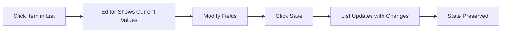
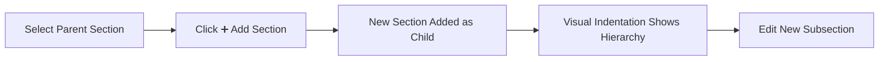

# Document Generator - Visual Design & User Flow

## Visual Mockup

### Default State (Nothing Selected)
```
┌─────────────────────────────────────────────────────────────────────────┐
│ 📄 Document Generator                                                    │
├─────────────────────────────────┬───────────────────────────────────────┤
│ Document Title                  │                                       │
│ [________________________]      │                                       │
│                                 │       👈 Select an item to edit      │
│ General Instructions            │                                       │
│ [________________________]      │                                       │
│                                 │                                       │
│ 📚 Resources                    │                                       │
│ [➕ Add] [➖ Remove]             │                                       │
│                                 │                                       │
│ *No resources yet*              │                                       │
│                                 │                                       │
│ 📑 Sections                     │                                       │
│ [➕ Add] [➕ Sub] [➖ Remove]     │                                       │
│                                 │                                       │
│ *No sections yet*               │                                       │
│                                 │                                       │
│ ─────────────────────────────   │                                       │
│ [📤 Upload] [📥 Download]       │ [🚀 Generate Document]               │
└─────────────────────────────────┴───────────────────────────────────────┘
```

### With Data & Resource Selected
```
┌─────────────────────────────────────────────────────────────────────────┐
│ 📄 Document Generator                                                    │
│ Create structured documents with AI assistance                          │
├─────────────────────────────────┬───────────────────────────────────────┤
│ Document Title                  │ 📄 Resource Details                   │
│ [AI Assistant Guide_____]       │                                       │
│                                 │ Resource Key                          │
│ General Instructions            │ [openai_docs___________]              │
│ [Write a comprehensive guide]   │                                       │
│ [for using AI assistants in]    │ Description                           │
│ [software development...]       │ [Official OpenAI API documentation]   │
│                                 │ [and best practices guide...]         │
│ 📚 Resources                    │                                       │
│ [➕ Add] [➖ Remove]             │ Source Type                           │
│                                 │ (•) URL ( ) File Upload ( ) Local     │
│ [📄 openai_docs        ] ← sel  │                                       │
│ [📄 best_practices     ]        │ URL                                   │
│ [📄 example_code       ]        │ [https://openai.com/docs____]         │
│                                 │                                       │
│ 📑 Sections                     │ Merge Mode                            │
│ [➕ Add] [➖ Remove]             │ [concat ▼]                            │
│                                 │                                       │
│ [📑 Introduction       ]        │ [💾 Save Changes] [Cancel]            │
│ [📑 Getting Started    ]        │                                       │
│ [　📑 Prerequisites    ]        │                                       │
│ [　📑 Installation     ]        │                                       │
│ [📑 Advanced Topics    ]        │                                       │
│                                 │                                       │
│ ─────────────────────────────   │                                       │
│ [📤 Upload] [📥 Download] [✓]   │                                       │
├─────────────────────────────────┼───────────────────────────────────────┤
│                                 │ [🚀 Generate Document] [👁 Preview]   │
└─────────────────────────────────┴───────────────────────────────────────┘
```

### With Section Selected
```
┌─────────────────────────────────────────────────────────────────────────┐
│ 📄 Document Generator                                                    │
│ Create structured documents with AI assistance                          │
├─────────────────────────────────┬───────────────────────────────────────┤
│ Document Title                  │ 📑 Section Details                    │
│ [AI Assistant Guide_____]       │                                       │
│                                 │ Section Title                         │
│ General Instructions            │ [Getting Started___________]          │
│ [Write a comprehensive guide]   │                                       │
│ [for using AI assistants in]    │ Content Mode                          │
│ [software development...]       │ (•) Prompt-based ( ) Static Resource  │
│                                 │                                       │
│ 📚 Resources                    │ Generation Prompt                     │
│ [➕ Add] [➖ Remove]             │ [Write an introduction to getting]    │
│                                 │ [started with AI assistants,]         │
│ [📄 openai_docs        ]        │ [including setup steps and first]    │
│ [📄 best_practices     ]        │ [usage examples...]                   │
│ [📄 example_code       ]        │                                       │
│                                 │ Reference Resources                   │
│ 📑 Sections                     │ ☑ openai_docs                         │
│ [➕ Add] [➖ Remove]             │ ☐ best_practices                      │
│                                 │ ☑ example_code                        │
│ [📑 Introduction       ]        │                                       │
│ [📑 Getting Started    ] ← sel  │ Subsections: Manage in left panel     │
│ [　📑 Prerequisites    ]        │                                       │
│ [　📑 Installation     ]        │ [💾 Save Changes] [Cancel]            │
│ [📑 Advanced Topics    ]        │                                       │
│                                 │                                       │
│ ─────────────────────────────   │                                       │
│ [📤 Upload] [📥 Download] [✓]   │                                       │
├─────────────────────────────────┼───────────────────────────────────────┤
│                                 │ [🚀 Generate Document] [👁 Preview]   │
└─────────────────────────────────┴───────────────────────────────────────┘
```

## User Flows

### 1. Creating a New Document from Scratch

```mermaid
graph LR
    A[Open App] --> B[Enter Title & Instructions]
    B --> C[Click ➕ Add Resource]
    C --> D[Resource Editor Opens]
    D --> E[Fill Resource Details]
    E --> F[Click Save]
    F --> G[Resource Added to List]
    G --> H[Click ➕ Add Section]
    H --> I[Section Editor Opens]
    I --> J[Fill Section Details]
    J --> K[Select Reference Resources]
    K --> L[Click Save]
    L --> M[Section Added to List]
    M --> N[Click Generate Document]
```



### 2. Editing Existing Content



### 3. Adding Nested Sections



## Interaction States

### Button States
- **Default**: Secondary variant, gray background
- **Selected**: Primary variant, blue background
- **Hover**: Slight brightness increase
- **Disabled**: Reduced opacity

### Form States
- **Empty**: Placeholder text visible
- **Focused**: Blue border highlight
- **Error**: Red border with error message
- **Saved**: Brief green flash on save

### List Item States
```
Default:     [📄 Resource Name      ]  (gray background)
Selected:    [📄 Resource Name      ]  (blue background)
Hover:       [📄 Resource Name      ]  (light blue)
```

## Subsection Handling

To add subsections:
1. Click on a section to select it (it becomes the parent)
2. Click "+Sub" to add a subsection under it
3. Subsections are visually indented
4. Supports up to 4 levels of nesting

Example with nested sections:
```
📑 Sections
[➕ Add] [➕ Sub] [➖ Remove]

[📑 Introduction        ]
[📑 Getting Started     ] ← selected (blue)
[  📑 Prerequisites     ]
[  📑 Installation      ]
[    📑 Windows         ]
[    📑 macOS           ]
[📑 Advanced Topics     ]
```

## Simple Implementation

This design prioritizes:
- **Direct manipulation** - click to select, no dropdowns
- **Visual clarity** - see everything at a glance
- **Minimal clicks** - most actions take 1-2 clicks
- **No hidden state** - everything visible

The result is a UI that's intuitive for users and simple to implement.