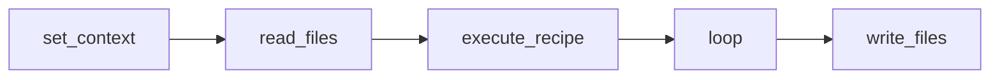
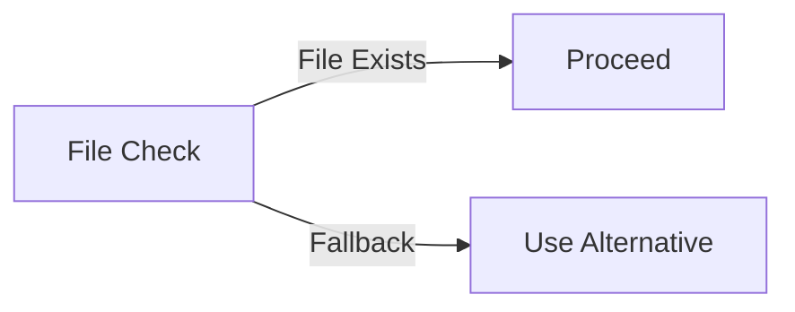
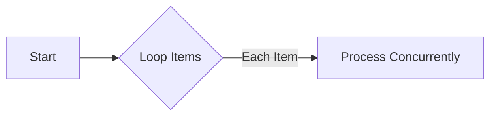
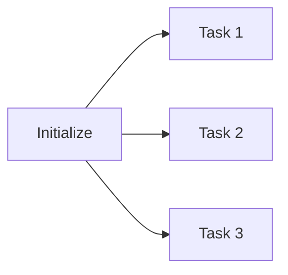

# Recipe JSON Authoring Guide

[document-generator]

**Date:** 5/17/2025 06:02:22 PM

# Introduction

In the realm of automation and efficiency, the Recipe JSON framework stands as a fundamental tool for structuring and executing tasks. A Recipe JSON file acts as the blueprint for automating sequences of operations, making it an essential resource for both developers and AI systems intended to interpret and execute complex instructions. Central to this structure is the Recipe Executor, a system that reads and processes these JSON files to perform the task sequences they define, ensuring accuracy and precision in execution.

This guide has been meticulously crafted to serve two primary audiences: human developers and Large Language Model (LLM) assistants. Both audiences aim to generate valid and functional recipes from natural language requests. By providing detailed insights and guidance, this document ensures that recipes are not just syntactically correct but optimized for performance and clarity.

To equip you with a comprehensive understanding of package authoring, this guide progresses through the essential topics as follows:

1. **Basic Structure** - An exploration of the foundational elements that constitute a Recipe JSON file.
2. **Context** - Understanding the environment and settings that impact recipe execution.
3. **Step Types** - Detailed overview of the various steps and their roles in a recipe.
4. **Templating** - Techniques to enhance flexibility and reuse within recipes.
5. **Best Practices** - Guidelines and recommendations for crafting effective recipes.
6. **Snippets** - Practical examples and code snippets to illustrate key concepts.

This document is your gateway to mastering recipe JSON authoring, fostering seamless automation for both human and AI-driven systems.

# Basic Recipe Structure

A well-formed Recipe JSON file begins with a defined structure that not only facilitates clarity but also ensures compatibility with the Recipe Executor. This section outlines the critical components and arrangements necessary to construct effective recipe JSON files.

## 1. Steps Array

The core of any Recipe JSON file is the "steps" array. Each element within this array is an object that represents a discrete operation, described through distinct keys and values. The "steps" array must conform to valid JSON standards — devoid of comments or unrecognized data types, ensuring parser compatibility:

- **Format**: 
  ```json
  "steps": [
    { "type": "set_context", /* ...other properties... */ },
    { "type": "read_files", /* ...other properties... */ }
  ]
  ```

- **Error Handling**: An incorrect or unknown `type` will result in execution errors, making validation crucial.

## 2. Optional Blocks

In addition to the mandatory "steps" array, a Recipe JSON may include optional top-level blocks:

- **Inputs**: User-defined inputs to tailor the recipe’s execution.
- **Outputs**: Expected results upon successful completion of the recipe.
- **Description**: Narrative explaining the recipe's purpose or operation.

The executor is designed to ignore unknown keys within these structures, focusing only on specified and recognized fields, thus maintaining robustness:

```json
{
  "inputs": {},
  "outputs": {},
  "description": "This recipe reads files and processes them."
}
```

## 3. Example Implementations

### Minimal Runnable Example
Here's a basic snippet illustrating the simplest functioning recipe containing a single step:

```json
{
  "steps": [
    { "type": "set_context", "context": "basic_usage" }
  ]
}
```

### Larger Skeleton Example
For a more comprehensive view, consider this skeleton detailing multiple essential steps:

```json
{
  "steps": [
    { "type": "set_context", "context": "advanced_usage" },
    { "type": "read_files", "paths": ["/path/to/input.json"] },
    { "type": "execute_recipe", "recipe": "process_data" },
    { "type": "loop", "condition": "item_in_list", "action": "process_item" },
    { "type": "write_files", "output": "/path/to/result.json" }
  ]
}
```

### Diagrammatic Representation

A mermaid diagram would illustrate each step's sequence and dependencies:



Through this structured approach, authors of Recipe JSON files can develop clear and executable automation sequences, making the most of the versatile Recipe Executor.

# Working with Objects Between Recipe Steps

In the realm of Recipe JSON, effectively utilizing the shared *context* object is crucial for maintaining data state across different steps in a recipe. This section will explore the mechanisms and patterns for using the context object, provide examples of common usages, and highlight frequent pitfalls to avoid.

## Context Object Overview

The context object serves as a persistent storage medium, accessible to all steps in a recipe. This allows data to be passed by reference between steps, eliminating the need for manual serialization or deserialization.

### Reading and Writing to Context

Each step can read from and write to the context using simple JSON path expressions, facilitating dynamic and flexible operations:

- **Reading Data**: A step can retrieve data by specifying the key associated with the desired value in the context object.
- **Writing Data**: Similarly, data can be inserted or updated in the context by assigning a key-value pair.

These operations are efficient and straightforward due to the inherent pass-by-reference nature, ensuring changes persist across the recipe's lifecycle.

## Common Patterns

### `set_context` Step

This pattern is primarily used to initialize or update the context with specific values before further processing. It sets the groundwork by establishing necessary variables or states.

### `context_overrides` in `execute_recipe`

Utilized to temporarily modify context values when running nested recipes, ensuring alterations do not affect the main context post-execution unless explicitly updated.

## Common Mistakes

1. **Unnecessary JSON Filtering**: Applying excessive filters when accessing context values can lead to inefficiencies. Direct key reference is usually preferable and more performant.
2. **Forgetting to Set `result_key` in Loops**: When collecting results in iterative steps, it is crucial to specify a `result_key` where accumulated results are stored to avoid overwriting data or losing outputs.

## Code Snippets

### Simple Value Pass

A straightforward operation transferring a simple value between steps:

```json
{
  "steps": [
    { "type": "set_context", "context": { "value": 42 } },
    { "type": "execute", "action": "calculate", "parameters": { "input": "{{context.value}}" } }
  ]
}
```

### Complex Object Pass

Passing and manipulating a complex object by reference:

```json
{
  "steps": [
    { "type": "set_context", "context": { "user": { "name": "Alice", "age": 30 } } },
    { "type": "execute", "action": "update_user", "parameters": { "user": "{{context.user}}" } }
  ]
}
```

### Loop Iteration Collecting Results

Executing a loop to collect and store results iteratively:

```json
{
  "steps": [
    { "type": "set_context", "context": { "numbers": [1, 2, 3] } },
    { "type": "loop", "collection": "{{context.numbers}}", "item": "number", "result_key": "results" }
  ]
}
```

In this snippet, results are collected in the `results` key, ensuring all outputs are amalgamated correctly for later use.

Utilizing these practices ensures efficient, error-free recipe authoring that maximizes the power of the shared context.


# Step Types Overview

The versatility and efficiency of a JSON recipe largely hinge on the diverse range of pre-built step types available within the Recipe Executor. Each step type encapsulates a specific task, empowering authors to compose intricate automation sequences without reinventing the wheel. Step types matter because they abstract complex operations into reusable components—streamlining development while reducing errors associated with bespoke coding.

Reference entries for these step types are structured consistently, providing a clear, concise explanation of each step's purpose and configuration options, accompanied by relevant examples. Understanding these reference entries is crucial when writing, debugging, or optimizing recipes, as they serve as definitive guides to leveraging each step's full potential. When encountering execution issues or tailoring a recipe's behavior, consulting these structured references ensures adherence to best practices and syntactic accuracy.

Here's a list of all current step types covered in this guide:

- **set_context**
- **read_files**
- **write_files**
- **execute_recipe**
- **loop**
- **condition**

## `read_files` Step

### Purpose

The `read_files` step is used to import data from external files into the Recipe Executor's context. This allows subsequent steps to access and manipulate data that exists outside the immediate recipe environment, facilitating integrations with external datasets or configuration files.

### When to Use

Use the `read_files` step when you need to:
- Import or parse JSON, CSV, or other file formats as part of your recipe’s process
- Load configuration settings defined in external files
- Bring data into the context for subsequent operations or calculations

### Key Configuration

- **`paths` (required)**
  - **Description**: An array of file path strings pointing to the files you wish to read.
  - **Default**: None

- **`format` (optional)**
  - **Description**: Specifies the format of the file. Common formats include `json`, `csv`, `xml`.
  - **Default**: `json` (The step defaults to assuming JSON format if none is provided.)

- **`context_key` (optional)**
  - **Description**: The key under which to store the file data in the context for later retrieval.
  - **Default**: `file_contents`

### Notable Pitfalls

1. **File Path Errors**: Incorrect file paths will result in the step failing to execute, leading to file not found errors.
2. **Unsupported File Formats**: Attempting to read files with unsupported formats will cause the recipe to fail. Always specify a supported format.
3. **Context Overwrites**: Without specifying a distinct `context_key` for each file, data might be overwritten in context if multiple files are read simultaneously.

### Runnable Example

#### Basic Example

```json
{
  "steps": [
    {
      "type": "read_files",
      "paths": ["/path/to/config.json"],
      "context_key": "config_data"
    },
    {
      "type": "set_context",
      "context": {
        "config": "{{context.config_data}}"
      }
    }
  ]
}
```

#### Multiple Files Example

```json
{
  "steps": [
    {
      "type": "read_files",
      "paths": ["/path/to/data1.json", "/path/to/data2.json"],
      "format": "json",
      "context_key": "data_from_files"
    },
    {
      "type": "process_data",
      "parameters": {
        "input": "{{context.data_from_files}}"
      }
    }
  ]
}
```

This section provides a comprehensive reference for utilizing the `read_files` step within Recipe JSON files, detailing its configuration, usage contexts, and potential pitfalls to optimize its implementation in automation processes.

## `write_files` Step

### Purpose

The `write_files` step enables the recipe to export data from the context to external files. This allows for the persistent storage of results, logs, or any other necessary outputs generated during recipe execution, facilitating subsequent use or analysis.

### When to Use

Utilize the `write_files` step when you need to:
- Save processed data or results from the context to a file for future use
- Generate output files based on operations performed within the recipe
- Log activity or results in a structured file for monitoring or debugging purposes

### Key Configuration

- **`output` (required)**
  - **Description**: The file path where the data should be saved. This can include directory and file name specifications.
  - **Default**: None

- **`data` (required)**
  - **Description**: The actual data or context reference to be written to the file. Supports JSON paths or direct objects.
  - **Default**: None

- **`format` (optional)**
  - **Description**: The desired format of the output file. Supported formats include `json`, `csv`, `text`.
  - **Default**: `json` (Defaults to JSON if no format is specified.)

### Notable Pitfalls

1. **Overwrite Risks**: Specifying a file path that already exists will overwrite the existing file without warning. Ensure output paths are checked to avoid unintentional data loss.
2. **Invalid Paths**: Incorrectly specified output paths can lead to write errors or failures in file creation, stopping further steps of the recipe from executing.
3. **Data Formatting Errors**: Mismatched data types and specified format can cause write failures. Verify data compatibility with the chosen file format.

### Runnable Example

#### Basic Example

```json
{
  "steps": [
    {
      "type": "write_files",
      "output": "/path/to/output.json",
      "data": { "result": "success", "timestamp": "{{context.timestamp}}" }
    }
  ]
}
```

#### Text Output Example

```json
{
  "steps": [
    {
      "type": "write_files",
      "output": "/logs/output_log.txt",
      "format": "text",
      "data": "Process completed with result: {{context.result}} at time {{context.timestamp}}"
    }
  ]
}
```

This section provides a comprehensive reference for utilizing the `write_files` step within Recipe JSON files, detailing its configuration, usage contexts, and common pitfalls, ensuring effective file exporting during recipe execution.

## `set_context` Step

### Purpose

The `set_context` step initializes or updates values within the shared context object used throughout a Recipe JSON execution. This step is foundational, allowing you to define essential variables and states before other operations are performed. It functions as the setup stage, where necessary data is prepared for later steps.

### When to Use

Employ the `set_context` step when you need to:
- Initialize the context with predefined values or structures at the beginning of the recipe.
- Update or modify context variables in response to operations performed by previous steps.
- Prepare and manage data that will be used across multiple steps within a recipe.

### Key Configuration

- **`context` (required)**  
  - **Description**: A key-value map where each key represents a variable name in the context and each value is the data to be stored.
  - **Default**: None (The step requires explicit values to set in the context.)

### Notable Pitfalls

1. **Overwriting Important Data**: Accidentally setting a context key to a new value when it is supposed to accumulate information can lead to data loss. Ensure keys are distinct or properly managed when context needs to be updated incrementally.
2. **Incorrect Data Types**: Assigning values of incorrect types (e.g., string instead of an expected array) can lead to errors in later steps that expect certain data formats.
3. **JSON Syntax Errors**: Ensure the JSON structure is valid as mistakes like trailing commas or missing brackets can prevent the recipe from running. 

### Runnable Example

#### Basic Initialization

```json
{
  "steps": [
    {
      "type": "set_context",
      "context": { "user_id": 101, "username": "jdoe" }
    }
  ]
}
```

#### Using Calculated Values

```json
{
  "steps": [
    {
      "type": "set_context",
      "context": { "count": 0, "last_update": "{{context.current_time}}" }
    },
    {
      "type": "execute",
      "action": "increment_count",
      "parameters": { "current_count": "{{context.count}}", "increment": 5 }
    }
  ]
}
```

This section provides a detailed explanation for employing the `set_context` step in Recipe JSON files, highlighting its purpose, configuration, common issues, and usage through practical examples. Proper implementation of this step ensures that recipes can reliably manage and update context data effectively throughout their execution sequence.

## `conditional` Step

### Purpose

The `conditional` step introduces decision-making logic within a Recipe JSON, allowing the execution flow to branch based on specified conditions. This enables the recipe author to tailor the sequence of operations dynamically, enhancing flexibility and handling various scenarios conditionally.

### When to Use

Use the `conditional` step when you need to:
- Execute different paths of steps based on runtime context values or external conditions.
- Implement if-else logic to manage alternative execution flows effectively.
- Guard against executing steps when certain criteria are not met.

### Key Configuration

- **`condition` (required)**
  - **Description**: An expression evaluated to determine whether the subsequent steps should be executed. Supports basic comparison operators and context-based values.
  - **Default**: None

- **`true_steps` (required)**
  - **Description**: An array of steps to be executed if the `condition` evaluates to true.
  - **Default**: None

- **`false_steps` (optional)**
  - **Description**: An array of steps to be executed if the `condition` evaluates to false.
  - **Default**: No steps (the recipe will proceed to the next step if this field is not provided).

### Notable Pitfalls

1. **Complex Conditions**: Overly complex condition expressions can become hard to read and debug. Keeping conditions simple and separating logic into manageable steps is advisable.
2. **Undefined Context Keys**: Ensure that context keys used in conditions are defined prior to their usage, as undefined references can lead to execution errors.
3. **Missing `false_steps`**: If alternate actions are needed when a condition is false, ensure the `false_steps` list is not overlooked.

### Runnable Example

#### Basic If-Else

```json
{
  "steps": [
    {
      "type": "conditional",
      "condition": "{{context.user_role}} == 'admin'",
      "true_steps": [
        { "type": "execute", "action": "grant_admin_access" }
      ],
      "false_steps": [
        { "type": "execute", "action": "deny_access", "parameters": { "message": "Admin rights required." } }
      ]
    }
  ]
}
```

#### Omitting False Steps

```json
{
  "steps": [
    {
      "type": "conditional",
      "condition": "{{context.is_verified}}",
      "true_steps": [
        { "type": "execute", "action": "proceed_to_dashboard" }
      ]
    }
  ]
}
```

This section provides an in-depth overview for using the `conditional` step within Recipe JSON files, outlining its configuration, relevant use cases, and potential pitfalls, thereby supporting optimal implementation of decision-making logic in automation sequences.

## `loop` Step

### Purpose

The `loop` step enables repeated execution of a sequence of steps for each item in a collection. This iterative approach is vital for processing lists or arrays of items without manually duplicating steps in recipe JSONs. By leveraging loops, you can efficiently manage repetitive tasks within complex automation procedures.

### When to Use

Use the `loop` step when you need to:
- Execute a set of steps for each item in a dataset or list.
- Process collections, such as iterating over records from a file or results from a previous operation.
- Automatically handle collections of variable length without changing the core logic of the recipe.

### Key Configuration

- **`collection` (required)**
  - **Description**: Specifies the array or list from the context that contains the items to iterate over.
  - **Default**: None (Must reference a valid context source).

- **`item` (required)**
  - **Description**: Represents the alias used to reference the current item within each iteration of the loop.
  - **Default**: None (An alias must be explicitly provided).

- **`result_key` (optional)**
  - **Description**: A key where results from each iteration are stored if aggregation or collection of results is needed.
  - **Default**: No results are stored unless specified.

### Notable Pitfalls

1. **Undefined Collections**: Ensure the collection to be iterated over is defined in the context before utilizing the `loop` step, as undefined collections lead to execution errors.
2. **Infinite Loops**: Be cautious with loops conditioned on dynamic data changes that might trigger indefinitely without proper base conditions or loop count limitations.
3. **Data Overwrites in Results**: When using a `result_key`, without proper management or unique keys, data from the loop may overwrite previous entries rather than append, losing valuable results.

### Runnable Example

#### Basic Loop Example

```json
{
  "steps": [
    {
      "type": "loop",
      "collection": "{{context.items}}",
      "item": "item",
      "true_steps": [
        { "type": "execute", "action": "process_item", "parameters": { "data": "{{item}}" } }
      ]
    }
  ]
}
```

#### Collecting Results

```json
{
  "steps": [
    {
      "type": "set_context",
      "context": { "numbers": [1, 2, 3] }
    },
    {
      "type": "loop",
      "collection": "{{context.numbers}}",
      "item": "number",
      "result_key": "squared_numbers",
      "true_steps": [
        {
          "type": "execute",
          "action": "square_number",
          "parameters": { "input": "{{number}}" },
          "result_key": "result"
        },
        {
          "type": "set_context",
          "context": { "squared_numbers": "{{context.squared_numbers}}" + [{{result}}] }
        }
      ]
    }
  ]
}
```

This section provides a comprehensive reference for utilizing the `loop` step within Recipe JSON files, detailing its configuration, usage contexts, and common pitfalls to optimize repetitive processes efficiently in automation workflows.

## `parallel` Step

### Purpose

The `parallel` step enables the concurrent execution of multiple predefined steps within a Recipe JSON file. This capability is essential for optimizing workflows and reducing execution time when independent steps can be processed simultaneously without waiting for each other to complete.

### When to Use

Use the `parallel` step when you need to:
- Perform independent tasks concurrently to save time and resources.
- Run several steps simultaneously that do not rely on one another's results.
- Optimize performance in scenarios where separate actions can logically progress in parallel, enhancing overall efficiency.

### Key Configuration

- **`steps` (required)**  
  - **Description**: An array of steps or step sequences that should be executed concurrently.
  - **Default**: None (Must include valid steps that can be executed in parallel).

### Notable Pitfalls

1. **Data Dependencies**: Ensure that steps grouped in a `parallel` execution do not have hidden dependencies on each other, as this could cause conflicts or incorrect results.
2. **Resource Contention**: Be aware of potential resource bottlenecks if multiple steps require significant shared system resources concurrently.
3. **Error Handling**: Differences in error handling between parallel steps may lead to partial failures being less evident. Ensure robust exception handling.

### Runnable Example

#### Basic Parallel Execution

```json
{
  "steps": [
    {
      "type": "parallel",
      "steps": [
        { "type": "execute", "action": "download_data", "parameters": { "url": "https://example.com/data1" } },
        { "type": "execute", "action": "compress_files", "parameters": { "directory": "/path/to/files" } }
      ]
    }
  ]
}
```

#### Complex Parallel Sequences

```json
{
  "steps": [
    {
      "type": "parallel",
      "steps": [
        {
          "type": "execute",
          "action": "run_analysis",
          "parameters": { "dataset": "{{context.dataset1}}" }
        },
        {
          "type": "loop",
          "collection": "{{context.records}}",
          "item": "record",
          "true_steps": [
            {
              "type": "execute",
              "action": "process_record",
              "parameters": { "data": "{{record}}" }
            }
          ]
        }
      ]
    }
  ]
}
```

This section provides a detailed reference for utilizing the `parallel` step in Recipe JSON files, emphasizing its purpose, usage scenarios, and potential pitfalls. Proper implementation of this step ensures effective parallelization of tasks within automation processes, boosting efficiency and reducing completion time.

## `execute_recipe` Step

### Purpose

The `execute_recipe` step is designed to initiate and manage the execution of another pre-defined Recipe JSON file within the current recipe workflow. This functionality is crucial for modularity, allowing complex processes to be broken down into simpler, independently managed units that can be executed as needed.

### When to Use

Use the `execute_recipe` step when you need to:
- Integrate a separate pre-defined recipe as part of a larger workflow, enabling reusability and simplification of extensive automation sequences.
- Organize tasks into discrete components to maintain better manageability and clarity in complex recipes.
- Dynamically include optional tasks based on conditional logic or specified input by calling external recipes.

### Key Configuration

- **`recipe` (required)**  
  - **Description**: Specifies the file name or path to the Recipe JSON to be executed.
  - **Default**: None

- **`context_overrides` (optional)**
  - **Description**: A mapping of context keys and values that temporarily modify context values in the current recipe context when the external recipe is executed.
  - **Default**: Remains unchanged (The existing context is inherited by the sub-recipe unless explicitly overridden.)

- **`result_key` (optional)**
  - **Description**: A context key where any output or result produced by the executed recipe will be stored.
  - **Default**: Outputs are not stored unless specified.

### Notable Pitfalls

1. **Missing Recipe File**: Ensure the path to the recipe being executed is correct; otherwise, execution will fail due to a missing file.
2. **Context Conflicts**: Care must be taken to manage context key overlaps between parent and sub-recipe to avoid unintended data overwrites or loss.
3. **Handling Outputs**: Not explicitly specifying a `result_key` may lead to losing important results once the sub-recipe execution completes unless they are adequately captured.

### Runnable Example

#### Basic Example

```json
{
  "steps": [
    {
      "type": "execute_recipe",
      "recipe": "/path/to/subrecipe.json"
    }
  ]
}
```

#### Example with Context Overrides and Result Capture

```json
{
  "steps": [
    {
      "type": "execute_recipe",
      "recipe": "/path/to/data_processing.json",
      "context_overrides": { "input_data": "{{context.new_data}}" },
      "result_key": "processed_results"
    }
  ]
}
```

This section provides comprehensive guidance on implementing the `execute_recipe` step within Recipe JSON files, outlining how to utilize it effectively for modular execution and integration of pre-defined tasks. Proper configuration ensures flexibility and efficient execution management within broader automated workflows.

## `condition` Step

### Purpose

The `condition` step enables conditional validation within a Recipe JSON, directing the execution flow based on logical conditions. This step allows recipe authors to implement decision-making capability, ensuring actions only occur under specified circumstances.

### When to Use

You should use the `condition` step when:
- Decisions need to be made about which steps to execute based on current data or state.
- Implementing branching logic within recipes, allowing execution to diverge depending on dynamic conditions.
- You want to ensure certain steps only execute when specific criteria are satisfied, enhancing control over process flow.

### Key Configuration

- **`expression` (required)**  
  - **Description**: Defines the logical condition or expression to evaluate. It must return a boolean value (true or false) to determine which steps proceed.
  - **Default**: None (A valid condition expression is necessary for execution to occur).  

- **`true_steps` (required)**
  - **Description**: Steps to execute if the expression evaluates to true, functioning as the primary course of action.
  - **Default**: None

- **`false_steps` (optional)**
  - **Description**: Steps to execute if the expression evaluates to false, providing an alternative pathway or action.
  - **Default**: No alternative steps executed if not specified, resulting in a continuation to subsequent steps.

### Notable Pitfalls

1. **Complex Expressions**: Overcomplexity can make conditions difficult to read or debug. Ensure expressions remain as straightforward as possible or break down into simpler parts.
2. **Logical Errors**: Ensure true/false logic matches real-world use; small mistakes can lead to larger logic issues throughout the recipe.
3. **Lack of False Steps**: Failing to delineate false steps can lead to silent failures or gaps in process flow, especially when expectations alter depending on condition outcomes.

### Runnable Example

#### Simple If Condition

```json
{
  "steps": [
    {
      "type": "condition",
      "expression": "{{context.balance}} > 1000",
      "true_steps": [
        { "type": "execute", "action": "apply_discount" }
      ],
      "false_steps": [
        { "type": "log", "message": "Balance insufficient for discount." }
      ]
    }
  ]
}
```

#### Single Branch Example

```json
{
  "steps": [
    {
      "type": "condition",
      "expression": "{{context.eligible}}",
      "true_steps": [
        { "type": "execute", "action": "offer_upgrade" }
      ]
    }
  ]
}
```

This section offers an in-depth reference for effectively employing the `condition` step in Recipe JSON files, emphasizing its purpose, configuration, and nuances for incorporating conditional logic within automated processes to ensure accurate and dynamic execution paths.

## `mcp` Step

### Purpose

The `mcp` step, standing for Multi-Context Processing, is designed to perform operations across multiple context objects simultaneously. This makes it a powerful tool for scenarios where parallel data processing on different datasets or models is required.

### When to Use

Use the `mcp` step when you need to:
- Process multiple data streams concurrently within a single recipe execution.
- Coordinate operations that involve several independent or loosely coupled context objects.
- Optimize recipes by reducing the overall runtime through simultaneous processing of distinct context blocks.

### Key Configuration

- **`contexts` (required)**  
  - **Description**: A list of context objects that the step will operate on simultaneously. Each context in the list is processed in parallel, allowing for efficient and rapid data manipulation.
  - **Default**: None (Explicit contexts must be provided for the step to function).

- **`operations` (required)**
  - **Description**: A list of operations or tasks to perform on each context within the `contexts` list. This allows for applying the same logic uniformly across multiple data sets.
  - **Default**: None

### Notable Pitfalls

1. **Resource Overutilization**: Running too many operations at once may lead to resource strain, especially if each context demands significant computational capacity.
2. **Dependency Conflicts**: Ensure operations within `mcp` do not have implicit dependencies on any other active operations, as this can result in inconsistent or erroneous outcomes.
3. **Inconsistent State Management**: Each context must be consistently managed to prevent state bleed or unintended data manipulation across contexts.

### Runnable Example

#### Basic Multi-Context Example

```json
{
  "steps": [
    {
      "type": "mcp",
      "contexts": [
        { "name": "contextA", "data": { "items": [1, 2, 3] } },
        { "name": "contextB", "data": { "items": [4, 5, 6] } }
      ],
      "operations": [
        { "type": "process_items", "parameters": { "items_key": "items" } }
      ]
    }
  ]
}
```

#### Complex Multi-Context Parallel Processing

```json
{
  "steps": [
    {
      "type": "mcp",
      "contexts": [
        { "name": "context1", "data": { "values": [7, 8, 9] } },
        { "name": "context2", "data": { "values": [10, 11, 12] } }
      ],
      "operations": [
        {
          "type": "analyze_values",
          "parameters": { "input": "values" }
        },
        {
          "type": "summarize_results",
          "parameters": { "summary_key": "summary" }
        }
      ]
    }
  ]
}
```

This section offers a full reference guide to using the `mcp` step in Recipe JSON files. By detailing its configuration, appropriate use cases, and potential pitfalls, it ensures users can effectively leverage this feature to enhance parallel processing capabilities within their recipes.

# Using Liquid Templating for Dynamic Content

Liquid templating introduces a powerful layer of flexibility and dynamism to your Recipe JSON files, allowing for in-place data transformations and conditional logic. Whether you need to perform complex calculations, manipulate strings, or implement conditional workflows, Liquid's features provide an essential toolkit.

## Core Features

### Template Substitutions
Template substitutions in Liquid allow for dynamic replacement of placeholders within strings with context values, environment variables, or outputs of previous steps. This transforms your recipes into flexible systems capable of adapting data dynamically as it flows through the automation sequence.

### Filters
Filters enable transformations of output, modifying data inline during substitution. Common filters in Liquid include `default`, `json`, `snakecase`, among others, allowing for format conversions, string manipulations, or setting default values.

### Loops
Liquid supports iteration over sequence data types through loops, enhancing the capability to process repeated structures, such as arrays or object collections, systematically within the recipes.

### Conditionals
Conditional logic within templates provides fine-grained control over what data is included or processed, based on runtime conditions or variables, contributing to flexible and contextually aware automation paths.

#### Examples

1. **Dynamic Path**
   ```json
   {
     "type": "read_files",
     "paths": ["/data/{{context.file_date | date: '%Y-%m-%d'}}/input.json"]
   }
   ```
   _This uses the date filter to dynamically construct a file path based on the current date._

2. **Default Fallback**
   ```json
   {
     "type": "set_context",
     "context": { "username": "{{context.username | default: 'guest'}}" }
   }
   ```
   _Assigns a default user name 'guest' if the context for `username` is not set._

3. **Building a List with `for`**
   ```json
   {
     "type": "loop",
     "collection": "{{context.items}}",
     "item": "item",
     "result_key": "processed_items",
     "true_steps": [
       {
         "type": "execute",
         "action": "process",
         "parameters": { "input": "{{item}}" },
         "result_key": "result"
       }
     ]
   }
   ```
   _Iterates over each item in context, processing and storing results in a list._

4. **Inline Conditional**
   ```json
   {
     "type": "set_context",
     "context": {
       "access": "{{ 'Admin Access Granted' if context.user == 'admin' else 'Standard Access' }}"
     }
   }
   ```
   _Determines the access level based on the user role, using inline conditional logic._

### Embedding Large Content Blocks

When dealing with substantial content blocks within Liquid templates, there are conventions to ensure clarity, maintainability, and efficiency:

1. **Using Multiline Strings**: Utilize Liquid's multiline syntax to handle extensive data blocks, ensuring they are well-formatted for readability.

2. **Encapsulating Logic**: Complex calculations or logic can be encapsulated within custom tags or filters for repeatability and reduced clutter in templates.

3. **Managing Performance**: Optimize performance by minimizing excessive template logic and focusing on necessary data transformations, thereby reducing processing overhead.

By leveraging Liquid templating within your Recipe JSON files, automation becomes not just about executing predefined steps, but dynamically adapting to data and conditions, creating intelligent and responsive workflows.

# Embedding Large Content in Prompts

In the realm of utilizing Large Language Models (LLMs), the organization of input data significantly impacts the model’s performance and accuracy. One effective technique for handling large blocks of information is wrapping them in distinctive all-cap XML-like tags (such as `<SPEC> ... </SPEC>`). This method not only aids in managing and navigating extensive content but also optimizes the LLM's ability to focus or disregard specific sections, improving overall efficiencies in data parsing and comprehension.

## Why This Technique is Effective

1. **Focus Enhancement:** When large chunks of text are encapsulated within specific tags, it signals the model to pay particular attention to these segments. As the LLM processes the input, these sections are prioritized, allowing critical information to be highlighted and assessed in detail.

2. **Irrelevance Ignoring:** Conversely, sections of text that are not immediately relevant to the task can be wrapped in tags indicating the content can be ignored or de-emphasized. This allows the model to efficiently allocate processing resources only to necessary data.

## Dos & Don'ts Table

| Dos                           | Don'ts                              |
|-------------------------------|-------------------------------------|
| Use one tag per line          | Avoid nesting tags within each other |
| Ensure every tag is closed    | Do not forget to close tags        |
| Treat tagged content as opaque| Avoid splitting semantic units    |
| Use all-cap tags for clarity  | Avoid using generic tags like <tag> |

## Example Prompt Snippet

Here’s a practical example that demonstrates how to inject a sizable markdown block using the tagging technique:

```plaintext
Write a summary based on the details below:

<SPEC>
# Example Markdown Blob
- *Item 1:* Description of item one detailing specific attributes and contexts.
- *Item 2:* Description of item two with various implications and points of interest.
...</SPEC>
```

In this snippet, the `<SPEC> ... </SPEC>` tags encapsulate a significant markdown blob, directing the model to focus specifically on this structured information block for summarization. Implementing this technique ensures that essential details are presented with clarity, enhancing the efficiency of communication with LLMs and improving output quality.

# Best Practices and Patterns

Crafting effective Recipe JSON files involves adhering to guidelines that enhance readability, modularity, and execution efficiency. Here are actionable best practices and design patterns to consider:

- **Designing Modular Recipes**: Develop small and focused recipes that tackle specific tasks. This approach promotes clarity and enables easier maintenance. Reuse sub-recipes for common tasks to avoid redundancy.

- **Clear Context Keys**: Use descriptive, clear names for context keys to improve understandability. Avoid using "magic strings"—literal strings with special meaning—to prevent confusion and errors.

- **Guard with Conditional Steps**: Employ `conditional` steps to make execution paths flexible and to handle edge cases explicitly. This ensures that your recipes adapt intelligently to various conditions without unforeseen errors.

- **Optimized File Handling**: Use optional file reads wisely. Only access files when necessary, and ensure paths are valid to avoid execution interruption.

- **Loop and Parallelism**: Use `loop` steps and consider `parallel` execution for independent tasks to optimize performance. Include `fail_fast` configurations to halt processes promptly upon critical error detection.

- **Always Specify `result_key` in Loops**: Assign a `result_key` to capture loop results, ensuring data integrity and preventing overwrites during iterations.

- **Token-Budget Considerations**: Monitor the token budget and manage prompt length to avoid overflow. For large content, summarize or wrap text using specialized mechanisms, helping maintain concise and precise instructions.

- **Merging Context with `set_context`**: Understand merge semantics when using `set_context`: strings concatenate, lists append, and dictionaries shallow-merge. This knowledge helps prevent unintentional data loss or corruption.

By following these best practices, you can create more robust, efficient, and maintainable Recipe JSON files, leading to seamless and reliable automation workflows.

# Recipe Cookbook: Automation Patterns Snippets

In this section, we present practical snippets for common automation patterns using Recipe JSON syntax, designed to address specific operational needs efficiently. Each snippet elucidates typical use cases with a brief summary, providing actionable and ready-to-implement JSON examples.

## 1. Conditional File Check & Fallback

**Purpose:**
Automatically check for the presence of a file and employ a fallback mechanism if it is missing.

**Typical Use Cases:**
- Ensure data or configuration files are available before proceeding with dependent operations.
- Implement backup paths to maintain robustness in workflows.

**Flow Summary:**
The logic checks if a specific file exists. If not found, an alternative action or different file path is utilized, allowing for seamless continuation without interruption.

**Mermaid Diagram:**


**JSON Snippet:**
```json
{
  "steps": [
    {
      "type": "conditional",
      "condition": "file_exists('/data/input.json')",
      "true_steps": [
        { "type": "execute", "action": "process_file", "parameters": { "path": "/data/input.json" } }
      ],
      "false_steps": [
        { "type": "execute", "action": "process_file", "parameters": { "path": "/data/default.json" } }
      ]
    }
  ]
}
```

## 2. Batch Loop Over Items (with Concurrency)

**Purpose:**
Efficiently process multiple items concurrently, optimizing performance and resource usage.

**Typical Use Cases:**
- Batch processing large datasets where each entry can be handled independently.
- Performing parallel computations or operations across a set of items.

**Flow Summary:**
Iterates over a list of items, processing each concurrently, thereby reducing total execution time. Concurrency is achieved by executing each operation in parallel threads.

**Mermaid Diagram:**


**JSON Snippet:**
```json
{
  "steps": [
    {
      "type": "loop",
      "collection": "{{context.data_list}}",
      "item": "item",
      "concurrency": 5,
      "true_steps": [
        { "type": "execute", "action": "process_item", "parameters": { "input": "{{item}}" } }
      ]
    }
  ]
}
```

## 3. Parallel Independent Tasks

**Purpose:**
Execute multiple tasks simultaneously when they do not depend on each other's outcomes.

**Typical Use Cases:**
- Improve efficiency when tasks can be performed independently.
- Utilize system resources to their full potential by running tasks in parallel.

**Flow Summary:**
Separate tasks are executed concurrently, leading to faster completion times by leveraging the parallel execution capabilities of the Recipe Executor.

**Mermaid Diagram:**


**JSON Snippet:**
```json
{
  "steps": [
    {
      "type": "parallel",
      "steps": [
        { "type": "execute", "action": "task_one" },
        { "type": "execute", "action": "task_two" },
        { "type": "execute", "action": "task_three" }
      ]
    }
  ]
}
```

## 4. Reusing Logic via `execute_recipe`

**Purpose:**
Promote modularity and reusability by embedding existing recipes within larger workflows.

**Typical Use Cases:**
- Simplify complex recipes by pulling in reusable components.
- Standardize common sequences across different automation scripts.

**Flow Summary:**
A sub-recipe is called within a larger Recipe JSON, fetching common processing logic or routines, which streamlines workflow creation and maintenance.

**Mermaid Diagram:**


**JSON Snippet:**
```json
{
  "steps": [
    {
      "type": "execute_recipe",
      "recipe": "common_operations.json",
      "context_overrides": { "input_data": "{{context.local_data}}" },
      "result_key": "sub_recipe_outputs"
    }
  ]
}
```

These snippets offer practical solutions for implementing fundamental automation patterns, ensuring robust, efficient, and modular Recipe JSON designs.

# Conclusion

In wrapping up this guide on crafting Recipe JSON files, it’s essential to revisit the major tenets that structure these files into powerful automation tools. At the heart of recipe authoring lies the structure—establishing a clear, well-defined framework that dictates the sequence and logic of operations. This is complemented by the context, which serves as the backbone for storing and handling data that flows through the recipe, ensuring seamless transitions between steps.

Templating, particularly with Liquid, empowers your recipes with dynamic capabilities, allowing for adaptable processes that cater to varying inputs and conditions. By using templates, your recipes gain flexibility and the ability to respond dynamically to contextual cues. Best practices further guide the creation of these recipes, emphasizing clarity, modularity, and performance—key attributes that enhance maintainability and efficiency.

As you embark on the task of generating new recipes, I encourage you to actively utilize the principles shared in this guide. Treat each recipe as a living document—one that can be iterated upon and refined as your requirements evolve. This dynamic approach will not only improve the functionality of your automation sequences but also nourish a culture of continuous improvement and innovation.

Remember that every recipe you create is a stepping stone to more sophisticated automatisms. By investing in iteration and refinement, you ensure that your recipes remain relevant and effective, meeting the ever-evolving demands of your workflow. Happy developing!