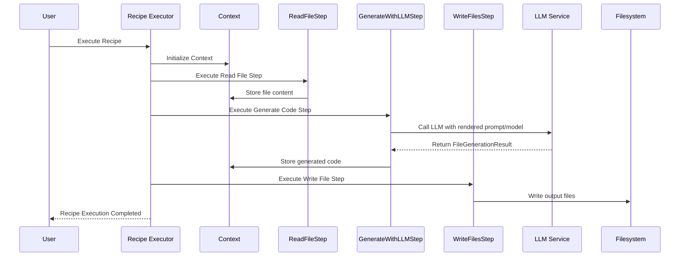

# Diagrams

## Code Generation Sequence

```mermaid
sequenceDiagram
    participant U as User
    participant RE as Recipe Executor
    participant Ctx as Context
    participant RFS as ReadFileStep
    participant GLL as GenerateWithLLMStep
    participant WFS as WriteFilesStep
    participant LLM as LLM Service

    U->>RE: Execute Recipe
    RE->>Ctx: Initialize Context
    RE->>RFS: Execute Read File Step
    RFS->>Ctx: Store file content
    RE->>GLL: Execute Generate Code Step
    GLL->>LLM: Call LLM with rendered prompt/model
    LLM-->>GLL: Return FileGenerationResult
    GLL->>Ctx: Store generated code
    RE->>WFS: Execute Write File Step
    WFS->>Filesystem: Write output files
    RE-->>U: Recipe Execution Completed
```

## Component Code Generation Workflow

```mermaid
flowchart TD
    A["Component Blueprint (spec/docs) Ready"]
    B[Run Create Recipe]
    C[Read Spec File Step]
    D[Read Documentation File Step]
    E[Execute Code Generation Recipe]
    F[Call Generate Code Step]
    G[For Each File in Code Generation Loop]
    H[Aggregate Generated Files]
    I[Run Write File Step]
    J[Write Output Files to Disk]
    K[Run Edit Recipe for Refinement]
    L[Refine Component Code]
    M[Integrate Component Code into Codebase]
    N[Component Build Complete]

    A --> B
    B --> C
    B --> D
    C --> E
    D --> E
    E --> F
    F --> G
    G --> H
    H --> I
    I --> J
    J --> K
    K --> L
    L --> M
    M --> N
```
