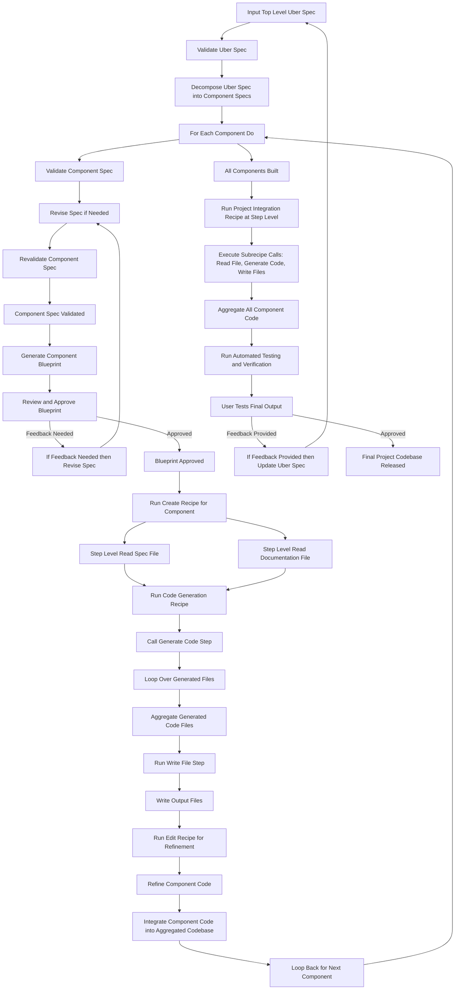
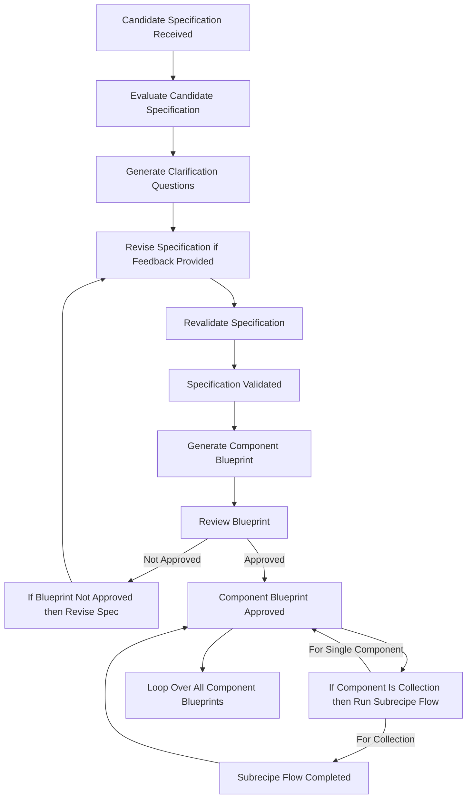
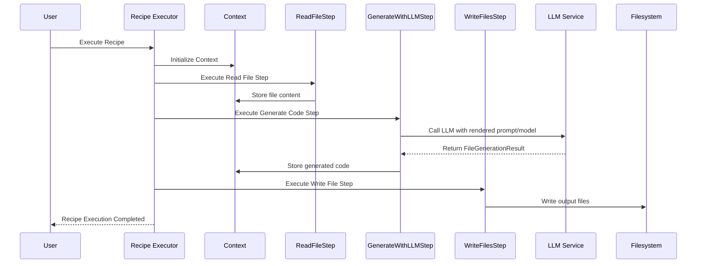
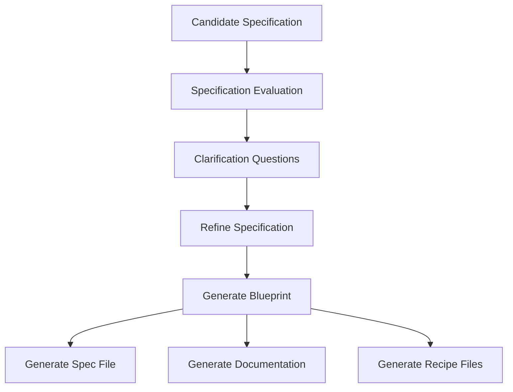
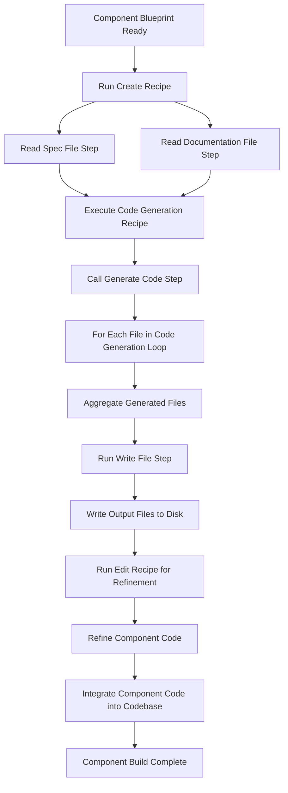

# Diagrams

## End-to-End Project Workflow

```mermaid
flowchart TD
    A[Input Top Level Uber Spec]
    B[Validate Uber Spec]
    C[Decompose Uber Spec into Component Specs]
    D[For Each Component Do]
    E[Validate Component Spec]
    F[Revise Spec if Needed]
    G[Revalidate Component Spec]
    H[Component Spec Validated]
    I[Generate Component Blueprint]
    J[Review and Approve Blueprint]
    K[If Feedback Needed then Revise Spec]
    L[Blueprint Approved]
    M[Run Create Recipe for Component]
    N[Step Level Read Spec File]
    O[Step Level Read Documentation File]
    P[Run Code Generation Recipe]
    Q[Call Generate Code Step]
    R[Loop Over Generated Files]
    S[Aggregate Generated Code Files]
    T[Run Write File Step]
    U[Write Output Files]
    V[Run Edit Recipe for Refinement]
    W[Refine Component Code]
    X[Integrate Component Code into Aggregated Codebase]
    Y[Loop Back for Next Component]
    Z[All Components Built]
    AA[Run Project Integration Recipe at Step Level]
    AB[Execute Subrecipe Calls: Read File, Generate Code, Write Files]
    AC[Aggregate All Component Code]
    AD[Run Automated Testing and Verification]
    AE[User Tests Final Output]
    AF[If Feedback Provided then Update Uber Spec]
    AG[Final Project Codebase Released]

    A --> B
    B --> C
    C --> D
    D --> E
    E --> F
    F --> G
    G --> H
    H --> I
    I --> J
    J -- Feedback Needed --> K
    K --> F
    J -- Approved --> L
    L --> M
    M --> N
    M --> O
    N --> P
    O --> P
    P --> Q
    Q --> R
    R --> S
    S --> T
    T --> U
    U --> V
    V --> W
    W --> X
    X --> Y
    Y --> D
    D --> Z
    Z --> AA
    AA --> AB
    AB --> AC
    AC --> AD
    AD --> AE
    AE -- Feedback Provided --> AF
    AF --> A
    AE -- Approved --> AG
```

## Build Blueprint Workflow

```mermaid
flowchart TD
    A[Candidate Specification Received]
    B[Evaluate Candidate Specification]
    C[Generate Clarification Questions]
    D[Revise Specification if Feedback Provided]
    E[Revalidate Specification]
    F[Specification Validated]
    G[Generate Component Blueprint]
    H[Review Blueprint]
    I[If Blueprint Not Approved then Revise Spec]
    J[Component Blueprint Approved]
    K[If Component Is Collection then Run Subrecipe Flow]
    L[Subrecipe Flow Completed]
    M[Loop Over All Component Blueprints]

    A --> B
    B --> C
    C --> D
    D --> E
    E --> F
    F --> G
    G --> H
    H -- Not Approved --> I
    I --> D
    H -- Approved --> J
    J --> K
    K -- For Single Component --> J
    K -- For Collection --> L
    L --> J
    J --> M
```

## Code Generation Sequence

```mermaid
sequenceDiagram
    participant U as User
    participant RE as Recipe Executor
    participant Ctx as Context
    participant RFS as ReadFileStep
    participant GLL as GenerateWithLLMStep
    participant WFS as WriteFilesStep
    participant LLM as LLM Service

    U->>RE: Execute Recipe
    RE->>Ctx: Initialize Context
    RE->>RFS: Execute Read File Step
    RFS->>Ctx: Store file content
    RE->>GLL: Execute Generate Code Step
    GLL->>LLM: Call LLM with rendered prompt/model
    LLM-->>GLL: Return FileGenerationResult
    GLL->>Ctx: Store generated code
    RE->>WFS: Execute Write File Step
    WFS->>Filesystem: Write output files
    RE-->>U: Recipe Execution Completed
```

## Component Blueprint Generation Workflow

```mermaid
flowchart TD
    A[Candidate Specification] --> B[Specification Evaluation]
    B --> C[Clarification Questions]
    C --> D[Refine Specification]
    D --> E[Generate Blueprint]
    E --> F[Generate Spec File]
    E --> G[Generate Documentation]
    E --> H[Generate Recipe Files]
```

## Component Code Generation Workflow

```mermaid
flowchart TD
    A[Component Blueprint Ready]
    B[Run Create Recipe]
    C[Read Spec File Step]
    D[Read Documentation File Step]
    E[Execute Code Generation Recipe]
    F[Call Generate Code Step]
    G[For Each File in Code Generation Loop]
    H[Aggregate Generated Files]
    I[Run Write File Step]
    J[Write Output Files to Disk]
    K[Run Edit Recipe for Refinement]
    L[Refine Component Code]
    M[Integrate Component Code into Codebase]
    N[Component Build Complete]

    A --> B
    B --> C
    B --> D
    C --> E
    D --> E
    E --> F
    F --> G
    G --> H
    H --> I
    I --> J
    J --> K
    K --> L
    L --> M
    M --> N
```
