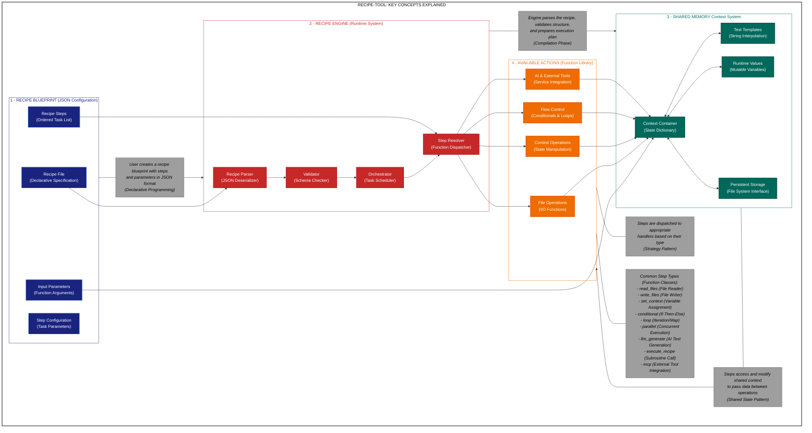
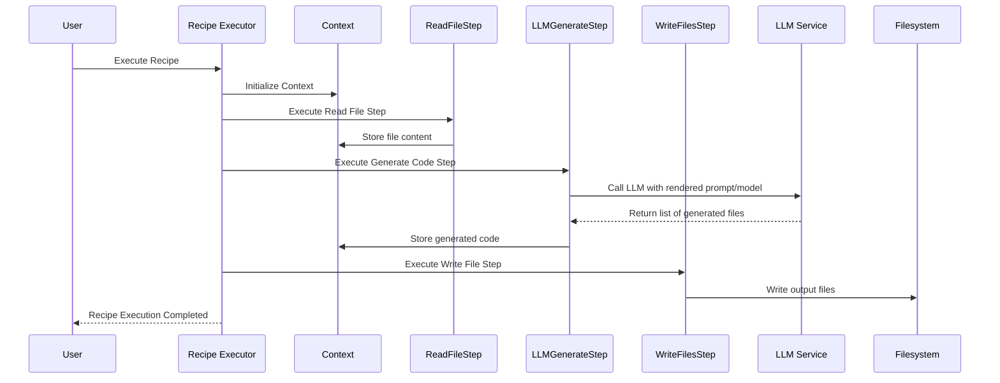

# Diagrams

## Recipe Executor Overview

```mermaid
graph TD
    %% Define styles for educational diagram
    classDef blueprint fill:#1A237E,stroke:#0D47A1,stroke-width:2px,color:white
    classDef engine fill:#C62828,stroke:#B71C1C,stroke-width:2px,color:white
    classDef memory fill:#00695C,stroke:#004D40,stroke-width:2px,color:white
    classDef actions fill:#EF6C00,stroke:#E65100,stroke-width:2px,color:white
    classDef explanation fill:#9E9E9E,stroke:#616161,stroke-width:1px,color:black,font-style:italic

    subgraph RecipeToolConcepts["RECIPE-TOOL: KEY CONCEPTS EXPLAINED"]
        style RecipeToolConcepts fill:#FFF,stroke:#1A1A1A,stroke-width:2px,color:black

        %% 1. The Blueprint Section
        subgraph RecipeBlueprint["1 - RECIPE BLUEPRINT (JSON Configuration)"]
            style RecipeBlueprint fill:none,stroke:#1A237E,stroke-width:1px,color:#1A237E

            recipe["Recipe File<br/>(Declarative Specification)"]:::blueprint
            inputs["Input Parameters<br/>(Function Arguments)"]:::blueprint
            steps["Recipe Steps<br/>(Ordered Task List)"]:::blueprint
            config["Step Configuration<br/>(Task Parameters)"]:::blueprint
        end

        %% 2. The Engine Section
        subgraph SystemEngine["2 - RECIPE ENGINE (Runtime System)"]
            style SystemEngine fill:none,stroke:#C62828,stroke-width:1px,color:#C62828

            parser["Recipe Parser<br/>(JSON Deserializer)"]:::engine
            validator["Validator<br/>(Schema Checker)"]:::engine
            orchestrator["Orchestrator<br/>(Task Scheduler)"]:::engine
            resolver["Step Resolver<br/>(Function Dispatcher)"]:::engine
        end

        %% 3. The Shared Memory Section
        subgraph SharedMemory["3 - SHARED MEMORY Context System"]
            style SharedMemory fill:none,stroke:#00695C,stroke-width:1px,color:#00695C

            context["Context Container<br/>(State Dictionary)"]:::memory
            artifacts["Runtime Values<br/>(Mutable Variables)"]:::memory
            templates["Text Templates<br/>(String Interpolation)"]:::memory
            storage["Persistent Storage<br/>(File System Interface)"]:::memory
        end

        %% 4. The Actions Section
        subgraph AvailableActions["4 - AVAILABLE ACTIONS (Function Library)"]
            style AvailableActions fill:none,stroke:#EF6C00,stroke-width:1px,color:#EF6C00

            fileOps["File Operations<br/>(I/O Functions)"]:::actions
            contextOps["Context Operations<br/>(State Manipulation)"]:::actions
            flowControl["Flow Control<br/>(Conditionals & Loops)"]:::actions
            aiTools["AI & External Tools<br/>(Service Integration)"]:::actions
        end

        %% Flow explanations
        flow1["User creates a recipe blueprint with steps<br/>and parameters in JSON format<br/>(Declarative Programming)"]:::explanation
        flow2["Engine parses the recipe, validates structure,<br/>and prepares execution plan<br/>(Compilation Phase)"]:::explanation
        flow3["Steps access and modify shared context<br/>to pass data between operations<br/>(Shared State Pattern)"]:::explanation
        flow4["Steps are dispatched to appropriate<br/>handlers based on their type<br/>(Strategy Pattern)"]:::explanation

        %% Core Relationships - How the system works
        recipe --> parser
        parser --> validator
        validator --> orchestrator
        orchestrator --> resolver

        inputs --> context
        steps --> resolver

        resolver --> fileOps & contextOps & flowControl & aiTools
        fileOps & contextOps & flowControl & aiTools --> context

        %% Relationship with shared memory
        context <--> templates
        context <--> artifacts
        context <--> storage

        %% Flow explanations
        RecipeBlueprint --- flow1
        flow1 --> SystemEngine
        SystemEngine --- flow2
        flow2 --> SharedMemory
        SharedMemory --- flow3
        flow3 --> AvailableActions
        AvailableActions --- flow4

        %% Step Types Explanation
        stepTypes["Common Step Types (Function Classes):<br/>- read_files (File Reader)<br/>- write_files (File Writer)<br/>- set_context (Variable Assignment)<br/>- conditional (If-Then-Else)<br/>- loop (Iteration/Map)<br/>- parallel (Concurrent Execution)<br/>- llm_generate (AI Text Generation)<br/>- execute_recipe (Subroutine Call)<br/>- mcp (External Tool Integration)"]:::explanation

        AvailableActions --- stepTypes
    end
```

## Code Generation Sequence

```mermaid
sequenceDiagram
    participant U as User
    participant RE as Recipe Executor
    participant Ctx as Context
    participant RFS as ReadFileStep
    participant GLL as LLMGenerateStep
    participant WFS as WriteFilesStep
    participant LLM as LLM Service

    U->>RE: Execute Recipe
    RE->>Ctx: Initialize Context
    RE->>RFS: Execute Read File Step
    RFS->>Ctx: Store file content
    RE->>GLL: Execute Generate Code Step
    GLL->>LLM: Call LLM with rendered prompt/model
    LLM-->>GLL: Return list of generated files
    GLL->>Ctx: Store generated code
    RE->>WFS: Execute Write File Step
    WFS->>Filesystem: Write output files
    RE-->>U: Recipe Execution Completed
```

## Component Code Generation Workflow

```mermaid
flowchart TD
    A["Component Blueprint (spec/docs) Ready"]
    B[Run Create Recipe]
    C[Read Spec File Step]
    D[Read Documentation File Step]
    E[Execute Code Generation Recipe]
    F[Call Generate Code Step]
    G[For Each File in Code Generation Loop]
    H[Aggregate Generated Files]
    I[Run Write File Step]
    J[Write Output Files to Disk]
    K[Run Edit Recipe for Refinement]
    L[Refine Component Code]
    M[Integrate Component Code into Codebase]
    N[Component Build Complete]

    A --> B
    B --> C
    B --> D
    C --> E
    D --> E
    E --> F
    F --> G
    G --> H
    H --> I
    I --> J
    J --> K
    K --> L
    L --> M
    M --> N
```
