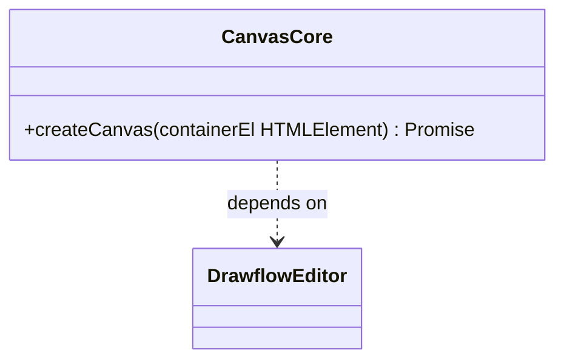
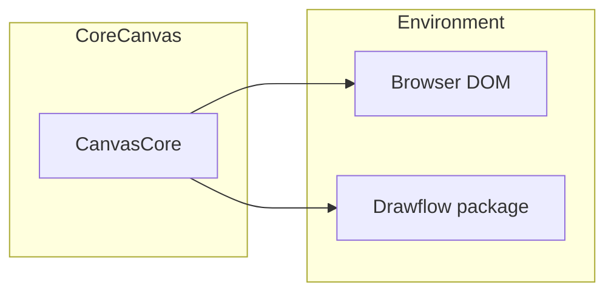

# Canvas Core Component Documentation

## Overview

The **Canvas Core** module initializes and starts a Drawflow editor within a given browser container element. It provides a simple ES module function—`createCanvas`—that encapsulates Drawflow setup: validating inputs, clearing the container, instantiating the editor, and returning the ready-to-use instance. The module imposes no additional UI responsibilities or global state; styling and further configuration are delegated to the consumer.

---

## Importing

```javascript
// ES module import
import createCanvas from 'src/core/canvas.js';
// or named import
import { createCanvas } from 'src/core/canvas.js';
```

> **Note:** You must separately include Drawflow’s CSS in your application, for example:
> ```js
> import 'drawflow/dist/style.css';
> ```

---

## Basic Usage

```html
<!-- HTML -->
<div id="drawflow-container" style="width:800px; height:600px;"></div>
```

```javascript
import createCanvas from 'src/core/canvas.js';

const container = document.getElementById('drawflow-container');

try {
  // Initialize and start the Drawflow editor
  const editor = await createCanvas(container);

  // Use `editor` to add nodes, configure zoom/grid, etc.
  editor.addNode(/* ... */);
} catch (error) {
  console.error('Canvas initialization failed:', error);
}
```

---

## API Reference

### createCanvas(containerEl: HTMLElement) → Promise<DrawflowEditor>

Initializes and starts a Drawflow editor on the given DOM element.

#### Parameters

- **containerEl** (`HTMLElement`): A valid DOM element that is attached to the document. It must have an explicit size (width/height) and be visible before calling `createCanvas`.

#### Returns

- **Promise<DrawflowEditor>**: A promise resolving to the Drawflow editor instance, ready for use.

#### Errors

- **TypeError**: Thrown if `containerEl` is not an instance of `HTMLElement`.
- **Error**: Thrown if `containerEl` is not attached to the document (`element.isConnected === false`).
- **Error**: If the Drawflow library cannot be imported or the editor fails to start, the error is logged with details and then rethrown.

---

## Integration Guidelines

- Ensure the Drawflow CSS (`drawflow/dist/style.css`) is loaded in your application.
- The container element must have explicit CSS dimensions and be visible in the DOM.
- Additional Drawflow configuration—such as zoom level, grid settings, or background—should be applied on the returned `editor` instance:
  ```js
  editor.reroute = true;
  editor.setZoom(1.2, 400, 300);
  editor.drawflow.canvas.style.background = '#f0f0f0';
  ```
- This module is browser-only. Calling `createCanvas` in a non-browser environment (no `window` or `document`) will throw immediately.

---

## Diagrams

### Class Diagram



### Component Diagram



> **Tip:** Use these diagrams to understand how `CanvasCore` interacts with the browser and the Drawflow library. For detailed step-by-step flows, refer to the implementation specification.

---

## Important Notes

- **No UI opinion**: This module does not render toolbars or controls—only the Drawflow canvas. UI controls must be built and wired up by the consumer.
- **Logging**: Uses `console.debug` for initialization steps and `console.info` when setup completes. You can filter these messages via browser dev tools.
- **Error propagation**: Errors during initialization are thrown to the caller; handle them via `try/catch` or promise rejection handlers.
- **No CSS import**: Styling responsibility lies with the consumer; the module does not bundle any Drawflow CSS.
- **Pure ES module**: No global mutable state is introduced; multiple calls to `createCanvas` on different containers are independent.
