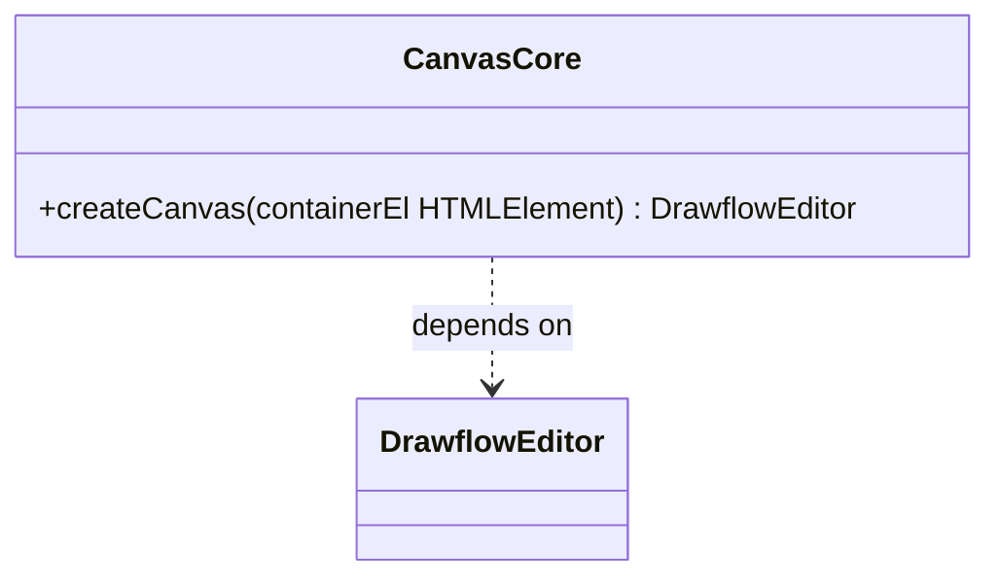
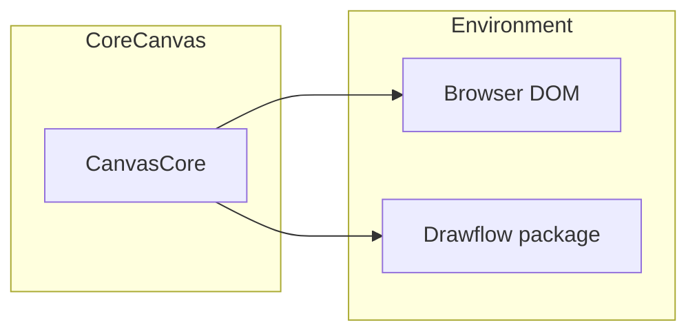
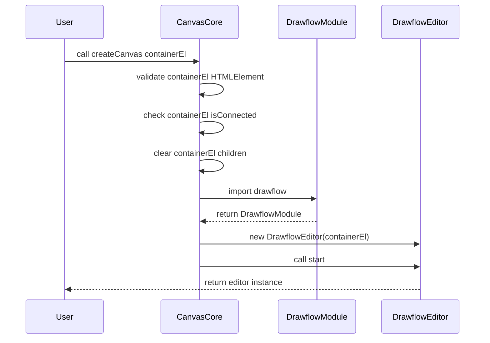
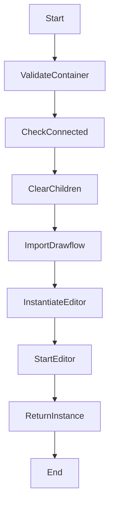

# Canvas Core Component Specification

## Component Title

Canvas Core

## Purpose Statement

Canvas Core initializes and starts a Drawflow editor within a given browser container element. It exports a simple ES module function to encapsulate Drawflow setup—validating inputs, clearing the container, instantiating the editor, and returning the ready-to-use instance—without imposing any additional UI responsibilities or global state.

## Core Requirements

- Import Drawflow from the `drawflow` package using ES module syntax
- Export a function `createCanvas(containerEl: HTMLElement)` as both a named and default export
- Validate that `containerEl` is an instance of `HTMLElement`
- Verify that `containerEl` is attached to the document (DOM) before initializing
- Clear all existing child nodes of `containerEl` to ensure a fresh canvas
- Instantiate a new Drawflow editor on the provided container element
- Invoke `editor.start()` to initialize the Drawflow canvas
- Return the Drawflow editor instance to the caller
- Throw errors on invalid usage or initialization failures

## Implementation Considerations

- Implement as a pure ES module with no global mutable state
- Use both named export (`export function createCanvas`) and default export for convenience
- Include JSDoc type annotations in `canvas.js` and provide a companion TypeScript declaration file `canvas.d.ts`
- Use `console.debug` and `console.info` for logging; do not introduce a custom logger dependency
- Perform runtime checks: `instanceof HTMLElement` and `element.isConnected`
- Catch and handle import or instantiation errors, logging details before rethrowing
- Do not import Drawflow’s CSS; styling responsibilities lie with the consumer or higher-level UI modules
- Delegate any additional Drawflow configuration (zoom, grid settings, background) to callers
- Ensure the module only runs in a browser environment; detect absence of `window` or `document` and throw

## Component Dependencies

### Internal Components

None

### External Libraries

- **drawflow** (Required) – Uses Drawflow for editor instantiation and canvas operations

### Configuration Dependencies

None

## Output Files

- `src/core/canvas.js` – Main ES module implementing `createCanvas` to initialize and start a Drawflow canvas.
- `src/core/canvas.d.ts` – TypeScript declaration file for `createCanvas`, exposing the correct function signature and Drawflow return type.

## Logging

### Debug

- Validating provided container element
- Container is a valid HTMLElement
- Checking container is attached to the document
- Clearing container children
- Importing Drawflow library
- Drawflow library imported successfully
- Instantiating Drawflow editor
- Calling `editor.start()`
- Drawflow editor started successfully

### Info

- Canvas Core: createCanvas completed and editor instance returned

## Error Handling

- **InvalidContainerElement**: The provided container element is not a valid HTMLElement. Recovery: Throw a `TypeError` to signal incorrect usage.
- **ContainerNotInDOM**: The provided container element is not attached to document. Recovery: Throw an `Error` to signal incorrect DOM context.
- **DrawflowInitializationError**: Failed to import or initialize Drawflow editor. Recovery: Use `console.error` to log details, then rethrow the original error.

## Dependency Integration Considerations

- Ensure the `drawflow` NPM package is installed at version `^1.0.0` to maintain compatibility
- Import Drawflow using ES module syntax: `import Drawflow from 'drawflow'`
- Consumer must include Drawflow CSS (e.g., `import 'drawflow/dist/style.css'`) separately
- Container must have explicit size and be visible in the DOM before calling `createCanvas`
- Module is browser-only; unsupported in server-side or headless contexts
- No adapter layers—use Drawflow API directly
- Bundlers should be configured to handle ES module imports of `drawflow`

## Diagrams

Below are all diagrams related to Canvas Core for implementer context. These diagrams are not part of the public docs but illustrate internal structure and flow.

### Class Diagram

Illustrates the Canvas Core module with its `createCanvas` operation and its dependency on the Drawflow editor class.



### Component Diagram

Shows the Canvas Core component, the browser DOM, and the external Drawflow dependency.



### Sequence Diagram

Describes the runtime sequence when `createCanvas` is invoked.



### Activity Diagram

Flows through the key steps inside `createCanvas`.



### Package Diagram

Groups core code and external dependencies into packages.

```mermaid
classDiagram
  package CoreModule {
    class CanvasCore
  }
  package External {
    class Drawflow
    class HTMLElement
  }
  CanvasCore --> Drawflow
  CanvasCore --> HTMLElement
```
