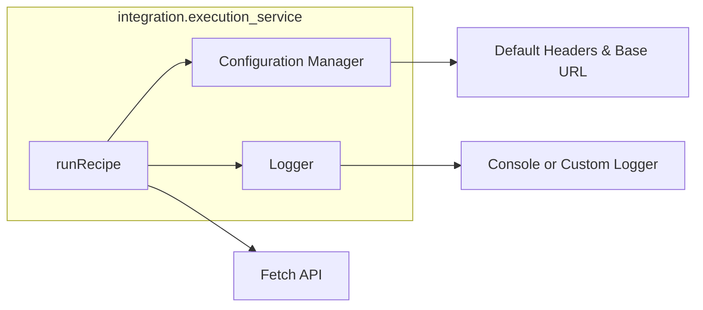
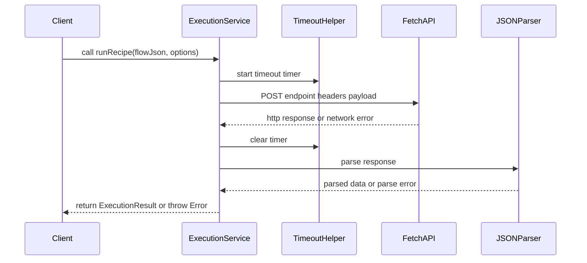

# Execution Service Integration

Provides a minimal ES module interface for submitting a recipe flow JSON to a backend execution API.

## Importing

```js
import { runRecipe, setBaseUrl, setLogger } from 'src/integration/execution_service';
```

## Configuration

By default, `runRecipe` POSTs to `/api/execute` and logs via `console`. You can adjust these settings globally:

### setBaseUrl(url: string)

Override the default endpoint for all subsequent calls.

```js
setBaseUrl('https://your-api.example.com/execute');
```

### setLogger(logger: Logger)

Provide a custom logger with `debug()` and `info()` methods.

```js
const myLogger = {
  debug: (...args) => /* your debug implementation */,
  info:  (...args) => /* your info implementation */,
};
setLogger(myLogger);
```

## API Reference

### runRecipe(flowJson: object, options?: RequestOptions) ⇒ Promise<ExecutionResult>

Submit a recipe flow to the execution API and receive structured results.

#### Parameters

- **flowJson** (object, required): The recipe definition as a JSON-compatible object.
- **options** (object, optional): Request customization:
  - **baseUrl** (string): Override the endpoint URL for this call.
  - **headers** (Record<string,string>): Additional HTTP headers (e.g., `{ Authorization: 'Bearer TOKEN' }`).
  - **timeout** (number): Timeout in milliseconds before rejecting with a `TimeoutError`.
  - **signal** (AbortSignal): AbortSignal to cancel the request.
  - **fetchOptions** (object): Extra options passed directly to `fetch()`.
  - **returnRawResponse** (boolean): If true, resolves with `{ response, data }` where `response` is the raw `Response` object.

#### Returns

A `Promise` that resolves to an **ExecutionResult**:

```ts
interface ExecutionResult {
  status: number;
  headers: Record<string,string>;
  data: any | null; // null when server returns 204 No Content
}
```

#### Errors

The promise rejects with one of:

- **NetworkError**: Failed to send the request (e.g., DNS failure).
- **HTTPError**: Non-2xx response. Contains `status` and `statusText`.
- **TimeoutError**: Request exceeded the specified `timeout`.
- **AbortError**: Request was aborted via `signal`.
- **ResponseParseError**: Failed to parse JSON response.


## Usage Examples

### 1. Basic Execution

```js
const recipe = { steps: [ /* ... */ ] };

runRecipe(recipe)
  .then(result => console.log('Execution succeeded:', result))
  .catch(err => console.error('Execution failed:', err));
```

### 2. Custom Headers and Timeout

```js
runRecipe(recipe, {
  headers: { Authorization: 'Bearer abc123' },
  timeout: 10_000,      // 10 seconds
})
  .then(result => {
    // handle result.data
  })
  .catch(err => {
    if (err.name === 'TimeoutError') {
      // retry or inform user
    }
  });
```

### 3. Request Cancellation

```js
const controller = new AbortController();

runRecipe(recipe, { signal: controller.signal })
  .catch(err => {
    if (err.name === 'AbortError') {
      console.log('Request was cancelled');
    }
  });

// Cancel later
controller.abort();
```

## Integration Guidelines

- Ensure the backend endpoint (`/api/execute`) is CORS-enabled and allows custom headers.
- Use `options.headers` or global default headers to pass authentication tokens.
- Match the JSON schema of `flowJson` with the server’s expected format.

## Diagrams

### Component Overview



### Sequence of a runRecipe Call



## Important Notes

- **204 No Content**: When the server responds with 204, `data` is `null`.
- **Raw Response**: Use `returnRawResponse` to access streaming or advanced response handling in the future.
- **Logging**: By default, `debug` and `info` logs go to `console`; inject your own logger for production.
- **Error Handling**: Always catch and inspect `err.name` to differentiate error types.
