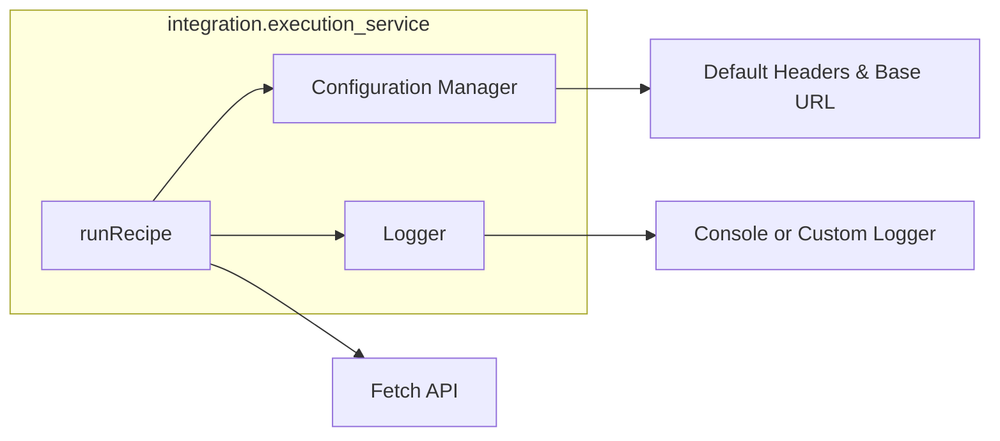
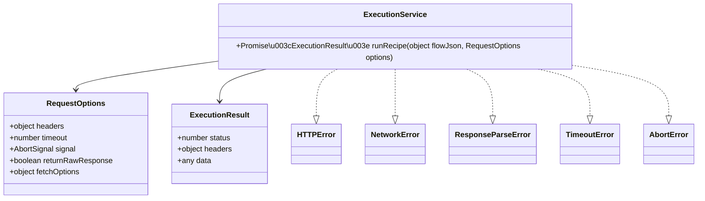
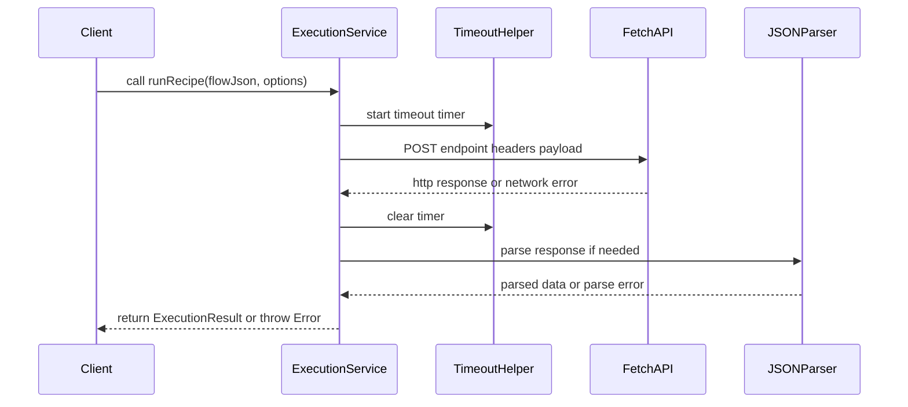
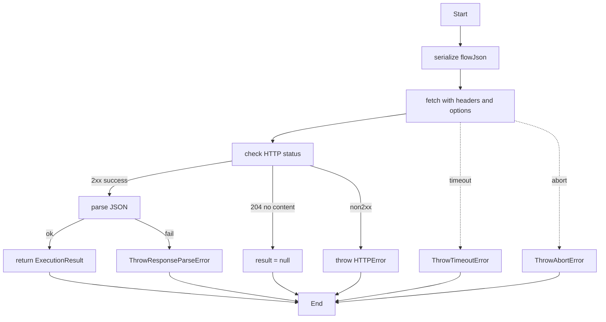

# Execution Service Integration Specification

## Component Title

Execution Service Integration

## Purpose Statement

Provides a minimal ES module interface for submitting a recipe flow JSON to a backend execution API. Exposes a single `runRecipe` function that POSTs the recipe to a configurable endpoint, handles request customization (headers, timeout, cancellation), and returns structured execution results or throws descriptive errors.

## Core Requirements

- Export a `runRecipe(flowJson: object, options?: RequestOptions)` function that returns a `Promise<ExecutionResult>`
- Perform an HTTP POST to a configurable endpoint (default `/api/execute`) with `Content-Type: application/json`
- Serialize the provided `flowJson` payload correctly
- Accept optional parameters for custom headers, `AbortSignal`, timeout, and additional fetch options
- Handle non-2xx HTTP responses by rejecting the Promise with an `HTTPError` containing `status` and `statusText`
- Parse and return the JSON response body on success, resolving with an `ExecutionResult` containing `status`, `headers`, and `data`
- Resolve with `null` data when the server responds with `204 No Content`
- Gracefully handle network failures by rejecting with `NetworkError`
- Gracefully handle JSON parsing failures by rejecting with `ResponseParseError`
- Support request cancellation via `AbortSignal`

## Implementation Considerations

- Use the native `fetch` API in a browser environment with no additional dependencies
- Allow the endpoint URL (`baseUrl`) to be configured via module-level setter or passed in options
- Merge default headers with `options.headers`, supporting extension for authentication tokens
- Wrap `fetch` in a timeout helper that rejects with `TimeoutError` after the specified timeout
- Accept an `AbortSignal` in options to allow request cancellation
- Provide an optional `returnRawResponse` flag in options to expose the raw `Response` or its `ReadableStream` for future streaming support
- Log via `console` by default; allow injection of a custom logger instance through module configuration or options
- Keep the module as a pure ES module with a single exported `runRecipe` function

## Component Dependencies

### Internal Components

None

### External Libraries

None

### Configuration Dependencies

None

## Output Files

- `src/integration/execution_service.js` - ES module implementing `runRecipe` with configurable endpoint, headers, timeout, and cancellation support
- `src/integration/types.js` - Type definitions: `RequestOptions`, `ExecutionResult`, and custom Error classes

## Logging

- Debug:
  - Log initiation of recipe execution with URL, headers, and serialized payload
  - Log HTTP response status and headers upon receipt
- Info:
  - Log start of recipe execution request
  - Log successful completion of recipe execution including status code

## Error Handling

- NetworkError:
  - Message: `Failed to send execution request due to network issues`
  - Recovery Action: Notify the user of network failure and allow retry
- HTTPError:
  - Message: `Execution API returned non-OK status code`
  - Recovery Action: Reject with status and statusText so UI can display appropriate error message
- ResponseParseError:
  - Message: `Failed to parse execution API JSON response`
  - Recovery Action: Log raw response body for debugging and reject with parsing error
- TimeoutError:
  - Message: `Execution request timed out`
  - Recovery Action: Allow user to retry or increase timeout setting
- AbortError:
  - Message: `Execution request was aborted`
  - Recovery Action: Handle cancellation gracefully in calling code

## Dependency Integration Considerations

- Ensure the backend `/api/execute` endpoint is CORS-enabled and supports preflight for custom headers
- Coordinate with the authentication module to supply auth tokens via default or per-request headers
- Match request and response JSON schemas with the serialization module output
- No additional integration dependencies required beyond standard fetch compatibility

## Diagrams

### Component Diagram
Shows the high-level Integration Service component with its collaborators (configuration, logger, fetch/timeouts).

### Class Diagram
Defines the main module class, its input/output types, and custom error classes.

### Sequence Diagram
Illustrates the runRecipe call flow from the client through fetch, timeout handling, parsing and back.

### Activity Diagram
Shows the internal workflow of runRecipe, including success, error, timeout, and abort paths.

