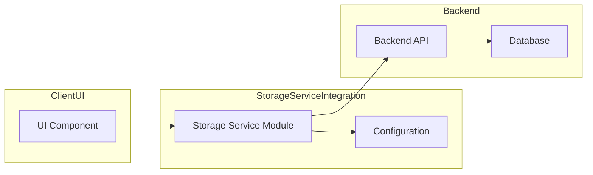

# Storage Service Integration Usage

## Overview

The **Storage Service Integration** module provides functions for saving and loading user-created flow definitions via HTTP. It enables the UI to persist and retrieve flow JSON by ID against a configurable backend API.

## Installation & Import

```javascript
// ES module import
import {
  saveFlow,
  loadFlow,
  setBaseURL
} from 'src/integration/storage_service';
```

## Configuration

### Environment Variables

– **STORAGE_SERVICE_BASE_URL** (Optional)
  - Description: Base URL for the backend API.
  - Format: string (e.g. `"/api"`, `"https://example.com/api"`).
  - Default: `"/api"` if not set.

– **AUTH_TOKEN** (Optional)
  - Description: Bearer token for authorization header.
  - Format: string.
  - Default: None. If absent, requests will use `credentials: 'include'` (cookies).

### Runtime Override

You can override the base URL at runtime:

```javascript
setBaseURL('https://staging.example.com/api');
```

## Component Interaction Diagram

This diagram shows how the Storage Service module interacts with the UI, configuration, and backend API:



## Basic Usage

### Saving a Flow

```javascript
const flowId = 'user-flow-123';
const flowJson = { nodes: [...], edges: [...] };

try {
  await saveFlow(flowId, flowJson);
  console.log('Flow saved successfully:', flowId);
} catch (err) {
  console.error('Failed to save flow:', err);
}
```

### Loading a Flow

```javascript
const flowId = 'user-flow-123';

try {
  const loaded = await loadFlow(flowId);
  if (loaded === null) {
    console.log('No flow found for ID:', flowId);
  } else {
    console.log('Loaded flow JSON:', loaded);
  }
} catch (err) {
  console.error('Failed to load flow:', err);
}
```

## API Reference

### setBaseURL(url: string): void

Overrides the base URL used for subsequent save and load requests.

- **Parameters**:
  - `url` (string): Full base URL of the backend API.

- **Returns**: `void`

- **Example**:
  ```javascript
  setBaseURL('https://api.myapp.com/v1');
  ```

---

### saveFlow(id: string, flowJson: object): Promise<void>

Sends a `PUT` request to save or update a flow definition.

- **Parameters**:
  - `id` (string): Unique flow identifier.
  - `flowJson` (object): Flow definition JSON.

- **Returns**: `Promise<void>`

- **Errors**:
  - `NetworkError` &mdash; When a network error occurs.
  - `TimeoutError` &mdash; When the request exceeds the default timeout (30 000 ms).
  - `HTTPError` &mdash; When the response status is not in the 200–299 range.

- **Usage Example**:
  ```javascript
  await saveFlow('flow-456', myFlowObject);
  ```

---

### loadFlow(id: string): Promise<object | null>

Fetches a flow definition by ID.

- **Parameters**:
  - `id` (string): Unique flow identifier.

- **Returns**: `Promise<object | null>`
  - Resolves to the parsed flow JSON object if found.
  - Resolves to `null` if the server returns no content (e.g. 204) or an empty body.

- **Errors**:
  - `NetworkError` &mdash; When a network issue occurs.
  - `TimeoutError` &mdash; When the request exceeds the default timeout (30 000 ms).
  - `HTTPError` &mdash; When the response status is not in the 200–299 range (excluding 204).
  - `ParseError` &mdash; When JSON parsing fails.

- **Usage Example**:
  ```javascript
  const flow = await loadFlow('flow-456');
  ```

## Error Types

The following error classes may be thrown by `saveFlow` and `loadFlow`:

- **NetworkError**: Issues with connectivity or DNS.
- **TimeoutError**: Request exceeded the configured timeout.
- **HTTPError**: Non-2xx HTTP response status.
- **ParseError**: Malformed JSON in response (only in `loadFlow`).

## Integration Guidelines

- Ensure your backend supports CORS for your UI origin and allows `Content-Type` and `Authorization` headers.
- Provide an `AUTH_TOKEN` environment variable for bearer token authorization, or rely on cookies by omitting `AUTH_TOKEN`.
- Use `credentials: 'include'` to allow cookie-based auth when no token is present.
- Coordinate with the backend team to host the `PUT /flows/{id}` and `GET /flows/{id}` endpoints.

## Important Notes

- **Default Timeout**: 30 000 ms. Adjust by creating your own wrapper if you need a different timeout.
- **Content-Type**: Always `application/json`.
- **URL Encoding**: Flow IDs are URL-encoded to safely handle special characters.
- **Pure Functions**: All exported methods are pure and return Promises.

---

*This documentation file is a stable contract for consumers of the Storage Service Integration module. Implementation details and internal diagrams remain in the specification document.*