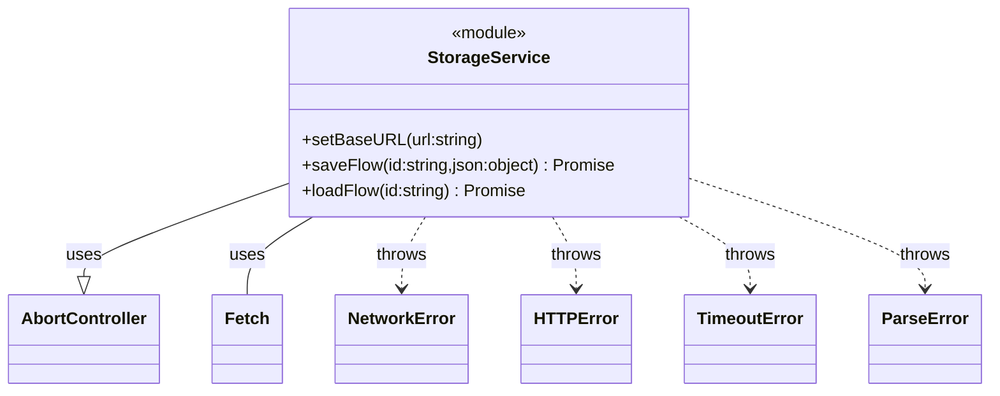
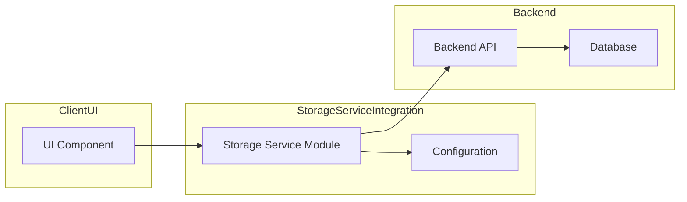
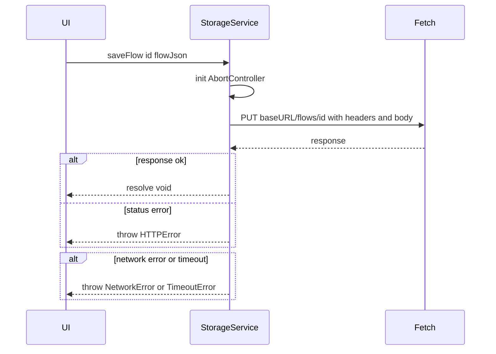
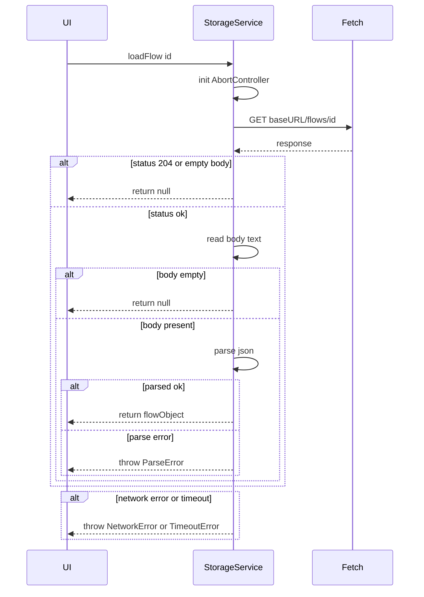
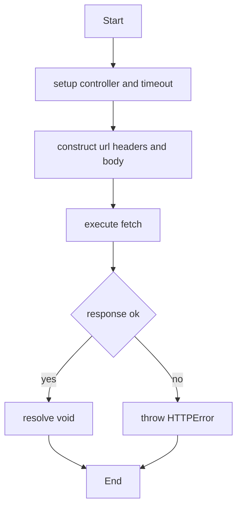
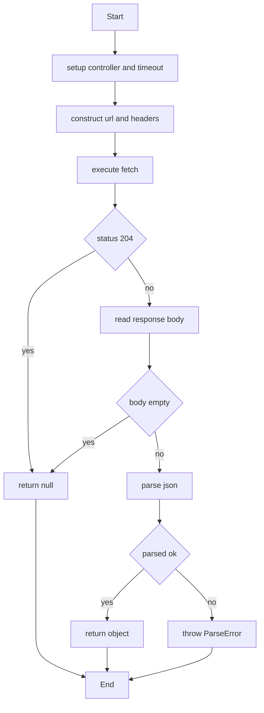
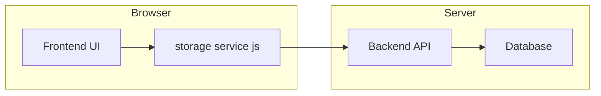

# Storage Service Integration Specification

## Purpose Statement

Provides functions for saving and loading user-created flow definitions via HTTP, enabling the UI to persist and retrieve flow JSON by ID against a configurable backend API.

## Core Requirements

- Configure a base URL for the backend API, defaulting to `/api` and overridable via the `STORAGE_SERVICE_BASE_URL` environment variable
- Export async `saveFlow(id: string, flowJson: object): Promise<void>` that sends a PUT request to `{baseURL}/flows/{id}` with a JSON payload
- Export async `loadFlow(id: string): Promise<object | null>` that sends a GET request to `{baseURL}/flows/{id}`, parses JSON, and returns the result or null on empty body
- Include `Content-Type: application/json` and an Authorization header with a bearer token from `AUTH_TOKEN` if provided; support credentials via cookies when `AUTH_TOKEN` is absent
- Implement request timeouts (default 30 000 ms) using `AbortController`
- Validate `response.ok` and throw `HTTPError` on non-2xx statuses
- Detect network errors and timeout errors and throw descriptive `NetworkError` or `TimeoutError`
- Detect JSON parse failures on `loadFlow` and throw `ParseError`
- If `loadFlow` receives an empty response body, resolve with `null` instead of throwing

## Implementation Considerations

- Use the browser `fetch` API with `AbortController` for timeouts (default 30 000 ms)
- Read `STORAGE_SERVICE_BASE_URL` from environment (`process.env.STORAGE_SERVICE_BASE_URL`) or default to `/api`; allow runtime override by exporting a `setBaseURL(url: string)` helper
- Read `AUTH_TOKEN` from environment (`process.env.AUTH_TOKEN`) for bearer authentication; if absent, rely on `credentials: 'include'` for cookie-based auth
- Construct request URLs as ```${baseURL}/flows/${encodeURIComponent(id)}```
- Always set headers: `{ "Content-Type": "application/json", "Authorization": `Bearer ${token}` }` when token is present
- Use `credentials: 'include'` and `mode: 'cors'` for fetch requests
- Stringify `flowJson` in `saveFlow`; await `fetch` and then check `response.ok`
- On `loadFlow`, if status `204` or `response.text()` yields empty string, return `null`; otherwise call `response.json()` to parse
- Throw custom Error subclasses (`NetworkError`, `HTTPError`, `ParseError`, `TimeoutError`) with clear messages; keep functions pure and return Promises

## Component Dependencies

### Internal Components

None

### External Libraries

None

### Configuration Dependencies

- **STORAGE_SERVICE_BASE_URL** - (Optional) Base URL for the backend API. Format: string. Default: `/api`.
- **AUTH_TOKEN** - (Optional) Bearer token for authorization. When absent, requests use credentials (cookies).

## Output Files

- `src/integration/storage_service.js` - ES module exporting `saveFlow` and `loadFlow` functions with configurable base URL, authentication, headers, timeout, and error handling

## Logging

### Debug

- Using base URL: `{baseURL}`
- Initiating `saveFlow` request for id `{id}` to `{url}` with payload: `{flowJson}`
- Received `saveFlow` response for id `{id}`: status `{status}`
- Initiating `loadFlow` request for id `{id}` to `{url}`
- Received `loadFlow` response for id `{id}`: status `{status}`
- Parsed `loadFlow` response for id `{id}`: `{parsedJson}`

### Info

- Flow saved successfully for id `{id}`
- Flow loaded successfully for id `{id}`

## Error Handling

- **NetworkError**: `Network error occurred while saving flow {id}: {error}`. Recovery: Check network connectivity and retry the request.
- **HTTPError**: `Failed to save flow {id}: received status {status}`. Recovery: Verify flow ID and permissions; retry operation.
- **TimeoutError**: `Request timed out after {timeout} ms while saving flow {id}`. Recovery: Consider increasing timeout or checking server performance.
- **NetworkError**: `Network error occurred while loading flow {id}: {error}`. Recovery: Check network connectivity and retry the request.
- **HTTPError**: `Failed to load flow {id}: received status {status}`. Recovery: Verify flow ID and endpoint availability.
- **ParseError**: `Failed to parse flow JSON for id {id}: {error}`. Recovery: Ensure the server returned valid JSON.
- **TimeoutError**: `Request timed out after {timeout} ms while loading flow {id}`. Recovery: Consider increasing timeout or checking server performance.

## Dependency Integration Considerations

- Ensure backend CORS configuration allows requests from the UI origin with required headers
- Coordinate with backend to support flows endpoints at `{baseURL}/flows` and HTTP PUT/GET methods
- Provide `AUTH_TOKEN` via environment or rely on cookie-based auth under `credentials: 'include'`
- Use consistent base URL configuration across development, staging, and production environments
- Document required environment variables and default values

## Diagrams

### Class Diagram

Class diagram of the Storage Service Integration module with its methods and custom error classes



### Component Diagram

Component interactions of the storage service with configuration and the backend API



### Sequence Diagram - saveFlow

Sequence of calls and responses in the saveFlow function



### Sequence Diagram - loadFlow

Sequence of calls and conditional logic in the loadFlow function



### Activity Diagram - saveFlow

Activity flow for the saveFlow operation



### Activity Diagram - loadFlow

Activity flow for the loadFlow operation with decision points



### Deployment Diagram

Deployment of the storage service client, frontend UI, and backend API

