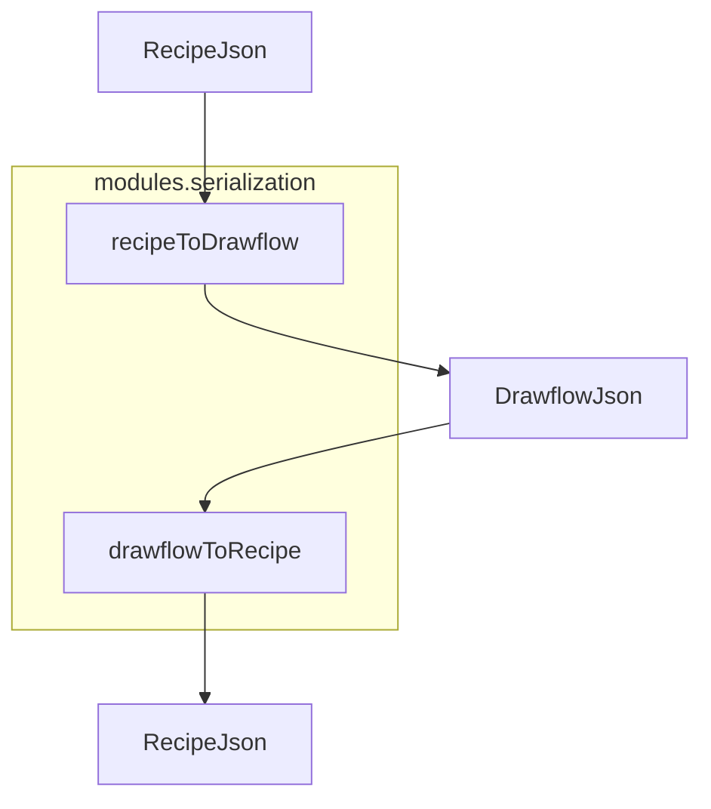
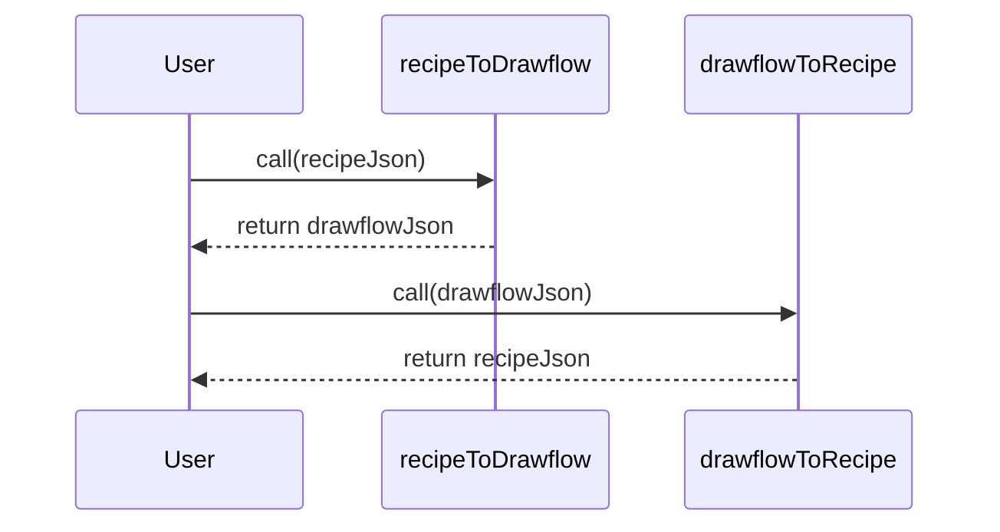

# Serialization Module Documentation

## Overview

The **Serialization Module** provides two pure, side-effect-free functions:

- `recipeToDrawflow(recipeJson: object) → object`
- `drawflowToRecipe(flowJson: object) → object`

These functions convert between the recipe DSL JSON format and the Drawflow editor JSON format in a lossless, round-trip fashion. Only layout and UI metadata are stripped during conversion; node types and configuration data are preserved.

## Component Diagram



## Sequence Diagram (Round-Trip)



## Installation / Importing

```javascript
// If using ES modules
import { recipeToDrawflow, drawflowToRecipe } from 'src/modules/serialization';

// If using CommonJS
const { recipeToDrawflow, drawflowToRecipe } = require('src/modules/serialization');
```

## Basic Usage

### Converting a Recipe to Drawflow JSON
```javascript
const recipe = {
  steps: [
    { type: 'read_file', config: { path: 'input.txt' } },
    { type: 'transform', config: { operation: 'uppercase' } }
  ]
};

const drawflowJson = recipeToDrawflow(recipe);
console.log(JSON.stringify(drawflowJson, null, 2));
```

### Converting a Drawflow JSON Back to a Recipe
```javascript
const flowJson = {
  drawflow: {
    Home: {
      data: {
        "1": {
          id: 1,
          name: 'read_file',
          data: { config: { path: 'input.txt' } }
        },
        "2": {
          id: 2,
          name: 'transform',
          data: { config: { operation: 'uppercase' } }
        }
      }
    }
  }
};

const roundTripped = drawflowToRecipe(flowJson);
console.log(roundTripped);
// { steps: [ { type: 'read_file', config: { path: 'input.txt' } }, ... ] }
```

## API Reference

### recipeToDrawflow(recipeJson: object): object

**Description**
Converts a recipe DSL object (`{ steps: Array<{ type: string; config: object }> }`) into a Drawflow-compatible JSON structure. All nodes are placed in a single module named `Home`, with positions and IDs computed automatically.

**Parameters**
- `recipeJson` (object): Must contain a top-level `steps` array of step objects.

**Returns**
- A Drawflow JSON object with shape:
  ```js
  {
    drawflow: {
      Home: {
        data: {
          [id: string]: {
            id: number,
            name: string,
            data: object,
            pos_x: number,
            pos_y: number,
            inputs: {},
            outputs: {}
          }
        }
      }
    }
  }
  ```

**Errors**
- `TypeError` if `recipeJson` is not an object with a valid `steps` array.
- `Error` if an unknown node type is encountered during conversion.

**Notes**
- Positions are computed as `pos_x = index * 200`, `pos_y = 100`.
- Node IDs start at 1 and increment by 1.
- Only `{ type, config }` fields are preserved; layout/UI metadata is stripped.

---

### drawflowToRecipe(flowJson: object): object

**Description**
Converts a Drawflow JSON structure back into the recipe DSL format (`{ steps: Array<{ type: string; config: object }> }`). Known layout/UI metadata fields are discarded; other fields in each node’s `data` object are preserved under `config`.

**Parameters**
- `flowJson` (object): Must have a top-level `drawflow` property mapping module names to node data objects.

**Returns**
- A recipe DSL object:
  ```js
  { steps: Array<{ type: string; config: object }> }
  ```

**Errors**
- `TypeError` if `flowJson` is not an object with a `drawflow` property.

**Notes**
- Modules are iterated in insertion (or alphabetical) order.
- Nodes within each module are flattened in numeric ID order.
- Known metadata fields removed: `pos_x`, `pos_y`, `html`, `class`, `inputs`, `outputs`, `typenode`.
- Any other fields under `node.data` are preserved in `config`.
- Throws `Error` for unknown node types if they cannot be mapped.

## Round-Trip Fidelity

Calling:
```js
const backToRecipe = drawflowToRecipe(recipeToDrawflow(originalRecipe));
```
will produce a deeply equal object to `originalRecipe`.

## Important Notes

- Both functions perform deep clones of inputs to avoid mutation.
- No I/O or external side-effects are performed.
- Debug messages are logged via `console.debug`; warnings via `console.warn`.
- Ensure error handling by wrapping calls in `try/catch` when user input may be malformed.

## Version Compatibility

- This documentation corresponds to the initial v1.0.0 release of the Serialization Module.
- Future releases will maintain API stability unless noted otherwise.
