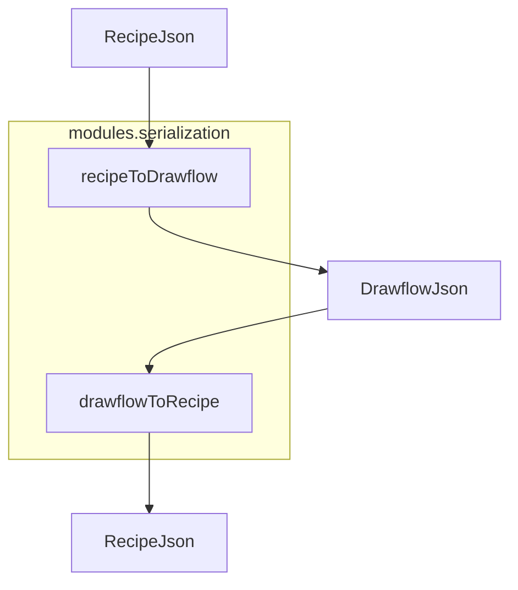
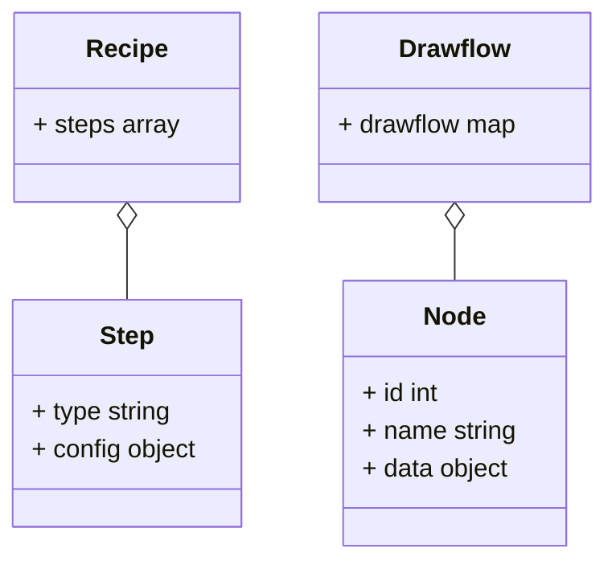
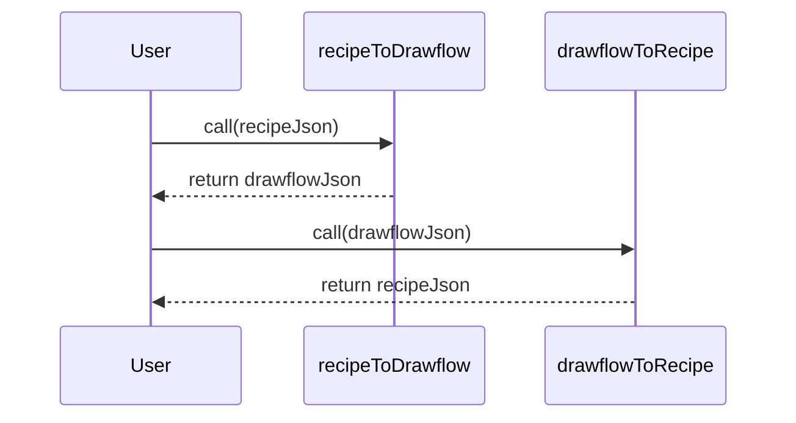
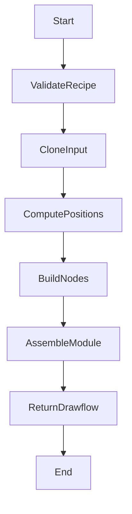
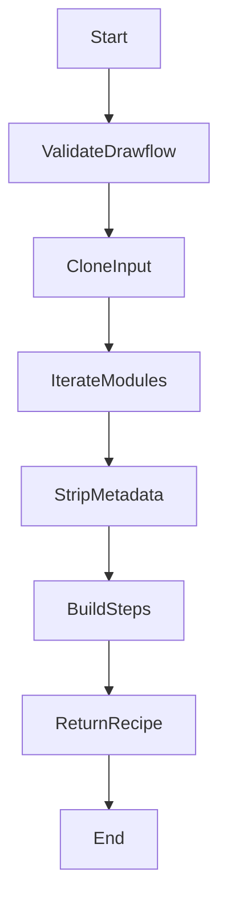

# Serialization Module Specification

## Purpose

Provides two pure, side-effect-free functions to convert between the recipe DSL JSON format and Drawflow editor JSON. Ensures a lossless round-trip mapping of node type and configuration, stripping only layout and UI metadata, so that converting in one direction and back yields the original data.

## Core Requirements

- Export a function `recipeToDrawflow(recipeJson: object) → object` that takes a recipe DSL object of schema `{ steps: Array<{ type: string; config: object }> }` and returns a Drawflow JSON structure `{ drawflow: { [moduleName: string]: { data: { [id: string]: Node } } } }`.
- Export a function `drawflowToRecipe(flowJson: object) → object` that takes a Drawflow JSON structure with a top-level `drawflow` key and returns a recipe DSL object of the form `{ steps: Array<{ type: string; config: object }> }`.
- `recipeToDrawflow` must group all nodes into a single default module named `Home`, compute node positions at `pos_x = index * 200` and `pos_y = 100`, assign incremental integer IDs starting at 1, set empty `inputs` and `outputs` maps, and preserve only `{ name, data.config }` as `{ type, config }` in the recipe.
- `drawflowToRecipe` must iterate modules in insertion order (or alphabetical if insertion order unavailable), flatten all nodes into the `steps` array in the order encountered, strip known UI/layout metadata keys (`pos_x`,`pos_y`,`html`,`class`,`inputs`,`outputs`, and `typenode`), preserve unknown fields under `config`, and validate required properties.
- Both functions must accept and return plain JavaScript objects, perform no I/O, and not mutate their inputs. Use deep cloning to avoid mutation.
- Validate at function start: for `recipeToDrawflow`, ensure `recipeJson` is an object with a `steps` array of objects with `type` (string) and `config` (object); for `drawflowToRecipe`, ensure `flowJson` is an object with a `drawflow` property mapping module names to node data objects.
- Throw descriptive built-in errors for malformed input: use `TypeError` when the overall structure is wrong and `Error` for unknown node types encountered during conversion.
- Ensure `drawflowToRecipe(recipeToDrawflow(recipe))` returns a deeply equal recipe object to the input, verifying round-trip fidelity.
- Maintain step ordering consistent with the recipe array or module node ordering.

## Implementation Considerations

- Implement as two pure ES module functions (`export function recipeToDrawflow` and `export function drawflowToRecipe`) without side effects.
- Use `structuredClone` if available, otherwise fallback to `JSON.parse(JSON.stringify(...))` for deep cloning.
- In `recipeToDrawflow`, default module name is `Home`. All nodes go into that single module.
- Compute node positions with constants: `const H_SPACING = 200; const V_OFFSET = 100; pos_x = idx * H_SPACING; pos_y = V_OFFSET;`.
- Generate node IDs as sequential integers (starting at 1) or use `useuuid` flag if provided (see future extension).
- In `drawflowToRecipe`, iterate `Object.entries(flowJson.drawflow)` in insertion order; within each module, iterate `Object.values(module.data)` in numeric ID order.
- Strip only known UI/layout metadata keys (`pos_x`,`pos_y`,`html`,`class`,`inputs`,`outputs`,`typenode`). Preserve any other `node.data` fields under the returned step’s `config` object.
- Validate inputs at the top of each function, throwing exactly the specified `TypeError` messages.
- Log debugging messages via `console.debug` and warnings via `console.warn` (no injected logger).
- For unknown Drawflow metadata fields in `drawflowToRecipe`, call `console.warn` with message `Unknown Drawflow metadata field '{{fieldName}}' will be discarded.`.
- Write unit tests in Jest covering round-trip scenarios, empty recipes, unknown node types, missing fields, and grid spacing correctness.

## Component Dependencies

### Internal Components

**None**

### External Libraries

**None**

### Configuration Dependencies

**None**

## Output Files

- `src/modules/serialization.js` - Main ES module exporting `recipeToDrawflow` and `drawflowToRecipe` functions.
- `tests/serialization.spec.js` - Unit tests for ensuring round-trip conversions, input validation errors, metadata stripping, and position calculations.

## Logging

### Debug

- Starting recipeToDrawflow: received recipe with {stepCount} steps
- Mapped recipe step {stepIndex} of type '{type}' to Drawflow node with id {nodeId}
- Completed recipeToDrawflow: generated {nodeCount} nodes under module 'Home'
- Starting drawflowToRecipe: received Drawflow JSON with modules {moduleCount}
- Mapped Drawflow node {nodeId} (name '{name}') to recipe step {stepIndex}
- Completed drawflowToRecipe: generated {stepCount} steps

### Info

**None**

## Error Handling

- TypeError: Input to recipeToDrawflow must be a valid recipe object with a 'steps' array
  - Recovery: Verify that the recipe JSON conforms to the expected DSL schema and includes a 'steps' array.
- TypeError: Input to drawflowToRecipe must be a valid Drawflow object with a 'drawflow' property
  - Recovery: Ensure that the flow JSON was exported from Drawflow and contains the top-level 'drawflow' key.
- Error: Unknown node type '{nodeName}' encountered during conversion
  - Recovery: Register or map the missing node type in the serialization logic to handle this node.

## Dependency Integration Considerations

- Keep this module in sync with `/nodes/*` registrations: update serialization mappings when new node types are added.
- Avoid coupling to Drawflow internals; rely only on Drawflow's documented export format.
- Coordinate with UI import/export buttons in `toolbox_shell.js` to ensure serialization functions handle the same JSON shape.

## Diagrams

### Component Diagram

Shows the modules.serialization component with its two exported functions and the data flow between them.

### Class Diagram

Describes the core data structures used by the serialization module.

### Sequence Diagram

Illustrates the roundtrip conversion sequence between recipeToDrawflow and drawflowToRecipe.

### Activity Diagram for recipeToDrawflow

Outlines the main steps in the recipeToDrawflow function.

### Activity Diagram for drawflowToRecipe

Outlines the main steps in the drawflowToRecipe function.

