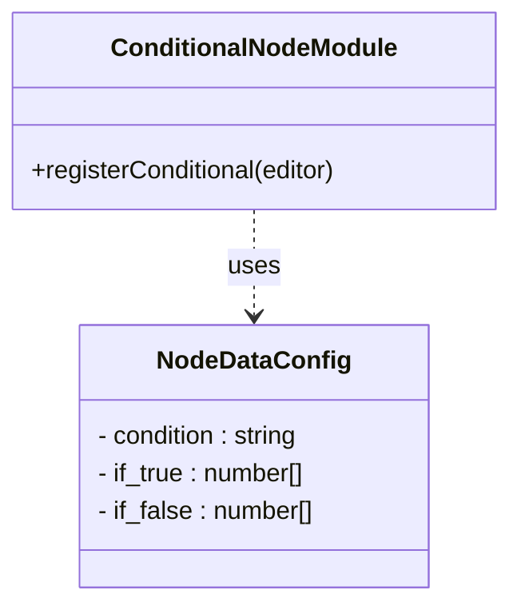
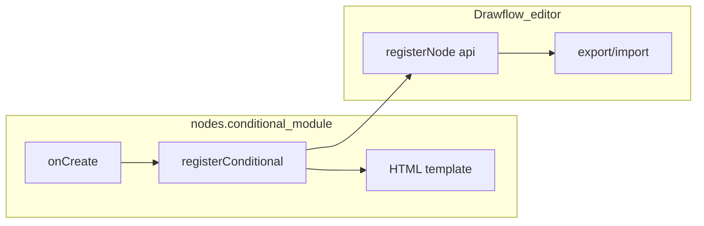
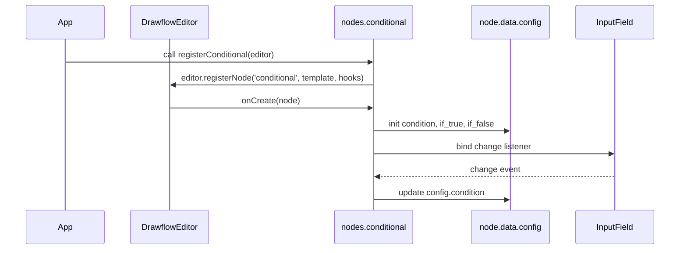
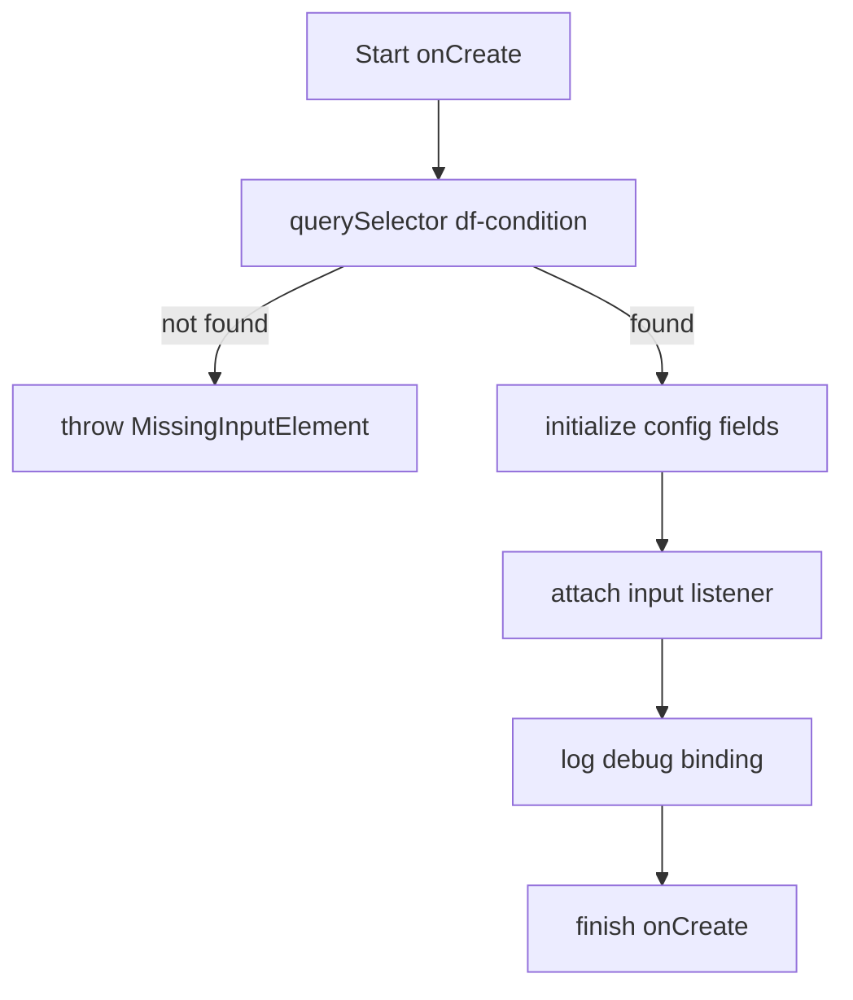
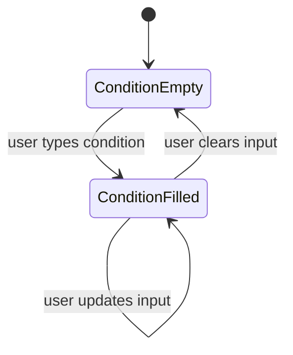

# nodes.conditional Specification

## Component Title

nodes.conditional

## Purpose Statement

Registers the “conditional” node type in Drawflow, adding a UI for entering a branching condition and two outputs (true/false). Binds the input field to the node’s configuration so that the condition expression and branch connections persist across export/import.

## Core Requirements

- Export a function `registerConditional(editor)` that calls `editor.registerNode('conditional', ...)`.
- Provide an HTML template containing:
  - A `<input df-condition>` field
  - A labeled `Condition` prompt
  - One input connector
  - Two output connectors marked `if-true` and `if-false`
- In `onCreate(node)`, bind the `<input df-condition>` element to `node.data.config.condition`, initializing it to an empty string and updating it on every change.
- Initialize `node.data.config.if_true` and `node.data.config.if_false` to empty arrays.
- Ensure that `config.condition`, `config.if_true`, and `config.if_false` are included in `node.data.config` so that `editor.export()` JSON round-trips preserve them.
- Support Drawflow import via `editor.import()` without additional serialization calls.

## Implementation Considerations

- Use a pure ES module at `src/nodes/conditional.js` exporting only `registerConditional`.
- Use Drawflow’s `editor.registerNode` API and a template literal for the HTML.
- Mark connectors with `class="input"`/`"output if-true"`/`"output if-false"` and `data-port` attributes.
- Include minimal scoped CSS classes within the template; avoid external styles.
- In `onCreate`, `querySelector('[df-condition]')` and throw `MissingInputElement` if not found.
- Attach input and change listeners to update `node.data.config.condition` live.
- Emit `console.debug` logs for binding events and `console.info` when registration is complete.
- Rely on Drawflow’s built-in export/import to handle `node.data.config` fields.
- Add JSDoc typedef for node.data.config shape (`condition: string, if_true: number[], if_false: number[]`).

## Component Dependencies

### Internal Components

None

### External Libraries

- **drawflow** - Required to interact with the Drawflow editor API.

### Configuration Dependencies

None

## Output Files

- `src/nodes/conditional.js` - ES module exporting `registerConditional(editor)`, registering the conditional node and binding its UI to `node.data.config`.
- `docs/nodes/conditional.md` - User-facing documentation with import, initialization, usage examples, and Drawflow version compatibility.

## Logging

- Debug:
  - `[conditional] bound condition input for node {node.id}`
  - `[conditional] updated config.condition on input change`
- Info:
  - `[conditional] registered 'conditional' node type`
- Error:
  **None**

## Error Handling

- **MissingInputElement**: `Required <input df-condition> element not found in HTML template`  
  Recovery: Add an `<input df-condition>` element with proper id and attributes in the template.
- **BindingFailure**: `Failed to bind df-condition input to node.data.config.condition`  
  Recovery: Verify `onCreate` selects the correct element and sets up listeners.

## Dependency Integration Considerations

- Drawflow’s export/import preserves `node.data.config` automatically.
- If using a project-level serialization module, ensure it serializes and restores `condition` and branch arrays without custom hooks.

## Diagrams

### Class Diagram

Shows the module, the exported API, and the data config type used by the conditional node.

### Component Diagram

Illustrates how the nodes.conditional module, its internal pieces, and the Drawflow editor integrate.

### Sequence Diagram

Details the runtime interaction when registering the node and when a node instance is created.

### Activity Diagram

Describes the steps taken during the onCreate hook to bind the condition input and initialize config.

### State Machine Diagram

Models the state of the condition field from initialization through user input.

