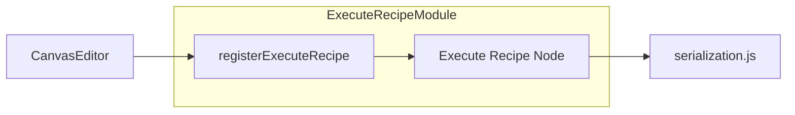

# Execute Recipe Node Usage

This document describes how to integrate and use the **Execute Recipe Node** (“execute_recipe”) in a Drawflow editor instance. This node lets users configure a sub-recipe execution step by specifying the path to a JSON recipe and optional context overrides.

---

## Table of Contents

1. Importing and Registration
2. Node Configuration Form
3. Public API Reference
4. Example Integration
5. Configuration Properties
6. Diagrams
7. Important Notes & Troubleshooting

---

## 1. Importing and Registration

To make the Execute Recipe Node available in your Drawflow canvas, import and register it after creating your Drawflow editor instance:

```javascript
import Drawflow from 'drawflow';
import { registerExecuteRecipe } from './nodes/execute_recipe.js';

// 1. Create or obtain your Drawflow editor
const editor = new Drawflow(/* ...options... */);

// 2. Register the execute_recipe node type
registerExecuteRecipe(editor);

// 3. Now you can add execute_recipe nodes to your canvas
```  

**Note:** Ensure you call `registerExecuteRecipe(editor)` **before** loading or exporting any recipes so that serialization mappings are in place.

---

## 2. Node Configuration Form

When an `execute_recipe` node is created, its HTML content under the root `<div class="node execute-recipe-node">` will include:

- A single-line text input (`<input>`) for specifying the sub-recipe file path.
- A multi-line textarea (`<textarea>`) for JSON-formatted context overrides.

```html
<div class="node execute-recipe-node">
  <label>Recipe Path:</label>
  <input type="text" df-recipe_path placeholder="Enter recipe path to sub-recipe.json" />

  <label>Context Overrides (JSON):</label>
  <textarea df-context_overrides placeholder="{}"></textarea>
  <div class="error-message" style="display:none;">Invalid JSON</div>
</div>
```

### Interactive Behavior

- **Recipe Path**: Updates `node.data.config.recipe_path` in real time on every input event.
- **Context Overrides**: Debounced (500 ms) JSON parse on user input. Valid JSON is stored to `node.data.config.context_overrides`. Invalid JSON triggers an inline error message and keeps the last valid value.

---

## 3. Public API Reference

### `registerExecuteRecipe(editor)`

Registers the `execute_recipe` Drawflow node type with the given editor instance.

- **Signature**: `function registerExecuteRecipe(editor: Drawflow): void`
- **Parameters**:
  - `editor` – your Drawflow editor instance.
- **Behavior**:
  1. Calls `editor.registerNode('execute_recipe', { ... })` with hooks for create, update, select, and delete.
  2. Binds the HTML configuration form and event listeners.
  3. Logs an `info` message on successful registration.

No return value.  

---

## 4. Example Integration

```javascript
import Drawflow from 'drawflow';
import { registerExecuteRecipe } from './nodes/execute_recipe.js';

// Initialize Drawflow editor
const editor = new Drawflow({ container: '#drawflow' });

// Register the Execute Recipe Node type
registerExecuteRecipe(editor);

// Load a saved recipe definition (if any)
editor.import(/* previously exported JSON */);

// Add a new execute_recipe node programmatically
editor.addNode(
  'Execute Sub-Recipe',
  1,
  1,
  200,
  100,
  'execute_recipe',
  { recipe_path: 'recipes/sub.json', context_overrides: { foo: 'bar' } }
);

// Later, export your canvas to JSON, which will include execute_recipe configs
const recipeJson = editor.export();
```

---

## 5. Configuration Properties

When you add or edit an `execute_recipe` node, its configuration is stored in `node.data.config`:

- **`recipe_path`** (`string`): Path or URL to the sub-recipe JSON file.
- **`context_overrides`** (`object`): A JSON object of key/value pairs to override or inject into the sub-recipe’s execution context.

These properties round-trip through Drawflow’s import/export and are consumed by downstream executors via the main serialization module (`modules/serialization.js`).

---

## 6. Diagrams

### Component Integration Diagram

Shows how the Execute Recipe Node fits into the Drawflow editor and serialization pipeline:



*This diagram highlights the consumer-facing integration: after registration, the node participates in import/export and execution flows.*

---

## 7. Important Notes & Troubleshooting

- **JSON Validation**: The context overrides textarea validates JSON on blur or after typing stops for 500 ms. Inline errors appear in a `.error-message` div.
- **Styling Hooks**: The root container uses CSS class `execute-recipe-node`. Selected nodes get the `.selected` modifier.
- **Debounce Behavior**: Rapid typing in the overrides field will delay parsing until 500 ms of inactivity to improve performance on large payloads.
- **Error State**: If JSON parsing fails, the last valid overrides remain in config; the field is marked with an `.error` class and an error message is shown.
- **Lifecycle Hooks**: The node supports onCreate, onUpdate (UI sync), onSelect, and onDelete (cleanup).

Troubleshooting:
- If your recipe path is not saved, ensure you have an `input[df-recipe_path]` listener bound correctly (check console for debug logs).
- If overrides never apply, open your browser console to see `JSONParseError` logs.

---

*End of documentation for Execute Recipe Node.*