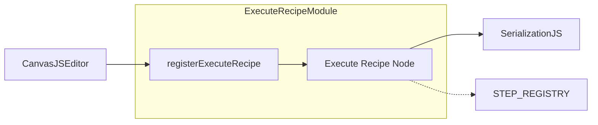
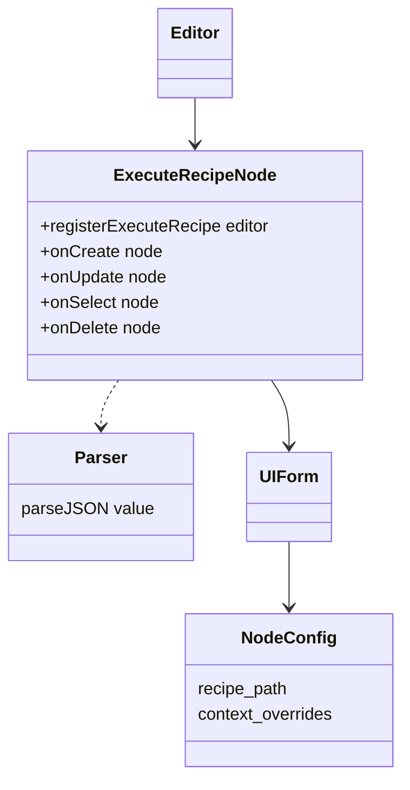
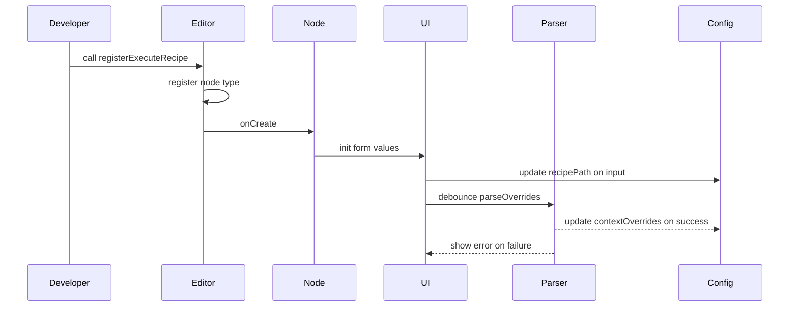
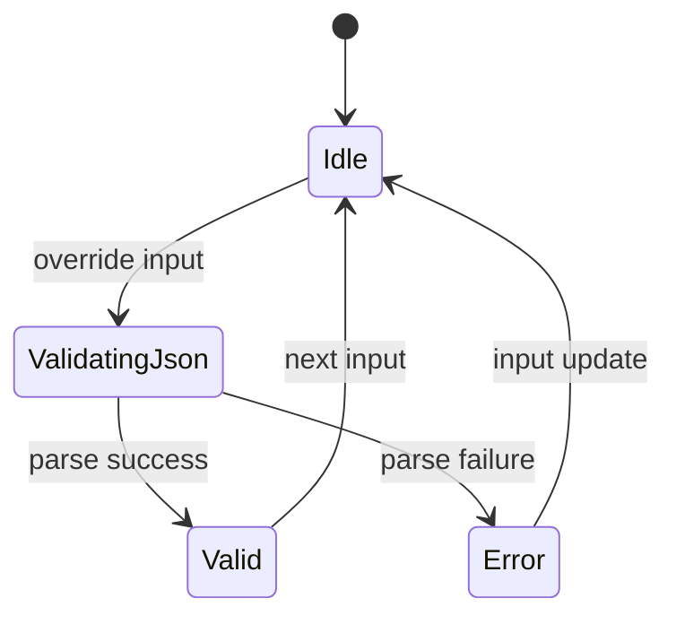

# Execute Recipe Node Specification

## Purpose

Registers a Drawflow node type that lets users configure a sub-recipe execution step by specifying the path to a JSON recipe and optional context overrides, and stores them in the node’s configuration for serialization and downstream execution.

## Core Requirements

- Export a named function `registerExecuteRecipe(editor)` from `src/nodes/execute_recipe.js`
- Importable via:
  ```js
  import { registerExecuteRecipe } from './nodes/execute_recipe.js'
  ```
- Register node type `'execute_recipe'` with `editor.registerNode`
- Render HTML form under `<div class="node execute-recipe-node">` containing:
  - `<input type="text" df-recipe_path placeholder="Enter recipe path to sub-recipe.json">`
  - `<textarea df-context_overrides placeholder="{}"></textarea>`
- Bind `<input df-recipe_path>` ↔ `node.data.config.recipe_path` and `<textarea df-context_overrides>` ↔ `node.data.config.context_overrides` on create and update
- Persist `recipe_path` and `context_overrides` in `node.data.config` so that export/import round-trips correctly
- Validate `context_overrides` as JSON on textarea blur or after debounced input; on success update config, on failure display inline error and revert
- Support updating `node.data.config` on every user edit of `recipe_path` (input event) and `context_overrides` (debounced input)

## Implementation Considerations

- Place ES module at `src/nodes/execute_recipe.js` exporting:
  ```js
  export function registerExecuteRecipe(editor) { ... }
  ```
- Call `editor.registerNode('execute_recipe', { ... })` inside `registerExecuteRecipe(editor)`
- Define HTML template string with `<div class="node execute-recipe-node">` wrapper and `df-*` attributes
- In `onCreate(node)`:
  - Set `input.value = node.data.config.recipe_path || ''`
  - Set `textarea.value = JSON.stringify(node.data.config.context_overrides || {}, null, 2)`
  - Add listeners:
    - `input.on('input')` → update `node.data.config.recipe_path`
    - `textarea.on('input')` → debounce parse JSON
- In `onUpdate(node)`: re-sync UI from `node.data.config` in case of programmatic update
- Implement `parseJSON(value)`: attempt `JSON.parse`;
  - on success remove `.error` state and update `node.data.config.context_overrides`
  - on failure add `.error` class to textarea container and show `<div class="error-message">Invalid JSON</div>`
- Debounce textarea parsing by 500ms to improve UX on large payloads
- Support `onSelect(node)`: add `.selected` CSS modifier on root container
- Support `onDelete(node)`: remove event listeners and cleanup UI elements

## Component Dependencies

### Internal Components

- **canvas.js** - Drawflow editor instance
- **modules/serialization.js** - for drawflowToRecipe mapping
- **STEP_REGISTRY** integration for execute_recipe step type

### External Libraries

None

### Configuration Dependencies

None

## Output Files

- `src/nodes/execute_recipe.js` - ES module exporting `registerExecuteRecipe(editor)` which registers the `execute_recipe` Drawflow node and binds `recipe_path`/`context_overrides` form behavior

## Logging

- Debug:
  - Log in `onCreate`: initial config values for `recipe_path` and `context_overrides`
  - Log `recipe_path` changes on input events
  - Log `context_overrides` parsing success and failures
- Info:
  - Log successful registration of the `execute_recipe` node type
- Error:
  - None

## Error Handling

- JSONParseError
  - **Error message:** "Failed to parse context_overrides JSON"
  - **Recovery action:** Display inline error message, apply `.error` style to textarea, and keep last valid overrides in config

## Dependency Integration Considerations

- Ensure node type name `execute_recipe` matches the recipe DSL step type for serialization
- No manual client-side STEP_REGISTRY update required; `serialization.js` maps `node.data.config` into recipe JSON
- Consumers must call `registerExecuteRecipe(editor)` after creating the Drawflow instance and before loading or exporting recipes

## Diagrams

The following diagrams provide additional context for implementers.

### Component Diagram

Shows the Execute Recipe Node module and its dependencies in the Drawflow editor.



### Class Diagram

Illustrates the core classes, their methods, and relationships for the Execute Recipe Node.



### Sequence Diagram

Describes the interaction flow from registration through user edits, parsing, and error handling.



### State Diagram

Models JSON validation states for context overrides.



### Activity Diagram

Details the sequence of activities from rendering the form to handling user input and parsing JSON.

```mermaid
flowchart TD
  Start --> RenderForm
  RenderForm --> onCreate
  onCreate --> BindListeners
  BindListeners --> WaitingInput
  WaitingInput --> RecipeInput: user types path
  RecipeInput --> UpdateRecipePath
  WaitingInput --> ContextInput: user types overrides
  ContextInput --> Debounce
  Debounce --> ParseJson
  ParseJson -->|valid| UpdateOverrides
  ParseJson -->|invalid| ShowError
  ShowError --> WaitingInput
  UpdateOverrides --> WaitingInput
```