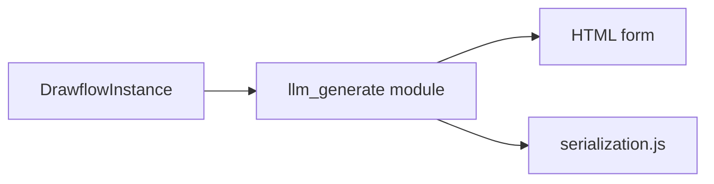
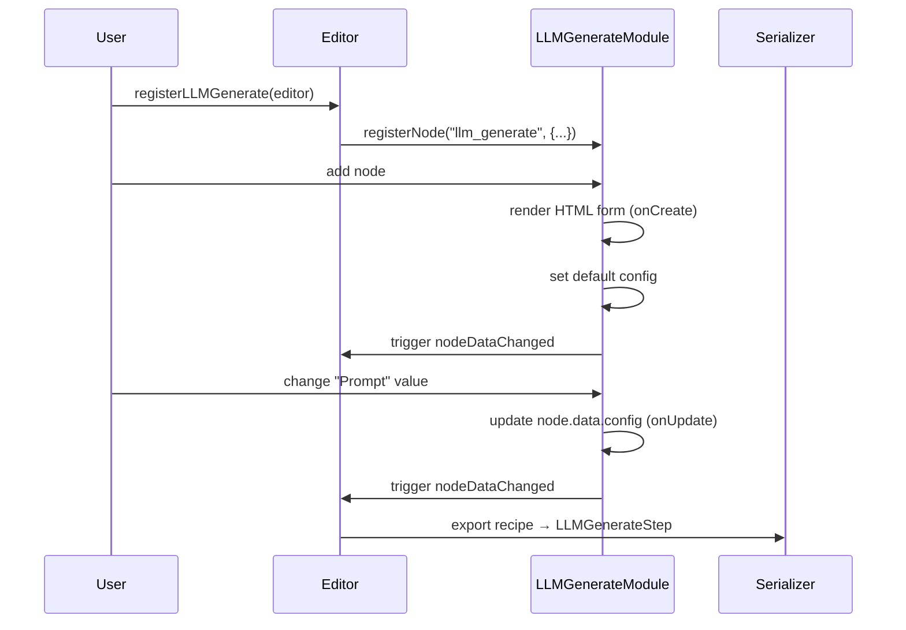

# LLM Generate Node

## Overview

The **LLM Generate Node** provides a minimal Drawflow node for invoking a language model (LLM) during flow design. It renders a simple form bound to `node.data.config`, ensuring seamless serialization to your recipe and alignment with the `LLMGenerateStep` schema at runtime.

Key features:

- Single input port (`input_1`) and single output port (`output_1`) for data flow
- Configurable fields: Prompt, Model, Max Tokens, MCP Servers, Output Format, Output Key
- Real-time binding: UI controls update `node.data.config`, and Drawflow export includes the latest values
- Built-in validation for required fields, integer types, and JSON

## Component Diagram



## Importing & Registration

To register the LLM Generate Node in your Drawflow editor:

```javascript
import { registerLLMGenerate } from 'src/nodes/llm_generate.js';

const editor = new DrawflowInstance(/* container or config */);
registerLLMGenerate(editor);
// Now you can add "llm_generate" nodes via the Drawflow UI or JSON import.
```

Upon registration, the node type `"llm_generate"` becomes available in the palette. When instantiated, it renders a form and initializes its configuration with defaults.

## Configuration UI

When you add an **LLM Generate Node**, you'll see these controls (labels above each control):

| Field           | Control Type         | `df-*` Attribute  | Default                         | Description                                           |
|-----------------|----------------------|-------------------|---------------------------------|-------------------------------------------------------|
| Prompt          | `<textarea>`         | df-prompt         | ""                              | The prompt template sent to the LLM.                  |
| Model           | `<input type="text">` | df-model          | "openai/gpt-4o"                | LLM model identifier (provider/model).                |
| Max Tokens      | `<input type="number">` | df-max_tokens    | *empty* (null)                   | Maximum tokens to generate (integer).                 |
| MCP Servers     | `<textarea>`         | df-mcp_servers    | `[]`                             | JSON array of MCP server configs (raw JSON textarea).|
| Output Format   | `<select>`           | df-output_format  | "text"                         | How to interpret LLM response: `text`, `files`, or `json-schema`. |
| Output Key      | `<input type="text">` | df-output_key     | "llm_output"                   | The key under which to store the response in the output data object. |

Each control is decorated with a `df-*` attribute for automatic two-way binding to `node.data.config`.

## Drawflow JSON Example

Below is a snippet of a Drawflow export showing an LLM Generate Node with custom configuration:

```json
{
  "id": 7,
  "name": "llm_generate",
  "data": {
    "config": {
      "prompt": "Summarize the following text:\n{{ input_text }}",
      "model": "openai/gpt-4o",
      "max_tokens": 150,
      "mcp_servers": [{"url":"https://mcp.example.com","headers":{}}],
      "output_format": "text",
      "output_key": "summary"
    }
  },
  "class": "llm_generate",
  "html": "...",
  "ports": {
    "input_1": {"connections": [...]},
    "output_1": {"connections": []}
  }
}
```

When you import this JSON into Drawflow, the node appears with the specified values prefilled.

## Runtime Serialization

At export or execution time, Drawflow serializes `node.data.config` into an `LLMGenerateStep` for your recipe engine:

```json
{
  "type": "llm_generate",
  "config": {
    "prompt": "Summarize the following text:\n{{ input_text }}",
    "model": "openai/gpt-4o",
    "max_tokens": 150,
    "mcp_servers": [{"url":"https://mcp.example.com","headers":{}}],
    "output_format": "text",
    "output_key": "summary"
  }
}
```

This step is then validated against the `LLMGenerateStep` schema and executed by your runtime.

## Sequence Diagram

The following high-level sequence illustrates registration, node creation, user interaction, and export:



## Ports & Connections

- **Input Port**: `input_1` — connect upstream data (e.g., text to summarize).
- **Output Port**: `output_1` — outputs an object containing the key defined by `output_key`.

Use Drawflow’s standard connection tools to wire data between nodes.

## Validation & Error Handling

The UI implements inline validation:

- **Prompt Required**: Empty prompt highlights the textarea in red and shows “Required.”
- **`max_tokens` Integer**: Non-integer resets to null and displays an error next to the input.
- **`mcp_servers` JSON**: Invalid JSON on blur reverts to last valid value and shows an inline message.

Nodes cannot be exported if validation errors remain.

## Common Usage Pattern

1. **Create** a source node that outputs raw text (e.g., file reader).
2. **Wire** its output to `input_1` of the LLM Generate Node.
3. **Configure** your prompt, model, and other settings.
4. **Connect** `output_1` to a downstream consumer (e.g., a database writer or logger).
5. **Export** the Drawflow JSON and execute via your recipe runner.

---

By following this guide, you can seamlessly integrate the LLM Generate Node into your flows, harnessing powerful language models with minimal configuration.