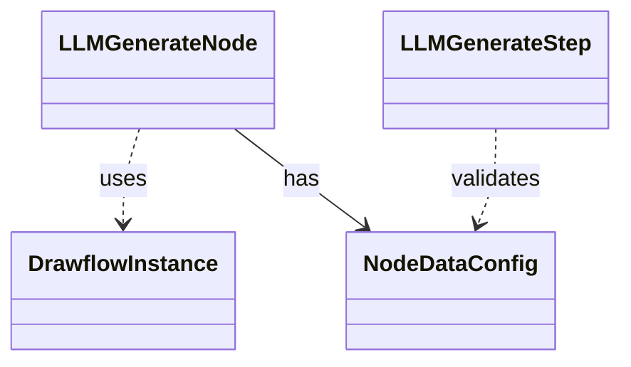
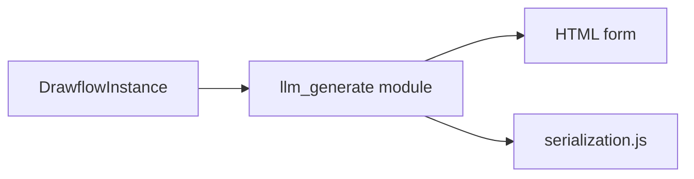
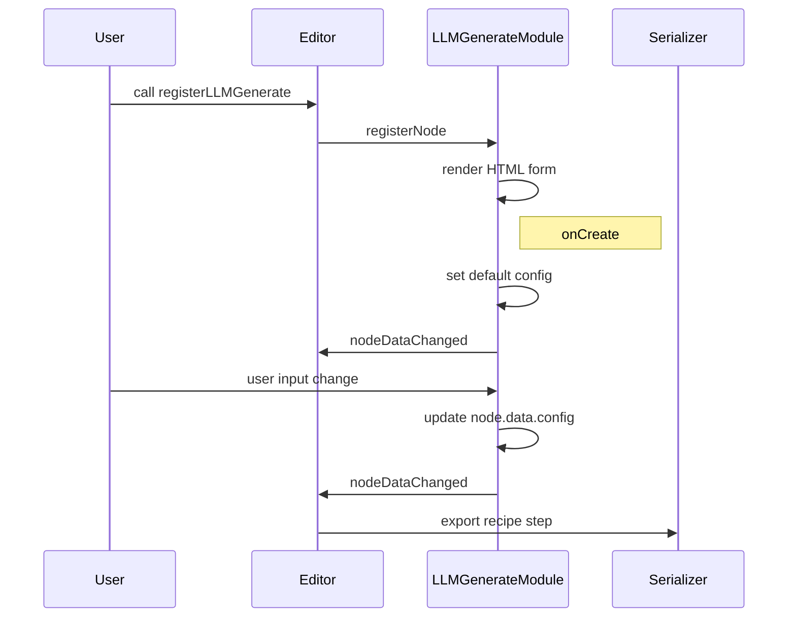
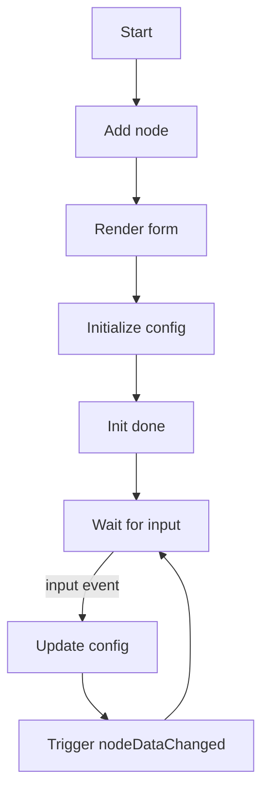
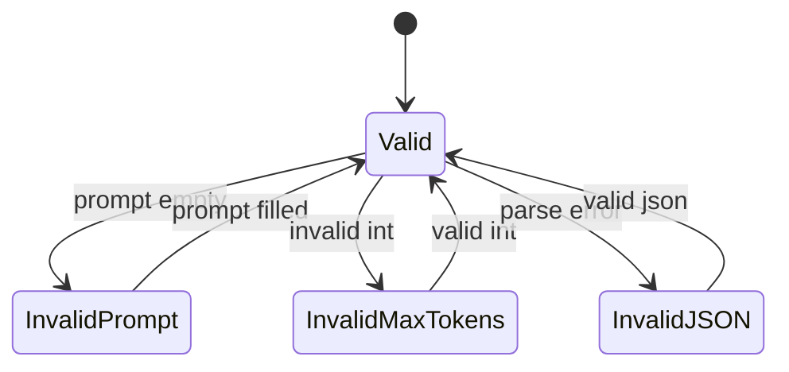

# LLM Generate Node Specification

## Purpose
Register a Drawflow node type “llm_generate” that provides a minimal configuration UI for invoking a language model in the flow editor, binds the controls to `node.data.config` for serialization, and ensures the settings align with the `LLMGenerateStep` schema for runtime execution.

## Core Requirements

- Export a function `registerLLMGenerate(editor: DrawflowInstance)` from `src/nodes/llm_generate.js`.
- In `registerLLMGenerate`, call `editor.registerNode("llm_generate", { html, onCreate, onUpdate })`.
- Define an HTML form with these fields (in order):
  - Prompt (`<textarea df-prompt>`)
  - Model (`<input df-model>`)
  - Max Tokens (`<input type="number" df-max_tokens>`)
  - MCP Servers (`<textarea df-mcp_servers>`)
  - Output Format (`<select df-output_format>` with options "text", "files", "json-schema")
  - Output Key (`<input df-output_key>`)
- Use `df-*` attributes on each form control to bind automatically to `node.data.config` properties.
- On node creation (`onCreate`), initialize `node.data.config` with defaults: `{ prompt: "", model: "openai/gpt-4o", max_tokens: null, mcp_servers: [], output_format: "text", output_key: "llm_output" }` and set each control’s value accordingly.
- Listen for `input` or `change` events on each control to update `node.data.config` in real time and reflect changes in the Drawflow export.
- Include exactly one input port and one output port for data flow connections, using conventions `input_1` and `output_1`.
- Ensure the keys in `node.data.config` match the `LLMGenerateStep` config schema so that `serialization.js` correctly rounds trip between Drawflow JSON and recipe steps.

## Implementation Considerations

- Build the HTML string in plain ES module code using template literals; avoid frameworks or external CSS beyond Drawflow defaults.
- Apply `df-prompt`, `df-model`, `df-max_tokens`, `df-mcp_servers`, `df-output_format`, and `df-output_key` attributes on `<textarea>`, `<input>`, and `<select>` elements for auto-binding by Drawflow.
- In the `onCreate` callback, set default config values on `node.data.config`, then query all `df-*` elements and assign their `.value` or `.selectedIndex` from config.
- In `onUpdate` (or via event listeners), update `node.data.config` whenever a form control changes and call `editor.trigger('nodeDataChanged', node.id)` if needed.
- Use `console.debug` for logging debug messages; do not introduce a separate logger instance.
- Keep the UI layout minimal—labels above controls, consistent spacing, and basic inline styles or Drawflow’s `node.box` class.
- For MCP Servers, use a raw JSON `<textarea>` with placeholder `'[{"url":"https://...","headers":{}}]'`.

## Component Dependencies

### Internal Components

None

### External Libraries

- **drawflow** - (Required) Provides the editor instance, registration API, and default node styling.

### Configuration Dependencies

None

## Output Files

- `src/nodes/llm_generate.js` - ES module exporting `registerLLMGenerate(editor)` that defines the Drawflow node type `llm_generate` with HTML form, default config setup, binding logic, and event handlers.

## Logging

### Debug

- `console.debug("llm_generate node created with config:", node.data.config)`
- `console.debug("llm_generate config updated:", node.data.config)`

### Info

None

## Error Handling

- **MissingFieldError**: Required field 'prompt' is empty
  - Recovery: Highlight the prompt textarea border in red, show inline validation message below it, and prevent node save until populated
- **InvalidTypeError**: 'max_tokens' must be a valid integer
  - Recovery: Show inline error next to Max Tokens input, reset its value to null, and disallow saving
- **InvalidJSONError**: 'mcp_servers' configuration must be valid JSON
  - Recovery: Catch `JSON.parse` errors on textarea blur, display inline feedback, and revert to last known good JSON

## Dependency Integration Considerations

- Ensure `df-*` attribute names exactly match the keys in `LLMGenerateStep` config to allow `serialization.js` to map `node.data.config` → `step.config` correctly.
- Test Drawflow import/export round-trip to verify that defaults and updates in `node.data.config` persist and produce a valid recipe step.
- Maintain minimal UI dependencies so that Drawflow’s built-in styles render correctly without additional CSS.

## Diagrams

### Class Diagram

### Component Diagram

### Sequence Diagram

### Activity Diagram

### State Diagram

