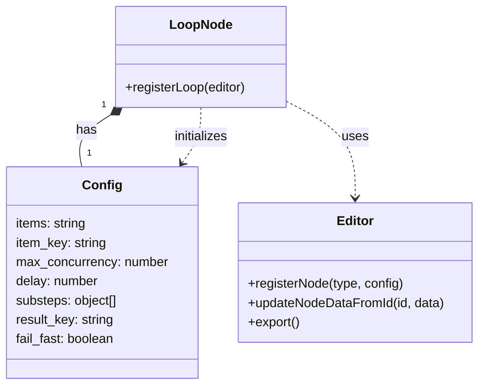
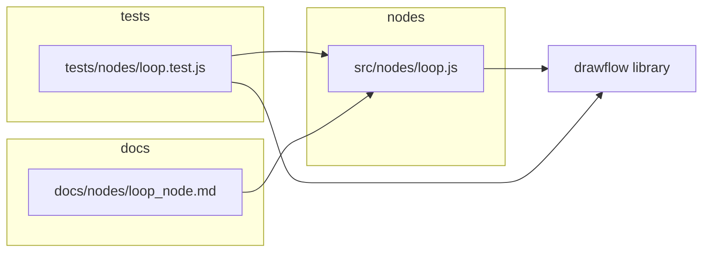
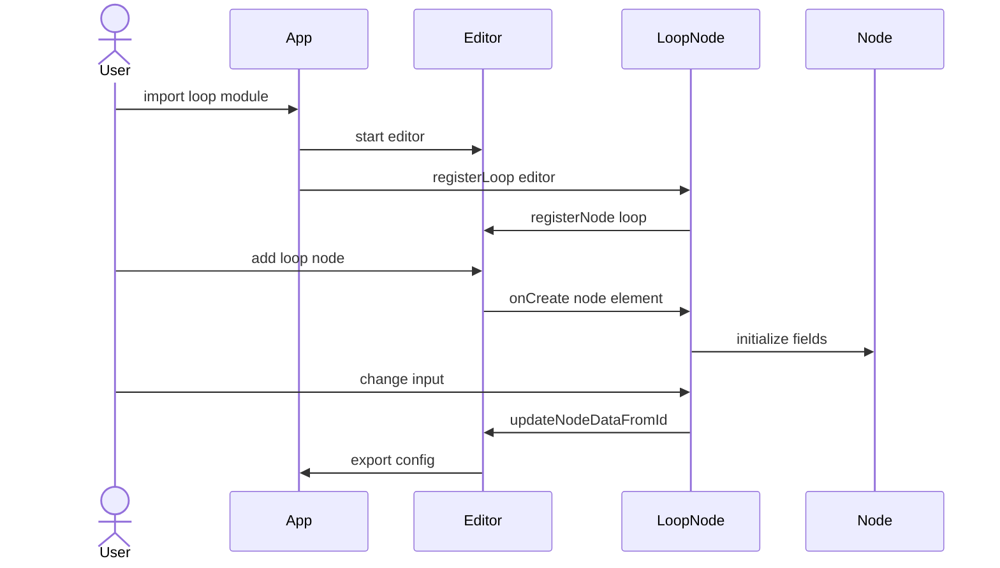
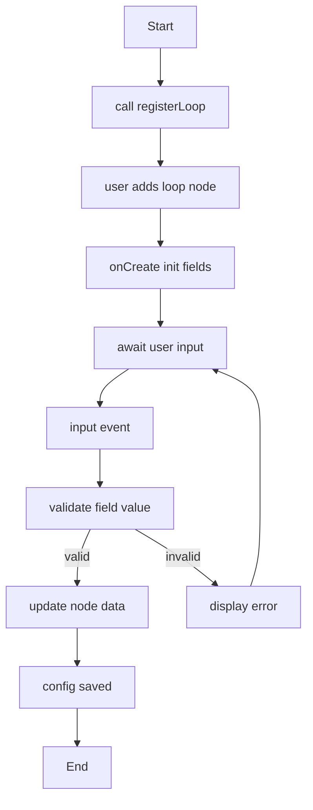

# Loop Node Specification

## Purpose

The Loop Node component registers a Drawflow node named “loop” to allow users to configure and execute loop iterations over collections with customizable substeps in the flow editor. It binds form inputs for items, item_key, max_concurrency, delay, substeps, result_key, and fail_fast to `node.data.config`, validates user entries, and ensures the loop configuration and metadata (icon, label, ports) are persisted in the exported JSON.

## Core Requirements

- Export a function `registerLoop(editor)` that calls `editor.registerNode('loop', {...})` to define the Loop node with one control input port, one control output port, and metadata (icon `'fa-repeat'`, label `'Loop'`, description).
- Define HTML markup using Drawflow CSS classes (`drawflow-node`, `title-box`, `box`) containing form fields for `items`, `item_key`, `max_concurrency`, `delay`, `substeps`, `result_key`, and a `fail_fast` checkbox, each using `df-*` attributes for binding.
- Implement `onCreate` callback to initialize form fields from `node.data.config` (or sensible defaults: `items=''`, `item_key='item'`, `max_concurrency=1`, `delay=0`, `substeps='[]'`, `result_key='result'`, `fail_fast=true`), attach event listeners to update config and call `editor.updateNodeDataFromId`.
- Validate `substeps` textarea via `JSON.parse`, ensure it yields an array of objects each with `type` (string) and `config` (object); on parse or schema failure, display inline error and prevent invalid config.
- Validate `items` input: accept either a context key path (dot notation) or JSON array literal; if invalid, display inline error and revert to last valid value.
- Enforce numeric constraints: `max_concurrency` between 1 and 10, `delay` between 0 and 60 seconds; reset out-of-bounds values to defaults with a warning.
- Reflect the complete `node.data.config` in `editor.export()` under each node's `data.config` field.
- Include unit tests for `registerLoop` verifying HTML structure, default config values, event binding, validation errors, and export JSON correctness using Jest.
- Provide public documentation at `docs/nodes/loop_node.md` covering usage, configuration options, ports, examples, and integration instructions.

## Implementation Considerations

- Use `df-*` attributes on inputs, textarea, and checkbox to bind directly to `node.data.config` properties.
- Use `<input type="text">` for string fields (`items`, `item_key`, `result_key`), `<input type="number">` for numeric fields (`max_concurrency`, `delay`), `<textarea>` for JSON `substeps`, and `<input type="checkbox">` for boolean `fail_fast`.
- Wrap the form in `
`, include `
Loop
` and `
` around inputs, reusing Drawflow styling.
- In `onCreate`, read `node.data.config` or apply defaults then set `input.value`, `textarea.value`, and `checkbox.checked`; attach `'change'`/`'input'` listeners to update `node.data.config` and call `editor.updateNodeDataFromId(node.id, node.data)`.
- Perform `JSON.parse` on `substeps` value, catch `SyntaxError`, verify the result is `Array<{type:string, config:object}>`; on error, inject `
` and disable further edits until fixed.
- Resolve `items` field by trying `JSON.parse`; if that fails, treat as string path and rely on execution-time resolution; validate at creation by checking type of parsed or path reference.
- Enforce numeric bounds in event handlers: clamp `max_concurrency` to `[1,10]`, `delay` to `[0,60]`, and display temporary warning below the input.
- Register ports in `editor.registerNode`: `inputs: 1`, `outputs: 1`; Drawflow will render `.input` and `.output` nodes automatically.
- Include metadata in `registerNode` call: `{ icon: 'fa-repeat', label: 'Loop', description: 'Iterate over a collection with custom substeps' }`.
- Write Jest tests in `tests/nodes/loop.test.js`, mocking a minimal Drawflow editor with `registerNode` stub to assert HTML, defaults, and event binding.

## Component Dependencies

### Internal Components

None

### External Libraries

- drawflow

### Configuration Dependencies

None

## Output Files

- `src/nodes/loop.js` - ES module that exports `registerLoop(editor)` to register the Loop node with Drawflow and handle UI binding, validation, and metadata.
- `docs/nodes/loop_node.md` - Public documentation file for the Loop node, covering import, initialization, configuration options, ports, examples, and integration guidance.
- `tests/nodes/loop.test.js` - Unit tests for the Loop node registration and behavior using Jest, covering defaults, event binding, validation, and export JSON correctness.

## Logging

- Debug:
  - Registering Loop node with Drawflow
  - Initializing Loop node fields from config
  - User updated '{{key}}' to '{{value}}'
  - Validated substeps JSON
  - Validated items field
  - Clamped numeric field '{{field}}' to '{{value}}'
- Info:
  - Loop node created with id={{node.id}}
  - Loop execution started
  - Loop execution completed successfully, results stored under '{{result_key}}'

## Error Handling

- JSONParseError: Invalid JSON in substeps configuration → Display inline error below substeps textarea and disable saving until corrected.
- InvalidItemsError: Items must be a valid context key path or JSON array of items → Display inline error below items field and revert to last valid value.
- ConcurrencyLimitError: max_concurrency must be between 1 and 10 → Reset max_concurrency to default value 1 and show a warning message.
- DelayValueError: Delay must be between 0 and 60 seconds → Reset delay to default 0 and show a warning message.
- ExecutionError: Error processing item '{{itemKey}}': {{errorDetail}} → If `fail_fast=true`, stop further processing; otherwise, record error in '{{result_key}}__errors' and continue with next items.

## Dependency Integration Considerations

- Compatible with Drawflow v0.6.x and its `df-*` attribute binding mechanism.
- No additional integration required; users must import the module and call `registerLoop(editor)` after `editor.start()`.

## Diagrams

### Class Diagram
Shows the LoopNode module, its configuration object, and its relationship to the Drawflow Editor.

### Component Diagram
Illustrates the file organization and external dependencies of the Loop Node component.

### Sequence Diagram
Describes the startup and user interaction flow: from registering the node to handling user input and exporting the final config.

### Activity Diagram
Shows the runtime behavior within the node UI: initialization, input listening, validation, and config updates.

