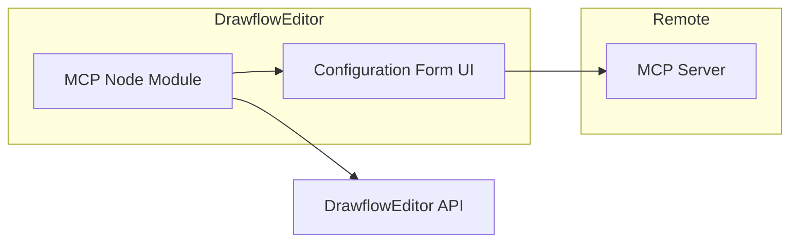
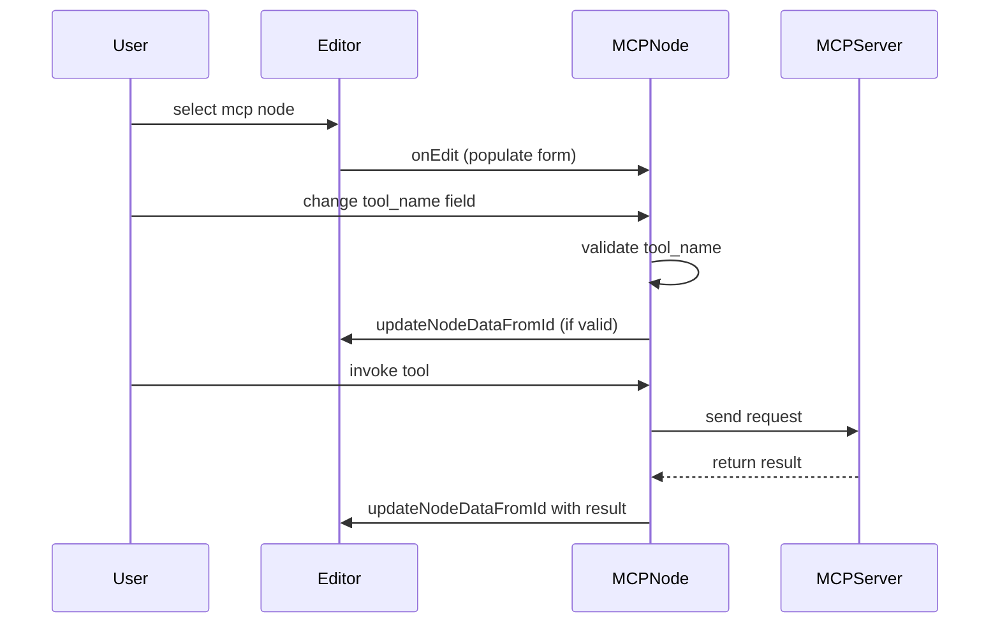

# MCP Node (nodes.mcp) Documentation

## Overview

The **MCP Node** registers a custom Drawflow node type named `mcp` in the flow‐editor UI. It lets users configure and invoke external tools via remote MCP servers (over HTTP SSE or local stdio). All node settings—transport, connection parameters, tool name, arguments, and result key—are stored in the node’s `data.config` and exported in the Drawflow JSON.

Key features for users:
- Choose transport: **HTTP SSE** (URL + headers) or **stdio** (command + args + env + working directory)
- Specify the **tool name**, a JSON **arguments** object, and a **result key**
- Inline validation and warnings for required fields and JSON syntax
- Configuration persisted per-node and included in exported flows

## Importing & Registration

No code import is needed when working in the Drawflow UI. The MCP Node is activated by calling the registration function in your project’s initialization logic:

```js
import { registerMcpNode } from './src/nodes/mcp.js';

// Assume `editor` is your DrawflowInstance
registerMcpNode(editor);
```

On successful registration, you'll see an info log:
```
INFO: Registered MCP node type
```

## Node UI & Configuration

When you drag an `mcp` node onto the canvas or select it for editing, the node displays a built-in form with the following inputs:

1. **Transport** (`df-transport`, `<select>`)  
   • HTTP SSE  
   • stdio

2. **HTTP (if selected)**
   - **URL** (`df-url`, `<input type="text">`)
   - **Headers**: dynamic key/value rows with add/remove buttons (`df-header-key`/`df-header-value`)

3. **stdio (if selected)**
   - **Command** (`df-command`, `<input type="text">`)
   - **Arguments** (`df-args`, `<textarea>`): simple list or dynamic rows
   - **Environment Variables**: dynamic key/value rows (`df-env-key`/`df-env-value`)
   - **Working Directory** (`df-working_dir`, `<input type="text">`)

4. **Tool Invocation**
   - **tool_name** (`df-tool_name`, `<input type="text">`)  
     • Required; must match `/^[A-Za-z0-9_]+$/`
   - **arguments** (`df-arguments`, `<textarea>`): JSON object only; top‐level must be an object literal
   - **result_key** (`df-result_key`, `<input type="text">`)  
     • Required; must match `/^[A-Za-z0-9_]+$/`

### Inline Validation
- **tool_name** and **result_key**: non-empty, alphanumeric/underscore only. Invalid input highlights the field in red and shows a short message below.
- **arguments (JSON)**: must parse to an object. On parse failure, the previous valid JSON is restored and a warning is shown.
- The **Export** action is blocked until all required fields are valid and present.

## Data Binding & Persistence

All inputs are bound via `df-*` attributes to the node’s `node.data.config` object. When you:

- **Create** a new MCP node: default config object is empty and a debug log shows:
  ```
  DEBUG: MCP node created with id=<node.id>
  ```
- **Load/Edit** an existing node: previous `config` values populate the form.
- **Change** any input: the in-memory `config` is updated, saved back to the node data, and you see a debug log:
  ```
  DEBUG: MCP config update for node=<node.id> field=<fieldName> value=<newValue>
  ```
- **Parse arguments** successfully:
  ```
  DEBUG: Parsed arguments JSON for node=<node.id>
  ```

When exporting your Drawflow diagram, the node’s `data.config` is included in the JSON under each node entry.

## Export Constraints

Export is prevented while any of these are true:
- Missing or invalid **tool_name**
- Missing or invalid **result_key**
- Malformed JSON in **arguments** field

The UI disables the export button until validation passes for all required fields.

## Integration Diagram

This high-level diagram shows how the MCP Node integrates with the Drawflow editor and the remote MCP server.



Use this diagram to understand the data flow: the node module registers with the editor, renders the UI, and the UI interacts with remote servers when you invoke the tool.

## Example UI Workflow (Sequence)



This illustrates the key steps from selecting the node through field updates and invoking the remote tool.

## Best Practices

- Always set **tool_name** and **result_key** with valid identifiers before exporting.
- Provide a minimal JSON object for **arguments**; larger nested data can be stored upstream and referenced via other nodes.
- Group common headers or env-vars into named presets (outside the node) if you re-use the same server settings frequently.

---

*For implementation details or contributor guidelines, see the specification file `nodes/mcp.md` in the repository.*