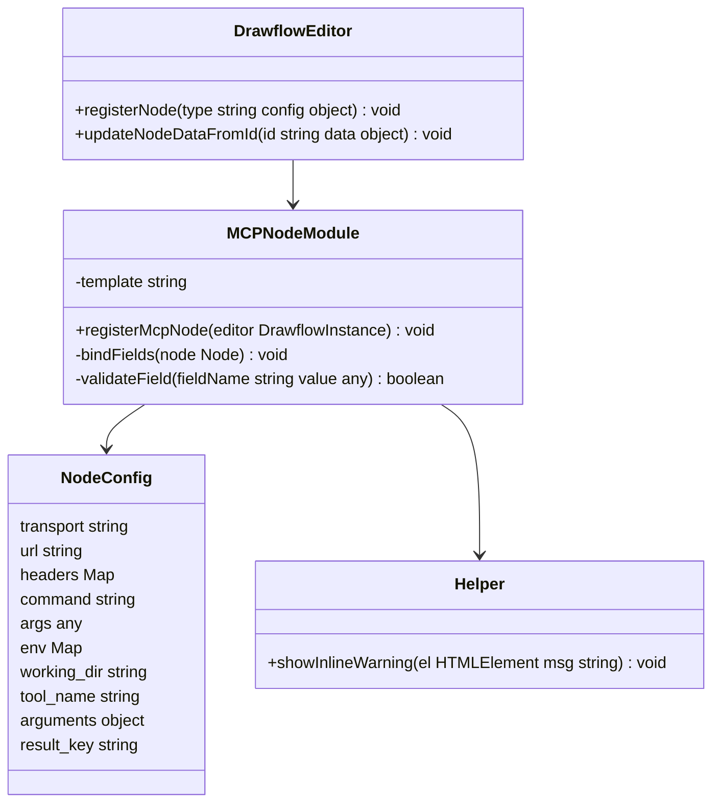
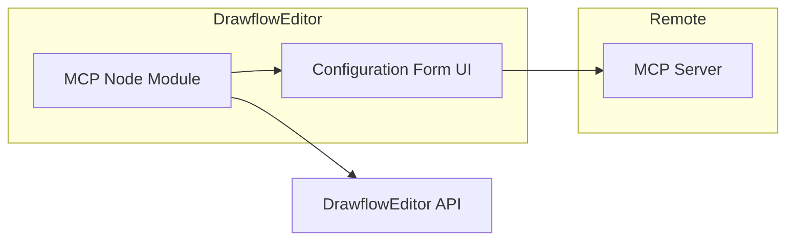
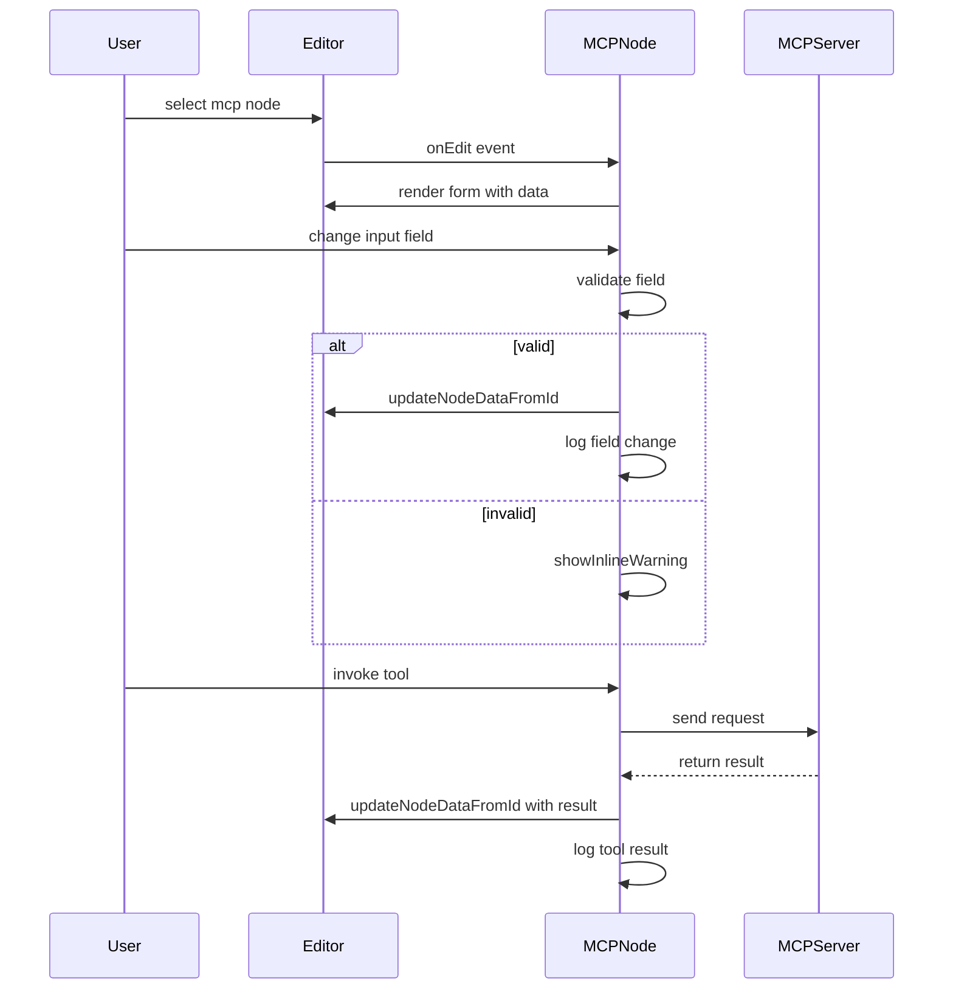
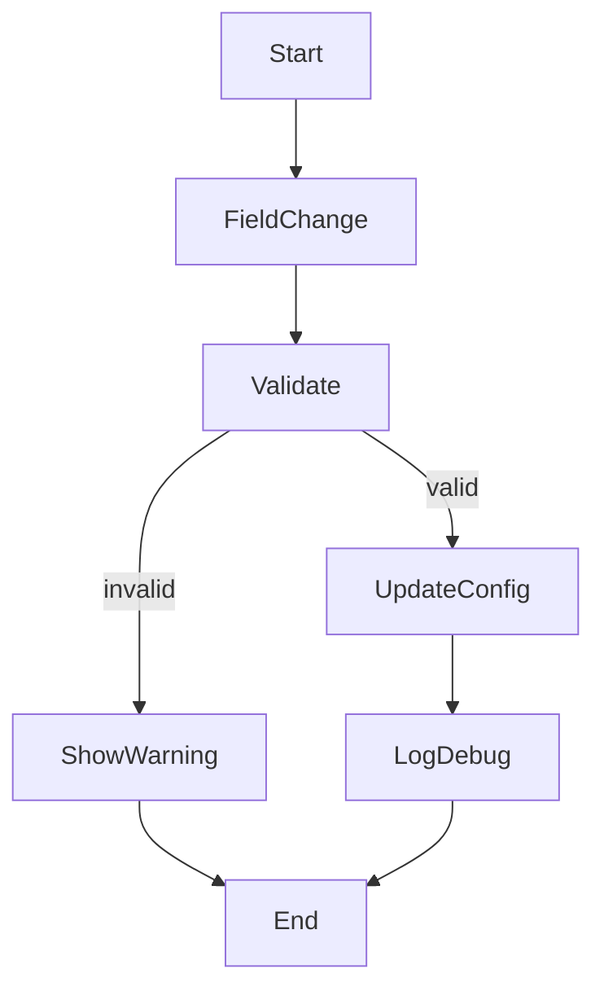

# MCP Node Specification

## Component Title

MCP Node

## Purpose Statement

Defines and registers a Drawflow node type "mcp" in the flow-editor UI to let users configure and invoke external tools via remote MCP servers. Users choose server transport (HTTP SSE or stdio), enter connection parameters, specify the tool name, argument object, and result key, and have these settings persisted in the node’s data and the exported Drawflow JSON.

## Core Requirements

- Register a Drawflow node under the name "mcp" with a default size of width=220px and height=300px and CSS class "drawflow-node mcp-node"
- Render a configuration form inside the node UI with inputs for:
  - HTTP vs. stdio transport selection
  - if HTTP: URL (string) and optional headers (key/value rows)
  - if stdio: command (string), args (comma-separated list or dynamic rows), optional env vars (key/value rows), and optional working directory (string)
- Render inputs for tool_name (string), arguments (JSON object only), and result_key (string)
- Bind each input via df-* attributes to node.data.config fields
- On creation and onEdit load node.data.config into inputs; on each change, update node.data.config and emit a debug log
- Validate that arguments JSON is an object literal (no arrays at top level) and that tool_name and result_key match `/^[A-Za-z0-9_]+$/`. On validation failure, display an inline warning (red border + small message below field) and revert to last valid value
- Prevent export (block export button) when required fields (tool_name or result_key) are missing or invalid

## Implementation Considerations

- Implement as an ES module exporting function `registerMcpNode(editor: DrawflowInstance): void`
- Call `editor.registerNode("mcp", { html, onCreate, onEdit, onUpdate, width:220, height:300 })`
- Define HTML template string with `<select df-transport>` for transport type, `<input df-url>`, a headers table with add/remove row buttons and `<input df-header-key>`/`df-header-value>`, `<input df-command>`, `<textarea df-args>`, `<input df-working_dir>`, dynamic env rows with `<input df-env-key>`/`df-env-value>`, `<input df-tool_name>`, `<textarea df-arguments>`, and `<input df-result_key>`
- Use vanilla JS to query df-* elements in onCreate and onEdit, attach `input`/`change` listeners that parse and validate values, update `node.data.config`, and call `editor.updateNodeDataFromId(node.id, { config: node.data.config })` if needed
- Implement JSON.parse inside a try/catch for arguments; on failure emit console.error and call showInlineWarning(element, message)
- Use a shared helper `showInlineWarning(el, msg)` that adds `.mcp-warning` text below field and `.error` class around input
- Use Drawflow’s onEdit to repopulate form when a node is selected and its config exists
- Keep UI and binding logic minimal and in one file—no frameworks, only ES module imports and Drawflow conventions

## Component Dependencies

### Internal Components

None

### External Libraries

- **drawflow** - (Required) Used to register the node type and update node data in the Drawflow editor

### Configuration Dependencies

None

## Output Files

- `src/nodes/mcp.js` - ES module registering the MCP Drawflow node, rendering the form UI, binding df-* inputs to node.data.config, and handling validation and persistence

## Logging

- **Debug**:
  - On node creation: log `MCP node created with id=${node.id}`
  - On each field change: log `MCP config update for node=${node.id}`, field name and new value
  - On successful JSON.parse of arguments: log `Parsed arguments JSON for node=${node.id}`
- **Info**:
  - When registering the node type: log `Registered MCP node type`

## Error Handling

- **JSONParseError**: "Failed to parse JSON in arguments field"; Recovery: Display inline warning below the arguments textarea, add red border, and revert to last valid JSON
- **ValidationError**: "Field '${fieldName}' is required or has invalid format"; Recovery: Highlight the offending input, show inline validation message, and prevent export until all validations pass

## Dependency Integration Considerations

None

## Diagrams

### Class Diagram

### Component Diagram

### Sequence Diagram

### Activity Diagram
