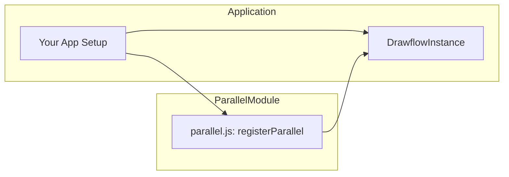

# Parallel Node (nodes.parallel)

**`nodes.parallel`** (Parallel Node) provides a Drawflow UI node for the “parallel” recipe step in the recipe builder. It lets end users specify and launch multiple sub‐steps concurrently, with optional limits on concurrent execution and configurable launch delays.

---

## Table of Contents

1. [Purpose](#purpose)
2. [Importing & Registration](#importing--registration)
3. [Usage](#usage)
   - [Dragging the Node](#dragging-the-node)
   - [Node Fields](#node-fields)
   - [Data Model](#data-model)
4. [API Reference](#api-reference)
5. [Integration Diagram](#integration-diagram)
6. [Logging & Debugging](#logging--debugging)
7. [Error Handling](#error-handling)
8. [Examples](#examples)
9. [Important Notes](#important-notes)

---

## Purpose

The Parallel Node lets recipe designers run multiple sub‐steps in parallel within a single recipe. Users can:

- Enter a JSON list of sub‐steps
- Specify a maximum number of concurrent executions (0 = no limit)
- Configure an optional delay (in seconds) before launching each substep

It integrates with Drawflow so you can drag, configure, and connect this node just like any other step.

---

## Importing & Registration

To make the Parallel Node available in your Drawflow editor, import and register it:

```javascript
import { registerParallel } from 'src/nodes/parallel.js';

// Create or obtain your Drawflow editor instance
const editor = new DrawflowInstance({ /* ... options ... */ });

// Register the node type
registerParallel(editor);
```

Once registered, a "Parallel" node will appear in the node palette (or toolbox) and can be dragged onto the canvas.

---

## Usage

### Dragging the Node

After registration, open the Drawflow toolbox, locate the **Parallel** node, and drag it onto the canvas. A new node will be created with default configuration:

```json
{
  "substeps": [],
  "max_concurrency": 0,
  "delay": 0.0
}
```

### Node Fields

Inside the node’s form you will find three controls:

- **Substeps (JSON)**
  - `<textarea df-substeps>`
  - Enter a JSON array of substep definitions (e.g., `[{ "type": "step1", ... }, { ... }]`).

- **Max Concurrency**
  - `<input type="number" df-max_concurrency min="0" step="1">`
  - Maximum number of substeps to run simultaneously. `0` means unlimited.

- **Delay (seconds)**
  - `<input type="number" df-delay min="0" step="0.1">`
  - Delay in seconds before launching each substep.

These fields are two-way bound to the node’s `data.config` object via Drawflow’s `df-*` attribute convention.

### Data Model

After creation or user input, each Parallel node carries a configuration object at:

```js
node.data.config = {
  substeps: [ /* Array of substep objects */ ],
  max_concurrency: 0,       // number ≥ 0
  delay: 0.0                // number ≥ 0.0 (seconds)
};
```

Whenever a field changes, `config` is updated automatically. The editor’s data serialization will include this object when exporting or saving flow state.

---

## API Reference

### registerParallel(editor: DrawflowInstance): void

Registers the Parallel node type with a Drawflow editor.

**Parameters:**

- `editor` (DrawflowInstance) – Your Drawflow instance where the node type will be made available.

**Usage:**

```js
registerParallel(editor);
```

No return value.

---

## Integration Diagram

This diagram shows how the Parallel Node module fits into your application’s Drawflow setup.



---

## Logging & Debugging

The Parallel node emits debug and info logs via your application’s logging framework:

- **Info**
  - "Parallel node created with default config"
  - "Parallel node configuration updated"

- **Debug**
  - "Parsed substeps JSON: {value}" (on successful JSON parse)
  - "Updated max_concurrency: {value}"
  - "Updated delay: {value}"

These messages help trace user interactions and configuration changes in the browser console (or your chosen log sink).

---

## Error Handling

- If the JSON in Substeps is invalid on blur/change, the node:
  1. Shows a browser alert: **"Invalid JSON in Substeps field"**
  2. Logs a warning to console
  3. Reverts the textarea content to the last valid JSON
  4. Leaves `node.data.config.substeps` unchanged

This ensures users cannot commit malformed substep definitions.

---

## Examples

### 1. Basic Registration

```js
import { registerParallel } from 'src/nodes/parallel.js';
const editor = new DrawflowInstance();
registerParallel(editor);
```

### 2. Creating and Configuring a Node (Programmatic)

```js
// After editor has loaded and nodes are registered:
const nodeId = editor.addNode(
  'parallel',                // node type
  0, 0,                      // position
  300, 200,                  // size
  'Parallel',                // title
  {                           // initial data.config
    config: {
      substeps: [
        { type: 'fetch_data', url: '…' },
        { type: 'process', iterations: 5 }
      ],
      max_concurrency: 2,
      delay: 0.5
    }
  }
);
```

### 3. Inspecting Saved Flow

When you call `editor.export()`, the Parallel node appears in the JSON output with its `config`:

```json
{
  "name": "parallel",
  "data": {
    "config": {
      "substeps": [ /* … */ ],
      "max_concurrency": 2,
      "delay": 0.5
    }
  },
  /* position, connections, etc. */
}
```

---

## Important Notes

- **Field Constraints**: The inputs enforce `min=0`. Blank or non‐numeric entries for concurrency/default delay are treated as `0`.
- **No Custom Styles**: The node relies on Drawflow’s default theming—avoid adding custom CSS here.
- **Extensibility**: Future fields can be added by introducing new `df-*` attributes in the HTML template and binding logic in `onCreate`.
- **Consistent Behavior**: The Parallel node follows the same ES module export pattern (`registerParallel`) and lifecycle (`onCreate`) as other `src/nodes/*` modules.

---

For more implementation details, see the component specification (`nodes.parallel_spec.md`).
