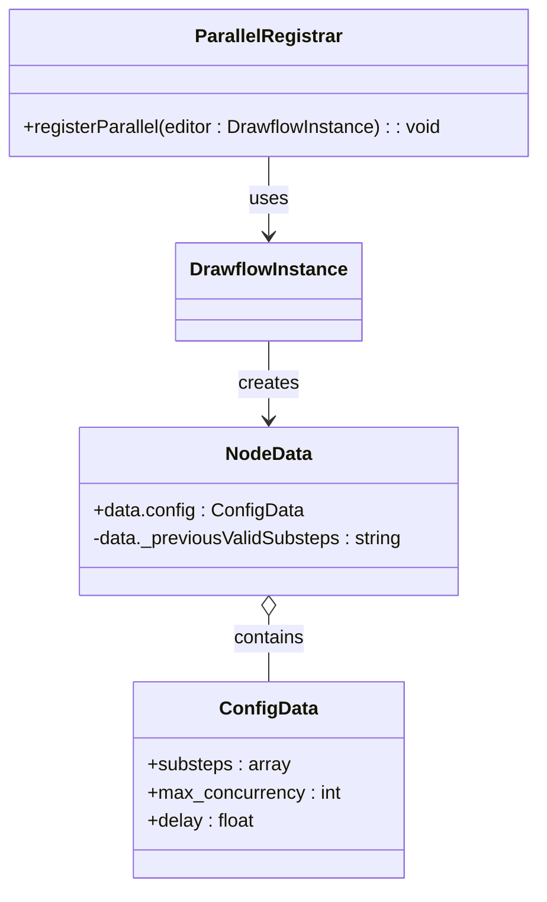
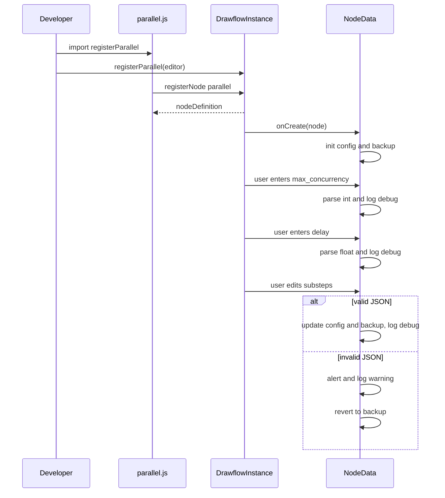
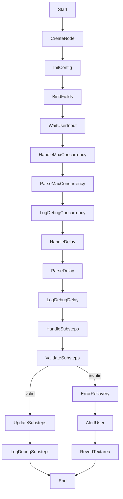
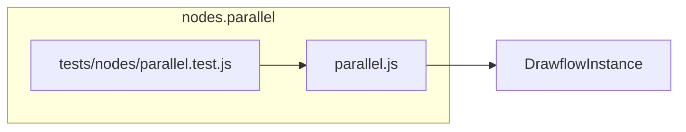
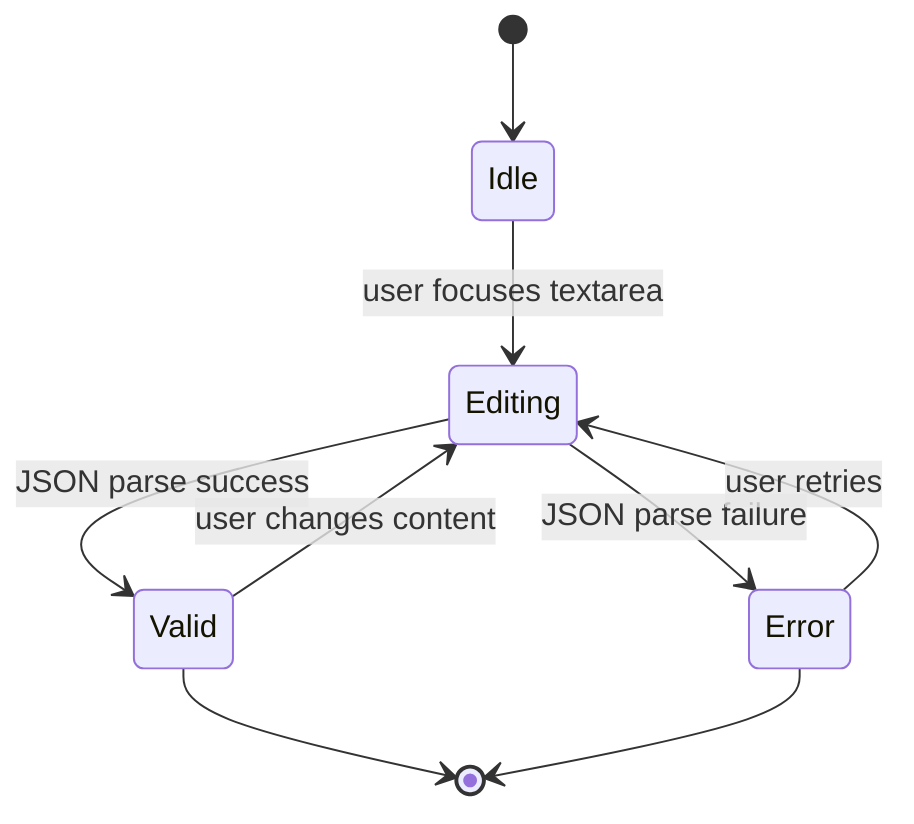

# Parallel Node Specification

## Purpose

Provides a Drawflow UI node for the “parallel” recipe step in the recipe builder. It lets end users specify and launch multiple sub-steps concurrently, with optional limits on concurrent execution and configurable launch delays.

## Core Requirements

- Export a function `registerParallel(editor: DrawflowInstance): void` as the public API. Documents should show how to import and call it (e.g., `import { registerParallel } from 'src/nodes/parallel.js'; registerParallel(editor);`).
- Within `registerParallel`, invoke `editor.registerNode('parallel', {...})` to register the node type.
- Embed an HTML template string defining `<textarea df-substeps>`, `<input type='number' df-max_concurrency>` and `<input type='number' step='0.1' df-delay>` fields.
- In the `onCreate(node)` handler, initialize `node.data.config = { substeps: [], max_concurrency: 0, delay: 0.0 }` and a hidden backup store (e.g., `node.data._previousValidSubsteps = '[]'`).
- Bind each field via its `df-` attribute to the matching `node.data.config` property.
- On user input for `max_concurrency`, parse the value as an integer ≥ 0 (treat blank or non‐numeric as 0), update config and log a debug message.
- On user input for `delay`, parse the value as a floating-point number ≥ 0.0, update config and log a debug message.
- On blur/change of the `substeps` textarea, attempt `JSON.parse`. If valid, update `node.data.config.substeps` and backup string, and log debug; if invalid, show an alert, log a warning, revert the textarea to the last valid JSON string, and leave config unchanged.
- Ensure that dragging a new Parallel node onto the canvas yields a valid default config object.
- Maintain consistency with other `/nodes/*.js` modules: plain ES module, no frameworks, vanilla JavaScript, similar `registerX` export and `onCreate` pattern.

## Implementation Considerations

- Use a self-contained ES module (`src/nodes/parallel.js`) exporting `registerParallel` and embedding the node’s HTML as a template string.
- Use Drawflow’s `df-*` attribute convention to bind DOM fields to `node.data.config` properties automatically.
- Initialize and store a private backup copy of the last valid substeps JSON (`node.data._previousValidSubsteps`) to support revert on parse errors.
- Parse and validate `substeps` JSON on blur/change; catch `SyntaxError` and other exceptions to prevent invalid state.
- Enforce that `max_concurrency` is a non-negative integer (0 means unlimited) and that `delay` is a non-negative float (units: seconds). Provide inline validation messages or enforce HTML `min=0` constraints.
- Log at debug level whenever config fields are parsed or updated, and at info level when the node is created or fully updated by the user.
- Keep the HTML minimal; rely on Drawflow’s default CSS for sizing and theming. Do not introduce custom styling in this module.
- Provide clear comments so future developers can extend the form (add new `df-*` fields and binding logic in `onCreate`).

## Component Dependencies

### Internal Components

- **DrawflowInstance** – the Drawflow editor instance passed into `registerParallel` (Required)

### External Libraries

None

### Configuration Dependencies

None

## Output Files

- `src/nodes/parallel.js` – ES module exporting `registerParallel(editor)`, registering the 'parallel' Drawflow node, rendering the HTML form, and implementing data binding and JSON validation.
- `tests/nodes/parallel.test.js` – Unit tests covering JSON parsing (valid and invalid substeps), config binding for `max_concurrency` and `delay`, and revert logic on JSON errors.

## Logging

### Debug

- Parsed substeps JSON: {{value}}
- Updated max_concurrency: {{value}}
- Updated delay: {{value}}

### Info

- Parallel node created with default config
- Parallel node configuration updated

## Error Handling

- **Error Type**: `JSONParseError`
  - **Message**: "Invalid JSON in Substeps field"
  - **Recovery Action**: Show an alert to the user, log a warning, revert the textarea to the last valid JSON, and leave `node.data.config.substeps` unchanged.

## Dependency Integration Considerations

None

## Diagrams

### Class Diagram

Shows the main module, its relationships to Drawflow, and how NodeData holds its Config.

### Sequence Diagram

Flows through importing and registering the node, creation, and handling of user inputs (including valid/invalid JSON).

### Activity Diagram

High-level workflow inside onCreate and event handlers, including parsing, validation, and error recovery.

### Component Diagram

Depicts how the parallel.js module and its tests integrate with DrawflowInstance.

### State Machine Diagram

States for the substeps textarea: idle, editing, valid, and error states.

