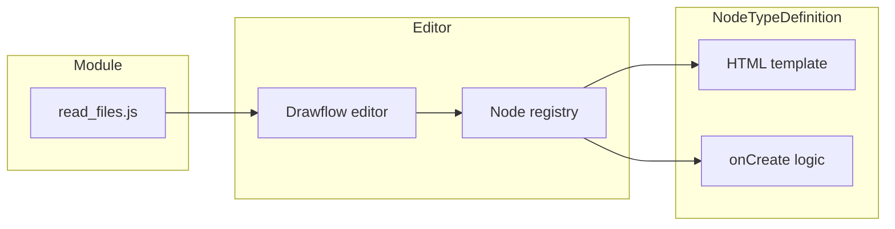
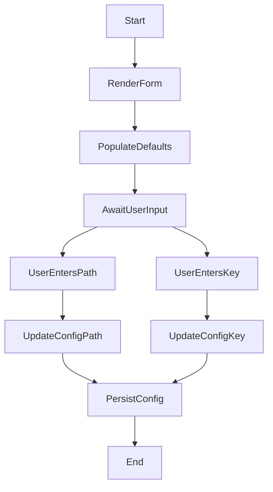

# Read Files Node

## Overview

The **Read Files Node** (`read_files`) is a Drawflow node that allows users to specify one or more file paths and a content key to read file contents into the recipe context. It renders an accessible HTML form, handles comma-separated multiple paths, binds form inputs to the node’s configuration, and integrates seamlessly with Drawflow’s serialization to export/import recipes.

## Installation & Registration

Import and register the node type after your Drawflow editor is initialized:

```javascript
import Drawflow from 'drawflow';
import { registerReadFiles } from './src/nodes/read_files.js';

// Assuming you've created and started your editor:
const editor = new Drawflow(document.getElementById('drawflow')); 
editor.start();

// Register the Read Files Node:
registerReadFiles(editor);
```

## Drawflow Integration Snippet

Once registered, you can add a Read Files Node from your UI or toolbar. It will render two labeled inputs:

- **Path** (supports comma-separated multiple file paths)
- **Key** (the context key under which file contents will be stored)

```html
<!-- Example placeholder in your toolbar -->
<button onclick="editor.addNode('read_files', 0, 1, 1, 'Read Files', {})">
  Add Read Files Node
</button>
```

## Node Configuration

- **path**: An array of file path strings (e.g., `['foo.txt', 'bar.txt']`).
- **content_key**: A string key under which the combined content will be stored in the recipe context.

When the node is created, both inputs default to an empty string. User edits update the node’s `data.config` in real time.

## Recipe Serialization Format

When exporting your Drawflow graph to JSON, the Read Files Node serializes to a step object:

```json
{
  "type": "read_files",
  "path": ["input1.txt", "input2.dat"],
  "content_key": "fileContents"
}
```

### Example Recipe Snippet

```json
{
  "steps": [
    {
      "type": "read_files",
      "path": ["./data/users.csv", "./data/orders.csv"],
      "content_key": "csvData"
    }
  ]
}
```

## Usage Example

1. **Add Node**: Click your "Add Read Files Node" button (or context menu) to place a `read_files` node on the canvas.
2. **Enter Paths**:
   - Single file: `README.md`
   - Multiple files: `a.txt, b.txt,  c.txt`
3. **Enter Key**: e.g. `allFilesContent`
4. **Connect**: Chain this node’s output to other processing steps in your Drawflow recipe.
5. **Export**: Use `editor.export()` to obtain JSON and feed it into your recipe executor.

## Configuration & Options

- The **Path** input splits on commas, trims whitespace, and ignores empty entries.  
- The **Key** input takes any non-empty string.  
- All values are stored in the node’s `data.config` object.

## Diagrams

### Component Integration Diagram

This diagram shows how the Read Files module connects to the Drawflow editor and node registry:



### User Interaction Flow

This activity diagram models the user workflow for the Read Files Node form:



---

**Note**: For implementation details (HTML template, event binding, logging), refer to the component specification or source file `src/nodes/read_files.js`.