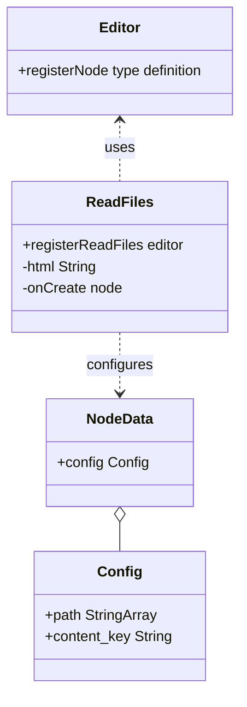
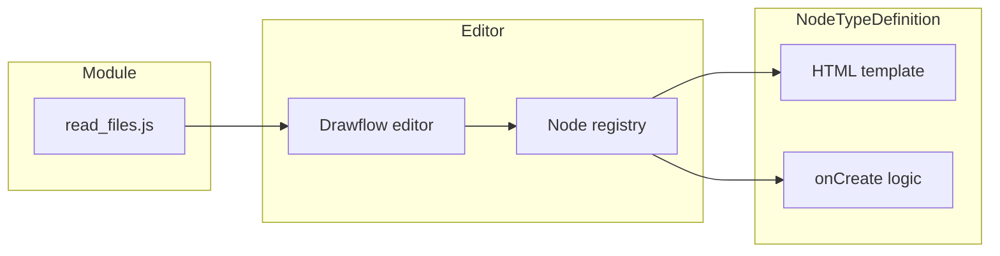
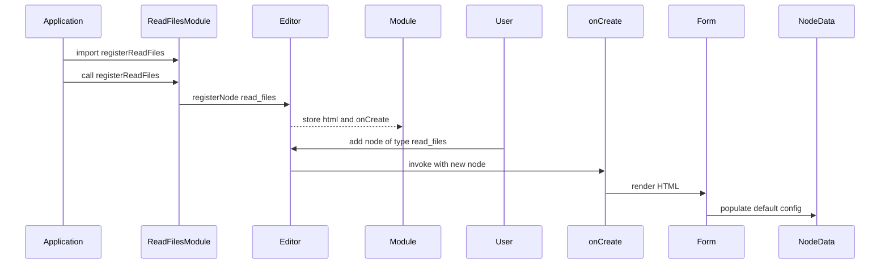
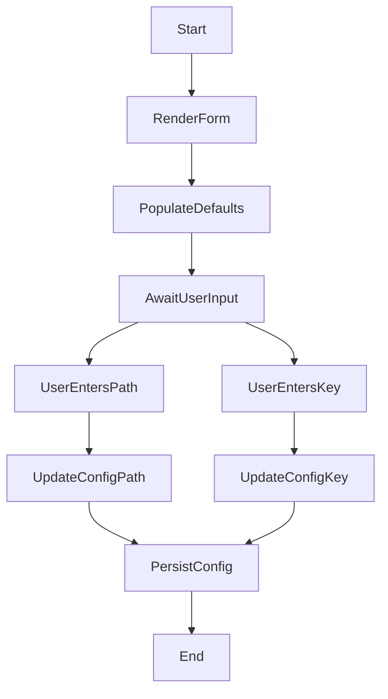

# Read Files Node Specification

## Component Title

Read Files Node

## Purpose Statement

Provides registration of the `read_files` Drawflow node type. This node renders an accessible HTML form with labelled inputs for one or more file paths and a content key, supports comma-separated multiple paths, binds user input to the node’s configuration, and integrates with the serialization layer to export and import recipes correctly.

## Core Requirements

- Register the Drawflow node type `read_files` via `editor.registerNode`
- Render an HTML form containing `<label>` elements with `for` attributes and corresponding `<input>` elements for file paths (`data-df-path`) and content key (`data-df-content_key`)
- Populate input fields with `node.data.config.path` (default empty string) and `node.data.config.content_key` (default empty string) when a node is created
- Support multiple file paths by accepting a comma-separated string in the file path input and storing `node.data.config.path` as an array of trimmed path strings
- Bind user edits in the file path input to update `node.data.config.path` on each input event
- Bind user edits in the content key input to update `node.data.config.content_key` on each input event

## Implementation Considerations

- Use a plain ES module exporting a named function `registerReadFiles(editor)`
- Invoke `editor.registerNode("read_files", { html, onCreate })` once the Drawflow editor is initialized
- Define `html` as a template string containing:
  ```html
  <label for="read-files-path">Path</label>
  <input id="read-files-path" data-df-path>
  <label for="read-files-content_key">Key</label>
  <input id="read-files-content_key" data-df-content_key>
  ```
- Use HTML5 data attributes (`data-df-path` and `data-df-content_key`) to align with Drawflow conventions
- In the `onCreate` callback:
  - Query for `[data-df-path]` and `[data-df-content_key]`
  - Set their `.value` from `node.data.config` (defaulting to empty strings)
  - Add `input` event listeners
- In the file path input listener:
  - Split `input.value` by commas, trim whitespace, filter out empty entries
  - Assign the resulting array to `node.data.config.path`
- Keep implementation minimal—avoid additional abstractions and rely directly on Drawflow’s binding conventions

## Component Dependencies

### Internal Components

None

### External Libraries

- **drawflow (>=0.4.0)** — used for node registration and df-* data-binding conventions

### Configuration Dependencies

None

## Output Files

- `src/nodes/read_files.js` — ES module exporting named `registerReadFiles(editor)` that registers the `read_files` node type, defines its HTML template, and implements binding logic.
- `docs/nodes/read_files.md` — Component documentation for the Read Files Node, including import instructions, usage examples, Drawflow integration snippet, and recipe JSON example.
- `src/nodes/__tests__/read_files.test.js` — Unit tests for the Read Files Node component, covering default values on creation, user input binding, and export/import serialization.

## Logging

### Debug

- Log at the start of `registerReadFiles` when the node type is registered
- Log inside `onCreate`, showing initial `node.data.config` values for `path` and `content_key`
- Log each time the file path or content key input changes, including the new path array or `content_key` value

### Info

None

## Error Handling

None

## Dependency Integration Considerations

- Ensure Drawflow’s CSS and `editor.start()` are loaded before calling `registerReadFiles`
- No additional properties beyond `html` and `onCreate` are required on `editor.registerNode` for this node type
- Compatible with the `core/canvas.js` module which provides the editor instance

## Diagrams

### Class Diagram

Shows the main classes/modules involved in registering and configuring the Read Files Node.



### Component Diagram

Outlines the high-level components and how the read_files module integrates with the Drawflow editor.



### Sequence Diagram

Describes the runtime interaction when the application imports and initializes the Read Files Node.



### Activity Diagram

Models the user input flow: rendering the form, handling edits, and updating the node configuration.

