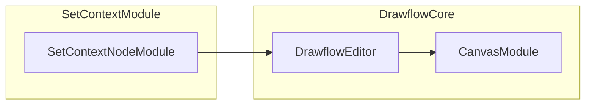

# Set Context Drawflow Node

## Overview

The **Set Context Drawflow Node** allows you to write or merge values into the execution context of a Drawflow recipe. Users configure a small form with the following fields:

- **Context Key**: The name of the context variable to set or merge.
- **Value**: The content to assign—can be plain text or nested JSON if `Nested Render` is enabled.
- **Nested Render**: When checked, the node parses the `Value` field as JSON before saving.
- **If Exists**: Merge strategy with two options:
  - `overwrite` (default)
  - `merge`

All form inputs bind directly to the node’s `data.config` and are immediately reflected in `editor.export()`.

## Registration

When your Drawflow editor initializes, register the node type:

```js
import { editor } from 'drawflow';
import './nodes/set_context.css';
import './nodes/set_context.js';

// In set_context.js the module calls:
// editor.registerNode('set_context', { html, onCreate, onUpdate, onDestroy });
```

Once registered, users can drag a **Set Context** node onto the canvas.

## UI Fields & Defaults

On creation, the node’s `data.config` defaults to:

```js
{
  key: '',
  value: '',
  nested_render: false,
  if_exists: 'overwrite'
}
```

The four form controls have data attributes that map to `config`:

- `<input df-key>` → `config.key`
- `<textarea df-value>` → `config.value`
- `<input type="checkbox" df-nested_render>` → `config.nested_render`
- `<select df-if_exists>` → `config.if_exists`

## JSON Serialization Example

When you call `editor.export()`, a **Set Context** node appears in the Drawflow JSON as follows:

```json
{
  "id": 2,
  "name": "set_context",
  "class": "set-context",
  "data": {
    "config": {
      "key": "output",
      "value": "{{ read_files_result }}",
      "nested_render": true,
      "if_exists": "merge"
    }
  },
  "position": { "x": 100, "y": 200 }
}
```

## Integration in Execution

During recipe execution, the engine reads `config` and:

1. **Validates** the `key` is non-empty (otherwise the node stays in error state).  
2. If `nested_render` is **true**, parses `value` as JSON—on parse error, surfaces a **JSONParseError** and offers a "Treat as raw string" fallback.  
3. Applies merge strategy:
   - **overwrite**: replaces any existing context value.
   - **merge**: deep-merges objects if both old and new values are JSON objects.

## Validation & Error Handling

- **Context Key Required**: If `key` is empty, an inline error message appears under the input, the field gets a `.invalid` class, and all other controls are disabled until corrected.
- **JSON Parsing**: On blur of the value textarea (when `Nested Render` is checked), invalid JSON triggers a parse error. The textarea highlights red with a tooltip explaining the error and an option to accept the raw string.

## Example Usage

1. Drag a **Set Context** node to the canvas.  
2. Enter `key = result`, `value = { "count": 5 }`, check `Nested Render`, leave `If Exists = overwrite`.  
3. After losing focus on `value`, the node parses and stores `{ count: 5 }` in the execution context under `result`.

## Mermaid Component Diagram

Below is a high-level diagram showing how the **Set Context** node module fits into the Drawflow ecosystem:



## Styling

The node uses scoped CSS in `src/nodes/set_context.css`. Key selectors include:

- `.drawflow-node.set-context` (container)
- `.title-box` (header)
- `.box` (form area)
- `.form-group` (each field wrapper)

## Important Notes

- All inputs update `node.data.config` in real time.  
- Nodes with invalid keys cannot be edited or moved until corrected.  
- Nested JSON parsing happens on blur; users can choose to accept raw text if parsing fails.  
- Merge strategy only applies when existing context values and the new value are both objects.
