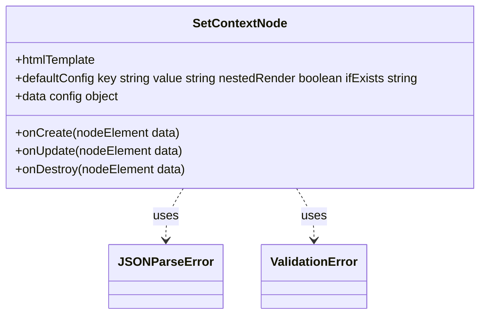
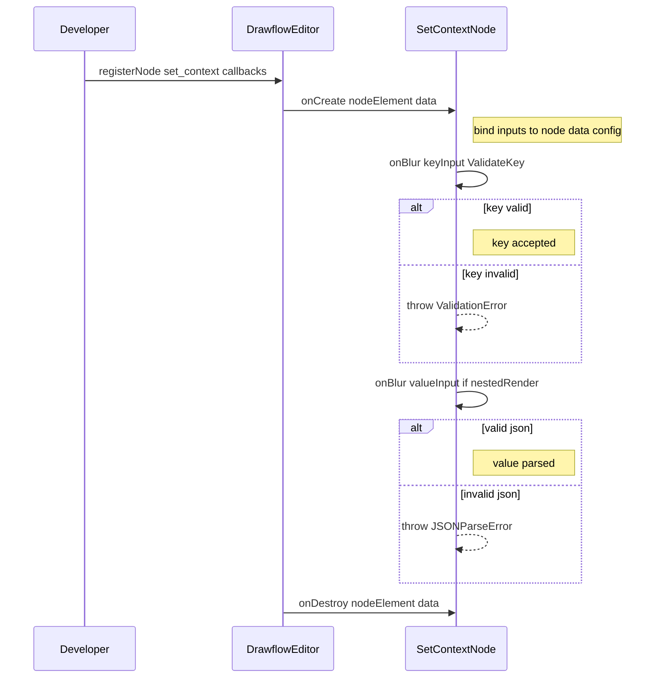
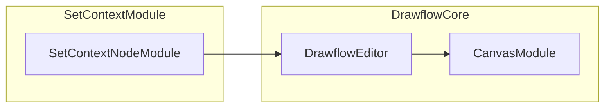
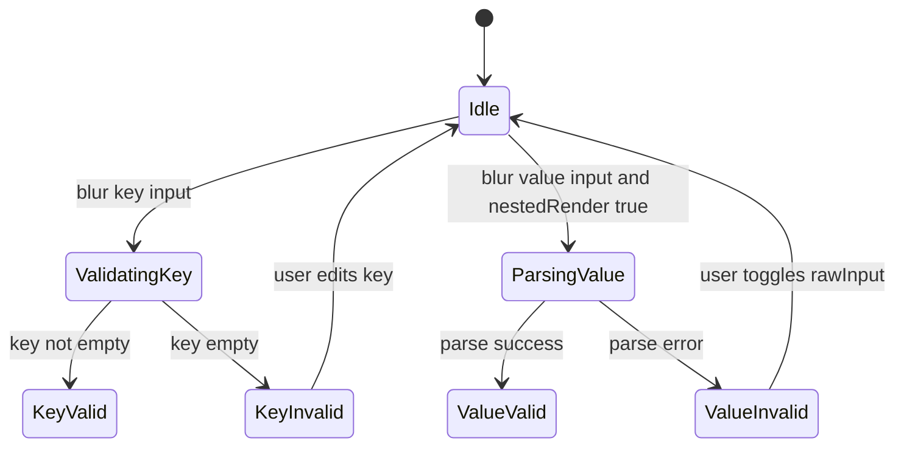
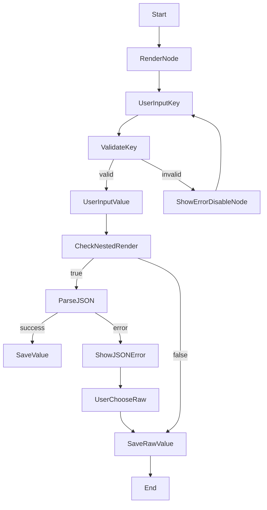

# Set Context Drawflow Node Specification

## Purpose Statement
The Set Context Drawflow Node allows users to configure a Drawflow recipe step that writes or merges values into the execution context. It presents a small form with fields for context key, value, nested rendering, and merge strategy, binds those inputs to node.data.config, and serializes them into the Drawflow JSON for use by downstream recipe execution.

## Core Requirements
- Register a Drawflow node named "set_context" by calling `editor.registerNode`
- Render a container with class `drawflow-node set-context` wrapping:
  - a header/title-box labeled “Set Context”
  - a box area with four form fields
- Provide form controls:
  - text input for context key
  - textarea for value
  - checkbox for nested_render
  - select dropdown for if_exists with options “overwrite” and “merge”
- Bind each input element carrying `df-key`, `df-value`, `df-nested_render`, `df-if_exists` attributes to `node.data.config` on creation and update
- Enforce default config for new nodes: `{ key: '', value: '', nested_render: false, if_exists: 'overwrite' }`
- Persist user changes immediately in `node.data.config` so that `editor.export()` reflects the current values
- Validate that the context key is non-empty: on blur or input, if empty show inline error and disable node editing until corrected
- On value textarea blur or config change when nested_render is true, attempt `JSON.parse`; on failure emit `JSONParseError`
- Clean up all input listeners when a node is destroyed to avoid memory leaks

## Implementation Considerations
- Implement in plain ES module at `src/nodes/set_context.js`; no frameworks
- Define HTML as a template string:
  ```html
  <div class="drawflow-node set-context">
    <div class="title-box">Set Context</div>
    <div class="box">…</div>
  </div>
  ```
- Use `df-*` conventions:
  - `df-key` for key input
  - `df-value` on textarea
  - `df-nested_render` on checkbox
  - `df-if_exists` on select
- In `onCreate` callback, `querySelectorAll('[df-key],[df-value],[df-nested_render],[df-if_exists]')`, read attribute name (e.g., key, value) and attach input/change listeners updating `node.data.config[name]`
- Default `node.data.config` to `{ key: '', value: '', nested_render: false, if_exists: 'overwrite' }` in `onCreate`
- Parse JSON on textarea blur if `nested_render` is true or on save; wrap `JSON.parse` in `try/catch`, throw `JSONParseError` on failure
- Define custom `JSONParseError` class in module: `class JSONParseError extends Error {}`
- In `onUpdate`, mirror same binding logic to re-sync if external `editor.updateNodeData` is called
- Use `registerNode` signature:
  ```js
  editor.registerNode('set_context', {
    html,
    onCreate(nodeElement, data) { … },
    onUpdate(nodeElement, data) { … },
    onDestroy(nodeElement, data) { … }
  });
  ```
- In `onDestroy`, remove all listeners added to inputs to avoid dangling references
- Style in separate CSS at `src/nodes/set_context.css` scoped under `.drawflow-node.set-context`; reuse `.title-box`, `.box`, `.form-group` classes

## Component Dependencies

### Internal Components
- **core/canvas.js**

### External Libraries
- **drawflow**

### Configuration Dependencies
**None**

## Output Files
- `src/nodes/set_context.js` - ES module that registers the Set Context node type, defines its HTML form, wires `df-*` inputs to `node.data.config`, and implements create/update/destroy callbacks
- `src/nodes/set_context.css` - Scoped CSS for the Set Context node: styles for `.drawflow-node.set-context`, `.title-box`, `.box`, `.form-group`, input, textarea, select

## Logging
- Debug:
  - Log initial default config for new node with node ID in `onCreate`
  - Log each field update: field name, new value, and node ID
- Info: **None**

## Error Handling
- ValidationError:
  - Error Message: "Context key is required"
  - Recovery Action: Show inline error message below the key input, add CSS class `.invalid`, disable all inputs until a non-empty key is entered
- JSONParseError:
  - Error Message: "Value field contains invalid JSON"
  - Recovery Action: Highlight textarea in red, show a tooltip with parse error message, and surface a "Treat as raw string" toggle to accept the raw input

## Dependency Integration Considerations
**None**

## Diagrams

### Class Diagram
Represents the main classes and their relationships for the Set Context node component


### Sequence Diagram
Shows the registration of the node and the callback flow including error handling


### Component Diagram
Illustrates how the Set Context node module fits into the Drawflow ecosystem


### State Machine Diagram
Models the validation and error states for key and value inputs


### Activity Diagram
Describes user interactions from rendering the node to saving config
