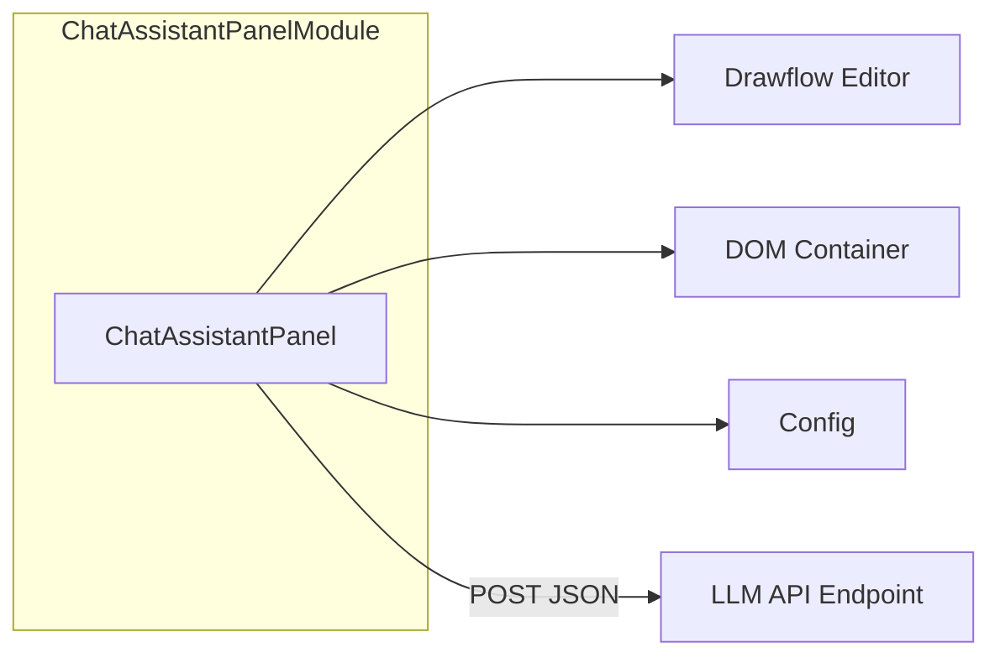

# Chat Assistant Panel

A lightweight, framework-free sidebar UI component that provides an interactive chat interface to an LLM endpoint. It captures user prompts, displays a scrollable history with timestamps and labels, handles errors gracefully, and—on demand—adds or updates `llm_generate` nodes in a Drawflow editor instance based on chat interactions.

---

## Component Diagram

This diagram shows how the Chat Assistant Panel module interacts with its environment:



---

## Installation & Importing

Assuming an ES module build (`src/ui/chat_assistant_panel.js`):

```js
import { init as initChatPanel } from 'src/ui/chat_assistant_panel.js';
```

No external libraries are required beyond a standard browser environment.

---

## Initialization

Call `init(containerEl, editor, config)` to mount the panel:

```js
const container = document.getElementById('sidebar');
const chat = initChatPanel(container, drawflowEditor, {
  endpointUrl: 'https://api.example.com/llm',
  apiKey: 'MY_LLM_API_KEY',
  // Optional overrides:
  i18n: { send: 'Enviar', retry: 'Reintentar' },
  debounceInterval: 200  // Not used by default but reserved for future
});
```

- **containerEl**: A DOM element with `role="complementary"` and `aria-label` (e.g. `<div role="complementary" aria-label="Chat"></div>`).
- **editor**: Instance of Drawflow editor for node insertion/updating.
- **config**:
  - `endpointUrl` (string, required): LLM API POST URL.
  - `apiKey` (string, required): Bearer token for `Authorization` header.
  - `i18n` (object, optional): Override static UI labels, e.g. `{ send, retry, errorGeneric }`.
  - `debounceInterval` (number, optional): Reserved for future use.

---

## Public API Reference

#### init(containerEl, editor, config)
Mounts the panel into the given container and wires up the Drawflow editor.

#### sendMessage(text: string)
Programmatically sends a user message as if typed and submitted.

#### clearHistory()
Clears all messages from the chat history.

#### teardown()
Removes the panel DOM, cleans up timers and event listeners.

#### on(event: string, callback: Function)
Subscribe to internal events:

| Event              | Payload                                | When triggered                                |
|--------------------|----------------------------------------|-----------------------------------------------|
| `messageSent`      | `{ content, timestamp }`              | After user message is enqueued                |
| `messageReceived`  | `{ content, timestamp }`              | After assistant response is rendered          |
| `error`            | `{ errorType, messageId }`            | On network or invalid-response errors         |
| `stream`           | `chunk: string`                       | Stub for future streaming support             |
| `nodeAdded`        | `{ nodeId, config }`                  | After inserting a new `llm_generate` node     |
| `nodeUpdated`      | `{ nodeId, config }`                  | After updating an existing node               |
| `historyCleared`   | none                                  | After `clearHistory()` completes              |

---

## Basic Usage Example

```js
// 1. Initialize
const chat = initChatPanel(
  document.getElementById('sidebar'),
  drawflowEditor,
  { endpointUrl, apiKey }
);

// 2. Hook events
chat.on('messageReceived', msg => console.log('Assistant:', msg.content));
chat.on('error', err => console.error('Chat error:', err));

// 3. Send a message programmatically
chat.sendMessage('Hello, assistant!');

// 4. Clear history later
chat.clearHistory();

// 5. Clean up when done
chat.teardown();
```

---

## Integration with Drawflow Editor

An “Insert Node” icon appears alongside each assistant message. On click, the panel:

- Calls `editor.addNode('llm_generate', config)` if no node is selected.
- Calls `editor.updateNode(nodeId, config)` if an existing node is active.

The `config` object passed to Drawflow includes:

```js
{
  position: { x: number, y: number },
  data: {
    prompt: string,       // the original user prompt
    model: string,        // model identifier from config or override
    max_tokens: number,   // from response usage or default
    output_format: string,// e.g. 'text'
    output_key: string    // identifier for downstream data
  }
}
```

You can listen to the `nodeAdded` and `nodeUpdated` events via `on(event, callback)`.

---

## User Interaction & Accessibility

- **Typing**: Enter = send; Shift+Enter = newline.
- **Auto-scroll**: New messages scroll into view unless the user has manually scrolled up more than 50px.
- **Button state**: Send button is disabled while awaiting a response.
- **Roles & labels**: The container must have `role="complementary"` and an `aria-label` for screen readers.

---

## Error Handling

- **NetworkError**: Displays an italicized, inline error bubble under the message with a “Retry” button. Clicking it resends the request.
- **InvalidResponseError**: Logs raw payload via `console.debug` and displays a generic error message from the `i18n.errorGeneric` label.

---

## Customization & Localization (i18n)

Override any static UI text by passing an `i18n` map when initializing:

```js
{
  send: 'Enviar',
  retry: 'Reintentar',
  placeholder: 'Escribe un mensaje...',
  errorGeneric: 'Ocurrió un error. Inténtalo de nuevo.'
}
```

---

## Chat History Behavior

- Displays messages with 24-hour `HH:MM` timestamps and labels (“You” vs. “Assistant”).
- Caps history at 100 messages; oldest messages are pruned from both state and DOM.

---

## Teardown & Cleanup

Always call `teardown()` when the panel is no longer needed. This method:

- Removes all event listeners
- Clears timers
- Deletes inserted DOM nodes

---

## CSS & Styling

- Uses BEM-style classes prefixed with `chat-panel__`.
- Matches existing sidebar layout and CSS variables.
- You may override styles via your global stylesheet targeting these classes.

---

## Important Notes

- Ensure your LLM endpoint supports CORS for browser POST requests.
- The panel sends messages as JSON `{ messages: [...] }` and expects a response matching the documented schema.
- Use provided hooks (`on`) rather than modifying internal DOM structure.
- Future streaming support will use the `stream` event.

---

For more detailed implementation guidelines, refer to the component specification (`ui.chat_assistant_panel_spec.md`).