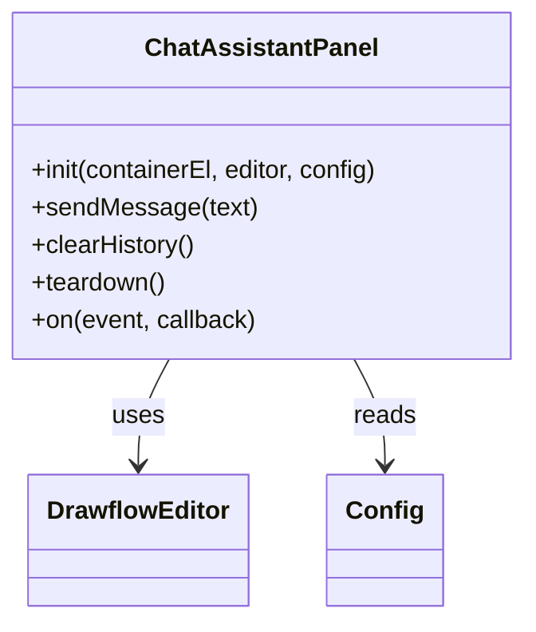
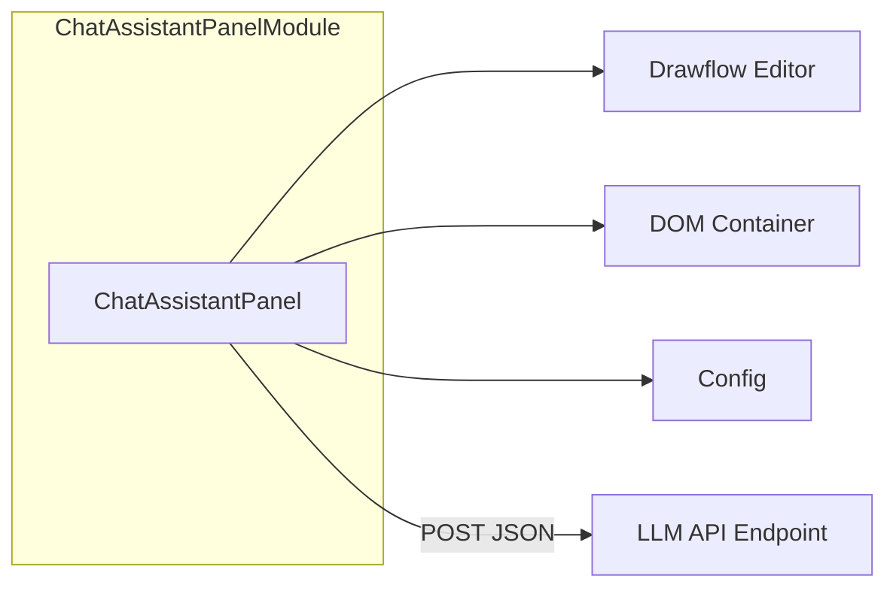
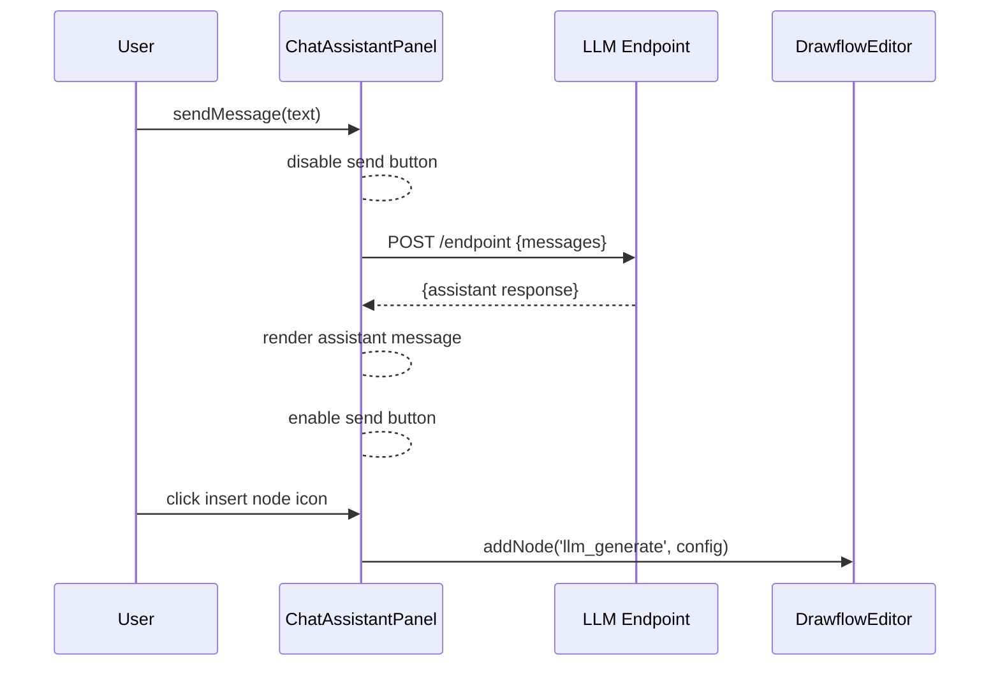
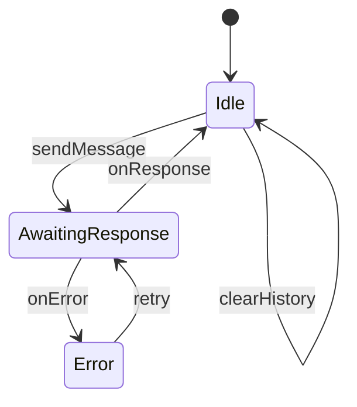

# Chat Assistant Panel Specification

## Purpose

A lightweight, framework-free sidebar UI component that provides an interactive chat interface to an LLM endpoint. It captures user prompts, displays a scrollable history with timestamps and labels, handles errors gracefully, and—on demand—adds or updates `llm_generate` nodes in a Drawflow editor instance based on chat interactions.

## Core Requirements

- Mount into a user-supplied container element (e.g. `

`).
- Render a scrollable chat history area showing messages with 24 hour HH:MM timestamps, labels ('You' vs. 'Assistant'), and auto-scroll to newest unless the user has scrolled up more than 50 px.
- Provide a text input and send button; pressing Enter submits a message, Shift+Enter inserts newline.
- Disable the send button while awaiting an LLM response; re-enable on response or error.
- Send chat requests as JSON via POST to a configurable `LLM_API_ENDPOINT` with schema `{ "messages": [{ "role": "user", "content": string, "timestamp": string }] }`; include API key in `Authorization: Bearer <LLM_API_KEY>` header.
- Parse responses matching schema `{ "id": string, "choices": [{ "message": { "role": "assistant", "content": string }, "finish_reason": string }], "usage": { "prompt_tokens": number, "completion_tokens": number, "total_tokens": number }, "timestamp": string }` and display the assistant’s content in history.
- On an explicit user action (e.g. clicking an “Insert Node” icon), call `editor.addNode('llm_generate', config)` when no active node exists or `editor.updateNode(nodeId, config)` when a node is selected; `config` must include `{ position: { x, y }, data: { prompt, model, max_tokens, output_format, output_key } }`.
- Expose public methods: `clearHistory()`, `teardown()`, `on(event, callback)` for external hooks; and `sendMessage(text: string)` to programmatically send a prompt.
- Handle network failures (display inline italicized error in message bubble with a retry button) and invalid responses (log raw payload via console.debug and show generic error message).
- Prune chat history after 100 messages (drop oldest) to limit memory usage.
- Clean up all event listeners, timers, and DOM nodes on `teardown()`.

## Implementation Considerations

- Implement as a plain ES module (`chat_assistant_panel.js`) exporting `init(containerEl, editor, config)` and other public API methods.
- Accept a configuration object at initialization: `{ endpointUrl: string, apiKey: string, i18n?: Record<string,string>, debounceInterval?: number }`.
- Use the Fetch API for requests; include `Authorization: Bearer ${apiKey}` header and `Content-Type: application/json`.
- Maintain minimal internal state (list of message objects); update the DOM directly with BEM-style scoped CSS classes prefixed `chat-panel__`.
- Disable the send button until the LLM POST resolves or fails; do not implement a fixed time debounce window.
- Display timestamps in 24h HH:MM format on every message; group messages only visually but still timestamp each entry.
- Support overriding all static UI labels and error messages by passing an `i18n` map at init (e.g. `{ send: 'Enviar', retry: 'Reintentar' }`).
- Provide a stub callback `on('stream', chunk => {...})` to allow future streaming support without changing the core API.
- Ensure container markup includes `role="complementary"` and `aria-label`; attach keyboard event handlers for accessibility.
- Cap history length at 100; on overflow remove oldest message from both state and DOM.
- Clean up all event listeners, timers, and DOM nodes on `teardown()`.

## Component Dependencies

### Internal Components

- **Drawflow editor instance** - (Required) ChatAssistantPanel uses Drawflow editor for node insertion and updates.
- **Toolbox Shell UI** - (Required) ChatAssistantPanel uses Toolbox Shell UI for layout consistency.

### External Libraries

None

### Configuration Dependencies

- **LLM_API_ENDPOINT** - (Required) URL of the LLM API endpoint. Format: string.
- **LLM_API_KEY** - (Required) API key for authenticating with the LLM API. Format: string.

## Output Files

- `src/ui/chat_assistant_panel.js` - ES module implementing the chat assistant panel UI, network integration, error handling, Drawflow node hooks, and public API methods.

## Logging

- Debug:
  - ChatAssistantPanel initialized with container, editor, and config
  - Sending LLM request payload: {messages, endpointUrl}
  - Received raw LLM response: {response}
  - LLM request completed in {duration}ms with usage {usage}
  - Invoked Drawflow editor API: {action} with config {config}
  - Auto-scrolled to newest message

- Info:
  - User message submitted: {content}
  - Assistant response rendered: {content}
  - Chat history cleared

- Error:

None

## Error Handling

- **NetworkError**: "Failed to fetch LLM response" — Display inline error under the message with a 'Retry' button and re-enable send button.
- **InvalidResponseError**: "Unexpected LLM response format" — Log raw payload via `console.debug` and show a generic error label to the user.

## Dependency Integration Considerations

- Ensure the LLM endpoint supports CORS for browser POST requests
- Pass the Drawflow `editor` instance on initialization to allow node manipulation
- Align CSS with existing sidebar layout and CSS variables; use BEM prefix `chat-panel__`
- Document required HTML container structure (`role`, `aria-label`)
- Provide stub for streaming via `on('stream', callback)` for future extension
- Allow clients to override all static labels via the `i18n` config

## Diagrams

### Class Diagram

**Description**: Class structure of the ChatAssistantPanel module, its public API and dependencies.

### Component Diagram

**Description**: High level components and their relationships for the chat assistant panel.

### Sequence Diagram

**Description**: Sequence of events when a user sends a message and receives a response.

### State Diagram

**Description**: Internal state transitions of the ChatAssistantPanel during messaging.

