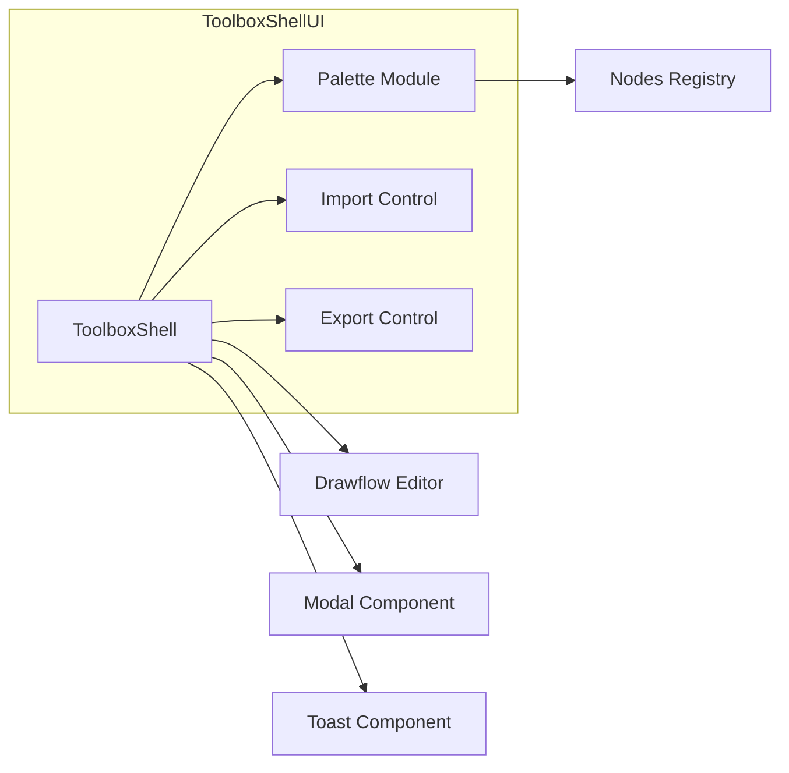
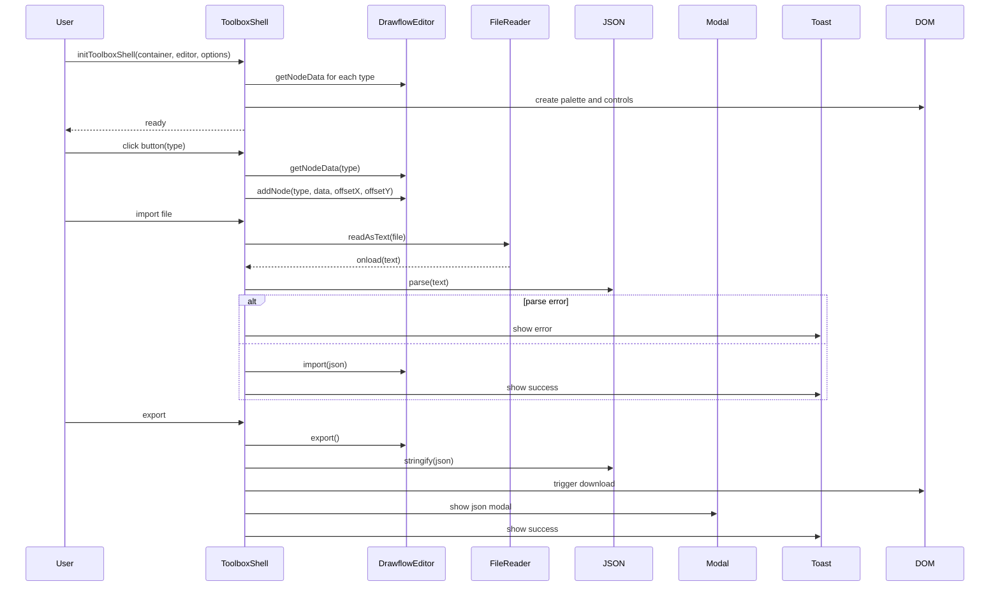

# Toolbox Shell UI

The Toolbox Shell UI renders and manages a palette of Drawflow node buttons alongside Import and Export controls within a supplied container element. It enables users to click or drag‐and‐drop to add nodes—using correct default data and intended positioning—into an existing Drawflow editor instance, and to import/export the flow as JSON. It provides consistent styling, accessibility, logging, and clear user feedback, all without introducing global state.

---

## Table of Contents

1. [Installation & Import](#installation--import)
2. [Initialization & Teardown](#initialization--teardown)
3. [Options](#options)
4. [Core Features](#core-features)
   - [Node Palette](#node-palette)
   - [Adding Nodes](#adding-nodes)
   - [Import Control](#import-control)
   - [Export Control](#export-control)
5. [Accessibility & Styling](#accessibility--styling)
6. [API Reference](#api-reference)
7. [Usage Examples](#usage-examples)
8. [Integration Guidelines](#integration-guidelines)
9. [Important Notes](#important-notes)
10. [Diagrams](#diagrams)

---

## Installation & Import

Install or copy the module into your project, then import:

```js
import { initToolboxShell } from 'src/ui/toolbox_shell.js';
import 'src/ui/toolbox_shell.css';
```

---

## Initialization & Teardown

### initToolboxShell

```ts
interface ToolboxOptions {
  /** Text labels for controls */
  labels?: { import?: string; export?: string };
  /** CSS class prefix (default: "tb-shell") */
  classPrefix?: string;
  /** Filename template for imports/exports */
  importAccept?: string;       // e.g. ".json"
  exportFileName?: (timestamp: number) => string;
  /** Optional logger (logger.debug/info) */
  logger?: { debug(...args: any[]): void; info(...args: any[]): void };
}

function initToolboxShell(
  containerEl: HTMLElement,
  editor: Drawflow,
  options?: ToolboxOptions
): { teardown: () => void };
```

- **containerEl**: The DOM element where the toolbox will be rendered.
- **editor**: An initialized and started Drawflow editor instance.
- **options**: Optional configuration (labels text, CSS prefix, filenames, logger).

Returns an object with:
- **teardown()**: Removes event listeners and DOM nodes.

---

## Options

- `labels.import` (string): Text for the Import button (default: "Import JSON").
- `labels.export` (string): Text for the Export button (default: "Export JSON").
- `classPrefix` (string): Base CSS class prefix (default: `"tb-shell"`).
- `importAccept` (string): File‐picker accept filter (default: `".json"`).
- `exportFileName` (timestamp: number) ⇒ string: Generates the filename for downloads (default: `drawflow-export-<timestamp>.json`).
- `logger` (object): Object implementing `debug(...)` and `info(...)`. Defaults to `console`.

---

## Core Features

### Node Palette

- Renders a scrollable grid of buttons—one per registered Drawflow node type.
- Groups buttons by category when provided in registration.
- Supports icons or labels as defined by nodes.
- Uses BEM CSS classes: `<prefix>__palette`, `<prefix>__button`.


### Adding Nodes

- **Click-to-add**: Clicking a node button calls:
  ```js
  editor.addNode(type, defaultData, fixedOffsetX, fixedOffsetY);
  ```
- **Drag & Drop**: Dragging a node button over the canvas instantiates the node at the drop coordinates, taking into account editor transformations.


### Import Control

- An `<input type="file" accept="application/json">` and drop zone.
- Reads and validates JSON using `FileReader` and `JSON.parse()`.
- On successful parse, prompts user for confirmation, then calls:
  ```js
  editor.import(flowJson);
  ```
- Displays user feedback via toast/alert on success or error.


### Export Control

- Calls `editor.export()`, then:
  1. Logs the returned flow JSON.
  2. Serializes with `JSON.stringify(flow, null, 2)`.
  3. Triggers a download: `<a download>` → automatic save.
  4. Displays the JSON content in an accessible modal for manual copy.

---

## Accessibility & Styling

- **Keyboard Navigation**: `tabindex` on buttons; arrow‐key focus movement; Enter key activates.
- **ARIA Roles & Labels**:
  - Palette: `role="listbox"`, each button: `role="option"`, `aria-label="<node type>"`.
  - Import/Export: `aria-label` corresponding to button text.
- **Styling**:
  - Uses BEM naming: `.tb-shell`, `.tb-shell__palette`, `.tb-shell__button`, `.tb-shell__control`.
  - Scoped via `toolbox_shell.css` (import or inline) to match project theming.

---

## API Reference

### initToolboxShell(containerEl, editor, options)

Initializes and renders the toolbox shell UI.

**Parameters**:
- `containerEl: HTMLElement` — The container element.
- `editor: DrawflowInstance` — The target Drawflow editor.
- `options?: ToolboxOptions` — Configuration overrides.

**Returns**:
- `{ teardown: () => void }` — Object with a teardown function.

---

### teardown()

Removes all event listeners and DOM nodes added by the toolbox. After calling, the UI is fully cleaned up.

---

## Usage Examples

```js
import { initToolboxShell } from 'src/ui/toolbox_shell.js';

// 1. Prepare your DOM container and Drawflow editor
const container = document.getElementById('toolbox-container');
const editor = new Drawflow();
editor.start();

// 2. Initialize the toolbox
const { teardown } = initToolboxShell(container, editor, {
  labels: { import: 'Load JSON', export: 'Save JSON' },
  classPrefix: 'tb-shell',
  exportFileName: ts => `my-flow-${ts}.json`,
  logger: customLogger,
});

// 3. Later, to destroy:
teardown();
```

**Importing a flow**: click the Import button or drop a `.json` file onto the palette area. Confirm the prompt to load.

**Exporting a flow**: click the Export button to download and view the JSON in a modal.

---

## Integration Guidelines

- Ensure `editor.start()` has been called before `initToolboxShell()`.
- The toolbox listens for drag/drop events on the container—avoid interfering with pointer events.
- To register new node types, use your existing Drawflow registration API before initialization.
- If your project has a global modal (e.g. Micromodal) or toast component, pass it via `options` or ensure it is available in the page.

---

## Important Notes

- **Error Handling**: Missing container or editor instance will throw or log a defined error. Importing non-JSON or malformed files shows a user-friendly alert.
- **Logging**: Uses `debug` for internal state (registered node list, raw file content, exported flow), `info` for user‐notable events (palette rendered, import/export success).
- **No Global State**: All UI and event listeners are scoped to the provided container; call `teardown()` to fully remove.

---

## Diagrams

### Component Overview



**Figure**: High-level component relationships.


### Interaction Sequence


**Figure**: User interactions for init, add‐node, import, and export.

---

*End of documentation.*