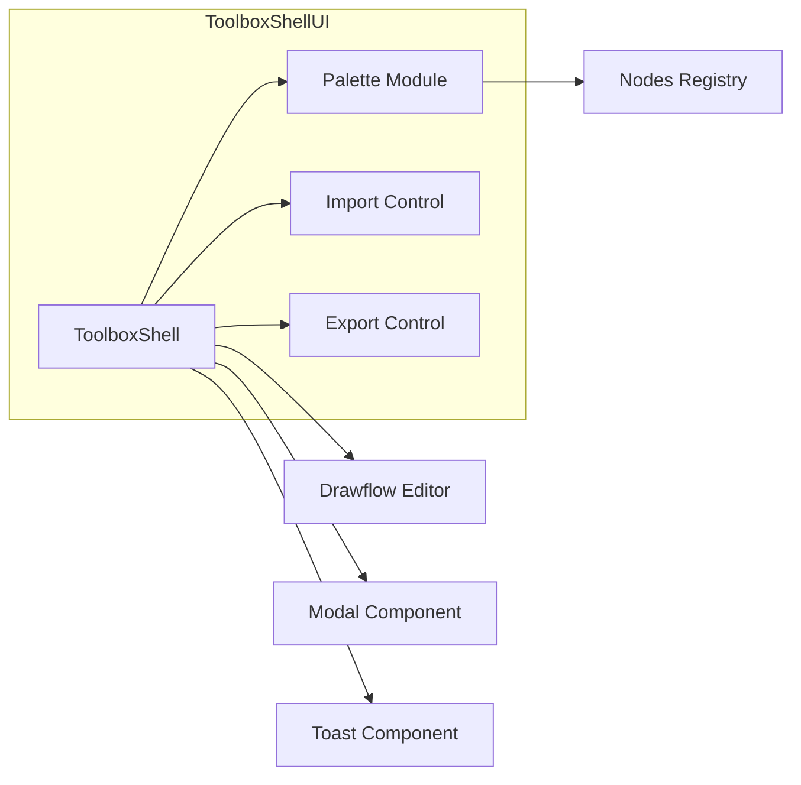
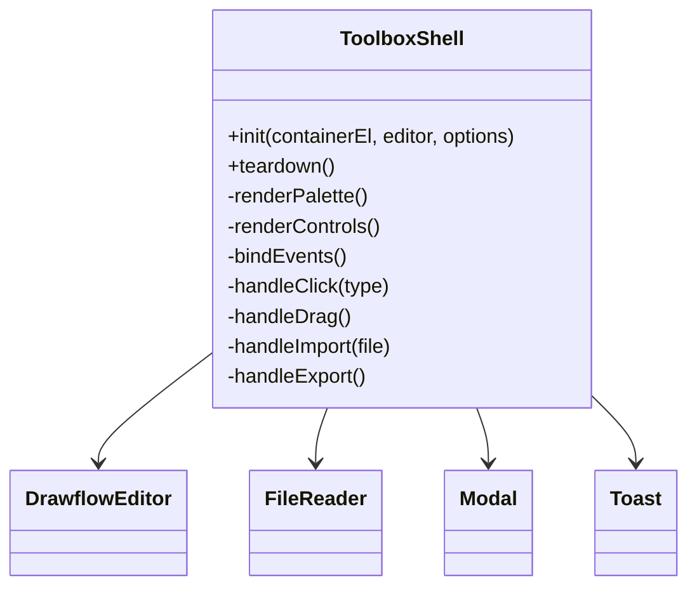
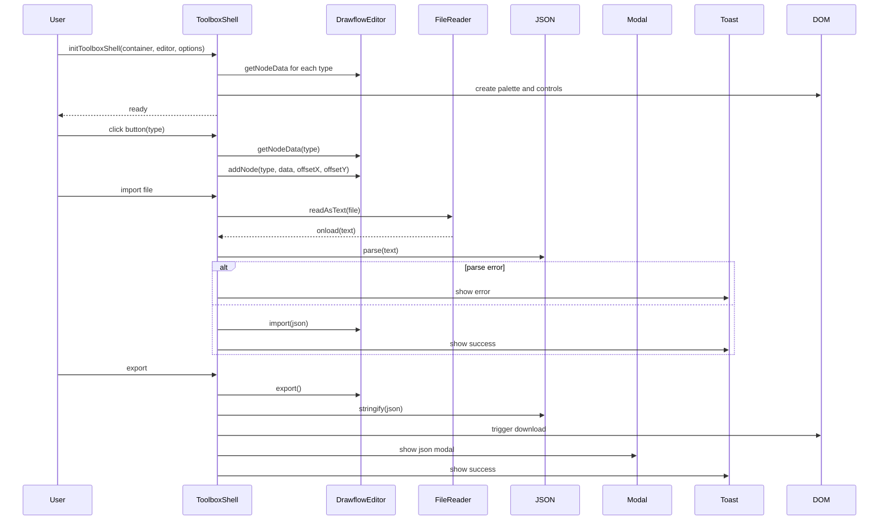
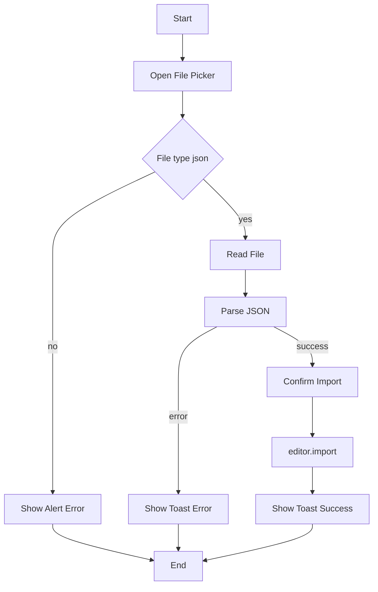
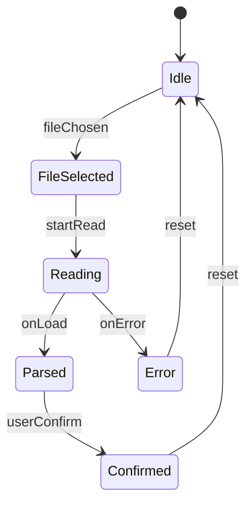

# Toolbox Shell UI Specification

## Purpose Statement
The Toolbox Shell UI renders and manages a palette of Drawflow node buttons alongside Import and Export controls within a supplied container element. It enables users to click or drag-and-drop to add nodes—using correct default data and intended positioning—into an existing Drawflow editor instance, and to import/export the flow as JSON, all without introducing global state, while providing consistent styling, accessibility, logging, and clear user feedback.

## Core Requirements
- Render a scrollable palette of buttons for every registered Drawflow node type inside a provided container, using BEM CSS conventions and project theming. Group buttons by node category if available and support icons or labels as defined in registration.
- Support click-to-add and drag-and-drop interactions: clicking a button invokes `editor.addNode(type, defaultData, fixedOffsetX, fixedOffsetY)`, while dragging a button into the Drawflow canvas adds the node at the drop coordinates.
- Provide an Import control with `accept=".json"` that opens a file picker, supports optional drag-and-drop file input, reads and validates JSON, and on success calls `editor.import(flowJson)` with user confirmation.
- Provide an Export control that calls `editor.export()`, serializes the result to pretty JSON, triggers an automatic download named `drawflow-export-<timestamp>.json`, and displays the JSON in a modal for manual copy.
- Expose a pure ES module API: `initToolboxShell(containerEl: HTMLElement, editor: DrawflowInstance, options?: ToolboxOptions)` that binds all UI, returns a `teardown()` function to remove event listeners and DOM nodes without globals.
- Gracefully handle missing or malformed inputs (absent container or editor, unsupported file types, invalid JSON) by throwing or logging defined errors and displaying user-facing alerts or toast notifications.
- Implement keyboard navigation and ARIA roles/labels for palette and controls to meet basic accessibility requirements.

## Implementation Considerations
- Build as a pure ES module exporting `initToolboxShell(containerEl, editor, options?)` that returns a `teardown()` callback.
- Use only vanilla JS and minimal DOM APIs (`createElement`, `classList`, `addEventListener`, `FileReader`).
- Follow BEM naming (e.g., `.tb-shell`, `.tb-shell__palette`, `.tb-shell__button`) and scope styles via a companion CSS module or inline `<style>` block consistent with project theming.
- Retrieve default node data by calling `editor.getNodeData(type)` if available, or fall back to an internal mapping exposed by `nodes/*` modules.
- On click, call `addNode` at a fixed offset (e.g., center of palette button); on drop, compute canvas-relative coordinates from `event.clientX/Y` and `editor.transform`.
- For Import control, set `<input type="file" accept="application/json">` and optionally attach drag events to the container. Use `FileReader` to read, `JSON.parse()` to validate, catch errors, log raw content, and show user-friendly alerts.
- For Export control, serialize with `JSON.stringify(flow, null,2)`, log the object, then create a `Blob` and use `<a download>` to auto-trigger file download, and reuse or implement a minimal modal with ARIA roles for display.
- Integrate with existing modal/dialog if available (e.g., Micromodal), else implement minimal custom modal with proper focus trapping.
- Implement basic toast or inline notifications; if a global logger instance is passed via `options.logger`, use that (`logger.debug/info`), else default to `console`.
- Add `tabindex` and keyboard handlers (arrow keys, Enter) to palette buttons; set `ARIA-label` to node type name.
- Accept optional configuration (labels text, CSS class prefix, import/export filenames, logger instance) via an `options` parameter.

## Component Dependencies

### Internal Components
- **core/canvas.js** - Provides helper functions for coordinate calculations and canvas transforms.
- **nodes/*** registration modules - Supply available node types, categories, icons, and default data mappings.

### External Libraries
- **drawflow** - Required. The underlying editor instance for node rendering and flow management.

### Configuration Dependencies
None

## Output Files
- `src/ui/toolbox_shell.js` - ES module implementing `initToolboxShell`: renders the node palette and import/export controls, binds events to the Drawflow editor, and provides teardown logic.
- `src/ui/toolbox_shell.css` - Scoped CSS classes for the toolbox shell UI, following BEM conventions and project theming.

## Logging
**Debug:**
- Log the array of registered node types when rendering the palette.
- Log raw file content on import before JSON parsing.
- Log the flow JSON object returned by `editor.export()` before serialization.

**Info:**
- Log successful palette rendering.
- Log successful flow import.
- Log successful flow export and file download trigger.

## Error Handling
- **MissingContainerError**: "Toolbox container element not found". Recovery: Abort initialization and log error.
- **EditorInstanceError**: "Drawflow editor instance is required but not provided". Recovery: Throw error to halt initialization.
- **FileTypeError**: "Unsupported file type for import; only .json is allowed". Recovery: Display user-facing alert and skip import.
- **JSONParseError**: "Failed to parse imported file as JSON". Recovery: Display user-facing alert with parse error and skip import.

## Dependency Integration Considerations
- Ensure the Drawflow editor has been started (`editor.start()`) before calling `initToolboxShell()`.
- Coordinate with `modules/serialization.js` if custom transformations are applied on import/export.
- Test file-picker and drag-and-drop behavior across major browsers for compatibility.
- If reusing a global modal/dialog component (e.g., Micromodal), ensure CSS and markup match its API.

## Diagrams

### Component Diagram
*Shows the Toolbox Shell UI component and its dependencies.*

### Class Diagram
*Highlights the main class, its methods, and collaborators.*

### Sequence Diagram
*Walks through init, add-node, import, and export interactions.*

### Activity Diagram
*Describes the import-flow logic from file pick to final toast.*

### State Diagram
*Models the import control states and transitions.*
