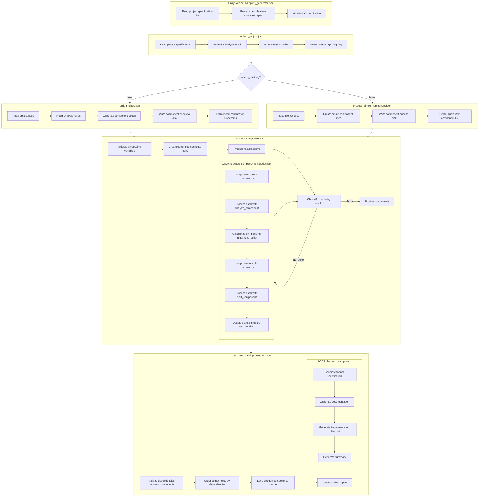

# Blueprint Generator

```mermaid
flowchart TB
    subgraph entry["Entry Recipe: blueprint_generator.json"]
        e1["Read project specification file"] --> e2["Process raw idea into structured spec"]
        e2 --> e3["Write initial specification"]
    end

    entry --> analyze

    subgraph analyze["analyze_project.json"]
        a1["Read project specification"] --> a2["Generate analysis result"]
        a2 --> a3["Write analysis to file"]
        a3 --> a4["Extract needs_splitting flag"]
    end

    analyze --> branch

    branch{"needs_splitting?"}
    branch -->|"true"| split_project
    branch -->|"false"| single_component

    subgraph split_project["split_project.json"]
        sp1["Read project spec"] --> sp2["Read analysis result"]
        sp2 --> sp3["Generate component specs"]
        sp3 --> sp4["Write component specs to disk"]
        sp4 --> sp5["Extract components for processing"]
    end

    subgraph single_component["process_single_component.json"]
        sc1["Read project spec"] --> sc2["Create single component spec"]
        sc2 --> sc3["Write component spec to disk"]
        sc3 --> sc4["Create single-item component list"]
    end

    split_project --> process_components
    single_component --> process_components

    subgraph process_components["process_components.json"]
        pc1["Initialize processing variables"] --> pc2["Create current components copy"]
        pc2 --> pc3["Initialize results arrays"]
        pc3 --> pc4["Check if processing complete"]
        pc4 -->|"Not done"| loop_iteration
        pc4 -->|"Done"| pc7["Finalize components"]

        subgraph loop_iteration["LOOP: process_components_iteration.json"]
            loop1["Loop over current components"] --> loop2["Process each with analyze_component"]
            loop2 --> loop3["Categorize components (final vs to_split)"]
            loop3 --> loop4["Loop over to_split components"]
            loop4 --> loop5["Process each with split_component"]
            loop5 --> loop6["Update state & prepare next iteration"]
        end

        loop_iteration --> pc4
    end

    process_components --> final_processing

    subgraph final_processing["final_component_processing.json"]
        fp1["Analyze dependencies between components"] --> fp2["Order components by dependencies"]
        fp2 --> fp3["Loop through components in order"]

        subgraph component_blueprints["LOOP: For each component"]
            cb1["Generate formal specification"] --> cb2["Generate documentation"]
            cb2 --> cb3["Generate implementation blueprint"]
            cb3 --> cb4["Generate summary"]
        end

        fp3 --> fp4["Generate final report"]
    end
```
