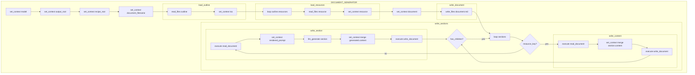

```mermaid
flowchart TD

%% ---------- top level ----------
subgraph DOCUMENT_GENERATOR
    DG0[set_context model] --> DG1[set_context output_root] --> DG2[set_context recipe_root] --> DG3[set_context document_filename]

    DG3 --> LO0
    %% load_outline ----------------------------------------------------------
    subgraph load_outline
        LO0[read_files outline] --> LO1[set_context toc]
    end
    LO1 --> LR0

    %% load_resources --------------------------------------------------------
    subgraph load_resources
        LR0[loop outline.resources] --> LR1[read_files resource] --> LR2[set_context resource]
    end
    LR2 --> DG4[set_context document]

    DG4 --> WD0
    %% write_document --------------------------------------------------------
    subgraph write_document
        WD0[write_files document.md]
    end
    WD0 --> WS0

    %% write_sections (recursive) -------------------------------------------
    subgraph write_sections
        WS0[loop sections] --> WS1{resource_key?}
        WS1 -- yes --> WC0
        WS1 -- no  --> WSSEC0

        %% write_content ----------------------------------------------------
        subgraph write_content
            WC0[execute read_document] --> WC1[set_context merge section.content] --> WC2[execute write_document]
        end

        %% write_section ----------------------------------------------------
        subgraph write_section
            WSSEC0[execute read_document] --> WSSEC1[set_context rendered_prompt] --> WSSEC2[llm_generate section] --> WSSEC3[set_context merge generated.content] --> WSSEC4[execute write_document]
        end

        WC2 --> WS2{has_children?}
        WSSEC4 --> WS2
        WS2 -- yes --> WS0
    end
end
```
