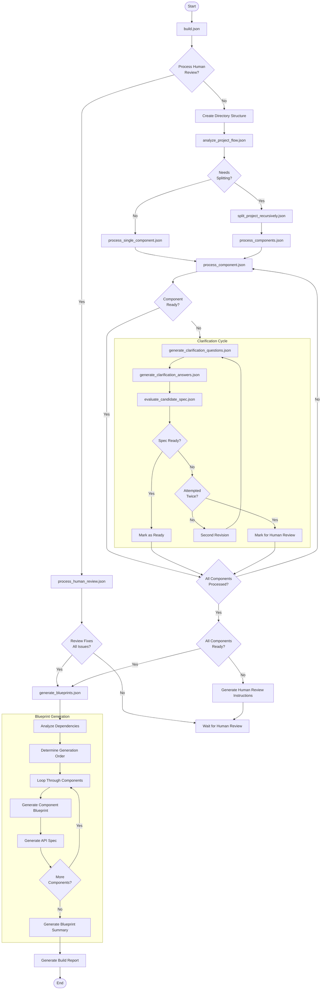

```mermaid
flowchart TD
    Start([Start]) --> build[build.json]
    build --> isReview{Process Human\nReview?}

    isReview -- Yes --> processReview[process_human_review.json]
    isReview -- No --> setupDirs[Create Directory Structure]
    setupDirs --> analyzeProject[analyze_project_flow.json]

    analyzeProject --> needsSplitting{Needs\nSplitting?}
    needsSplitting -- No --> processSingle[process_single_component.json]
    needsSplitting -- Yes --> splitProject[split_project_recursively.json]

    splitProject --> processComponents[process_components.json]
    processSingle --> processComponent
    processComponents --> processComponent[process_component.json]

    processComponent --> componentReady{Component\nReady?}
    componentReady -- Yes --> checkAllDone

    componentReady -- No --> clarificationCycle

    subgraph clarificationCycle[Clarification Cycle]
        direction TB
        genQuestions[generate_clarification_questions.json] --> genAnswers[generate_clarification_answers.json]
        genAnswers --> evalSpec[evaluate_candidate_spec.json]
        evalSpec --> specReady{Spec Ready?}
        specReady -- Yes --> markReady[Mark as Ready]
        specReady -- No --> triedTwice{Attempted\nTwice?}
        triedTwice -- No --> retry[Second Revision]
        retry --> genQuestions
        triedTwice -- Yes --> needsHuman[Mark for Human Review]
    end

    markReady --> checkAllDone{All Components\nProcessed?}
    needsHuman --> checkAllDone

    processReview --> reviewReady{Review Fixes\nAll Issues?}
    reviewReady -- No --> waitHuman[Wait for Human Review]
    reviewReady -- Yes --> genBlueprints

    checkAllDone -- No --> processComponent
    checkAllDone -- Yes --> allReady{All Components\nReady?}

    allReady -- No --> prepareHumanInstructions[Generate Human Review Instructions]
    prepareHumanInstructions --> waitHuman

    allReady -- Yes --> genBlueprints[generate_blueprints.json]

    subgraph blueprintGeneration[Blueprint Generation]
        direction TB
        analyzeDeps[Analyze Dependencies] --> orderComponents[Determine Generation Order]
        orderComponents --> loopComponents[Loop Through Components]
        loopComponents --> createBlueprint[Generate Component Blueprint]
        createBlueprint --> createAPISpec[Generate API Spec]
        createAPISpec --> nextComponent{More\nComponents?}
        nextComponent -- Yes --> loopComponents
        nextComponent -- No --> generateSummary[Generate Blueprint Summary]
    end

    genBlueprints --> analyzeDeps
    generateSummary --> buildReport[Generate Build Report]
    buildReport --> End([End])
```
